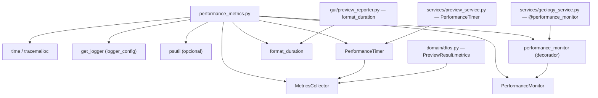

---
tags:
  - secinterp
  - code-walkthrough
  - core
  - metrics
aliases:
  - performance_metrics.py
  - MetricsCollector
  - PerformanceMonitor
  - PerformanceTimer
  - performance_monitor
  - format_duration
cssclass: secinterp-note
---

# `core/performance_metrics.py`

> [!abstract] Resumen en una línea
> Infraestructura de **medición de rendimiento** del plugin: recolecta tiempos y contadores (`MetricsCollector`), cronometra operaciones (`PerformanceTimer`, `PerformanceMonitor.measure_operation`) y decora funciones (`@performance_monitor`) usando sólo la stdlib.

**Ruta**: `core/performance_metrics.py` (321 líneas)
**Clases principales**: `MetricsCollector`, `PerformanceTimer`, `PerformanceMonitor`
**Decorador**: `performance_monitor`
**Capa**: Core (QGIS-agnóstico)
**Tags**: #secinterp #core #metrics

---

## 🎯 ¿Por qué existe este archivo?

Los algoritmos geológicos pueden ser costosos; medir su coste (tiempo y memoria) permite
detectar regresiones y reportar el rendimiento al usuario:

| Problema | Solución |
|----------|----------|
| No hay forma de cuantificar cuánto tarda un servicio | `PerformanceTimer` / `measure_operation` |
| Agregar tiempos y contadores de varias operaciones | `MetricsCollector` (dicts de timings/counts) |
| Instrumentar sin ensuciar el cuerpo de la función | `@performance_monitor` (decorador) |
| Mostrar duraciones legibles al usuario | `format_duration` (µs/ms/s) |

> [!important] Nota arquitectónica
> 100% stdlib (`time`, `tracemalloc`, `contextlib`, `functools`) + `get_logger`. La memoria se
> mide con `psutil` **opcional** (fallback a `0.0` si falta). Viven en el core porque lo usan
> servicios (`geology_service`) y DTOs (`PreviewResult.metrics`).

---

## 🧬 Diagrama de relaciones



> [!tip] Cómo leer
> `performance_metrics` es infraestructura transversal: los servicios la **decoran**, los
> DTOs la **almacenan** (`metrics`), la GUI la **lee** (`format_duration`). Flecha punteada =
> uso opcional (`psutil`).

---

## 📦 Imports — lectura arquitectónica

```python
# core/performance_metrics.py
from __future__ import annotations

import logging
import time
import tracemalloc
from collections.abc import Callable, Generator
from contextlib import contextmanager
from functools import wraps
from typing import Any

from sec_interp.logger_config import get_logger

logger = get_logger(__name__)
```

| # | Observación |
|---|-------------|
| ① | `time.perf_counter()` (monotónico) en lugar de `time.time()` — inmune a ajustes de reloj. |
| ② | `tracemalloc` (stdlib) para el pico de memoria, sin dependencias. |
| ③ | `contextmanager` + `wraps` → context managers y decoradores **idiomáticos**. |
| ④ | `psutil` se importa **dentro** de `_get_memory_usage`, no a nivel de módulo. |

> [!note] `logging` importado pero no usado directamente
> El módulo importa `logging` para el tipo `logging.Logger` de `_setup_logger`; el logging
> real se delega a `get_logger("performance")`.

---

## 🏗️ Inventario de estructura

**Clases (3):**

- `class MetricsCollector` — 6 métodos (agregación de timings/counts/metadata)
- `class PerformanceTimer` — 3 métodos (context manager manual)
- `class PerformanceMonitor` — 5 métodos (time + memoria + stats)

**Funciones (2):**

- `format_duration(seconds) -> str`
- `performance_monitor(func) -> Callable` (decorador)

---

## 📁 Archivos del paquete

| Archivo | Líneas | Rol |
|---|--:|---|
| [[#performance_metricspy|performance_metrics.py]] | 321 | Medición de tiempo/memoria y decorador |

---

## 📖 Recorrido método por método

### `MetricsCollector`

```python
class MetricsCollector:
    def __init__(self) -> None:
        self.timings: dict[str, float] = {}
        self.counts: dict[str, int] = {}
        self.metadata: dict[str, Any] = {}
        self._start_time = time.perf_counter()

    def record_timing(self, operation: str, duration: float) -> None:
        self.timings[operation] = duration

    def record_count(self, metric: str, count: int) -> None:
        self.counts[metric] = count

    def add_metadata(self, key: str, value: Any) -> None:
        self.metadata[key] = value

    def get_summary(self) -> dict[str, Any]:
        return {
            "timings": self.timings,
            "counts": self.counts,
            "metadata": self.metadata,
            "total_duration": time.perf_counter() - self._start_time,
        }

    def clear(self) -> None:
        self.timings.clear()
        self.counts.clear()
        self.metadata.clear()
        self._start_time = time.perf_counter()
```

**Collector** (agregador) de métricas. Tres depósitos (`timings`, `counts`, `metadata`) y un
`_start_time` para la duración total desde la creación (o el último `clear`).

> [!tip] Es el tipo que viaja en los DTOs
> `PreviewResult` lo lleva como campo `metrics: MetricsCollector = field(default_factory=...)`.
> La GUI lo rellena y lo lee sin acoplar el core a Qt.

### `PerformanceTimer`

```python
class PerformanceTimer:
    def __init__(self, operation_name, collector=None, logger_func=None) -> None:
        self.operation_name = operation_name
        self.collector = collector
        self.logger_func = logger_func
        self.start_time: float = 0.0
        self.duration: float = 0.0

    def __enter__(self) -> PerformanceTimer:
        self.start_time = time.perf_counter()
        return self

    def __exit__(self, exc_type, exc_val, exc_tb) -> None:
        self.duration = time.perf_counter() - self.start_time
        if self.collector:
            self.collector.record_timing(self.operation_name, self.duration)
        if self.logger_func:
            self.logger_func(f"{self.operation_name}: {self.duration:.3f}s")
```

Context manager **manual** (sin `@contextmanager`). En `__exit__` registra la duración en un
`MetricsCollector` opcional y/o llama a `logger_func`. `__exit__` no devuelve `False`, así que
**no suprime excepciones** (se propagan tras medir).

### `format_duration`

```python
def format_duration(seconds: float) -> str:
    if seconds < 0.001:
        return f"{seconds * 1_000_000:.0f}µs"
    if seconds < 1.0:
        return f"{seconds * 1000:.0f}ms"
    return f"{seconds:.1f}s"
```

Formatea una duración en una cadena legible con umbrales: `< 1 ms` → microsegundos, `< 1 s` →
milisegundos, resto → segundos con un decimal.

### `PerformanceMonitor`

```python
class PerformanceMonitor:
    def __init__(self, log_file: str = "performance.log") -> None:
        self.logger = self._setup_logger(log_file)
        self.metrics: dict[str, Any] = {}

    def _setup_logger(self, log_file: str) -> logging.Logger:
        return get_logger("performance")

    @contextmanager
    def measure_operation(self, operation_name: str, **metadata: Any) -> Generator[None, None, None]:
        start_time = time.perf_counter()
        start_memory = self._get_memory_usage()
        tracemalloc.start()
        try:
            yield
        finally:
            end_time = time.perf_counter()
            end_memory = self._get_memory_usage()
            try:
                _, peak = tracemalloc.get_traced_memory()
            except RuntimeError:
                _, peak = 0, 0
            tracemalloc.stop()
            duration = end_time - start_time
            memory_diff = end_memory - start_memory
            log_data = {
                "operation": operation_name,
                "duration_seconds": round(duration, 4),
                "memory_mb": round(memory_diff, 2),
                "memory_peak_mb": round(peak / 1024 / 1024, 2),
                "timestamp": time.strftime("%Y-%m-%d %H:%M:%S"),
                **metadata,
            }
            self.logger.info(f"Performance: {log_data}")
            if operation_name not in self.metrics:
                self.metrics[operation_name] = []
            self.metrics[operation_name].append(log_data)
```

Context manager que mide **tiempo y memoria** alrededor de un bloque. Combina
`perf_counter`, RSS de `psutil` y `tracemalloc` (pico de memoria). Acumula cada ejecución en
`self.metrics[operation_name]` para análisis posterior.

> [!tip] `try/finally` garantiza el registro
> Aunque el bloque lance, el `finally` calcula y registra las métricas. El `except
> RuntimeError` cubre el caso de `tracemalloc` no iniciado (llamadas anidadas mal manejadas).

### `_get_memory_usage`

```python
    def _get_memory_usage(self) -> float:
        try:
            import psutil
            process = psutil.Process()
            return process.memory_info().rss / 1024 / 1024
        except ImportError:
            return 0.0
```

Devuelve la memoria RSS del proceso en MB vía `psutil`. Si no está instalado, devuelve
`0.0` (**fallback silencioso**), de modo que la medición de memoria es opcional.

### `get_operation_stats`

```python
    def get_operation_stats(self, operation_name: str) -> dict[str, Any] | None:
        if operation_name not in self.metrics:
            return None
        operation_metrics = self.metrics[operation_name]
        durations = [m["duration_seconds"] for m in operation_metrics]
        memory_usages = [m["memory_mb"] for m in operation_metrics]
        return {
            "count": len(operation_metrics),
            "avg_duration": sum(durations) / len(durations),
            "min_duration": min(durations),
            "max_duration": max(durations),
            "avg_memory": sum(memory_usages) / len(memory_usages),
            "min_memory": min(memory_usages),
            "max_memory": max(memory_usages),
        }
```

Estadísticas agregadas (media/mín/máx) de las múltiples ejecuciones de una operación.
Devuelve `None` si la operación no se ha medido nunca.

### `performance_monitor` — el decorador

```python
def performance_monitor(func: Callable) -> Callable:
    monitor = PerformanceMonitor()

    @wraps(func)
    def wrapper(*args: Any, **kwargs: Any) -> Any:
        operation_name = f"{func.__module__}.{func.__name__}"
        with monitor.measure_operation(
            operation_name, args_count=len(args), kwargs_keys=list(kwargs.keys())
        ):
            return func(*args, **kwargs)

    return wrapper
```

Decorador que envuelve una función y mide cada llamada. Puntos clave:
- `@wraps(func)` conserva nombre, docstring y firma de la función decorada.
- El nombre de operación es `modulo.funcion`, estable y único por símbolo.
- Metadatos `args_count`/`kwargs_keys` enriquecen el log sin inspeccionar valores.
- Se usa en `GeologyService.build_segments` (`@performance_monitor`).

> [!important] El patrón decorador
> `performance_monitor` es un **decorador con estado**: crea un `PerformanceMonitor` por
> función (en el import) y reutiliza su `metrics` entre llamadas. Separa la preocupación
> transversal (medir) del negocio (computar), sin tocar el cuerpo de la función.

---

## 🧬 Comparación de las tres formas de medir

| Mecanismo | Tipo | Cuándo usarlo |
|-----------|------|---------------|
| `MetricsCollector` | agregador (datos) | acumular timings/counts y llevarlos en DTOs |
| `PerformanceTimer` | context manager | medir un bloque puntual y registrarlo |
| `PerformanceMonitor.measure_operation` | context manager (tiempo+memoria) | análisis completo |
| `performance_monitor` | decorador | instrumentar una función entera de forma declarativa |

---

## 🔄 Flujo de datos

| Fase | Entrada | Transformación | Salida |
|------|---------|----------------|--------|
| Decoración | función | `@wraps` + `measure_operation` | wrapper instrumentado |
| Medición | bloque/función | `perf_counter` + `tracemalloc` + `psutil` | `log_data` |
| Agregación | `log_data` | `self.metrics[name].append` | stats media/mín/máx |
| Presentación | `timings` | `format_duration` | `"1.2s"`, `"150ms"`, `"100µs"` |

**Consumidores reales:**

| Consumidor | Qué usa |
|-----------|---------|
| `geology_service.py` | `@performance_monitor` en `build_segments` |
| `preview_service.py` | `PerformanceTimer` |
| `domain/dtos.py` | `MetricsCollector` como campo `PreviewResult.metrics` |
| `gui/preview_reporter.py` | `format_duration`, `MetricsCollector` |
| `gui/dialog_export_manager.py` / `preview_render_mixin.py` | `MetricsCollector`, `PerformanceTimer` |

---

## 🏛️ Patrones de diseño presentes

| Patrón | Dónde | Propósito |
|--------|-------|-----------|
| **Decorator** | `performance_monitor` | instrumentación declarativa |
| **Context Manager** | `PerformanceTimer`, `measure_operation` | delimitar un bloque a medir |
| **Collector / Registro** | `MetricsCollector` | agregar métricas dispersas |
| **Fachada de stdlib** | `PerformanceMonitor` | ocultar `tracemalloc`/`psutil` |

---

## 🧾 Resumen de la API

| Símbolo | Firma | Uso típico |
|---------|-------|------------|
| `MetricsCollector.record_timing` | `(operation, duration) -> None` | registrar duración |
| `MetricsCollector.record_count` | `(metric, count) -> None` | registrar contador |
| `MetricsCollector.get_summary` | `() -> dict` | volcado agregado |
| `PerformanceTimer` | context manager | cronometrar un bloque |
| `format_duration` | `(seconds) -> str` | cadena legible |
| `PerformanceMonitor.measure_operation` | `(name, **metadata)` | tiempo + memoria |
| `PerformanceMonitor.get_operation_stats` | `(name) -> dict | None` | media/mín/máx |
| `performance_monitor` | `(func) -> Callable` | decorar una función |

---

## 🛡️ Manejo de errores

| Caso | Comportamiento |
|------|----------------|
| `psutil` no instalado | `_get_memory_usage` devuelve `0.0` (fallback) |
| `tracemalloc` no iniciado | `except RuntimeError` → pico `0` |
| Excepción en el bloque medido | `finally` registra y **propaga** la excepción |
| Operación nunca medida | `get_operation_stats` devuelve `None` |

> [!warning] `_get_memory_usage` no captura `psutil.Error`
> Sólo captura `ImportError`. Si `psutil` está instalado pero `Process()` falla (p. ej.
> permisos), la excepción se propagaría. Bajo riesgo, pero un `except Exception` sería más
> robusto para una métrica no crítica.

---

## 🧪 Tests asociados

No hay un `test_performance_metrics.py` dedicado. La cobertura llega **indirectamente**:

- `tests/gui/test_dialog_preview_manager.py` — importa e instancia `MetricsCollector`
  (`PreviewResult(..., metrics=MetricsCollector())`).
- `tests/core/test_geology_service.py` — ejercita `build_segments`, que está decorado con
  `@performance_monitor` (verifica que el decorador no altera el retorno).

> [!note] Vacío de cobertura directa
> `format_duration`, `PerformanceTimer` y `get_operation_stats` no tienen tests unitarios
> propios. Son candidatos a un futuro `test_performance_metrics.py` (puro, sin QGIS).

---

## 👀 Observaciones y notas

> [!success] Fortalezas
> - 100% stdlib + `psutil` opcional: funciona sin dependencias pesadas.
> - El decorador separa la medición del negocio de forma limpia (`@wraps`).
> - `try/finally` garantiza el registro incluso ante excepciones.

> [!warning] Puntos de atención
> - `_setup_logger(log_file)` **ignora** el parámetro `log_file` (usa `get_logger("performance")`).
> - `_get_memory_usage` sólo captura `ImportError`, no errores de `psutil` en runtime.
> - `MetricsCollector.record_count` no tiene consumidor visible en el core.

> [!question] Preguntas abiertas
> - ¿Eliminar el parámetro `log_file` muerto de `PerformanceMonitor.__init__`?
> - ¿Añadir `test_performance_metrics.py` para `format_duration` y `PerformanceTimer`?
> - ¿Usar `performance_monitor` en más servicios (preview, estructuras)?

---

## 🔗 Notas relacionadas

- [[Index]] — índice de la bóveda
- [[geology_service]] — `build_segments` decorado con `@performance_monitor`
- [[preview_service]] — usa `PerformanceTimer`
- [[dtos]] — `PreviewResult.metrics` es un `MetricsCollector`
- [[core_utils_geometry_utils]] — los algoritmos geométricos que se quieren medir
- [[measurement]] / [[optimization]] / [[processing]] — candidatos a ser instrumentados

---

*Nota de la bóveda SecInterp Code Walkthrough v2 — v3.9.0*
