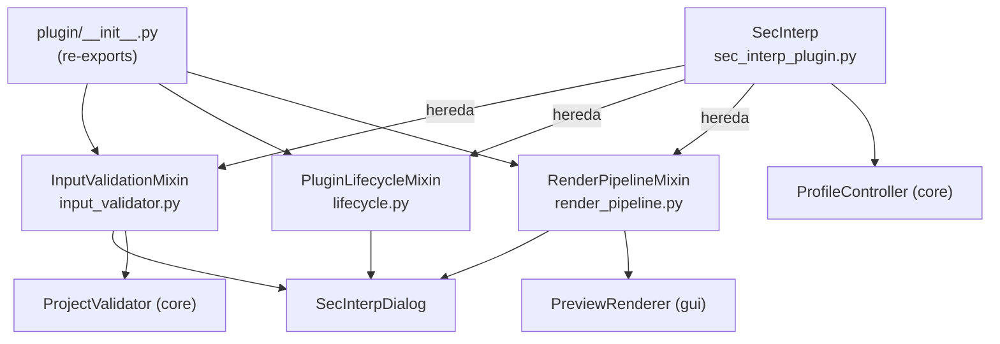
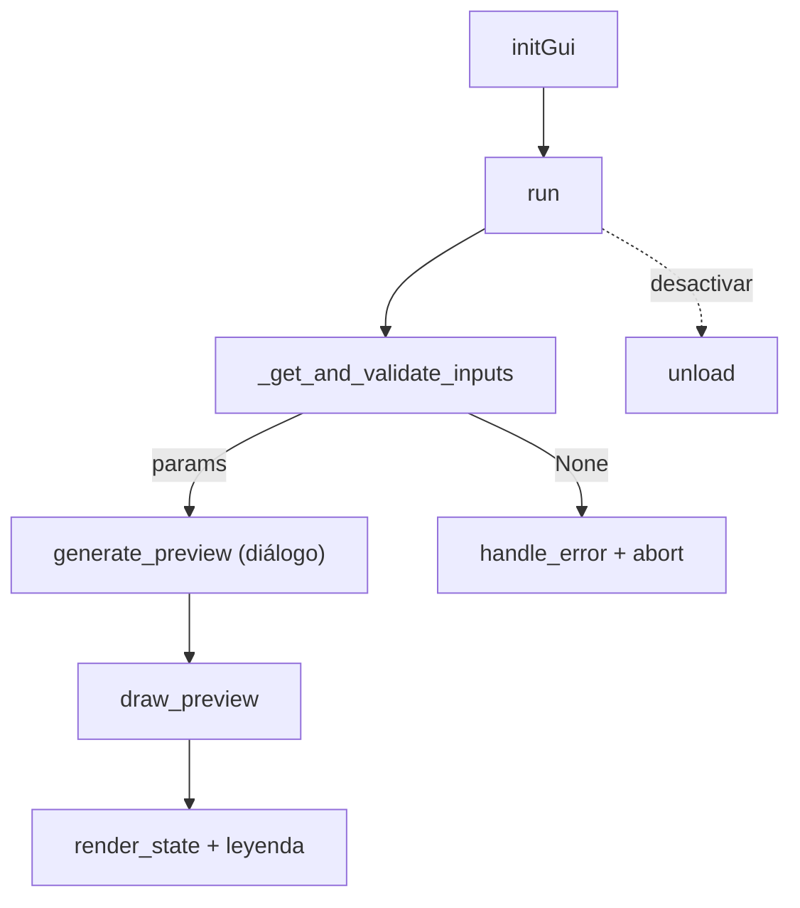

---
tags:
  - secinterp
  - code-walkthrough
  - plugin
aliases:
  - plugin/
  - SecInterp
  - InputValidationMixin
  - PluginLifecycleMixin
  - RenderPipelineMixin
cssclass: secinterp-note
---

# `plugin/` — Mixins del Plugin (Frontera QGIS)

> [!abstract] Resumen en una línea
> Package `plugin/` (4 files): `__init__` re-exporta los tres mixins que componen a `SecInterp` — [[input_validator]] (frontera de validación), [[lifecycle]] (ciclo QGIS) y [[render_pipeline]] (presentación del preview).

**Ruta**: `plugin/` (4 archivos, ~392 líneas)
**Clase principal**: `SecInterp` (huésped en `sec_interp_plugin.py`, compone los tres mixins)
**Capa**: Plugin / GUI (única capa que habla con `iface`, `QAction` y widgets)
**Tags**: #secinterp #plugin

---

## 🎯 ¿Por qué existe este paquete?

`SecInterp` (la clase que QGIS instancia vía `classFactory`) necesita tres
capacidades ortogonales: validar entradas, vivir el ciclo QGIS y dibujar el
preview. Sin el paquete, las tres vivirían en un único `sec_interp_plugin.py`
gigante:

| Problema | Solución |
|----------|----------|
| Una sola clase con validación + ciclo de vida + render es ilegible | Tres mixins de una sola responsabilidad componiendo a `SecInterp` |
| `sec_interp_plugin.py` debe seguir siendo el composition root legible | Delega los tres comportamientos a `plugin/` y solo conserva `__init__` y `save_profile_line` |
| Los mixins deben importarse desde un solo punto | `__init__.py` re-exporta los tres con `__all__` explícito |

> [!important] Nota arquitectónica
> El paquete es un **namespace de composición**, no una capa de cómputo: no define
> lógica geológica ni toca el core salvo vía DTOs (`PreviewParams`) y validadores.
> Los tres mixins operan sobre el estado del huésped (`self.dlg`,
> `self.preview_renderer`, `self.layer_notification_manager`, `self.actions`…).

---

## 🧬 Diagrama de relaciones



> [!tip] Cómo leer
> Flecha sólida = importa/hereda/delega. El huésped `SecInterp` hereda los tres
> mixins; cada mixin colabora con el diálogo y con una pieza distinta (validador,
> renderer, ciclo QGIS).

---

## 📦 Imports — lectura arquitectónica

```python
# plugin/__init__.py
"""Plugin component mixins (lifecycle, input validation, render pipeline)."""

from __future__ import annotations

from .input_validator import InputValidationMixin
from .lifecycle import PluginLifecycleMixin
from .render_pipeline import RenderPipelineMixin

__all__ = ["InputValidationMixin", "PluginLifecycleMixin", "RenderPipelineMixin"]
```

| # | Observación |
|---|-------------|
| ① | El docstring de una línea documenta el contenido completo: lifecycle, validación, render. Sin ambigüedad. |
| ② | Imports relativos (`.input_validator`): es un paquete interno cohesivo, no API pública entre capas. |
| ③ | `__all__` explícito con los tres símbolos: `from sec_interp.plugin import (...)` en `sec_interp_plugin.py` importa exactamente esto. |
| ④ | Sin imports de `qgis.*` ni del core en el `__init__`: el paquete no ejecuta nada al importarse, solo re-exporta. Cero efectos laterales. |
| ⑤ | Orden alfabético de los tres imports (`input_validator`, `lifecycle`, `render_pipeline`): convención que facilita el diff. |

---

## 🏗️ Inventario de estructura

**Símbolos exportados (3, todos mixins sin estado):**

- `InputValidationMixin` — frontera de validación (106 líneas).
- `PluginLifecycleMixin` — ciclo QGIS init → dialog → cleanup (167 líneas).
- `RenderPipelineMixin` — presentación del preview (110 líneas).

El paquete no declara clases, funciones ni constantes propias: todo símbolo con
comportamiento vive en los tres módulos hermanos, documentados en sus notas.

---

## 📁 Archivos del paquete

| Archivo | Líneas | Rol |
|---|--:|---|
| [[#__init__\|__init__.py]] | 9 | Re-exporta los tres mixins; `__all__` explícito |
| [[#InputValidationMixin\|input_validator.py]] | 106 | Frontera Extract + Guard: diálogo → `PreviewParams` → `ProjectValidator` → monitoreo de capas |
| [[#PluginLifecycleMixin\|lifecycle.py]] | 167 | Mecánica QGIS: `initGui`/`run`/`process_data`/`unload` + desconexión determinista |
| [[#RenderPipelineMixin\|render_pipeline.py]] | 110 | Fase Present: filtro `show_*`, exageración vertical, `PreviewRenderer.render`, leyenda |

> [!tip] Anclas de esta tabla
> Cada enlace `[[#Sección|archivo.py]]` apunta a la sección homónima más abajo en
> esta misma nota. Las notas profundas de cada módulo son [[input_validator]],
> [[lifecycle]] y [[render_pipeline]].

---

## 📖 Recorrido módulo por módulo

### __init__

```python
__all__ = ["InputValidationMixin", "PluginLifecycleMixin", "RenderPipelineMixin"]
```

Nueve líneas que cumplen una sola función: convertir tres módulos en una unidad
importable. El consumidor es `sec_interp_plugin.py`:

```python
from sec_interp.plugin import (
    InputValidationMixin,
    PluginLifecycleMixin,
    RenderPipelineMixin,
)


class SecInterp(TranslatableMixin, PluginLifecycleMixin, InputValidationMixin, RenderPipelineMixin):
```

El orden de herencia (`PluginLifecycleMixin` primero) solo define el MRO; como
ningún método colisiona entre mixins, el orden es irrelevante en la práctica pero
conviene no tocarlo.

> [!tip] Cómo verificar que no hay colisiones
> `SecInterp.__mro__` lista el orden de resolución y `[m for m in dir(SecInterp)]`
> permite auditar solapes. Hoy los tres mixins usan prefijos disjuntos (`_get_`,
> `_collect_`, `_disconnect_`, `_calculate_`, `draw_`, `run`, `unload`…), así que
> cada nombre se resuelve en un único mixin.

### InputValidationMixin

Frontera de entrada (detalle completo en [[input_validator]]):

```python
def _get_and_validate_inputs(self) -> PreviewParams | None: ...
def disconnect_layer_notifications(self) -> None: ...
def _collect_active_layers(self, params: PreviewParams) -> dict[str, QgsMapLayer]: ...
```

| Responsabilidad | Delegado |
|-----------------|----------|
| Leer widgets | `self.dlg.get_selected_values()` + `get_preview_options()` |
| Validar primitivas | `PreviewParams.validate()` (banda ≥ 1, buffer ≥ 0) |
| Validar proyecto | `ProjectValidator.validate_all(build_validation_params(params))` |
| Reportar | `self.dlg.handle_error(e, title)` + `return None` |
| Armar monitoreo | `layer_notification_manager.connect(...)` por buckets (`topo`, `section`, `geol`, `struct`, `drill_*`) |

Es el único mixin que habla con el core de validación; los otros dos no importan
nada del core.

### PluginLifecycleMixin

Ciclo de vida QGIS (detalle completo en [[lifecycle]]):

```python
def add_action(icon_path, text, callback, ...) -> QAction: ...
def initGui(self) -> None: ...          # noqa: N802 (nombre impuesto por QGIS)
def run(self) -> None: ...
def process_data(self, inputs=None) -> tuple | None: ...
def unload(self) -> None: ...
def disconnect_signals(self) -> None: ...
def _disconnect_actions(self) -> None: ...
def _disconnect_dialog(self) -> None: ...
```

| Fase QGIS | Método | Efecto |
|-----------|--------|--------|
| Carga | `initGui` | registra la acción "Geological data extraction" → `run` |
| Clic | `run` | reutiliza el diálogo; solo el primer arranque inyecta canvas y conecta `accepted` |
| Aceptar | `process_data` | `preview_manager.generate_preview()` + desempaqueta `(topo, geol, struct)` |
| Salida | `unload` | desconecta señales, limpia renderer, retira menú/toolbar; nunca lanza |

### RenderPipelineMixin

Presentación (detalle completo en [[render_pipeline]]):

```python
def draw_preview(topo_data, geol_data=None, struct_data=None, drillhole_data=None,
                 max_points=1000, vert_exag=None, **kwargs) -> None: ...
def _get_filtered_preview_data(topo, geol, struct, drill, options) -> dict: ...
def _calculate_dip_length(struct_data) -> float | None: ...
```

| Responsabilidad | Fuente |
|-----------------|--------|
| Visibilidad por dominio | banderas `show_topo/geol/struct/drillholes/interpretations` de `get_preview_options()` |
| Exageración vertical | argumento explícito o `page_dem.vertexag_spin` |
| Longitud de buzamiento | `resolución ráster × page_struct.scale_spin`, en unidades de mapa |
| Dibujo | `preview_renderer.render(...)`; si devuelve `canvas=None`, aborta con `debug` |
| Publicación | `dlg.render_state.update(canvas, layers)` + `legend_widget.update_legend(...)` |

Es el mixin más desacoplado: ni siquiera importa `qgis.*`.

---

## 🔄 Flujo de datos

| Fase | Mixin | Entrada | Salida |
|------|-------|---------|--------|
| Registro | `PluginLifecycleMixin.initGui` | `plugin_dir/icon.png` | acción en menú + toolbar |
| Apertura | `PluginLifecycleMixin.run` | clic del usuario | diálogo modal |
| Frontera | `InputValidationMixin._get_and_validate_inputs` | widgets del diálogo | `PreviewParams` válido o `None` |
| Cómputo | (delegado: `PreviewManager` → `ProfileController`) | `PreviewParams` | `cached_data` por dominio |
| Presentación | `RenderPipelineMixin.draw_preview` | datos + opciones `show_*` | escena en canvas + leyenda |
| Salida | `PluginLifecycleMixin.unload` | — | recursos liberados |



---

## 🧭 CRS y contexto de transformación

El paquete **no gestiona CRS**: ningún mixin importa `QgsCoordinateReferenceSystem`
ni crea `QgsCoordinateTransform`. La estrategia es delegar:

| Necesidad | Dónde se resuelve |
|-----------|-------------------|
| `QgsCoordinateTransformContext` del proyecto | `PreviewManager._get_transform_context()` (GUI) |
| Muestreo de elevación sobre el ráster | extractores GUI (`profile_extractor`, `structure_extractor`) |
| Dibujo en coordenadas de sección | `PreviewRenderer.render()` con datos ya proyectados |
| Escala visual (exageración, buzamientos) | `RenderPipelineMixin` con unidades de mapa, sin geodesia |

La frontera es deliberada: el ciclo de vida y la validación no deben saber en qué
proyección se dibuja; solo el cómputo y el renderer la conocen.

---

## 🏛️ Patrones de diseño presentes

| Patrón | Dónde | Propósito |
|--------|-------|-----------|
| **Mixin composition** | `SecInterp` hereda los tres | Componer sin jerarquía profunda |
| **Namespace package** | `__init__.py` re-exportador | Un solo punto de importación |
| **Guard / Boundary** | `InputValidationMixin` | Nada sin validar cruza al cómputo |
| **Plugin entry (QGIS)** | `PluginLifecycleMixin` | `initGui`/`unload` impuestos por el host |
| **Presenter** | `RenderPipelineMixin` | Presentación separada de cómputo y renderer |

---

## 🧾 Resumen de la API

| Símbolo | Proviene de | Heredado por |
|---------|-------------|--------------|
| `InputValidationMixin` | `plugin/input_validator.py` | `SecInterp` |
| `PluginLifecycleMixin` | `plugin/lifecycle.py` | `SecInterp` |
| `RenderPipelineMixin` | `plugin/render_pipeline.py` | `SecInterp` |
| `SecInterp` | `sec_interp_plugin.py` (huésped) | instanciado por `classFactory` en `__init__.py` |

> [!note] Sin símbolos propios
> Todo símbolo con comportamiento está documentado en su nota: [[input_validator]],
> [[lifecycle]], [[render_pipeline]]. Esta nota solo describe la composición.

---

## 🛡️ Manejo de errores

La política del paquete es **fallo suave + apagado silencioso**:

| Mixin | Fallo operativo | Apagado |
|-------|-----------------|---------|
| `InputValidationMixin` | `handle_error` + `return None` (cuatro niveles de `except`, fatales re-lanzados) | `disconnect_layer_notifications` con `getattr` + `suppress` |
| `PluginLifecycleMixin` | `QMessageBox.critical` si no hay diálogo; `warning` si el preview falla | `unload`/`disconnect_*` con `suppress(TypeError, RuntimeError, Exception)` |
| `RenderPipelineMixin` | `warning`/`debug` + `return` (sin excepciones propias) | nada que limpiar (sin estado) |

---

## 🧪 Tests asociados

No existe `tests/plugin/` dedicado; la cobertura del paquete es la suma de sus
colaboradores:

- `tests/core/test_project_validator.py`, `tests/core/test_validation.py`, `tests/core/validation/test_validators.py` — validación que arma [[input_validator]].
- `tests/gui/test_dialog_input_manager.py`, `tests/gui/test_main_dialog_validation_manager.py` — lectura de valores del diálogo.
- `tests/gui/test_dialog_preview_manager.py` — `generate_preview()` usado por `process_data` y llamador de `draw_preview`.
- `tests/gui/renderers/test_renderers.py` — dibujo aguas abajo del pipeline.
- `tests/gui/test_main_dialog_signals_wiring.py`, `tests/gui/test_main_dialog_core.py` — señales y construcción del diálogo que `run` reutiliza.
- `tests/integration/test_preview_pipeline.py`, `tests/integration/test_qgis_smoke.py` — extremo a extremo con y sin QGIS vivo.

> [!note] Hueco de cobertura honesto
> Los tres mixins carecen de tests directos. `_get_filtered_preview_data` y
> `add_action` (con `iface` mockeado) son los candidatos más baratos; `initGui` /
> `unload` / `draw_preview` requieren QGIS vivo o mocks de widgets.

---

## 🧩 El huésped `SecInterp` — lo que NO está en el paquete

Para entender los mixins hay que ver qué les provee `SecInterp` (`sec_interp_plugin.py`,
129 líneas, detalle en [[sec_interp_plugin]]). Su `__init__` construye, en orden:

| Paso | Atributo | Vía |
|------|----------|-----|
| Logging + `iface` + `plugin_dir` | `self.iface`, `self.plugin_dir` | directo |
| Traducciones | `_load_translator()` (locale `QSettings` → `i18n/SecInterp_<loc>.qm`) | directo |
| Renderer y adapters Extract | `self.preview_renderer`, `data_fetcher`, `structure/geology/profile/drillhole_extractor` | `SafeLoader.lazy_load` |
| Orquestador core | `self.controller` (`ProfileController` con los extractores inyectados) | `SafeLoader.lazy_load` con kwargs |
| Monitoreo de capas | `self.layer_notification_manager` (`DataCache` del controller) | `SafeLoader.lazy_load` |
| Exportación | `self.export_service` (`ExportService(controller)`) | `safe_import` + `get_class` |
| Diálogo | `self.dlg` (`SecInterpDialog(iface, self)`) | `safe_import` + `get_class` |
| UI QGIS | `self.actions = []`, `self.menu`, `self.toolbar` (`iface.addToolBar`) | directo |

Además conserva dos métodos propios fuera de los mixins:

- `save_profile_line()` — delega en `self.dlg.export_manager.export_data()`.
- `_load_translator()` — resuelve `SecInterp_<locale>.qm` con fallback a 2 letras.

> [!important] Por qué importa aquí
> Cada `self.dlg`, `self.preview_renderer` o `self.layer_notification_manager` que
> los mixins tocan nace en esta tabla (o queda en `None` si el `SafeLoader` falla,
> de ahí todas las guardas `if`/`hasattr`). El paquete `plugin/` aporta el
> comportamiento; el huésped aporta el estado.

---

## 👀 Observaciones y notas

> [!success] Fortalezas
> - Separación en tres responsabilidades nítidas con un `__init__` mínimo y honesto.
> - Ningún mixin duerme lógica geológica: todo el cómputo está en core/GUI.
> - Limpieza determinista en el ciclo de vida; validación con doble nivel; render sin imports QGIS.
> - `__all__` explícito: el re-export es intencional, no accidental.

> [!warning] Puntos de atención
> - `SecInterp` accede a privados del diálogo (`_load_interpretations`, `_load_user_settings`) desde `run`: el paquete conoce el interior del diálogo.
> - La tupla de `process_data` omite el drillhole aunque el caché lo contiene.
> - Las claves de `get_selected_values()` son un contrato implícito con la validación.
> - `interp` se lee del diálogo en el render mientras el resto llega por parámetros.

> [!question] Preguntas abiertas
> - ¿Merece `tests/plugin/` propio con mocks de `iface` y del diálogo?
> - ¿Documentar `process_data.inputs` (hoy sin uso) como API reservada o eliminarlo?

---

## 🔗 Notas relacionadas

- [[Index]] — índice de la bóveda
- [[sec_interp_plugin]] — huésped `SecInterp`: `__init__`, `save_profile_line`, `_load_translator`
- [[input_validator]] — nota profunda de `input_validator.py`
- [[lifecycle]] — nota profunda de `lifecycle.py`
- [[render_pipeline]] — nota profunda de `render_pipeline.py`
- [[main_dialog]] — el diálogo que los tres mixins operan
- [[controller]] — `ProfileController`, destino del `PreviewParams`
- [[project_validator]] — validación de proyecto del core
- [[validation_extractor]] — `build_validation_params` y `LayerMetadata`
- [[preview_renderer]] — renderer invocado por el pipeline
- [[preview_task_orchestrator]] — orquestación asíncrona del preview
- [[layer_notification_manager]] — monitoreo de capas e invalidación
- [[logger_config]] — `get_logger`

---

*Nota de la bóveda SecInterp Code Walkthrough v2 — v3.8.0*
