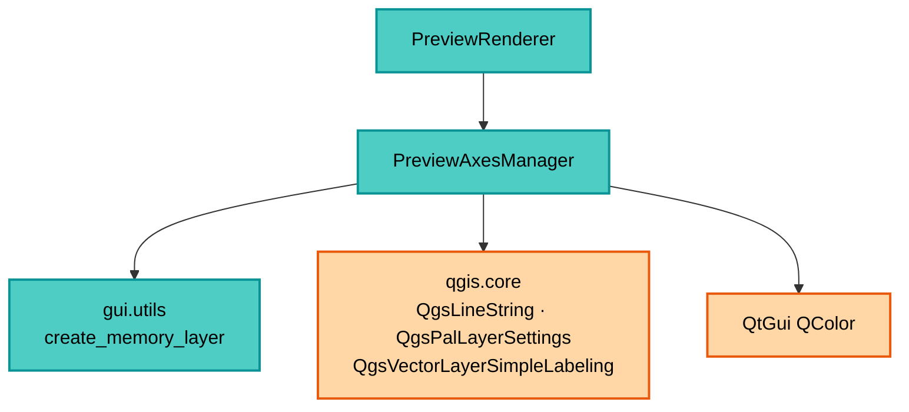

---
tags:
  - secinterp
  - code-walkthrough
  - gui
  - managers
aliases:
  - preview_axes_manager.py
  - PreviewAxesManager
cssclass: secinterp-note
---

# `gui/preview_axes_manager.py`

> [!abstract] Resumen en una línea
> Especialista sin estado que dibuja la rejilla del preview y sus etiquetas: calcula intervalos "agradables" (secuencia 1-2-5), corrige el eje Y por la exageración vertical y coloca labels con `QgsPalLayerSettings` y offsets por cuadrante.

**Ruta**: `gui/preview_axes_manager.py` (204 líneas)
**Clase principal**: `PreviewAxesManager`
**Capa**: GUI (Present · Manager de ejes)
**Tags**: #secinterp #gui #managers

---

## 🎯 ¿Por qué existe este archivo?

Un perfil sin referencias de distancia/elevación es ilegible. Este manager añade el
marco de lectura sin contaminar a [[preview_renderer]] con geometría de rejilla:

| Problema | Solución |
|----------|----------|
| Intervalos arbitrarios (p. ej. 37,4 m) son ilegibles | `get_nice_interval`: secuencia 1-2-5 sobre potencias de 10 |
| El eje Y dibujado está exagerado pero debe rotularse en real | `_compute_grid` divide por `vert_exag` antes de elegir intervalo |
| Rejilla y etiquetas mezcladas complican el Z-order | Dos capas separadas: `create_axes_layer` (líneas) y `create_axes_labels_layer` (puntos) |
| Etiquetas fijas colisionan con la línea del perfil | Offsets por cuadrante vía propiedades data-defined (`quadrant` + expresión `IF`) |
| Recalcular en cada zoom es costoso de diseñar pero barato de ejecutar | Clase sin estado: todo `staticmethod`/`classmethod`, sin caché |

> [!important] Nota arquitectónica
> **Manager stateless de Presentación.** No guarda nada entre llamadas; recibe
> `extent + vert_exag` y devuelve capas listas. [[preview_renderer]] lo trata como
> función pura con esteroides QGIS.

---

## 🧬 Diagrama de relaciones



> [!tip] Cómo leer
> El manager solo depende de utilidades GUI y API QGIS de simbología/etiquetado. No
> conoce el core ni los datos: solo el `extent` ya combinado que le pasa el renderer.

---

## 📦 Imports — lectura arquitectónica

```python
# gui/preview_axes_manager.py
import math

from qgis.core import (
    QgsFeature, QgsGeometry, QgsLineString, QgsLineSymbol, QgsMarkerSymbol,
    QgsPalLayerSettings, QgsPointXY, QgsProperty, QgsPropertyCollection,
    QgsSingleSymbolRenderer, QgsTextFormat, QgsVectorLayer,
    QgsVectorLayerSimpleLabeling,
)
from qgis.PyQt.QtGui import QColor

from sec_interp.gui.utils import create_memory_layer as make_memory_layer
from sec_interp.logger_config import get_logger
```

| # | Observación |
|---|-------------|
| ① | `math` sostiene todo el cálculo: `log10`, `floor`, `ceil` para intervalos y orígenes. |
| ② | El bloque `qgis.core` más largo del subpaquete preview: líneas, símbolos, PAL y labeling. |
| ③ | `QgsLineString([p1, p2])` envuelto en `QgsGeometry(...)`: construcción explícita de geometría. |
| ④ | `QgsProperty`/`QgsPropertyCollection` = etiquetas data-defined (offset por feature). |
| ⑤ | `QColor(0,0,0)` solo para el texto; la rejilla usa color por string (`"200,200,200"`). |
| ⑥ | `make_memory_layer` reutilizado también aquí: coherencia de CRS con la factoría. |
| ⑦ | Cero imports del core: los ejes no dependen de ningún DTO. |

---

## 🏗️ Inventario de estructura

**Clase:** `class PreviewAxesManager` — 4 miembros, todos sin `self` de instancia

- `get_nice_interval(target_step) -> float` (`@staticmethod`)
- `_compute_grid(extent, vert_exag)` (`@classmethod`) → `(x_interval, y_interval, x_start, y_start, y_max_orig)`
- `create_axes_layer(extent, vert_exag=1.0)` (`@classmethod`) → `QgsVectorLayer | None`
- `create_axes_labels_layer(extent, vert_exag=1.0)` (`@classmethod`) → `QgsVectorLayer | None`

**Constantes locales** (dentro de `get_nice_interval`):
- `THRESHOLD_QUARTER = 1.5`, `THRESHOLD_HALF = 3.5`, `THRESHOLD_FULL = 7.5`
- `DIV_ONE = 1.0`, `DIV_TWO = 2.0`, `DIV_FIVE = 5.0`

---

## 📁 Archivos del paquete

| Archivo | Rol respecto al manager |
|---|---|
| `gui/preview_renderer.py` | Llama a `create_axes_layer` + `create_axes_labels_layer` con el extent combinado |
| `gui/preview_layer_factory.py` | Crea las capas de datos que definen ese extent |
| `gui/utils.py` | `create_memory_layer` compartido |
| `gui/preview_render_mixin.py` | El zoom con `preserve_extent` reusa la rejilla del render vigente |

---

## 📖 Recorrido método por método

### `get_nice_interval` — la secuencia 1-2-5

```python
@staticmethod
def get_nice_interval(target_step: float) -> float:
    if target_step <= 0:
        return 100.0
    exponent = math.floor(math.log10(target_step))
    fraction = target_step / (10**exponent)
    THRESHOLD_QUARTER = 1.5
    THRESHOLD_HALF = 3.5
    THRESHOLD_FULL = 7.5
    DIV_ONE = 1.0
    DIV_TWO = 2.0
    DIV_FIVE = 5.0
    if fraction < THRESHOLD_QUARTER:
        nice_fraction = DIV_ONE
    elif fraction < THRESHOLD_HALF:
        nice_fraction = DIV_TWO
    elif fraction < THRESHOLD_FULL:
        nice_fraction = DIV_FIVE
    else:
        nice_fraction = 10.0
    return nice_fraction * (10**exponent)
```

| Entrada | Fracción | Salida |
|---------|----------|--------|
| `target = 37` | `3.7` → [3.5, 7.5) | `5 × 10 = 50` |
| `target = 120` | `1.2` → < 1.5 | `1 × 100 = 100` |
| `target = 900` | `9.0` → ≥ 7.5 | `10 × 100 = 1000` |
| `target ≤ 0` | — | `100.0` (defensivo) |

El `target` típico es `ancho / 5` (≈ 5 divisiones por eje). La guarda `<= 0` evita
`log10(0)` cuando el extent degenera.

### `_compute_grid` — intervalos y orígenes con corrección VE

```python
@classmethod
def _compute_grid(cls, extent, vert_exag):
    width = extent.width()
    height = extent.height()
    x_interval = cls.get_nice_interval(width / 5)
    y_interval = cls.get_nice_interval((height / vert_exag) / 5)
    x_start = math.floor(extent.xMinimum() / x_interval) * x_interval
    y_min_orig = extent.yMinimum() / vert_exag
    y_max_orig = extent.yMaximum() / vert_exag
    y_start = math.floor(y_min_orig / y_interval) * y_interval
    return x_interval, y_interval, x_start, y_start, y_max_orig
```

La clave: `height / vert_exag` devuelve la altura a unidades **reales** antes de elegir
el intervalo Y, y `y_min/max_orig` des-exageran los bordes. Así la rejilla se dibuja en
coordenadas exageradas pero los rótulos muestran elevaciones reales. `x_start`/`y_start`
se anclan al múltiplo inferior (`floor`), para que la rejilla sea estable al hacer pan.

> [!tip] `y_max_orig` viaja en real
> Los creadores la re-exageran al dibujar (`y * vert_exag`). El contrato interno es:
> intervalos X en dibujo, intervalo Y en real, orígenes mixtos documentados en la tupla.

### `create_axes_layer` — líneas de rejilla discontinuas

```python
@classmethod
def create_axes_layer(cls, extent, vert_exag=1.0):
    if not extent:
        return None
    layer = make_memory_layer("LineString", "Axes")
    if layer is None:
        return None
    provider = layer.dataProvider()
    x_interval, y_interval, x_start, y_start, y_max_orig = cls._compute_grid(extent, vert_exag)
    y_floor = y_start * vert_exag
    y_ceil = (math.ceil(y_max_orig / y_interval) * y_interval) * vert_exag
    features = []
    x = x_start
    last_x = x_start
    while x <= extent.xMaximum() + 0.1:  # Small epsilon
        feat = QgsFeature()
        feat.setGeometry(QgsGeometry(QgsLineString(
            [QgsPointXY(x, y_floor), QgsPointXY(x, y_ceil)])))
        features.append(feat)
        last_x = x
        x += x_interval
    y = y_start
    while y <= y_max_orig + 0.1:
        y_draw = y * vert_exag
        feat = QgsFeature()
        feat.setGeometry(QgsGeometry(QgsLineString(
            [QgsPointXY(x_start, y_draw), QgsPointXY(last_x, y_draw)])))
        features.append(feat)
        y += y_interval
    provider.addFeatures(features)
    symbol = QgsLineSymbol.createSimple(
        {"color": "200,200,200", "width": "0.3", "line_style": "dash"})
    layer.setRenderer(QgsSingleSymbolRenderer(symbol))
    return layer
```

| Decisión | Detalle |
|----------|---------|
| Epsilon `+ 0.1` | Incluye la última línea aunque el `float` quede justo bajo el borde |
| `last_x` | Las horizontales terminan en la última vertical real, no en `xMaximum` |
| Sin atributos | `QgsFeature()` vacío: la rejilla no necesita campos |
| Estilo | Gris `200,200,200`, ancho `0.3`, `dash`: visible sin competir con el perfil |

### `create_axes_labels_layer` — puntos invisibles con etiquetas PAL

```python
@classmethod
def create_axes_labels_layer(cls, extent, vert_exag=1.0):
    if not extent:
        return None
    layer = make_memory_layer("Point?field=label:string&field=quadrant:integer",
                              "Axes Labels")
    ...
    # X Axis Labels
    feat.setAttribute("label", f"{x:.0f}")
    feat.setAttribute("quadrant", 7)  # Below
    # Y Axis Labels
    feat.setAttribute("label", f"{y:.0f}")
    feat.setAttribute("quadrant", 3)  # Left
    settings = QgsPalLayerSettings()
    settings.fieldName = "label"
    settings.placement = QgsPalLayerSettings.Placement.OverPoint
    txt_format = QgsTextFormat()
    txt_format.setColor(QColor(0, 0, 0))
    txt_format.setSize(8)
    settings.setFormat(txt_format)
    props = QgsPropertyCollection()
    props.setProperty(QgsPalLayerSettings.Property.OffsetQuad,
                      QgsProperty.fromField("quadrant"))
    props.setProperty(QgsPalLayerSettings.Property.LabelDistance,
                      QgsProperty.fromExpression("IF(quadrant=3, 15, 8)"))
    settings.setDataDefinedProperties(props)
    settings.dist = 8.0  # Fallback
    layer.setLabeling(QgsVectorLayerSimpleLabeling(settings))
    layer.setLabelsEnabled(True)
    symbol = QgsMarkerSymbol.createSimple({"size": "0", "color": "0,0,0,0"})
    layer.setRenderer(QgsSingleSymbolRenderer(symbol))
    return layer
```

| Decisión | Detalle |
|----------|---------|
| Puntos invisibles | Símbolo tamaño 0 transparente: solo existen para anclar etiquetas |
| `label` con `:.0f` | Sin decimales: coherente con intervalos 1-2-5 |
| `quadrant` 7/3 | X debajo, Y a la izquierda (convención PAL) |
| Distancia data-defined | `IF(quadrant=3, 15, 8)`: la Y respira más (15) que la X (8); `dist=8.0` de respaldo |
| Fuente | Arial implícita del sistema, tamaño 8, negra |

---

## 🔄 Flujo de datos

| Fase | Entrada | Transformación | Salida |
|------|---------|----------------|--------|
| Cálculo | `extent` + `vert_exag` | `_compute_grid` | intervalos y orígenes |
| Rejilla | intervalos | bucles vertical/horizontal | capa `Axes` discontinua |
| Etiquetas | mismos intervalos | puntos + `label`/`quadrant` + PAL | capa `Axes Labels` |
| Z-order | ambas capas | renderer: `[labels, *datos, axes]` | labels arriba, rejilla abajo |
| Re-zoom | nuevo extent | re-render completo | rejilla recalculada |

---

## 🏛️ Patrones de diseño presentes

| Patrón | Dónde | Propósito |
|--------|-------|-----------|
| **Stateless manager** | todo `classmethod`/`static` | Sin ciclo de vida ni caché |
| **Nice numbers** | `get_nice_interval` | Ejes legibles (1-2-5) |
| **Dual-layer** | rejilla vs etiquetas | Z-order independiente |
| **Data-defined labeling** | `quadrant` + `IF(...)` | Offsets por feature sin código |
| **Invisible anchor** | marcador tamaño 0 | Etiquetas sin símbolos |

---

## 🧾 Resumen de la API

| Símbolo | Firma | Uso típico |
|---------|-------|------------|
| `PreviewAxesManager` | sin constructor útil | Llamadas de clase |
| `get_nice_interval` | `(target_step: float) -> float` (static) | Test unitario directo |
| `_compute_grid` | `(extent, vert_exag) -> tuple` (classmethod) | Base de ambas capas |
| `create_axes_layer` | `(extent, vert_exag=1.0) -> QgsVectorLayer \| None` | Rejilla |
| `create_axes_labels_layer` | `(extent, vert_exag=1.0) -> QgsVectorLayer \| None` | Etiquetas |

---

## 🛡️ Manejo de errores

| Situación | Comportamiento |
|-----------|----------------|
| `extent` falsy | `return None` (ambos creadores) |
| `make_memory_layer` → `None` | `return None` |
| `target_step ≤ 0` | intervalo `100.0` por defecto |
| Extent degenerado (ancho 0) | intervalo defensivo + bucle de una línea |

> [!note] Sin excepciones propias
> Los fallos blandos devuelven `None` y el renderer los filtra de la lista final.

---

## 🧪 Tests asociados

- `tests/gui/test_preview_components.py` — `TestPreviewComponents`: intervalos nice, capas de ejes y etiquetas con `QgsRectangle` mock.
- `tests/gui/test_preview_renderer_custom.py` — la rejilla como parte del pipeline `render`.
- `tests/core/test_preview_service.py` — el extent nace de `result.topo` (contrato aguas arriba).

---

## 👀 Observaciones y notas

> [!success] Fortalezas
> - Corrección VE rigurosa: se dibuja exagerado, se rotula en real.
> - Secuencia 1-2-5 con umbrales nombrados (`THRESHOLD_*`, `DIV_*`).
> - Etiquetas data-defined sin lógica por feature en Python.

> [!warning] Puntos de atención
> - Epsilon `0.1` en unidades de mapa: correcto en metros, excesivo si el perfil usa grados o milímetros.
> - `f"{x:.0f}"` pierde decimales en perfiles pequeños (intervalos < 1 m muestran etiquetas repetidas).
> - Los nombres "Axes" / "Axes Labels" no pasan por `translate` (a diferencia de la factoría).
> - `last_x` como borde derecho deja la rejilla sin cerrar si solo hay una línea vertical.

> [!question] Preguntas abiertas
> - ¿Epsilon relativo (`intervalo × 1e-6`) en vez de `0.1` absoluto?
> - ¿Formato de etiqueta adaptativo (`:.0f` vs `:.1f`) según el intervalo?

---

## 📐 Ejemplo numérico

Perfil de 2400 m de largo, rango de elevación real 180 m, `vert_exag = 2.0`:

| Magnitud | Cálculo | Valor |
|----------|---------|-------|
| Ancho | `extent.width()` | `2400` |
| Alto dibujado | `extent.height()` | `360` (= 180 × 2) |
| Target X | `2400 / 5` | `480` → nice `500` |
| Target Y | `(360 / 2) / 5` | `36` → nice `50` (real) |
| Verticales | `0, 500, 1000, 1500, 2000` | 5 líneas |
| Horizontales | cada 50 m reales → 100 px dibujados | 4–5 líneas |
| Rótulos Y | `f"{y:.0f}"` sobre `y` real | `... 100, 150, 200 ...` |

### Umbrales en acción

| `target_step` | Fracción | Rama | Nice |
|---------------|----------|------|------|
| `480` | `4.8` en `10²` | [3.5, 7.5) → 5 | `500` |
| `36` | `3.6` en `10¹` | [3.5, 7.5) → 5 | `50` |
| `0.02` | `2.0` en `10⁻²` | [1.5, 3.5) → 2 | `0.02` |
| `0` o negativo | — | guarda defensiva | `100.0` |

> [!note] El rótulo miente bien
> La línea de 150 m reales se dibuja a `y = 300` pero se rotula `150`: el usuario lee
> elevación real sobre geometría exagerada. Ese es el contrato visual del manager.

---

## 🔗 Notas relacionadas

- [[Index]] — índice de la bóveda
- [[preview_renderer]] — consume ambas capas y fija el Z-order
- [[preview_layer_factory]] — capas de datos que definen el extent
- [[preview_page]] — canvas donde se muestra la rejilla
- [[vertical_exaggeration_service]] — el `vert_exag` corregido aquí
- [[dtos]] — `PreviewResult` origen del extent
- [[dialog_preview_manager]] — dueño del renderer

---

*Nota de la bóveda SecInterp Code Walkthrough v2 — v3.9.1*
