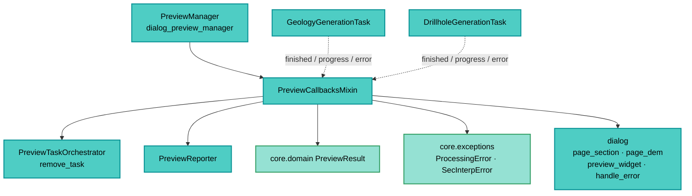

---
tags:
  - secinterp
  - code-walkthrough
  - gui
  - preview
aliases:
  - preview_callbacks_mixin.py
  - PreviewCallbacksMixin
cssclass: secinterp-note
---

# `gui/preview_callbacks_mixin.py`

> [!abstract] Resumen en una línea
> Mixin que recibe las señales de los `QgsTask` async (geología y sondajes): cachea cada resultado, re-renderiza, refresca el informe vía `PreviewReporter` y convierte errores en `ProcessingError` traducidos.

**Ruta**: `gui/preview_callbacks_mixin.py` (127 líneas)
**Clase principal**: `PreviewCallbacksMixin`
**Capa**: GUI (Present · Mixin de callbacks async)
**Tags**: #secinterp #gui #preview

---

## 🎯 ¿Por qué existe este archivo?

Los slots `_on_*` hubieran engordado a [[dialog_preview_manager]] más allá del límite
de 300 líneas para diálogos (ver Stop Conditions de GUI). Este mixin los aísla:

| Problema | Solución |
|----------|----------|
| El manager mezcla ciclo de vida, render y callbacks async | Mixin dedicado a las seis señales + dos ayudantes |
| El resultado async llega en formatos distintos (lista vs tupla) | Validación por rama: `isinstance(results, list)` vs tupla ≥ 2 |
| Cada llegada debe refrescar canvas e informe | `update_from_checkboxes()` + `_update_results_display()` |
| Los errores de fondo llegan como `str` | Se envuelven en `ProcessingError` traducido vía `handle_error` |
| Excepciones en slots Qt son silenciosas/fatales | Doble `except`: `SecInterpError` & cía con traza, genérico como crítico |

> [!important] Nota arquitectónica
> **Mixin de Present sin estado propio.** No define `__init__`: opera sobre atributos
> del manager (`cached_data`, `orchestrator`, `metrics`, `dialog`, `last_result`).
> Solo tiene sentido compuesto en `PreviewManager`.

---

## 🧬 Diagrama de relaciones



> [!tip] Cómo leer
> Flecha sólida = usa/llama; punteada = señal Qt entrante. El mixin es el extremo
> receptor del cableado que monta el orquestador.

---

## 📦 Imports — lectura arquitectónica

```python
# gui/preview_callbacks_mixin.py
from typing import Any

from sec_interp.core.domain import PreviewResult
from sec_interp.core.exceptions import ProcessingError, SecInterpError
from sec_interp.logger_config import get_logger

from .preview_reporter import PreviewReporter
```

| # | Observación |
|---|-------------|
| ① | Cero `qgis.*`: los slots corren en el hilo UI pero no tocan API QGIS directamente. |
| ② | `PreviewResult` se reconstruye desde la caché para el informe (no viaja en la señal). |
| ③ | `ProcessingError` envuelve errores async; `SecInterpError` acota el `except` esperado. |
| ④ | Único import GUI: `PreviewReporter` (formato, no widgets). |
| ⑤ | `Any` en los payloads de señal: el task emite `object` y cada slot valida la forma. |

---

## 🏗️ Inventario de estructura

**Clase:** `class PreviewCallbacksMixin` — 8 métodos, sin `__init__`

**Ayudantes:**
- `_get_buffer_distance() -> float`
- `_update_results_display() -> None`

**Slots de geología:**
- `_on_geology_finished(results)`
- `_on_geology_progress(progress: float)`
- `_on_geology_error(error_msg: str)`

**Slots de sondajes:**
- `_on_drillhole_finished(result)`
- `_on_drillhole_progress(progress: float)`
- `_on_drillhole_error(error_msg: str)`

---

## 📁 Archivos del paquete

| Archivo | Rol respecto al mixin |
|---|---|
| `gui/dialog_preview_manager.py` | `PreviewManager`: lo compone y le da estado |
| `gui/preview_task_orchestrator.py` | Conecta estas señales en cada `start_*` |
| `gui/preview_reporter.py` | Formatea el informe refrescado |
| `gui/preview_render_mixin.py` | `update_from_checkboxes` y `_resolve_vertical_exaggeration` usados aquí |
| `gui/preview_state.py` | `PreviewCache` (`cached_data`) donde escribe |
| `gui/tasks/geology_task.py` | Emite las tres señales de geología |
| `gui/tasks/drillhole_task.py` | Emite las tres señales de sondajes |

---

## 📖 Recorrido método por método

### `_get_buffer_distance` — buffer con fallback

```python
def _get_buffer_distance(self) -> float:
    return self.dialog.page_section.buffer_spin.value()
```

Lee el spinbox de la página de sección en cada informe: el `PreviewResult`
reconstruido lleva siempre el buffer vigente, no el del cálculo original.

### `_on_geology_finished` — cachear lista de segmentos

```python
def _on_geology_finished(self, results: Any) -> None:
    try:
        if results and isinstance(results, list):
            self.cached_data["geol"] = results
            logger.info(f"Async geology finished: {len(results)} segments")
        else:
            self.cached_data["geol"] = None
            logger.debug("Geology task returned no results or invalid format.")
        self.update_from_checkboxes()
        self._update_results_display()
        self.orchestrator.remove_task(self.orchestrator.geology_task)
    except (AttributeError, TypeError, ValueError, SecInterpError) as e:
        logger.exception(f"Error updating UI after async geology: {e}")
    except Exception as e:
        logger.exception(f"Unexpected critical error after async geology: {e}")
```

| Paso | Detalle |
|------|---------|
| Validación | Solo `list` no vacía se cachea; cualquier otra forma → `None` |
| Refresco doble | Re-render (`update_from_checkboxes`) + informe (`_update_results_display`) |
| Ancla | `remove_task` libera la referencia del orquestador |
| Errores | Esperados con traza; inesperados marcados "critical", ambos sin propagar (slots Qt) |

### `_update_results_display` — reconstruir e informar

```python
def _update_results_display(self) -> None:
    topo = self.cached_data.get("topo")
    if not topo:
        return
    result = PreviewResult(
        topo=topo,
        geol=self.cached_data.get("geol"),
        struct=self.cached_data.get("struct"),
        drillhole=self.cached_data.get("drillhole"),
        buffer_dist=self._get_buffer_distance(),
    )
    auto_vert_exag = self.dialog.page_dem.auto_ve_check.isChecked()
    vert_exag = self._resolve_vertical_exaggeration()
    self.dialog.page_dem.set_auto_ve(vert_exag if auto_vert_exag else None)
    msg = PreviewReporter.format_results_message(
        result, self.metrics, vert_exag=vert_exag, auto_vert_exag=auto_vert_exag)
    self.dialog.preview_widget.results_text.setPlainText(msg)
    self.last_result = result
```

Sin topo no hay informe (guarda temprana): los callbacks async sin topografía base no
pintan texto parcial. `set_auto_ve(ve|None)` sincroniza el display del factor
adaptativo (ver [[vertical_exaggeration_service]]), y `last_result` alimenta el VE
auto del próximo render.

### `_on_geology_progress` / `_on_drillhole_progress` — texto de progreso

```python
def _on_geology_progress(self, progress: float) -> None:
    self.dialog.preview_widget.results_text.setPlainText(
        self.tr("Generating Geology: {}%...").format(progress))

def _on_drillhole_progress(self, progress: float) -> None:
    self.dialog.preview_widget.results_text.setPlainText(
        self.tr("Generating Drillholes: {:.1f}%...").format(progress))
```

Sobrescriben `results_text` con el porcentaje (vía `self.tr`, traducible). Nótese la
asimetría heredada: geología sin decimales, sondajes con `{:.1f}`.

### `_on_geology_error` / `_on_drillhole_error` — envolver en dominio

```python
def _on_geology_error(self, error_msg: str) -> None:
    logger.error(f"Geology Task Error: {error_msg}")
    error = ProcessingError(self.tr("Geology processing failed: {}").format(error_msg))
    self.dialog.handle_error(error, self.dialog.tr("Geology Error"))

def _on_drillhole_error(self, error_msg: str) -> None:
    logger.error(f"Drillhole Task Error: {error_msg}")
    error = ProcessingError(self.tr("Drillhole processing failed: {}").format(error_msg))
    self.dialog.handle_error(error, self.dialog.tr("Drillhole Error"))
```

El `str` del fondo se eleva a `ProcessingError` (jerarquía [[exceptions]]) con mensaje
y título traducidos, y se entrega a `dialog.handle_error` (messageBar/toast central).

### `_on_drillhole_finished` — desempaquetar tupla

```python
def _on_drillhole_finished(self, result: Any) -> None:
    if not result:
        logger.debug("Drillhole task returned no results.")
        return
    MIN_RESULT_PARTS = 2
    try:
        if isinstance(result, tuple) and len(result) >= MIN_RESULT_PARTS:
            _, drill_part = result[:MIN_RESULT_PARTS]
            self.cached_data["drillhole"] = drill_part
            logger.info(f"Async Drillholes finished: {len(drill_part)} holes")
        else:
            logger.warning(f"Unexpected result format from drillhole task: {type(result)}")
            return
        self.update_from_checkboxes()
        self._update_results_display()
        self.orchestrator.remove_task(self.orchestrator.drillhole_task)
    except (AttributeError, TypeError, ValueError, SecInterpError) as e:
        logger.exception(f"Error syncing UI after async drillhole: {e}")
    except Exception as e:
        logger.exception(f"Unexpected critical error after async drillhole: {e}")
```

El task devuelve `(geol_data_all, drillhole_data_all)`; aquí solo interesa la segunda
parte (`result[:2]` tolera tuplas más largas). Formato inesperado → `warning` y
retorno sin tocar la caché (no se corrompe el preview vigente).

---

## 🔄 Flujo de datos

| Fase | Entrada | Transformación | Salida |
|------|---------|----------------|--------|
| Señal finish | `list` (geol) / tupla (sondajes) | validación de forma | `cached_data["geol"/"drillhole"]` |
| Re-render | caché actualizada | `update_from_checkboxes` | canvas con la rama nueva |
| Informe | caché + VE + métricas | `_update_results_display` | `results_text` + `last_result` |
| Progreso | `float` 0–100 | `setPlainText` | porcentaje visible |
| Error | `str` del fondo | `ProcessingError` + `handle_error` | mensaje al usuario |
| Ancla | task terminada | `orchestrator.remove_task` | referencia liberada |

---

## 🏛️ Patrones de diseño presentes

| Patrón | Dónde | Propósito |
|--------|-------|-----------|
| **Mixin** | la clase | Partir el manager sin herencia real |
| **Slot (Observer Qt)** | `_on_*` | Reacción a señales sin polling |
| **Validate-then-cache** | finished | Formas inesperadas no corrompen caché |
| **Error elevation** | `_on_*_error` | `str` → `ProcessingError` de dominio |
| **Double except** | finished | Esperado vs crítico, ambos logueados |

---

## 🧾 Resumen de la API

| Símbolo | Firma | Uso típico |
|---------|-------|------------|
| `PreviewCallbacksMixin` | sin `__init__` | Compuesto en `PreviewManager` |
| `_on_geology_finished` | `(results: Any)` | Slot de geología |
| `_on_drillhole_finished` | `(result: Any)` | Slot de sondajes |
| `_on_geology_progress` | `(progress: float)` | Progreso geología |
| `_on_drillhole_progress` | `(progress: float)` | Progreso sondajes |
| `_on_geology_error` | `(error_msg: str)` | Error geología |
| `_on_drillhole_error` | `(error_msg: str)` | Error sondajes |
| `_update_results_display` | `()` | Reconstruir informe |
| `_get_buffer_distance` | `() -> float` | Buffer vigente |

---

## 🛡️ Manejo de errores

| Situación | Comportamiento |
|-----------|----------------|
| Resultado con forma inesperada | `None` o retorno sin tocar caché |
| Fallo refrescando UI | `logger.exception` (esperado) o "critical" (genérico) |
| Error del fondo | `ProcessingError` traducido + `handle_error` |
| Sin topo en caché | informe omitido en silencio |

---

## 🧪 Tests asociados

- `tests/gui/test_dialog_preview_manager.py` — slots con resultados mock y verificación de caché + informe.
- `tests/gui/test_preview_task_orchestrator.py` — cableado de estas señales.
- `tests/gui/tasks/test_geology_task.py`, `tests/gui/tasks/test_drillhole_task.py` — payloads reales emitidos.
- `tests/core/test_preview_service.py` — forma de `geol`/`drillhole` cacheada.

---

## 👀 Observaciones y notas

> [!success] Fortalezas
> - Validación de forma antes de cachear: un task corrupto no rompe el preview.
> - Informe reconstruido desde caché: coherente aunque lleguen ramas en desorden.
> - Errores elevados a dominio con i18n y canal central (`handle_error`).

> [!warning] Puntos de atención
> - Formatos asimétricos de progreso (`{}` vs `{:.1f}`).
> - `_on_drillhole_finished` retorna sin `remove_task` ante formato inesperado: el ancla sobrevive hasta el próximo `cancel_active_tasks`.
> - `last_result` se fija en `_update_results_display`, no en el render: un preview sin topo deja el VE auto con el resultado anterior.

> [!question] Preguntas abiertas
> - ¿Unificar el formato de progreso en un ayudante común?
> - ¿Liberar el ancla también en la rama de formato inesperado?

---

## 🔀 Matriz de señales

| Señal | Slot | Payload | Efecto en caché |
|-------|------|---------|-----------------|
| `geology.finished_with_results` | `_on_geology_finished` | `list[GeologySegment]` | `cached_data["geol"]` |
| `geology.progress_changed` | `_on_geology_progress` | `float` | ninguno (texto) |
| `geology.error_occurred` | `_on_geology_error` | `str` | ninguno (diálogo de error) |
| `drillhole.finished_with_results` | `_on_drillhole_finished` | `(geol_all, drill_all)` | `cached_data["drillhole"]` |
| `drillhole.progress_changed` | `_on_drillhole_progress` | `float` | ninguno (texto) |
| `drillhole.error_occurred` | `_on_drillhole_error` | `str` | ninguno (diálogo de error) |

---

## ⏱️ Orden de llegada y re-entrada

Las ramas async terminan en cualquier orden; el diseño lo tolera:

| Escenario | Comportamiento |
|-----------|----------------|
| Geología antes que sondajes | dos renders: uno con geol, otro con geol+sondajes |
| Sondajes antes que geología | simétrico: primero drillhole, luego ambas |
| Doble `finished` (reintento) | la caché se sobrescribe; el render es idempotente |
| `finished` tras cerrar | imposible si `cancel_active_tasks` corrió al cerrar |
| `progress` tras `finished` | el informe final sobrescribe el texto de progreso |
| Error en una rama | la otra sigue: preview parcial con "No data" en la fallida |

> [!tip] Idempotencia como contrato
> `update_from_checkboxes` + `_update_results_display` pueden correrse N veces con la
> misma caché: el resultado visible es siempre el último estado completo.

---

## 🧪 Formas de payload aceptadas

| Payload | Rama | Decisión del slot |
|---------|------|-------------------|
| `list` no vacía | geología | cachea |
| `list` vacía / `None` / otro tipo | geología | `cached_data["geol"] = None` |
| tupla `len ≥ 2` | sondajes | cachea `result[1]` |
| tupla corta / no tupla / `None` | sondajes | `warning`/`debug`, caché intacta |
| `float` 0–100 | progreso | texto en `results_text` |
| `str` | error | `ProcessingError` + `handle_error` |

---

## 🔗 Notas relacionadas

- [[Index]] — índice de la bóveda
- [[dialog_preview_manager]] — manager que compone el mixin
- [[preview_task_orchestrator]] — conecta estas señales
- [[preview_render_mixin]] — `update_from_checkboxes`, VE y LOD
- [[preview_reporter]] — informe refrescado aquí
- [[preview_state]] — caché escrita aquí
- [[drillhole_task]] / [[geology_task]] — emisores de las señales
- [[vertical_exaggeration_service]] — display auto del VE
- [[preview_page]] — `results_text` destino

---

*Nota de la bóveda SecInterp Code Walkthrough v2 — v3.9.0*
