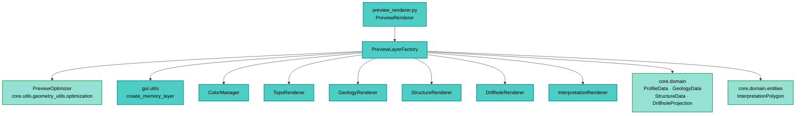

---
tags:
  - secinterp
  - code-walkthrough
  - gui
  - preview
aliases:
  - preview_layer_factory.py
  - PreviewLayerFactory
cssclass: secinterp-note
note_lines: 700
---

# `gui/preview_layer_factory.py`

> [!abstract] Resumen en una línea
> Factoría que convierte cada rama del `PreviewResult` (topografía, geología, estructuras, sondajes, interpretaciones) en capas de memoria QGIS con estilo aplicado, aplicando exageración vertical y diezmo LOD antes de entregarlas al canvas.

**Ruta**: `gui/preview_layer_factory.py` (471 líneas)
**Clase principal**: `PreviewLayerFactory`
**Capa**: GUI (Present · Factory + Adapter QGIS)
**Tags**: #secinterp #gui #preview

---

## 🎯 ¿Por qué existe este archivo?

El core produce datos puros (`PreviewResult` con listas de tuplas y DTOs) y el canvas
solo entiende `QgsVectorLayer`. Esta factoría es el puente entre ambos mundos:

| Problema | Solución |
|----------|----------|
| El `PreviewResult` no se puede mostrar directamente en el canvas | Un método `create_*_layer` por cada rama del resultado |
| Cada rama necesita simbología distinta (policromía, unidades, rumbos) | Delegación en renderers especializados (`topo`, `geology`, `structure`, `drillhole`, `interpretation`) |
| Perfiles con miles de puntos colapsan el render | Diezmo vía `PreviewOptimizer` (`decimate` / `adaptive_sample`) con `max_points` |
| La exageración vertical debe aplicarse al dibujar, no al calcular | `_apply_exaggeration` multiplica `e * vert_exag` en la conversión a `QgsPointXY` |
| Geometrías con 0–1 puntos rompen `fromPolylineXY` | Guardas `MIN_REQUIRED_POINTS` que devuelven `None` |

> [!important] Nota arquitectónica
> **Factory + Adapter de Presentación.** Vive íntegramente en la fase *Present* del
> patrón Extract-then-Compute: nunca calcula geología, solo traduce DTOs del core a
> objetos QGIS y les aplica estilo. Es el único lugar que sabe construir las capas
> temporales del preview.

---

## 🧬 Diagrama de relaciones



> [!tip] Cómo leer
> Flecha sólida = importa/delega. La factoría no hereda de nadie: compone seis
> colaboradores (un color manager + cinco renderers) y los coordina por método.

---

## 📦 Imports — lectura arquitectónica

```python
# gui/preview_layer_factory.py
import math
from typing import TYPE_CHECKING, Any

from qgis.core import QgsFeature, QgsGeometry, QgsPointXY, QgsVectorLayer
from qgis.PyQt.QtGui import QColor

from sec_interp.core.domain import DrillholeProjection, GeologyData, ProfileData, StructureData
from sec_interp.core.domain.entities import InterpretationPolygon
from sec_interp.core.utils.geometry_utils.optimization import PreviewOptimizer
from sec_interp.gui.utils import create_memory_layer as make_memory_layer
from sec_interp.logger_config import get_logger

if TYPE_CHECKING:
    from qgis.core import QgsVectorDataProvider
    from sec_interp.gui.renderers.color_manager import ColorManager  # noqa: F401
    from sec_interp.gui.renderers.drillhole_renderer import DrillholeRenderer  # noqa: F401
    from sec_interp.gui.renderers.geology_renderer import GeologyRenderer  # noqa: F401
    from sec_interp.gui.renderers.structure_renderer import StructureRenderer  # noqa: F401
    from sec_interp.gui.renderers.topo_renderer import TopoRenderer  # noqa: F401
```

| # | Observación |
|---|-------------|
| ① | `math` solo se usa en `create_struct_layer` (trigonometría de buzamientos aparentes). |
| ② | `QgsFeature / QgsGeometry / QgsPointXY / QgsVectorLayer` confirman capa GUI: el core jamás los importa. |
| ③ | `QColor` (QtGui, no `qgis.core`) se usa solo en la firma de `get_color_for_unit`. |
| ④ | Del core solo entran **tipos de datos** (`ProfileData`, `GeologyData`, `StructureData`, `DrillholeProjection`, `InterpretationPolygon`) + el `PreviewOptimizer` puro. |
| ⑤ | `make_memory_layer` (`gui.utils`) centraliza la creación con el CRS del proyecto; la factoría no toca `QgsProject`. |
| ⑥ | El bloque `TYPE_CHECKING` evita importaciones circulares con los renderers (solo tipado). |
| ⑦ | Los imports reales de renderers viven **dentro de `__init__`** (lazy) con `noqa: F811` — ver recorrido. |

---

## 🏗️ Inventario de estructura

**Clase:** `class PreviewLayerFactory` — 1 property con setter + 15 métodos

**Construcción y compatibilidad:**
- `__init__()`
- `active_units` (property + setter de compatibilidad)
- `get_color_for_unit(name) -> QColor`

**Primitivas internas:**
- `_apply_exaggeration(points, vert_exag)`
- `_to_qgs_points(points)`
- `create_memory_layer(geometry_type, name, fields=None)`

**Creadores de capa (uno por rama del `PreviewResult`):**
- `create_topo_layer(topo_data, vert_exag, max_points, use_adaptive_sampling)`
- `create_topo_fill_layer(topo_data, vert_exag, max_points, base_elevation)`
- `create_geol_layer(geol_data, vert_exag, max_points)`
- `create_struct_layer(struct_data, reference_data, vert_exag, dip_line_length)`
- `create_drillhole_trace_layer(drillhole_data, vert_exag)`
- `create_drillhole_interval_layer(drillhole_data, vert_exag)`
- `create_interp_layer(interp_data, vert_exag)`

**Ayudantes de sondajes:**
- `_extract_trace_data(hole_data)`
- `_create_trace_feature(hole_id, trace_points, fields, vert_exag)`
- `_collect_all_segments(drillhole_data)`
- `_create_interval_features(all_segments, fields, vert_exag, unique_units)`

---

## 📁 Archivos del paquete

La factoría pertenece a la raíz de `gui/` y colabora con estos módulos hermanos:

| Archivo | Rol respecto a la factoría |
|---|---|
| `gui/preview_renderer.py` | Orquestador que llama a los `create_*_layer` y monta el Z-order |
| `gui/preview_axes_manager.py` | Capas de rejilla/etiquetas (no pasa por la factoría) |
| `gui/preview_legend_renderer.py` | Leyenda; lee `active_units` de la factoría |
| `gui/renderers/color_manager.py` | `ColorManager`: color estable por unidad geológica |
| `gui/renderers/topo_renderer.py` | `TopoRenderer.apply_style`: policromía por elevación |
| `gui/renderers/geology_renderer.py` | `GeologyRenderer.apply_style(layer, unique_units=...)` |
| `gui/renderers/structure_renderer.py` | `StructureRenderer.apply_style`: líneas de buzamiento + relleno topo |
| `gui/renderers/drillhole_renderer.py` | `DrillholeRenderer.apply_style(layer, role=..., unique_units=...)` |
| `gui/renderers/interpretation_renderer.py` | `InterpretationRenderer.apply_style(layer, interp_data=...)` |
| `gui/utils.py` | `create_memory_layer(uri, name)` con CRS del proyecto |

---

## 📖 Recorrido método por método

### `__init__` — composición lazy de renderers

```python
def __init__(self) -> None:
    from sec_interp.gui.renderers.color_manager import ColorManager  # noqa: F811
    from sec_interp.gui.renderers.drillhole_renderer import DrillholeRenderer  # noqa: F811
    from sec_interp.gui.renderers.geology_renderer import GeologyRenderer  # noqa: F811
    from sec_interp.gui.renderers.interpretation_renderer import InterpretationRenderer
    from sec_interp.gui.renderers.structure_renderer import StructureRenderer  # noqa: F811
    from sec_interp.gui.renderers.topo_renderer import TopoRenderer  # noqa: F811

    self.color_manager: ColorManager = ColorManager()
    self.topo_renderer: TopoRenderer = TopoRenderer()
    self.geol_renderer: GeologyRenderer = GeologyRenderer(self.color_manager)
    self.struct_renderer: StructureRenderer = StructureRenderer()
    self.drill_renderer: DrillholeRenderer = DrillholeRenderer(self.color_manager)
    self.interp_renderer: InterpretationRenderer = InterpretationRenderer()
```

Los imports diferidos rompen el ciclo `preview_layer_factory ↔ renderers` (los
renderers se tipan contra la factoría en `TYPE_CHECKING`). `geol_renderer` y
`drill_renderer` **comparten** el mismo `ColorManager`, de modo que una unidad
litológica tiene idéntico color en la traza del perfil y en los intervalos de
sondaje. Ver [[gui_renderers]].

### `active_units` — propiedad de compatibilidad

```python
@property
def active_units(self) -> dict[str, Any]:
    return self.color_manager._active_units

@active_units.setter
def active_units(self, value: dict[str, Any]) -> None:
    if not value:
        self.color_manager._active_units = {}
```

Expone el registro interno de unidades del `ColorManager` para que
[[preview_renderer]] y [[preview_legend_renderer]] lean la leyenda sin conocer el
color manager. El setter solo acepta vaciado (`if not value`): es el gancho que usa
`PreviewRenderer._cleanup_layers` para resetear la leyenda al limpiar. Accede al
atributo privado `_active_units`, acoplamiento consciente y documentado.

### `get_color_for_unit` — color estable por nombre

```python
def get_color_for_unit(self, name: str) -> QColor:
    return self.color_manager.get_color(name)
```

Delegación pura. Garantiza que el color de una unidad sea determinista entre renders
(el manager memoiza por nombre).

### `_apply_exaggeration` + `_to_qgs_points` — las dos primitivas

```python
def _apply_exaggeration(self, points, vert_exag):
    return [(d, e * vert_exag) for d, e in points]

def _to_qgs_points(self, points):
    return [QgsPointXY(x, y) for x, y in points]
```

Toda la exageración vertical del preview pasa por aquí: **solo se escala `e`**
(elevación), nunca `d` (distancia). El core calcula en elevaciones reales y la GUI
exagera al dibujar, por eso el VE puede cambiarse sin regenerar el `PreviewResult`.
`_to_qgs_points` es la única conversión tupla→QGIS.

### `create_memory_layer` — envoltorio con CRS del proyecto

```python
def create_memory_layer(self, geometry_type, name, fields=None):
    uri = geometry_type
    if fields:
        uri += f"?{fields}"
    layer = make_memory_layer(uri, name)
    if layer is None:
        return None, None
    return layer, layer.dataProvider()
```

Construye la URI (`"LineString?field=elev:double"`) y delega en `gui.utils`.
Devuelve `(None, None)` si la creación falla, para que cada creador aborte con
`if not layer: return None`. El CRS lo resuelve `make_memory_layer`, no la factoría.

### `create_topo_layer` — perfil policromático por segmentos

```python
def create_topo_layer(self, topo_data, vert_exag=1.0, max_points=1000,
                      use_adaptive_sampling=False):
    MIN_REQUIRED_POINTS = 2
    if not topo_data or len(topo_data) < MIN_REQUIRED_POINTS:
        return None
    if use_adaptive_sampling:
        render_data = PreviewOptimizer.adaptive_sample(topo_data, max_points=max_points)
    else:
        render_data = PreviewOptimizer.decimate(topo_data, max_points=max_points)
    layer, provider = self.create_memory_layer("LineString", "Topography",
                                               "field=elev:double")
    if not layer:
        return None
    features = []
    for i in range(len(render_data) - 1):
        p1, p2 = render_data[i], render_data[i + 1]
        line_points = self._to_qgs_points(self._apply_exaggeration([p1, p2], vert_exag))
        line_geom = QgsGeometry.fromPolylineXY(line_points)
        feat = QgsFeature(layer.fields())
        feat.setGeometry(line_geom)
        avg_elev = (p1[1] + p2[1]) / 2.0
        feat.setAttribute("elev", avg_elev)
        features.append(feat)
    if not features:
        return None
    provider.addFeatures(features)
    self.topo_renderer.apply_style(layer)
    layer.updateExtents()
    return layer
```

| Decisión | Detalle |
|----------|---------|
| LOD | `adaptive_sample` si el mixin de render lo pide, si no `decimate`; ambos con `max_points` |
| Un feature por tramo | Permite color por segmento (policromía) usando `avg_elev` como atributo |
| Campo `elev:double` | Lo consume `TopoRenderer` para el degradado por elevación |
| Cierre | `apply_style` + `updateExtents` antes de devolver |

### `create_topo_fill_layer` — cortina bajo el perfil

```python
def create_topo_fill_layer(self, topo_data, vert_exag=1.0, max_points=1000,
                           base_elevation=None):
    ...
    render_data = PreviewOptimizer.decimate(topo_data, max_points=max_points)
    layer, provider = self.create_memory_layer(
        "Polygon", QCoreApplication.translate("PreviewLayerFactory", "Topography Fill"))
    elevs = [p[1] for p in topo_data]
    if base_elevation is None:
        base_elevation = min(elevs) - (max(elevs) - min(elevs)) * 0.2
    base_y = base_elevation * vert_exag
    poly_points = [QgsPointXY(d, e * vert_exag) for d, e in render_data]
    poly_points.append(QgsPointXY(render_data[-1][0], base_y))
    poly_points.append(QgsPointXY(render_data[0][0], base_y))
    poly_points.append(QgsPointXY(render_data[0][0], render_data[0][1] * vert_exag))
    geom = QgsGeometry.fromPolygonXY([poly_points])
```

Construye el polígono "cortina": borde superior = perfil, cierre por la base con un
margen del 20 % del rango. El nombre pasa por `QCoreApplication.translate` (i18n).
El estilo reutiliza `struct_renderer.apply_style` (relleno simple documentado como
provisional en el comentario del código).

### `create_geol_layer` — un feature por segmento litológico

```python
def create_geol_layer(self, geol_data, vert_exag=1.0, max_points=1000):
    if not geol_data:
        return None
    layer, provider = self.create_memory_layer("LineString", "Geology",
                                               "field=unit:string")
    unique_units = {s.unit_name for s in geol_data}
    for segment in geol_data:
        if not segment.points or len(segment.points) < MIN_REQUIRED_POINTS:
            continue
        render_points = PreviewOptimizer.decimate(segment.points, max_points=max_points)
        ...
        feat.setAttribute("unit", segment.unit_name)
    provider.addFeatures(features)
    self.geol_renderer.apply_style(layer, unique_units=unique_units)
```

Cada `GeologySegment` se diezma **por separado** (el `max_points` aplica por segmento,
no al total). `unique_units` alimenta tanto al renderer categorizado como a la
leyenda vía `active_units`. Los segmentos con menos de 2 puntos se saltan sin ruido.

### `create_struct_layer` — ticks de buzamiento aparente

```python
def create_struct_layer(self, struct_data, reference_data, vert_exag=1.0,
                        dip_line_length=None):
    if not struct_data:
        return None
    ...
    if dip_line_length is not None and dip_line_length > 0:
        line_length = dip_line_length
    else:
        elevs = [e for _, e in reference_data] if reference_data else []
        e_range = (max(elevs) - min(elevs)) if elevs else 100
        line_length = e_range * 0.1
    for m in struct_data:
        rad_dip = math.radians(abs(m.apparent_dip))
        dx = line_length * math.cos(rad_dip)
        dy = line_length * math.sin(rad_dip)
        if m.apparent_dip < 0:
            dx = -dx
        points = [(m.distance, m.elevation), (m.distance + dx, m.elevation - dy)]
```

| Decisión | Detalle |
|----------|---------|
| Longitud | Manual (`dip_line_length`) o 10 % del rango de elevación de referencia |
| Referencia | `reference_data` = topo si existe; si no, el renderer le pasa puntos de geología |
| Signo | `apparent_dip < 0` invierte `dx` (buzamiento hacia el otro lado) |
| Dibujo | El tick cuelga hacia abajo (`elev - dy`) desde el punto de medida |

### `create_drillhole_trace_layer` — trazas con `hole_id`

```python
def create_drillhole_trace_layer(self, drillhole_data, vert_exag=1.0):
    ...
    layer, provider = self.create_memory_layer(
        "LineString",
        QCoreApplication.translate("PreviewLayerFactory", "Drillhole Traces"),
        "field=hole_id:string")
    for hole_data in drillhole_data:
        hole_id, trace_points = self._extract_trace_data(hole_data)
        feat = self._create_trace_feature(hole_id, trace_points, layer.fields(), vert_exag)
        if feat:
            features.append(feat)
    self.drill_renderer.apply_style(layer, role="trace")
```

Acepta tanto `DrillholeProjection` como tuplas legacy `(hole_id, points, ...)` vía
`_extract_trace_data`. Registra `debug`/`info`/`warning` con conteos, útil para
diagnosticar previews sin sondajes.

### `_extract_trace_data` + `_create_trace_feature` — dualidad DTO/tupla

```python
def _extract_trace_data(self, hole_data):
    if isinstance(hole_data, DrillholeProjection):
        return hole_data.hole_id, hole_data.points_3d
    return hole_data[0], hole_data[1]

def _create_trace_feature(self, hole_id, trace_points, fields, vert_exag):
    MIN_TRACE_POINTS = 2
    if not trace_points or len(trace_points) < MIN_TRACE_POINTS:
        return None
    render_points = []
    for p in trace_points:
        dist = getattr(p, "dist_along", p[0] if isinstance(p, list | tuple) else 0.0)
        z = getattr(p, "z", p[1] if isinstance(p, list | tuple) else 0.0)
        render_points.append((dist, z))
```

El `getattr` con fallback acepta puntos 3D con atributos (`dist_along`, `z`) o
pares `(dist, z)` planos. Patrón defensivo para datos que llegan del
[[drillhole_task]] asíncrono.

### `create_drillhole_interval_layer` — intervalos litológicos

```python
def create_drillhole_interval_layer(self, drillhole_data, vert_exag=1.0):
    all_segments = self._collect_all_segments(drillhole_data)
    if not all_segments:
        return None
    ...
    unique_units = set()
    features = self._create_interval_features(all_segments, layer.fields(),
                                              vert_exag, unique_units)
    provider.addFeatures(features)
    self.drill_renderer.apply_style(layer, role="interval", unique_units=unique_units)
```

Separa trazas (geometría del pozo, `role="trace"`) de intervalos (litología,
`role="interval"`): dos capas, dos estilos, mismo origen. `unique_units` se rellena
por efecto lateral en `_create_interval_features`.

### `_collect_all_segments` + `_create_interval_features` — aplanado

```python
def _collect_all_segments(self, drillhole_data):
    for hole_data in drillhole_data:
        if isinstance(hole_data, DrillholeProjection):
            segments = hole_data.segments
        else:
            segments = hole_data[-1] if len(hole_data) >= 3 else []
        if segments and isinstance(segments, list):
            all_segments.extend(segments)
```

Aplana los segmentos de todos los pozos en una lista única; cada feature lleva el
atributo `unit` con `segment.unit_name` para el renderer categorizado.

### `create_interp_layer` — polígonos de interpretación

```python
def create_interp_layer(self, interp_data, vert_exag=1.0):
    if not interp_data:
        return None
    layer, provider = self.create_memory_layer(
        "Polygon", "Interpretations", "field=id:string&field=name:string")
    MIN_POLYGON_POINTS = 3
    for interp in interp_data:
        if not interp.vertices_2d or len(interp.vertices_2d) < MIN_POLYGON_POINTS:
            continue
        points = [QgsPointXY(x, y * vert_exag) for x, y in interp.vertices_2d]
        if points[0] != points[-1]:
            points.append(points[0])
        geom = QgsGeometry.fromPolygonXY([points])
        feat.setAttribute("id", interp.id)
        feat.setAttribute("name", interp.name)
    self.interp_renderer.apply_style(layer, interp_data=interp_data)
```

Cierra el anillo si no lo está (requisito de `QgsGeometry`), aplica VE solo a `y` y
pasa `interp_data` al renderer para que recupere color/visibilidad por id.

---

## 🔄 Flujo de datos

| Fase | Entrada | Transformación | Salida |
|------|---------|----------------|--------|
| Rama del resultado | `result.topo / geol / struct / drillhole` (+ `interp_data`) | `create_*_layer` con `vert_exag` y `max_points` | `QgsVectorLayer` con estilo o `None` |
| LOD | perfil completo | `PreviewOptimizer.decimate / adaptive_sample` | subconjunto de puntos |
| Exageración | `(d, e)` reales | `_apply_exaggeration` | `(d, e × VE)` |
| Conversión | tuplas | `_to_qgs_points` → `fromPolylineXY / fromPolygonXY` | `QgsGeometry` |
| Estilo | capa sin renderer | `*_renderer.apply_style` | capa lista para canvas |
| Nulo | rama vacía o < 2 puntos | guarda temprana | `None` (el renderer la filtra del Z-order) |

---

## 🏛️ Patrones de diseño presentes

| Patrón | Dónde | Propósito |
|--------|-------|-----------|
| **Factory** | `create_*_layer` | Centralizar la construcción de capas temporales |
| **Adapter (Present)** | toda la clase | Traducir DTOs del core a objetos QGIS |
| **Delegation** | `*_renderer.apply_style` | Simbología en especialistas, no en la factoría |
| **Shared collaborator** | `ColorManager` compartido | Color consistente entre geología y sondajes |
| **Lazy import** | `__init__` | Romper importaciones circulares con renderers |
| **Null Object (retorno)** | `None` en ramas vacías | El orquestador filtra sin `try/except` |
| **Dual-format input** | `_extract_trace_data`, `_collect_all_segments` | Aceptar DTO moderno y tupla legacy |

---

## 🧾 Resumen de la API

| Símbolo | Firma | Uso típico |
|---------|-------|------------|
| `PreviewLayerFactory` | `__init__()` sin args | `PreviewRenderer` la compone |
| `active_units` | property `dict[str, Any]` + setter | Leyenda y limpieza |
| `get_color_for_unit` | `(name: str) -> QColor` | Color estable por unidad |
| `create_memory_layer` | `(geometry_type, name, fields=None) -> tuple` | Base de todos los creadores |
| `create_topo_layer` | `(topo_data, vert_exag=1.0, max_points=1000, use_adaptive_sampling=False)` | Perfil policromático |
| `create_topo_fill_layer` | `(topo_data, vert_exag=1.0, max_points=1000, base_elevation=None)` | Cortina bajo el perfil |
| `create_geol_layer` | `(geol_data, vert_exag=1.0, max_points=1000)` | Segmentos por unidad |
| `create_struct_layer` | `(struct_data, reference_data, vert_exag=1.0, dip_line_length=None)` | Ticks de buzamiento |
| `create_drillhole_trace_layer` | `(drillhole_data, vert_exag=1.0)` | Trazas con `hole_id` |
| `create_drillhole_interval_layer` | `(drillhole_data, vert_exag=1.0)` | Intervalos con `unit` |
| `create_interp_layer` | `(interp_data: list[InterpretationPolygon], vert_exag=1.0)` | Polígonos de interpretación |

---

## 🛡️ Manejo de errores

| Situación | Comportamiento |
|-----------|----------------|
| Rama del resultado vacía / `None` | `return None` temprano (sin excepción) |
| Menos de 2 puntos (3 en polígonos) | Se omite el feature o toda la capa |
| `make_memory_layer` devuelve `None` | `(None, None)` → el creador devuelve `None` |
| Sin sondajes | `warning` en log + `None` (diagnosticable) |
| Sin features tras filtrar | `None` antes de `addFeatures` |

> [!note] Sin excepciones de dominio
> La factoría no lanza `SecInterpError`: los fallos blandos se expresan con `None` y
> el orquestador decide. Los errores duros (estilo, proyecto) se dejan propagar.

---

## 🧪 Tests asociados

Cobertura mock-first (sin QGIS real, vía `tests/base_test.py`):

- `tests/gui/test_preview_components.py` — `TestPreviewComponents`: color por unidad, capas topo/geol/struct, stub citado en la cabecera del test (`PreviewLayerFactory`, `PreviewAxesManager`, `PreviewRenderer`).
- `tests/gui/test_preview_renderer_custom.py` — `dip_line_length` personalizado en la rama estructural.
- `tests/gui/renderers/test_renderers.py` — estilos aplicados por los renderers delegados.
- `tests/core/test_preview_service.py` — el `PreviewResult` que alimenta a la factoría (contrato de entrada).

---

## 👀 Observaciones y notas

> [!success] Fortalezas
> - Un creador por rama: añadir un dato nuevo no toca los existentes.
> - VE aplicada solo al dibujar: cambiarla no regenera el cálculo.
> - LOD y diezmado por segmento mantienen el render fluido.
> - Dualidad DTO/tupla en sondajes facilita la migración progresiva.

> [!warning] Puntos de atención
> - `create_topo_fill_layer` reutiliza `struct_renderer.apply_style` (relleno provisional, ver comentario en código).
> - `max_points` en geología aplica **por segmento**, no al total: muchos segmentos pequeños multiplican features.
> - `active_units` accede al privado `_active_units` del color manager.
> - Los nombres "Topography Fill", "Drillhole Traces/Intervals" usan `translate`; "Topography", "Geology", "Structures", "Interpretations" no.

> [!question] Preguntas abiertas
> - ¿Unificar `max_points` como presupuesto global en geología con muchos segmentos?
> - ¿Dedicar un estilo propio al relleno topo en vez de reutilizar el estructural?

---

## 🔗 Notas relacionadas

- [[Index]] — índice de la bóveda
- [[preview_service]] — produce el `PreviewResult` que consume la factoría
- [[preview_renderer]] — orquestador que llama a los `create_*_layer`
- [[dialog_preview_manager]] — dueño del renderer y del ciclo de vida
- [[preview_page]] — página que muestra el canvas y la leyenda
- [[dtos]] — `PreviewResult`, `ProfileData`, `GeologyData`, `StructureData`
- [[optimization]] — `PreviewOptimizer.decimate / adaptive_sample`
- [[gui_renderers]] — renderers especializados y `ColorManager`
- [[vertical_exaggeration_service]] — calcula el `vert_exag` aplicado aquí
- [[drillhole_task]] — origen asíncrono de `drillhole_data`
- [[layer_notification_manager]] — invalida cachés cuando cambian las capas base

---

*Nota de la bóveda SecInterp Code Walkthrough v2 — v3.8.0*
