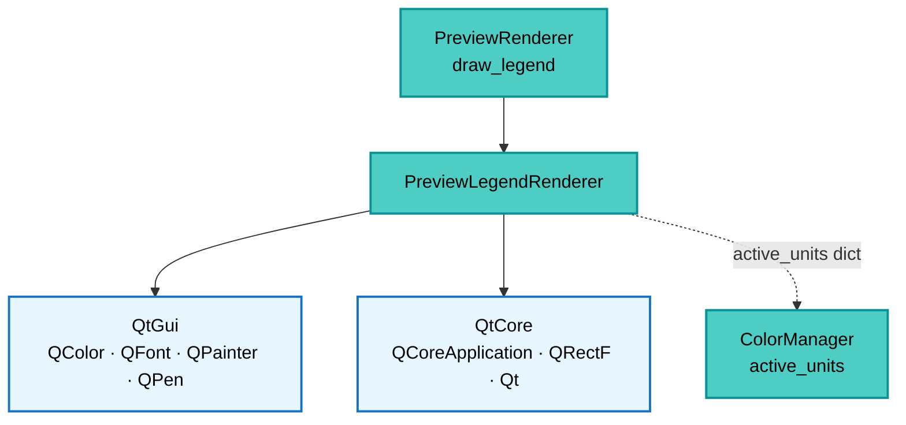

---
tags:
  - secinterp
  - code-walkthrough
  - gui
  - renderers
aliases:
  - preview_legend_renderer.py
  - PreviewLegendRenderer
cssclass: secinterp-note
---

# `gui/preview_legend_renderer.py`

> [!abstract] Resumen en una línea
> Dibuja la leyenda del preview sobre un `QPainter`: caja semitransparente arriba-derecha con línea azul de topografía, línea roja de estructuras y swatches por unidad geológica, con tamaño auto-calculado desde `fontMetrics`.

**Ruta**: `gui/preview_legend_renderer.py` (178 líneas)
**Clase principal**: `PreviewLegendRenderer`
**Capa**: GUI (Present · Renderer de leyenda)
**Tags**: #secinterp #gui #renderers

---

## 🎯 ¿Por qué existe este archivo?

El canvas muestra capas temporales fuera de la leyenda del proyecto (se registran con
`addMapLayer(layer, False)`), así que el preview necesita su propia leyenda pintada:

| Problema | Solución |
|----------|----------|
| Las temporales no aparecen en la leyenda de QGIS | Leyenda pintada a mano con `QPainter` sobre el canvas |
| El número de unidades varía por preview | `_calculate_legend_size` mide cada texto con `fontMetrics` |
| Topografía y estructuras son opcionales | Flags `has_topography` / `has_structures` con salida temprana si todo vacío |
| Los literales deben traducirse | `QCoreApplication.translate("PreviewLegendRenderer", ...)` |
| El pintado debe aislarse del canvas | `painter.save()` / `restore()`: fuente y pens restaurados |

> [!important] Nota arquitectónica
> **Renderer inmediato stateless.** Todo `staticmethod`, sin constructor ni estado: entra
> `painter + rect + unidades + flags`, sale píxeles. [[preview_renderer]] solo reenvía.

---

## 🧬 Diagrama de relaciones



> [!tip] Cómo leer
> Flecha sólida = llama/importa; punteada = el diccionario `active_units` (nombre →
> `QColor`) se produce en el `ColorManager` y viaja vía factoría y renderer.

---

## 📦 Imports — lectura arquitectónica

```python
# gui/preview_legend_renderer.py
from typing import Any

from qgis.PyQt.QtCore import QCoreApplication, QRectF, Qt
from qgis.PyQt.QtGui import QColor, QFont, QPainter, QPen

from sec_interp.logger_config import get_logger
```

| # | Observación |
|---|-------------|
| ① | Cero `qgis.core`: la leyenda no toca capas ni geometrías, solo píxeles Qt. |
| ② | `QPainter` solo como tipo: el painter lo crea el canvas, el renderer solo pinta. |
| ③ | `QCoreApplication.translate` para "Topography"/"Structures" (i18n real). |
| ④ | `Qt.PenStyle / Qt.BrushStyle / Qt.AlignmentFlag` con enums namespaced (estilo QGIS 4/Qt6). |
| ⑤ | `Any` solo en el `config: dict[str, Any]` de layout. |
| ⑥ | `logger` definido pero sin llamadas: el pintado no registra (hot path de paint). |

---

## 🏗️ Inventario de estructura

**Clase:** `class PreviewLegendRenderer` — 5 `staticmethods`

- `draw_legend(painter, rect, active_units, has_topography=False, has_structures=False)`
- `_calculate_legend_size(painter, active_units, has_topo, has_struct, config)` → `(QRectF, max_text_width)`
- `_draw_legend_background(painter, x, y, width, height)`
- `_draw_line_item(painter, x, y, label, color, max_width, config)`
- `_draw_geology_items(painter, x, y, units, max_width, config)`

**Configuración de layout** (dict en `draw_legend`):
- `padding = 6`, `item_height = 16`, `symbol_size = 10`, `line_width = 2`, `margin = 20`

---

## 📁 Archivos del paquete

| Archivo | Rol respecto a la leyenda |
|---|---|
| `gui/preview_renderer.py` | `draw_legend(painter, rect)` reenvía unidades + flags |
| `gui/preview_layer_factory.py` | `active_units` (vía `ColorManager`) alimenta las filas geológicas |
| `gui/renderers/color_manager.py` | Produce los `QColor` por unidad |
| `gui/ui/pages/preview_page.py` | Página/canvas que dispara el pintado (ver [[preview_page]]) |

---

## 📖 Recorrido método por método

### `draw_legend` — composición vertical

```python
@staticmethod
def draw_legend(painter, rect, active_units, has_topography=False, has_structures=False):
    if not active_units and not has_topography and not has_structures:
        return
    config = {"padding": 6, "item_height": 16, "symbol_size": 10,
              "line_width": 2, "margin": 20}
    painter.save()
    painter.setFont(QFont("Arial", 8))
    legend_size, max_text_width = PreviewLegendRenderer._calculate_legend_size(
        painter, active_units, has_topography, has_structures, config)
    x = rect.width() - legend_size.width() - config["margin"]
    y = config["margin"]
    PreviewLegendRenderer._draw_legend_background(
        painter, x, y, legend_size.width(), legend_size.height())
    current_y = y + config["padding"]
    if has_topography:
        PreviewLegendRenderer._draw_line_item(
            painter, x, current_y,
            QCoreApplication.translate("PreviewLegendRenderer", "Topography"),
            QColor(0, 102, 204), max_text_width, config)
        current_y += config["item_height"]
    if has_structures:
        PreviewLegendRenderer._draw_line_item(
            painter, x, current_y,
            QCoreApplication.translate("PreviewLegendRenderer", "Structures"),
            QColor(204, 0, 0), max_text_width, config)
        current_y += config["item_height"]
    PreviewLegendRenderer._draw_geology_items(
        painter, x, current_y, active_units, max_text_width, config)
    painter.restore()
```

| Paso | Detalle |
|------|---------|
| Salida temprana | Sin filas → sin caja (el canvas queda limpio en previews vacíos) |
| Posición | Arriba-derecha: `rect.width() - legend_width - margin`, `y = margin` |
| Orden fijo | Topografía → estructuras → unidades (inserción del dict) |
| Colores canónicos | Topo azul `(0,102,204)`, struct rojo `(204,0,0)` |
| Cursor vertical | `current_y` avanza `item_height` por fila |

### `_calculate_legend_size` — medir antes de pintar

```python
@staticmethod
def _calculate_legend_size(painter, active_units, has_topo, has_struct, config):
    fm = painter.fontMetrics()
    max_text_width = 0
    items = []
    if has_topo:
        items.append(QCoreApplication.translate("PreviewLegendRenderer", "Topography"))
    if has_struct:
        items.append(QCoreApplication.translate("PreviewLegendRenderer", "Structures"))
    items.extend(active_units.keys())
    for item in items:
        max_text_width = max(max_text_width, fm.boundingRect(item).width())
    width = max_text_width + config["symbol_size"] + config["padding"] * 3
    height = len(items) * config["item_height"] + config["padding"] * 2
    return QRectF(0, 0, width, height), max_text_width
```

Mide con la fuente ya fijada (`Arial 8`) para que el ancho sea real, incluidas las
cadenas traducidas (más largas en ES/FR que en EN). El `QRectF` vuelve en origen: el
llamador lo coloca arriba-derecha. Si `items` está vacío esta función no se alcanza
(la guarda de `draw_legend` retorna antes; si se llamara directa daría alto `2×padding`).

### `_draw_legend_background` — caja semitransparente con borde

```python
@staticmethod
def _draw_legend_background(painter, x, y, width, height):
    rect = QRectF(x, y, width, height)
    painter.setBrush(QColor(255, 255, 255, 200))
    painter.setPen(Qt.PenStyle.NoPen)
    painter.drawRect(rect)
    painter.setBrush(Qt.BrushStyle.NoBrush)
    painter.setPen(QColor(100, 100, 100))
    painter.drawRect(rect)
```

Doble pasada: relleno blanco alfa 200 sin borde + borde gris `(100,100,100)` sin
relleno. La alfa deja ver el perfil bajo la caja.

### `_draw_line_item` — fila con símbolo lineal

```python
@staticmethod
def _draw_line_item(painter, x, y, label, color, max_width, config):
    p, ih, ss = config["padding"], config["item_height"], config["symbol_size"]
    painter.setPen(QPen(color, config["line_width"]))
    painter.drawLine(int(x + p), int(y + ih / 2), int(x + p + ss), int(y + ih / 2))
    painter.setPen(QColor(0, 0, 0))
    text_rect = QRectF(x + p * 2 + ss, y, max_width, ih)
    painter.drawText(text_rect,
                     Qt.AlignmentFlag.AlignLeft | Qt.AlignmentFlag.AlignVCenter, label)
```

Línea centrada verticalmente en la fila (`y + ih/2`), coordenadas a `int` para trazo
nítido; texto negro alineado izquierda + centrado vertical en `max_width` (columna de
texto alineada entre filas).

### `_draw_geology_items` — un swatch por unidad

```python
@staticmethod
def _draw_geology_items(painter, x, y, units, max_width, config):
    p, ih, ss = config["padding"], config["item_height"], config["symbol_size"]
    for name, color in units.items():
        painter.setBrush(color)
        painter.setPen(Qt.PenStyle.NoPen)
        painter.drawRect(QRectF(x + p, y + (ih - ss) / 2, ss, ss))
        painter.setPen(QColor(0, 0, 0))
        text_rect = QRectF(x + p * 2 + ss, y, max_width, ih)
        painter.drawText(text_rect,
                         Qt.AlignmentFlag.AlignLeft | Qt.AlignmentFlag.AlignVCenter, name)
        y += ih
```

Cuadrado `10×10` con el `QColor` del `ColorManager` (mismo que las capas: la leyenda no
miente) y nombre de unidad **sin traducir** (dato, no UI). Itera en orden de inserción
del dict: el orden de la leyenda es el de primer uso en el render.

---

## 🔄 Flujo de datos

| Fase | Entrada | Transformación | Salida |
|------|---------|----------------|--------|
| Guarda | unidades + flags | todo vacío → `return` | sin pintado |
| Medición | textos + `fontMetrics` | bounding rects | `(tamaño, max_text_width)` |
| Fondo | tamaño + margen | doble `drawRect` | caja arriba-derecha |
| Filas | flags + `active_units` | `_draw_line_item` / `_draw_geology_items` | 0–N filas |
| Restauración | `painter.restore()` | fuente/pens originales | canvas intacto |

---

## 🏛️ Patrones de diseño presentes

| Patrón | Dónde | Propósito |
|--------|-------|-----------|
| **Immediate-mode rendering** | todo `staticmethod` | Pintar sin escena ni items |
| **Measure-then-layout** | `_calculate_legend_size` | Caja exacta, sin recortes |
| **Save/restore (RAII pictórico)** | `save()`/`restore()` | No fugar estado del painter |
| **Canonical colors** | azul topo / rojo struct | Convención visual estable |

---

## 🧾 Resumen de la API

| Símbolo | Firma | Uso típico |
|---------|-------|------------|
| `PreviewLegendRenderer` | sin estado | `PreviewRenderer.draw_legend` delega |
| `draw_legend` | `(painter, rect, active_units, has_topography=False, has_structures=False)` | Entrada única |
| `_calculate_legend_size` | `(painter, active_units, has_topo, has_struct, config)` | Layout |
| `_draw_legend_background` | `(painter, x, y, width, height)` | Caja |
| `_draw_line_item` | `(painter, x, y, label, color, max_width, config)` | Filas topo/struct |
| `_draw_geology_items` | `(painter, x, y, units, max_width, config)` | Filas de unidades |

---

## 🛡️ Manejo de errores

| Situación | Comportamiento |
|-----------|----------------|
| Leyenda vacía | retorno temprano, sin tocar el painter |
| `active_units` vacío pero con flags | solo filas topo/struct |
| Flags falsos con unidades | solo filas geológicas |
| Painter ajeno | `save/restore` garantiza no dejar fuente ni pen cambiados |

---

## 🧪 Tests asociados

- `tests/gui/test_preview_legend_renderer.py` — `TestPreviewLegendRenderer`: salida temprana vacía, caja y filas con `painter` mock y `fontMetrics` simulado.
- `tests/gui/test_preview_components.py` — `active_units` como puente factoría→leyenda.
- `tests/gui/renderers/test_renderers.py` — colores del `ColorManager` que la leyenda refleja.

---

## 👀 Observaciones y notas

> [!success] Fortalezas
> - Sin `qgis.core`: testeable con un `QPainter` mock, sin canvas.
> - Medición real con la fuente final: sin textos recortados en otros idiomas.
> - `save/restore` disciplinado en un hot path de pintado.

> [!warning] Puntos de atención
> - Fuente hardcodeada `Arial 8`: ignora la fuente del sistema/tema QGIS.
> - Posición fija arriba-derecha sin colisiones: puede tapar el inicio del perfil.
> - `logger` importado pero nunca usado (resto de un refactor).
> - Sin límite de filas: decenas de unidades alargan la caja más allá del canvas.

> [!question] Preguntas abiertas
> - ¿Fuente desde `QgsSettings`/tema en vez de `Arial` fija?
> - ¿Paginar o colapsar unidades cuando superan la altura del canvas?

---

## 🎨 Anatomía visual

Con topo + struct + dos unidades (`Arenisca`, `Lutita`), la caja queda así:

```text
┌──────────────────────┐
│ ── Topography         │
│ ── Structures         │
│ ■■ Arenisca           │
│ ■■ Lutita             │
└──────────────────────┘
```

| Pieza | Geometría | Color |
|-------|-----------|-------|
| Caja | `legend_size + margin`, arriba-derecha | relleno blanco alfa 200 |
| Borde | mismo `QRectF`, segunda pasada | gris `(100,100,100)` |
| Línea topo | `drawLine(x+p, y+ih/2, ...)`, ancho 2 | azul `(0,102,204)` |
| Línea struct | idéntica, otro color | rojo `(204,0,0)` |
| Swatch | `10×10` centrado en la fila | `QColor` del `ColorManager` |
| Texto | `max_text_width × ih`, negro | `AlignLeft + AlignVCenter` |

---

## 📏 Ejemplo de dimensionado

`fontMetrics` con `Arial 8` mide: "Topography" → 62 px, "Structures" → 58 px,
"Arenisca" → 48 px, "Formación Playa Larga" → 118 px:

| Paso | Cálculo | Valor |
|------|---------|-------|
| `max_text_width` | `max(62, 58, 48, 118)` | `118` |
| Ancho | `118 + 10 + 6×3` | `146` |
| Alto (4 filas) | `4×16 + 6×2` | `76` |
| Posición X | `rect.width() − 146 − 20` | depende del canvas |
| Posición Y | `margin` | `20` |

> [!tip] El nombre largo manda
> Una sola unidad con nombre largo ensancha toda la caja: la columna de texto es común
> (`max_text_width`) para alinear todas las filas.

---

## 🌐 Internacionalización y casos largos

| Aspecto | Detalle |
|---------|---------|
| Literales UI | "Topography"/"Structures" vía `translate` (se miden traducidos) |
| Datos | nombres de unidad sin traducir (son datos de la capa) |
| Caja elástica | crece con el idioma: el ES suele ser más ancho que el EN |
| Sin paginación | N unidades → N filas; con 30 unidades la caja supera el canvas |

---

## 🧩 La leyenda en el pipeline

| Pregunta | Respuesta |
|----------|-----------|
| ¿Quién la llama? | `PreviewRenderer.draw_legend(painter, rect)` tras `render` |
| ¿De dónde salen las unidades? | `layer_factory.active_units` (registro del `ColorManager`) |
| ¿De dónde los flags? | `has_topography` / `has_structures` del renderer |
| ¿Cuándo se resetea? | `_cleanup_layers` vacía `active_units` y los flags |
| ¿Pinta sobre capas? | Sí: painter del canvas, tras el `refresh`, arriba-derecha |

> [!note] Pintado, no capa
> La leyenda no es un `QgsVectorLayer`: no entra en el extent, el Z-order ni la
> limpieza. Vive solo los milisegundos del paint.

---

## 🔗 Notas relacionadas

- [[Index]] — índice de la bóveda
- [[preview_renderer]] — `draw_legend` que delega aquí
- [[preview_layer_factory]] — provee `active_units`
- [[preview_page]] — canvas donde se pinta
- [[gui_renderers]] — `ColorManager` y simbología
- [[dialog_preview_manager]] — dueño del renderer

---

*Nota de la bóveda SecInterp Code Walkthrough v2 — v3.9.1*
