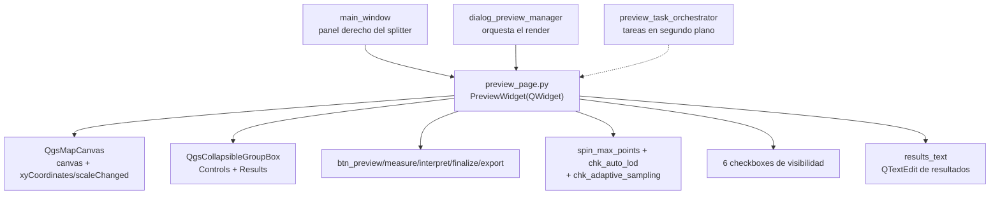

---
tags:
  - secinterp
  - code-walkthrough
  - gui
  - pages
aliases:
  - preview_page.py
  - PreviewWidget
cssclass: secinterp-note
---

# `gui/ui/pages/preview_page.py`

> [!abstract] Resumen en una línea
> Visor de la sección (`PreviewWidget`, `QWidget` directo, no `BasePage`): `QgsMapCanvas` con barra de estado, controles colapsables (acciones, LOD, visibilidad de capas) y área de resultados en texto.

**Ruta**: `gui/ui/pages/preview_page.py` (262 líneas)
**Clase principal**: `PreviewWidget(QWidget)`
**Capa**: GUI (visor + controles de render · sin `get_data/validate`)
**Tags**: #secinterp #gui #pages

---

## 🎯 ¿Por qué existe este archivo?

La vista previa es donde el usuario verifica la sección antes de exportar: necesita
un canvas vivo, botones de acción (preview, medir, interpretar, exportar),
control de nivel de detalle y visibilidad por capa, todo en un panel que convive
con las páginas de configuración.

| Problema | Solución |
|----------|----------|
| El diálogo necesita un canvas de previsualización con coordenadas y escala visibles | `QgsMapCanvas` + barra de estado (`lbl_coords/lbl_scale/lbl_crs`) |
| Renderizar miles de puntos siempre es lento en perfiles densos | Controles LOD: `spin_max_points` + `chk_auto_lod` + `chk_adaptive_sampling` |
| El usuario debe aislar topografía, geología, estructuras, sondajes, interpretaciones o leyenda | Seis checkboxes de visibilidad + área de resultados colapsable |

> [!important] Nota arquitectónica
> Deliberadamente **no** hereda de `BasePage`: no es una página de configuración
> (no hay `get_data/validate/is_complete`), sino un visor con controles
> persistibles (`dump/load/reset`). Lo orquestan los managers de preview, no
> `InputManager`.

---

## 🧬 Diagrama de relaciones



> [!tip] Cómo leer
> Flecha sólida = contiene/orquesta; punteada = el orquestador de tareas alimenta el canvas.

---

## 📦 Imports — lectura arquitectónica

```python
# gui/ui/pages/preview_page.py
from __future__ import annotations

import contextlib
from typing import Any

from qgis.core import QgsApplication
from qgis.gui import QgsCollapsibleGroupBox, QgsMapCanvas
from qgis.PyQt.QtGui import QColor
from qgis.PyQt.QtWidgets import (
    QCheckBox, QFrame, QHBoxLayout, QLabel,
    QPushButton, QSpinBox, QTextEdit, QVBoxLayout, QWidget,
)
```

| # | Observación |
|---|-------------|
| ① | `QgsMapCanvas` es el corazón: el único canvas de previsualización del plugin vive aquí. |
| ② | `QgsCollapsibleGroupBox` (QGIS) para los grupos Controls/Results: colapsables nativos con estilo QGIS. |
| ③ | `QgsApplication.getThemeIcon(...)` para los 5 botones: iconos del tema activo, sin recursos propios. |
| ④ | `QColor(255, 255, 255)` fija fondo blanco del canvas: la sección se dibuja sobre blanco siempre. |
| ⑤ | Sin imports de `sec_interp`: hoja del grafo; los managers la cablean desde fuera (`btn_preview.clicked`, etc.). |

---

## 🏗️ Inventario de estructura

**Clase `PreviewWidget(QWidget)`** — sin `layer_keys`, sin `get_data`:

Construcción:

- `__init__(self, parent: Any = None) -> None`
- `_setup_ui(self) -> None` — frame + 3 bloques + `connect_signals()`
- `_setup_canvas_area(self) -> None`
- `_setup_controls_group(self) -> None`
- `_setup_action_buttons(self, parent_layout: QVBoxLayout) -> None`
- `_setup_lod_controls(self, parent_layout: QVBoxLayout) -> None`
- `_setup_layer_checkboxes(self, parent_layout: QVBoxLayout) -> None`
- `_setup_results_area(self) -> None`

Reacción:

- `_update_coords(self, point: Any) -> None`
- `_update_scale(self, scale: float) -> None`
- `_toggle_lod_spin(self, checked: bool) -> None`
- `connect_signals(self) / disconnect_signals(self) -> None`

Persistencia de controles:

- `dump(self) -> dict[str, Any]` (9 claves), `load`, `reset`

**Controles (nombres exactos):**

| Grupo | Widgets | Rol |
|-------|---------|-----|
| Canvas | `canvas`, `lbl_coords`, `lbl_scale`, `lbl_crs` | mapa + estado (gris 9pt) |
| Acciones | `btn_preview/measure/interpret/finalize/export` | render, medir, dibujar, exportar |
| LOD | `spin_max_points`, `chk_auto_lod`, `chk_adaptive_sampling` | tope de puntos + auto + adaptativo |
| Visibilidad | `chk_topo/geol/struct/drillholes/interpretations/legend` | seis capas, todas activas |
| Resultados | `results_group`, `results_text` | grupo colapsable + texto solo lectura |

---

## 📖 Recorrido método por método

### `__init__` / `_setup_ui` — frame con tres bloques

```python
def __init__(self, parent: Any = None) -> None:
    super().__init__(parent)
    self._setup_ui()

def _setup_ui(self) -> None:
    layout = QVBoxLayout(self)
    layout.setContentsMargins(0, 0, 0, 0)

    # Frame for preview (optional visual container)
    self.frame = QFrame()
    self.frame.setFrameShape(QFrame.Shape.StyledPanel)
    self.frame_layout = QVBoxLayout(self.frame)

    self._setup_canvas_area()
    self._setup_controls_group()
    self._setup_results_area()

    layout.addWidget(self.frame)

    # Setup connections
    self.connect_signals()
```

El `QFrame` con relieve `StyledPanel` agrupa visualmente canvas + controles +
resultados. A diferencia de las páginas `BasePage` (que esperan a `SignalManager`),
el widget **auto-conecta** sus señales internas al final de `_setup_ui`: las
conexiones canvas→etiquetas le pertenecen, no al diálogo.

### `_setup_canvas_area` — canvas y barra de estado

```python
def _setup_canvas_area(self) -> None:
    self.canvas = QgsMapCanvas()
    self.canvas.setCanvasColor(QColor(255, 255, 255))
    self.canvas.setMinimumHeight(300)
    self.frame_layout.addWidget(self.canvas, stretch=10)

    # -- Status Bar --
    status_layout = QHBoxLayout()
    status_layout.setContentsMargins(5, 0, 5, 0)

    self.lbl_coords = QLabel(self.tr("Coords: - , -"))
    self.lbl_scale = QLabel(self.tr("Scale 1: -"))
    self.lbl_crs = QLabel(self.tr("CRS: -"))

    for lbl in [self.lbl_coords, self.lbl_scale, self.lbl_crs]:
        lbl.setStyleSheet("color: #666; font-size: 9pt;")
    # ... coords + stretch + scale + stretch + crs ...
```

Canvas blanco de 300 px mínimos con `stretch=10` (se queda casi todo el alto del
frame). La barra de estado muestra coordenadas del cursor, escala y CRS con el
mismo estilo gris 9pt; los guiones son el estado "sin render". `lbl_crs` lo
actualiza el manager de preview desde fuera (el widget no lo toca).

### `_setup_action_buttons` — cinco botones con icono de tema

```python
def _setup_action_buttons(self, parent_layout: QVBoxLayout) -> None:
    btn_layout = QHBoxLayout()
    self.btn_preview = QPushButton(self.tr("Preview"))
    self.btn_preview.setIcon(QgsApplication.getThemeIcon("mActionRefresh.svg"))
    # ... Export (mActionSaveMapAsImage), Measure checkable (mActionMeasure),
    # ... Interpret checkable (mActionAddPolygon), Finalize hidden (mActionCheck)
```

Botones: Preview (render), Export (a archivo), Measure (conmutable: mide distancia
y pendiente), Interpret (conmutable: dibuja polígonos) y Finalize (oculto hasta
que hay medición multipunto que finalizar). Los modos conmutables activan las
`MapTool` correspondientes (`measure_tool`, `interpretation_tool`) desde el
gestor de herramientas. Iconos del tema QGIS: se adaptan al tema claro/oscuro.

### `_setup_lod_controls` — nivel de detalle

```python
lod_layout.addWidget(QLabel(self.tr("Max Points:")))

self.spin_max_points = QSpinBox()
self.spin_max_points.setRange(100, 10000)
self.spin_max_points.setValue(1000)
self.spin_max_points.setSingleStep(100)
# ... tooltip "Maximum points to render in preview (LOD Optimization)" ...

self.chk_auto_lod = QCheckBox(self.tr("Auto"))
self.chk_auto_lod.toggled.connect(self._toggle_lod_spin)
# ... chk_adaptive_sampling "Adaptive", checked, "based on curvature (Phase 2)" ...
```

Tope manual de puntos (100–10000, defecto 1000, paso 100), modo Auto (ajusta el
detalle al tamaño del preview y deshabilita el spin) y muestreo adaptativo por
curvatura (Fase 2, activo por defecto). Nótese que `chk_auto_lod.toggled` se
conecta aquí **y** en `connect_signals`: doble conexión real (ver observaciones).

### `_setup_layer_checkboxes` — seis visibilidades

```python
self.chk_topo = QCheckBox(self.tr("Show Topography"))
self.chk_topo.setChecked(True)
# ... chk_geol, chk_struct, chk_drillholes, chk_interpretations, chk_legend ...
```

Seis checkboxes, todos activos por defecto. El renderer de preview los consulta
antes de añadir cada familia de capas al canvas. Son el equivalente visual de las
páginas de configuración: ocultar "Show Geology" no borra la configuración de
[[geology_page]], solo su render.

### `_setup_results_area` — texto de resultados

```python
def _setup_results_area(self) -> None:
    self.results_group = QgsCollapsibleGroupBox(self.tr("Results"))
    results_layout = QVBoxLayout(self.results_group)
    self.results_text = QTextEdit()
    self.results_text.setReadOnly(True)
    self.results_text.setMaximumHeight(100)
    results_layout.addWidget(self.results_text)
    self.frame_layout.addWidget(self.results_group)
```

Grupo colapsable con `QTextEdit` de solo lectura y 100 px de alto máximo: el
`preview_reporter` vuelca aquí el resumen numérico (longitud, desnivel, conteo de
puntos). Solo lectura para que el usuario no lo edite por accidente.

### `_update_coords` / `_update_scale` — etiquetas en vivo

```python
def _update_coords(self, point: Any) -> None:
    self.lbl_coords.setText(f"{point.x():.2f}, {point.y():.2f}")

def _update_scale(self, scale: float) -> None:
    self.lbl_scale.setText(self.tr("Scale 1:{}").format(int(scale)))
```

Slots directos de `xyCoordinates` y `scaleChanged` del canvas. Coordenadas con 2
decimales (sin `tr`: números); escala entera con `tr` y `.format()` para que los
traductores reordenen el patrón.

### `_toggle_lod_spin` — toggle del spin LOD

```python
def _toggle_lod_spin(self, checked: bool) -> None:
    self.spin_max_points.setEnabled(not checked)
```

Mismo idioma que `_on_auto_ve_toggled` ([[dem_page]]): en Auto el valor manual se
deshabilita. Conectado dos veces (en `_setup_lod_controls` y en
`connect_signals`); como el slot es idempotente, el efecto visible es único, pero
`disconnect_signals` usa `disconnect()` sin argumentos para cortar ambas de golpe.

### `connect_signals` / `disconnect_signals` — idempotencia explícita

```python
def connect_signals(self) -> None:
    """Connect internal signals for coordinates and scale tracking."""
    # Disconnect first to ensure idempotency
    self.disconnect_signals()

    self.canvas.xyCoordinates.connect(self._update_coords)
    self.canvas.scaleChanged.connect(self._update_scale)
    self.chk_auto_lod.toggled.connect(self._toggle_lod_spin)

def disconnect_signals(self) -> None:
    with contextlib.suppress(TypeError, RuntimeError):
        self.canvas.xyCoordinates.disconnect()
        # ... scaleChanged.disconnect(), chk_auto_lod.toggled.disconnect() ...
```

`connect` primero desconecta ("Disconnect first to ensure idempotency"): llamar
dos veces no duplica las conexiones del canvas. Las desconexiones son sin
argumentos (cortan **todos** los slots, incluida la conexión extra del LOD hecha
en `_setup_lod_controls`). Cada una va en su propio `suppress`, pero el código
real las agrupa en un solo `with` con tres sentencias: si la primera lanza, las
otras dos no se ejecutan (misma asimetría que [[dem_page]]).

### `dump` / `load` / `reset` — persistencia de controles

```python
def dump(self) -> dict[str, Any]:
    return {
        "show_topo": self.chk_topo.isChecked(),
        "show_geol": self.chk_geol.isChecked(),
        "show_struct": self.chk_struct.isChecked(),
        "show_drillholes": self.chk_drillholes.isChecked(),
        "show_interpretations": self.chk_interpretations.isChecked(),
        "show_legend": self.chk_legend.isChecked(),
        "auto_lod": self.chk_auto_lod.isChecked(),
        "adaptive_sampling": self.chk_adaptive_sampling.isChecked(),
        "max_points": self.spin_max_points.value(),
    }
```

Nueve claves `show_*/auto_lod/adaptive_sampling/max_points`. `load` itera pares
`(chk, key)` con guarda `is not None` por clave; `reset` reactiva las seis
visibilidades + adaptativo, desactiva Auto y restaura 1000 puntos. El canvas en sí
(capas renderizadas) no persiste: solo los controles.

---

## 🧩 Ciclo de vida en el diálogo

| Momento | Quién | Qué hace con el widget |
|---------|-------|------------------------|
| Construcción | [[main_window]] | `PreviewWidget()` como tercer panel del splitter (stretch mayor) |
| Cableado externo | `dialog_preview_manager` | conecta `btn_preview/export` y las herramientas measure/interpret |
| Render | `preview_task_orchestrator` | tareas en segundo plano → capas al canvas + `set_auto_ve` en [[dem_page]] |
| Reporte | `preview_reporter` | vuelca el resumen en `results_text` |
| Sesión | persistencia | `dump/load` de los 9 controles |
| Cierre | diálogo | `disconnect_signals()` del widget + liberar el canvas |

---

## 🔄 Flujo de datos

| Fase | Entrada | Transformación | Salida |
|------|---------|----------------|--------|
| Cursor | `xyCoordinates` | `_update_coords` | `"x.xx, y.yy"` en gris 9pt |
| Zoom | `scaleChanged` | `_update_scale` | `"Scale 1:N"` |
| LOD | Auto/desactivado | `_toggle_lod_spin` | spin habilitado o no |
| Acción | clic en Preview | manager → tareas → canvas | sección renderizada |
| Visibilidad | checkboxes | el renderer filtra familias | canvas con/sin capas |
| Resultados | `PreviewResult` | `preview_reporter` | texto en `results_text` |
| Persistencia | controles | `dump/load/reset` | 9 claves de visibilidad y LOD |

---

## 🏛️ Patrones de diseño presentes

| Patrón | Dónde | Propósito |
|--------|-------|-----------|
| **Viewer (no-Page)** | `QWidget` directo | Visor con controles, fuera del protocolo `BasePage` |
| **Builder por bloques** | 4× `_setup_*` | Canvas, controles, botones/LOD/checkboxes, resultados |
| **Idempotent connect** | desconectar-antes-de-conectar | Reconexiones seguras del diálogo |
| **Feature toggle** | `_toggle_lod_spin` | LOD manual o automático |

---

## 🧾 Resumen de la API

| Símbolo | Firma / Hereda | Uso típico |
|---------|----------------|------------|
| `PreviewWidget` | `(QWidget)` | panel derecho de [[main_window]] |
| `canvas` | `QgsMapCanvas` | destino del render de preview |
| Botones | `btn_preview/measure/interpret/finalize/export` | acciones cableadas por managers |
| LOD | `spin_max_points/chk_auto_lod/chk_adaptive_sampling` | control de densidad de render |
| Visibilidades | 6× `chk_*` (todas ✓) | filtro por familia en el renderer |
| `dump/load/reset` | 9 claves `show_*/auto_lod/…` | sesión de controles |

---

## 🛡️ Manejo de errores

- `disconnect()` sin argumentos en canvas y LOD: corta todas las conexiones aunque haya dobles (la extra de `chk_auto_lod`).
- `load` con claves ausentes: guarda `is not None` por checkbox y por `max_points`; sesiones antiguas restauran parcial.
- `Finalize` oculto hasta que hay medición multipunto: imposible finalizar sin contexto.
- Sin `get_data/validate`: el widget nunca bloquea export/preview por su cuenta; si el canvas falla, el error lo gestiona el manager de preview.

---

## 🧪 Tests asociados

No existe un `tests/gui/test_preview_page.py` dedicado al widget; la cobertura es
indirecta y hay que describirla con honestidad:

- `tests/gui/test_signal_restoration.py` — `test_preview_widget_connect_logic` y `test_preview_signals_wire`: lógica de conexión del widget y cableado de preview.
- `tests/gui/test_preview_task_orchestrator.py` — el orquestador que alimenta el canvas.
- `tests/gui/test_preview_components.py` — **no** testea el widget: cubre `PreviewLayerFactory`, `PreviewAxesManager` y `PreviewRenderer` (el render que el canvas exhibe).
- `tests/gui/test_main_dialog_tools.py` — herramientas measure/interpret sobre el canvas.
- `tests/gui/test_multi_session_persistence.py` — round-trip de los 9 controles.

| Aspecto a testear | Estado |
|-------------------|--------|
| `dump/load/reset` de controles | sin test dedicado; trivial con mocks |
| `_toggle_lod_spin` | sin test dedicado (slot de 1 línea) |
| Doble conexión de `chk_auto_lod` | sin test que la fije como intencional o bug |
| Render extremo a extremo | vía pipeline de preview y tests de integración |

---

## 🌐 i18n y notas de migración

- Etiquetas, botones y tooltips con `self.tr(...)` (`"Preview"`, `"Max Points:"`, `"Show Topography"`…); números y formatos fuera de `tr`.
- Nombres de iconos (`"mActionRefresh.svg"`…) no traducibles: claves del tema QGIS.
- `QgsMapCanvas` y `QgsCollapsibleGroupBox` de `qgis.gui`: API estable hacia QGIS 4.x.

---

## 👀 Observaciones y notas

> [!success] Fortalezas
> - `connect_signals` idempotente por diseño (desconecta primero): el patrón que las demás páginas deberían copiar.
> - Separación nítida: el widget exhibe (canvas, etiquetas, controles) y los managers ejecutan (tareas, herramientas, reportes).
> - `dump/load/reset` simétricos con tabla de pares `(chk, key)`: añadir un séptimo toggle es una línea.

> [!warning] Puntos de atención
> - `chk_auto_lod.toggled` conectado dos veces (setup + `connect_signals`): hoy inocuo por idempotencia del slot, pero si el slot crece dejará de serlo.
> - `disconnect_signals` agrupa tres `disconnect()` en un solo `with suppress`: si el primero lanza, los otros no se intentan.
> - `lbl_crs` sin updater propio: depende de que el manager lo fije; si nadie lo hace, muestra `"CRS: -"` para siempre.
> - Sin test dedicado del widget: la regresión más probable (renombrado de `btn_*`/`chk_*`) solo la cazan tests de diálogo.

> [!question] Preguntas abiertas
> - ¿Eliminar la conexión duplicada de `chk_auto_lod` (quedarse solo con la de `connect_signals`)?
> - ¿Añadir `tests/gui/test_preview_page.py` con contrato `dump/load/reset` + idempotencia de `connect_signals`?
> - ¿Dar a `lbl_crs` un updater propio conectado a `canvas` (p. ej. `destinationCrsChanged`)?

---

## 🔗 Notas relacionadas

- [[Index]] — índice de la bóveda
- [[base_page]] — protocolo que este widget no sigue (y por qué)
- [[gui_ui_pages]] — paquete de páginas y widgets
- [[main_window]] — aloja el widget en el splitter derecho
- [[sidebar]] — no tiene entrada propia (el widget es permanente, no una página)
- [[dialog_preview_manager]] — conecta botones y gobierna el render
- [[preview_task_orchestrator]] — tareas que alimentan el canvas + VE adaptativa
- [[preview_renderer]] / [[preview_axes_manager]] / [[preview_layer_factory]] — render exhibido (ver `test_preview_components.py`)
- [[preview_reporter]] — escribe en `results_text`
- [[measure_tool]] / [[interpretation_tool]] — herramientas de los botones conmutables
- [[dem_page]] — recibe la VE adaptativa (`set_auto_ve`) calculada tras el preview

---

*Nota de la bóveda SecInterp Code Walkthrough v2 — v3.9.1*
