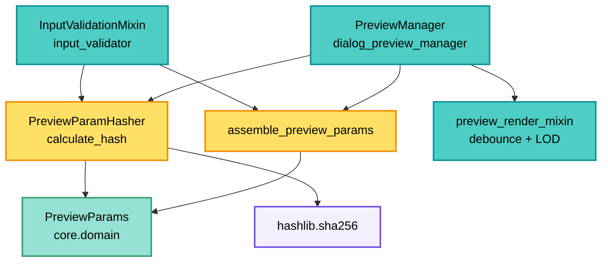
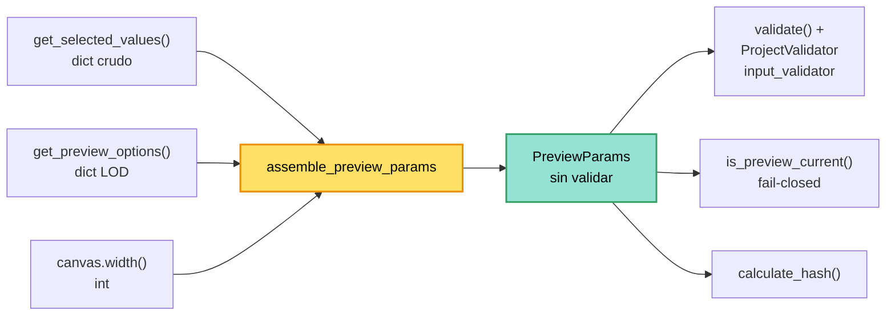

---
tags:
  - secinterp
  - code-walkthrough
  - gui
  - preview
aliases:
  - preview_param_hasher.py
  - PreviewParamHasher
cssclass: secinterp-note
---

# `gui/preview_param_hasher.py`

> [!abstract] Resumen en una línea
> Utilidad pura de dos caras: ensambla los valores crudos del diálogo en un `PreviewParams` sin efectos laterales y lo reduce a un SHA-256 estable (IDs de capa + ajustes + `section_feature_id` + LOD) para detectar cambios de configuración sin comparar objeto por objeto.

**Ruta**: `gui/preview_param_hasher.py` (133 líneas)
**Clase principal**: `PreviewParamHasher`
**Función principal**: `assemble_preview_params`
**Capa**: GUI (Present · Ensamblado y detección de cambio)
**Tags**: #secinterp #gui #preview

---

## 🎯 ¿Por qué existe este archivo?

Regenerar el preview es caro (raster + tasks async). Comparar parámetros a mano es
frágil (7 capas, 10+ ajustes). Un hash único convierte "¿cambió algo?" en `!=`.
Desde v3.9.0 el módulo asume **dos** responsabilidades puras que viven juntas porque
son las dos caras de la misma pregunta: *¿este preview sigue vigente?*

| Problema | Solución |
|----------|----------|
| Ensamblar `PreviewParams` estaba duplicado entre la validación y el chequeo de vigencia | `assemble_preview_params(values, options, width)` único y sin efectos |
| Comparar `PreviewParams` campo a campo es verboso y olvida campos nuevos | `calculate_hash(params) -> str` con lista explícita de partes |
| Las capas viajan como objetos o como IDs según el momento | `get_id` acepta `str` o cualquier objeto con `.id()` |
| Elegir otra feature de la línea no invalidaba el preview | `section_feature_id` entra al hash |
| Colisiones con hashes cortos en sesiones largas | SHA-256 hexadecimal completo |
| Re-renders redundantes tras toggles que no cambian datos | El manager compara hashes y omite trabajo |

> [!important] Nota arquitectónica
> **Dos funciones puras, cero dependencias QGIS.** `assemble_preview_params` solo mapea
> claves de diccionario a un DTO (sin `validate()`, sin diálogos, sin `connect` de
> notificaciones, sin leer geometrías). `calculate_hash` es un `staticmethod` puro:
> entra params, sale `str`. El único import no-stdlib es `PreviewParams` desde
> `core.domain`, un DTO QGIS-agnóstico. El compañero natural del debounce de
> [[preview_render_mixin]]: uno evita renders por zoom, el otro por params iguales.

---

## 🧬 Diagrama de relaciones



> [!tip] Cómo leer
> El manager hashea antes de lanzar: si el hash coincide con el anterior, el preview se
> puede omitir o degradar a re-render barato. El hasher nunca decide; solo mide. El
> ensamblado (`ASM`) es el punto único que produce el `PreviewParams` que ambos
> consumidores miden.

---

## 📦 Imports — lectura arquitectónica

```python
# gui/preview_param_hasher.py
import hashlib
from typing import Any

from sec_interp.core.domain import PreviewParams
```

| # | Observación |
|---|-------------|
| ① | `hashlib` y `typing.Any`: únicamente stdlib. |
| ② | `PreviewParams` llega desde `core.domain`: DTO de datos QGIS-agnóstico; frontera GUI→core permitida. |
| ③ | `Any` en `params` y en `get_id(layer)`: capas como `str`, `QgsMapLayer` o `None`. |
| ④ | Sin `qgis.*`, sin logger, sin servicios: funciones totales sin efectos laterales. |

> [!note] `from __future__ import annotations` presente
> Aunque no hay anotaciones compuestas, la cabecera futura mantiene el estándar del
> proyecto (ver `coding-standards` en skill dedicada; estándar de `AGENTS.md`).

> [!warning] Cambio respecto a v3.8.0
> La versión anterior no importaba nada de `core`. Ahora importa el DTO
> `PreviewParams` para poder **construir** el objeto, no solo consumirlo. Se mantiene
> la regla: nada de `qgis.*` y nada de servicios con estado.

---

## 🏗️ Inventario de estructura

**Símbolos públicos:** 1 función de módulo + 1 clase con 1 `staticmethod` y 1 closure

- `assemble_preview_params(values, preview_options, canvas_width) -> PreviewParams`
- `PreviewParamHasher.calculate_hash(params: Any) -> str`
- `get_id(layer: Any) -> str` (closure interna de `calculate_hash`)

**Partes del hash** (orden fijo, unidas con `"|"`):

| Grupo | Nº | Campos |
|-------|----|--------|
| IDs geométricos y de capa | 7 | `line_layer`, `raster_layer`, `outcrop_layer`, `struct_layer`, `collar_layer`, `survey_layer`, `interval_layer` |
| Ajustes core | 3 | `band_num`, `buffer_dist`, `section_feature_id` |
| Estilo de topografía | 3 | `color_mode`, `ramp_name`, `single_color_hex` |
| Ajustes de estructuras | 3 | `dip_field`, `strike_field`, `dip_scale_factor` |
| Ajustes de sondajes | 2 | `collar_id_field`, `collar_use_geometry` |
| LOD | 3 | `max_points`, `canvas_width`, `auto_lod` |

Total: **21 partes** → `"|".join` → `sha256(...).hexdigest()`.
(En v3.8.0 eran 17: se sumaron `section_feature_id` y las 3 claves de estilo.)

---

## 📁 Archivos del paquete

| Archivo | Rol respecto al hasher |
|---|---|
| `gui/dialog_preview_manager.py` | Consumidor: ensambla en `is_preview_current()` y compara hashes |
| `plugin/input_validator.py` | Consumidor: ensambla y luego valida (`validate()` + `ProjectValidator`) |
| `gui/preview_render_mixin.py` | Compañero: debounce temporal vs igualdad de params |
| `gui/preview_state.py` | `PreviewCache`: lo que se evita regenerar si el hash coincide |
| `core/domain/dtos.py` | `PreviewParams`: el objeto ensamblado y hasheado (ver [[dtos]]) |
| `core/domain/task_inputs.py` | Contextos detachados para las tasks async (ver [[task_inputs]]) |

---

## 🧩 `assemble_preview_params` — ensamblado puro

El gran añadido de v3.9.0. Antes, el diálogo y el validador construían el
`PreviewParams` por su cuenta; ahora existe **un único** ensamblador sin efectos.

```python
def assemble_preview_params(
    values: dict[str, Any], preview_options: dict[str, Any], canvas_width: int
) -> PreviewParams:
    """Assemble PreviewParams from raw dialog values without side effects."""
    return PreviewParams(
        raster_layer=values.get("raster_layer"),
        line_layer=values.get("crossline_layer"),
        band_num=values.get("selected_band", 1),
        buffer_dist=values.get("buffer_distance", 100.0),
        section_feature_id=values.get("section_feature_id"),
        color_mode=values.get("color_mode", "gradient"),
        ramp_name=values.get("ramp_name"),
        single_color_hex=values.get("single_color_hex"),
        outcrop_layer=values.get("outcrop_layer"),
        outcrop_name_field=values.get("outcrop_name_field"),
        struct_layer=values.get("structural_layer"),
        dip_field=values.get("dip_field"),
        # ... campos de estructura y sondajes ...
        max_points=preview_options.get("max_points", 1000),
        auto_lod=preview_options.get("auto_lod", True),
        canvas_width=canvas_width,
    )
```

> [!important] Sin `validate()`, sin wiring, sin geometrías
> El docstring real lo dice: *"no `validate()` call, no error dialogs, no
> layer-notification wiring, and no geometry reads"*. El hasher solo usa `.id()` de
> capa y primitivos, así que esto es lo bastante barato para correr en cada refresco
> de estado de UI (por ejemplo dentro de `is_preview_current`).

### Traducción de claves: diálogo → dominio

Los nombres no coinciden uno a uno; el ensamblador es el **adaptador** entre ambos
vocabularios. Esta tabla es el contrato de mapeo:

| Clave en `values` / `options` | Campo en `PreviewParams` | Default |
|---|---|---|
| `raster_layer` | `raster_layer` | `None` |
| `crossline_layer` | `line_layer` | `None` |
| `selected_band` | `band_num` | `1` |
| `buffer_distance` | `buffer_dist` | `100.0` |
| `section_feature_id` | `section_feature_id` | `None` |
| `color_mode` | `color_mode` | `"gradient"` |
| `structural_layer` | `struct_layer` | `None` |
| `dip_scale_factor` | `dip_scale_factor` | `1.0` |
| `collar_layer_obj` | `collar_layer` | `None` |
| `collar_use_geometry` | `collar_use_geometry` | `True` |
| `survey_layer_obj` | `survey_layer` | `None` |
| `interval_layer_obj` | `interval_layer` | `None` |
| `max_points` (options) | `max_points` | `1000` |
| `auto_lod` (options) | `auto_lod` | `True` |
| `canvas_width` (3.er argumento) | `canvas_width` | — |

> [!tip] El sufijo `_obj` importa
> Las capas de collar/survey/interval viajan como `collar_layer_obj`,
> `survey_layer_obj`, `interval_layer_obj`: son los objetos resueltos, no los IDs.
> El ensamblador los renombra al campo limpio del DTO.

### Flujo del ensamblado y sus consumidores



> [!question] ¿Por qué no valida aquí?
> Porque el ensamblado debe poder ejecutarse en cada refresco de estado sin mostrar
> diálogos de error ni tocar notificaciones de capa. La validación es un paso
> **separado** y explícito (`params.validate()` + `ProjectValidator`) en
> [[input_validator]].

---

## 📖 Recorrido método por método

### `calculate_hash` — 21 partes, un digest

```python
@staticmethod
def calculate_hash(params: Any) -> str:
    hash_parts = []

    def get_id(layer: Any) -> str:
        if isinstance(layer, str):
            return layer
        return layer.id() if hasattr(layer, "id") else "None"

    # Geometric & Layer IDs
    hash_parts.append(get_id(params.line_layer))
    hash_parts.append(get_id(params.raster_layer))
    hash_parts.append(get_id(params.outcrop_layer))
    hash_parts.append(get_id(params.struct_layer))
    hash_parts.append(get_id(params.collar_layer))
    hash_parts.append(get_id(params.survey_layer))
    hash_parts.append(get_id(params.interval_layer))

    # Core Settings
    hash_parts.append(str(params.band_num))
    hash_parts.append(str(params.buffer_dist))
    hash_parts.append(str(params.section_feature_id))

    # Topography style
    hash_parts.append(str(params.color_mode))
    hash_parts.append(str(params.ramp_name))
    hash_parts.append(str(params.single_color_hex))

    # Structure Settings
    hash_parts.append(str(params.dip_field))
    hash_parts.append(str(params.strike_field))
    hash_parts.append(str(params.dip_scale_factor))

    # Drillhole Settings
    hash_parts.append(str(params.collar_id_field))
    hash_parts.append(str(params.collar_use_geometry))

    # LOD Params
    hash_parts.append(str(params.max_points))
    hash_parts.append(str(params.canvas_width))
    hash_parts.append(str(params.auto_lod))

    combined = "|".join(hash_parts)
    return hashlib.sha256(combined.encode()).hexdigest()
```

| Decisión | Detalle |
|----------|---------|
| `get_id` tolerante | `str` → tal cual; con `.id()` → su id; resto (`None`) → `"None"` |
| `str(...)` universal | Números, bools y `None` de campos comparan por representación |
| Separador `\|` | Evita ambigüedad de concatenación (`"ab"+"c"` vs `"a"+"bc"`) |
| SHA-256 | 64 hex chars; sin truncar (sesiones largas, colisiones despreciables) |
| Orden fijo | El orden de `append` es el contrato: cambiarlo invalida hashes guardados |

> [!warning] Añadidos de v3.9.0
> `section_feature_id` (bloque *Core Settings*) y los tres campos de *Topography style*
> (`color_mode`, `ramp_name`, `single_color_hex`) ahora forman parte del contrato.
> Antes, cambiar el color de la topografía o la feature elegida no alteraba el digest.

### `get_id` — el closure

```python
def get_id(layer: Any) -> str:
    if isinstance(layer, str):
        return layer
    return layer.id() if hasattr(layer, "id") else "None"
```

Resuelve la dualidad del ciclo de vida: en `PreviewParams` las capas pueden ser IDs
persistidos (`str`) o capas vivas resueltas. `hasattr(layer, "id")` acepta cualquier
binding QGIS sin importarlo (duck typing, coherente con la frontera GUI).

---

## 🔄 Flujo de datos

| Fase | Entrada | Transformación | Salida |
|------|---------|----------------|--------|
| Ensamblado | `values` + `options` + `width` | `.get(clave, default)` → `PreviewParams(...)` | DTO sin validar |
| Validación | `PreviewParams` | `validate()` + `ProjectValidator` | DTO válido |
| Captura | `PreviewParams` vigente | 21 `append` ordenados | lista de partes |
| Join | partes | `"\|".join` | cadena canónica |
| Digest | cadena | `sha256(...).hexdigest()` | hash de 64 chars |
| Comparación | hash nuevo vs anterior | `!=` | regenerar u omitir |
| `None` | capa/ajuste ausente | `"None"` | cambio detectable igual |

---

## 🏛️ Patrones de diseño presentes

| Patrón | Dónde | Propósito |
|--------|-------|-----------|
| **Pure assembly** | `assemble_preview_params` | Construir el DTO sin efectos laterales |
| **Value hashing** | `calculate_hash` | Igualdad barata de configuración |
| **Canonical string** | `"\|".join` | Representación estable y ordenada |
| **Duck typing** | `get_id` | Sin importar QGIS para leer `.id()` |
| **Pure function** | todo `static` | Sin estado, sin efectos, testeable |

---

## 🧾 Resumen de la API

| Símbolo | Firma | Uso típico |
|---------|-------|------------|
| `assemble_preview_params` | `(values, options, canvas_width) -> PreviewParams` | Construir params desde el diálogo |
| `PreviewParamHasher` | sin estado | `PreviewParamHasher.calculate_hash(params)` |
| `calculate_hash` | `(params: Any) -> str` | Detectar cambios de configuración |
| `get_id` | closure `(layer: Any) -> str` | Normalizar capa → id |

---

## 🛡️ Manejo de errores

| Situación | Comportamiento |
|-----------|----------------|
| `values` vacío | Todos los campos caen a sus defaults |
| Clave ausente | `.get(clave, default)` evita `KeyError` |
| `preview_options` vacío | `max_points=1000`, `auto_lod=True` |
| Capa `None` | `"None"` (cambio a/desde capa detectable) |
| Campo ausente en params | `AttributeError` (falla con ruido: contrato explícito) |
| `params` sin `.id()` ni `str` | `"None"` por rama `hasattr` |

> [!note] Falla rápido en contrato
> `assemble_preview_params` es tolerante (defaults por `.get`), pero `calculate_hash`
> lee los 21 atributos directos (sin `getattr` por defecto): si `PreviewParams` cambia
> de forma, el hash avisa rompiendo en vez de colisionar en silencio.

---

## 🧪 Tests asociados

- `tests/gui/test_ui_gating.py` — `TestAssemblePreviewParams`, `TestIsPreviewCurrent`
  y `TestResetClearsPreviewCurrency` ejercitan el ensamblado y la vigencia del hash.
- `tests/gui/test_dialog_preview_manager.py` — uso del hash en el ciclo de preview.
- `tests/core/test_preview_service.py` — `PreviewParams` de entrada (forma hasheada).

**Casos que deberían existir** (verificación recomendada):

| Caso | Entradas | Esperado |
|------|----------|----------|
| Defaults | `assemble_preview_params({}, {}, 800)` | `band_num==1`, `buffer_dist==100.0`, `max_points==1000`, `auto_lod is True` |
| Valores explícitos | `{"selected_band": 3}`, `{"max_points": 500}`, `640` | los tres se respetan |
| Igualdad | mismos params dos veces | mismo hash |
| Cambio de capa | distinto `line_layer` | distinto hash |
| Cambio de feature | distinto `section_feature_id` | distinto hash |
| `str` vs objeto | id `"abc"` vs mock con `.id()=="abc"` | mismo hash |
| `None` vs capa | `struct_layer=None` vs capa | distinto hash |

---

## 👀 Observaciones y notas

> [!success] Fortalezas
> - Cero dependencias QGIS: el módulo más portable del preview.
> - Ensamblado único que elimina la duplicación entre validación y vigencia.
> - Normalización `str`/objeto/`None` robusta al ciclo de vida de capas.
> - Separador explícito contra ambigüedades de concatenación.
> - `assemble_preview_params` puede correr en cada refresco de UI sin diálogos.

> [!warning] Puntos de atención
> - Cobertura parcial del hash: no incluye `outcrop_name_field`, campos de
>   survey/intervalos (`survey_*`, `interval_*`) ni `collar_x/y/z/depth_field`:
>   cambiarlos **no** cambia el hash.
> - No existe hoy ningún campo de suavizado (`smooth`/`smooth_window`) ni de sampling
>   adaptativo en `PreviewParams`; cuando se añadan, habrá que decidir si entran al
>   hash o no.
> - `canvas_width` en el hash: redimensionar el diálogo invalida aunque los datos sean
>   iguales (mitigado por la comparación de `is_preview_current`, que es fail-closed).
> - `str(True)`/`str(1)` y `str(1.0)`/`str("1")` son representaciones frágiles ante
>   tipos; el separador ayuda pero no elimina la ambigüedad de tipo.
> - Sin versión de esquema: añadir un campo reordena el contrato silenciosamente.

> [!question] Preguntas abiertas
> - ¿Incluir los campos de survey/intervalos y `outcrop_name_field` faltantes?
> - ¿Sacar `canvas_width` (geometría de ventana, no dato) del hash?
> - ¿Prefijar versión (`"v1|"`) para invalidar hashes persistidos?
> - ¿Cómo integrar futuros campos de suavizado o sampling adaptativo?

---

## 🧮 Ejemplo trabajado

Dos previews que solo difieren en el buffer:

| Parte | Preview A | Preview B |
|-------|-----------|-----------|
| `line_layer` | `"linea_01"` | `"linea_01"` |
| `raster_layer` | `"mdt_05m"` | `"mdt_05m"` |
| `buffer_dist` | `"50.0"` | `"25.0"` |
| `section_feature_id` | `"7"` | `"7"` |
| resto (17 partes) | idénticas | idénticas |
| SHA-256 | `9f2c…a1` | `44bd…e7` |

> [!note] Un campo basta
> Cambiar una sola parte cambia el digest completo (efecto avalancha): la comparación
> `hash_a != hash_b` detecta el cambio sin saber qué campo mutó. Elegir otra feature
> de la misma línea de sección también cambia `section_feature_id` y, por tanto, el hash.

---

## 🔗 Notas relacionadas

- [[Index]] — índice de la bóveda
- [[dialog_preview_manager]] — consumidor del hash y de `is_preview_current`
- [[input_validator]] — ensambla y luego valida antes de lanzar el preview
- [[preview_render_mixin]] — debounce temporal compañero
- [[preview_state]] — caché protegida por el hash
- [[dtos]] — `PreviewParams` ensamblado y hasheado
- [[task_inputs]] — DTOs de entrada de las tasks async
- [[preview_service]] — validación (`validate()`) previa al hasheo

---

*Nota de la bóveda SecInterp Code Walkthrough v2 — v3.9.1*
