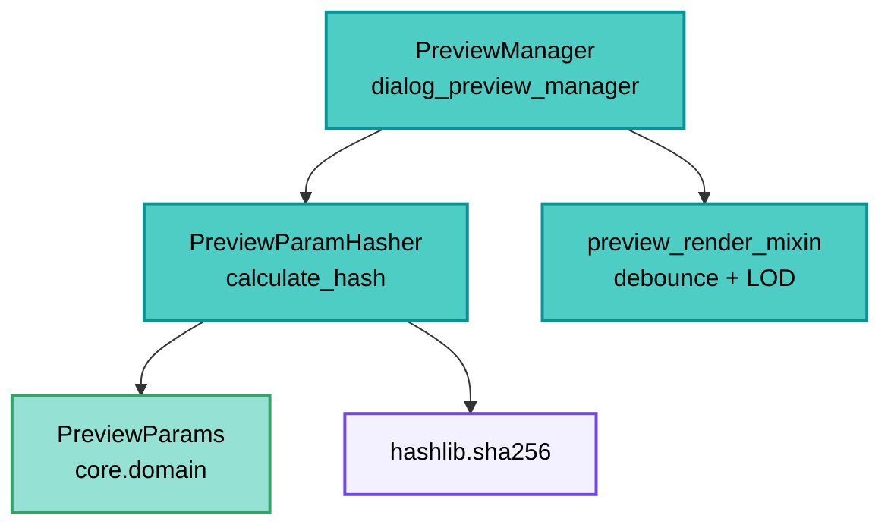

---
tags:
  - secinterp
  - code-walkthrough
  - gui
  - preview
aliases:
  - preview_param_hasher.py
  - PreviewParamHasher
cssclass: secinterp-note
---

# `gui/preview_param_hasher.py`

> [!abstract] Resumen en una línea
> Utilidad estática que reduce un `PreviewParams` a un hash SHA-256 estable (IDs de capa + ajustes + LOD) para detectar cambios de configuración sin comparar objeto por objeto.

**Ruta**: `gui/preview_param_hasher.py` (68 líneas)
**Clase principal**: `PreviewParamHasher`
**Capa**: GUI (Present · Utilidad de cambio)
**Tags**: #secinterp #gui #preview

---

## 🎯 ¿Por qué existe este archivo?

Regenerar el preview es caro (raster + tasks async). Comparar parámetros a mano es
frágil (7 capas, 10+ ajustes). Un hash único convierte "¿cambió algo?" en `!=`:

| Problema | Solución |
|----------|----------|
| Comparar `PreviewParams` campo a campo es verboso y olvida campos nuevos | `calculate_hash(params) -> str` con lista explícita de partes |
| Las capas viajan como objetos o como IDs según el momento | `get_id` acepta `str` o cualquier objeto con `.id()` |
| Colisiones con hashes cortos en sesiones largas | SHA-256 hexadecimal completo |
| Re-renders redundantes tras toggles que no cambian datos | El manager compara hashes y omite trabajo |

> [!important] Nota arquitectónica
> **Value object hash sin estado.** Un `staticmethod` puro: entra params, sale `str`.
> No importa QGIS ni core; solo `hashlib` stdlib. El compañero natural del debounce de
> [[preview_render_mixin]]: uno evita renders por zoom, el otro por params iguales.

---

## 🧬 Diagrama de relaciones



> [!tip] Cómo leer
> El manager hashea antes de lanzar: si el hash coincide con el anterior, el preview se
> puede omitir o degradar a re-render barato. El hasher nunca decide; solo mide.

---

## 📦 Imports — lectura arquitectónica

```python
# gui/preview_param_hasher.py
import hashlib
from typing import Any
```

| # | Observación |
|---|-------------|
| ① | Solo stdlib: el módulo más desacoplado del subpaquete preview. |
| ② | `Any` en `params` y en `get_id(layer)`: capas como `str`, `QgsMapLayer` o `None`. |
| ③ | Sin `qgis.*`, sin core, sin logger: función total sin efectos laterales. |

> [!note] `from __future__ import annotations` presente
> Aunque no hay anotaciones compuestas, la cabecera futura mantiene el estándar del
> proyecto (ver [[coding-standards]] si existiera la nota; estándar de `AGENTS.md`).

---

## 🏗️ Inventario de estructura

**Clase:** `class PreviewParamHasher` — 1 `staticmethod` + 1 closure

- `calculate_hash(params: Any) -> str`
- `get_id(layer: Any) -> str` (closure interna)

**Partes del hash** (orden fijo, unidas con `"|"`):
1. IDs geométricos y de capa (7): `line_layer`, `raster_layer`, `outcrop_layer`, `struct_layer`, `collar_layer`, `survey_layer`, `interval_layer`
2. Ajustes core (2): `band_num`, `buffer_dist`
3. Ajustes de estructuras (3): `dip_field`, `strike_field`, `dip_scale_factor`
4. Ajustes de sondajes (2): `collar_id_field`, `collar_use_geometry`
5. LOD (3): `max_points`, `canvas_width`, `auto_lod`

Total: 17 partes → `"|".join` → `sha256(...).hexdigest()`.

---

## 📁 Archivos del paquete

| Archivo | Rol respecto al hasher |
|---|---|
| `gui/dialog_preview_manager.py` | Consumidor: compara hashes entre previews |
| `gui/preview_render_mixin.py` | Compañero: debounce temporal vs igualdad de params |
| `gui/preview_state.py` | `PreviewCache`: lo que se evita regenerar si el hash coincide |
| `core/domain/dtos.py` | `PreviewParams`: el objeto hasheado (ver [[dtos]]) |

---

## 📖 Recorrido método por método

### `calculate_hash` — 17 partes, un digest

```python
@staticmethod
def calculate_hash(params: Any) -> str:
    hash_parts = []

    def get_id(layer: Any) -> str:
        if isinstance(layer, str):
            return layer
        return layer.id() if hasattr(layer, "id") else "None"

    # Geometric & Layer IDs
    hash_parts.append(get_id(params.line_layer))
    hash_parts.append(get_id(params.raster_layer))
    hash_parts.append(get_id(params.outcrop_layer))
    hash_parts.append(get_id(params.struct_layer))
    hash_parts.append(get_id(params.collar_layer))
    hash_parts.append(get_id(params.survey_layer))
    hash_parts.append(get_id(params.interval_layer))

    # Core Settings
    hash_parts.append(str(params.band_num))
    hash_parts.append(str(params.buffer_dist))

    # Structure Settings
    hash_parts.append(str(params.dip_field))
    hash_parts.append(str(params.strike_field))
    hash_parts.append(str(params.dip_scale_factor))

    # Drillhole Settings
    hash_parts.append(str(params.collar_id_field))
    hash_parts.append(str(params.collar_use_geometry))

    # LOD Params
    hash_parts.append(str(params.max_points))
    hash_parts.append(str(params.canvas_width))
    hash_parts.append(str(params.auto_lod))

    combined = "|".join(hash_parts)
    return hashlib.sha256(combined.encode()).hexdigest()
```

| Decisión | Detalle |
|----------|---------|
| `get_id` tolerante | `str` → tal cual; con `.id()` → su id; resto (`None`) → `"None"` |
| `str(...)` universal | Números, bools y `None` de campos comparan por representación |
| Separador `\|` | Evita ambigüedad de concatenación (`"ab"+"c"` vs `"a"+"bc"`) |
| SHA-256 | 64 hex chars; sin truncar (sesiones largas, colisiones despreciables) |
| Orden fijo | El orden de `append` es el contrato: cambiarlo invalida hashes guardados |

### `get_id` — el closure

```python
def get_id(layer: Any) -> str:
    if isinstance(layer, str):
        return layer
    return layer.id() if hasattr(layer, "id") else "None"
```

Resuelve la dualidad del ciclo de vida: en `PreviewParams` las capas pueden ser IDs
persistidos (`str`) o capas vivas resueltas. `hasattr(layer, "id")` acepta cualquier
binding QGIS sin importarlo (duck typing, coherente con la frontera GUI).

---

## 🔄 Flujo de datos

| Fase | Entrada | Transformación | Salida |
|------|---------|----------------|--------|
| Captura | `PreviewParams` vigente | 17 `append` ordenados | lista de partes |
| Join | partes | `"\|".join` | cadena canónica |
| Digest | cadena | `sha256(...).hexdigest()` | hash de 64 chars |
| Comparación | hash nuevo vs anterior | `!=` | regenerar u omitir |
| `None` | capa/ajuste ausente | `"None"` | cambio detectable igual |

---

## 🏛️ Patrones de diseño presentes

| Patrón | Dónde | Propósito |
|--------|-------|-----------|
| **Value hashing** | `calculate_hash` | Igualdad barata de configuración |
| **Canonical string** | `"\|".join` | Representación estable y ordenada |
| **Duck typing** | `get_id` | Sin importar QGIS para leer `.id()` |
| **Pure function** | todo `static` | Sin estado, sin efectos, testeable |

---

## 🧾 Resumen de la API

| Símbolo | Firma | Uso típico |
|---------|-------|------------|
| `PreviewParamHasher` | sin estado | `PreviewParamHasher.calculate_hash(params)` |
| `calculate_hash` | `(params: Any) -> str` | Detectar cambios de configuración |
| `get_id` | closure `(layer: Any) -> str` | Normalizar capa → id |

---

## 🛡️ Manejo de errores

| Situación | Comportamiento |
|-----------|----------------|
| Capa `None` | `"None"` (cambio a/desde capa detectable) |
| Campo ausente en params | `AttributeError` (falla con ruido: contrato explícito) |
| `params` sin `.id()` ni `str` | `"None"` por rama `hasattr` |

> [!note] Falla rápido en contrato
> Los 17 atributos se leen directos (sin `getattr` por defecto): si `PreviewParams`
> cambia de forma, el hash avisa rompiendo en vez de colisionar en silencio.

---

## 🧪 Tests asociados

- `tests/gui/test_dialog_preview_manager.py` — uso del hash en el ciclo de preview.
- `tests/core/test_preview_service.py` — `PreviewParams` de entrada (forma hasheada).
- Cobertura natural: función pura, aserciones `assertEqual`/`assertNotEqual` sobre pares de params.

**Casos que deberían existir** (verificación recomendada):

| Caso | Entradas | Esperado |
|------|----------|----------|
| Igualdad | mismos params dos veces | mismo hash |
| Cambio de capa | distinto `line_layer` | distinto hash |
| `str` vs objeto | id `"abc"` vs mock con `.id()=="abc"` | mismo hash |
| `None` vs capa | `struct_layer=None` vs capa | distinto hash |

---

## 👀 Observaciones y notas

> [!success] Fortalezas
> - Cero dependencias: el módulo más portable del preview.
> - Normalización `str`/objeto/`None` robusta al ciclo de vida de capas.
> - Separador explícito contra ambigüedades de concatenación.

> [!warning] Puntos de atención
> - Cobertura parcial: no incluye `outcrop_name_field`, campos de survey/intervalos (`survey_*`, `interval_*`), `collar_x/y/z/depth_field` ni `use_adaptive_sampling`: cambiarlos **no** cambia el hash.
> - `canvas_width` en el hash: redimensionar el diálogo invalida aunque los datos sean iguales.
> - `str(True)` vs `str(1)` colisionan (`"True"` vs `"1"` no; pero `str(1.0)=="1.0"` vs `"1"` difieren: bien, aunque frágil ante tipos).
> - Sin versión de esquema: añadir un campo reordena el contrato silenciosamente.

> [!question] Preguntas abiertas
> - ¿Incluir los campos de survey/intervalos y `outcrop_name_field` faltantes?
> - ¿Sacar `canvas_width` (geometría de ventana, no dato) del hash?
> - ¿Prefijar versión (`"v1|"`) para invalidar hashes persistidos?

---

## 🧮 Ejemplo trabajado

Dos previews que solo difieren en el buffer:

| Parte | Preview A | Preview B |
|-------|-----------|-----------|
| `line_layer` | `"linea_01"` | `"linea_01"` |
| `raster_layer` | `"mdt_05m"` | `"mdt_05m"` |
| `buffer_dist` | `"50.0"` | `"25.0"` |
| resto (14 partes) | idénticas | idénticas |
| SHA-256 | `9f2c…a1` | `44bd…e7` |

> [!note] Un campo basta
> Cambiar una sola parte cambia el digest completo (efecto avalancha): la comparación
> `hash_a != hash_b` detecta el cambio sin saber qué campo mutó.

---

## 🔗 Notas relacionadas

- [[Index]] — índice de la bóveda
- [[dialog_preview_manager]] — consumidor del hash
- [[preview_render_mixin]] — debounce temporal compañero
- [[preview_state]] — caché protegida por el hash
- [[dtos]] — `PreviewParams` hasheado
- [[preview_service]] — validación (`validate()`) previa al hasheo

---

*Nota de la bóveda SecInterp Code Walkthrough v2 — v3.8.0*
