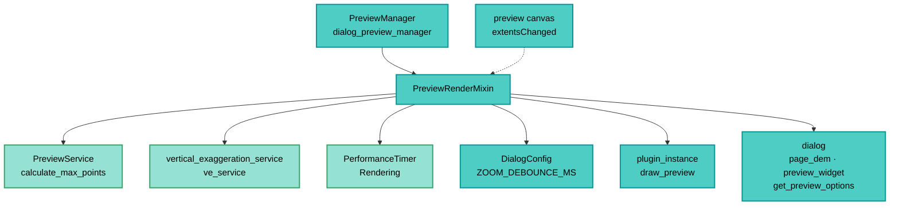

---
tags:
  - secinterp
  - code-walkthrough
  - gui
  - preview
aliases:
  - preview_render_mixin.py
  - PreviewRenderMixin
cssclass: secinterp-note
---

# `gui/preview_render_mixin.py`

> [!abstract] Resumen en una línea
> Mixin que ejecuta el pipeline de render del manager: calcula LOD con `PreviewService.calculate_max_points`, resuelve la exageración vertical (auto vía `ve_service` o manual del spinbox) y re-renderiza la caché con debounce ante zoom.

**Ruta**: `gui/preview_render_mixin.py` (129 líneas)
**Clase principal**: `PreviewRenderMixin`
**Capa**: GUI (Present · Mixin de render + LOD)
**Tags**: #secinterp #gui #preview

---

## 🎯 ¿Por qué existe este archivo?

El render necesita opciones (LOD, VE, muestreo) y reacción al zoom. Este mixin aísla
esa lógica del ciclo de vida del manager:

| Problema | Solución |
|----------|----------|
| Cada zoom re-renderizaba en cascada y colgaba el canvas | `extentsChanged → debounce_timer → _update_lod_for_zoom` |
| El número de puntos debe adaptarse al canvas | `PreviewService.calculate_max_points(canvas_width, manual_max, auto_lod)` |
| VE auto vs manual se resolvía en varios sitios | `_resolve_vertical_exaggeration` único (auto desde `last_result`, manual del spinbox) |
| Renderizar sin instancia del plugin rompe | Guardas `plugin_instance` con `_handle_invalid_plugin_instance` |
| Señales del mixin debían limpiarse al cerrar | `connect_signals` / `disconnect_signals` simétricos con `suppress` |

> [!important] Nota arquitectónica
> **Mixin de Present con señales.** A diferencia del mixin de callbacks (solo slots),
> este conecta `extentsChanged` del canvas y el `debounce_timer`. Vive la regla GUI:
> chequeo de `chk_auto_lod` antes de programar trabajo.

---

## 🧬 Diagrama de relaciones



> [!tip] Cómo leer
> El mixin lee opciones del diálogo, pide LOD al core y VE al servicio, y ordena el
> dibujo al plugin. El canvas solo le avisa de cambios de encuadre (punteada).

---

## 📦 Imports — lectura arquitectónica

```python
# gui/preview_render_mixin.py
import contextlib

from sec_interp.core.performance_metrics import PerformanceTimer
from sec_interp.core.services.preview_service import PreviewService
from sec_interp.logger_config import get_logger

from .main_dialog_config import DialogConfig
```

| # | Observación |
|---|-------------|
| ① | `contextlib` solo para `disconnect_signals` tolerante (señales ya sueltas). |
| ② | `PreviewService` usado **solo** por su `calculate_max_points` estático: LOD sin instanciar. |
| ③ | `PerformanceTimer("Rendering", self.metrics)` mide el dibujo en el ciclo del manager. |
| ④ | `DialogConfig.ZOOM_DEBOUNCE_MS` centraliza el retardo anti-cascada. |
| ⑤ | Cero `qgis.*` y cero widgets: todo llega vía `self.dialog` / `self.debounce_timer`. |

---

## 🏗️ Inventario de estructura

**Clase:** `class PreviewRenderMixin` — 7 métodos, sin `__init__`

**Señales:**
- `connect_signals()` — `debounce_timer.timeout` + `canvas.extentsChanged`
- `disconnect_signals()` — ambas con `suppress`

**Pipeline:**
- `_run_render_pipeline(result)` — `PerformanceTimer` + `_render_cached_data`
- `_render_cached_data(preserve_extent=False)` — LOD + `draw_preview`
- `_resolve_vertical_exaggeration() -> float`

**Zoom/LOD:**
- `update_from_checkboxes()` — re-render tras llegadas async o toggles
- `_on_extents_changed()` — gate `chk_auto_lod` + `debounce_timer.start`
- `_update_lod_for_zoom()` — re-render con `preserve_extent=True`

---

## 📁 Archivos del paquete

| Archivo | Rol respecto al mixin |
|---|---|
| `gui/dialog_preview_manager.py` | `PreviewManager`: aporta `dialog`, `metrics`, `cached_data`, `ve_service`, `debounce_timer` |
| `gui/preview_callbacks_mixin.py` | Llama a `update_from_checkboxes` al llegar cada rama async |
| `gui/preview_task_orchestrator.py` | Sus resultados terminan en `_render_cached_data` |
| `gui/preview_state.py` | `cached_data` leída aquí |
| `gui/main_dialog_config.py` | `ZOOM_DEBOUNCE_MS` |
| `core/services/preview_service.py` | `calculate_max_points` (LOD, ver [[preview_service]]) |
| `core/vertical_exaggeration_service.py` | `ve_service.calculate_from_result` (ver [[vertical_exaggeration_service]]) |

---

## 📖 Recorrido método por método

### `connect_signals` / `disconnect_signals` — cableado simétrico

```python
def connect_signals(self) -> None:
    self.disconnect_signals()
    self.debounce_timer.timeout.connect(self._update_lod_for_zoom)
    self.dialog.preview_widget.canvas.extentsChanged.connect(self._on_extents_changed)

def disconnect_signals(self) -> None:
    with contextlib.suppress(TypeError, RuntimeError):
        self.debounce_timer.timeout.disconnect()
    with contextlib.suppress(AttributeError, TypeError, RuntimeError):
        self.dialog.preview_widget.canvas.extentsChanged.disconnect(self._on_extents_changed)
```

`connect` empieza desconectando: reconexiones repetidas (reaperturas) nunca duplican
slots. El `suppress` cubre timer destruido, canvas `None` y señal ya suelta. Nótese que
`timeout.connect` va sin `suppress`: si el timer no existe, debe fallar con ruido.

### `_run_render_pipeline` — render medido con errores elevados

```python
def _run_render_pipeline(self, result) -> None:
    if not self.dialog.plugin_instance:
        self._handle_invalid_plugin_instance()
        return
    try:
        with PerformanceTimer("Rendering", self.metrics):
            self._render_cached_data()
    except (AttributeError, TypeError, ValueError) as e:
        logger.exception(f"Rendering error: {e}")
        raise ValueError(f"Failed to render preview: {e!s}") from e
    except Exception as e:
        logger.exception("Unexpected rendering pipeline error")
        raise ValueError(f"Critical rendering error: {e!s}") from e
```

El parámetro `result` no se consume (el render lee la caché): firma histórica para
compatibilidad con el llamador. El `PerformanceTimer` alimenta la clave `"Rendering"`
que luego muestra [[preview_reporter]]. Los errores se elevan a `ValueError` con
cadena (`from e` preserva causa).

### `_render_cached_data` — LOD + delegación al plugin

```python
def _render_cached_data(self, preserve_extent: bool = False) -> None:
    if not self.dialog.plugin_instance:
        return
    opts = self.dialog.get_preview_options()
    max_points = PreviewService.calculate_max_points(
        canvas_width=self.dialog.preview_widget.canvas.width(),
        manual_max=opts["max_points"],
        auto_lod=opts["auto_lod"],
    )
    self.dialog.plugin_instance.draw_preview(
        self.cached_data["topo"],
        self.cached_data.get("geol"),
        self.cached_data["struct"],
        drillhole_data=self.cached_data["drillhole"],
        max_points=max_points,
        preserve_extent=preserve_extent,
        use_adaptive_sampling=opts["use_adaptive_sampling"],
        vert_exag=self._resolve_vertical_exaggeration(),
    )
```

| Decisión | Detalle |
|----------|---------|
| LOD | `calculate_max_points` con el ancho real del canvas (2× píxeles + boost log) |
| Acceso mixto | `["topo"]` estricto (KeyError si falta) vs `.get` tolerante en ramas opcionales |
| `struct` estricto | `["struct"]` también con corchetes: la rama se espera siempre (aunque sea `None`) |
| VE | resuelta al momento: cada render puede cambiarla sin regenerar |
| Destino | `plugin_instance.draw_preview` → [[preview_renderer]] aguas abajo |

### `_resolve_vertical_exaggeration` — auto o manual

```python
def _resolve_vertical_exaggeration(self) -> float:
    auto = self.dialog.page_dem.auto_ve_check.isChecked()
    if auto and self.last_result is not None:
        ve = self.ve_service.calculate_from_result(self.last_result)
        logger.info("Vertical exaggeration: %.1f× (auto)", ve)
        return ve
    ve = self.dialog.page_dem.vertexag_spin.value()
    logger.info("Vertical exaggeration: %.1f× (manual)", ve)
    return ve
```

Auto requiere `last_result` (fijado en `_update_results_display`): sin resultado aún,
cae al spinbox manual aunque el check esté marcado. El `ve_service` es el
`VerticalExaggerationService` del manager (consume `PreviewResult`, ver
[[vertical_exaggeration_service]]).

### `update_from_checkboxes` — re-render barato

```python
def update_from_checkboxes(self) -> None:
    if not self.last_result:
        return
    try:
        self._render_cached_data()
    except (AttributeError, TypeError, ValueError) as e:
        logger.exception(f"UI Sync error in preview: {e}")
    except Exception:
        logger.exception("Unexpected error updating preview from checkboxes")
```

Guarda `last_result`: sin preview previo no hay nada que re-mostrar. Aquí los errores
**no** se elevan (a diferencia de `_run_render_pipeline`): se loguean porque el origen
es un toggle/callback, no una acción explícita. El filtrado por visibilidad lo hace
`draw_preview` del plugin, no este método (ver docstring).

### `_on_extents_changed` + `_update_lod_for_zoom` — zoom con debounce

```python
def _on_extents_changed(self) -> None:
    if not self.dialog.preview_widget.chk_auto_lod.isChecked():
        return
    self.debounce_timer.start(DialogConfig.ZOOM_DEBOUNCE_MS)

def _update_lod_for_zoom(self) -> None:
    if not self.dialog.preview_widget.canvas:
        return
    self._render_cached_data(preserve_extent=True)
```

Cada pan/zoom con auto-LOD reprograma el timer (`ZOOM_DEBOUNCE_MS`): solo el último
evento de la ráfaga renderiza, con `preserve_extent=True` para no robar el encuadre al
usuario. Sin `chk_auto_lod`, el zoom no cuesta nada.

---

## 🔄 Flujo de datos

| Fase | Entrada | Transformación | Salida |
|------|---------|----------------|--------|
| Opciones | diálogo (`get_preview_options`) | dict LOD/muestreo | `max_points`, `use_adaptive_sampling` |
| VE | check + `last_result` / spinbox | `_resolve_vertical_exaggeration` | factor aplicado |
| Caché | `cached_data` | `draw_preview(...)` | capas en canvas |
| Zoom | `extentsChanged` | debounce → re-render preservando encuadre | más/menos detalle |
| Métrica | bloque `PerformanceTimer` | clave `"Rendering"` | tiempos del informe |

---

## 🏛️ Patrones de diseño presentes

| Patrón | Dónde | Propósito |
|--------|-------|-----------|
| **Mixin** | la clase | Partir el manager (render vs callbacks vs vida) |
| **Debounce** | timer + `ZOOM_DEBOUNCE_MS` | Un render por ráfaga de zoom |
| **Strategy (VE)** | auto vs manual | Origen del factor intercambiable |
| **Measured block** | `PerformanceTimer` | Coste de dibujo observable |
| **Symmetric connect** | `connect/disconnect_signals` | Sin slots duplicados ni colgados |

---

## 🧾 Resumen de la API

| Símbolo | Firma | Uso típico |
|---------|-------|------------|
| `PreviewRenderMixin` | sin `__init__` | Compuesto en `PreviewManager` |
| `connect_signals` / `disconnect_signals` | `()` | Vida del manager |
| `_run_render_pipeline` | `(result)` | Render inicial medido |
| `_render_cached_data` | `(preserve_extent=False)` | Todo re-render |
| `_resolve_vertical_exaggeration` | `() -> float` | VE del render |
| `update_from_checkboxes` | `()` | Refresh tras async/toggles |
| `_on_extents_changed` | `()` | Slot de zoom |
| `_update_lod_for_zoom` | `()` | Slot del debounce |

---

## 🛡️ Manejo de errores

| Situación | Comportamiento |
|-----------|----------------|
| Sin `plugin_instance` | `_handle_invalid_plugin_instance()` o retorno silencioso |
| Fallo en pipeline inicial | `ValueError` elevado con causa |
| Fallo en refresh por toggle | solo `logger.exception` (no eleva) |
| Señales ya conectadas | `disconnect` previo evita duplicados |
| Sin canvas en LOD-zoom | retorno temprano |

---

## 🧪 Tests asociados

- `tests/gui/test_dialog_preview_manager.py` — pipeline de render con `plugin_instance` mock y opciones simuladas.
- `tests/gui/test_preview_renderer_custom.py` — `draw_preview` aguas abajo con LOD.
- `tests/core/test_preview_service.py` — `calculate_max_points` (unidad del LOD).
- `tests/core/test_vertical_exaggeration_service.py` — `calculate_from_result` (unidad del VE auto).

---

## 👀 Observaciones y notas

> [!success] Fortalezas
> - Debounce real contra cascadas de zoom: el canvas respira.
> - VE resuelta por render: cambiar auto/manual no regenera el cálculo.
> - LOD reutiliza el estático del core: una sola fórmula en todo el plugin.

> [!warning] Puntos de atención
> - `_run_render_pipeline(result)` ignora su parámetro: firma confusa para lectores nuevos.
> - `cached_data["topo"]` y `["struct"]` con corchetes lanzan `KeyError` si la caché es dict plano sin esas claves (frente al `PreviewCache` que las precrea).
> - `update_from_checkboxes` traga errores que `_run_render_pipeline` elevaría: doble criterio según origen.
> - `ratio` de `calculate_max_points` no se pasa aquí (siempre 1.0): sin boost de zoom en este camino.

> [!question] Preguntas abiertas
> - ¿Eliminar el parámetro `result` o usarlo para validar la caché antes de dibujar?
> - ¿Pasar el `ratio` de zoom real para activar el boost logarítmico del LOD?

---

## ⏱️ Línea de tiempo del zoom

Secuencia con auto-LOD activo cuando el usuario arrastra el zoom:

| T | Evento | Efecto |
|---|--------|--------|
| 1 | `extentsChanged` (zoom ×1) | `debounce_timer.start(MS)` |
| 2 | `extentsChanged` (zoom ×2, ráfaga) | timer reprogramado (no render) |
| 3 | `extentsChanged` (zoom ×3, ráfaga) | timer reprogramado (no render) |
| 4 | Pausa > `ZOOM_DEBOUNCE_MS` | `timeout` → `_update_lod_for_zoom` |
| 5 | `_render_cached_data(preserve_extent=True)` | nuevo LOD, mismo encuadre |
| 6 | Más zoom | el ciclo reinicia en T1 |

> [!note] Sin auto-LOD no hay costo
> Con `chk_auto_lod` desmarcado, `_on_extents_changed` retorna antes del `start`:
> el zoom es gratis (misma resolución, nuevo encuadre).

---

## 🧮 Ejemplo LOD

Canvas de 800 px, `manual_max = 1000`, `use_adaptive_sampling = True`:

| Modo | Cálculo | `max_points` |
|------|---------|--------------|
| Auto, sin zoom (`ratio = 1.0`) | `max(200, 800×2)` | `1600` |
| Auto, zoom ×4 | `1600 × (1 + log10(4)×0.5)` | `≈ 2080` |
| Manual | `manual_max` directo | `1000` |

El ancho manda: un canvas de 400 px pide `800` puntos; uno de 1920 pide `3840`.
El muestreo adaptativo (`adaptive_sample`) preserva picos que `decimate` recortaría.

> [!tip] `ratio` fijo en 1.0 aquí
> Este camino no pasa el ratio de zoom real (ver puntos de atención): el boost
> logarítmico queda latente hasta que se cablee el extent.

---

## 🔗 Notas relacionadas

- [[Index]] — índice de la bóveda
- [[dialog_preview_manager]] — manager que compone el mixin
- [[preview_callbacks_mixin]] — invoca `update_from_checkboxes`
- [[preview_task_orchestrator]] — resultados async re-renderizados
- [[preview_renderer]] — destino vía `draw_preview`
- [[preview_state]] — caché y debounce compartidos
- [[preview_param_hasher]] — detecta cambios de parámetros (compañero del LOD)
- [[preview_service]] — `calculate_max_points`
- [[vertical_exaggeration_service]] — `calculate_from_result`
- [[preview_page]] — canvas, `chk_auto_lod` y spinboxes

---

*Nota de la bóveda SecInterp Code Walkthrough v2 — v3.9.1*
