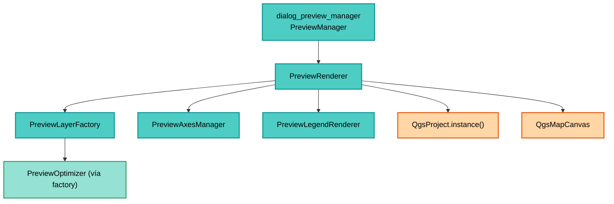

---
tags:
  - secinterp
  - code-walkthrough
  - gui
  - renderers
aliases:
  - preview_renderer.py
  - PreviewRenderer
cssclass: secinterp-note
note_lines: 700
---

# `gui/preview_renderer.py`

> [!abstract] Resumen en una línea
> Orquestador del render del preview: pide capas a la factoría, añade rejilla y etiquetas, registra las temporales en el proyecto sin leyenda, las vuelca al canvas y las limpia sin fugas (incluido el fix de scratch-layers del 2026-09-21).

**Ruta**: `gui/preview_renderer.py` (315 líneas)
**Clase principal**: `PreviewRenderer`
**Capa**: GUI (Present · Orquestador de render)
**Tags**: #secinterp #gui #renderers

---

## 🎯 ¿Por qué existe este archivo?

Convertir datos en capas no basta: hay que ordenarlas, encuadrarlas, registrar su
ciclo de vida y retirarlas sin dejar rastro. Este orquestador centraliza ese ciclo:

| Problema | Solución |
|----------|----------|
| Siete ramas de datos deben componerse en un Z-order estable | `_collect_data_layers` con orden fijo (arriba→abajo) |
| Dos renders solapados corrompen `self.layers` | Candado `is_rendering` con `try/finally` |
| Las capas de memoria huérfanas disparan el aviso de scratch-layers al salir de QGIS | `cleanup` / `_cleanup_layers` con `removeMapLayers` (fix 2026-09-21) |
| En QGIS 4 las capas fuera de proyecto pueden colgar el render | Registro con `addMapLayer(layer, False)` (sin leyenda) |
| Rejilla, etiquetas y leyenda son responsabilidades distintas | Delegación en `PreviewAxesManager` y `PreviewLegendRenderer` |

> [!important] Nota arquitectónica
> **Fachada de Presentación.** `PreviewRenderer` no crea geometrías ni calcula nada:
> coordina a `PreviewLayerFactory` (capas), `PreviewAxesManager` (rejilla) y
> `PreviewLegendRenderer` (leyenda). Es el único dueño de `self.layers`.

---

## 🧬 Diagrama de relaciones



> [!tip] Cómo leer
> El manager posee al renderer; el renderer delega en tres especialistas y solo él
> habla con `QgsProject` y el canvas. `PreviewOptimizer` llega indirectamente.

---

## 📦 Imports — lectura arquitectónica

```python
# gui/preview_renderer.py
import contextlib
from typing import Any

from qgis.core import QgsProject, QgsWkbTypes
from qgis.gui import QgsMapCanvas
from qgis.PyQt.QtCore import QRectF
from qgis.PyQt.QtGui import QPainter

from sec_interp.core.domain import GeologyData, InterpretationPolygon, ProfileData, StructureData
from sec_interp.logger_config import get_logger

from .preview_axes_manager import PreviewAxesManager
from .preview_layer_factory import PreviewLayerFactory
from .preview_legend_renderer import PreviewLegendRenderer
```

| # | Observación |
|---|-------------|
| ① | `contextlib.suppress` envuelve el `scale(1.1)` y los disconnects: fallos cosméticos nunca rompen el render. |
| ② | `QgsProject` solo se usa para registrar/retirar temporales (ciclo de vida, no datos). |
| ③ | `QgsWkbTypes` solo aparece en `_cleanup_rubber_bands` (`reset(PolygonGeometry)`). |
| ④ | `QgsMapCanvas` únicamente como anotación de tipo del canvas inyectado. |
| ⑤ | `QPainter / QRectF` solo transitan hacia `draw_legend` (el renderer no pinta). |
| ⑥ | Del core solo entran tipos (`ProfileData`, `GeologyData`, `StructureData`, `InterpretationPolygon`). |
| ⑦ | Imports relativos (`.preview_*`) marcan subpaquete cohesivo de preview dentro de `gui/`. |

---

## 🏗️ Inventario de estructura

**Clase:** `class PreviewRenderer` — 1 property + 11 métodos

**Estado (constructor):**
- `__init__(canvas=None)`: `canvas`, `layers`, `interpretation_rubbers`, `layer_factory`, `axes_manager`, `legend_renderer`, `has_topography`, `has_structures`, `is_rendering`
- `active_units` (property delegada a la factoría)

**Pipeline público:**
- `render(topo_data, geol_data, struct_data, vert_exag, dip_line_length, max_points, preserve_extent, use_adaptive_sampling, drillhole_data, interp_data)`
- `draw_legend(painter, rect)`
- `cleanup()`

**Orquestación interna:**
- `_collect_data_layers(...)` — orden Z
- `_add_struct_layer(data, topo, geol, exag, dip_len)`
- `_add_drillhole_layers(data, exag)`
- `_calculate_extent(layers)`
- `_setup_canvas(layers, extent, preserve_extent)`

**Ciclo de vida:**
- `_cleanup_layers(layers=None)`
- `_get_valid_layer_ids(layers)`
- `_cleanup_rubber_bands()`

---

## 📁 Archivos del paquete

| Archivo | Rol respecto al renderer |
|---|---|
| `gui/preview_layer_factory.py` | Crea y estiliza cada capa de datos |
| `gui/preview_axes_manager.py` | Rejilla (`create_axes_layer`) y etiquetas (`create_axes_labels_layer`) |
| `gui/preview_legend_renderer.py` | Dibuja la leyenda con `active_units` + flags |
| `gui/preview_render_mixin.py` | Decide `max_points`/VE y llama a `draw_preview` (aguas arriba) |
| `gui/preview_callbacks_mixin.py` | Refresca tras tareas async (aguas arriba) |
| `gui/dialog_preview_manager.py` | Dueño del renderer (`PreviewManager`) |
| `gui/main_dialog.py` / plugin | `draw_preview` delega en `render` |
| `gui/utils.py` | `create_memory_layer` usado por factoría y ejes |

---

## 📖 Recorrido método por método

### `__init__` — composición de especialistas

```python
def __init__(self, canvas: QgsMapCanvas | None = None) -> None:
    self.canvas = canvas
    self.layers: list = []
    self.interpretation_rubbers: list = []

    self.layer_factory = PreviewLayerFactory()
    self.axes_manager = PreviewAxesManager()
    self.legend_renderer = PreviewLegendRenderer()

    self.has_topography = False
    self.has_structures = False
    self.is_rendering = False
```

El canvas es opcional e inyectado (testeable sin QGIS real). Los tres especialistas se
crean una vez y se reutilizan entre renders; `has_topography / has_structures` son los
flags que alimentan la leyenda y se resetean en cada `render`.

### `active_units` — leyenda sin acoplamiento

```python
@property
def active_units(self) -> dict[str, Any]:
    return self.layer_factory.active_units
```

Solo lectura: expone el registro de unidades para `draw_legend` sin exponer la
factoría. El reseteo vive en `_cleanup_layers` (`self.layer_factory.active_units = {}`).

### `render` — pipeline en 6 pasos con candado

```python
def render(self, topo_data, geol_data=None, struct_data=None, vert_exag=1.0,
           dip_line_length=None, max_points=1000, preserve_extent=False,
           use_adaptive_sampling=False, drillhole_data=None, interp_data=None):
    if self.is_rendering:
        logger.warning("Render already in progress, skipping overlapping call.")
        return None, []
    try:
        self.is_rendering = True
        self._cleanup_layers()
        self.has_topography = False
        self.has_structures = False
        data_layers = self._collect_data_layers(...)
        if not data_layers:
            return None, []
        extent = self._calculate_extent(data_layers)
        axes_layer = self.axes_manager.create_axes_layer(extent, vert_exag)
        labels_layer = self.axes_manager.create_axes_labels_layer(extent, vert_exag)
        layers = [labels_layer, *data_layers, axes_layer]
        layers = [layer for layer in layers if layer is not None]
        for layer in layers:
            if layer and not QgsProject.instance().mapLayer(layer.id()):
                QgsProject.instance().addMapLayer(layer, False)
        self.layers = layers
        self._setup_canvas(layers, extent, preserve_extent)
        return self.canvas, layers
    finally:
        self.is_rendering = False
```

| Paso | Detalle |
|------|---------|
| 0. Guarda | `is_rendering` evita renders solapados (p. ej. zoom durante render); `finally` libera siempre |
| 1. Limpieza | `_cleanup_layers()` retira las temporales del render anterior |
| 2. Capas de datos | `_collect_data_layers` en Z-order |
| 3. Sin datos | `return None, []` temprano (diálogo vacío, sin error) |
| 4. Ejes | `extent` combinado solo de datos (la rejilla no lo expande) |
| 5. Registro | `addMapLayer(layer, False)`: viven en el proyecto (QGIS 4 estable) pero ocultas de la leyenda |
| 6. Canvas | `_setup_canvas` vuelca capas + encuadre + `refresh` |

> [!note] El comentario `# 4. Axes and Labels` salta el 3
> Numeración heredada del código; las fases reales son las seis de la tabla.

### `_setup_canvas` — vuelco tolerante a fallos

```python
def _setup_canvas(self, layers, extent, preserve_extent):
    if not self.canvas or not extent:
        return
    self.canvas.setLayers(layers)
    if not preserve_extent:
        padded_extent = extent
        with contextlib.suppress(AttributeError, TypeError, RuntimeError):
            padded_extent.scale(1.1)
        self.canvas.setExtent(padded_extent)
    self.canvas.refresh()
    if self.canvas.scene():
        self.canvas.scene().update()
```

`preserve_extent=True` (zoom con LOD) conserva el encuadre; si no, encuadra con un 10 %
de margen. El `suppress` protege contra extents mock en tests. El `scene().update()`
fuerza repintado en Qt6.

### `_collect_data_layers` — el Z-order canónico

```python
def _collect_data_layers(self, topo_data, geol_data, struct_data, vert_exag,
                         max_points, use_adaptive, dip_len, drill_data, interp_data):
    topo_layer = self.layer_factory.create_topo_layer(topo_data, vert_exag,
                                                      max_points, use_adaptive)
    if topo_layer:
        self.has_topography = True
    topo_fill = self.layer_factory.create_topo_fill_layer(topo_data, vert_exag, max_points)
    geol_layer = self.layer_factory.create_geol_layer(geol_data, vert_exag, max_points)
    struct_layer = self._add_struct_layer(struct_data, topo_data, geol_data, vert_exag, dip_len)
    drill_layers = self._add_drillhole_layers(drill_data, vert_exag)
    interp_layer = self.layer_factory.create_interp_layer(interp_data, vert_exag)
    candidates = [struct_layer, geol_layer, topo_layer, topo_fill,
                  *drill_layers, interp_layer]
    return [L for L in candidates if L is not None]
```

Orden de pintado (primero = arriba): estructuras → geología → topografía → relleno →
sondajes (trazas, intervalos) → interpretaciones. Los `None` se filtran; los flags de
leyenda se activan como efecto lateral.

### `_add_struct_layer` — referencia alternativa

```python
def _add_struct_layer(self, data, topo, geol, exag, dip_len):
    ref = topo if topo else ([p for s in geol for p in s.points] if geol else None)
    layer = self.layer_factory.create_struct_layer(data, ref, exag, dip_len)
    if layer:
        self.has_structures = True
    return layer
```

Si no hay topo, los ticks escalan contra los puntos de geología aplanados; sin ambos,
`ref=None` y la factoría usa el rango por defecto (100 → longitud 10).

### `_add_drillhole_layers` — trazas + intervalos

```python
def _add_drillhole_layers(self, data, exag):
    layers = []
    if not data:
        return layers
    t_layer = self.layer_factory.create_drillhole_trace_layer(data, exag)
    if t_layer:
        layers.append(t_layer)
    i_layer = self.layer_factory.create_drillhole_interval_layer(data, exag)
    if i_layer:
        layers.append(i_layer)
    return layers
```

Devuelve 0–2 capas en orden traza→intervalo. La guarda `if not data` evita capas
vacías cuando el task async aún no terminó.

### `draw_legend` — delegación total

```python
def draw_legend(self, painter: QPainter, rect: QRectF) -> None:
    self.legend_renderer.draw_legend(
        painter, rect, self.active_units, self.has_topography, self.has_structures)
```

El renderer no sabe dibujar leyendas: reenvía painter, rect, unidades y flags. Ver
[[preview_legend_renderer]].

### `cleanup` + `_cleanup_layers` — el fix de scratch-layers (2026-09-21)

```python
def cleanup(self) -> None:
    self._cleanup_layers()

def _cleanup_layers(self, layers=None):
    if layers is None:
        layers = self.layers
    project = QgsProject.instance()
    if not project or not layers:
        return
    valid_ids = self._get_valid_layer_ids(layers)
    if valid_ids:
        try:
            project.removeMapLayers(valid_ids)
        except Exception as e:
            logger.warning(f"Non-critical error during layer cleanup: {e}")
    self.layers = []
    self.layer_factory.active_units = {}
    self._cleanup_rubber_bands()
```

Idempotente y seguro en cierre de diálogo y descarga del plugin: retira las
temporales del proyecto para que QGIS no pregunte por scratch-layers al salir.
El `try/except` con `warning` hace la limpieza no crítica por diseño. Acepta una lista
externa (limpieza selectiva) aunque el uso normal es `self.layers`.

### `_get_valid_layer_ids` — tolerante a objetos rancios

```python
def _get_valid_layer_ids(self, layers):
    valid_ids = []
    for layer in layers:
        try:
            if layer and hasattr(layer, "id"):
                valid_ids.append(layer.id())
        except (RuntimeError, AttributeError):
            continue
    return valid_ids
```

Los wrappers SIP de capas eliminadas en C++ lanzan `RuntimeError` al tocarlos; este
filtro los salta. Sin él, un render tras cierre parcial rompería la limpieza.

### `_cleanup_rubber_bands` — memoria C++ de interpretaciones

```python
def _cleanup_rubber_bands(self):
    if not self.canvas or not self.canvas.scene():
        self.interpretation_rubbers = []
        return
    scene = self.canvas.scene()
    for rb in self.interpretation_rubbers:
        try:
            rb.hide()
            rb.reset(QgsWkbTypes.GeometryType.PolygonGeometry)
            scene.removeItem(rb)
        except Exception as e:
            logger.warning(f"Failed to remove rubber band: {e}")
    self.interpretation_rubbers = []
```

`hide + reset + removeItem` libera los items de escena (memoria C++ que Python no
recoge solo). Cada fallo se registra y continúa.

### `_calculate_extent` — envolvente combinada

```python
def _calculate_extent(self, layers):
    extent = None
    for layer in layers:
        layer_extent = layer.extent()
        if extent is None:
            extent = layer_extent
        else:
            extent.combineExtentWith(layer_extent)
    return extent
```

Solo capas de datos (la rejilla se dibuja después dentro de ese encuadre).

---

## 🔄 Flujo de datos

| Fase | Entrada | Transformación | Salida |
|------|---------|----------------|--------|
| Ramas del `PreviewResult` | `topo / geol / struct / drillhole` + `interp_data` | factoría → capas | `data_layers` en Z-order |
| Encuadre | capas de datos | `_calculate_extent` | `extent` combinado |
| Rejilla | `extent` + `vert_exag` | `axes_manager` | capas de ejes y etiquetas |
| Registro | capas sueltas | `addMapLayer(layer, False)` | vida estable sin leyenda |
| Canvas | capas + extent | `setLayers / setExtent / refresh` | `(canvas, layers)` |
| Limpieza | `self.layers` | `removeMapLayers` + reset leyenda/rubbers | `[]`, sin temporales |

---

## 🏛️ Patrones de diseño presentes

| Patrón | Dónde | Propósito |
|--------|-------|-----------|
| **Facade** | `render` | Una llamada compone factoría + ejes + canvas |
| **Delegation** | tres especialistas | Separar capas, rejilla y leyenda |
| **Guard (reentrancy)** | `is_rendering` + `finally` | Sin renders solapados |
| **Z-order fijo** | `_collect_data_layers` | Orden de pintado determinista |
| **Lifecycle owner** | `_cleanup_layers` | Sin fugas de scratch-layers |
| **Tolerant reader** | `_get_valid_layer_ids` | Soportar wrappers C++ rancios |

---

## 🧾 Resumen de la API

| Símbolo | Firma | Uso típico |
|---------|-------|------------|
| `PreviewRenderer` | `__init__(canvas=None)` | Un ejemplar por diálogo |
| `render` | `(topo_data, geol_data=None, struct_data=None, vert_exag=1.0, dip_line_length=None, max_points=1000, preserve_extent=False, use_adaptive_sampling=False, drillhole_data=None, interp_data=None) -> tuple` | Pipeline completo |
| `draw_legend` | `(painter: QPainter, rect: QRectF)` | Leyenda sobre el canvas |
| `cleanup` | `() -> None` | Cierre/descarga sin fugas |
| `active_units` | property | Lectura de unidades para leyenda |
| `_collect_data_layers` | privada | Z-order |
| `_cleanup_layers` | `(layers=None)` | Retirada de temporales |

---

## 🛡️ Manejo de errores

| Situación | Comportamiento |
|-----------|----------------|
| Render solapado | `warning` + `return None, []` |
| Sin capas de datos | `return None, []` silencioso |
| Sin canvas o sin extent | `_setup_canvas` retorna sin hacer nada |
| Fallo en `removeMapLayers` | `warning` (no crítico), continúa reseteando estado |
| Rubber band roto | `warning` por item, continúa con el resto |
| `scale(1.1)` incompatible | suprimido (`AttributeError/TypeError/RuntimeError`) |

---

## 🧪 Tests asociados

- `tests/gui/test_preview_components.py` — `TestPreviewComponents`: pipeline `render` con mocks, ejes y factoría.
- `tests/gui/test_preview_renderer_custom.py` — `dip_line_length` personalizado hasta la capa estructural.
- `tests/gui/test_dialog_preview_manager.py` — el manager dueño del renderer (ciclo accept/close).
- `tests/core/test_preview_service.py` — el `PreviewResult` de entrada al pipeline.

---

## 👀 Observaciones y notas

> [!success] Fortalezas
> - Dueño único de `self.layers`: limpieza idempotente y sin fugas (fix 2026-09-21).
> - Candado anti-solape con liberación garantizada en `finally`.
> - `addMapLayer(layer, False)` estabiliza QGIS 4 sin contaminar la leyenda del proyecto.
> - Rejilla fuera del cálculo de extent: el encuadre lo mandan los datos.

> [!warning] Puntos de atención
> - `padded_extent = extent` no copia: `scale(1.1)` muta el extent combinado (normalmente descartado tras el render).
> - `has_topography / has_structures` como efectos laterales de `_collect_data_layers` acoplan leyenda y colección.
> - Sin canvas (tests/headless) `render` registra en proyecto pero retorna capas igualmente: el llamador debe tolerar `canvas=None`.

> [!question] Preguntas abiertas
> - ¿Copiar el extent antes de `scale` para no mutar el objeto combinado?
> - ¿Devolver los flags de leyenda en vez de fijarlos por efecto lateral?

---

## 🔗 Notas relacionadas

- [[Index]] — índice de la bóveda
- [[preview_service]] — `PreviewResult` que alimenta el pipeline
- [[preview_layer_factory]] — crea cada capa de datos
- [[preview_axes_manager]] — rejilla y etiquetas del encuadre
- [[preview_legend_renderer]] — leyenda delegada
- [[dialog_preview_manager]] — dueño del renderer
- [[preview_page]] — canvas y widget de resultados
- [[controller]] — composición raíz de servicios y extractors
- [[vertical_exaggeration_service]] — VE adaptativa mostrada
- [[layer_notification_manager]] — invalidación ante cambios de capas

---

*Nota de la bóveda SecInterp Code Walkthrough v2 — v3.9.0*
