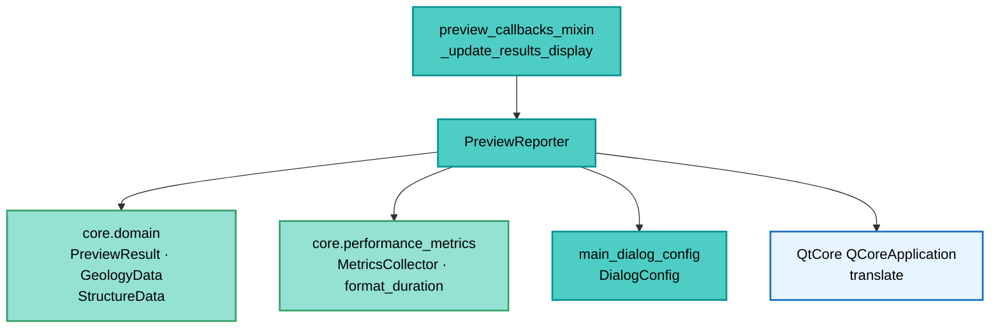

---
tags:
  - secinterp
  - code-walkthrough
  - gui
  - preview
aliases:
  - preview_reporter.py
  - PreviewReporter
cssclass: secinterp-note
---

# `gui/preview_reporter.py`

> [!abstract] Resumen en una línea
> Formateador estático que convierte el `PreviewResult` y sus métricas en el texto de resultados del diálogo: conteos por rama, rangos geométricos, exageración vertical (auto/manual) y tiempos de `MetricsCollector`, todo traducible.

**Ruta**: `gui/preview_reporter.py` (181 líneas)
**Clase principal**: `PreviewReporter`
**Capa**: GUI (Present · Formato de resultados)
**Tags**: #secinterp #gui #preview

---

## 🎯 ¿Por qué existe este archivo?

El `PreviewResult` es una estructura de datos; el usuario necesita un resumen legible
en `results_text`. Este formateador concentra ese texto en un solo lugar:

| Problema | Solución |
|----------|----------|
| Cada callback formateaba resultados a su manera | `format_results_message(result, metrics, vert_exag, auto_vert_exag)` único |
| El resumen mezcla conteos, rangos, VE y tiempos | Un método estático por bloque, compuestos por líneas |
| Los literales deben traducirse | `QCoreApplication.translate("PreviewReporter", ...)` en cada cadena |
| Las métricas internas no deben filtrarse sin control | Gate `DialogConfig.ENABLE_PERFORMANCE_METRICS and SHOW_METRICS_IN_RESULTS` |
| Timings opcionales (geol/struct ausentes) ensucian el informe | Saltos condicionales si `result.geol`/`result.struct` vacíos |

> [!important] Nota arquitectónica
> **Presenter puro sin widgets.** No conoce `results_text` ni el diálogo: entra
> `PreviewResult`, sale `str`/`list[str]`. Quien lo llama ([[preview_callbacks_mixin]])
> decide dónde mostrarlo. Testeable sin Qt.

---

## 🧬 Diagrama de relaciones



> [!tip] Cómo leer
> El mixin produce el `PreviewResult` desde la caché y el reporter lo reduce a texto.
> `DialogConfig` decide si los tiempos se muestran; `format_duration` los humaniza.

---

## 📦 Imports — lectura arquitectónica

```python
# gui/preview_reporter.py
from typing import Any

from qgis.PyQt.QtCore import QCoreApplication

from sec_interp.core.domain import GeologyData, PreviewResult, StructureData
from sec_interp.core.performance_metrics import MetricsCollector, format_duration

from .main_dialog_config import DialogConfig
```

| # | Observación |
|---|-------------|
| ① | Solo `QCoreApplication` de Qt: traducir sin widgets ni canvas. |
| ② | Del core solo tipos de lectura (`PreviewResult`, `GeologyData`, `StructureData`) + métricas. |
| ③ | `MetricsCollector` como parámetro (no global): el llamador posee las métricas del ciclo. |
| ④ | `DialogConfig` es el único acoplamiento a configuración GUI (doble flag de métricas). |
| ⑤ | `Any` solo en `format_drillhole_summary(drillhole_data: Any)`: la rama es heterogénea. |
| ⑥ | Cero `qgis.core`: formateo 100 % agnóstico de capas. |

---

## 🏗️ Inventario de estructura

**Clase:** `class PreviewReporter` — 7 `staticmethods`

- `format_results_message(result, metrics, vert_exag=None, auto_vert_exag=False) -> str`
- `format_geology_summary(geol_data) -> str`
- `format_structure_summary(struct_data, buffer_dist) -> str`
- `format_drillhole_summary(drillhole_data) -> str`
- `format_result_metrics(result) -> list[str]`
- `format_vertical_exaggeration(vert_exag, auto_vert_exag) -> list[str]`
- `format_performance_metrics(metrics, result) -> list[str]`

---

## 📁 Archivos del paquete

| Archivo | Rol respecto al reporter |
|---|---|
| `gui/preview_callbacks_mixin.py` | `_update_results_display` lo invoca y vuelca en `results_text` |
| `gui/main_dialog_config.py` | `DialogConfig`: flags de visibilidad de métricas |
| `core/domain/dtos.py` | `PreviewResult.get_elevation_range / get_distance_range` (ver [[dtos]]) |
| `core/performance_metrics.py` | `MetricsCollector.timings` + `format_duration` |
| `gui/preview_render_mixin.py` | `_resolve_vertical_exaggeration` provee el VE mostrado |

---

## 📖 Recorrido método por método

### `format_results_message` — el informe completo

```python
@staticmethod
def format_results_message(result, metrics, vert_exag=None, auto_vert_exag=False):
    lines = [
        QCoreApplication.translate("PreviewReporter", "✓ Preview generated!"),
        "",
        QCoreApplication.translate("PreviewReporter", "Topography: {} points").format(
            len(result.topo) if result.topo else 0),
    ]
    lines.append(PreviewReporter.format_geology_summary(result.geol))
    lines.append(PreviewReporter.format_structure_summary(result.struct, result.buffer_dist))
    lines.append(PreviewReporter.format_drillhole_summary(result.drillhole))
    lines.extend(PreviewReporter.format_result_metrics(result))
    lines.extend(PreviewReporter.format_vertical_exaggeration(vert_exag, auto_vert_exag))
    if DialogConfig.ENABLE_PERFORMANCE_METRICS and DialogConfig.SHOW_METRICS_IN_RESULTS:
        lines.extend(PreviewReporter.format_performance_metrics(metrics, result))
    footer = (
        QCoreApplication.translate(
            "PreviewReporter", "Vertical exaggeration is set automatically.")
        if auto_vert_exag
        else QCoreApplication.translate(
            "PreviewReporter", "Adjust 'Vert. Exag.' and click Preview to update.")
    )
    lines.extend(["", footer])
    return "\n".join(lines)
```

| Bloque | Contenido |
|--------|-----------|
| Cabecera | `✓ Preview generated!` + topografía (0 si ausente) |
| Ramas | Una línea por geología, estructuras y sondajes |
| Rangos | Elevación y distancia desde el resultado |
| VE | Línea auto/manual o nada si `vert_exag is None` |
| Tiempos | Solo con doble flag de `DialogConfig` |
| Pie | Mensaje distinto según VE automática o manual |

### `format_geology_summary` — una línea por rama

```python
@staticmethod
def format_geology_summary(geol_data):
    if not geol_data:
        return QCoreApplication.translate("PreviewReporter", "Geology: No data")
    return QCoreApplication.translate("PreviewReporter", "Geology: {} segments").format(
        len(geol_data))
```

Distingue "sin datos" de "N segmentos": el usuario sabe si la rama se omitió o se
calculó vacía. Patrón idéntico en las tres ramas (simetría deliberada).

### `format_structure_summary` — con buffer

```python
@staticmethod
def format_structure_summary(struct_data, buffer_dist):
    if not struct_data:
        return QCoreApplication.translate("PreviewReporter", "Structures: No data")
    return QCoreApplication.translate(
        "PreviewReporter", "Structures: {} measurements (buffer: {}m)"
    ).format(len(struct_data), buffer_dist)
```

Incluye el `buffer_dist` del resultado: las medidas dependen del buffer de captura y
el informe lo hace explícito (trazabilidad del parámetro).

### `format_drillhole_summary` — conteo heterogéneo

```python
@staticmethod
def format_drillhole_summary(drillhole_data):
    if not drillhole_data:
        return QCoreApplication.translate("PreviewReporter", "Drillholes: No data")
    return QCoreApplication.translate(
        "PreviewReporter", "Drillholes: {} holes found").format(len(drillhole_data))
```

Acepta `Any` (lista de `DrillholeProjection` o tuplas): solo usa `len`, sin asumir
forma. "holes found" (no "processed") refleja que es proyección, no cálculo.

### `format_result_metrics` — rangos geométricos

```python
@staticmethod
def format_result_metrics(result):
    min_elev, max_elev = result.get_elevation_range()
    min_dist, max_dist = result.get_distance_range()
    return [
        "",
        QCoreApplication.translate("PreviewReporter", "Geometry Range:"),
        QCoreApplication.translate("PreviewReporter", "  Elevation: {} to {} m").format(
            round(min_elev, 1), round(max_elev, 1)),
        QCoreApplication.translate("PreviewReporter", "  Distance: {} to {} m").format(
            round(min_dist, 1), round(max_dist, 1)),
    ]
```

Delega en el `PreviewResult` (elevación global multi-rama, distancia desde topo) y
redondea a 0,1 m. La indentación de dos espacios agrupa visualmente bajo el título.

### `format_vertical_exaggeration` — auto vs manual

```python
@staticmethod
def format_vertical_exaggeration(vert_exag, auto_vert_exag):
    if vert_exag is None:
        return []
    if auto_vert_exag:
        line = QCoreApplication.translate(
            "PreviewReporter", "Vertical exaggeration: {}× (auto)").format(round(vert_exag, 1))
    else:
        line = QCoreApplication.translate(
            "PreviewReporter", "Vertical exaggeration: {}× (manual)").format(round(vert_exag, 1))
    return ["", line]
```

El `×` unicode y el sufijo `(auto)/(manual)` replican la convención del
[[vertical_exaggeration_service]]: el usuario siempre sabe el origen del factor.

### `format_performance_metrics` — tiempos con filtro

```python
@staticmethod
def format_performance_metrics(metrics, result):
    timings = metrics.timings
    if not timings:
        return []
    lines = ["", QCoreApplication.translate("PreviewReporter", "Performance:")]
    mapping = {
        "Topography Generation": "  Topo: {}",  # no-i18n: internal perf key
        "Geology Generation": "  Geol: {}",  # no-i18n: internal perf key
        "Structure Generation": "  Struct: {}",  # no-i18n: internal perf key
        "Rendering": "  Render: {}",  # no-i18n: internal perf key
        "Total Preview Generation": "  Total: {}",  # no-i18n: internal perf key
    }
    for key, template in mapping.items():
        if key in timings:
            if key == "Geology Generation" and not result.geol:  # no-i18n: dict key
                continue
            if key == "Structure Generation" and not result.struct:  # no-i18n: dict key
                continue
            lines.append(QCoreApplication.translate("PreviewReporter", template).format(
                format_duration(timings[key])))
    return lines
```

| Decisión | Detalle |
|----------|---------|
| Claves `no-i18n` | Los nombres de fase son claves internas de `PerformanceTimer`, no UI |
| Plantillas traducibles | `"  Topo: {}"` sí pasa por `translate` (etiqueta visible) |
| Filtro geol/struct | Tiempos huérfanos (corrió pero sin datos) se ocultan |
| Orden fijo | El dict preserva el orden narrativo topo→total |

---

## 🔄 Flujo de datos

| Fase | Entrada | Transformación | Salida |
|------|---------|----------------|--------|
| Caché | `cached_data` + métricas | `PreviewResult(...)` ensamblado | resultado consolidado |
| Bloques | resultado + VE + métricas | siete formateadores | lista de líneas |
| Gate | `DialogConfig` | doble flag | tiempos incluidos u omitidos |
| Texto | líneas | `"\n".join` | `str` para `results_text` |
| VE auto | `auto_ve_check` | `set_auto_ve` + sufijo `(auto)` | display coherente |

---

## 🏛️ Patrones de diseño presentes

| Patrón | Dónde | Propósito |
|--------|-------|-----------|
| **Presenter (sin widgets)** | toda la clase | Texto testeable sin Qt |
| **Composed formatter** | `format_results_message` | Un bloque = un método |
| **Feature gate** | doble flag `DialogConfig` | Métricas solo si se piden |
| **Template i18n** | `translate(...).format(...)` | Traducir antes de interpolar |

---

## 🧾 Resumen de la API

| Símbolo | Firma | Uso típico |
|---------|-------|------------|
| `format_results_message` | `(result, metrics, vert_exag=None, auto_vert_exag=False) -> str` | Texto del diálogo |
| `format_geology_summary` | `(geol_data) -> str` | Línea de geología |
| `format_structure_summary` | `(struct_data, buffer_dist) -> str` | Línea + buffer |
| `format_drillhole_summary` | `(drillhole_data) -> str` | Línea de sondajes |
| `format_result_metrics` | `(result) -> list[str]` | Rangos |
| `format_vertical_exaggeration` | `(vert_exag, auto_vert_exag) -> list[str]` | Línea de VE |
| `format_performance_metrics` | `(metrics, result) -> list[str]` | Tiempos |

---

## 🛡️ Manejo de errores

| Situación | Comportamiento |
|-----------|----------------|
| Rama ausente | Línea "No data", nunca excepción |
| `vert_exag is None` | Bloque omitido (`[]`) |
| `timings` vacío | Bloque omitido (`[]`) |
| Métricas deshabilitadas | Bloque omitido por gate |

> [!note] Totalmente total
> Ningún método lanza: con resultado vacío produce el informe "todo sin datos". El
> llamador no necesita `try/except`.

---

## 🧪 Tests asociados

- `tests/gui/test_dialog_preview_manager.py` — `_update_results_display` y el texto final en `results_text`.
- `tests/core/test_preview_service.py` — `PreviewResult` y `metrics` que alimentan el informe.
- `tests/core/test_vertical_exaggeration_service.py` — el VE mostrado como auto/manual.

---

## 👀 Observaciones y notas

> [!success] Fortalezas
> - Simetría total entre ramas: fácil añadir una nueva (p. ej. interpretaciones).
> - i18n sistemático con contexto `"PreviewReporter"`.
> - Claves internas marcadas `no-i18n` sin contaminar el catálogo.

> [!warning] Puntos de atención
> - Sin fila de interpretaciones: `interp_data` se renderiza pero no se informa.
> - `round(..., 1)` fijo: rangos kilométricos muestran decimales inútiles.
> - El pie menciona `'Vert. Exag.'` (nombre del control en inglés) sin traducir.
> - `format_drillhole_summary` tipado `Any`: sin distinción tupla vs DTO.

> [!question] Preguntas abiertas
> - ¿Añadir línea de interpretaciones (`N polígonos`) al informe?
> - ¿Formato de rangos adaptativo (m vs km) según magnitud?

---

## 🧾 Ejemplo de informe

Con topo de 843 puntos, 12 segmentos, 5 medidas (buffer 50 m), 3 sondajes,
rango 120,4–368,9 m, VE 1,5 (auto) y métricas activas:

```text
✓ Preview generated!

Topography: 843 points
Geology: 12 segments
Structures: 5 measurements (buffer: 50.0m)
Drillholes: 3 holes found

Geometry Range:
  Elevation: 120.4 to 368.9 m
  Distance: 0.0 to 2450.0 m

Vertical exaggeration: 1.5× (auto)

Performance:
  Topo: 320 ms
  Geol: 180 ms
  Struct: 95 ms
  Render: 140 ms
  Total: 812 ms

Vertical exaggeration is set automatically.
```

> [!note] Un bloque por método
> Cada párrafo del ejemplo sale de un formateador: cabecera, tres ramas, rangos
> (`format_result_metrics`), VE (`format_vertical_exaggeration`), tiempos
> (`format_performance_metrics`) y pie según modo.

---

## 🔗 Notas relacionadas

- [[Index]] — índice de la bóveda
- [[preview_callbacks_mixin]] — invoca el informe desde la caché
- [[preview_render_mixin]] — resuelve el VE mostrado
- [[preview_service]] — produce `result` + `metrics`
- [[preview_page]] — `results_text` destino del texto
- [[dtos]] — `PreviewResult.get_elevation_range / get_distance_range`
- [[vertical_exaggeration_service]] — convención auto/manual
- [[performance_metrics]] — `MetricsCollector` y `format_duration`
- [[main_dialog_config]] — flags de visibilidad

---

*Nota de la bóveda SecInterp Code Walkthrough v2 — v3.9.1*
