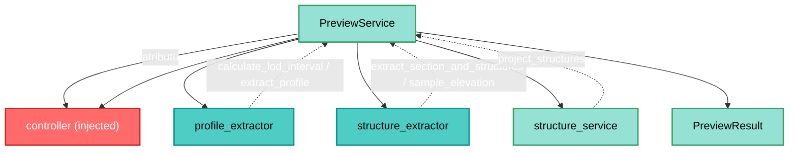

---
tags:
  - secinterp
  - code-walkthrough
  - core
  - services
  - orchestrator
aliases:
  - preview_service.py
  - PreviewService
  - IPreviewService
cssclass: secinterp-note
note_lines: 700
---

# `core/services/preview_service.py`

> [!abstract] Resumen en una línea
> Orquestador que genera, de forma **síncrona**, la topografía y las estructuras del preview en un `PreviewResult` consolidado, apoyándose en los adapters y servicios del controller inyectado.

**Ruta**: `core/services/preview_service.py` (175 líneas)
**Clase principal**: `PreviewService`
**Capa**: Core (QGIS-agnóstico)
**Tags**: #secinterp #core #services #orchestrator

---

## 🎯 ¿Por qué existe este archivo?

El preview de una sección requiere componer varios pasos (topografía + estructuras) en un
resultado único, con métricas de rendimiento y soporte de LOD. Este servicio centraliza
esa orquestación sin acoplarse a QGIS:

| Problema | Solución |
|----------|----------|
| Componer topo + estructuras en un resultado | `generate_all` → `PreviewResult` |
| Acceder a otros servicios sin acoplarse a ellos | `controller` inyectado + `@property` |
| Medir el coste de cada paso | `PerformanceTimer` + `result.metrics` |
| Calcular LOD adaptativo de puntos | `calculate_max_points` (static) |

> [!important] Nota arquitectónica
> **QGIS-agnóstico** (cero `qgis.*`): los objetos de capa cruzan tipados como `Any` dentro
> de `PreviewParams`. El `controller` inyectado actúa como **composition root**: el
> servicio delega en sus extractors/servicios sin conocer su implementación.

---

## 🧬 Diagrama de relaciones



> [!tip] Cómo leer
> `PreviewService` no crea los extractors: los obtiene del `controller` inyectado. Las
> flechas punteadas marcan las llamadas a la fase Extract (GUI) y al Compute puro
> (`structure_service`).

---

## 📦 Imports — lectura arquitectónica

```python
# core/services/preview_service.py
import math
from typing import Any

from sec_interp.core.domain import PreviewParams, PreviewResult
from sec_interp.core.exceptions import ProcessingError
from sec_interp.core.performance_metrics import PerformanceTimer
from sec_interp.logger_config import get_logger
```

| # | Observación |
|---|-------------|
| ① | **Cero `qgis.*`**: solo stdlib, dominio, excepciones y telemetría. |
| ② | `math` se usa en `calculate_max_points` para el boost logarítmico del zoom. |
| ③ | `PreviewParams`/`PreviewResult` son los DTOs de entrada/salida. |
| ④ | `ProcessingError` se lanza si faltan capas obligatorias de topografía. |
| ⑤ | `PerformanceTimer` (context manager) alimenta `result.metrics`. |

> [!note] No hereda `IPreviewService`
> A diferencia de los otros servicios, `PreviewService` **no** hereda el contrato
> `IPreviewService`: lo implementa por forma (duck typing), no por herencia nominal.

---

## 🏗️ Inventario de estructura

**Clases:** `class PreviewService` — 8 miembros (3 properties + 5 métodos)

**Propiedades (acceso delegado al controller):**
- `drillhole_service` — `self.controller.drillhole_service`
- `geology_service` — `self.controller.geology_service`
- `structure_service` — `self.controller.structure_service`

**Métodos:**
- `__init__(controller: Any)`
- `calculate_max_points(canvas_width, manual_max=1000, auto_lod=True, ratio=1.0) -> int` (static)
- `generate_all(params: PreviewParams, transform_context: Any) -> PreviewResult`
- `_generate_topography_step(params, result)`
- `_generate_structures_step(params, result)`

---

## 📖 Recorrido método por método

### `__init__` y properties — Composition root

```python
def __init__(self, controller: Any) -> None:
    self.controller = controller

@property
def drillhole_service(self) -> Any:
    return self.controller.drillhole_service

@property
def geology_service(self) -> Any:
    return self.controller.geology_service

@property
def structure_service(self) -> Any:
    return self.controller.structure_service
```

El `controller` se recibe por inyección y las `@property` exponen sus servicios. Es
delegación pura: el preview no instancia nada, solo enruta.

### `calculate_max_points` — LOD adaptativo (static)

```python
@staticmethod
def calculate_max_points(canvas_width, manual_max=1000, auto_lod=True, ratio=1.0) -> int:
    if auto_lod:
        base_points = max(200, int(canvas_width * 2))
        ZOOM_DETAIL_BOOST_THRESHOLD = 1.1
        if ratio > ZOOM_DETAIL_BOOST_THRESHOLD:
            detail_boost = 1.0 + (math.log10(ratio) * 0.5)
            return int(base_points * detail_boost)
        return base_points
    return manual_max
```

| Regla | Valor |
|-------|-------|
| Base automática | `max(200, canvas_width * 2)` (≈ 2× el ancho en píxeles) |
| Boost de zoom | si `ratio > 1.1` → `1.0 + log10(ratio) * 0.5` |
| Modo manual | devuelve `manual_max` |

> [!tip] `ratio` = full_extent / current_extent
> Cuanto más se acerca el usuario, más puntos se muestran. Es un LOD suave, no un salto.

### `generate_all` — Orquestación principal

```python
def generate_all(self, params: PreviewParams, transform_context: Any) -> PreviewResult:
    params.validate()
    result = PreviewResult(buffer_dist=params.buffer_dist)
    self.transform_context = transform_context
    self._generate_topography_step(params, result)
    self._generate_structures_step(params, result)
    return result
```

| Paso | Detalle |
|------|---------|
| **Validación** | `params.validate()` (nativos: `buffer_dist`, `band_num`) |
| **Resultado** | `PreviewResult(buffer_dist=...)` con `metrics` por defecto |
| **CRS** | `transform_context` se guarda como atributo (para operaciones posteriores) |
| **Topografía** | `_generate_topography_step` |
| **Estructuras** | `_generate_structures_step` (flujo desacoplado) |

> [!note] Síncrono por diseño
> Topo y estructuras son **síncronas**; los sondajes se generan **asíncronamente** vía el
> orquestador de tareas de la GUI (docstring del módulo). Por eso no hay paso de sondajes.

### `_generate_topography_step` — Paso 1

```python
def _generate_topography_step(self, params, result) -> None:
    with PerformanceTimer("Topography Generation", result.metrics):
        line_lyr = params.line_layer
        raster_lyr = params.raster_layer
        if not line_lyr or not raster_lyr:
            raise ProcessingError("Required layers for topography are missing.")
        interval = None
        if params.auto_lod:
            interval = self.controller.profile_extractor.calculate_lod_interval(
                line_lyr, params.canvas_width
            )
        result.topo = self.controller.profile_extractor.extract_profile(
            line_lyr, raster_lyr, params.band_num, interval=interval,
        )
        if result.topo:
            result.metrics.record_count("Topography Points", len(result.topo))
```

| Característica | Detalle |
|----------------|---------|
| **Métrica** | `PerformanceTimer` como context manager |
| **Obligatorio** | `raise ProcessingError` si faltan `line_lyr`/`raster_lyr` |
| **LOD** | `calculate_lod_interval` solo si `auto_lod` |
| **Extract** | `extract_profile(...)` → `result.topo` |
| **Contador** | `record_count("Topography Points", len(...))` |

### `_generate_structures_step` — Paso 2

```python
def _generate_structures_step(self, params, result) -> None:
    if params.struct_layer and params.dip_field and params.strike_field:
        with PerformanceTimer("Structure Generation", result.metrics):
            struct_lyr = params.struct_layer
            if not struct_lyr:
                return
            extractor = self.controller.structure_extractor
            if not extractor:
                return
            ctx = extractor.extract_section_and_structures(
                params.line_layer, struct_lyr, params.buffer_dist
            )
            if ctx is None:
                return
            raster_lyr = params.raster_layer
            def elevation_sampler(x: float, y: float) -> float:
                return extractor.sample_elevation(raster_lyr, x, y, params.band_num)
            result.struct = self.controller.structure_service.project_structures(
                line_points=ctx.line_points,
                struct_data=ctx.structures,
                elevation_sampler=elevation_sampler,
                line_az=ctx.line_azimuth,
                dip_field=params.dip_field,
                strike_field=params.strike_field,
            )
            if result.struct:
                result.metrics.record_count("Structure Points", len(result.struct))
```

| Característica | Detalle |
|----------------|---------|
| **Opcional** | gate triple `struct_layer` + `dip_field` + `strike_field` |
| **Extract** | `extract_section_and_structures` → `ctx` (línea + estructuras) |
| **Callback** | `elevation_sampler` = closure sobre `sample_elevation` |
| **Compute** | `project_structures(...)` → `result.struct` |
| **Contador** | `record_count("Structure Points", len(...))` |

> [!important] `elevation_sampler` = inversión de dependencias
> Igual que en [[controller]], la closure encapsula el acceso al raster para que
> `structure_service.project_structures` (core puro) solo llame `elevation_sampler(x, y)`.

---

## 🔄 Flujo de datos

| Fase | Entrada | Transformación | Salida |
|------|---------|----------------|--------|
| Validación | `PreviewParams` | `validate()` | lanza si inválido |
| Topografía | `line_lyr`, `raster_lyr` | `extract_profile` | `result.topo` |
| Estructuras | `ctx` + callback | `project_structures` | `result.struct` |
| Consolidación | `PreviewResult` | — | `PreviewResult` |

---

## 🏛️ Patrones de diseño presentes

| Patrón | Dónde | Propósito |
|--------|-------|-----------|
| **Orchestrator** | `generate_all` | Compone los pasos en un resultado |
| **Dependency Injection** | `__init__(controller)` | Composition root |
| **Delegation (properties)** | `*_service` | Exponer servicios sin instanciar |
| **Strategy (callback)** | `elevation_sampler` | Muestreo de elevación inyectado |
| **Context Manager (timer)** | `PerformanceTimer` | Métricas por paso |

---

## 🧾 Resumen de la API

| Símbolo | Firma / Hereda | Uso típico |
|---------|----------------|------------|
| `PreviewService` | (sin herencia de contrato) | Orquestador de preview |
| `__init__` | `(controller: Any)` | DI |
| `drillhole_service` / `geology_service` / `structure_service` | `@property` | Acceso delegado |
| `calculate_max_points` | `(canvas_width, manual_max, auto_lod, ratio) -> int` (static) | LOD |
| `generate_all` | `(params, transform_context) -> PreviewResult` | Principal |
| `_generate_topography_step` / `_generate_structures_step` | privados | Pasos |

---

## 🛡️ Manejo de errores

| Situación | Comportamiento |
|-----------|----------------|
| `params` inválidos | `validate()` lanza `ValueError` |
| Topografía sin capas | `raise ProcessingError(...)` |
| Estructuras sin `struct_layer`/`dip`/`strike` | se omite el paso (gate) |
| `ctx is None` (extracción fallida) | `return` silencioso |

> [!note] Topo "lanza", estructuras "omite"
> La topografía es **obligatoria** (lanza `ProcessingError`); las estructuras son
> **opcionales** (guard clauses). Coherente con la política del `controller`.

---

## 🧪 Tests asociados

Mapeo a `tests/core/test_preview_service.py` (mock-first, sin QGIS):

- `test_preview_service.py` — orquestación con `controller` y extractors **mock**.
- Verifica el cálculo de `calculate_max_points` (LOD) y la métrica por paso.

---

## 👀 Observaciones y notas

> [!success] Fortalezas
> - **Cero QGIS** y composición limpia vía `controller`.
> - `PerformanceTimer` da métricas por paso sin acoplar.
> - LOD adaptativo suave (`log10`) en `calculate_max_points`.
> - Reutiliza la inversión de dependencias (`elevation_sampler`).

> [!warning] Puntos de atención
> - `self.transform_context` es un **objeto QGIS** guardado como estado mutable (coupling latente).
> - No hereda `IPreviewService` (inconsistencia con el resto de servicios).
> - `transform_context` no se usa dentro de `generate_all`; solo se almacena.
> - Los mensajes de error (`"Required layers..."`) no usan `self.tr()` (sin i18n).

> [!question] Preguntas abiertas
> - ¿Hacer que `PreviewService` herede `IPreviewService` para coherencia?
> - ¿Eliminar el atributo `transform_context` si no se consume aquí?
> - ¿Traducir los mensajes de `ProcessingError` con `self.tr()`?

---

## 📐 Síncrono vs asíncrono

El docstring del módulo fija la división de responsabilidades:

| Dominio | Modo | Dónde se genera |
|---------|------|-----------------|
| Topografía | **síncrono** | `_generate_topography_step` |
| Estructuras | **síncrono** | `_generate_structures_step` |
| Sondajes | **asíncrono** | orquestador de tareas de la GUI (no aquí) |
| Geología | (no en este flujo) | `controller` / `_process_geology` |

> [!important] Por qué sondajes fuera
> Los sondajes son caros (trayectoria por pozo); se procesan en `QgsTask` para no bloquear
> el canvas. El `PreviewResult` los recibe después vía `result.drillhole`.

## 🧩 El atributo `transform_context`

```python
self.transform_context = transform_context
```

Es un `QgsCoordinateTransformContext` (objeto QGIS) que llega tipado como `Any`. Se
**almacena** como atributo para que pasos posteriores (render/export) puedan hacer
transformaciones de CRS. En `generate_all` no se consume directamente.

> [!warning] Coupling latente
> Guardar un objeto QGIS como estado de instancia acerca el servicio a la GUI, aunque no
> lo importe. Es el punto más frágil de la nota arquitectónica.

## 🔗 Notas relacionadas

- [[Index]] — índice de la bóveda
- [[controller]] — el `controller` inyectado es su composition root
- [[core_interfaces]] — `IPreviewService` (contrato no heredado)
- [[domain]] / [[dtos]] — `PreviewParams`, `PreviewResult`
- [[structure_service]] — `project_structures` consumido en el paso 2
- [[vertical_exaggeration_service]] — consume `PreviewResult` (topo + struct)
- [[exceptions]] — `ProcessingError`
- [[performance_metrics]] — `PerformanceTimer`

---

*Nota de la bóveda SecInterp Code Walkthrough v2 — v3.8.0*
