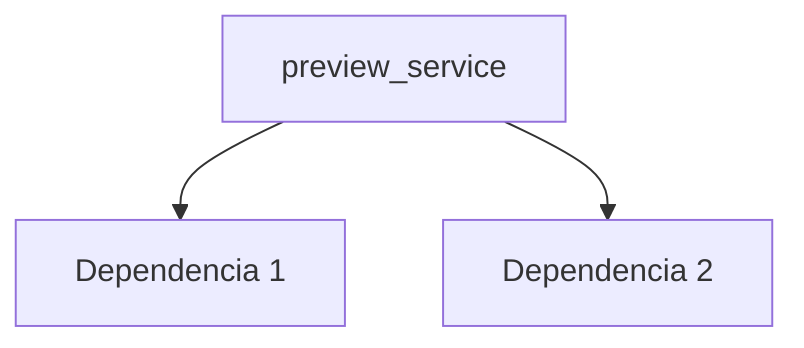

---
tags:
  - secinterp
  - code-walkthrough
  - core      # core | gui | exporters
  - services     # services | managers | renderers | adapters | validation | etc.
aliases:
  - preview_service.py  # ej. path_resolver.py
  - preview_service     # ej. resolve_export_path
cssclass: secinterp-note
note_lines: 700
---

# `core/services/preview_service.py`

> [!abstract] Resumen en una línea
> Service for managing preview generation and rendering. — qué hace este módulo en una frase, sin tocar QGIS si es core.

**Ruta**: `core/services/preview_service.py` (175 líneas)
**Clase/Función principal**: `preview_service`
**Capa**: core (QGIS-agnóstico / GUI · Tipo)
**Tags**: #secinterp #core #services

---

## 🎯 ¿Por qué existe este archivo?

| Problema | Solución |
|----------|----------|
| (pendiente) | (pendiente) |
| (pendiente) | (pendiente) |

> [!important] Nota arquitectónica
> QGIS-agnóstico (p. ej. "QGIS-agnóstico", "Adapter Extract", "Factory").

---

## 🧬 Diagrama de relaciones



> [!tip] Cómo leer
> Flecha sólida = importa/delega; punteada = callback/injectado.

---

## 📦 Imports — lectura arquitectónica

```python
# preview_service.py
from __future__ import annotations
import math
from typing import Any
from sec_interp.core.domain import PreviewParams, PreviewResult
from sec_interp.core.exceptions import ProcessingError
from sec_interp.core.performance_metrics import PerformanceTimer
from sec_interp.logger_config import get_logger
```

| # | Observación |
|---|-------------|
| ① | (pendiente) |
| ② | (pendiente) |

---

## 🏗️ Inventario de estructura

**Clases:** `class PreviewService` — 8 métodos
**Funciones/Métodos:**
- `PreviewService.__init__(def __init__(self, controller: Any) -> None:)`
- `PreviewService.drillhole_service(@property)`
- `PreviewService.geology_service(@property)`
- `PreviewService.structure_service(@property)`
- `PreviewService.calculate_max_points(@staticmethod)`
- `PreviewService.generate_all(def generate_all(self, params: PreviewParams, transform_context: Any) -> PreviewResult:)`
- `PreviewService._generate_topography_step(def _generate_topography_step(self, params: PreviewParams, result: PreviewResult) -> None:)`
- `PreviewService._generate_structures_step(def _generate_structures_step(self, params: PreviewParams, result: PreviewResult) -> None:)`

---

## 📁 Archivos del paquete

- `preview_service.py` — nota individual de este archivo.

---

## 📖 Recorrido método por método

### `método_1`

```python
# (enriquecer)
```

_(enriquecer leyendo el fuente)_

### `método_2`

```python
# (enriquecer)
```

_(enriquecer leyendo el fuente)_

<!-- Añade una subsección por cada método público del módulo -->

---

## 🔄 Flujo de datos

| Fase | Entrada | Transformación | Salida |
|------|---------|----------------|--------|
| - | - | - | - |
| - | - | - | - |

---

## 🏛️ Patrones de diseño presentes

| Patrón | Dónde | Propósito |
|--------|-------|-----------|
| - | - | - |

---

## 🧾 Resumen de la API

| Símbolo | Firma / Hereda | Uso típico |
|---------|----------------|------------|
| (no symbols) | `-` | - |

---

## 🛡️ Manejo de errores

_(pendiente)_

---

## 🧪 Tests asociados

_(pendiente)_

---

## 👀 Observaciones y notas

> [!success] Fortalezas
> - (skeleton)

> [!warning] Puntos de atención
> - (skeleton)

> [!question] Preguntas abiertas
> - (skeleton)

---

## 🔗 Notas relacionadas

- [[Index]] — índice de la bóveda
- [[Index]] — índice
- [[controller]] — orquestador

---

*Nota de la bóveda SecInterp Code Walkthrough v2 — v3.8.0*
