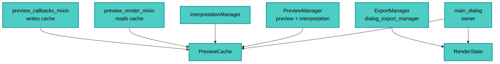

---
tags:
  - secinterp
  - code-walkthrough
  - gui
  - preview
aliases:
  - preview_state.py
  - PreviewCache
  - RenderState
cssclass: secinterp-note
---

# `gui/preview_state.py`

> [!abstract] Resumen en una línea
> Dos contenedores de estado compartido del diálogo: `PreviewCache` (las cuatro ramas del preview con acceso dict) y `RenderState` (canvas + capas vigentes para el export), para que los managers no se lean entre sí.

**Ruta**: `gui/preview_state.py` (57 líneas)
**Clases principales**: `PreviewCache`, `RenderState`
**Capa**: GUI (Present · Estado compartido)
**Tags**: #secinterp #gui #preview

---

## 🎯 ¿Por qué existe este archivo?

`PreviewManager` e `InterpretationManager` necesitaban los mismos datos y el export
necesitaba el render vigente. Antes se leían atributos sueltos entre sí:

| Problema | Solución |
|----------|----------|
| Managers que se inspeccionan mutuamente (acoplamiento) | `PreviewCache` poseída por el diálogo y compartida por referencia |
| Export que leía `current_canvas`/`current_layers` sueltos del diálogo | `RenderState.update(canvas, layers)`: un solo objeto coherente |
| Claves de caché inventadas en cada sitio (`"topo"`, `"geo"`, ...) | `_CACHE_KEYS = ("topo", "geol", "struct", "drillhole")` canónico |
| Caché sin claves → `KeyError` en renders estrictos | `dict.fromkeys(_CACHE_KEYS)` precrea las cuatro en `None` |
| Estado mutable sin protocolo claro | `get / update / [get|set]item` espejo de `dict` |

> [!important] Nota arquitectónica
> **Shared-state ownership.** El diálogo posee, los managers usan: ni `PreviewManager`
> ni `InterpretationManager` se referencian entre sí. Es el antídoto documentado en el
> docstring contra el acceso cruzado entre managers.

---

## 🧬 Diagrama de relaciones



> [!tip] Cómo leer
> El diálogo crea ambos objetos una vez; cada consumidor recibe la referencia. Nadie
> crea cachés locales: hay una sola fuente de verdad por tipo de estado.

---

## 📦 Imports — lectura arquitectónica

```python
# gui/preview_state.py
from typing import Any
```

| # | Observación |
|---|-------------|
| ① | Un solo import (`Any` para valores heterogéneos): el módulo más pequeño del preview. |
| ② | Sin `qgis.*`, sin core, sin logger, sin `__future__` siquiera: datos puros. |
| ③ | `_CACHE_KEYS` a nivel de módulo: la tupla canónica vive junto a sus clases. |

---

## 🏗️ Inventario de estructura

**Constante:** `_CACHE_KEYS = ("topo", "geol", "struct", "drillhole")`

**`class PreviewCache`** — 5 métodos:
- `__init__()` — `self._data = dict.fromkeys(_CACHE_KEYS)` (cuatro claves en `None`)
- `get(key, default=None)`
- `update(other=None, **kwargs)`
- `__getitem__(key)`
- `__setitem__(key, value)`

**`class RenderState`** — 2 métodos:
- `__init__()` — `self.canvas = None`, `self.layers = []`
- `update(canvas, layers)` — foto del último render

---

## 📁 Archivos del paquete

| Archivo | Rol respecto al estado |
|---|---|
| `gui/main_dialog.py` | Dueño: crea y reparte ambas instancias |
| `gui/dialog_preview_manager.py` | Escribe caché (sync/async) y `RenderState` vía `draw_preview` |
| `gui/dialog_interpretation_manager.py` | Lee `PreviewCache` sin tocar al `PreviewManager` |
| `gui/dialog_export_manager.py` | Lee `RenderState` para exportar (sin atributos sueltos) |
| `gui/preview_render_mixin.py` | Lee `cached_data["topo"/"struct"]` en cada render |
| `gui/preview_callbacks_mixin.py` | Escribe `cached_data["geol"/"drillhole"]` al llegar tasks |

---

## 📖 Recorrido método por método

### `_CACHE_KEYS` — el vocabulario canónico

```python
_CACHE_KEYS = ("topo", "geol", "struct", "drillhole")
```

Cuatro ramas, cuatro claves, sin sinónimos: `"geol"` (no `"geo"`/`"geology"`) coincide
con `PreviewResult.geol`. Todo el preview habla este dialecto.

### `PreviewCache.__init__` — precreación en `None`

```python
def __init__(self) -> None:
    self._data: dict[str, Any] = dict.fromkeys(_CACHE_KEYS)
```

Las cuatro claves existen desde el nacimiento con valor `None`: `cached_data["struct"]`
nunca lanza `KeyError` aunque la rama aún no se calculara. Compárese con un dict plano,
donde el render estricto del mixin (`["topo"]`, `["struct"]`) rompería.

### `get` / `__getitem__` / `__setitem__` — espejo de dict

```python
def get(self, key: str, default: Any = None) -> Any:
    return self._data.get(key, default)

def __getitem__(self, key: str) -> Any:
    return self._data[key]

def __setitem__(self, key: str, value: Any) -> None:
    self._data[key] = value
```

| Acceso | Semántica |
|--------|-----------|
| `cache.get("geol")` | Tolerante (`None` si falta): usado en informe y render opcional |
| `cache["topo"]` | Estricto (`KeyError` si falta): usado donde la rama es obligatoria |
| `cache["geol"] = ...` | Escritura directa desde callbacks async |

El doble protocolo deja que cada llamador elija su rigor sin `try/except`.

### `update` — fusión dict + kwargs

```python
def update(self, other: dict[str, Any] | None = None, **kwargs: Any) -> None:
    if other:
        self._data.update(other)
    if kwargs:
        self._data.update(kwargs)
```

Réplica de `dict.update` con mapping y keywords: `cache.update({"geol": g})` o
`cache.update(geol=g, struct=s)`. Los falsy se ignoran (sin borrados accidentales con
`update(None)`).

### `RenderState` — foto del render para export

```python
class RenderState:
    def __init__(self) -> None:
        self.canvas: Any = None
        self.layers: list = []

    def update(self, canvas: Any, layers: list) -> None:
        self.canvas = canvas
        self.layers = layers
```

Escrito por `draw_preview` del plugin tras cada render, leído por el `ExportManager`:
el export ya no depende de atributos sueltos (`current_canvas`/`current_layers`) del
diálogo. `canvas: Any` evita importar `QgsMapCanvas` en un contenedor de datos.

---

## 🔄 Flujo de datos

| Fase | Entrada | Transformación | Salida |
|------|---------|----------------|--------|
| Sync | `generate_all` (topo+struct) | escritura en caché | ramas base |
| Async | tasks geol/drillhole | `cached_data[...] = ...` | caché completa |
| Render | `cached_data` | `draw_preview` | canvas + `RenderState.update` |
| Interpretación | `PreviewCache` | lectura directa | overlay sin cruzar managers |
| Export | `RenderState` | lectura directa | ficheros desde el render vigente |
| Limpieza | cierre/accept | `cleanup` del renderer | capas retiradas, caché viva |

> [!note] La caché sobrevive al `cleanup`
> `_cleanup_layers` retira capas QGIS pero no vacía `PreviewCache`: re-renderizar tras
> limpiar no requiere recalcular. El ciclo scratch-layer (fix 2026-09-21) es de capas,
> no de datos.

---

## 🏛️ Patrones de diseño presentes

| Patrón | Dónde | Propósito |
|--------|-------|-----------|
| **Shared state (owned)** | diálogo → managers | Una fuente de verdad, sin acceso cruzado |
| **Facade over dict** | `PreviewCache` | Protocolo `dict` con claves precreadas |
| **Snapshot** | `RenderState.update` | Foto coherente canvas+capas para export |
| **Canonical keys** | `_CACHE_KEYS` | Vocabulario único de ramas |

---

## 🧾 Resumen de la API

| Símbolo | Firma | Uso típico |
|---------|-------|------------|
| `_CACHE_KEYS` | `("topo", "geol", "struct", "drillhole")` | Claves canónicas |
| `PreviewCache` | `__init__()` sin args | Una por diálogo |
| `PreviewCache.get` | `(key, default=None)` | Lectura tolerante |
| `PreviewCache.update` | `(other=None, **kwargs)` | Fusión |
| `PreviewCache[key]` / `[key] =` | get/set estrictos | Ramas obligatorias / escritura |
| `RenderState` | `__init__()` sin args | Una por diálogo |
| `RenderState.update` | `(canvas, layers)` | Foto post-render |

---

## 🛡️ Manejo de errores

| Situación | Comportamiento |
|-----------|----------------|
| Clave canónica sin calcular | `None` (nunca `KeyError`) |
| Clave inventada con `[]` | `KeyError` (falla con ruido, como `dict`) |
| Clave inventada con `.get` | `default` (tolerante) |
| `update(None)` | no-op (guardas `if`) |
| Sin render aún | `canvas=None`, `layers=[]` |

---

## 🧪 Tests asociados

- `tests/gui/test_dialog_preview_manager.py` — caché compartida en el ciclo del manager.
- `tests/gui/test_dialog_state_manager.py` — persistencia de estado del diálogo.
- `tests/gui/test_multi_session_persistence.py` — estado entre sesiones.
- `tests/gui/test_dialog_export_manager.py` — export desde `RenderState`.

---

## 👀 Observaciones y notas

> [!success] Fortalezas
> - Elimina el acceso cruzado entre managers (acoplamiento documentado como resuelto).
> - Precreación de claves: el render estricto nunca ve `KeyError` en ramas canónicas.
> - `RenderState` desacopla export de atributos sueltos del diálogo.

> [!warning] Puntos de atención
> - Sin validación de claves en `__setitem__`: `cache["geo"] = x` crea una quinta clave silenciosa (typo invisible).
> - Sin hilos: escrituras desde slots UI; si un task escribiera directo, habría carrera (hoy escriben vía señales, correcto).
> - `RenderState.layers` sin copia: el export comparte la lista viva del render.
> - Sin `__contains__`/`keys`: introspección limitada frente a `dict`.

> [!question] Preguntas abiertas
> - ¿Validar claves en `__setitem__` contra `_CACHE_KEYS` (falla rápido ante typos)?
> - ¿Copiar `layers` en `RenderState.update` para aislar al export del re-render?

---

## 🔀 Matriz de acceso

| Dato | Escritor | Lectores |
|------|----------|----------|
| `cache["topo"]` | preview sync (`generate_all`) | render, informe, interpretación |
| `cache["geol"]` | `_on_geology_finished` | render, informe |
| `cache["struct"]` | preview sync | render, informe |
| `cache["drillhole"]` | `_on_drillhole_finished` | render, informe |
| `RenderState` | `draw_preview` | `ExportManager` |

---

## 🔗 Notas relacionadas

- [[Index]] — índice de la bóveda
- [[dialog_preview_manager]] — escritor principal de ambos objetos
- [[dialog_interpretation_manager]] — lector de `PreviewCache`
- [[dialog_export_manager]] — lector de `RenderState`
- [[preview_callbacks_mixin]] — escrituras async en caché
- [[preview_render_mixin]] — lecturas de caché por render
- [[preview_renderer]] — produce las capas fotografiadas
- [[dtos]] — `PreviewResult` espejo de las cuatro claves
- [[layer_notification_manager]] — invalidación de lo cacheado

---

*Nota de la bóveda SecInterp Code Walkthrough v2 — v3.8.0*
