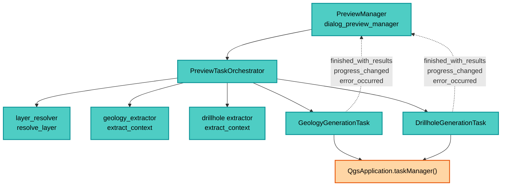

---
tags:
  - secinterp
  - code-walkthrough
  - gui
  - preview
aliases:
  - preview_task_orchestrator.py
  - PreviewTaskOrchestrator
cssclass: secinterp-note
note_lines: 700
---

# `gui/preview_task_orchestrator.py`

> [!abstract] Resumen en una línea
> Dueño de las tareas `QgsTask` de geología y sondajes: extrae contextos desacoplados en el hilo principal, lanza cada generación en segundo plano con señales de progreso/resultado/error y cancela o ancla tareas para que Qt6 no las recoja.

**Ruta**: `gui/preview_task_orchestrator.py` (158 líneas)
**Clase principal**: `PreviewTaskOrchestrator`
**Capa**: GUI (Present · Orquestación async `QgsTask`)
**Tags**: #secinterp #gui #preview

---

## 🎯 ¿Por qué existe este archivo?

Topografía y estructuras se generan síncronas en [[preview_service]], pero geología y
sondajes son caros y bloquearían el canvas. Este orquestador los mueve a `QgsTask`:

| Problema | Solución |
|----------|----------|
| Generar geología/sondajes en el hilo UI congela el diálogo | `GeologyGenerationTask` y `DrillholeGenerationTask` en el task manager |
| Un `QgsTask` no puede tocar `QgsVectorLayer` vivas | Extract a `context` desacoplado **antes** de crear la tarea (hilo principal) |
| Relanzar preview deja tareas viejas corriendo | `cancel_active_tasks` + cancelación previa en cada `start_*` |
| QGIS 4/Qt6 recoge tareas sin referencia Python | Anclas en `_active_tasks` hasta `remove_task` |
| El manager no debe conocer `QgsApplication` ni extractors | Orquestador como único punto de lanzamiento y cableado de señales |

> [!important] Nota arquitectónica
> **Frontera de hilos Extract-then-Compute.** Todo lo QGIS (`resolve_layer`,
> `extract_context`) ocurre en el hilo principal; el `QgsTask` solo recibe DTOs +
> servicio sin estado. Es la aplicación literal de la regla GUI: nunca objetos vivos
> en background.

---

## 🧬 Diagrama de relaciones



> [!tip] Cómo leer
> Flecha sólida = crea/llama; punteada = señal Qt hacia los slots `_on_*` del manager
> (viven en [[preview_callbacks_mixin]]). El orquestador nunca procesa resultados.

---

## 📦 Imports — lectura arquitectónica

```python
# gui/preview_task_orchestrator.py
from typing import TYPE_CHECKING, Any

from qgis.core import QgsApplication

from sec_interp.gui.adapters.layer_resolver import resolve_layer
from sec_interp.logger_config import get_logger

from .tasks.drillhole_task import DrillholeGenerationTask  # noqa: E402
from .tasks.geology_task import GeologyGenerationTask  # noqa: E402

if TYPE_CHECKING:
    from .dialog_preview_manager import PreviewManager
```

| # | Observación |
|---|-------------|
| ① | `QgsApplication` solo para `taskManager().addTask`: el único acoplamiento QGIS global. |
| ② | `resolve_layer` convierte IDs/strings de `PreviewParams` en capas **en el hilo principal**, antes del task. |
| ③ | Los tasks se importan tras el logger con `noqa: E402` (import no-top tras código). |
| ④ | `PreviewManager` solo bajo `TYPE_CHECKING`: el orquestador recibe al manager por inyección sin ciclo. |
| ⑤ | Cero imports del core: servicios y contextos llegan como parámetros (`service`, `extractor`, `params`). |

---

## 🏗️ Inventario de estructura

**Clase:** `class PreviewTaskOrchestrator` — 4 métodos + constructor

- `__init__(manager: PreviewManager)` — `manager`, `geology_task`, `drillhole_task`, `_active_tasks`
- `cancel_active_tasks()` — cancela, desconecta señales y libera anclas
- `remove_task(task)` — retira un ancla al terminar
- `start_geology_task(params, service)` — extract + lanza `GeologyGenerationTask`
- `start_drillhole_task(params, service, extractor)` — extract + lanza `DrillholeGenerationTask`

**Señales cableadas (hacia el manager):**
- `finished_with_results → manager._on_geology_finished / _on_drillhole_finished`
- `progress_changed → manager._on_geology_progress / _on_drillhole_progress`
- `error_occurred → manager._on_geology_error / _on_drillhole_error`

---

## 📁 Archivos del paquete

| Archivo | Rol respecto al orquestador |
|---|---|
| `gui/dialog_preview_manager.py` | `PreviewManager`: dueño, recibe los slots |
| `gui/preview_callbacks_mixin.py` | Implementa los seis slots `_on_*` |
| `gui/tasks/geology_task.py` | `GeologyGenerationTask` (hilo secundario) |
| `gui/tasks/drillhole_task.py` | `DrillholeGenerationTask` (hilo secundario) |
| `gui/adapters/layer_resolver.py` | `resolve_layer`: ID → capa en hilo principal |
| `gui/preview_render_mixin.py` | Re-render con datos cacheados al llegar resultados |
| `gui/preview_state.py` | `PreviewCache`: dónde aterrizan `geol`/`drillhole` |
| `core/services/preview_service.py` | Rama síncrona (topo+struct); los tasks son su complemento async |

---

## 📖 Recorrido método por método

### `__init__` — inyección del manager + anclas

```python
def __init__(self, manager: PreviewManager) -> None:
    self.manager = manager
    self.geology_task: GeologyGenerationTask | None = None
    self.drillhole_task: DrillholeGenerationTask | None = None

    # Anchor tasks to prevent GC issues in QGIS 4/Qt6
    self._active_tasks: list[Any] = []
```

Guarda una referencia viva a cada task en `_active_tasks`: sin ancla, el binding
Python puede recoger el `QgsTask` mientras C++ aún lo ejecuta (cuelgues en QGIS 4).
`geology_task`/`drillhole_task` apuntan a la tarea vigente de cada tipo (máximo una).

### `cancel_active_tasks` — cancelación y desconexión total

```python
def cancel_active_tasks(self) -> None:
    import contextlib
    for task in list(self._active_tasks):
        if task:
            with contextlib.suppress(RuntimeError):
                task.cancel()
            try:
                task.finished_with_results.disconnect()
                task.progress_changed.disconnect()
                task.error_occurred.disconnect()
            except (TypeError, RuntimeError):
                pass
    self._active_tasks.clear()
    self.geology_task = None
    self.drillhole_task = None
```

| Paso | Detalle |
|------|---------|
| Iteración defensiva | `list(...)` por si un slot muta la lista durante la cancelación |
| `cancel()` | Cooperativo: el servicio lo consulta vía `feedback.isCanceled()`; `RuntimeError` suprimido (task ya destruida) |
| `disconnect()` sin args | Retira **todos** los slots de cada señal; `TypeError/RuntimeError` si ya estaban sueltas |
| Reset | Vacía anclas y punteros: el orquestador queda virgen para el próximo preview |

Se llama al relanzar preview y al cerrar el diálogo: sin esto, un task tardío
escribiría sobre una caché ya destruida.

### `remove_task` — liberar el ancla al terminar

```python
def remove_task(self, task: Any) -> None:
    if task in self._active_tasks:
        self._active_tasks.remove(task)
        logger.debug(f"Task removed from anchors: {task}")
```

Lo invocan `_on_geology_finished` y `_on_drillhole_finished` tras cachear. Solo
suelta la referencia Python; el `QgsTask` ya terminó en C++. Sin esta llamada, las
anclas crecerían un elemento por preview.

### `start_geology_task` — extract + lanzamiento

```python
def start_geology_task(self, params: Any, service: Any) -> None:
    if self.geology_task:
        self.geology_task.cancel()

    line_lyr = resolve_layer(params.line_layer)
    raster_lyr = resolve_layer(params.raster_layer)
    outcrop_lyr = resolve_layer(params.outcrop_layer)

    extractor = self.manager.preview_service.controller.geology_extractor
    context = extractor.extract_context(
        line_lyr, raster_lyr, outcrop_lyr,
        params.outcrop_name_field, params.band_num)

    self.geology_task = GeologyGenerationTask(
        "Geology Preview (Async)",  # no-i18n: QgsTask identifier for task manager
        context, service, params)

    self._active_tasks.append(self.geology_task)

    self.geology_task.finished_with_results.connect(self.manager._on_geology_finished)
    self.geology_task.progress_changed.connect(self.manager._on_geology_progress)
    self.geology_task.error_occurred.connect(self.manager._on_geology_error)

    QgsApplication.taskManager().addTask(self.geology_task)
```

| Fase | Dónde | Detalle |
|------|-------|---------|
| Cancelación previa | hilo UI | La geología anterior se cancela (no se espera) |
| Resolución | hilo UI | `resolve_layer` × 3: IDs → `QgsVectorLayer`/`QgsRasterLayer` vivas |
| Extract | hilo UI | `geology_extractor.extract_context(...)` → `GeologyContext` desacoplado |
| Task | fondo | Solo recibe `context` + `service` + `params` (sin capas vivas) |
| Cableado | hilo UI | Tres señales hacia slots del manager **antes** de `addTask` |
| Cola | Qt | `taskManager().addTask` planifica la ejecución |

El identificador `"Geology Preview (Async)"` lleva `no-i18n`: es clave del task
manager, no texto visible.

### `start_drillhole_task` — el extract más grande

```python
def start_drillhole_task(self, params: Any, service: Any, extractor: Any) -> None:
    if self.drillhole_task:
        self.drillhole_task.cancel()

    line_lyr = resolve_layer(params.line_layer)
    collar_lyr = resolve_layer(params.collar_layer)
    survey_lyr = resolve_layer(params.survey_layer)
    interval_lyr = resolve_layer(params.interval_layer)
    raster_lyr = resolve_layer(params.raster_layer)

    survey_fields_dict = {"id": params.survey_id_field, "depth": params.survey_depth_field,
                          "azim": params.survey_azim_field, "incl": params.survey_incl_field}
    interval_fields_dict = {"id": params.interval_id_field, "from": params.interval_from_field,
                            "to": params.interval_to_field, "lith": params.interval_lith_field}

    context = extractor.extract_context(
        line_lyr, params.buffer_dist, collar_lyr, params.collar_id_field,
        params.collar_use_geometry, params.collar_x_field, params.collar_y_field,
        params.collar_z_field, params.collar_depth_field, survey_lyr,
        survey_fields_dict, interval_lyr, interval_fields_dict,
        raster_lyr, params.band_num)

    self.drillhole_task = DrillholeGenerationTask(
        "Drillhole Preview (Async)",  # no-i18n: QgsTask identifier for task manager
        context, service, params)

    self._active_tasks.append(self.drillhole_task)
    self.drillhole_task.finished_with_results.connect(self.manager._on_drillhole_finished)
    self.drillhole_task.progress_changed.connect(self.manager._on_drillhole_progress)
    self.drillhole_task.error_occurred.connect(self.manager._on_drillhole_error)
    QgsApplication.taskManager().addTask(self.drillhole_task)
```

Diferencias con geología: resuelve **cinco** capas, empaqueta los campos de survey e
intervalos en dicts y recibe el `extractor` por parámetro (en geología lo toma del
controller vía `manager.preview_service`). El `context` es un `DrillholeContext`
totalmente desacoplado: el task puede correr sin tocar QGIS.

---

## 🔄 Flujo de datos

| Fase | Entrada | Transformación | Salida |
|------|---------|----------------|--------|
| Params | `PreviewParams` (IDs de capa + campos) | `resolve_layer` × N | capas vivas (hilo UI) |
| Extract | capas + campos | `extract_context` | `GeologyContext` / `DrillholeContext` |
| Task | contexto + servicio | `QgsTask.run` en fondo | `(geol_data, drillhole_data)` |
| Señal | resultado del fondo | `finished_with_results` (hilo UI) | slot `_on_*_finished` cachea |
| Progreso | `feedback.setProgress` | `progress_changed` | texto de progreso en el diálogo |
| Error | excepción en `run` | `error_occurred` | `ProcessingError` vía `handle_error` |
| Cierre | diálogo aceptado/cerrado | `cancel_active_tasks` | sin tareas vivas ni señales colgadas |

---

## 🏛️ Patrones de diseño presentes

| Patrón | Dónde | Propósito |
|--------|-------|-----------|
| **Orchestrator** | la clase | Único punto de lanzamiento/cancelación async |
| **Extract-then-Compute** | `start_*` → task | QGIS en UI, DTOs en fondo |
| **Anchor (GC guard)** | `_active_tasks` | Evitar recogida prematura en Qt6 |
| **Observer (Qt signals)** | `finished/progress/error` | Resultados sin polling |
| **Cooperative cancellation** | `cancel()` + `feedback` | Parada limpia sin matar hilos |

---

## 🧾 Resumen de la API

| Símbolo | Firma | Uso típico |
|---------|-------|------------|
| `PreviewTaskOrchestrator` | `__init__(manager: PreviewManager)` | Un ejemplar por `PreviewManager` |
| `start_geology_task` | `(params, service) -> None` | Preview async de geología |
| `start_drillhole_task` | `(params, service, extractor) -> None` | Preview async de sondajes |
| `cancel_active_tasks` | `() -> None` | Relanzar o cerrar sin fugas |
| `remove_task` | `(task) -> None` | Liberar ancla al terminar |

---

## 🛡️ Manejo de errores

| Situación | Comportamiento |
|-----------|----------------|
| Task previo vigente | `cancel()` cooperativo antes de lanzar |
| Task destruida en C++ | `suppress(RuntimeError)` en `cancel()` |
| Señales ya desconectadas | `except (TypeError, RuntimeError): pass` |
| Excepción en `run()` | El task emite `error_occurred`; el mixin crea `ProcessingError` |
| Cierre con tasks vivas | `cancel_active_tasks` evita writes tardíos a la caché |

> [!note] Sin `try` en los `start_*`
> Si `resolve_layer` o `extract_context` fallan, la excepción sube al manager, que la
> muestra con `handle_error`. El orquestador no enmascara fallos de extract.

---

## 🧪 Tests asociados

- `tests/gui/test_preview_task_orchestrator.py` — `TestPreviewTaskOrchestrator`: cancelación, anclas y cableado con `QgsApplication.taskManager` mockeado.
- `tests/gui/tasks/test_geology_task.py` — el `GeologyGenerationTask` lanzado aquí.
- `tests/gui/tasks/test_drillhole_task.py` — el `DrillholeGenerationTask` (emisión diferida con `QTimer.singleShot`).
- `tests/gui/test_dialog_preview_manager.py` — integración manager ↔ orquestador.
- `tests/core/test_geology_service.py`, `tests/core/test_drillhole_service.py` — la lógica que corre dentro de cada task.

---

## 👀 Observaciones y notas

> [!success] Fortalezas
> - Frontera de hilos impecable: ningún objeto QGIS vivo cruza al fondo.
> - Anclas Qt6 + desconexión total: sin cuelgues ni señales a slots muertos.
> - Identificadores de task marcados `no-i18n` correctamente.

> [!warning] Puntos de atención
> - Asimetría: geología toma el extractor del controller; sondajes lo reciben por parámetro.
> - `start_*` no registra en anclas si `addTask` lanzara: el `append` es previo, correcto, pero un fallo entre `append` y `addTask` dejaría un ancla huérfana hasta el próximo `cancel_active_tasks`.
> - Solo una tarea por tipo: dos previews rápidos seguidos cancelan el anterior aunque casi hubiera terminado.

> [!question] Preguntas abiertas
> - ¿Unificar la obtención del extractor (siempre por parámetro) para simetría testeable?
> - ¿Cola con debounce en vez de cancelación inmediata ante previews consecutivos?

---

## ⏱️ Secuencia sync vs async

El preview completo entrelaza tres carriles temporales:

| Momento | Carril UI (síncrono) | Carril geología (fondo) | Carril sondajes (fondo) |
|---------|----------------------|-------------------------|-------------------------|
| T0 | `generate_all`: topo + struct → caché | — | — |
| T1 | `_render_cached_data` inicial | — | — |
| T2 | `start_geology_task` (extract + cola) | encolada | — |
| T3 | `start_drillhole_task` (extract + cola) | `run`: intersecciones | encolada |
| T4 | progreso en `results_text` | `finished` → `finished_with_results` | `run`: trayectorias |
| T5 | `_on_geology_finished` → caché + render | ancla liberada | `finished` diferido (`QTimer.singleShot`) |
| T6 | `_on_drillhole_finished` → caché + render | — | ancla liberada |

> [!tip] Los carriles async son independientes
> Geología y sondajes terminan en cualquier orden; cada `finished` re-renderiza con lo
> que haya en caché. El informe solo se pinta si `topo` ya existe (guarda del mixin).

---

## 🔗 Notas relacionadas

- [[Index]] — índice de la bóveda
- [[preview_service]] — rama síncrona (topo+struct) complementaria
- [[dialog_preview_manager]] — dueño del orquestador
- [[preview_callbacks_mixin]] — slots `_on_*` destino de las señales
- [[preview_render_mixin]] — re-render al llegar resultados async
- [[drillhole_task]] — `DrillholeGenerationTask` en detalle
- [[geology_task]] — `GeologyGenerationTask` en detalle
- [[controller]] — provee servicios y extractors
- [[dtos]] — `PreviewParams`, contextos y `PreviewResult`
- [[layer_notification_manager]] — invalida y puede forzar relanzamientos

---

*Nota de la bóveda SecInterp Code Walkthrough v2 — v3.8.0*
