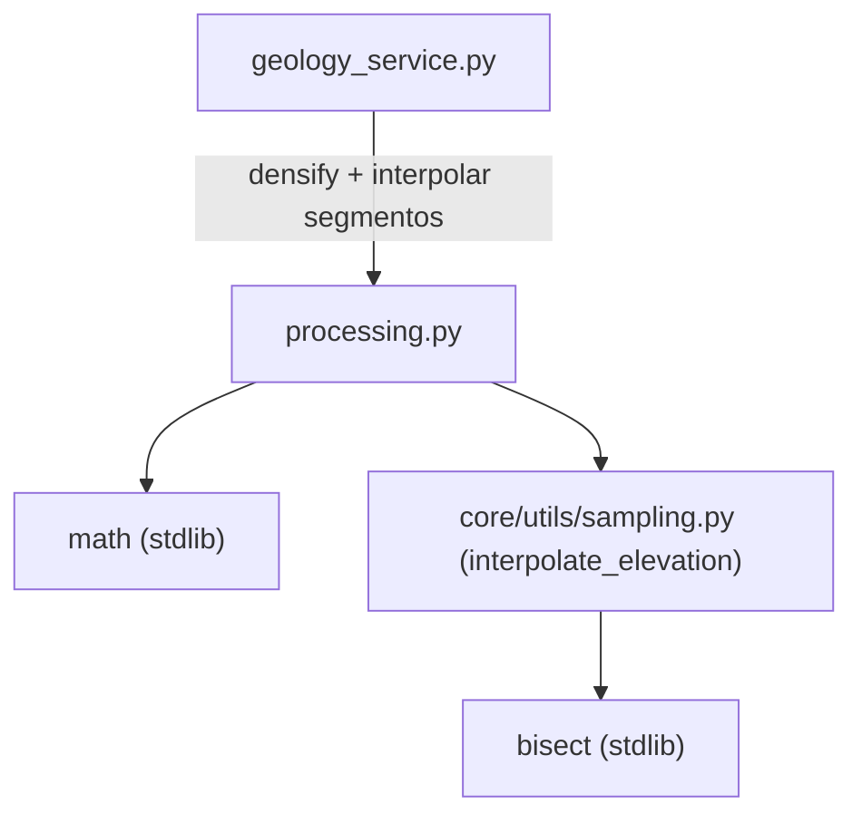

---
tags:
  - secinterp
  - code-walkthrough
  - core
  - utils
aliases:
  - processing.py
  - densify_line_points
  - interpolate_segment_points
cssclass: secinterp-note
---

# `core/utils/geometry_utils/processing.py`

> [!abstract] Resumen en una línea
> Procesamiento geométrico **puro** para perfiles: densifica polilíneas insertando vértices intermedios y convierte distancias límite de un intervalo en puntos `(dist, elev)` con cota muestreada, sin tocar QGIS.

**Ruta**: `core/utils/geometry_utils/processing.py` (80 líneas)
**Función principal**: `densify_line_points`, `interpolate_segment_points`
**Capa**: Core (QGIS-agnóstico)
**Tags**: #secinterp #core #utils

---

## 🎯 ¿Por qué existe este archivo?

La construcción de perfiles necesita dos pasos intermedios: garantizar una densidad mínima
de vértices a lo largo de la sección y convertir límites de intervalos litológicos en
puntos reales del perfil con su cota:

| Problema | Solución |
|----------|----------|
| Segmentos demasiado largos entre vértices rompen la suavidad del perfil | `densify_line_points` inserta puntos cada `interval` |
| Un intervalo geológico se expresa por distancias, no por coordenadas | `interpolate_segment_points` devuelve `(dist, elev)` |
| Muestrear la cota requiere el perfil maestro y la malla de elevaciones | delegación a `sampling.interpolate_elevation` |

> [!important] Nota arquitectónica
> QGIS-agnóstico: sólo `math` y, de forma **local**, `sampling.interpolate_elevation`. La
> malla (`master_grid_dists`) entra como `list[tuple[float, Any, float]]`, no como raster.

---

## 🧬 Diagrama de relaciones



> [!tip] Cómo leer
> `interpolate_segment_points` importa `interpolate_elevation` **dentro de la función**
> (import local), evitando acoplar `sampling` a nivel de módulo. La flecha punteada marca
> esa dependencia diferida.

---

## 📦 Imports — lectura arquitectónica

```python
# core/utils/geometry_utils/processing.py
from __future__ import annotations

import math
from typing import Any

# dentro de interpolate_segment_points:
from sec_interp.core.utils.sampling import interpolate_elevation
```

| # | Observación |
|---|-------------|
| ① | `math.hypot`/`math.ceil` para geometría planar. |
| ② | `typing.Any` tipa el campo "punto" de la malla (`(dist, point, elev)`). |
| ③ | El import de `sampling` es **local**: reduce el acoplamiento y evita ciclos de import. |

> [!note] Import local como técnica de desacoplo
> `interpolate_elevation` es el único punto de contacto con el resto del core. Al importarse
> dentro de la función, `processing` puede cargarse sin `sampling` salvo que se use.

---

## 🏗️ Inventario de estructura

**Funciones (2 públicas, 0 clases):**

- `densify_line_points(points, interval) -> list[tuple[float, float]]`
- `interpolate_segment_points(dist_start, dist_end, master_grid_dists, master_profile_data, tolerance) -> list[tuple[float, float]]`

---

## 📁 Archivos del paquete

| Archivo | Líneas | Rol |
|---|--:|---|
| [[#processingpy|processing.py]] | 80 | Densificación e interpolación de segmentos de perfil |

> [!note] Subpaquete `geometry_utils/`
> Convive con [[measurement]] (medición) y [[optimization]] (simplificación). Ver
> [[core_utils_geometry_utils]] para el rol del namespace.

---

## 📖 Recorrido método por método

### `densify_line_points`

```python
def densify_line_points(
    points: list[tuple[float, float]], interval: float
) -> list[tuple[float, float]]:
    if not points or interval <= 0:
        return points

    result = [points[0]]
    for i in range(len(points) - 1):
        p1 = points[i]
        p2 = points[i + 1]

        seg_len = math.hypot(p2[0] - p1[0], p2[1] - p1[1])
        if seg_len == 0:
            continue

        num_segments = max(1, math.ceil(seg_len / interval))
        for j in range(1, num_segments):
            t = j / num_segments
            result.append((p1[0] + t * (p2[0] - p1[0]), p1[1] + t * (p2[1] - p1[1])))
        result.append(p2)

    return result
```

Densifica una polilínea garantizando que ningún tramo supere `interval`. Para cada segmento
calcula `num_segments = ceil(seg_len / interval)` y emite los puntos intermedios en
fracciones `t = j / num_segments`. Casos borde:
- `points` vacío o `interval <= 0` → devuelve la entrada intacta.
- `seg_len == 0` (vértice duplicado) → se salta (`continue`).
- `num_segments = max(1, ...)` garantiza al menos un tramo (siempre se añade `p2`).

> [!tip] Densidad conservadora
> El número de subdiviones usa `ceil`, así el tramo resultante es **menor o igual** a
> `interval` (nunca mayor). El resultado siempre incluye el primer y el último vértice.

### `interpolate_segment_points`

```python
def interpolate_segment_points(
    dist_start: float,
    dist_end: float,
    master_grid_dists: list[tuple[float, Any, float]],  # (dist, point, elev)
    master_profile_data: list[tuple[float, float]],      # (dist, elev)
    tolerance: float,
) -> list[tuple[float, float]]:
    from sec_interp.core.utils.sampling import interpolate_elevation

    inner_points = [
        (d, e) for d, _, e in master_grid_dists
        if dist_start + tolerance < d < dist_end - tolerance
    ]

    elev_start = interpolate_elevation(master_profile_data, dist_start)
    elev_end = interpolate_elevation(master_profile_data, dist_end)

    return [(dist_start, elev_start), *inner_points, (dist_end, elev_end)]
```

Convierte `[dist_start, dist_end]` en una lista de puntos `(distancia, cota)` del perfil:
1. Filtra los puntos de la malla que caen **estrictamente dentro** del intervalo
   (con margen `tolerance` en ambos extremos).
2. Interpola la cota en los dos límites usando `interpolate_elevation`.
3. Devuelve `[límite_inicial, *puntos_internos, límite_final]`.

> [!tip] La `tolerance` excluye puntos de borde
> Los puntos de la malla a una distancia `<= tolerance` de los límites se omiten, porque
> esos límites ya se añaden por interpolación. Evita duplicados cerca de los extremos.

---

## 📐 Fundamento matemático

### Densificación

Dado un tramo `p1 → p2` con longitud `L`:

```
num_segments = max(1, ceil(L / interval))
p(t) = p1 + t · (p2 − p1),  con t = j / num_segments
```

- Con `ceil`, el tramo resultante es `L / num_segments <= interval`.
- `t` recorre `1/num_segments, 2/num_segments, ...` (el vértice `p2` se añade aparte).

### Interpolación de cota (delegada a `sampling`)

```
elev(dist) = elev1 + (elev2 − elev1) · (dist − dist1) / (dist2 − dist1)
```

- `dist1 <= dist < dist2` son los dos puntos muestreados más cercanos (búsqueda por `bisect`).
- Fuera de rango devuelve el extremo más cercano; perfil vacío devuelve `0.0`.

### Ejemplo numérico

| Entrada | Cálculo | Salida |
|---------|---------|--------|
| `[(0,0),(10,0)]`, `interval=2.0` | `ceil(10/2)=5` subdiviones | 6 puntos espaciados 2.0 |
| malla `[(0,·,100),(10,·,110),(20,·,120)]`, `[5,15]` | interior `(10,110)` + cotas `105`,`115` | `[(5,105),(10,110),(15,115)]` |

---

## 🔄 Flujo de datos

| Fase | Entrada | Transformación | Salida |
|------|---------|----------------|--------|
| Densificación | polilínea + `interval` | subdivisión por `ceil` | polilínea densificada |
| Interpolación | `[dist_start, dist_end]` + malla + perfil | filtro interior + interpolación de cotas | `[(dist, elev), ...]` |

**Consumidores reales:**

| Consumidor | Qué usa | Para qué |
|-----------|---------|----------|
| `geology_service.py` | ambas | construir el perfil geológico segmento a segmento |
| `sampling.py` | `interpolate_elevation` (delegado) | muestrear cotas del perfil maestro |

---

## 🏛️ Patrones de diseño presentes

| Patrón | Dónde | Propósito |
|--------|-------|-----------|
| **Función pura** | ambas | sin estado, thread-safe |
| **Import local (lazy)** | `interpolate_segment_points` | desacoplar `sampling` |
| **Delegación** | interpolación de cota | reutilizar `interpolate_elevation` |
| **Early-return defensivo** | `densify_line_points` | entradas vacías/inválidas |

---

## 🧾 Resumen de la API

| Símbolo | Firma | Uso típico |
|---------|-------|------------|
| `densify_line_points` | `(points, interval) -> list[tuple[float, float]]` | garantizar densidad de vértices |
| `interpolate_segment_points` | `(dist_start, dist_end, master_grid_dists, master_profile_data, tolerance) -> list[tuple[float, float]]` | perfil de un intervalo litológico |

---

## 🛡️ Manejo de errores

| Caso | Comportamiento |
|------|----------------|
| `points == []` o `interval <= 0` | `densify_line_points` devuelve la entrada |
| `seg_len == 0` (vértice duplicado) | se salta el tramo (`continue`) |
| Malla vacía o sin puntos internos | devuelve sólo los dos límites interpolados |
| `master_profile_data` vacío | `interpolate_elevation` devuelve `0.0` |

> [!note] Sin excepciones de dominio
> Igual que [[measurement]] y [[optimization]], este módulo prefiere retornos defensivos a
> lanzar excepciones. La validación de los datos de entrada es responsabilidad del servicio.

---

## 🧪 Tests asociados

`tests/core/test_geometry_utils.py` → `TestGeometryProcessing`:

- `test_densify_line_points` — `[(0,0),(10,0)]` con `interval=2.0` da 6 puntos; casos de
  `interval=0.0`, lista vacía y un solo punto devuelven la entrada.
- `test_interpolate_segment_points` — malla y perfil lineales: `(5.0, 15.0)` da 3 puntos
  con cotas `105.0` y `115.0` en los extremos.

> [!tip] Cobertura conjunta
> `interpolate_segment_points` ejercita indirectamente `sampling.interpolate_elevation`,
> cuyo test directo está en `tests/core/test_utils.py` / `test_utils_standalone.py`.

---

## 👀 Observaciones y notas

> [!success] Fortalezas
> - Densificación correcta y con `ceil`, garantiza el límite superior de tramo.
> - Import local limpio: desacopla `sampling` sin ciclos.
> - Código corto, legible y completamente puro.

> [!warning] Puntos de atención
> - El parámetro `master_grid_dists` tipa el campo punto como `Any` (sin contrato).
> - `interpolate_segment_points` asume malla y perfil ordenados por distancia.
> - No valida que `dist_start <= dist_end`; un intervalo invertido da un resultado vacío.

> [!question] Preguntas abiertas
> - ¿Tipar `master_grid_dists` con un alias concreto (`GridPoint`) en lugar de `Any`?
> - ¿Validar explícitamente `dist_start <= dist_end` y lanzar `ValidationError`?

---

## 🔗 Notas relacionadas

- [[Index]] — índice de la bóveda
- [[measurement]] / [[optimization]] — módulos hermanos en `geometry_utils/`
- [[core_utils_geometry_utils]] — namespace del subpaquete
- [[core_utils]] — paquete `core/utils/` (incluye `sampling.interpolate_elevation`)
- [[geology_service]] — consumidor principal de la interpolación de segmentos

---

*Nota de la bóveda SecInterp Code Walkthrough v2 — v3.9.1*
