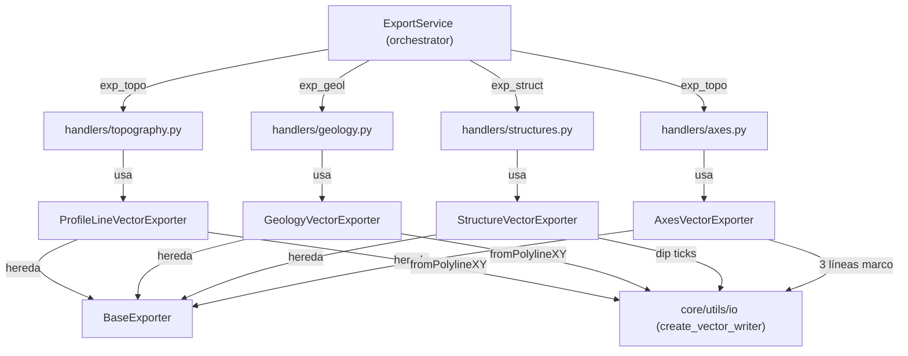

---
tags:
  - secinterp
  - code-walkthrough
  - exporters
  - profile
  - topography
  - geology
  - structures
aliases:
  - profile_exporters.py
  - ProfileLineVectorExporter
  - GeologyVectorExporter
  - StructureVectorExporter
  - AxesVectorExporter
cssclass: secinterp-note
---

# `exporters/profile_exporters.py`

> [!abstract] Resumen en una línea
> Cuatro writers 2D del perfil: línea topográfica, segmentos geológicos, ticks de buzamiento estructural y ejes de referencia, todos en coordenadas `(distancia, elevación)`.

**Ruta**: `exporters/profile_exporters.py` (362 líneas)
**Clases principales**: `ProfileLineVectorExporter`, `GeologyVectorExporter`, `StructureVectorExporter`, `AxesVectorExporter`
**Capa**: Exporters (GUI · QGIS-dependiente, hereda de `BaseExporter`)
**Tags**: #secinterp #exporters #profile

---

## 🎯 ¿Por qué existe este archivo?

El perfil calculado por el core (`profile_data`, `geol_data`, `struct_data`) debe salir
a SHP/GPKG/DXF entidad por entidad, porque cada una tiene geometría y atributos
distintos. Un solo exporter monolítico mezclaría cuatro esquemas; cuatro clases pequeñas
comparten esqueleto y aíslan la variación:

| Problema | Solución |
|----------|----------|
| La línea topográfica es una sola polilínea `(d, e)` | `ProfileLineVectorExporter`: 1 feature con campo `id = 1` |
| Cada tramo geológico tiene atributos propios | `GeologyVectorExporter`: campos derivados del primer segmento + 1 feature por tramo |
| Los datos estructurales son puntos con buzamiento aparente | `StructureVectorExporter`: tick trigonométrico (`_calculate_dip_geometry`) + `app_dip/dist/elev` |
| El perfil necesita marco de referencia | `AxesVectorExporter`: 3 líneas (izquierdo, derecho, inferior) con 5% de padding |

> [!important] Nota arquitectónica — writers puros del plano de sección
> Las cuatro clases escriben en `(dist, elev)` sin transformar: el "Extract" (capas QGIS
> → listas de tuplas/DTOs) ya ocurrió en la GUI y el "Compute" en los servicios del core
> (ver [[controller]], [[geology_service]], [[structure_service]]). Aquí solo hay
> **adaptación a `QgsFeature`** + writer.

---

## 🧬 Diagrama de relaciones



> [!tip] Cómo leer
> Cada writer lo invoca su handler (`topography`, `geology`, `structures`, `axes`; ver
> [[core_services_export_handlers]]). Topografía y ejes comparten la opción `exp_topo`
> (el `topo_handler` del [[orchestrator]] los llama juntos).

---

## 📦 Imports — lectura arquitectónica

```python
# exporters/profile_exporters.py
from __future__ import annotations

import math
from pathlib import Path
from typing import Any

from qgis.core import (
    QgsFeature,
    QgsField,
    QgsFields,
    QgsGeometry,
    QgsPointXY,
)
from qgis.PyQt.QtCore import QMetaType

import sec_interp.core.utils.io as scu_io
from sec_interp.logger_config import get_logger

from .base_exporter import BaseExporter
```

| # | Observación |
|---|-------------|
| ① | `math` solo para `_calculate_dip_geometry` (`radians/sin/cos` del tick estructural). |
| ② | `QgsPointXY` + `fromPolylineXY` en las 4 clases: todo el módulo es 2D plano, sin Z. |
| ③ | Sin imports del dominio (`DrillholeProjection`, `InterpretationPolygon`): trabaja con tuplas `(d, e)` y DTOs por duck typing. |
| ④ | Una sola constante (`MIN_REQUIRED_POINTS = 2`) compartida por topografía y geología. |
| ⑤ | `Path` tipa `output_path` en las cuatro firmas `export` (contrato uniforme). |

---

## 🏗️ Inventario de estructura

**Clases:** 4, todas `(BaseExporter)` con `get_supported_extensions() -> [".shp", ".gpkg", ".dxf"]`.

| Clase | Clave de `data` | Geometría | Campos |
|---|---|---|---|
| `ProfileLineVectorExporter` | `profile_data` | 1 polilínea | `id: Int` (`= 1`) |
| `GeologyVectorExporter` | `geology_data` | N polilíneas | claves del 1.er segmento (`QString`) |
| `StructureVectorExporter` | `structural_data` (+ `dip_scale_factor`, `raster_res`) | N ticks | claves del 1.er registro + `app_dip/dist/elev` (`Double`) |
| `AxesVectorExporter` | `profile_data` | 3 líneas marco | `axis: QString` (`Left/Right/Bottom`) |

**Métodos por clase:**
- `ProfileLineVectorExporter`: `get_supported_extensions`, `export`
- `GeologyVectorExporter`: `get_supported_extensions`, `export`, `_write_geology_features`, `_create_geology_fields`, `_create_geology_feature`
- `StructureVectorExporter`: `get_supported_extensions`, `export`, `_write_structure_features`, `_create_structure_fields`, `_create_structure_feature`, `_calculate_dip_geometry`
- `AxesVectorExporter`: `get_supported_extensions`, `export`, `_write_axes_features`

---

## 📁 Archivos del paquete `exporters/`

| Archivo | Rol respecto a esta nota |
|---|---|
| `profile_exporters.py` | Esta nota: los 4 writers del perfil 2D |
| [[drillhole_exporters]] | Writers hermanos: sondajes en el mismo plano `(dist, elev)` |
| [[interpretation_exporters]] | Writer hermano: polígonos sobre el mismo perfil |
| [[base_exporter]] | `BaseExporter`: contrato común |
| [[exporters]] | Fachada del paquete + `get_exporter()` por extensión |

---

## 📖 Recorrido método por método

### `ProfileLineVectorExporter.export` — una polilínea, un feature

```python
points = [QgsPointXY(d, e) for d, e in profile_data]
geom = QgsGeometry.fromPolylineXY(points)
if not geom or geom.isNull():
    return False

fields = QgsFields()
fields.append(QgsField("id", QMetaType.Type.Int))
writer = scu_io.create_vector_writer(str(output_path), crs, fields, layer_name=layer_name)

feat = QgsFeature()
feat.setGeometry(geom)
feat.setAttributes([1])
writer.addFeature(feat)
```

Todo el perfil colapsa en **un** feature (`id = 1`, único campo `Int` del módulo), con
`QgsFeature()` vacío y atributos posicionales. Nótese el `return False` **dentro** del
`try` si la geometría es nula, y el `try/except/else` que certifica el volcado.

### `GeologyVectorExporter.export` — esquema derivado del primer segmento

Guardas (`geology_data` + `crs`), `_create_geology_fields` para el esquema, writer,
`_write_geology_features` (filtra los `None`) y `del writer` dentro del `try`; el
`else` retorna `True` y la excepción se resume en `False` con `logger.exception`.

### `_create_geology_fields` / `_create_geology_feature`

```python
def _create_geology_fields(self, geology_data: list) -> QgsFields:
    """Create fields from the first segment's attributes."""
    fields = QgsFields()
    if geology_data:
        # Use attributes from first segment as template
        first_attrs = geology_data[0].attributes
        for key in first_attrs:
            fields.append(QgsField(key, QMetaType.Type.QString))
    return fields

def _create_geology_feature(self, segment: Any, fields: QgsFields) -> QgsFeature | None:
    """Create a feature for a geology segment."""
    if len(segment.points) < MIN_REQUIRED_POINTS:
        return None

    points = [QgsPointXY(d, e) for d, e in segment.points]
    geom = QgsGeometry.fromPolylineXY(points)

    feat = QgsFeature(fields)
    feat.setGeometry(geom)

    # Set attributes
    for key, val in segment.attributes.items():
        idx = fields.indexOf(key)
        if idx >= 0:
            feat.setAttribute(idx, val)
    return feat
```

El esquema es **dinámico**: las columnas son las claves del primer segmento, todas
`QString` (aunque el valor sea numérico). Cada feature mapea sus atributos por nombre
(`indexOf`) e ignora claves que no estén en el esquema (`idx >= 0`): un segmento con
atributos extra no rompe la escritura, simplemente pierde esas columnas.

> [!warning] Supuesto de homogeneidad
> Si los segmentos tienen claves distintas, solo sobreviven las del primero. Es el
> compromiso clásico "esquema por primer registro": simple y predecible, pero exige
> que `GeologyService` emita atributos homogéneos (ver [[geology_service]]).

### `StructureVectorExporter.export` — longitud del tick desde el raster

```python
dip_scale_factor = data.get("dip_scale_factor", 4)
raster_res = data.get("raster_res", 1.0)
...
line_length = raster_res * dip_scale_factor
```

`line_length` escala con la resolución del MDE para que el tick sea legible a cualquier
escala del perfil. Nótese la clave `structural_data` (con "ural"), distinta de
`struct_data` del [[orchestrator]]: el handler renombra al construir el dict
(ver [[structures]]). Mismo esqueleto `try/except/else` que el resto.

### `_create_structure_fields` — atributos + 3 `Double` calculados

```python
def _create_structure_fields(self, structural_data: list) -> QgsFields:
    """Create fields for structural data."""
    fields = QgsFields()
    if structural_data:
        first_attrs = structural_data[0].attributes
        for key in first_attrs:
            fields.append(QgsField(key, QMetaType.Type.QString))

    fields.append(QgsField("app_dip", QMetaType.Type.Double))
    fields.append(QgsField("dist", QMetaType.Type.Double))
    fields.append(QgsField("elev", QMetaType.Type.Double))
    return fields
```

Mismo patrón "primer registro" que geología, más tres columnas numéricas que certifican
dónde y cómo se dibujó el tick: buzamiento aparente, distancia y elevación del punto
de medida.

### `_calculate_dip_geometry` — trigonometría del tick

```python
def _calculate_dip_geometry(self, m: Any, line_length: float) -> QgsGeometry:
    """Calculate the line geometry for a structural dip."""
    rad_dip = math.radians(m.apparent_dip)
    dy = -line_length * math.sin(abs(rad_dip))
    dx = line_length * math.cos(abs(rad_dip))
    if m.apparent_dip < 0:
        dx = -dx

    p1 = QgsPointXY(m.distance, m.elevation)
    p2 = QgsPointXY(m.distance + dx, m.elevation + dy)
    return QgsGeometry.fromPolylineXY([p1, p2])
```

El tick nace en `(distance, elevation)` y cae `dy < 0` (hacia abajo, como un buzamiento
real) con longitud horizontal `dx`. El signo de `apparent_dip` decide el lado (`dx`
negativo si buza a la izquierda). Casos límite: `apparent_dip = 0` → tick horizontal
(`dy = 0`); `±90` → tick vertical (`dx = 0`).

### `_create_structure_feature` — atributos por nombre + calculados

```python
def _create_structure_feature(
    self, m: Any, fields: QgsFields, line_length: float
) -> QgsFeature:
    """Create a feature for a structural measurement."""
    geom = self._calculate_dip_geometry(m, line_length)

    feat = QgsFeature(fields)
    feat.setGeometry(geom)

    # Set attributes
    for key, val in m.attributes.items():
        idx = fields.indexOf(key)
        if idx >= 0:
            feat.setAttribute(idx, val)

    feat["app_dip"] = m.apparent_dip
    feat["dist"] = m.distance
    feat["elev"] = m.elevation
    return feat
```

Mezcla dos estilos: atributos heredados por índice (`indexOf`, tolerante a extras) y
calculados por nombre (`feat["app_dip"]`, estilo `QgsFeature.__setitem__`). Nunca
retorna `None`: toda medida produce su tick (si `m` está malformado, la excepción la
captura `export`).

### `AxesVectorExporter.export` — marco con padding del 5%

```python
dists = [p[0] for p in profile_data]
elevs = [p[1] for p in profile_data]
min_d, max_d = min(dists), max(dists)
min_e, max_e = min(elevs), max(elevs)

if max_d == min_d:
    max_d = min_d + 100
if max_e == min_e:
    max_e = min_e + 10

e_range = max_e - min_e
min_e_padded = min_e - e_range * 0.05
max_e_padded = max_e + e_range * 0.05

lines = [
    [QgsPointXY(min_d, min_e_padded), QgsPointXY(min_d, max_e_padded)],
    [QgsPointXY(max_d, min_e_padded), QgsPointXY(max_d, max_e_padded)],
    [QgsPointXY(min_d, min_e_padded), QgsPointXY(max_d, min_e_padded)],
]
axis_names = ["Left", "Right", "Bottom"]
```

Tres líneas (izquierda, derecha, inferior; sin superior) con el rango vertical acolchado
un 5% por lado para que la topografía no toque el marco. Guardas anti-degeneración
(`+100` / `+10`) evitan el marco colapsado; `_write_axes_features` etiqueta cada línea
con `QgsFeature()` sin campos + `setAttributes([nombre])`.

### `_write_axes_features` — etiquetas en orden

Itera `lines` con `enumerate` y asigna `axis_names[i]` (`Left, Right, Bottom`): el orden
de ambas listas debe coincidir. Sin validación de geometría nula (dos puntos distintos
siempre dan polilínea válida).

---

## 🔄 Flujo de datos

| Fase | Entrada | Transformación | Salida |
|------|---------|----------------|--------|
| Guardas | `profile_data` / `geology_data` / `structural_data` + `crs` | vacíos → `False` | Nada |
| Campos | primer segmento/registro | claves → `QString`; +`Double` en estructuras | `QgsFields` |
| Geometría | `(d, e)` / `StructureMeasurement` / bbox | polilínea / tick trigonométrico / 3 líneas | `QgsGeometry` |
| Escritura | features | `addFeature` + `del writer` en `try` | SHP/GPKG/DXF |
| Resultado | — | `else: return True`; excepción → `False` | `bool` |

---

## 🏛️ Patrones de diseño presentes

| Patrón | Dónde | Propósito |
|--------|-------|-----------|
| **Template Method** | `BaseExporter` → 4 clases | Mismo esqueleto `export`, distinta entidad |
| **Schema by example** | `_create_geology_fields`, `_create_structure_fields` | Columnas del primer registro |
| **Tolerant writer** | `indexOf` + `idx >= 0` | Atributos extra no rompen la escritura |
| **Parametrized symbol** | `raster_res * dip_scale_factor` | Tick proporcional a la resolución |
| **Try/except/else** | los 4 `export` | `True` certifica el volcado |

---

## 🧾 Resumen de la API

| Símbolo | Firma / Hereda | Uso típico |
|---------|----------------|------------|
| `ProfileLineVectorExporter` | `(BaseExporter)` | `data = {"profile_data": [(d, e)...], "crs": ...}` → 1 feature `id=1` |
| `GeologyVectorExporter` | `(BaseExporter)` | `data = {"geology_data": [...], "crs": ...}` → N tramos |
| `_write_geology_features` | `(writer, geology_data, fields) -> None` | Filtra `None` de `_create_geology_feature` |
| `_create_geology_fields` | `(geology_data) -> QgsFields` | Esquema del primer segmento |
| `StructureVectorExporter` | `(BaseExporter)` | `data = {"structural_data": [...], "dip_scale_factor": 4, "raster_res": 1.0, ...}` |
| `_calculate_dip_geometry` | `(m, line_length) -> QgsGeometry` | Tick desde `(distance, elevation)` según `apparent_dip` |
| `AxesVectorExporter` | `(BaseExporter)` | `data = {"profile_data": ..., "crs": ...}` → 3 líneas |
| `_write_axes_features` | `(writer, lines, axis_names) -> None` | Etiqueta `Left/Right/Bottom` |

---

## 🛡️ Manejo de errores

| Situación | Comportamiento |
|-----------|----------------|
| Datos o `crs` vacíos | `return False` (las 4 clases) |
| Geometría topográfica nula | `False` dentro del `try` |
| Segmento con < 2 puntos | `None` → se omite ese tramo |
| Atributo no presente en el esquema | Se ignora (`idx >= 0`) |
| Rango degenerado en ejes | `+100` / `+10` + padding 5% |
| Excepción en `export` | `logger.exception` → `False` (sin `ExportError`) |

---

## 🧪 Tests asociados

**Genéricos de exporter** en `tests/exporters/test_exporters.py` (contrato `export -> bool`,
guardas y `get_setting`, aplicables a las 4 clases):

- `test_export_valid_data` / `test_export_empty_data` — esqueleto `try/except/else`.
- `test_export_missing_headers` / `test_export_missing_rows` — datos incompletos.
- `test_get_supported_extensions` — extensiones por clase.

**Integración** en `tests/integration/test_export_service_e2e.py`:

- `test_export_topography_creates_csv` / `test_export_topography_creates_shp` — path `exp_topo` (topografía + ejes).
- `test_export_geology_creates_csv_and_shp` — path `exp_geol`.
- `test_export_geology_skips_when_no_data` — skip benigno.
- `test_export_structures_with_string_fields` — path `exp_struct` con campos de texto.
- `test_export_nothing_when_all_options_disabled` — guardia del [[orchestrator]].

> [!tip] Cobertura por entidad
> Los e2e cubren topografía, geología y estructuras con QGIS real; los unitarios cubren
> el contrato genérico. La trigonometría de `_calculate_dip_geometry` (signo de `dx`,
> casos 0°/90°) es candidata natural a tests puros con `QgsPointXY` mockeado.

---

## 👀 Observaciones y notas

> [!success] Fortalezas
> - Cuatro clases cohesivas con esqueleto idéntico: el módulo se lee de un tirón.
> - `indexOf` tolerante: esquemas heterogéneos no abortan la escritura.
> - Tick estructural parametrizado por resolución: legible a cualquier escala.
> - Ejes con padding y guardas anti-degeneración: nunca producen marco colapsado.

> [!warning] Puntos de atención
> - Esquema por primer registro: claves de segmentos posteriores se pierden en silencio.
> - Todo atributo geológico/estructural se fuerza a `QString` (números como texto en el DBF).
> - `_create_structure_feature` nunca retorna `None`: una medida corrupta aborta el fichero.

> [!question] Preguntas abiertas
> - ¿Unir esquemas de **todos** los segmentos (como `interpretation_exporters`) en vez del primero?
> - ¿Tests puros para `_calculate_dip_geometry` (signos, 0°, ±90°)?

---

## 🔗 Notas relacionadas

- [[Index]] — índice de la bóveda
- [[exporters]] — fachada del paquete `exporters/`
- [[base_exporter]] — `BaseExporter`, clase base de las 4
- [[drillhole_exporters]] — sondajes en el mismo plano `(dist, elev)`
- [[interpretation_exporters]] — polígonos sobre el mismo perfil
- [[topography]] / [[geology]] / [[structures]] — handlers que invocan estos writers
- [[orchestrator]] — `ExportService` (`exp_topo` llama topografía + ejes)
- [[geology_service]] / [[structure_service]] — producen los datos que aquí se escriben

---

*Nota de la bóveda SecInterp Code Walkthrough v2 — v3.8.0*
