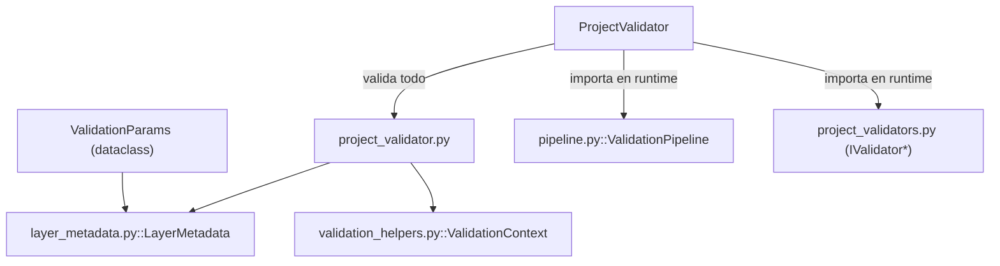

---
tags:
  - secinterp
  - code-walkthrough
  - core
  - validation
aliases:
  - project_validator.py
  - ProjectValidator
  - ValidationParams
cssclass: secinterp-note
---

# `core/validation/project_validator.py`

> [!abstract] Resumen en una línea
> Define el DTO `ValidationParams` (contenedor de todos los parámetros de capa a validar) y el **orquestador** `ProjectValidator`, que compone el pipeline de validadores especializados y expone helpers de "completitud" por dominio.

**Ruta**: `core/validation/project_validator.py` (151 líneas)
**Clases principales**: `ValidationParams`, `ProjectValidator`
**Capa**: Core (QGIS-agnóstico)
**Tags**: #secinterp #core #validation

---

## 🎯 ¿Por qué existe este archivo?

Validar un proyecto completo (línea de sección, DEM, geología, estructuras, sondajes,
salida) requiere **dos cosas**: un contenedor único de parámetros y un punto de
entrada que dispare todos los validadores. Este archivo aporta ambos:

| Problema | Solución |
|----------|----------|
| Agrupar ~30 parámetros de capa/campos en un objeto | `@dataclass ValidationParams` |
| Ejecutar todos los validadores con un solo llamado | `ProjectValidator.validate_all` |
| Validar solo lo mínimo para el preview | `ProjectValidator.validate_preview_requirements` |
| Consultar "¿está completo este dominio?" desde la GUI | `is_*_complete` (drillhole/dem/geology/structure) |

> [!important] Nota arquitectónica
> **QGIS-agnóstico.** `ValidationParams` solo contiene `LayerMetadata` (DTO desacoplado)
> y primitivos. `ProjectValidator` es Nivel 2 (Business Logic Validation): compone los
> `IValidator` de `project_validators.py` y usa `ValidationContext` para acumular
> errores antes de lanzar una única `ValidationError`.

---

## 🧬 Diagrama de relaciones



> [!tip] Cómo leer
> Los imports de `ValidationPipeline` y de los validadores especializados son **locales
> a cada método** (deferred imports) para evitar ciclos de importación en tiempo de
> carga del módulo.

---

## 📦 Imports — lectura arquitectónica

```python
# core/validation/project_validator.py
from __future__ import annotations

from dataclasses import dataclass

from sec_interp.core.validation.layer_metadata import LayerMetadata

from .validation_helpers import ValidationContext

# validate_reasonable_ranges moved to validation_helpers.py
MIN_FLOAT_THRESHOLD = 0.1
```

| # | Observación |
|---|-------------|
| ① | `dataclass` — `ValidationParams` es un dataclass con defaults. |
| ② | `LayerMetadata` — las capas se tipan como DTO desacoplado, nunca `QgsVectorLayer`. |
| ③ | `ValidationContext` importado a nivel de módulo (sí se usa en los métodos). |
| ④ | Los imports pesados (`ValidationPipeline`, `*Validator`) son **deferred** dentro de cada `@classmethod`. |
| ⑤ | `MIN_FLOAT_THRESHOLD = 0.1` — constante declarada pero **no usada** aquí; el umbral real se redefine en `project_validators.py`. |

> [!warning] `MIN_FLOAT_THRESHOLD` duplicado/huérfano
> El comentario `# validate_reasonable_ranges moved to validation_helpers.py` explica
> una refactorización pasada: la constante quedó como residuo. El `project_validators.py`
> define su **propia** `MIN_FLOAT_THRESHOLD = 0.1` local en `OutputValidator.validate`.

---

## 🏗️ Inventario de estructura

**Clases (2):**

- `@dataclass ValidationParams` — contenedor de parámetros (sin métodos).
- `class ProjectValidator` — orquestador con 6 `@classmethod`.

**Métodos de `ProjectValidator`:**

- `validate_all(params) -> bool` — validación completa (6 validadores).
- `validate_preview_requirements(params) -> bool` — solo Section + DEM.
- `is_drillhole_complete(params) -> bool`
- `is_dem_complete(params) -> bool`
- `is_geology_complete(params) -> bool`
- `is_structure_complete(params) -> bool`

---

## 📁 Archivos del paquete

`project_validator.py` es el orquestador central del paquete `core/validation/`:

| Archivo | Rol |
|---------|-----|
| `project_validator.py` | `ValidationParams` + `ProjectValidator` (este archivo) |
| `project_validators.py` | Validadores especializados `IValidator` (Section/DEM/…) |
| `pipeline.py` | `ValidationPipeline` que ejecuta los validadores en orden |
| `validation_helpers.py` | `ValidationContext`, `RichValidationError`, `DependencyRule` |
| `field_validator.py` | Validación atómica de campos |
| `layer_validator.py` | Validación espacial de capas |
| `path_validator.py` | Validación de rutas de salida |
| `validators.py` | Fábricas para campos de dataclass |
| `layer_metadata.py` | `LayerMetadata` + constantes |
| `base_validator.py` | `IValidator` (ABC) |

---

## 📖 Recorrido método por método

### `ValidationParams` — el contenedor

```python
@dataclass
class ValidationParams:
    raster_layer: LayerMetadata | None = None
    band_number: int | None = None
    line_layer: LayerMetadata | None = None
    output_path: str = ""
    scale: float = 1.0
    vert_exag: float = 1.0
    buffer_dist: float = 0.0
    outcrop_layer: LayerMetadata | None = None
    outcrop_field: str | None = None
    struct_layer: LayerMetadata | None = None
    struct_dip_field: str | None = None
    struct_strike_field: str | None = None
    dip_scale_factor: float = 1.0

    # Drillhole params
    collar_layer: LayerMetadata | None = None
    collar_id: str | None = None
    collar_use_geom: bool = True
    collar_x: str | None = None
    collar_y: str | None = None
    survey_layer: LayerMetadata | None = None
    survey_id: str | None = None
    survey_depth: str | None = None
    survey_azim: str | None = None
    survey_incl: str | None = None
    interval_layer: LayerMetadata | None = None
    interval_id: str | None = None
    interval_from: str | None = None
    interval_to: str | None = None
    interval_lith: str | None = None
```

Agrupa todos los parámetros que necesitan validación cruzada entre capas. Las capas son
`LayerMetadata | None` (producido por el `ValidationExtractor` de la GUI); los campos son
`str | None`; los numéricos tienen defaults sensatos (`scale=1.0`, `vert_exag=1.0`).

| Bloque | Campos clave |
|--------|--------------|
| Core | `raster_layer`, `band_number`, `line_layer`, `output_path`, `scale`, `vert_exag`, `buffer_dist` |
| Geología | `outcrop_layer`, `outcrop_field` |
| Estructura | `struct_layer`, `struct_dip_field`, `struct_strike_field`, `dip_scale_factor` |
| Collar | `collar_layer`, `collar_id`, `collar_use_geom`, `collar_x/y` |
| Survey | `survey_layer`, `survey_id/depth/azim/incl` |
| Intervalo | `interval_layer`, `interval_id/from/to/lith` |

### `validate_all` — validación completa

```python
@classmethod
def validate_all(cls, params: ValidationParams) -> bool:
    from .pipeline import ValidationPipeline
    from .project_validators import (
        DEMValidator, DrillholeValidator, GeologyValidator,
        OutputValidator, SectionValidator, StructureValidator,
    )
    context = ValidationContext()
    pipeline = ValidationPipeline([
        SectionValidator(), DEMValidator(), GeologyValidator(),
        StructureValidator(), DrillholeValidator(), OutputValidator(),
    ])
    pipeline.execute(params, context)
    context.raise_if_errors()
    return True
```

Construye el pipeline con los **6 validadores** en un orden fijo (Section → DEM →
Geology → Structure → Drillhole → Output), lo ejecuta sobre un `ValidationContext`
fresco y, si hay errores, `raise_if_errors()` lanza una única `ValidationError` con
todos los mensajes unidos por saltos de línea.

### `validate_preview_requirements` — solo lo mínimo

```python
@classmethod
def validate_preview_requirements(cls, params: ValidationParams) -> bool:
    from .pipeline import ValidationPipeline
    from .project_validators import DEMValidator, SectionValidator
    context = ValidationContext()
    pipeline = ValidationPipeline([SectionValidator(), DEMValidator()])
    pipeline.execute(params, context)
    context.raise_if_errors()
    return True
```

Versión ligera para generar un preview: solo exige línea de sección + DEM. Es la
entrada que usa el `controller` antes de lanzar el cómputo, evitando validar dominios
opcionales (geología, estructuras, sondajes, salida) que aún no se configuraron.

### `is_drillhole_complete`

```python
@classmethod
def is_drillhole_complete(cls, params: ValidationParams) -> bool:
    if not params.collar_layer or not params.collar_id:
        return False
    from .project_validators import DrillholeValidator
    context = ValidationContext()
    DrillholeValidator().validate(params, context)
    return not context.has_errors
```

Helper "legacy/proxy". Primero un **corto-circuito** barato (¿hay collar y id?) y, si
pasa, ejecuta solo `DrillholeValidator` sobre un contexto local. Devuelve `True` si no
se acumularon errores.

### `is_dem_complete`

```python
@classmethod
def is_dem_complete(cls, params: ValidationParams) -> bool:
    if not params.raster_layer:
        return False
    from .project_validators import DEMValidator
    context = ValidationContext()
    DEMValidator().validate(params, context)
    return not context.has_errors
```

Análogo para el DEM: si no hay `raster_layer` retorna `False` de inmediato; si lo hay,
delega en `DEMValidator`.

### `is_geology_complete` / `is_structure_complete`

```python
@classmethod
def is_geology_complete(cls, params: ValidationParams) -> bool:
    if not params.outcrop_layer or not params.outcrop_field:
        return False
    from .project_validators import GeologyValidator
    context = ValidationContext()
    GeologyValidator().validate(params, context)
    return not context.has_errors


@classmethod
def is_structure_complete(cls, params: ValidationParams) -> bool:
    if not params.struct_layer or not params.struct_dip_field or not params.struct_strike_field:
        return False
    from .project_validators import StructureValidator
    context = ValidationContext()
    StructureValidator().validate(params, context)
    return not context.has_errors
```

Mismos "completion checks" para geología (capa + campo de unidad) y estructuras (capa +
dip + strike). Permiten que la GUI habilite/deshabilite botones o muestre un check de
"dominio listo" sin lanzar excepciones.

---

## 🔄 Flujo de datos

| Fase | Entrada | Transformación | Salida |
|------|---------|----------------|--------|
| Empaquetado | capas/campos GUI → `ValidationExtractor` | `LayerMetadata` + primitivos | `ValidationParams` |
| Ejecución | `ValidationParams` | `ValidationPipeline.execute` (6 validadores) | errores en `ValidationContext` |
| Resultado | `ValidationContext` | `raise_if_errors()` | `bool` o `ValidationError` |
| Completitud | `ValidationParams` | `is_*_complete` (corto-circuito + validador) | `bool` |

---

## 🏛️ Patrones de diseño presentes

| Patrón | Dónde | Propósito |
|--------|-------|-----------|
| **Orquestador / Facade** | `ProjectValidator` | Un punto de entrada para toda la validación |
| **DTO contenedor** | `ValidationParams` | Agrupar parámetros sin QGIS |
| **Pipeline / Chain** | `ValidationPipeline([...])` | Ejecutar validadores en orden fijo |
| **Accumulator** | `ValidationContext` | Reunir errores antes de fallar |
| **Deferred imports** | `from .pipeline import ...` en métodos | Romper ciclos de importación |
| **Template method (clase)** | `@classmethod` + validadores | Uniformar `validate_all` vs `validate_preview_requirements` |

---

## 🧾 Resumen de la API

| Símbolo | Firma / Hereda | Uso típico |
|---------|----------------|------------|
| `ValidationParams` | `@dataclass` | Contenedor de parámetros de validación |
| `validate_all` | `(params) -> bool` | Validación completa antes de generar |
| `validate_preview_requirements` | `(params) -> bool` | Mínimo para el preview |
| `is_drillhole_complete` | `(params) -> bool` | ¿Sondajes listos? |
| `is_dem_complete` | `(params) -> bool` | ¿DEM listo? |
| `is_geology_complete` | `(params) -> bool` | ¿Geología lista? |
| `is_structure_complete` | `(params) -> bool` | ¿Estructuras listas? |

---

## 🛡️ Manejo de errores

`validate_all` y `validate_preview_requirements` son los únicos que **lanzan**: al
final llaman `context.raise_if_errors()`, que eleva `ValidationError` con `details`
incluyendo `errors` y `warnings`. Los `is_*_complete` **no lanzan** (retornan `bool`).

| Situación | Comportamiento |
|-----------|----------------|
| Parámetros válidos | `validate_all` → `True` |
| Errores acumulados | `raise_if_errors()` → `ValidationError` con todos los mensajes |
| `is_*_complete` sin capa configurada | `False` inmediato (corto-circuito) |
| `is_*_complete` con capa pero incompleta | `False` (errores en contexto local) |

> [!note] Una sola excepción, muchos errores
> `ValidationContext.raise_if_errors()` une todos los errores con `"\n"` y lanza **una**
> `ValidationError`. La GUI captura esa excepción y muestra todos los mensajes de golpe,
> en vez de fallar con el primero.

---

## 🧪 Tests asociados

Casos mapeados a `tests/core/test_project_validator.py`:

- `test_validate_reasonable_ranges` — extremes/warnings (usa `validate_reasonable_ranges`).
- `test_validate_preview_requirements` — sin datos → `ValidationError`; con DEM+línea → `True`.
- `test_validate_all_success` — setup válido → `True` (con `patch` de path y geometría).
- `test_validate_all_numeric_failures` — `scale=0.5`, `vert_exag=0.05` → `ValidationError` con `"Scale must be >= 1"`.
- `test_is_drillhole_complete` — evolución collar → collar+survey completos.
- `test_is_geology_complete` — sin capa `False`; con capa+campo `True`.
- `test_is_structure_complete` — sin capa `False`; con capa+dip+strike `True`.

> [!tip] Patches de QGIS en tests
> Aunque el core es QGIS-agnóstico, los tests parchean `qgis.core.QgsProject.instance`
> y validadores de capa porque el código bajo prueba compone `project_validators`, que
> a su vez importa `TranslatableMixin` (Qt). Ver [[project_validators]].

---

## 👀 Observaciones y notas

> [!success] Fortalezas
> - Un único punto de entrada (`validate_all`) y una variante ligera (`validate_preview_requirements`).
> - `ValidationParams` desacopla la validación de QGIS con `LayerMetadata`.
> - Los `is_*_complete` ofrecen consultas baratas y sin excepciones para la GUI.

> [!warning] Puntos de atención
> - `MIN_FLOAT_THRESHOLD = 0.1` declarada aquí está **huérfana** (no se usa; el umbral se redefine en `project_validators.py`).
> - Los imports `ValidationPipeline`/`*Validator` están repetidos dentro de cada método (deferred imports) → ligero boilerplate.
> - `validate_all` devuelve `True` o lanza; nunca `False`, lo que obliga a capturar la excepción.

> [!question] Preguntas abiertas
> - ¿Eliminar `MIN_FLOAT_THRESHOLD` huérfana y centralizar umbrales en `validation_helpers`?
> - ¿Devolver `(bool, errors)` en vez de lanzar, para los llamadores que prefieren no usar excepciones?

---

## 🔗 Notas relacionadas

- [[Index]] — índice de la bóveda
- [[core_validation]] — nota de paquete del directorio `validation/`
- [[project_validators]] — los validadores especializados que este orquesta
- [[core_validation]] — paquete que incluye `pipeline.py` (`ValidationPipeline`)
- [[validation_helpers]] — `ValidationContext` y `DependencyRule`
- [[core_validation]] — paquete que incluye `layer_metadata.py` (DTO que puebla `ValidationParams`)
- [[controller]] — consumidor de `validate_preview_requirements`
- [[exceptions]] — `ValidationError` lanzada por `raise_if_errors`

---

*Nota de la bóveda SecInterp Code Walkthrough v2 — v3.8.0*
