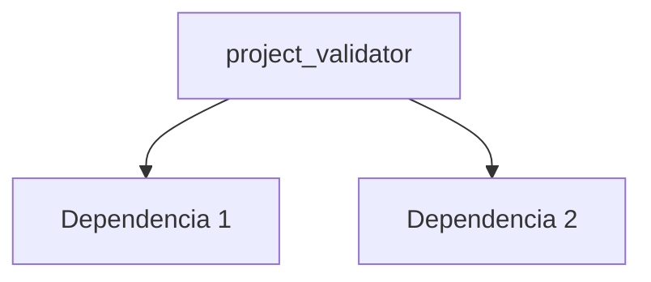

---
tags:
  - secinterp
  - code-walkthrough
  - core      # core | gui | exporters
  - validation     # services | managers | renderers | adapters | validation | etc.
aliases:
  - project_validator.py  # ej. path_resolver.py
  - project_validator     # ej. resolve_export_path
cssclass: secinterp-note
# note_lines: 700      # opcional: tope > 500 para módulos de importancia alta (máx 700)
---

# `core/validation/project_validator.py`

> [!abstract] Resumen en una línea
> Validation for project state and layer presence (QGIS-agnostic). — qué hace este módulo en una frase, sin tocar QGIS si es core.

**Ruta**: `core/validation/project_validator.py` (151 líneas)
**Clase/Función principal**: `project_validator`
**Capa**: core (QGIS-agnóstico / GUI · Tipo)
**Tags**: #secinterp #core #validation

---

## 🎯 ¿Por qué existe este archivo?

| Problema | Solución |
|----------|----------|
| (pendiente) | (pendiente) |
| (pendiente) | (pendiente) |

> [!important] Nota arquitectónica
> QGIS-agnóstico (p. ej. "QGIS-agnóstico", "Adapter Extract", "Factory").

---

## 🧬 Diagrama de relaciones



> [!tip] Cómo leer
> Flecha sólida = importa/delega; punteada = callback/injectado.

---

## 📦 Imports — lectura arquitectónica

```python
# project_validator.py
from __future__ import annotations
from dataclasses import dataclass
from sec_interp.core.validation.layer_metadata import LayerMetadata
from .validation_helpers import ValidationContext
```

| # | Observación |
|---|-------------|
| ① | (pendiente) |
| ② | (pendiente) |

---

## 🏗️ Inventario de estructura

**Clases:** `class ValidationParams` — 0 métodos; `class ProjectValidator` — 6 métodos
**Constantes:** `MIN_FLOAT_THRESHOLD`
**Funciones/Métodos:**
- `ProjectValidator.validate_all(@classmethod)`
- `ProjectValidator.validate_preview_requirements(@classmethod)`
- `ProjectValidator.is_drillhole_complete(@classmethod)`
- `ProjectValidator.is_dem_complete(@classmethod)`
- `ProjectValidator.is_geology_complete(@classmethod)`
- `ProjectValidator.is_structure_complete(@classmethod)`

---

## 📁 Archivos del paquete

- `project_validator.py` — nota individual de este archivo.

---

## 📖 Recorrido método por método

### `método_1`

```python
# (enriquecer)
```

_(enriquecer leyendo el fuente)_

### `método_2`

```python
# (enriquecer)
```

_(enriquecer leyendo el fuente)_

<!-- Añade una subsección por cada método público del módulo -->

---

## 🔄 Flujo de datos

| Fase | Entrada | Transformación | Salida |
|------|---------|----------------|--------|
| - | - | - | - |
| - | - | - | - |

---

## 🏛️ Patrones de diseño presentes

| Patrón | Dónde | Propósito |
|--------|-------|-----------|
| - | - | - |

---

## 🧾 Resumen de la API

| Símbolo | Firma / Hereda | Uso típico |
|---------|----------------|------------|
| (no symbols) | `-` | - |

---

## 🛡️ Manejo de errores

_(pendiente)_

---

## 🧪 Tests asociados

_(pendiente)_

---

## 👀 Observaciones y notas

> [!success] Fortalezas
> - (skeleton)

> [!warning] Puntos de atención
> - (skeleton)

> [!question] Preguntas abiertas
> - (skeleton)

---

## 🔗 Notas relacionadas

- [[Index]] — índice de la bóveda
- [[Index]] — índice
- [[controller]] — orquestador

---

*Nota de la bóveda SecInterp Code Walkthrough v2 — v3.8.0*
