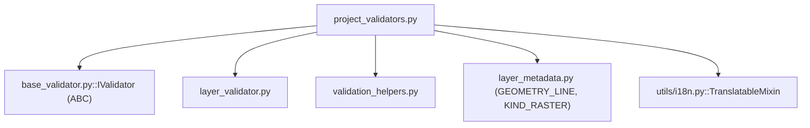

---
tags:
  - secinterp
  - code-walkthrough
  - core
  - validation
aliases:
  - project_validators.py
  - SectionValidator
  - DEMValidator
  - GeologyValidator
  - StructureValidator
  - DrillholeValidator
  - OutputValidator
cssclass: secinterp-note
---

# `core/validation/project_validators.py`

> [!abstract] Resumen en una línea
> Validadores **especializados por componente** del proyecto (sección, DEM, geología, estructuras, sondajes, salida), cada uno implementando `IValidator.validate(params, context)` para acumular errores de negocio sobre `ValidationParams`.

**Ruta**: `core/validation/project_validators.py` (240 líneas)
**Clases principales**: `SectionValidator`, `DEMValidator`, `GeologyValidator`, `StructureValidator`, `DrillholeValidator`, `OutputValidator`
**Capa**: Core (QGIS-agnóstico, con una excepción de i18n)
**Tags**: #secinterp #core #validation

---

## 🎯 ¿Por qué existe este archivo?

El `ProjectValidator` orquesta, pero **alguien tiene que saber qué validar en cada
dominio**. Este archivo alberga los validadores especializados, uno por componente del
proyecto, siguiendo la interfaz común `IValidator`:

| Problema | Solución |
|----------|----------|
| Cada dominio tiene reglas distintas | Un validador `IValidator` por dominio |
| Validar línea de sección (geometría + features) | `SectionValidator` |
| Validar DEM raster y banda | `DEMValidator` |
| Validar geología (polígono + campo unidad) | `GeologyValidator` |
| Validar estructuras (puntos + dip/strike) | `StructureValidator` |
| Validar dependencias complejas de sondajes | `DrillholeValidator` con `DependencyRule` |
| Validar ruta de salida y rangos numéricos | `OutputValidator` |

> [!important] Nota arquitectónica
> **QGIS-agnóstico en el 99%** — los validadores operan sobre `LayerMetadata` y
> primitivos. La única excepción: `OutputValidator` hereda `TranslatableMixin`, que
> importa `qgis.PyQt.QtCore.QCoreApplication` (zona gris, ver abajo). El diseño es
> Strategy/Template: cada `IValidator` implementa `validate(params, context)`.

---

## 🧬 Diagrama de relaciones



> [!tip] Cómo leer
> Sólida = importa. Los 6 validadores heredan de `IValidator`; solo `OutputValidator`
> añade `TranslatableMixin`. Todos delegan la validación fina a `layer_validator` y
> acumulan errores vía `validation_helpers`.

---

## 📦 Imports — lectura arquitectónica

```python
# core/validation/project_validators.py
from __future__ import annotations

from typing import TYPE_CHECKING

from sec_interp.core.utils.i18n import TranslatableMixin
from sec_interp.core.validation.layer_metadata import GEOMETRY_LINE, KIND_RASTER

from .base_validator import IValidator
from .layer_validator import (
    validate_layer_geometry,
    validate_layer_has_features,
    validate_raster_band,
    validate_structural_requirements,
)
from .validation_helpers import (
    DependencyRule,
    validate_dependencies,
    validate_reasonable_ranges,
)

if TYPE_CHECKING:
    from .project_validator import ValidationParams
    from .validation_helpers import ValidationContext
```

| # | Observación |
|---|-------------|
| ① | `TranslatableMixin` (de `utils.i18n`) — la **única dependencia Qt/QGIS** del paquete, usada por `OutputValidator` para `self.tr(...)`. |
| ② | Importa constantes `GEOMETRY_LINE` y `KIND_RASTER` de `layer_metadata` (no enums QGIS). |
| ③ | Reutiliza los validadores de `layer_validator` (geometría, features, banda, estructuras). |
| ④ | `DependencyRule` + `validate_dependencies` — reglas condicionales para sondajes. |
| ⑤ | `TYPE_CHECKING` para `ValidationParams`/`ValidationContext` — evita ciclos de importación. |

> [!warning] Zona gris: `TranslatableMixin` importa Qt
> `OutputValidator(IValidator, TranslatableMixin)` necesita `self.tr(...)` para i18n.
> `TranslatableMixin` importa `qgis.PyQt.QtCore.QCoreApplication`. Es una **violación
> menor** de la regla "core 100% QGIS-agnóstico", mitigada porque es solo traducción de
> cadenas (no objetos de capa/geometría) y porque los tests parchean `QgsProject`.

---

## 🏗️ Inventario de estructura

**Clases (6, todas `IValidator`):**

- `SectionValidator` — línea de sección.
- `DEMValidator` — raster DEM + banda.
- `GeologyValidator` — geología + campo unidad.
- `StructureValidator` — estructuras + dip/strike.
- `DrillholeValidator` — dependencias de collar/survey/intervalo.
- `OutputValidator(IValidator, TranslatableMixin)` — ruta + rangos numéricos.

**Métodos (1 por clase):**

- `validate(self, params, context) -> None` — todos.

---

## 📁 Archivos del paquete

`project_validators.py` es el conjunto de estrategias de validación del paquete:

| Archivo | Rol |
|---------|-----|
| `project_validators.py` | Validadores especializados (este archivo) |
| `project_validator.py` | `ProjectValidator` + `ValidationParams` (orquesta) |
| `pipeline.py` | `ValidationPipeline` (ejecuta en orden) |
| `validation_helpers.py` | `ValidationContext`, `DependencyRule`, `validate_reasonable_ranges` |
| `base_validator.py` | `IValidator` (ABC) |
| `field_validator.py` | Validación de campos |
| `layer_validator.py` | Validación espacial |
| `path_validator.py` | Validación de rutas |
| `validators.py` | Fábricas para dataclass |
| `layer_metadata.py` | `LayerMetadata` + constantes |

---

## 📖 Recorrido método por método

### `SectionValidator`

```python
class SectionValidator(IValidator):
    def validate(self, params: ValidationParams, context: ValidationContext) -> None:
        if not params.line_layer:
            context.add_error("Cross-section line layer is required", "line_layer")
            return
        metadata = params.line_layer
        if not metadata.is_valid:
            context.add_error("Cross-section line layer not found in project", "line_layer")
            return
        is_valid, error = validate_layer_geometry(metadata, GEOMETRY_LINE)
        if not is_valid:
            context.add_error(error, "line_layer")
        is_valid, error = validate_layer_has_features(metadata)
        if not is_valid:
            context.add_error(error, "line_layer")
```

Exige una capa de línea de sección **de tipo línea** y **con features**. Acumula cada
fallo con la clave `"line_layer"` para que la GUI resalte el control exacto. Usa
`return` temprano solo para el prerequisito (capa presente y válida).

### `DEMValidator`

```python
class DEMValidator(IValidator):
    def validate(self, params: ValidationParams, context: ValidationContext) -> None:
        if not params.raster_layer:
            context.add_error("Raster DEM layer is required", "raster_layer")
            return
        metadata = params.raster_layer
        if not metadata.is_valid:
            context.add_error("Raster DEM layer not found in project", "raster_layer")
            return
        if metadata.kind != KIND_RASTER:
            context.add_error("Raster DEM layer must be a raster layer", "raster_layer")
            return
        if params.band_number is not None:
            is_valid, error = validate_raster_band(metadata, params.band_number)
            if not is_valid:
                context.add_error(error, "band_number")
```

Valida que el DEM sea raster, exista, y (si se especificó banda) que la banda sea
válida. Nota: `band_number is None` **no** se marca como error aquí (se permite
omitirla; el resto de la cadena decide su valor por defecto).

### `GeologyValidator`

```python
class GeologyValidator(IValidator):
    def validate(self, params: ValidationParams, context: ValidationContext) -> None:
        if not params.outcrop_layer:
            return
        metadata = params.outcrop_layer
        if not metadata.is_valid:
            context.add_error("Geology layer not found in project", "outcrop_layer")
            return
        from .layer_validator import validate_geology_requirements
        validate_geology_requirements(metadata, params.outcrop_field, context)
```

**Opcional** (si no hay capa de afloramientos, no valida nada). Si la hay, comprueba que
exista y delega en `validate_geology_requirements` (polígono + features + campo unidad).
El import de `validate_geology_requirements` es deferred (no está en el bloque de
imports superior).

### `StructureValidator`

```python
class StructureValidator(IValidator):
    def validate(self, params: ValidationParams, context: ValidationContext) -> None:
        if not params.struct_layer:
            return
        metadata = params.struct_layer
        if not metadata.is_valid:
            context.add_error("Structural layer not found in project", "struct_layer")
            return
        validate_structural_requirements(
            metadata, params.struct_dip_field, params.struct_strike_field, context,
        )
```

Opcional también. Si hay capa estructural, la valida (puntos + campos dip/strike) vía
`validate_structural_requirements`, que ya acepta `context` para acumular errores.

### `DrillholeValidator`

```python
class DrillholeValidator(IValidator):
    def validate(self, params: ValidationParams, context: ValidationContext) -> None:
        has_collar = bool(params.collar_layer)
        has_survey = bool(params.survey_layer)
        has_interval = bool(params.interval_layer)

        if not (has_collar or has_survey or has_interval):
            return

        # Collar Rules
        if has_collar:
            if not params.collar_id:
                context.add_error("Collar ID field is required", "collar_id")
            if not params.collar_use_geom:
                if not params.collar_x:
                    context.add_error("Collar X field is required (when not using geometry)", "collar_x")
                if not params.collar_y:
                    context.add_error("Collar Y field is required (when not using geometry)", "collar_y")

        # Survey Rules
        if has_survey:
            rules = [
                DependencyRule(lambda: True, lambda: bool(params.survey_id), "Survey ID field is required", "survey_id"),
                DependencyRule(lambda: True, lambda: bool(params.survey_depth), "Survey Depth field is required", "survey_depth"),
                DependencyRule(lambda: True, lambda: bool(params.survey_azim), "Survey Azimuth field is required", "survey_azim"),
                DependencyRule(lambda: True, lambda: bool(params.survey_incl), "Survey Inclination field is required", "survey_incl"),
            ]
            validate_dependencies(rules, context)

        # Interval Rules
        if has_interval:
            rules = [
                DependencyRule(lambda: True, lambda: bool(params.interval_id), "Interval ID field is required", "interval_id"),
                DependencyRule(lambda: True, lambda: bool(params.interval_from), "Interval From field is required", "interval_from"),
                DependencyRule(lambda: True, lambda: bool(params.interval_to), "Interval To field is required", "interval_to"),
                DependencyRule(lambda: True, lambda: bool(params.interval_lith), "Interval Lithology field is required", "interval_lith"),
            ]
            validate_dependencies(rules, context)
```

El validador más complejo. Modela las dependencias de sondajes (collar → survey →
intervalo) en tres bloques. Las reglas de collar se escriben con `if`; las de survey e
intervalo con listas de `DependencyRule` (condición `lambda: True` = siempre activas;
chequeo `bool(campo)`). `validate_dependencies` las evalúa en lote.

### `OutputValidator`

```python
class OutputValidator(IValidator, TranslatableMixin):
    def validate(self, params: ValidationParams, context: ValidationContext) -> None:
        if params.output_path:
            from .path_validator import validate_safe_output_path
            is_valid, error, _ = validate_safe_output_path(params.output_path, must_exist=False)
            if not is_valid:
                context.add_error(error, "output_path")

        warnings = validate_reasonable_ranges({
            "vert_exag": params.vert_exag,
            "scale": params.scale,
            "buffer": params.buffer_dist,
            "dip_scale": params.dip_scale_factor,
        })
        for warn in warnings:
            context.add_warning(warn)

        MIN_FLOAT_THRESHOLD = 0.1
        if params.scale < 1:
            context.add_error(self.tr("Scale must be >= 1"), "scale")
        if params.vert_exag < MIN_FLOAT_THRESHOLD:
            context.add_error(self.tr("Vertical exaggeration must be >= 0.1"), "vert_exag")
        if params.buffer_dist < 0:
            context.add_error(self.tr("Buffer distance must be >= 0"), "buffer_dist")
        if params.dip_scale_factor < MIN_FLOAT_THRESHOLD:
            context.add_error(self.tr("Dip scale factor must be >= 0.1"), "dip_scale_factor")
```

Valida la ruta (si se dio) y los rangos numéricos. Usa `self.tr(...)` (i18n) para los
mensajes duros y añade **warnings** para valores extremos vía `validate_reasonable_ranges`
(no son errores, son avisos). `MIN_FLOAT_THRESHOLD = 0.1` se redefine local aquí.

| Chequeo | Regla | Tipo |
|---------|-------|------|
| `output_path` | `validate_safe_output_path(must_exist=False)` | error |
| `scale` | `>= 1` | error |
| `vert_exag` | `>= 0.1` | error |
| `buffer_dist` | `>= 0` | error |
| `dip_scale_factor` | `>= 0.1` | error |
| valores extremos | `validate_reasonable_ranges` | warning |

---

## 🔄 Flujo de datos

| Fase | Entrada | Transformación | Salida |
|------|---------|----------------|--------|
| Pipeline | `ValidationParams` | `ValidationPipeline.execute` | llama a cada `validate()` |
| Cada dominio | `params` + `context` | chequeos + `context.add_error/add_warning` | errores acumulados |
| Cierre | `context` | `ProjectValidator` llama `raise_if_errors()` | `ValidationError` o `True` |

---

## 🏛️ Patrones de diseño presentes

| Patrón | Dónde | Propósito |
|--------|-------|-----------|
| **Strategy** | 6 `IValidator` | Una estrategia de validación por dominio |
| **Template method** | `IValidator.validate` | Firma común `(params, context) -> None` |
| **Accumulator** | `context.add_error/add_warning` | Reunir errores sin fallar rápido |
| **Rule object** | `DependencyRule` | Encapsular condición/chequeo/mensaje |
| **Optional domain** | `if not params.x_layer: return` | Validar solo lo configurado |
| **i18n mixin** | `TranslatableMixin` | Traducir mensajes sin heredar QObject |

---

## 🧾 Resumen de la API

| Símbolo | Firma / Hereda | Uso típico |
|---------|----------------|------------|
| `SectionValidator` | `IValidator` | Línea de sección |
| `DEMValidator` | `IValidator` | DEM raster + banda |
| `GeologyValidator` | `IValidator` | Geología + campo |
| `StructureValidator` | `IValidator` | Estructuras + dip/strike |
| `DrillholeValidator` | `IValidator` | Dependencias de sondajes |
| `OutputValidator` | `IValidator, TranslatableMixin` | Ruta + rangos |

---

## 🛡️ Manejo de errores

Los validadores **no lanzan**: acumulan en `context`. La excepción se lanza una sola
vez en `ProjectValidator` vía `context.raise_if_errors()`:

| Situación | Comportamiento |
|-----------|----------------|
| Dominio opcional sin configurar | `return` sin errores |
| Capa requerida ausente | `context.add_error(..., "campo")` + `return` |
| Capa no encontrada / no válida | `context.add_error(...)` |
| Banda inválida | `context.add_error(error, "band_number")` |
| Valores extremos | `context.add_warning(warn)` (no bloquea) |
| Rango numérico roto | `context.add_error(self.tr(...), "campo")` |

> [!important] Errores con clave de campo
> Cada `add_error(msg, field)` asocia el error a un **campo** (`"line_layer"`,
> `"scale"`, `"output_path"`, …). La GUI usa esa clave para resaltar visualmente el
> control defectuoso, en lugar de mostrar solo un mensaje plano.

---

## 🧪 Tests asociados

Los validadores especializados se prueban **indirectamente** vía
`tests/core/test_project_validator.py` (a través de `ProjectValidator`), con `patch` de
los validadores de capa/geometría:

- `test_validate_preview_requirements` — Section + DEM (patch de geometría/features).
- `test_validate_all_success` — pipeline completo con path/geometría parcheados.
- `test_validate_all_numeric_failures` — `OutputValidator` → `"Scale must be >= 1"`.
- `test_is_drillhole_complete` — `DrillholeValidator` (collar → survey completos).
- `test_is_geology_complete` — `GeologyValidator` con `patch` de `validate_field_exists`.
- `test_is_structure_complete` — `StructureValidator` con `patch` de `validate_structural_requirements`.

> [!tip] Parches necesarios por `TranslatableMixin`
> Como `OutputValidator` importa Qt vía `TranslatableMixin`, los tests parchean
> `qgis.core.QgsProject.instance` para que la carga del módulo no dependa de QGIS real.

---

## 👀 Observaciones y notas

> [!success] Fortalezas
> - Separación limpia por dominio (un validador por componente).
> - Dominios opcionales validados de forma no intrusiva (`if not layer: return`).
> - `DependencyRule` modela dependencias declarativamente.

> [!warning] Puntos de atención
> - `TranslatableMixin` introduce Qt en el core (zona gris de la regla QGIS-agnóstico).
> - Las reglas de collar usan `if` imperativo, mientras survey/intervalo usan `DependencyRule`: inconsistencia de estilo.
> - `band_number is None` no se valida en `DEMValidator` (depende del default aguas abajo).
> - `MIN_FLOAT_THRESHOLD` se redefine localmente (duplicada con `project_validator.py`).

> [!question] Preguntas abiertas
> - ¿Migrar las reglas de collar a `DependencyRule` para uniformidad?
> - ¿Sustituir `TranslatableMixin` por una inyección de `tr` para mantener el core 100% libre de Qt?

---

## 🔗 Notas relacionadas

- [[Index]] — índice de la bóveda
- [[core_validation]] — nota de paquete del directorio `validation/`
- [[project_validator]] — orquestador que instancia estos validadores
- [[core_validation]] — paquete que incluye `pipeline.py` (`ValidationPipeline`)
- [[validation_helpers]] — `DependencyRule`, `ValidationContext`, `validate_reasonable_ranges`
- [[core_validation]] — paquete que incluye `base_validator.py` (`IValidator`)
- [[layer_validator]] — funciones de capa reutilizadas
- [[exceptions]] — `ValidationError` lanzada al cierre
- [[core_utils]] — `TranslatableMixin` en `core/utils` (zona gris)

---

*Nota de la bóveda SecInterp Code Walkthrough v2 — v3.9.1*
