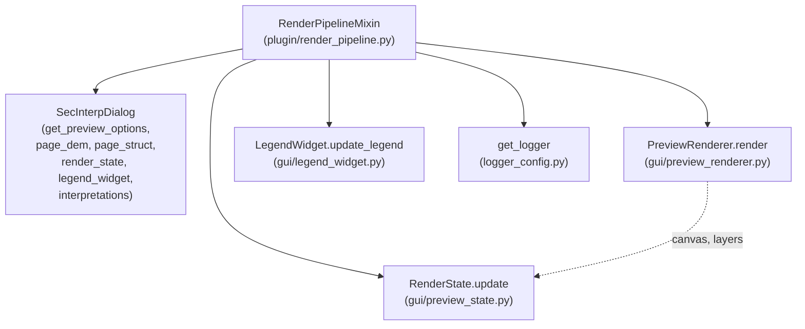
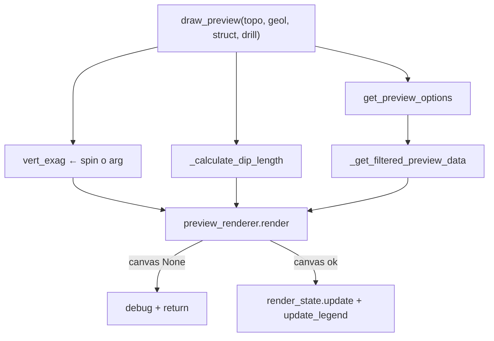

---
tags:
  - secinterp
  - code-walkthrough
  - plugin
aliases:
  - render_pipeline.py
  - RenderPipelineMixin
cssclass: secinterp-note
---

# `plugin/render_pipeline.py`

> [!abstract] Resumen en una línea
> Mixin que convierte los datos del preview ya calculados en una escena QGIS visible: filtra por opciones de visibilidad, deriva la exageración vertical y la longitud de buzamiento, invoca al `PreviewRenderer` y publica el resultado en el estado de render y la leyenda.

**Ruta**: `plugin/render_pipeline.py` (110 líneas)
**Clase principal**: `RenderPipelineMixin`
**Capa**: Plugin / GUI (orquesta renderer, canvas y widgets del diálogo)
**Tags**: #secinterp #plugin

---

## 🎯 ¿Por qué existe este archivo?

Entre "datos calculados" y "sección visible" hay una cadena de decisiones de
presentación (qué capas se ven, con qué exageración, a qué escala los buzamientos)
que no pertenece ni al cómputo ni al renderer de bajo nivel:

| Problema | Solución |
|----------|----------|
| El renderer dibuja lo que recibe; alguien debe decidir qué recibe | `_get_filtered_preview_data` aplica las banderas `show_*` antes de renderizar |
| La exageración vertical vive en un spin del diálogo, no en los datos | `draw_preview` la lee de `page_dem.vertexag_spin` si no se pasa explícita |
| La longitud de las líneas de buzamiento debe escalar con el ráster | `_calculate_dip_length` multiplica resolución del píxel por el factor de escala |
| Dibujar dos veces a la vez corrompe la escena | Si `render()` devuelve `canvas=None` (lock activo o sin datos), se aborta con `debug` |

> [!important] Nota arquitectónica
> Es la fase **Present** del patrón Extract → Compute → Present: el cómputo ya
> ocurrió en `PreviewManager`/`ProfileController`; aquí solo se filtra, se escala y
> se dibuja. No transforma coordenadas ni valida entradas (ver [[input_validator]]).

---

## 🧬 Diagrama de relaciones



> [!tip] Cómo leer
> Flecha sólida = llama/lee; punteada = el par `(canvas, layers)` que el renderer
> devuelve y el mixin publica en el estado. El `RenderState` es lo que el resto de
> la GUI consulta para saber qué se está mostrando.

---

## 📦 Imports — lectura arquitectónica

```python
# plugin/render_pipeline.py
from __future__ import annotations

from typing import Any

from sec_interp.logger_config import get_logger
```

| # | Observación |
|---|-------------|
| ① | **Cero imports de `qgis.*`**: aunque orquesta canvas y capas, solo toca objetos que otros crearon (`self.dlg`, `self.preview_renderer`). Acoplamiento por duck typing. |
| ② | `Any` aparece solo en `_get_filtered_preview_data` (los cuatro bloques de datos): el mixin es agnóstico al tipo de cada dominio (perfil, segmentos, mediciones, sondajes). |
| ③ | Único import interno: `get_logger`. Ni siquiera importa el renderer: llega inyectado como `self.preview_renderer` desde `SecInterp.__init__`. |
| ④ | Sin imports diferidos: el módulo no tiene riesgo de ciclos porque no importa nada de la GUI ni del core. Es el mixin más desacoplado del paquete. |

---

## 🏗️ Inventario de estructura

**Clases:** `class RenderPipelineMixin` — 3 métodos, sin `__init__` ni estado propio.

**Funciones/Métodos:**

- `draw_preview(topo_data, geol_data=None, struct_data=None, drillhole_data=None, max_points=1000, vert_exag=None, **kwargs) -> None` — pipeline completo de dibujo.
- `_get_filtered_preview_data(topo, geol, struct, drill, options) -> dict` — filtro por banderas de visibilidad.
- `_calculate_dip_length(struct_data) -> float | None` — longitud de línea de buzamiento en unidades de mapa.

---

## 📁 Archivos del paquete

Este módulo es uno de los tres mixins documentados en la nota de grupo [[plugin]].
Ver la tabla de archivos del paquete allí; aquí solo el recorrido de este archivo.

---

## 📖 Recorrido método por método

### `draw_preview` — el pipeline de dibujo

```python
def draw_preview(
    self,
    topo_data: list,
    geol_data: list | None = None,
    struct_data: list | None = None,
    drillhole_data: list | None = None,
    max_points: int = 1000,
    vert_exag: float | None = None,
    **kwargs,
) -> None:
    """Draw enhanced interactive preview using native PyQGIS renderer."""
    if not self.dlg or not self.preview_renderer:
        logger.warning("Cannot draw preview: dialog or renderer missing.")
        return
```

Guarda de presentador huérfano: sin diálogo o sin renderer no hay dónde dibujar.
`warning` (no `debug`) porque indica un cableado incompleto, no una condición
normal. Nótese que `topo_data` es el único parámetro obligatorio: sin topografía
no hay sección.

```python
    options = self.dlg.get_preview_options()
    if vert_exag is None:
        vert_exag = self.dlg.page_dem.vertexag_spin.value()
    dip_length = self._calculate_dip_length(struct_data)
```

Resolución de parámetros de presentación con precedencia clara:

| Parámetro | Si se pasa explícito | Si es `None` / ausente |
|-----------|---------------------|------------------------|
| `vert_exag` | se usa tal cual (llamadas programáticas, export) | se lee de `page_dem.vertexag_spin` (spin de la UI) |
| `dip_length` | — (siempre derivado) | `_calculate_dip_length(struct_data)` |
| `max_points` | se propaga al renderer (LOD) | default `1000` |
| `preserve_extent` | `kwargs.get("preserve_extent", False)` | no se conserva la extensión (reencuadre) |

```python
    filtered = self._get_filtered_preview_data(
        topo_data, geol_data, struct_data, drillhole_data, options
    )

    canvas, layers = self.preview_renderer.render(
        topo_data=filtered["topo"],
        geol_data=filtered["geol"],
        struct_data=filtered["struct"],
        vert_exag=vert_exag,
        dip_line_length=dip_length,
        max_points=max_points,
        preserve_extent=kwargs.get("preserve_extent", False),
        drillhole_data=filtered["drill"],
        interp_data=filtered["interp"],
    )

    if canvas is None:
        logger.debug("draw_preview: Render skipped (lock active or no data)")
        return
```

La llamada a `PreviewRenderer.render()` (ver [[preview_renderer]]) usa solo
argumentos con nombre: cada bloque filtrado va a su parámetro y `preserve_extent`
viaja dentro de `**kwargs` para no contaminar la firma. Si el renderer devuelve
`canvas=None` —su lock `is_rendering` estaba activo o no había capas válidas— se
aborta con `debug`: es una condición operativa normal (p. ej. dos refrescos
encadenados), no un error.

```python
    self.dlg.render_state.update(canvas, layers)

    if hasattr(self.dlg, "legend_widget"):
        self.dlg.legend_widget.update_legend(
            self.preview_renderer, options.get("show_legend", True)
        )
```

Publicación del resultado en dos consumidores:

1. `render_state.update(canvas, layers)` — el `RenderState` (ver [[preview_state]])
   registra qué canvas y capas componen la escena actual; exportadores y
   herramientas lo consultan después.
2. `legend_widget.update_legend(...)` — la leyenda se sincroniza con lo dibujado,
   respetando `show_legend` (default `True`). El `hasattr` cubre diálogos sin
   leyenda (tests, versiones reducidas).

### `_get_filtered_preview_data` — filtro por visibilidad

```python
def _get_filtered_preview_data(
    self, topo: Any, geol: Any, struct: Any, drill: Any, options: dict
) -> dict:
    return {
        "topo": topo if options.get("show_topo", True) else None,
        "geol": geol if options.get("show_geol", True) else None,
        "struct": struct if options.get("show_struct", True) else None,
        "drill": drill if options.get("show_drillholes", True) else None,
        "interp": (
            self.dlg.interpretations if options.get("show_interpretations", True) else None
        ),
    }
```

| Clave | Bandera | Fuente si visible |
|-------|---------|-------------------|
| `topo` | `show_topo` (default `True`) | el `topo` recibido |
| `geol` | `show_geol` | el `geol` recibido |
| `struct` | `show_struct` | el `struct` recibido |
| `drill` | `show_drillholes` (nótese el nombre distinto) | el `drill` recibido |
| `interp` | `show_interpretations` | `self.dlg.interpretations` (las interpretaciones **no** llegan como argumento: viven en el diálogo) |

Todos los defaults son `True`: ocultar es opt-in. Pasar `None` al renderer equivale
a "no dibujar ese dominio", convención que `render()` ya entiende. La asimetría de
`interp` (leída del diálogo en vez de parámetro) refleja su naturaleza: las
interpretaciones son estado interactivo del usuario, no salida del cómputo.

### `_calculate_dip_length` — escala visual de buzamientos

```python
def _calculate_dip_length(self, struct_data: list | None) -> float | None:
    if not struct_data:
        return None

    dip_scale = self.dlg.page_struct.scale_spin.value()
    if dip_scale <= 0:
        return None

    raster_layer = self.dlg.page_dem.raster_combo.currentLayer()
    if raster_layer and raster_layer.isValid():
        res = raster_layer.rasterUnitsPerPixelX()
        if res > 0:
            return res * dip_scale
    return None
```

Cadena de guardas, cada una con su motivo:

| Guarda | Motivo |
|--------|--------|
| `if not struct_data` | sin mediciones no hay nada que escalar; además evita leer la UI en vano |
| `dip_scale <= 0` | un factor nulo o negativo produciría líneas degeneradas en el renderer |
| `raster_layer and raster_layer.isValid()` | el combo puede no tener capa o apuntar a una capa rota |
| `res > 0` | resolución inválida (ráster sin georreferencia útil) |

El resultado (`resolución × factor`) está en **unidades de mapa**, que es lo que el
renderer espera en `dip_line_length`. Si cualquier eslabón falla, `None`: el
renderer dibuja entonces su longitud por defecto.

---

## 🔄 Flujo de datos

| Fase | Entrada | Transformación | Salida |
|------|---------|----------------|--------|
| Guarda | `self.dlg`, `self.preview_renderer` | si falta alguno, `warning` + `return` | — |
| Opciones | diálogo | `get_preview_options()` | dict `show_*` + `show_legend` |
| Escala | spins + ráster + struct | `vertexag_spin`, `_calculate_dip_length` | `vert_exag`, `dip_length` |
| Filtro | 4 bloques + `interpretations` | banderas `show_*` | dict `filtered` con `None` donde oculto |
| Render | bloques filtrados + escalas | `preview_renderer.render(...)` | `(canvas, layers)` o `(None, [])` |
| Publicación | canvas + capas | `render_state.update` + `update_legend` | escena visible y leyenda sincronizada |



---

## 🧭 CRS y exageración vertical

El pipeline **no transforma coordenadas**: recibe datos ya proyectados sobre la
sección y los dibuja en un canvas plano (distancia vs. elevación). El CRS del
proyecto y el `QgsCoordinateTransformContext` se resuelven aguas abajo: el
`PreviewManager._get_transform_context()` los aporta al cómputo y el renderer los
usa al crear capas memoria. La única "transformación" aquí es visual y uniaxial:
`vert_exag` estira el eje de elevación, y `dip_line_length` escala símbolos en
unidades de mapa. Ambas son presentación, no geodesia.

---

## 🏛️ Patrones de diseño presentes

| Patrón | Dónde | Propósito |
|--------|-------|-----------|
| **Presenter** | `draw_preview` | Separar presentación del cómputo y del renderer |
| **Null-object (`None`)** | bloques filtrados | "Oculto" y "ausente" se representan igual aguas abajo |
| **Parameter precedence** | `vert_exag` explícito vs. spin | API programática sin romper la UI |
| **Guard chain** | `_calculate_dip_length` | Cada precondición retorna `None` pronto |
| **Render lock cooperativo** | `canvas is None` → abortar | No pisar un render en curso |

---

## 🧾 Resumen de la API

| Símbolo | Firma | Uso típico |
|---------|-------|------------|
| `RenderPipelineMixin` | mixin sin `__init__` | heredado por `SecInterp` |
| `draw_preview` | `(topo, geol=None, struct=None, drill=None, max_points=1000, vert_exag=None, **kwargs) -> None` | tras cada `generate_preview` exitoso |
| `_get_filtered_preview_data` | `(topo, geol, struct, drill, options) -> dict` | aplicar visibilidad antes de renderizar |
| `_calculate_dip_length` | `(struct_data) -> float \| None` | escala de símbolos estructurales |

---

## 🛡️ Manejo de errores

| Situación | Comportamiento |
|-----------|----------------|
| Sin diálogo o sin renderer | `logger.warning` + `return` |
| Render solapado o sin datos | `logger.debug` + `return` (condición normal) |
| Sin `struct_data` / escala ≤ 0 / ráster inválido | `dip_length = None` (default del renderer) |
| Diálogo sin `legend_widget` | se omite la leyenda (`hasattr`) |
| Bandera `show_*` ausente | default `True` (visible) |

> [!note] Sin `try/except` propio
> El módulo no captura excepciones: si el renderer lanza, la excepción sube al
> llamador (`PreviewManager`/tareas), que sí gestiona errores. Decisión coherente:
> este nivel no sabe recuperarse de un fallo de dibujo.

---

## 🧪 Tests asociados

No existe un módulo dedicado `tests/plugin/test_render_pipeline.py`; la cobertura es
indirecta:

- `tests/gui/renderers/test_renderers.py` — renderers de dominio que el `PreviewRenderer` usa aguas abajo.
- `tests/gui/test_dialog_preview_manager.py` — el llamador que invoca `draw_preview` tras generar.
- `tests/integration/test_preview_pipeline.py` — pipeline preview → render de extremo a extremo.
- `tests/integration/test_qgis_smoke.py` — humo con QGIS vivo, único entorno donde el canvas existe.

> [!note] Hueco de cobertura honesto
> `_get_filtered_preview_data` es lógica pura (dicts de entrada, dict de salida) y
> sería testeable con mocks del diálogo sin QGIS. `_calculate_dip_length` necesita
> spins y combo mockeados (`page_struct.scale_spin`, `page_dem.raster_combo`).

---

## 🧪 Cómo probar el filtro sin QGIS

`_get_filtered_preview_data` no toca ningún objeto QGIS: solo lee un dict de
opciones y (para `interp`) el atributo `interpretations` del diálogo. Un test con
`unittest.mock` bastaría:

```python
mixin = RenderPipelineMixin()
mixin.dlg = SimpleNamespace(interpretations=["poly-1"])
options = {"show_topo": True, "show_geol": False, "show_struct": True,
           "show_drillholes": True, "show_interpretations": False}

out = mixin._get_filtered_preview_data(["p"], ["g"], ["s"], ["d"], options)

assert out["topo"] == ["p"]
assert out["geol"] is None
assert out["interp"] is None
```

| Caso | Opciones | Esperado |
|------|----------|----------|
| Todo visible | dict vacío `{}` (defaults `True`) | los cuatro bloques + `interpretations` |
| Todo oculto | los cinco `show_*` a `False` | dict de `None`s |
| Sin `dlg.interpretations` | `show_interpretations: True` | `AttributeError` (límite real: el método asume el atributo) |

> [!warning] Límite del ejemplo
> Con `show_interpretations: True` y un diálogo sin atributo `interpretations`, el
> método lanza `AttributeError` en vez de devolver `None`. Es el único camino del
> filtro que no es total: documentado aquí para que un futuro test lo fije.

---

## 👀 Observaciones y notas

> [!success] Fortalezas
> - Cero imports QGIS: el mixin más desacoplado del paquete `plugin/`.
> - Filtro de visibilidad centralizado con defaults visibles (`True`).
> - Precedencia explícita para `vert_exag` (argumento > spin).
> - Respeta el lock del renderer en vez de competir con él.

> [!warning] Puntos de atención
> - `interp` se lee de `self.dlg.interpretations` mientras el resto llega por parámetros: asimetría que conviene conocer al reutilizar el método.
> - La bandera se llama `show_drillholes` pero el bloque `drill`: el mapeo vive solo en este método.
> - `draw_preview` no retorna nada: el resultado solo es observable vía `render_state` (difícil de testear sin espías).

> [!question] Preguntas abiertas
> - ¿Pasar `interp_data` como parámetro (como el resto) en vez de leerlo del diálogo?
> - ¿Retornar `(canvas, layers)` para hacer el método testeable y componible?

---

## 🔗 Notas relacionadas

- [[Index]] — índice de la bóveda
- [[plugin]] — nota de grupo del paquete `plugin/`
- [[sec_interp_plugin]] — clase huésped `SecInterp`
- [[input_validator]] — validación previa al cómputo
- [[lifecycle]] — `run`/`process_data`, el otro lado del ciclo
- [[main_dialog]] — spins, combos, `render_state`, `interpretations`
- [[preview_renderer]] — `render()` y su lock `is_rendering`
- [[preview_state]] — `RenderState.update`
- [[legend_widget]] — `update_legend`
- [[dialog_preview_manager]] — llamador de `draw_preview`
- [[preview_task_orchestrator]] — LOD y `max_points`
- [[controller]] — `ProfileController`, origen de los datos dibujados
- [[logger_config]] — `get_logger`

---

*Nota de la bóveda SecInterp Code Walkthrough v2 — v3.8.0*
