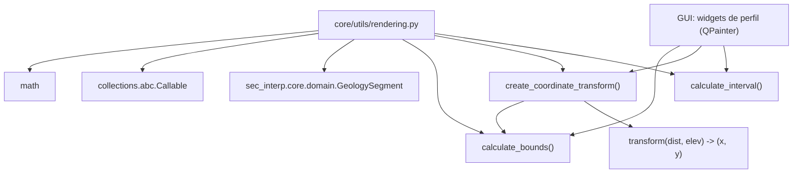

---
tags:
  - secinterp
  - code-walkthrough
  - core
  - utils
  - rendering
aliases:
  - rendering.py
  - calculate_bounds
  - create_coordinate_transform
  - calculate_interval
cssclass: secinterp-note
---

# `core/utils/rendering.py`

> [!abstract] Resumen en una línea
> Utilidades de visualización puras: calcula el *bounding box* con padding, construye una **función de transformación** datos→píxeles (con exageración vertical) y genera intervalos "bonitos" para ejes.

**Ruta**: `core/utils/rendering.py` (129 líneas)
**Clase/Función principal**: `calculate_bounds`, `create_coordinate_transform`, `calculate_interval`
**Capa**: Core · Utilities (QGIS-agnóstico)
**Tags**: #secinterp #core #utils #rendering

---

## 🎯 ¿Por qué existe este archivo?

Dibujar un perfil geológico exige mapear coordenadas de datos (distancia, elevación)
a píxeles de un lienzo, manteniendo proporciones y una escala legible. Repetir estas
operaciones en cada widget sería frágil.

| Problema | Solución |
|----------|----------|
| Conocer el rango total de todos los datos del perfil | `calculate_bounds` agrega topografía + segmentos geológicos con 5% de padding |
| Mapear (dist, elev) a (x, y) respetando el *aspect ratio* | `create_coordinate_transform` devuelve un closure con escala uniforme |
| Etiquetas de ejes con valores legibles (1, 2, 5, 10...) | `calculate_interval` produce intervalos "bonitos" por potencias de 10 |

> [!important] Nota arquitectónica — QGIS-agnóstico puro
> Solo importa `math`, `Callable` y `GeologySegment` del dominio. **No toca `qgis.*`**
> ni `PyQt`: la transformación es aritmética pura, lo que la hace testeable sin QGIS y
> reusable en cualquier backend de render (QPainter, Matplotlib, etc.).

---

## 🧬 Diagrama de relaciones



> [!tip] Cómo leer
> La GUI calcula `bounds` con `calculate_bounds`, obtiene el closure con
> `create_coordinate_transform`, y usa `calculate_interval` para el grid. El closure
> devuelto es la pieza central reutilizada en cada repintado.

---

## 📦 Imports — lectura arquitectónica

```python
# core/utils/rendering.py
from __future__ import annotations

import math
from collections.abc import Callable

from sec_interp.core.domain import GeologySegment
```

| # | Observación |
|---|-------------|
| ① | `math` para `log10`, `floor` (intervalos "bonitos"). |
| ② | `Callable` para tipar el closure devuelto por `create_coordinate_transform`. |
| ③ | `GeologySegment` (DTO del dominio) se usa **solo como anotación** en `geol_data`. |
| ④ | **Cero imports de QGIS/PyQt** ⇒ aritmética pura, testeable sin QGIS. |

---

## 🏗️ Inventario de estructura

**Funciones (3):**

- `calculate_bounds(topo_data, geol_data=None) -> dict[str, float]`
- `create_coordinate_transform(bounds, view_w, view_h, margin, vert_exag=1.0) -> Callable[[float, float], tuple[float, float]]`
- `calculate_interval(data_range: float) -> float`

**Closure interno (1):**

- `transform(dist, elev) -> (x, y)` (definido dentro de `create_coordinate_transform`)

**Sin clases ni estado global.**

---

## 📁 Archivos del paquete

`rendering.py` vive en `core/utils/`:

| Archivo | Líneas | Rol |
|---|--:|---|
| [[rendering]] | 129 | Bounds, transformada de coordenadas, intervalos |
| [[io]] | 101 | Escritura de vectores |
| [[metadata_reader]] | 129 | Lectura de `metadata.txt` |
| [[parsing]] | 222 | Parsing de strike/dip, acimut y atributos |
| [[safe_loader]] | 79 | Importación y carga perezosa segura |
| [[drillhole]] | 298 | Trayectoria y proyección de sondajes |

> [!note] `rendering.py` es "visualización sin GUI"
> Pese al nombre, no dibuja nada: solo calcula matemática de proyección. El dibujo real
> ocurre en la capa GUI. Ver [[core_utils]].

---

## 📖 Recorrido método por método

### `calculate_bounds`

```python
def calculate_bounds(
    topo_data: list[tuple[float, float]],
    geol_data: list[GeologySegment] | None = None,
) -> dict[str, float]:
    dists = [p[0] for p in topo_data]
    elevs = [p[1] for p in topo_data]

    if geol_data:
        for segment in geol_data:
            dists.extend([p[0] for p in segment.points])
            elevs.extend([p[1] for p in segment.points])

    min_d, max_d = min(dists), max(dists)
    min_e, max_e = min(elevs), max(elevs)

    if max_d == min_d:
        max_d = min_d + 100
    if max_e == min_e:
        max_e = min_e + 10

    d_range = max_d - min_d
    e_range = max_e - min_e

    return {
        "min_d": min_d - d_range * 0.05,
        "max_d": max_d + d_range * 0.05,
        "min_e": min_e - e_range * 0.05,
        "max_e": max_e + e_range * 0.05,
    }
```

Agrega distancias y elevaciones de la topografía y, opcionalmente, de los segmentos
geológicos (`segment.points` son `(distance, elevation)`). Aplica **5% de padding** y
protege contra **división por cero** ensanchando rangos degenerados.

### `create_coordinate_transform`

```python
def create_coordinate_transform(
    bounds: dict[str, float],
    view_w: int,
    view_h: int,
    margin: int,
    vert_exag: float = 1.0,
) -> Callable[[float, float], tuple[float, float]]:
    data_w = bounds["max_d"] - bounds["min_d"]
    data_h = bounds["max_e"] - bounds["min_e"]

    potential_scale_x = (view_w - 2 * margin) / data_w
    potential_scale_y = (view_h - 2 * margin) / data_h

    base_scale = min(potential_scale_x, potential_scale_y)

    scale_x = base_scale
    scale_y = base_scale * vert_exag

    def transform(dist: float, elev: float) -> tuple[float, float]:
        x = margin + (dist - bounds["min_d"]) * scale_x
        y = view_h - margin - (elev - bounds["min_e"]) * scale_y
        return x, y

    return transform
```

Devuelve un **closure** que convierte coordenadas de datos a píxeles. Usa la **escala
menor** de ambos ejes para preservar el *aspect ratio* 1:1 (cuando `vert_exag=1.0`), y
aplica la exageración vertical solo al eje Y. La coordenada Y se invierte (`view_h - ...`)
porque en pantalla el origen está arriba.

### `calculate_interval`

```python
def calculate_interval(data_range: float) -> float:
    magnitude = 10 ** math.floor(math.log10(data_range))
    normalized = data_range / magnitude

    THRESHOLD_SMALL = 2
    THRESHOLD_LARGE = 5

    if normalized < THRESHOLD_SMALL:
        return magnitude * 0.5
    if normalized < THRESHOLD_LARGE:
        return magnitude
    return magnitude * 2
```

Genera un intervalo "bonito" basado en la escala 1-2-5: para un rango dado, elige
entre `0.5×`, `1×` o `2×` de la potencia de 10 inferior. Resultado típico: rangos como
`100` → intervalo `50`, `100` o `200`, legibles por humanos.

---

## 🔄 Flujo de datos

| Fase | Entrada | Transformación | Salida |
|------|---------|----------------|--------|
| Bounds | `topo_data` (+ `geol_data`) | min/max + padding 5% | `{min_d, max_d, min_e, max_e}` |
| Escala | `bounds`, `view_w`, `view_h`, `margin` | `min(scale_x, scale_y)` | `base_scale` |
| Transformada | `(dist, elev)` | closure `transform` | `(x, y)` en píxeles |
| Intervalo | `data_range` | `10 ** floor(log10)` + 1-2-5 | intervalo legible |

---

## 🏛️ Patrones de diseño presentes

| Patrón | Dónde | Propósito |
|--------|-------|-----------|
| **Closure / Factory function** | `create_coordinate_transform` | Capturar `bounds`/`scale` en una función reutilizable |
| **Guard clause** | anti división por cero en `calculate_bounds` | Evitar rangos degenerados |
| **Strategy (nice-number)** | `calculate_interval` | Escala 1-2-5 para etiquetas legibles |
| **Pure function** | todo el módulo | Determinista, sin estado ni efectos secundarios |

---

## 🧾 Resumen de la API

| Símbolo | Firma / Hereda | Uso típico |
|---------|----------------|------------|
| `calculate_bounds` | `(topo_data, geol_data=None) -> dict[str, float]` | Rango total con padding |
| `create_coordinate_transform` | `(bounds, view_w, view_h, margin, vert_exag=1.0) -> Callable` | Mapear datos→píxeles |
| `calculate_interval` | `(data_range: float) -> float` | Intervalo para grid/ejes |

---

## 📐 Aspect ratio y exageración vertical

El truco clave de `create_coordinate_transform` es elegir `base_scale` como la **menor**
de las dos escalas potenciales:

```python
potential_scale_x = (view_w - 2 * margin) / data_w
potential_scale_y = (view_h - 2 * margin) / data_h
base_scale = min(potential_scale_x, potential_scale_y)

scale_x = base_scale
scale_y = base_scale * vert_exag
```

| Situación | Efecto |
|-----------|--------|
| `vert_exag = 1.0` | `scale_x == scale_y` ⇒ proporciones 1:1 (sin distorsión) |
| `vert_exag = 5.0` | el eje Y se estira 5× ⇒ exageración vertical geológica |
| Lienzo estrecho | `scale_x` es la menor ⇒ el contenido cabe horizontalmente |

> [!note] Por qué la escala *menor*
> Tomar `min(...)` garantiza que **todo** el perfil quepa en el lienzo en ambos ejes; el
> eje sobrante queda con margen adicional. La alternativa (`max`) recortaría el perfil.

### Ejemplo numérico de la transformación

Con `bounds={min_d:0, max_d:100, min_e:0, max_e:50}`, `view_w=400`, `view_h=300`,
`margin=20`, `vert_exag=1.0`:

| Paso | Cálculo | Resultado |
|------|---------|-----------|
| `data_w` | `100 - 0` | `100` |
| `data_h` | `50 - 0` | `50` |
| `potential_scale_x` | `(400 - 40) / 100` | `3.6` |
| `potential_scale_y` | `(300 - 40) / 50` | `5.2` |
| `base_scale` | `min(3.6, 5.2)` | `3.6` |
| `transform(0, 0)` | `(20 + 0, 280 - 0)` | `(20, 280)` (esquina inferior-izq) |
| `transform(100, 50)` | `(20 + 360, 280 - 180)` | `(380, 100)` (esquina superior-der) |

---

## 🧮 Escala 1-2-5 de `calculate_interval`

| Rango de `data_range` | `magnitude` | `normalized` | Intervalo devuelto |
|-----------------------|-------------|--------------|--------------------|
| `0.8` | `0.1` | `8` | `0.2` |
| `3.0` | `1` | `3` | `1` |
| `45` | `10` | `4.5` | `10` |
| `90` | `10` | `9` | `20` |

> [!tip] Regla mnemotécnica
> `normalized < 2` → mitad; `2 ≤ normalized < 5` → unidad; `≥ 5` → doble. Produce las
> secuencias "bonitas" `0.5, 1, 2, 5, 10, 20, 50...` que los humanos esperan en un eje.

---

## 🛡️ Manejo de errores

Sin excepciones: las tres funciones son **totales** (nunca fallan para entradas
numéricas válidas).

| Riesgo | Defensa |
|--------|---------|
| `topo_data` vacío → `min()` falla | el contrato exige al menos un punto (lo garantiza el llamador) |
| `max_d == min_d` → división por cero | `max_d = min_d + 100` |
| `max_e == min_e` → división por cero | `max_e = min_e + 10` |
| `data_range` ≤ 0 en `calculate_interval` | `log10` de no-positivos fallaría; contrato: rango > 0 |

> [!warning] `calculate_bounds` con lista vacía lanzaría `ValueError`
> `min([])`/`max([])` elevan `ValueError`. El módulo **no** valida `topo_data` vacío;
> la GUI se encarga de no invocarlo sin datos.

---

## 🔗 Relación con el dominio

`create_coordinate_transform` depende de `calculate_bounds`, y `calculate_bounds` consume
`GeologySegment` ([[entities]]). En el flujo real de preview:

1. `PreviewResult.get_elevation_range()` ([[dtos]]) entrega los límites verticales.
2. `calculate_bounds` amplía esos límites con padding del 5%.
3. El widget de perfil obtiene el closure y repinta cada `(dist, elev)`.

> [!note] El módulo no recibe `PreviewResult` directamente
> Trabaja con `topo_data` (lista de tuplas) y `geol_data` (lista de segmentos), no con
> el DTO agregado. Esa descomposición mantiene `rendering.py` desacoplado del
> contenedor de resultados.

> [!tip] Pureza = portabilidad
> Como no hay dependencias de GUI, estas tres funciones podrían reutilizarse en un
> export de imagen (Matplotlib/PIL) sin cambios.

---

## 🧪 Tests asociados

`tests/core/test_rendering_utils.py` (BaseTestCase, Mock-first):

- `test_calculate_bounds_topo_only` — verifica padding exacto (`min_d=-10`, `max_d=210`, etc.).
- `test_calculate_bounds_with_geol` — incluye `GeologySegment` (mockeado) en el rango.
- `test_calculate_bounds_division_by_zero` — rangos degenerados no dividen por cero.
- `test_transform_linear` — verifica la proyección lineal de `transform`.
- `test_transform_vertical_exaggeration` — `vert_exag` afecta solo al eje Y.
- `test_calculate_interval_various_ranges` — intervalos 1-2-5 para varios rangos.

---

## 👀 Observaciones y notas

> [!success] Fortalezas
> - Aritmética pura y determinista, sin dependencias de GUI.
> - El closure de transformada es una abstracción elegante y reutilizable.
> - Anti-división-por-cero explícita y documentada.

> [!warning] Puntos de atención
> - `calculate_bounds` no valida `topo_data` vacío (contrato implícito con el llamador).
> - `calculate_interval` fallaría con `data_range <= 0` (sin guard).
> - `transform` cierra sobre `bounds`/`scale` por referencia: si `bounds` muta después, el closure lo refleja.

> [!question] Preguntas abiertas
> - ¿Mover el cálculo de `margin` y `view_w/h` a un DTO de configuración de vista?
> - ¿Añadir guards para `topo_data` vacío y `data_range <= 0`?
> - ¿Congelar los valores capturados por el closure para evitar mutaciones inesperadas?

---

## 🔗 Notas relacionadas

- [[Index]] — índice de la bóveda
- [[core_utils]] — paquete `core/utils/` y sus utilidades puras
- [[parsing]] — datos estructurales que alimentan el perfil renderizado
- [[drillhole]] — trayectorias proyectadas al perfil
- [[entities]] / [[dtos]] — `GeologySegment` y `PreviewResult` que se dibujan
- [[controller]] — orquesta bounds + transformada en el flujo de preview

---

*Nota de la bóveda SecInterp Code Walkthrough v2 — v3.8.0*
