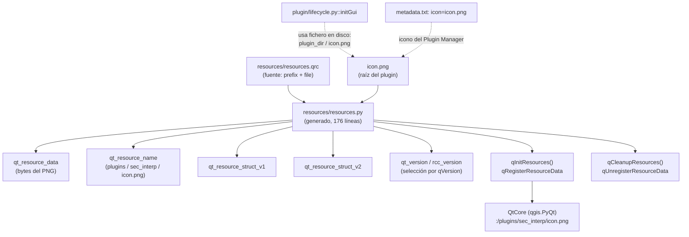

---
tags:
  - secinterp
  - code-walkthrough
  - resources
  - icons
aliases:
  - resources.py
  - qInitResources
cssclass: secinterp-note
---

# `resources/resources.py`

> [!abstract] Resumen en una línea
> Módulo **generado** por el Resource Compiler de PyQt5 que incrusta `icon.png` como blob binario y lo registra en Qt bajo el prefijo `:/plugins/sec_interp/` mediante `qInitResources()`.

**Ruta**: `resources/resources.py` (176 líneas)
**Función principal**: `qInitResources` / `qCleanupResources`
**Capa**: Resources / GUI (binario compilado, no lógica)
**Tags**: #secinterp #resources #icons

---

## 🎯 ¿Por qué existe este archivo?

Qt permite embeber iconos en el propio código para no depender de rutas de disco. Este
fichero es la salida del compilador `pyrcc5` sobre `resources.qrc`:

| Problema | Solución |
|----------|----------|
| El icono debe viajar con el plugin sin rutas frágiles | PNG incrustado como `qt_resource_data` (bytes) |
| Qt necesita un índice nombre → bytes | `qt_resource_name` + `qt_resource_struct_v1/v2` |
| El recurso debe estar disponible al importar | `qInitResources()` ejecutado al final del módulo |
| Distintas versiones de Qt usan distinto formato de índice | Selección `rcc_version` según `QtCore.qVersion()` |

> [!important] Nota arquitectónica
> **No editar a mano**: la cabecera avisa de que cualquier cambio se pierde al
> recompilar. La fuente de verdad es `resources.qrc` + `icon.png`; este `.py` es un
> artefacto generado. Ver [[resources_pkg]] para el rol del paquete.

---

## 🧬 Diagrama de relaciones



> [!tip] Cómo leer
> Flecha sólida = generación/contención; punteada = referencia externa. Nótese que
> `initGui` carga el icono **desde disco**, no desde el prefijo `:/` registrado aquí.

---

## 📦 Imports — lectura arquitectónica

```python
# resources/resources.py
# -*- coding: utf-8 -*-

# Resource object code
#
# Created by: The Resource Compiler for PyQt5 (Qt v5.15.18)
#
# WARNING! All changes made in this file will be lost!

from qgis.PyQt import QtCore
```

| # | Observación |
|---|-------------|
| ① | **Un único import** en todo el módulo: el resto son literales `bytes` y dos funciones. |
| ② | `from qgis.PyQt import QtCore` (no `PyQt5` directo): import agnóstico, coherente con la guía QGIS 4.x del proyecto. |
| ③ | La cabecera documenta el generador (`PyQt5`, Qt v5.15.18): fija la procedencia del artefacto. |
| ④ | `WARNING! ... will be lost!`: contrato de solo-lectura para humanos y agentes. |
| ⑤ | No importa `logger_config` ni nada del plugin: el módulo es autocontenido a propósito (debe cargarse incluso si el resto falla). |

---

## 🏗️ Inventario de estructura

**Datos de módulo (5):**

- `qt_resource_data: bytes` — contenido del PNG (líneas 11–120).
- `qt_resource_name: bytes` — árbol de nombres (`plugins` → `sec_interp` → `icon.png`, líneas 122–135).
- `qt_resource_struct_v1: bytes` — índice para Qt < 5.8 (líneas 137–142).
- `qt_resource_struct_v2: bytes` — índice para Qt ≥ 5.8 (líneas 144–153).
- `qt_version: list[int]` + `rcc_version: int` + `qt_resource_struct` — selección en tiempo de import (líneas 155–161).

**Funciones (2):**

- `qInitResources() -> None` — `QtCore.qRegisterResourceData(...)`.
- `qCleanupResources() -> None` — `QtCore.qUnregisterResourceData(...)`.

**Efecto lateral al importar:**

- `qInitResources()` invocado en la línea 176: importar el módulo registra el recurso.

---

## 📁 Archivos del paquete

El módulo generado convive con su fuente y sus vecinos no compilados:

| Archivo | Líneas | Rol |
|---|--:|---|
| [[resources]] | 176 | Módulo compilado (esta nota) |
| [[resources_pkg]] | 4 | `resources/__init__.py`: docstring del paquete |
| `resources.qrc` | 5 | Fuente XML: `<qresource prefix="/plugins/sec_interp"><file>../icon.png</file>` |
| `symbology-style.db` | — | Base de estilos (no compilada, fuera del `.qrc`) |
| `../icon.png` | — | PNG raíz: icono del plugin y del Plugin Manager |

---

## 📖 Recorrido bloque por bloque

### Cabecera generada — contrato de solo-lectura

```python
# -*- coding: utf-8 -*-

# Resource object code
#
# Created by: The Resource Compiler for PyQt5 (Qt v5.15.18)
#
# WARNING! All changes made in this file will be lost!
```

Identifica herramienta y versión (Qt v5.15.18). Cualquier regeneración con otra versión
de `pyrcc5`/`pyrcc6` reescribiría los blobs y las estructuras: por eso el diff de este
fichero en git solo debería cambiar cuando cambie el icono o el `.qrc`.

### `qt_resource_data` — el PNG incrustado

```python
qt_resource_data = b"\
\x00\x00\x06\x97\
\x89\
\x50\x4e\x47\x0d\x0a\x1a\x0a\x00\x00\x00\x0d\x49\x48\x44\x52\x00\
...
\x4e\x44\xae\x42\x60\x82\
"
```

~110 líneas de escapes hexadecimales. Se reconocen las firmas del formato:

| Bytes | Significado |
|-------|-------------|
| `\x89PNG\r\n\x1a\n` (`\x50\x4e\x47...`) | Firma mágica PNG |
| `IHDR` (`\x49\x48\x44\x52`) | Cabecera: `0x17 × 0x18` (23×24 px), color RGBA |
| `sRGB`, `gAMA`, `cHRM`, `bKGD`, `pHYs`, `tIME` | Chunks auxiliares de color y edición |
| `IDAT` (`\x49\x44\x41\x54`) | Datos de imagen comprimidos (el grueso del blob) |
| `IEND` (`\x49\x45\x4e\x44`) | Fin del PNG |

> [!note] No hace falta leer el blob
> El contenido es opaco por diseño: lo único relevante es que empieza en `PNG` y termina
> en `IEND`. Si el icono se corrompe, se regenera desde `icon.png`, no se parchea aquí.

### `qt_resource_name` — el árbol de nombres

```python
qt_resource_name = b"\
\x00\x07\
\x07\x3b\xe0\xb3\
\x00\x70\
\x00\x6c\x00\x75\x00\x67\x00\x69\x00\x6e\x00\x73\
\x00\x0a\
\x06\x0a\x9b\xb0\
\x00\x73\
\x00\x65\x00\x63\x00\x5f\x00\x69\x00\x6e\x00\x74\x00\x65\x00\x72\x00\x70\
\x00\x08\
\x0a\x61\x5a\xa7\
\x00\x69\
\x00\x63\x00\x6f\x00\x6e\x00\x2e\x00\x70\x00\x6e\x00\x67\
"
```

Codifica la ruta virtual del recurso como segmentos UTF-16 con hashes:

| Segmento | Longitud | Texto |
|----------|----------|-------|
| `\x00\x07` + `\x00p...` | 7 | `plugins` |
| `\x00\x0a` + `\x00s...` | 10 | `sec_interp` |
| `\x00\x08` + `\x00i...` | 8 | `icon.png` |

Combinado con el `prefix="/plugins/sec_interp"` del `.qrc`, el recurso accesible en Qt es
`:/plugins/sec_interp/icon.png`.

### Estructuras `v1` / `v2` + selección por versión

```python
qt_resource_struct_v1 = b"\
\x00\x00\x00\x00\x00\x02\x00\x00\x00\x01\x00\x00\x00\x01\
...
"

qt_resource_struct_v2 = b"\
\x00\x00\x00\x00\x00\x02\x00\x00\x00\x01\x00\x00\x00\x01\
\x00\x00\x00\x00\x00\x00\x00\x00\
...
\x00\x00\x01\x9b\x1e\x90\xab\x79\
"

qt_version = [int(v) for v in QtCore.qVersion().split(".")]
if qt_version < [5, 8, 0]:
    rcc_version = 1
    qt_resource_struct = qt_resource_struct_v1
else:
    rcc_version = 2
    qt_resource_struct = qt_resource_struct_v2
```

El formato del índice cambió en Qt 5.8; el módulo lleva ambos y elige en tiempo de
import comparando listas de enteros (`[5, 15, 18] < [5, 8, 0]` → `False` → v2 en QGIS 3.x
modernos). La v2 añade una fila de ceros por nodo y un hash final (`\x1e\x90\xab\x79`).

### `qInitResources` / `qCleanupResources` + auto-registro

```python
def qInitResources():
    QtCore.qRegisterResourceData(
        rcc_version, qt_resource_struct, qt_resource_name, qt_resource_data
    )


def qCleanupResources():
    QtCore.qUnregisterResourceData(
        rcc_version, qt_resource_struct, qt_resource_name, qt_resource_data
    )


qInitResources()
```

Registro simétrico: `qRegisterResourceData` expone `:/plugins/sec_interp/icon.png` a toda
la app Qt; `qUnregisterResourceData` lo retiraría (hoy nadie la llama: no hay descarga
explícita del recurso en `unload`). La llamada final hace que el **import baste**: quien
importe `resources.resources` deja el icono disponible.

---

## 🪟 Recurso registrado vs icono usado

Honestidad importante: el recurso registrado **no** es el que usa el código actual.

| Aspecto | Recurso `:/` | Fichero en disco |
|---------|--------------|------------------|
| Origen | `resources.py` (compilado) | `icon.png` en la raíz |
| Ruta | `:/plugins/sec_interp/icon.png` | `self.plugin_dir / "icon.png"` |
| Consumidor | ninguno directo hoy | `plugin/lifecycle.py::initGui` (`add_action`) |
| Plugin Manager | — | `metadata.txt` → `icon=icon.png` |

> [!warning] Registro sin consumo directo
> El `.qrc` declara `../icon.png` y el registro funciona, pero `initGui` construye
> `QIcon` desde la ruta de disco. El recurso compilado actúa como respaldo/empaquetado
> clásico de Plugin Builder, no como vía principal. No inventar usos `:/` que no existen.

---

## 🧭 El prefijo virtual `:/plugins/sec_interp`

Una vez registrado, Qt resuelve `:/plugins/sec_interp/icon.png` como un fichero más,
sin acceso a disco. El prefijo tiene tres segmentos con roles distintos:

| Segmento | Origen | Rol |
|----------|--------|-----|
| `:/` | Sintaxis Qt | Marca "recurso compilado", no fichero |
| `plugins/sec_interp` | `prefix` del `.qrc` + árbol `qt_resource_name` | Namespace del plugin dentro de la app |
| `icon.png` | `<file>../icon.png</file>` | Nombre del recurso |

```python
# Uso canónico Qt (no empleado hoy en el código: la carga es desde disco)
icon = QIcon(":/plugins/sec_interp/icon.png")
```

> [!note] Convención Plugin Builder
> El `prefix="/plugins/sec_interp"` es el que genera Plugin Builder por defecto
> (`plugins` + nombre del módulo). Mantenerlo evita colisiones con recursos de otros
> plugins cargados en el mismo proceso QGIS.

---

## 🔄 Flujo de datos

| Fase | Entrada | Transformación | Salida |
|------|---------|----------------|--------|
| Compilación | `resources.qrc` + `../icon.png` | `pyrcc5` (Qt v5.15.18) | `resources.py` con blobs |
| Import | `import resources.resources` | selección v1/v2 + `qRegisterResourceData` | `:/plugins/sec_interp/icon.png` disponible |
| Uso real del icono | `plugin_dir / "icon.png"` | `QIcon(icon_path)` en `add_action` | icono de menú + toolbar |
| Limpieza | `qCleanupResources()` | `qUnregisterResourceData` | recurso retirado (sin llamadas hoy) |

---

## 🛠️ Cómo regenerar

```bash
# Desde la raíz del plugin (requiere pyrcc5 del entorno QGIS/Qt5)
pyrcc5 -o resources/resources.py resources/resources.qrc
```

| Regla | Detalle |
|-------|---------|
| Editar | Solo `resources.qrc` e `icon.png`; jamás este `.py` |
| Verificar | Tras regenerar, comprobar firma `PNG`/`IEND` y el diff acotado al blob |
| Qt6 / QGIS 4 | Con `pyrcc6` cambiaría la cabecera y el import; mantener `qgis.PyQt` si se migra |

---

## 🏛️ Patrones de diseño presentes

| Patrón | Dónde | Propósito |
|--------|-------|-----------|
| **Code generation** | Módulo completo | Binario → código importable |
| **Registry** | `qRegister/qUnregisterResourceData` | Índice global nombre → bytes en Qt |
| **Version dispatch** | `rcc_version` por `qVersion()` | Un artefacto válido en Qt viejos y nuevos |
| **Self-registration** | `qInitResources()` final | Importar equivale a activar |

---

## 🧾 Resumen de la API

| Símbolo | Firma / Tipo | Uso típico |
|---------|--------------|------------|
| `qt_resource_data` | `bytes` | Blob del PNG (opaco) |
| `qt_resource_name` | `bytes` | Árbol `plugins/sec_interp/icon.png` |
| `qt_resource_struct_v1/v2` | `bytes` | Índices según versión de Qt |
| `qInitResources` | `() -> None` | Registrar (auto al importar) |
| `qCleanupResources` | `() -> None` | Retirar (sin llamadas actuales) |
| Recurso virtual | `:/plugins/sec_interp/icon.png` | Ruta Qt registrada |

---

## 🛡️ Manejo de errores

| Caso | Comportamiento |
|------|---------------|
| Qt < 5.8 | Rama `v1` seleccionada por comparación de versión |
| `qVersion()` con formato inesperado | `int(v)` lanzaría `ValueError` al importar (sin guarda: fallo visible temprano) |
| Recurso ya registrado (doble import) | Python cachea el módulo: `qInitResources()` corre una sola vez |
| PNG corrupto en el blob | Qt no resuelve el icono; se regenera desde `icon.png`, no se parchea |

---

## 🧪 Tests asociados

No hay tests bajo `tests/` que cubran este módulo (ni el paquete `resources/`):

- Ningún `tests/**/test_resource*.py` existe; `grep resources tests/` no devuelve casos propios.
- La carga del icono se ejercita indirectamente en suites GUI que construyen acciones con `icon.png` desde disco (mockeado).
- El registro `qInitResources()` requeriría Qt real o los mocks de `tests/mocks/` (`qt_mocks.py`, `qgis_core.py`).

> [!note] Propuesta honesta de cobertura
> Un test puro podría importar el módulo con `QtCore` mockeado y assertar que
> `qRegisterResourceData` se llamó con `rcc_version == 2` y que `qt_resource_data`
> empieza por la firma PNG. Sin QGIS real, con `tests/base_test.py`.

---

## 👀 Observaciones y notas

> [!success] Fortalezas
> - Autocontenido: un import y funciona, sin dependencias del plugin.
> - Compatible Qt < 5.8 y ≥ 5.8 con el mismo artefacto.
> - Import agnóstico (`qgis.PyQt`) alineado con la guía QGIS 4.x.

> [!warning] Puntos de atención
> - Generado con Qt v5.15.18: migrar a `pyrcc6` exige regenerar para QGIS 4/Qt6.
> - `qCleanupResources` sin llamadas: el recurso vive hasta que muere el proceso.
> - El código usa el icono desde disco, no el `:/` registrado: doble vía a mantener coherente.
> - `int(v)` sobre `qVersion()` no tolera sufijos no numéricos.

> [!question] Preguntas abiertas
> - ¿Unificar la carga del icono en `initGui` hacia el prefijo `:/` o eliminar el `.qrc`?
> - ¿Regenerar con `pyrcc6`/`qgis.PyQt` al migrar a QGIS 4?
> - ¿Añadir un test de registro con `QtCore` mockeado?

---

## 🔗 Notas relacionadas

- [[Index]] — índice de la bóveda
- [[resources_pkg]] — paquete `resources/` y su rol de namespace
- [[lifecycle]] — `initGui` carga `icon.png` desde disco vía `add_action`
- [[sec_interp_plugin]] — `plugin_dir` como base de la ruta del icono
- [[main_dialog]] — diálogo cuya acción de menú usa este icono

---

*Nota de la bóveda SecInterp Code Walkthrough v2 — v3.8.0*
