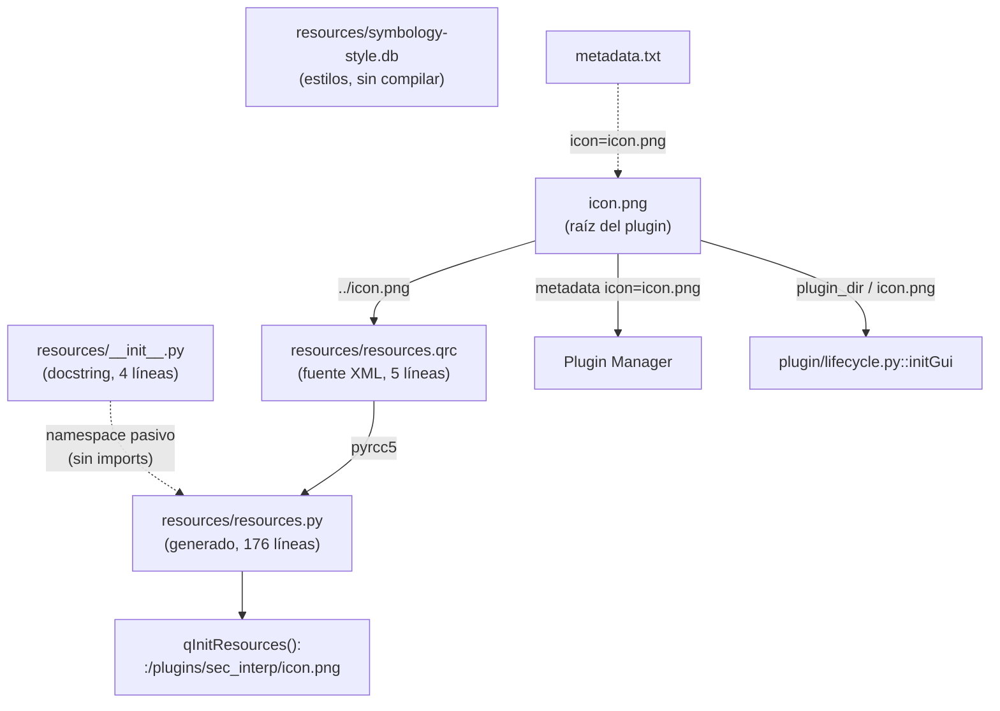
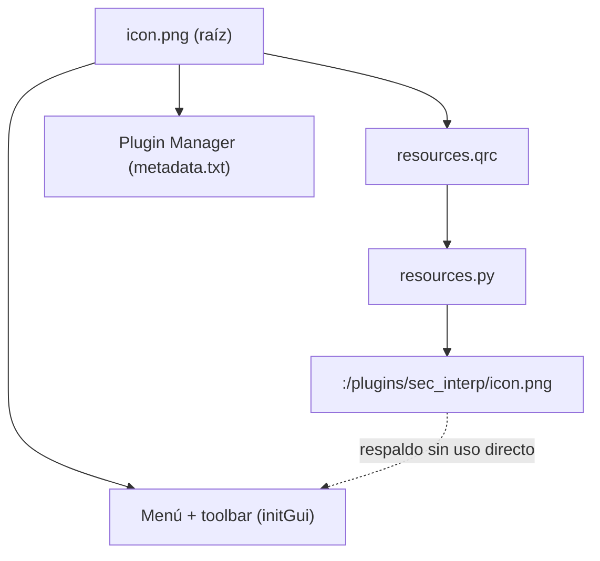

---
tags:
  - secinterp
  - code-walkthrough
  - resources
  - package
aliases:
  - resources/
  - __init__.py
cssclass: secinterp-note
---

# `resources/` — Paquete de recursos del plugin

> [!abstract] Resumen en una línea
> Paquete `resources/` (4 archivos): namespace mínimo (`__init__.py` con solo docstring) que aloja el icono compilado `resources.py`, su fuente `resources.qrc` y la base `symbology-style.db` sin compilar.

**Ruta**: `resources/` (2 Python: 4 + 176 líneas, más `.qrc` y `.db`)
**Símbolo principal**: `resources.resources.qInitResources` (vía [[resources]])
**Capa**: Resources / GUI (contenedor, sin lógica propia)
**Tags**: #secinterp #resources #package

---

## 🎯 ¿Por qué existe este paquete?

Los plugins QGIS generados con Plugin Builder aíslan los artefactos binarios en
`resources/`. Aquí el paquete cumple tres funciones de contenedor:

| Problema | Solución |
|----------|----------|
| El icono compilado necesita un home importable | `resources/resources.py` bajo el paquete `resources` |
| La fuente del recurso debe vivir junto al generado | `resources.qrc` junto al `.py` que produce |
| Estilos auxiliares no deben mezclarse con código | `symbology-style.db` aislada en el mismo directorio |

> [!important] Nota arquitectónica
> El paquete **no tiene lógica**: su `__init__.py` es solo un docstring, sin imports ni
> `__all__` ni re-exports. Es un namespace pasivo; todo el comportamiento vive en
> [[resources]] (`resources.py`). No fabricar símbolos que no existen.

---

## 🧬 Diagrama de relaciones



> [!tip] Cómo leer
> Flecha sólida = generación/uso real; punteada = contención o referencia declarativa.
> El paquete no importa nada: solo agrupa.

---

## 📦 Imports — lectura arquitectónica

```python
# resources/__init__.py (contenido íntegro, 4 líneas)
"""Resources module for SecInterp plugin.

Contains icons, QRC files, and compiled resources.
"""
```

| # | Observación |
|---|-------------|
| ① | **Cero imports**: el `__init__` no carga `resources.py` ni registra nada. |
| ② | Solo un docstring de módulo: describe iconos, QRC y compilados. |
| ③ | Sin `__all__`, sin versión, sin símbolos: el namespace es deliberadamente vacío. |
| ④ | [[resources]] (`resources.py`) tiene su propio único import (`qgis.PyQt.QtCore`) y se importa por ruta completa cuando se necesita, no vía el paquete. |
| ⑤ | Contraste con `plugin/__init__.py` (ver [[plugin]]), que sí re-exporta mixins: aquí no hay nada que re-exportar. |

---

## 🏗️ Inventario de estructura

**Símbolos Python en el paquete: ninguno propio.**

- `resources/__init__.py` — 0 clases, 0 funciones, 0 constantes. Solo docstring.
- `resources/resources.py` — documentado en [[resources]]: 2 funciones (`qInitResources`, `qCleanupResources`) + 5 blobs de datos. **No se repite aquí**: esta nota describe el contenedor, no el contenido.

---

## 📁 Archivos del paquete

| Archivo | Líneas | Rol |
|---|--:|---|
| [[#__init__.py\|__init__.py]] | 4 | Docstring del paquete; sin imports ni re-exports |
| [[#resources.py\|resources.py]] | 176 | Icono compilado; detalle en [[resources]] |
| [[#resources.qrc\|resources.qrc]] | 5 | Fuente XML del recurso (`prefix` + `file`) |
| [[#symbology-style.db\|symbology-style.db]] | — | Base de estilos; fuera del `.qrc`, sin compilar |

---

## 📖 Recorrido archivo por archivo

### `__init__.py`

```python
"""Resources module for SecInterp plugin.

Contains icons, QRC files, and compiled resources.
"""
```

El fichero íntegro, sin una línea más. Su único trabajo es convertir el directorio en
paquete importable (`import resources.resources` funciona gracias a él). No registra el
recurso, no define versión, no expone API.

| Pregunta | Respuesta honesta |
|----------|-------------------|
| ¿Importa `resources.py`? | No |
| ¿Llama a `qInitResources()`? | No (el propio `resources.py` se auto-registra al importarse) |
| ¿Declara `__all__`? | No |
| ¿Hay que tocarlo al añadir un icono? | No; solo cambia el `.qrc` y se regenera `resources.py` |

### `resources.py`

Módulo generado por el Resource Compiler (Qt v5.15.18) que incrusta `icon.png` y lo
registra como `:/plugins/sec_interp/icon.png`. Contenido completo en [[resources]]; aquí
solo su ficha de contenedor:

| Aspecto | Detalle |
|---------|---------|
| Naturaleza | Artefacto generado, solo-lectura (`WARNING! ... will be lost!`) |
| Import | `from qgis.PyQt import QtCore` (único) |
| API | `qInitResources()` (auto al importar), `qCleanupResources()` (sin llamadas) |
| Regla | Editar `resources.qrc` + `icon.png`, regenerar con `pyrcc5` |

### `resources.qrc`

```xml
<RCC>
    <qresource prefix="/plugins/sec_interp" >
        <file>../icon.png</file>
    </qresource>
</RCC>
```

Fuente de 5 líneas del recurso: un único `<qresource>` con `prefix="/plugins/sec_interp"`
y un único `<file>` relativo (`../icon.png`, es decir, el PNG de la raíz del plugin).
De aquí sale la ruta virtual `:/plugins/sec_interp/icon.png`.

| Elemento | Detalle |
|----------|---------|
| `prefix` | `/plugins/sec_interp` — namespace virtual en Qt |
| `file` | `../icon.png` — relativo al `.qrc`, resuelve a la raíz |
| Recursos | 1 (solo el icono; `symbology-style.db` no está incluida) |

### `symbology-style.db`

Base de datos SQLite de estilos QGIS que viaja con el plugin pero **fuera** del sistema
de recursos Qt: no aparece en el `.qrc` ni en `resources.py`.

| Aspecto | Detalle |
|---------|---------|
| Formato | SQLite (`style.db` de QGIS: símbolos, rampas, etiquetas) |
| Compilada en `resources.py` | No |
| Referenciada en código | Sin imports ni rutas directas halladas en el código actual |
| Rol | Reserva de estilos del plugin, aislada del código |

> [!note] Sin símbolos inventados
> Esta nota no atribuye funciones, clases ni lectores a `symbology-style.db`: el
> repositorio no muestra un consumidor directo. Se documenta como artefacto contenido,
> no como API.

---

## ⚖️ Comparativa: dos `__init__.py`, dos filosofías

El proyecto tiene varios `__init__.py` con roles opuestos. Contrastar ayuda a no
copiar el patrón equivocado:

| Aspecto | `resources/__init__.py` (este) | `plugin/__init__.py` (ver [[plugin]]) |
|---------|-------------------------------|--------------------------------------|
| Líneas | 4 | 9 |
| Imports | 0 | 3 mixins re-exportados |
| `__all__` | No | Sí (`InputValidationMixin`, `PluginLifecycleMixin`, `RenderPipelineMixin`) |
| Docstring | Descriptivo del contenido | Una línea de propósito |
| Filosofía | Namespace pasivo | Fachada que agrega API |

| Regla práctica | Detalle |
|----------------|---------|
| Re-exporta cuando el paquete es **fachada** | `plugin/` agrega tres mixins bajo un solo import |
| Vacía cuando el paquete es **contenedor** | `resources/` aloja artefactos; re-exportar `qInitResources` no aportaría nada |
| Nunca importes el pesado en el `__init__` | Ni `plugin/` ni `resources/` importan Qt/GUI en cabecera |

> [!tip] El `__init__` vacío es una decisión revisada
> Si un futuro icono necesitara registro eager, el lugar seguiría siendo el import
> explícito (`import resources.resources`), no el `__init__`: el auto-registro final de
> `resources.py` ya cubre ese caso sin acoplar el namespace.

---

## 🗺️ El prefijo virtual y el mapa del icono

El icono del plugin tiene tres vidas paralelas; solo una pasa por este paquete:

| Vida | Ruta | Definida en | Consumida en |
|------|------|-------------|--------------|
| Recurso Qt | `:/plugins/sec_interp/icon.png` | [[resources]] (`qRegisterResourceData`) | sin consumidor directo hoy |
| Fichero de menú | `plugin_dir / "icon.png"` | `icon.png` en la raíz | `plugin/lifecycle.py::initGui` |
| Fichero de gestor | `icon=icon.png` | `metadata.txt` | Plugin Manager de QGIS |



> [!note] Por qué conviven dos vías
> La vía `:/` es herencia de Plugin Builder (empaquetado clásico autosuficiente); la
> vía disco es la que el código usa de verdad (`QIcon(icon_path)`). Eliminar una de las
> dos es la pregunta abierta de [[resources]]; este paquete no toma partido, aloja ambas.

---

## 🔁 Ciclo de vida del recurso compilado

| Fase | Acción | Archivo tocado |
|------|--------|----------------|
| Diseño | Editar el PNG raíz o añadir `<file>` | `icon.png`, `resources.qrc` |
| Compilación | `pyrcc5 -o resources/resources.py resources/resources.qrc` | `resources.py` (regenerado) |
| Revisión | Diff acotado al blob + cabecera de versión | `resources.py` en git |
| Carga | `import resources.resources` → `qInitResources()` | runtime (auto) |
| Uso | `QIcon(":/plugins/sec_interp/icon.png")` (potencial) | código cliente |
| Descarga | `qCleanupResources()` (sin llamadas hoy) | fin del proceso |

| Qué NO contiene el paquete | Por qué importa saberlo |
|---------------------------|------------------------|
| Traducciones (`.qm`/`.ts`) | Viven en `i18n/`, las carga [[sec_interp_plugin]] |
| Hojas de estilo Qt (`.qss`) | No hay; la UI es programática (ver `gui/`) |
| Iconos adicionales | Solo `icon.png`; nuevos iconos exigen editar el `.qrc` |
| Lógica de carga perezosa | Eso es [[safe_loader]]; aquí el registro es eager al importar |
| Tests del recurso | No existen; propuesta en [[resources]] |

---

## 🔄 Flujo de datos

| Fase | Entrada | Transformación | Salida |
|------|---------|----------------|--------|
| Empaquetado | `icon.png` (raíz) | `pyrcc5 resources.qrc` | `resources.py` regenerado |
| Import | `import resources.resources` | `qInitResources()` | `:/plugins/sec_interp/icon.png` en Qt |
| Icono de menú | `plugin_dir / "icon.png"` | `QIcon` en `add_action` | icono de `initGui` (vía disco) |
| Plugin Manager | `metadata.txt: icon=icon.png` | QGIS lee el PNG raíz | icono en el gestor de plugins |
| Estilos | `symbology-style.db` | — (sin vía compilada) | artefacto disponible en disco |

---

## 🏛️ Patrones de diseño presentes

| Patrón | Dónde | Propósito |
|--------|-------|-----------|
| **Package as namespace** | `__init__.py` mínimo | Agrupar sin acoplar |
| **Code generation** | `resources.py` vía `pyrcc5` | Binario → código (detalle en [[resources]]) |
| **Source alongside artifact** | `.qrc` junto al `.py` | Regeneración trazable |
| **Uncompiled sidecar** | `symbology-style.db` | Estilos fuera del pipeline Qt |

---

## 📥 Quién importa el paquete (mapa de imports)

Dato verificado con `grep`: **ningún módulo Python del plugin importa
`resources.resources` hoy**.

| Búsqueda | Resultado |
|----------|-----------|
| `import resources` / `from resources` en `*.py` (sin `.venv`, sin `docs/`) | 0 importadores |
| `qInitResources` fuera de `resources.py` | 0 llamadas |
| `:/plugins/sec_interp` fuera de `resources.py` | 0 usos |
| `icon.png` referenciado | `plugin/lifecycle.py` (disco) y `metadata.txt` (gestor) |

> [!note] Módulo huérfano, no módulo roto
> El registro funciona (el import auto-registra), pero nadie lo importa: el icono viaja
> por disco. Es el patrón clásico de Plugin Builder dejado como respaldo. Cambiar esto
> (importar el recurso en `initGui` o eliminar el `.qrc`) es decisión de producto, no
> un bug.

El único lector automatizado del directorio es el generador de la bóveda:

| Lector | Detalle |
|--------|---------|
| `scripts/generate_vault_v2.py` (`SCAN_DIRS`) | Incluye `"resources"` en los directorios escaneados (junto a `core`, `gui`, `exporters`, `plugin`) |
| Regla de slugs del generador | `resources` → `resources_pkg` para la nota de grupo, liberando `resources` para `resources.py` |
| Origen del slug canónico | Por eso esta nota se llama `resources_pkg` y no `resources` (ver [[resources]]) |

---

## 🧾 Resumen de la API

| Símbolo | Firma / Hereda | Uso típico |
|---------|----------------|------------|
| (paquete) | sin símbolos propios | `import resources.resources` |
| `qInitResources` | `() -> None` (en [[resources]]) | auto-registro al importar |
| `qCleanupResources` | `() -> None` (en [[resources]]) | retirada (sin llamadas) |

---

## 🛡️ Manejo de errores

El paquete, al no ejecutar nada, no tiene errores propios. Los casos relevantes viven en
el contenido:

| Caso | Dónde se maneja |
|------|-----------------|
| Qt < 5.8 (índice v1) | `resources.py`, selección por `qVersion()` |
| PNG corrupto | regenerar desde `icon.png`, nunca parchear el blob |
| `.qrc` desincronizado del `.py` | regenerar con `pyrcc5`; el diff debe acotarse al blob |
| `symbology-style.db` ausente | sin consumidor directo: sin fallo en código |

---

## 🧪 Tests asociados

Sin tests dedicados al paquete (igual que [[resources]]):

- No existe `tests/**/test_resource*.py`; `grep resources tests/` no devuelve casos propios.
- La vía del icono de menú (`icon.png` en disco) se ejercita indirectamente en suites GUI con acciones mockeadas.
- Un test futuro con `QtCore` mockeado cubriría `qRegisterResourceData` sin QGIS real (vía `tests/base_test.py`).

---

## 👀 Observaciones y notas

> [!success] Fortalezas
> - Separación clara: fuente (`.qrc`), generado (`.py`) y sidecar (`.db`) en un solo lugar.
> - `__init__` mínimo: imposible romper nada importando el paquete.
> - Documentación honesta del `__init__`: su pequeñez es una decisión, no un olvido.

> [!warning] Puntos de atención
> - `symbology-style.db` sin consumidor visible: riesgo de artefacto huérfano que viaja en el ZIP.
> - Doble vía del icono (`:/` registrado vs disco usado) documentada en [[resources]].
> - Generado con Qt 5.15: la migración QGIS 4/Qt6 exigirá regenerar.

> [!question] Preguntas abiertas
> - ¿Se usa `symbology-style.db` en algún flujo o puede salir del empaquetado?
> - ¿Unificar el icono de `initGui` hacia el prefijo `:/`?
> - ¿Incluir la regeneración `pyrcc` en el `Makefile` (`make compile`)?

---

## 🏷️ Slug canónico y convivencia con `resources.md`

Dos notas cubren este directorio; el reparto es explícito para no duplicar ni inventar:

| Nota | Slug | Cubre | No cubre |
|------|------|-------|----------|
| Grupo (esta) | `resources_pkg` | `__init__.py`, `.qrc`, `.db`, rol de contenedor | blobs binarios, `qInitResources` en detalle |
| Módulo | [[resources]] | `resources.py` línea a línea (176) | `symbology-style.db`, el `__init__` |

| Regla de la bóveda | Detalle |
|--------------------|---------|
| Un slug por símbolo documentable | `resources` = el módulo compilado; `resources_pkg` = el paquete |
| Enlaces cruzados honestos | Esta nota enlaza a [[resources]] para el contenido; [[resources]] enlaza aquí para el contenedor |
| Sin símbolos fabricados | Ni `__all__`, ni lectores de `.db`, ni usos `:/` inexistentes en ninguna de las dos |

> [!tip] Cómo citar desde otras notas
> Enlaza [[resources]] cuando hables del icono registrado (`qInitResources`, blobs,
> `rcc_version`); enlaza `resources_pkg` (esta nota) cuando hables del directorio como
> artefacto (`.qrc`, `.db`, empaquetado, namespace).

---

## 🔗 Notas relacionadas

- [[Index]] — índice de la bóveda
- [[resources]] — `resources.py` compilado (contenido del paquete)
- [[lifecycle]] — `initGui` consume `icon.png` desde disco
- [[plugin]] — paquete hermano que sí re-exporta (contraste de diseño)
- [[sec_interp_plugin]] — `plugin_dir` como base de rutas del plugin

---

*Nota de la bóveda SecInterp Code Walkthrough v2 — v3.9.1*
