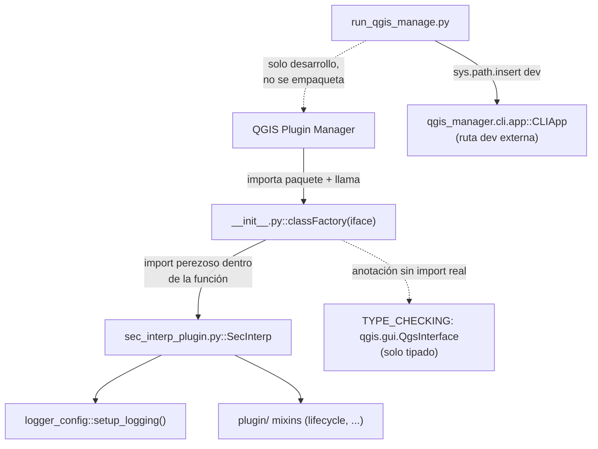

---
tags:
  - secinterp
  - code-walkthrough
  - root
  - package
aliases:
  - __init__.py
  - classFactory
  - run_qgis_manage.py
cssclass: secinterp-note
---

# Raíz del plugin — `__init__.py` + `run_qgis_manage.py`

> [!abstract] Resumen en una línea
> Paquete raíz (2 archivos): `__init__.py` expone el `classFactory(iface)` que QGIS exige con import perezoso de `SecInterp`, y `run_qgis_manage.py` es un bootstrap solo-desarrollo para la CLI `qgis-manage`.

**Ruta**: `/` (raíz: 49 + 11 líneas)
**Símbolo principal**: `classFactory`
**Capa**: Root / bootstrap (frontera de carga QGIS)
**Tags**: #secinterp #root #package

---

## 🎯 ¿Por qué existe este grupo?

QGIS descubre el plugin importando el paquete raíz y llamando a `classFactory`. Estos dos
ficheros cubren la carga en producción y el tooling en desarrollo:

| Problema | Solución |
|----------|----------|
| QGIS exige `classFactory(iface)` en el paquete raíz | `__init__.py` con import perezoso de `SecInterp` |
| Anotar tipos QGIS sin importar QGIS al cargar | `TYPE_CHECKING` + import de `QgsInterface` solo para tipado |
| Herramienta `qgis-manage` fuera del plugin | `run_qgis_manage.py` ajusta `sys.path` y lanza `CLIApp` |

> [!important] Nota arquitectónica
> La raíz es **solo puerta de entrada**: 49 líneas de cargador + 11 de script dev. Toda
> la lógica vive en [[sec_interp_plugin]] y [[plugin]]. La pereza del import (`from
> .sec_interp_plugin import SecInterp` dentro de la función) evita cargar Qt/GUI hasta
> que QGIS realmente instancia el plugin.

---

## 🧬 Diagrama de relaciones



> [!tip] Cómo leer
> Flecha sólida = llamada/import real; punteada = tipado o vía dev. `run_qgis_manage.py`
> no toca el plugin: es un lanzador externo.

---

## 📦 Imports — lectura arquitectónica

```python
# __init__.py
from __future__ import annotations

"""SecInterp QGIS Plugin.

This plugin provides tools for cross-section generation and geological interpretation
data extraction from QGIS layers.
"""

from typing import TYPE_CHECKING

if TYPE_CHECKING:
    from qgis.gui import QgsInterface
```

```python
# run_qgis_manage.py
"""Script to run qgis-manage CLI locally."""

import sys

sys.path.insert(0, "/home/jmbernales/qgispluginsdev/qgis-plugin-manager/src")

from qgis_manager.cli.app import CLIApp  # noqa: E402
```

| # | Observación |
|---|-------------|
| ① | `from __future__ import annotations` en `__init__.py`: las anotaciones no se evalúan en runtime, coherente con el `TYPE_CHECKING`. |
| ② | `if TYPE_CHECKING: from qgis.gui import QgsInterface` — QGIS solo existe para el type-checker; importar `qgis.gui` en runtime al cargar el plugin sería prematuro y pesado. |
| ③ | `run_qgis_manage.py` inserta una **ruta absoluta de desarrollo** en `sys.path`: marca inequívoca de script local, no de código distribuido. |
| ④ | `# noqa: E402` tras el import post-`sys.path.insert`: silencia el E402 (import no al inicio) de forma declarada. |
| ⑤ | Ninguno de los dos ficheros importa `sec_interp.*` en cabecera: la raíz no precarga nada. |

---

## 🏗️ Inventario de estructura

**`__init__.py` (49 líneas):**

- Docstring del plugin + cabecera GPL / Plugin Builder (líneas 1–29, histórico).
- `from typing import TYPE_CHECKING` + bloque de tipado (líneas 30–33).
- `def classFactory(iface: QgsInterface)` → `SecInterp` (líneas 36–49).

**`run_qgis_manage.py` (11 líneas):**

- Docstring + `import sys` + `sys.path.insert(0, ...)` + import de `CLIApp` + bloque `if __name__ == "__main__"`.

**Símbolos totales del grupo: 1 función pública (`classFactory`) + 0 clases.**

---

## 📁 Archivos del paquete

| Archivo | Líneas | Rol |
|---|--:|---|
| [[#__init__.py\|__init__.py]] | 49 | `classFactory(iface)`: puerta de entrada QGIS |
| [[#run_qgis_manage.py\|run_qgis_manage.py]] | 11 | Bootstrap dev de la CLI `qgis-manage` |

---

## 📖 Recorrido archivo por archivo

### `__init__.py`

Docstring y cabecera histórica (líneas 1–29):

```python
"""SecInterp QGIS Plugin.

This plugin provides tools for cross-section generation and geological interpretation
data extraction from QGIS layers.
"""

# /***************************************************************************
#  SecInterp
#                                  A QGIS plugin
#  Data extraction for geological interpretation
#  Generated by Plugin Builder: http://g-sherman.github.io/Qgis-Plugin-Builder/.
#                              -------------------
#         begin                : 2025-11-15
#         copyright            : (C) 2025 by Juan M Bernales
#         email                : juanbernales@gmail.com
#         git sha              : $Format:%H$
#  ***************************************************************************/
#
# /***************************************************************************
#  *                                                                         *
#  *   This program is free software; you can redistribute it and/or modify  *
#  *   it under the terms of the GNU General Public License as published by  *
#  *   the Free Software Foundation; either version 2 of the License, or     *
#  *   (at your option) any later version.                                   *
#  *                                                                         *
#  ***************************************************************************/
```

Plantilla Plugin Builder intacta: fecha de inicio, autor, licencia GPL. Es metadato
histórico, sin efecto en runtime, pero QGIS y los revisores lo esperan en la raíz.

Bloque de tipado (líneas 30–33):

```python
from typing import TYPE_CHECKING

if TYPE_CHECKING:
    from qgis.gui import QgsInterface
```

`QgsInterface` solo existe para el análisis estático: `classFactory` puede anotarse sin
pagar el coste (ni el riesgo) de importar `qgis.gui` cuando QGIS carga el plugin.

La factoría (líneas 36–49):

```python
# noinspection PyPep8Naming
def classFactory(iface: QgsInterface):  # pylint: disable=invalid-name
    """Load SecInterp class from file SecInterp.

    Args:
        iface: A QGIS interface instance.

    Returns:
        SecInterp: An instance of the plugin.

    """
    from .sec_interp_plugin import SecInterp

    return SecInterp(iface)
```

Tres decisiones en 6 líneas efectivas:

| Decisión | Detalle |
|----------|---------|
| Nombre no-PEP8 conservado | `classFactory` es el contrato QGIS; `# noinspection` + `pylint: disable=invalid-name` lo blindan del linter |
| Import **dentro** de la función | `SecInterp` (y con él Qt, GUI, core) solo se carga al instanciar, no al descubrir el plugin |
| Retorno directo | `SecInterp(iface)`: a partir de aquí manda [[sec_interp_plugin]] (`setup_logging` primero) |

> [!tip] Por qué el import perezoso importa
> QGIS importa todos los paquetes de plugins al arrancar para leer su factoría. Un
> import en cabecera de `sec_interp_plugin` arrastraría `qgis.PyQt`, extractores y
> diálogo en cada arranque, incluso con el plugin desactivado. Dentro de la función, el
> coste solo se paga al activar.

### `run_qgis_manage.py`

```python
"""Script to run qgis-manage CLI locally."""

import sys

sys.path.insert(0, "/home/jmbernales/qgispluginsdev/qgis-plugin-manager/src")

from qgis_manager.cli.app import CLIApp  # noqa: E402

if __name__ == "__main__":
    app = CLIApp()
    sys.exit(app.run())
```

Lanzador local de la herramienta externa `qgis-manage` (despliegue con soporte de
perfiles multi-versión, ver `metadata.txt` v3.6.0):

| Línea | Rol |
|-------|-----|
| `sys.path.insert(0, ".../qgis-plugin-manager/src")` | Pone el checkout local de la herramienta en cabeza del path |
| `from qgis_manager.cli.app import CLIApp` | Importa la app CLI (tras el path, de ahí el `noqa: E402`) |
| `app = CLIApp(); sys.exit(app.run())` | Ejecuta y propaga el código de salida |

> [!warning] Ruta absoluta de máquina de desarrollo
> El `sys.path` apunta a `/home/jmbernales/...`: solo funciona en la estación del autor.
> Es un script personal de conveniencia, no infraestructura portable; no debe importarse
> ni empaquetarse (ver `.qgisignore` y `make zip`).

---

## 🗂️ Qué vive en la raíz (y qué no)

| En la raíz | Por qué |
|------------|---------|
| `__init__.py` | Exigido por QGIS (`classFactory`) |
| `sec_interp_plugin.py` | Clase del plugin (ver [[sec_interp_plugin]]) |
| `logger_config.py` | Logging antes que todo (ver [[logger_config]]) |
| `run_qgis_manage.py` | Solo dev; excluido del ZIP |
| `metadata.txt` | Metadatos QGIS (nombre, versión 3.8.0, idiomas) |
| `icon.png` | Icono (disco + compilado en [[resources]]) |

| Fuera de la raíz | Dónde |
|------------------|-------|
| Ciclo de vida (`initGui`/`run`/`unload`) | `plugin/lifecycle.py` (ver [[lifecycle]]) |
| Lógica de negocio | `core/` QGIS-agnóstico (ver [[core]]) |
| Diálogo y adapters | `gui/` (ver [[main_dialog]]) |
| Versión/autor programáticos | `core/utils/metadata_reader.py` lee `metadata.txt` (ver [[metadata_reader]]) |

---

## 🏗️ `classFactory` en el ecosistema QGIS

QGIS trata `classFactory` como punto único de construcción. El flujo completo:

| Paso | Actor | Detalle |
|------|-------|---------|
| 1. Descubrimiento | Plugin Manager | Importa el paquete raíz de cada plugin instalado |
| 2. Resolución | `__init__.py` | Define `classFactory` sin cargar Qt (import perezoso) |
| 3. Activación | Usuario o `qgis-manage` | QGIS llama `classFactory(iface)` con la interfaz |
| 4. Construcción | `classFactory` | `from .sec_interp_plugin import SecInterp; return SecInterp(iface)` |
| 5. Integración | QGIS | Llama `initGui()` (ver [[lifecycle]]) para menú y toolbar |
| 6. Descarga | QGIS | Llama `unload()` al desactivar (ver [[lifecycle]]) |

> [!note] El nombre es innegociable
> QGIS busca literalmente `classFactory` en el namespace del paquete. Renombrarlo a
> `class_factory` (PEP8) rompería la carga: de ahí el `disable=invalid-name`.

---

## 📦 Empaquetado: qué entra en el ZIP

`make zip` / `.qgisignore` deciden qué viaja al repositorio de plugins. La raíz vista
desde el empaquetado:

| Archivo raíz | Al ZIP | Motivo |
|--------------|--------|--------|
| `__init__.py` | Sí | Puerta QGIS obligatoria |
| `sec_interp_plugin.py` | Sí | Clase del plugin |
| `logger_config.py` | Sí | Logging operativo |
| `metadata.txt` | Sí | Leído por el Plugin Manager |
| `icon.png` | Sí | Iconos del gestor y del menú |
| `run_qgis_manage.py` | No | Script dev con ruta absoluta local |
| `resources/symbology-style.db` | Según `.qgisignore` | Sidecar de estilos |
| `logs/` | No | Generado en runtime por `setup_logging` |

> [!warning] `logs/` nace en destino
> El `log_dir.mkdir(exist_ok=True)` de [[logger_config]] crea `logs/` junto al plugin
> **instalado**, no en el ZIP. En perfiles Windows sin permiso de escritura, el plugin
> degrada solo al panel QGIS sin romper el arranque.

---

## 🔄 Flujo de datos

| Fase | Entrada | Transformación | Salida |
|------|---------|----------------|--------|
| Descubrimiento | QGIS importa el paquete | `__init__` define `classFactory` (sin cargar Qt) | factoría disponible |
| Instanciación | `classFactory(iface)` | import perezoso + `SecInterp(iface)` | plugin construido |
| Arranque | `SecInterp.__init__` | `setup_logging()` → servicios → diálogo | plugin operativo |
| Desarrollo | `python run_qgis_manage.py` | `sys.path` + `CLIApp().run()` | despliegue a perfil QGIS |

---

## 🏛️ Patrones de diseño presentes

| Patrón | Dónde | Propósito |
|--------|-------|-----------|
| **Factory function** | `classFactory` | Contrato de creación exigido por QGIS |
| **Lazy import** | import dentro de `classFactory` | Arranque de QGIS sin coste del plugin |
| **TYPE_CHECKING guard** | `QgsInterface` | Tipado sin dependencia runtime |
| **Launcher script** | `run_qgis_manage.py` | Puente dev hacia herramienta externa |

---

## 🧾 Resumen de la API

| Símbolo | Firma / Hereda | Uso típico |
|---------|----------------|------------|
| `classFactory` | `(iface: QgsInterface) -> SecInterp` | Invocada por QGIS al activar el plugin |
| `run_qgis_manage` | script `__main__` | `python run_qgis_manage.py` en la estación dev |
| `CLIApp().run()` | `(externo: qgis_manager)` | Despliegue a perfiles QGIS |

---

## 🛡️ Manejo de errores

| Caso | Comportamiento |
|------|---------------|
| `SecInterp` falla al importar en `classFactory` | La excepción sube a QGIS: el Plugin Manager marca el plugin como roto (sin enmascarar) |
| `qgis.gui` no importable en runtime | Imposible por diseño: solo se importa bajo `TYPE_CHECKING` |
| `qgis-plugin-manager` ausente en dev | `ImportError` inmediato en el script (fallo visible, ámbito local) |
| `CLIApp().run()` devuelve código | `sys.exit(...)` lo propaga al shell |

> [!note] Sin `try/except` deliberado
> Ambos ficheros dejan que los errores suban: en `classFactory` porque QGIS debe ver el
> fallo real, y en el script porque el desarrollador lo ejecuta en terminal.

---

## 🧪 Tests asociados

- `tests/test_translation_loading.py` — importa `SecInterp` desde `sec_interp_plugin` (vía `from sec_interp_plugin import SecInterp`) e instancia la clase que `classFactory` retornaría, con `iface` mockeado: es la cobertura más cercana a la factoría.
- Sin test que invoque `classFactory` directamente ni que ejecute `run_qgis_manage.py` (script local con ruta absoluta: no testeable en CI por diseño).

> [!note] Lagunas honestas
> Un test puro de `classFactory` (mockear `sec_interp_plugin.SecInterp` y assertar que se
> construye con el `iface` dado) sería trivial y no necesita QGIS. El script dev queda
> fuera de cobertura intencionadamente.

---

## 👀 Observaciones y notas

> [!success] Fortalezas
> - Puerta mínima: QGIS descubre el plugin sin pagar su coste hasta activarlo.
> - Tipado sin dependencia runtime (`TYPE_CHECKING`).
> - Separación nítida: cargador en raíz, lógica en `plugin/` + `core/` + `gui/`.
> - Linter domesticado (`noinspection` + `disable=invalid-name`) en vez de renombrar el contrato.

> [!warning] Puntos de atención
> - `run_qgis_manage.py` con ruta absoluta: inútil fuera de la máquina del autor; documentar o parametrizar vía env.
> - La cabecera GPL/Plugin Builder es histórica: el `git sha : $Format:%H$` sin expandir indica que no pasa por `git archive`.
> - `classFactory` sin test directo aunque sea trivial de cubrir.

> [!question] Preguntas abiertas
> - ¿Parametrizar la ruta de `qgis-plugin-manager` con variable de entorno y fallback?
> - ¿Añadir `test_class_factory.py` mockeando `SecInterp`?
> - ¿Mover `run_qgis_manage.py` a `scripts/` para dejar la raíz solo con lo empaquetable?

---

## 🔗 Notas relacionadas

- [[Index]] — índice de la bóveda
- [[sec_interp_plugin]] — clase construida por `classFactory`
- [[plugin]] — paquete de mixins con el ciclo de vida real
- [[lifecycle]] — `initGui`/`run`/`unload` que QGIS invoca tras la factoría
- [[logger_config]] — primer paso tras instanciar (`setup_logging`)
- [[metadata_reader]] — acceso programático a `metadata.txt`
- [[controller]] — orquestador cableado por el plugin

---

*Nota de la bóveda SecInterp Code Walkthrough v2 — v3.9.1*
