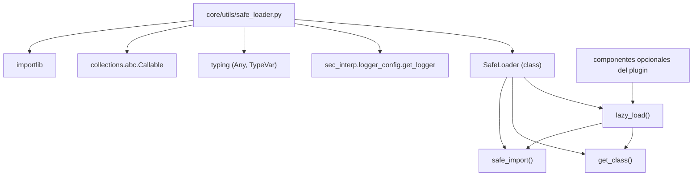

---
tags:
  - secinterp
  - code-walkthrough
  - core
  - utils
  - safe-loader
aliases:
  - safe_loader.py
  - SafeLoader
  - safe_import
  - lazy_load
cssclass: secinterp-note
---

# `core/utils/safe_loader.py`

> [!abstract] Resumen en una línea
> Carga módulos y clases de forma **perezosa y segura**, capturando errores de import/instanciación y devolviendo `None` (o un *fallback*) para que el plugin siga funcional aunque un componente opcional falle.

**Ruta**: `core/utils/safe_loader.py` (79 líneas)
**Clase/Función principal**: `SafeLoader`
**Capa**: Core · Utilities (QGIS-agnóstico)
**Tags**: #secinterp #core #utils #safe-loader

---

## 🎯 ¿Por qué existe este archivo?

Un plugin puede depender de componentes opcionales (drivers, servicios, librerías) que
no siempre están disponibles. Un `import` directo que falle **tumba todo el plugin**.
Se necesita una vía para degradar con gracia.

| Problema | Solución |
|----------|----------|
| Un módulo opcional ausente crashea el arranque | `safe_import` captura el error y devuelve `None` |
| Instanciar una clase puede fallar con argumentos arbitrarios | `lazy_load` aísla el `__init__` y aplica un `fallback_factory` |
| Componer import + getattr + instancia en cada llamador | `SafeLoader` centraliza las tres etapas como `staticmethod`s |

> [!important] Nota arquitectónica — QGIS-agnóstico y sin estado
> Solo importa `importlib`, `typing` y el logger del proyecto. Es un conjunto de
> `staticmethod`s **sin estado**: un patrón de *service locator* mínimo que permite la
> carga diferida de componentes (DI manual) sin acoplar QGIS.

---

## 🧬 Diagrama de relaciones



> [!tip] Cómo leer
> `lazy_load` compone `safe_import` y `get_class`, y añade la instanciación protegida.
> Los consumidores solo llaman a `lazy_load`; no manejan `importlib` directamente.

---

## 📦 Imports — lectura arquitectónica

```python
# core/utils/safe_loader.py
import importlib
from collections.abc import Callable
from typing import Any, TypeVar

from sec_interp.logger_config import get_logger

logger = get_logger(__name__)

T = TypeVar("T")
```

| # | Observación |
|---|-------------|
| ① | `importlib.import_module` es la API estándar de carga dinámica por nombre de módulo. |
| ② | `TypeVar("T")` tipa el retorno genérico de `lazy_load` (instancia del tipo cargado o `None`). |
| ③ | `Callable[[], T]` tipa el `fallback_factory` (factory sin argumentos). |
| ④ | `get_logger(__name__)` → logging centralizado del proyecto. |
| ⑤ | **Cero imports de QGIS/PyQt** ⇒ utilidad de infraestructura pura. |

---

## 🏗️ Inventario de estructura

**Clase (1):**

- `class SafeLoader` — tres `staticmethod`s de carga segura.

**Métodos estáticos (3):**

- `safe_import(module_name, error_message=None) -> Any`
- `get_class(module, class_name) -> type | None`
- `lazy_load(module_name, class_name, fallback_factory=None, *args, **kwargs) -> T | None`

**Módulo (1):**

- `logger` y `T = TypeVar("T")`.

---

## 📁 Archivos del paquete

`safe_loader.py` vive en `core/utils/`:

| Archivo | Líneas | Rol |
|---|--:|---|
| [[safe_loader]] | 79 | Importación y carga perezosa segura |
| [[io]] | 101 | Escritura de vectores |
| [[metadata_reader]] | 129 | Lectura de `metadata.txt` |
| [[parsing]] | 222 | Parsing de strike/dip, acimut y atributos |
| [[rendering]] | 129 | Bounds, transformada de coordenadas, intervalos |
| [[drillhole]] | 298 | Trayectoria y proyección de sondajes |

> [!note] `safe_loader` y `metadata_reader` comparten infraestructura de logging
> Ambos usan `from sec_interp.logger_config import get_logger`; el resto de utilidades
> puras no logea. Ver [[metadata_reader]].

---

## 📖 Recorrido método por método

### `safe_import`

```python
@staticmethod
def safe_import(module_name: str, error_message: str | None = None) -> Any:
    try:
        return importlib.import_module(module_name)
    except (ImportError, Exception):
        msg = error_message or f"Failed to load optional module: {module_name}"
        logger.exception(msg)
        return None
```

Importa un módulo por nombre, registrando el error en vez de crashear. El mensaje es
personalizable; por defecto indica "módulo opcional".

### `get_class`

```python
@staticmethod
def get_class(module: Any, class_name: str) -> type | None:
    if not module:
        return None
    return getattr(module, class_name, None)
```

Acceso seguro a un atributo de clase: `getattr` con default `None` evita `AttributeError`
y la guarda `if not module` evita operar sobre un módulo `None` (resultado de un
`safe_import` fallido).

### `lazy_load`

```python
@staticmethod
def lazy_load(
    module_name: str,
    class_name: str,
    fallback_factory: Callable[[], T] | None = None,
    *args: Any,
    **kwargs: Any,
) -> T | None:
    module = SafeLoader.safe_import(module_name)
    klass = SafeLoader.get_class(module, class_name)
    if klass:
        try:
            return klass(*args, **kwargs)
        except Exception:
            logger.exception(
                f"Failed to instantiate {class_name} from {module_name} "
                f"with args={args}, kwargs={kwargs}"
            )

    return fallback_factory() if fallback_factory else None
```

Orquesta las tres etapas: importar, obtener la clase e instanciar. Si **cualquier**
etapa falla, devuelve el resultado del `fallback_factory` (o `None`). Los argumentos
posicionales/keyword se reenvían al constructor de la clase.

> [!important] `fallback_factory` = inyección de un sustituto
> Permite degradar a una implementación por defecto (un "no-op", una clase alternativa)
> cuando el componente real no está disponible. Es una forma manual de *dependency
> injection* con fallback.

---

## 🔄 Flujo de datos

| Fase | Entrada | Transformación | Salida |
|------|---------|----------------|--------|
| Import | `module_name` | `importlib.import_module` | módulo o `None` |
| Resolución | `module`, `class_name` | `getattr(..., None)` | clase o `None` |
| Instanciación | `klass`, `*args`, `**kwargs` | `klass(*args, **kwargs)` | instancia o excepción |
| Fallback | `fallback_factory` | `fallback_factory()` | sustituto o `None` |

---

## 🏛️ Patrones de diseño presentes

| Patrón | Dónde | Propósito |
|--------|-------|-----------|
| **Null Object** | retorno `None` en los tres métodos | Representar "no disponible" sin excepción |
| **Factory fallback** | `fallback_factory` en `lazy_load` | Sustituir el componente real por uno por defecto |
| **Service locator (mínimo)** | `safe_import` por nombre de módulo | Resolver componentes en tiempo de ejecución |
| **Static methods** | toda la clase `SafeLoader` | Funciones utilitarias sin estado de instancia |
| **Guard clause** | `if not module: return None` | Fallar suave ante módulo ausente |

---

## 🧾 Resumen de la API

| Símbolo | Firma / Hereda | Uso típico |
|---------|----------------|------------|
| `SafeLoader.safe_import` | `(module_name, error_message=None) -> Any` | Importar módulo opcional sin crashear |
| `SafeLoader.get_class` | `(module, class_name) -> type \| None` | Obtener clase de un módulo de forma segura |
| `SafeLoader.lazy_load` | `(module_name, class_name, fallback_factory=None, *args, **kwargs) -> T \| None` | Cargar e instanciar con fallback |

---

## 🛡️ Manejo de errores

La filosofía es **nunca propagar**: todos los errores se registran y se devuelve `None`.

| Caso | Captura | Resultado |
|------|---------|-----------|
| Módulo inexistente | `except (ImportError, Exception)` | `None` + `logger.exception` |
| Clase ausente | `getattr(..., None)` | `None` (sin excepción) |
| `__init__` falla | `except Exception` | `None` (o `fallback_factory()`) |

```python
except (ImportError, Exception):
    msg = error_message or f"Failed to load optional module: {module_name}"
    logger.exception(msg)
    return None
```

> [!warning] `except (ImportError, Exception)` es redundante
> `ImportError` es subclase de `Exception`, así que capturar ambos es equivalente a
> capturar solo `Exception`. No es un bug, pero sí una redundancia que puede inducir a
> error de lectura.

> [!tip] `logger.exception` registra el traceback completo
> Aunque el flujo no crashea, el traceback queda en el log para diagnóstico. Es el
> equilibrio "degradar sin silenciar".

---

## 🧪 Tests asociados

`tests/core/utils/test_safe_loader_di.py` (Mock-first, sin QGIS):

- `test_lazy_load_with_args` — `lazy_load("...test_safe_loader_di", "TestComponent", arg1="hello", arg2=123)` verifica que los argumentos llegan al constructor.
- `test_lazy_load_failure_returns_none` — módulo/clase inexistentes ⇒ `None`.

> [!note] También cubre `DataCache` granular
> El mismo archivo incluye `TestDataCacheGranular` (invalidación por bucket), porque el
> test está orientado a DI y granularidad de caché, no solo a `SafeLoader`.

---

## 👀 Observaciones y notas

> [!success] Fortalezas
> - API mínima y clara (3 `staticmethod`s composables).
> - Degradación con gracia: el plugin no muere por un componente opcional.
> - `fallback_factory` habilita DI manual sin framework.

> [!warning] Puntos de atención
> - `except (ImportError, Exception)` es redundante.
> - El retorno `Any` en `safe_import` diluye el tipado (podría ser `ModuleType | None`).
> - Sin timeout ni retry: una importación lenta bloquea el hilo llamador.

> [!question] Preguntas abiertas
> - ¿Convertir `lazy_load` en un decorador `@lazy` reutilizable?
> - ¿Cachear los módulos ya importados para evitar `import_module` repetido?
> - ¿Tipar `safe_import` como `types.ModuleType | None`?

---

## 🔗 Notas relacionadas

- [[Index]] — índice de la bóveda
- [[core_utils]] — paquete `core/utils/` y sus utilidades puras
- [[metadata_reader]] — comparte el logger de `logger_config`
- [[controller]] — puede usar `lazy_load` para componentes opcionales
- [[io]] — la escritura de vectores que a veces depende de componentes cargados perezosamente

---

*Nota de la bóveda SecInterp Code Walkthrough v2 — v3.8.0*
