---
tags:
  - secinterp
  - code-walkthrough
  - plugin
  - lifecycle
aliases:
  - sec_interp_plugin.py
  - SecInterp
cssclass: secinterp-note
note_lines: 700
---

# `sec_interp_plugin.py`

> [!abstract] Resumen en una línea
> Clase `SecInterp`: punto de entrada del plugin QGIS que compone cuatro mixins (`TranslatableMixin`, ciclo de vida, validación y render), cablea servicios/extractores vía `SafeLoader` y carga la traducción según el locale del usuario.

**Ruta**: `sec_interp_plugin.py` (129 líneas)
**Clase principal**: `SecInterp`
**Capa**: Plugin / GUI (frontera QGIS: `iface`, `QTranslator`, toolbar)
**Tags**: #secinterp #plugin #lifecycle

---

## 🎯 ¿Por qué existe este archivo?

QGIS instancia el plugin a través de `classFactory(iface)` (ver [[root]]) y espera una
clase con `initGui`/`unload`. Este módulo concentra esa frontera en una sola clase
delgada que **orquesta sin computar**:

| Problema | Solución |
|----------|----------|
| QGIS exige `initGui`/`unload`/`run` en la clase del plugin | `SecInterp` + `PluginLifecycleMixin` (ver [[lifecycle]]) |
| Importar todo QGIS al arrancar ralentiza y puede romper la carga | `SafeLoader.lazy_load` / `safe_import` con degradación elegante |
| El diálogo necesita servicios ya construidos (`PreviewManager`) | `__init__` prepara extractores → `controller` → diálogo, en orden |
| La UI debe hablar el idioma del usuario | `_load_translator()` con `.qm` + fallback a locale corto |

> [!important] Nota arquitectónica
> `SecInterp` es **composición, no herencia de lógica**: hereda de cuatro mixins y delega
> el cómputo al `controller` (core) y a los managers del diálogo. Ella solo extrae
> (`iface`, settings, locale) y conecta. Patrón Extract-then-Compute en la frontera.

---

## 🧬 Diagrama de relaciones

```mermaid
graph TD
    ROOT["__init__.py::classFactory(iface)"]
    SIP["sec_interp_plugin.py::SecInterp<br/>(TranslatableMixin + 3 mixins)"]
    TM["TranslatableMixin<br/>(core/utils/i18n)"]
    LCM["PluginLifecycleMixin<br/>(plugin/lifecycle)"]
    IVM["InputValidationMixin<br/>(plugin/input_validator)"]
    RPM["RenderPipelineMixin<br/>(plugin/render_pipeline)"]

    ROOT --> SIP
    SIP --> TM
    SIP --> LCM
    SIP --> IVM
    SIP --> RPM

    SIP --> SL["SafeLoader<br/>(core/utils/safe_loader)"]
    SIP --> LOG["setup_logging / get_logger<br/>(logger_config)"]

    SL -.->|"lazy_load"| PR["gui/preview_renderer::PreviewRenderer"]
    SL -.->|"lazy_load"| DF["gui/adapters/feature_fetcher::DataFetcher"]
    SL -.->|"lazy_load"| SE["gui/adapters/structure_extractor::StructureExtractor"]
    SL -.->|"lazy_load"| GE["gui/adapters/geology_extractor::GeologyExtractor"]
    SL -.->|"lazy_load"| PE["gui/adapters/profile_extractor::ProfileExtractor"]
    SL -.->|"lazy_load"| DE["gui/adapters/drillhole_extractor::DrillholeExtractor"]
    SL -.->|"lazy_load"| CT["core/controller::ProfileController"]
    SL -.->|"lazy_load"| LN["gui/layer_notification_manager::LayerNotificationManager"]
    SL -.->|"safe_import + get_class"| ES["core/services/export_service::ExportService"]
    SL -.->|"safe_import + get_class"| DLG["gui/main_dialog::SecInterpDialog"]

    CT --> DC["controller.data_cache"]
    LN -.->|"data_cache=..."| DC
    DLG -.->|"dlg.plugin_instance = self"| SIP
```



> [!tip] Cómo leer
> Flecha sólida = herencia/import directo; punteada = carga perezosa o inyección.
> `SecInterp` nunca importa `gui.main_dialog` directamente: siempre vía `SafeLoader`.

---

## 📦 Imports — lectura arquitectónica

```python
# sec_interp_plugin.py
from __future__ import annotations

from pathlib import Path
from typing import Any

from qgis.PyQt.QtCore import (
    QCoreApplication,
    QSettings,
    QTranslator,
)

from sec_interp.core.utils.i18n import TranslatableMixin
from sec_interp.core.utils.safe_loader import SafeLoader
from sec_interp.logger_config import get_logger, setup_logging
from sec_interp.plugin import (
    InputValidationMixin,
    PluginLifecycleMixin,
    RenderPipelineMixin,
)
```

| # | Observación |
|---|-------------|
| ① | `qgis.PyQt.QtCore` (no `PyQt5` directo): import agnóstico exigido por la guía QGIS 4.x. |
| ② | Solo tres símbolos Qt (`QCoreApplication`, `QSettings`, `QTranslator`): únicamente para traducir la UI, no para lógica. |
| ③ | `TranslatableMixin` viene de `core/utils/i18n`: el `tr()` disponible sin acoplar a widgets. |
| ④ | `SafeLoader` es la única vía de acceso a GUI/core pesado: ni un import directo a `gui.*` o `core.controller` en cabecera. |
| ⑤ | `setup_logging` se ejecuta lo primero en `__init__`; `get_logger(__name__)` da el logger del módulo. |
| ⑥ | Los tres mixins de `sec_interp.plugin` aportan `initGui`/`run`/`unload`, validación y render sin engordar esta clase. |

---

## 🏗️ Inventario de estructura

**Clases (1):**

- `class SecInterp(TranslatableMixin, PluginLifecycleMixin, InputValidationMixin, RenderPipelineMixin)` — implementación del plugin QGIS.

**Métodos propios (3):**

- `__init__(self, iface: Any) -> None` — logging, locale, cableado de servicios y diálogo, menú/toolbar.
- `_load_translator(self) -> None` — instala el `.qm` que mejor casa con el locale.
- `save_profile_line(self) -> None` — delega en `dlg.export_manager.export_data()`.

**Métodos heredados (mixins, ver [[lifecycle]] y [[plugin]]):**

- `PluginLifecycleMixin`: `add_action(...)`, `initGui()`, `run()`, `process_data(inputs=None)`, `unload()`, `disconnect_signals()`, `_disconnect_actions()`, `_disconnect_dialog()`.
- `InputValidationMixin`: `_get_and_validate_inputs() -> PreviewParams | None`.
- `RenderPipelineMixin`: `draw_preview(topo_data, geol_data, struct_data, drillhole_data, ...)`.
- `TranslatableMixin`: `tr(...)` para strings traducibles.

**Atributos de instancia:**

- `iface`, `plugin_dir: Path`, `translator` (si hay `.qm`), `preview_renderer`, `controller`, `layer_notification_manager`, `export_service`, `dlg`, `first_start`, `actions: list`, `menu: str`, `toolbar`.

---

## 📁 Archivos del paquete

El módulo vive en la **raíz**, entre el cargador QGIS y el paquete de mixins:

| Archivo | Líneas | Rol |
|---|--:|---|
| `__init__.py` | 49 | `classFactory(iface)` → `SecInterp(iface)` |
| [[sec_interp_plugin]] | 129 | Clase `SecInterp` (esta nota) |
| [[plugin]] | 9 | Paquete `plugin/`: re-exporta los 3 mixins |
| [[lifecycle]] | 167 | `PluginLifecycleMixin`: `initGui`/`run`/`unload` |
| [[input_validator]] | — | `InputValidationMixin`: validación de entradas |
| [[render_pipeline]] | — | `RenderPipelineMixin`: dibujo del preview |
| [[logger_config]] | 220 | `setup_logging()` invocado al arrancar |

---

## 📖 Recorrido método por método

### `__init__` — cableado ordenado del plugin

```python
def __init__(self, iface: Any) -> None:
    setup_logging()

    self.iface = iface
    self.plugin_dir = Path(__file__).resolve().parent
    self._load_translator()

    # Prepare core services BEFORE the dialog (required by PreviewManager)
    self.preview_renderer = SafeLoader.lazy_load(
        "sec_interp.gui.preview_renderer", "PreviewRenderer"
    )
    data_fetcher = SafeLoader.lazy_load(
        "sec_interp.gui.adapters.feature_fetcher", "DataFetcher"
    )
    structure_extractor = SafeLoader.lazy_load(
        "sec_interp.gui.adapters.structure_extractor", "StructureExtractor"
    )
    geology_extractor = SafeLoader.lazy_load(
        "sec_interp.gui.adapters.geology_extractor", "GeologyExtractor"
    )
    profile_extractor = SafeLoader.lazy_load(
        "sec_interp.gui.adapters.profile_extractor", "ProfileExtractor"
    )
    drillhole_extractor = SafeLoader.lazy_load(
        "sec_interp.gui.adapters.drillhole_extractor",
        "DrillholeExtractor",
        data_fetcher=data_fetcher,
    )
    self.controller = SafeLoader.lazy_load(
        "sec_interp.core.controller",
        "ProfileController",
        data_fetcher=data_fetcher,
        structure_extractor=structure_extractor,
        geology_extractor=geology_extractor,
        profile_extractor=profile_extractor,
        drillhole_extractor=drillhole_extractor,
    )

    self.layer_notification_manager = SafeLoader.lazy_load(
        "sec_interp.gui.layer_notification_manager",
        "LayerNotificationManager",
        data_cache=self.controller.data_cache,
    )

    export_mod = SafeLoader.safe_import("sec_interp.core.services.export_service")
    export_klass = SafeLoader.get_class(export_mod, "ExportService")
    self.export_service = export_klass(self.controller) if export_klass else None

    dialog_mod = SafeLoader.safe_import("sec_interp.gui.main_dialog")
    dialog_klass = SafeLoader.get_class(dialog_mod, "SecInterpDialog")
    self.dlg = dialog_klass(self.iface, self) if dialog_klass else None

    if self.dlg:
        self.dlg.plugin_instance = self
    else:
        logger.error("Failed to initialize main dialog. Plugin functionality will be limited.")

    self.first_start = True

    self.actions = []
    self.menu = self.tr("&Sec Interp")
    self.toolbar = self.iface.addToolBar(self.tr("Sec Interp"))
    self.toolbar.setObjectName("SecInterp")
    self.toolbar.setVisible(True)
```

El orden es un **grafo de dependencias explícito**:

| Paso | Qué se construye | Depende de |
|------|------------------|------------|
| 1 | `setup_logging()` | nada (primero siempre) |
| 2 | `plugin_dir`, traductor | `__file__`, `QSettings` |
| 3 | `preview_renderer` | `SafeLoader` |
| 4 | `data_fetcher`, `structure/geology/profile_extractor` | `SafeLoader` |
| 5 | `drillhole_extractor` | `data_fetcher` (inyección) |
| 6 | `controller` (`ProfileController`) | los 5 extractores (DI) |
| 7 | `layer_notification_manager` | `controller.data_cache` |
| 8 | `export_service` | `controller` (o `None` si falla) |
| 9 | `dlg` (`SecInterpDialog`) | `iface` + `self` (o `None` si falla) |
| 10 | menú + toolbar | `iface`, `tr()` |

> [!note] Degradación elegante, no crash
> Si el diálogo o el exportador fallan al cargar, el plugin **sigue vivo** con `None` y
> un `logger.error`, en lugar de romper todo QGIS. `run()` (en [[lifecycle]]) muestra un
> `QMessageBox` crítico si `self.dlg` es `None`. Ver [[safe_loader]].

### `_load_translator` — locale con fallback

```python
def _load_translator(self) -> None:
    """Install the best matching translation file for the user locale."""
    user_locale = QSettings().value("locale/userLocale", "en")
    locale_path = self.plugin_dir / f"i18n/SecInterp_{user_locale}.qm"

    MIN_LOCALE_LENGTH = 2
    if not locale_path.exists() and user_locale and len(user_locale) > MIN_LOCALE_LENGTH:
        locale_short = user_locale[0:2]
        locale_path = self.plugin_dir / f"i18n/SecInterp_{locale_short}.qm"

    if locale_path.exists():
        self.translator = QTranslator()
        self.translator.load(str(locale_path))
        QCoreApplication.installTranslator(self.translator)
```

1. Lee `locale/userLocale` de `QSettings` (p. ej. `es`, `pt_BR`); defecto `"en"`.
2. Busca `i18n/SecInterp_<locale>.qm` junto al plugin.
3. Si no existe y el locale tiene más de 2 letras, reintenta con las 2 primeras (`pt_BR` → `pt`).
4. Solo si el fichero existe, crea `QTranslator`, lo carga y lo instala en la app.

> [!tip] Sin `.qm` no pasa nada
> Si no hay fichero (p. ej. `en`, sin traducción), no se instala traductor y la UI queda
> en el idioma base. `self.translator` solo existe cuando hubo coincidencia: el atributo
> es condicional por diseño.

### `save_profile_line` — delegación al diálogo

```python
def save_profile_line(self) -> None:
    """Save profile data by delegating to the dialog's export manager."""
    if hasattr(self, "dlg") and self.dlg:
        self.dlg.export_manager.export_data()
```

Puente fino hacia `dialog_export_manager` (ver [[dialog_export_manager]]): el plugin no
sabe exportar, solo reenvía. El guarda `hasattr + truthiness` cubre el caso degradado
(`dlg is None`).

---

## 🔄 Secuencia de arranque completa

| Fase | Actor | Acción |
|------|-------|--------|
| Carga QGIS | `__init__.py::classFactory` | `from .sec_interp_plugin import SecInterp; return SecInterp(iface)` |
| `__init__` | esta clase | logging → locale → extractores → controller → managers → diálogo → menú/toolbar |
| `initGui` | [[lifecycle]] | `add_action(icon.png, "Geological data extraction", self.run)` |
| `run` | [[lifecycle]] | primera vez: engancha `preview_renderer.canvas` y `dlg.accepted → process_data`; muestra el diálogo |
| `process_data` | [[lifecycle]] | `dlg.preview_manager.generate_preview()` → `(topo, geol, struct)` |
| `unload` | [[lifecycle]] | desconecta señales, limpia renderer, retira menú/toolbar |

---

## 🔀 Carga perezosa con `SafeLoader`

| Llamada | Módulo objetivo | Argumentos inyectados |
|---------|-----------------|----------------------|
| `lazy_load` | `gui.preview_renderer.PreviewRenderer` | — |
| `lazy_load` | `gui.adapters.feature_fetcher.DataFetcher` | — |
| `lazy_load` | `gui.adapters.structure_extractor.StructureExtractor` | — |
| `lazy_load` | `gui.adapters.geology_extractor.GeologyExtractor` | — |
| `lazy_load` | `gui.adapters.profile_extractor.ProfileExtractor` | — |
| `lazy_load` | `gui.adapters.drillhole_extractor.DrillholeExtractor` | `data_fetcher=...` |
| `lazy_load` | `core.controller.ProfileController` | 5 extractores (DI) |
| `lazy_load` | `gui.layer_notification_manager.LayerNotificationManager` | `data_cache=controller.data_cache` |
| `safe_import` + `get_class` | `core.services.export_service.ExportService` | `controller` al instanciar |
| `safe_import` + `get_class` | `gui.main_dialog.SecInterpDialog` | `(iface, self)` al instanciar |

> [!note] Dos sabores de carga
> `lazy_load(mod, cls, **kwargs)` importa **e instancia** de una vez (servicios con DI);
> `safe_import` + `get_class` separan importar de instanciar para decidir el `None` con
> un `if` explícito (exportador y diálogo). Ver [[safe_loader]].

---

## 🌐 Traducciones: cómo fluye el locale

| Elemento | Detalle |
|----------|---------|
| Fuente del locale | `QSettings().value("locale/userLocale", "en")` |
| Catálogo | `i18n/SecInterp_<locale>.qm` (14 idiomas según `metadata.txt`) |
| Fallback | locale largo → 2 letras (`pt_BR` → `pt`) → sin traductor (inglés base) |
| Instalación | `QCoreApplication.installTranslator(self.translator)` |
| Strings traducidos aquí | `self.tr("&Sec Interp")`, `self.tr("Sec Interp")` (vía `TranslatableMixin`) |
| Test | `tests/test_translation_loading.py::test_translation_loads_es` (mockea `QSettings`, `QTranslator`, `installTranslator`) |

---

## 🔄 Flujo de datos

| Fase | Entrada | Transformación | Salida |
|------|---------|----------------|--------|
| Construcción | `iface` (QGIS) | `setup_logging` + cableado DI | `SecInterp` con servicios listos |
| Traducción | `locale/userLocale` | `.qm` + fallback corto | traductor instalado (o nada) |
| GUI | `initGui()` | `add_action(icon.png → run)` | entrada de menú + icono toolbar |
| Ejecución | `run()` | diálogo modal + `accepted → process_data` | `(topo, geol, struct)` o `None` |
| Guardado | `save_profile_line()` | delegación | `export_manager.export_data()` |
| Descarga | `unload()` | desconexión + retirada | QGIS limpio, sin acciones huérfanas |

---

## 🏛️ Patrones de diseño presentes

| Patrón | Dónde | Propósito |
|--------|-------|-----------|
| **Mixin composition** | 4 clases base | Separar ciclo de vida, validación, render y `tr()` |
| **Dependency Injection** | extractores → `controller` | `ProfileController` recibe collaborators, no los crea |
| **Lazy loading** | `SafeLoader` | Arranque rápido y tolerante a fallos |
| **Null-object-ish** | `export_service`/`dlg` a `None` | Degradación sin exceptions |
| **Template (hook)** | `run`/`process_data` en mixin | El diálogo engancha `accepted` una sola vez (`first_start`) |

---

## 🧾 Resumen de la API

| Símbolo | Firma / Hereda | Uso típico |
|---------|----------------|------------|
| `SecInterp` | `(TranslatableMixin, PluginLifecycleMixin, InputValidationMixin, RenderPipelineMixin)` | Instanciada por `classFactory` |
| `__init__` | `(iface: Any) -> None` | Cableado completo del plugin |
| `_load_translator` | `() -> None` | Instala el mejor `.qm` disponible |
| `save_profile_line` | `() -> None` | Delega en `export_manager.export_data()` |
| `initGui` / `run` / `unload` | heredados de `PluginLifecycleMixin` | Ciclo de vida QGIS |
| `process_data` | `(inputs=None) -> tuple \| None` | `(topo, geol, struct)` vía preview manager |

---

## 🛡️ Manejo de errores

| Caso | Comportamiento |
|------|---------------|
| Falla el import del diálogo | `dlg = None` + `logger.error`; `run()` muestra `QMessageBox` crítico |
| Falla el exportador | `export_service = None`; el resto del plugin funciona |
| Sin `.qm` para el locale | Sin traductor; UI en idioma base, sin error |
| `unload` con fallos parciales | `contextlib.suppress(Exception)` por tramo (ver [[lifecycle]]) |
| Logging no inicializado | Imposible: `setup_logging()` es la primera línea de `__init__` |

---

## 🧪 Tests asociados

- `tests/test_translation_loading.py::TestTranslationLoading::test_translation_loads_es` — instancia `SecInterp` con `iface` mockeado y `SecInterpDialog`/`PreviewRenderer`/`ProfileController`/`ExportService` parcheados; verifica que con locale `"es"` se carga el traductor (`QTranslator` + `installTranslator` mockeados, `Path.exists` parcheado).
- Suites de `tests/gui/test_main_dialog_*.py` — ejercitan el `dlg` que esta clase construye (núcleo, señales, settings, validación, tools).
- `tests/core/test_controller_orchestration.py`, `tests/core/test_controller_di.py` — cubren el `ProfileController` inyectado aquí con sus extractores.

> [!note] Estrategia Mock-first
> El test de traducción nunca toca QGIS real: `iface` es `MagicMock` y las clases pesadas
> se parchean, de modo que el `__init__` completo corre en CI sin QGIS instalado.

---

## 👀 Observaciones y notas

> [!success] Fortalezas
> - Clase delgada: 129 líneas que solo componen; la lógica vive en mixins, controller y managers.
> - Arranque tolerante a fallos: ningún import roto tumba QGIS.
> - Orden de construcción correcto: servicios antes que el diálogo que los consume.
> - Traducción con fallback y test dedicado (`test_translation_loads_es`).

> [!warning] Puntos de atención
> - `self.translator` es condicional: acceder sin comprobar puede dar `AttributeError` (hoy nadie lo hace fuera de aquí).
> - `MIN_LOCALE_LENGTH = 2` es una constante local en mayúsculas dentro del método; no es configurable.
> - `save_profile_line` asume `export_manager` en el diálogo sin comprobarlo (solo comprueba `dlg`).
> - El `toolbar` se crea en `__init__`, no en `initGui`: inusual frente al patrón Plugin Builder clásico.

> [!question] Preguntas abiertas
> - ¿Mover la creación del toolbar a `initGui` para seguir el ciclo de vida estándar?
> - ¿Guardar `self.translator = None` por defecto para hacer explícito el caso sin `.qm`?
> - ¿Comprobar `export_manager` en `save_profile_line` para el modo degradado?

---

## 🔗 Notas relacionadas

- [[Index]] — índice de la bóveda
- [[root]] — `classFactory` que instancia esta clase
- [[lifecycle]] — `initGui`/`run`/`unload` heredados de `PluginLifecycleMixin`
- [[plugin]] — paquete que agrupa los tres mixins
- [[main_dialog]] — `SecInterpDialog` construido aquí vía `SafeLoader`
- [[controller]] — `ProfileController` inyectado con los cinco extractores
- [[metadata_reader]] — lee `metadata.txt` (nombre, versión) mostrado en la UI

---

*Nota de la bóveda SecInterp Code Walkthrough v2 — v3.8.0*
