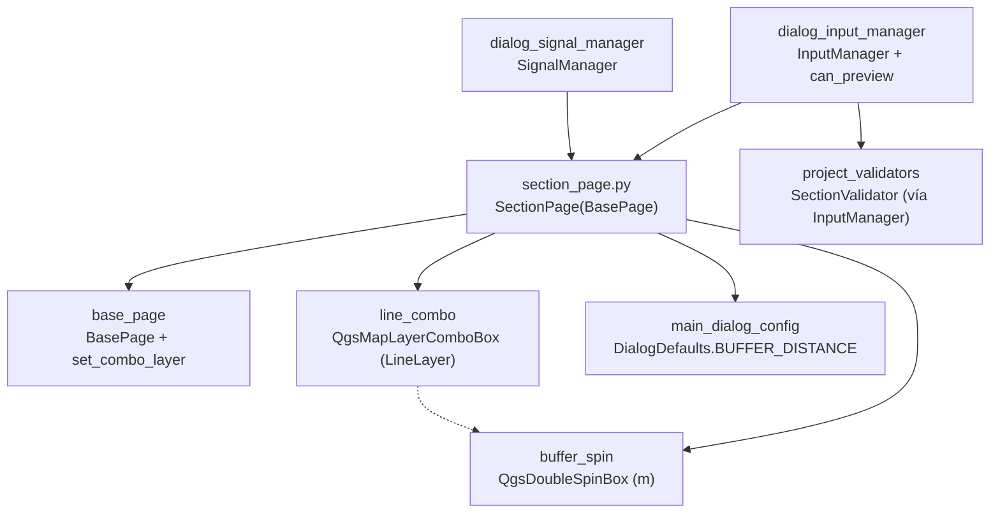

---
tags:
  - secinterp
  - code-walkthrough
  - gui
  - pages
aliases:
  - section_page.py
  - SectionPage
cssclass: secinterp-note
---

# `gui/ui/pages/section_page.py`

> [!abstract] Resumen en una línea
> Página de la línea de sección: combo de capa lineal con filtro moderno/clásico, testigo de estado y distancia de buffer para incluir estructuras vecinas, con `validate` obligatorio y `is_complete` directo.

**Ruta**: `gui/ui/pages/section_page.py` (117 líneas)
**Clase principal**: `SectionPage(BasePage)`
**Capa**: GUI (presentación programática · Extract mínimo)
**Tags**: #secinterp #gui #pages

---

## 🎯 ¿Por qué existe este archivo?

La línea de sección define el corte: de su geometría salen los puntos de muestreo,
el azimut y la proyección de estructuras y sondajes. Sin línea no hay perfil
posible, así que esta página es —junto con [[dem_page]]— una de las dos puertas
obligatorias del preview.

| Problema | Solución |
|----------|----------|
| El usuario debe elegir qué línea del proyecto define el corte | `line_combo` filtrado a capas lineales, con capa vacía permitida |
| Estructuras cercanas pero no intersecadas deben poder entrar en la sección | `buffer_spin` (0–10000 m, defecto 100) para el área de inclusión |
| El diálogo debe impedir previsualizar sin línea | `validate()` exige capa + `is_complete()` directo |

> [!important] Nota arquitectónica
> Extract mínimo con una rareza: `is_complete()` comprueba
> `bool(currentLayer())` **sin** pasar por `ProjectValidator` (la única página que
> no lo usa). La validación de negocio de la línea vive en `SectionValidator` vía
> [[dialog_input_manager]].

---

## 🧬 Diagrama de relaciones



> [!tip] Cómo leer
> Flecha sólida = importa/delega; punteada = el buffer solo tiene sentido con una línea elegida.

---

## 📦 Imports — lectura arquitectónica

```python
# gui/ui/pages/section_page.py
from __future__ import annotations

import contextlib
from typing import Any

from qgis.core import QgsMapLayerProxyModel
from qgis.gui import QgsDoubleSpinBox, QgsMapLayerComboBox
from qgis.PyQt.QtCore import QCoreApplication
from qgis.PyQt.QtWidgets import QGridLayout, QLabel

from sec_interp.gui.main_dialog_config import DialogDefaults

from .base_page import BasePage, set_combo_layer
```

| # | Observación |
|---|-------------|
| ① | `QgsMapLayerProxyModel` como fallback del filtro lineal (mismo idioma que [[geology_page]] y [[structure_page]]). |
| ② | `QgsDoubleSpinBox` con sufijo `" m"`: el buffer se expresa siempre en metros del proyecto. |
| ③ | Sin `ProjectValidator`, sin `ValidationParams`, sin `resolve_layer_metadata`: la única página sin imports del core de validación. |
| ④ | `DialogDefaults.BUFFER_DISTANCE` (100) como defecto del buffer: la página no hardcodea el 100 de `reset`… salvo en `_setup_ui` (ver observaciones). |
| ⑤ | `contextlib` solo para `disconnect_signals`: no hay `connect_signals` que revertir (hereda el `pass` de la base). |

---

## 🏗️ Inventario de estructura

**Clase `SectionPage(BasePage)`** — `layer_keys = frozenset({"section_layer"})`:

- `__init__(self, parent: Any = None) -> None`
- `_setup_ui(self) -> None` — rejilla de 2 filas (línea + buffer)
- `get_data(self) -> dict[str, Any]` — `crossline_layer / buffer_distance`
- `dump(self) -> dict[str, Any]` — `section_layer / buffer_dist`
- `load(self, data: dict[str, Any]) -> None`
- `reset(self) -> None`
- `validate(self) -> tuple[bool, str]` — línea obligatoria
- `is_complete(self) -> bool` — `bool(currentLayer())` directo
- `disconnect_signals(self) -> None` (sin `connect_signals` propio)

**Widgets:**

| Widget | Tipo | Rol |
|--------|------|-----|
| `line_combo` | `QgsMapLayerComboBox` | Línea de sección (filtro `LineLayer`, permite vacía) |
| `lbl_section_status` | `QLabel` 16×16 | Testigo de estado (gestionado desde fuera) |
| `buffer_spin` | `QgsDoubleSpinBox` 0–10000, sufijo `" m"` | Distancia de inclusión de estructuras |
| `group_layout` | `QGridLayout` (espaciado 6) | Rejilla de 2 filas |

---

## 📖 Recorrido método por método

### `__init__` — título de línea de corte

```python
def __init__(self, parent: Any = None) -> None:
    super().__init__(QCoreApplication.translate("SectionPage", "Cross Section Line"), parent)
```

Sin `iface` ni estado: el buffer y la línea viven en los widgets de `_setup_ui`.

### `_setup_ui` — filtro lineal y buffer con sufijo

```python
def _setup_ui(self) -> None:
    super()._setup_ui()

    self.group_layout = QGridLayout(self.group_box)
    self.group_layout.setSpacing(6)

    # Row 0: Section Line Layer
    self.group_layout.addWidget(QLabel(self.tr("Section Line *")), 0, 0)

    self.line_combo = QgsMapLayerComboBox()

    # Use modern flags if available (QGIS 3.32+)
    try:
        from qgis.core import Qgis  # noqa: PLC0415

        self.line_combo.setFilters(Qgis.LayerFilters(Qgis.LayerFilter.LineLayer))
    except (ImportError, AttributeError, TypeError):
        self.line_combo.setFilters(QgsMapLayerProxyModel.Filter.LineLayer)

    self.line_combo.setAllowEmptyLayer(True)
    # ... tooltip, índice 0, testigo lbl_section_status 16x16 ...

    # Row 1: Buffer Distance
    self.group_layout.addWidget(QLabel(self.tr("Buffer Dist. (m)")), 1, 0)

    self.buffer_spin = QgsDoubleSpinBox()
    self.buffer_spin.setRange(0.0, 10000.0)
    self.buffer_spin.setValue(100.0)  # Default
    self.buffer_spin.setSuffix(self.tr(" m"))
    # ... tooltip "Distance to include structures around the section line" ...
```

El asterisco en `"Section Line *"` marca el campo obligatorio (misma convención
que `"Raster Layer *"` en [[dem_page]]). El buffer nace en `100.0` hardcodeado
con comentario `# Default`, mientras `reset()` usa `DialogDefaults.BUFFER_DISTANCE`
(que también vale 100): duplicación a unificar (ver observaciones). El sufijo
traducible `" m"` acompaña al valor en el propio spin.

### `get_data` — dos claves

```python
def get_data(self) -> dict[str, Any]:
    return {
        "crossline_layer": self.line_combo.currentLayer(),
        "buffer_distance": self.buffer_spin.value(),
    }
```

El `get_data` más pequeño junto al de [[geology_page]]. `InputManager` lo mapea a
`line_layer` (desacoplado a `LayerMetadata`) y `buffer_dist` del `ValidationParams`.

### `dump` / `load` — renombrado `crossline_`/`buffer_distance` → `section_`/`buffer_dist`

```python
def dump(self) -> dict[str, Any]:
    return {
        "section_layer": self.line_combo.currentLayer(),
        "buffer_dist": self.buffer_spin.value(),
    }

def load(self, data: dict[str, Any]) -> None:
    if "section_layer" in data and data["section_layer"] is not None:
        set_combo_layer(self.line_combo, data["section_layer"])
    buffer_dist = data.get("buffer_dist")
    if buffer_dist is not None:
        self.buffer_spin.setValue(float(buffer_dist))
```

`load` usa doble guarda (`in` + `is not None`) para la capa — el estilo más
defensivo de las páginas— y `.get()` simple para el buffer. No propaga a ningún
combo de campos (no hay): restaurar es solo fijar dos widgets.

### `reset` — vaciar línea y buffer a defecto

```python
def reset(self) -> None:
    self.line_combo.setLayer(None)
    self.buffer_spin.setValue(float(DialogDefaults.BUFFER_DISTANCE))
```

Vacía la línea y restaura el buffer al defecto centralizado. Aquí sí se usa
`DialogDefaults` (a diferencia del `100.0` de `_setup_ui`).

### `validate` / `is_complete` — puerta doble, una sin core

```python
def validate(self) -> tuple[bool, str]:
    if not self.line_combo.currentLayer():
        return False, self.tr("Section line layer is required")
    return True, ""

def is_complete(self) -> bool:
    """Check if required fields are filled."""
    return bool(self.line_combo.currentLayer())
```

`validate` (Nivel 1, mensaje i18n) alimenta `InputManager.rules["section"]`, y
`can_preview()` exige `dem + section`: sin línea no hay preview ni export.
`is_complete` es un `bool()` directo sin `ProjectValidator`: suficiente porque la
línea no tiene campos asociados que coherenciar (contrástese con geología o
estructura, donde capa y campo deben casar).

### `disconnect_signals` — sin `connect` que revertir

```python
def disconnect_signals(self) -> None:
    """Disconnect all signals to prevent memory leaks."""
    with contextlib.suppress(TypeError, RuntimeError):
        self.line_combo.layerChanged.disconnect()
```

La única página sin `connect_signals` propio: no conecta nada internamente (ni
siquiera `layerChanged → dataChanged`, porque no declara `dataChanged`). La
desconexión sin argumentos corta cualquier conexión externa que el `SignalManager`
haya hecho sobre `layerChanged`. Hereda el `connect_signals` vacío de la base.

---

## 🗂️ Claves de lectura frente a claves de sesión

| Origen | Línea | Buffer |
|--------|-------|--------|
| `get_data` | `crossline_layer` (viva) | `buffer_distance` |
| `dump` / `load` | `section_layer` | `buffer_dist` |
| `layer_keys` | `{"section_layer"}` | — (primitivo) |
| `InputManager` | `line_layer` (`LayerMetadata`) | `buffer_dist` |

El buffer viaja con nombres distintos en lectura (`buffer_distance`) y sesión
(`buffer_dist`): el mapeo vive en `InputManager.get_all_values()` y en
`get_validation_params()`, no en la página.

---

## 🧩 Ciclo de vida en el diálogo

| Momento | Quién | Qué hace con la página |
|---------|-------|------------------------|
| Construcción | [[main_window]] / diálogo | `SectionPage()` en el `QStackedWidget`, entrada "Section Line" en [[sidebar]] |
| Cableado | `SignalManager` | suscribe `line_combo.layerChanged` desde fuera (la página no auto-conecta) |
| Edición | usuario | cambio de línea o buffer → el diálogo revalida preview/export |
| Preview | `InputManager.can_preview` | exige `section` (línea) además de `dem` |
| Validación total | `validate_inputs` | `line_layer/buffer_dist` al `SectionValidator` del core |
| Sesión | persistencia | `dump()` guarda `section_layer/buffer_dist`; `load()` con doble guarda |
| Cierre | `SignalManager` | `disconnect_signals()` corta `layerChanged` |

---

## 🔄 Flujo de datos

| Fase | Entrada | Transformación | Salida |
|------|---------|----------------|--------|
| Selección | proyecto QGIS | filtro lineal + vacía permitida | `line_combo.currentLayer()` |
| Buffer | usuario | spin 0–10000 m | `buffer_spin.value()` |
| Lectura | widgets | `get_data()` | `crossline_layer/buffer_distance` |
| Puerta | capa viva | `validate` + `bool()` | preview/export permitidos o no |
| Negocio | `line_layer` desacoplada | `SectionValidator` vía `InputManager` | errores de geometría/tipo |
| Persistencia | widgets | `dump()` | `section_layer/buffer_dist` |
| Restauración | dict + capa resuelta | `set_combo_layer` + `setValue` | widgets restaurados |

---

## 🏛️ Patrones de diseño presentes

| Patrón | Dónde | Propósito |
|--------|-------|-----------|
| **Gate / puerta** | `validate` + `can_preview` | Sin línea no hay preview ni export |
| **Compat / fallback** | filtro moderno → clásico | QGIS < 3.32 sin bifurcar |
| **Defensive load** | doble guarda `in` + `is not None` | Sesiones parciales no rompen |
| **Unidad explícita** | sufijo `" m"` + etiqueta `"(m)"` | El buffer siempre en metros |

---

## 🧾 Resumen de la API

| Símbolo | Firma / Hereda | Uso típico |
|---------|----------------|------------|
| `SectionPage` | `(BasePage)` | pestaña "Section Line" del `QStackedWidget` |
| Sin `dataChanged` | — | el diálogo suscribe `line_combo` desde fuera |
| `layer_keys` | `frozenset({"section_layer"})` | namespace de persistencia |
| `get_data` | `crossline_layer/buffer_distance` | lectura para `InputManager` |
| `dump` | `section_layer/buffer_dist` | sesión |
| `validate/is_complete` | línea obligatoria / `bool()` | puerta de preview |

---

## 🛡️ Manejo de errores

- Sin línea: `validate` → `(False, "Section line layer is required")`; `can_preview()` y `can_export()` son `False`; el buffer queda irrelevante.
- `load` sin `section_layer` (ni clave ni valor): no toca el combo; sin `buffer_dist`: conserva el actual.
- `buffer_spin` acotado 0–10000: sin buffers negativos ni absurdos.
- `disconnect()` sin argumentos bajo `suppress`: corta conexiones externas sin conocerlas.

---

## 🧪 Tests asociados

No existe un `tests/gui/test_section_page.py` dedicado; la cobertura es indirecta:

- `tests/gui/test_dialog_input_manager.py` — `get_validation_params()` incluye `line_layer/buffer_dist`; regla `section` y `can_preview()` (`dem + section`).
- `tests/gui/test_main_dialog_validation_manager.py` — mensaje `"Cross-section line layer is required"`.
- `tests/gui/test_main_dialog_core.py` — construcción del diálogo con la página de sección.
- `tests/gui/test_multi_session_persistence.py` — round-trip con `section_layer/buffer_dist`.
- `tests/gui/test_signal_restoration.py` — conexiones externas sobre `line_combo` sobreviven a reconexiones.

| Aspecto a testear | Estado |
|-------------------|--------|
| `get_data/dump/load/reset` | sin test dedicado; cubierto vía diálogo |
| `validate` sin línea | cubierto vía regla `section` del input manager |
| `is_complete` directo (sin core) | sin test que fije el `bool()` como contrato |
| Fallback de filtro clásico | sin test (igual que [[geology_page]]) |
| Sufijo `" m"` traducible | sin test; formato visual de bajo riesgo |

---

## 🌐 i18n y notas de migración

- Etiquetas con `self.tr("Section Line *"/"Buffer Dist. (m)")`, sufijo `self.tr(" m")` y tooltips; título con contexto `"SectionPage"`.
- El `*` de obligatoriedad viaja dentro del `tr`: los traductores deciden su convención local.
- Mismo filtro moderno/clásico que geología y estructura: trío consistente ante QGIS 4.x.

---

## 👀 Observaciones y notas

> [!success] Fortalezas
> - La puerta más clara del diálogo: dos métodos de 2 líneas (`validate`, `is_complete`) deciden preview y export.
> - `load` con doble guarda: el más defensivo de las páginas simples.
> - Sin `dataChanged` propio y sin auto-conexiones: la página más predecible; todo el cableado es externo y visible.

> [!warning] Puntos de atención
> - `100.0` hardcodeado en `_setup_ui` frente a `DialogDefaults.BUFFER_DISTANCE` en `reset`: si cambia el defecto, la construcción y el reset divergen.
> - `is_complete` sin `ProjectValidator`: coherente hoy (sin campos que casar), pero divergencia de patrón si la línea gana opciones.
> - Sin `connect_signals`: `SignalManager` debe recordar cablear `line_combo` desde fuera o los cambios de línea no refrescan nada.
> - Sin test dedicado: el renombrado `crossline_layer/section_layer/buffer_dist` solo lo fijan tests de diálogo.

> [!question] Preguntas abiertas
> - ¿Unificar el `100.0` de `_setup_ui` a `float(DialogDefaults.BUFFER_DISTANCE)`?
> - ¿Enrutar `is_complete` por `ProjectValidator` (p. ej. `is_section_complete`) para uniformidad, aunque hoy sea un `bool()`?
> - ¿Añadir `tests/gui/test_section_page.py` espejo de `test_dem_page.py`?
> - ¿Declarar `dataChanged` y auto-conectar como las demás páginas, o documentar que el cableado externo es intencional?

---

## 🔗 Notas relacionadas

- [[Index]] — índice de la bóveda
- [[base_page]] — protocolo y `set_combo_layer`
- [[gui_ui_pages]] — paquete de páginas
- [[main_window]] — pestaña "Section Line" del `QStackedWidget`
- [[sidebar]] — entrada "Section Line" (`mIconLineLayer.svg`)
- [[dialog_input_manager]] — reglas `section`, `can_preview`, `can_export`
- [[project_validator]] — `validate_all` incluye al `SectionValidator`
- [[project_validators]] — `SectionValidator` (geometría y tipo de la línea)
- [[dem_page]] — la otra puerta obligatoria del preview
- [[structure_page]] — consume `buffer_dist` al proyectar estructuras vecinas
- [[geology_page]] — página hermana con el mismo filtro moderno/clásico

---

*Nota de la bóveda SecInterp Code Walkthrough v2 — v3.8.0*
