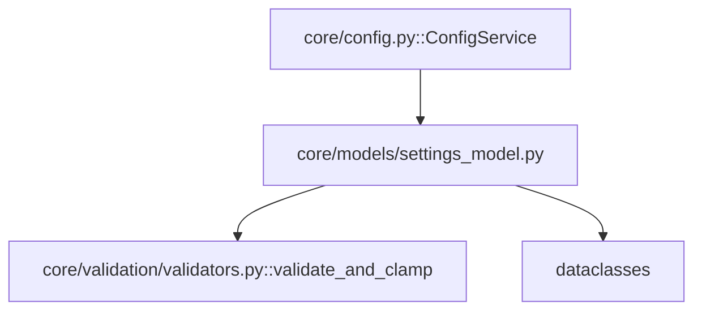

---
tags:
  - secinterp
  - code-walkthrough
  - core
  - models
aliases:
  - settings_model.py
  - PluginSettings
  - SectionSettings
  - DemSettings
  - ExportSettings
cssclass: secinterp-note
---

# `core/models/settings_model.py`

> [!abstract] Resumen en una línea
> Define los **dataclasses de configuración validados** del plugin: 8 sub-modelos por página (`Section`, `Dem`, `Geology`, `Structure`, `Drillhole`, `Interpretation`, `Preview`, `Export`) agrupados en el contenedor raíz `PluginSettings`, con validación por `validate_and_clamp` en `__post_init__`.

**Ruta**: `core/models/settings_model.py` (179 líneas)
**Clase/Función principal**: `PluginSettings` (y 8 sub-modelos)
**Capa**: Core (QGIS-agnóstico)
**Tags**: #secinterp #core #models

---

## 🎯 ¿Por qué existe este archivo?

La configuración llega como un dict crudo desde `QgsSettings` (vía `ConfigService`). Sin
un modelo tipado, cualquier error de tipo o valor fuera de rango se propagaría hasta la
GUI. Los dataclasses resuelven esto con validación en el punto de construcción:

| Problema | Solución |
|----------|----------|
| Dicts crudos sin tipos ni límites | Dataclasses tipados por dominio |
| Valores fuera de rango (buffer negativo, escala < 1) | `validate_and_clamp` en `__post_init__` |
| Configuración dispersa en claves planas | `PluginSettings` como contenedor raíz anidado |
| Convertir desde/para persistencia | `from_dict()` / `to_dict()` |
| Colecciones mutables compartidas | `field(default_factory=...)` |

> [!important] Nota arquitectónica — validación por *clamping*, no por excepción
> A diferencia de otros validadores del proyecto, `settings_model.py` usa
> `validate_and_clamp` (de `core/validation/validators.py`), que **recorta** el valor al
> rango en vez de lanzar `ValidationError`. Es una política deliberada: una configuración
> nunca debe romper el arranque del plugin; se normaliza en silencio.

---

## 🧬 Diagrama de relaciones



> [!tip] Cómo leer
> Sólida = importa/depende. `settings_model.py` solo depende de `dataclasses` y de
> `validate_and_clamp`. `ConfigService` lo importa para construir `PluginSettings`
> desde `QgsSettings`. Es el **modelo de salida** del "Extract" de configuración.

---

## 📦 Imports — lectura arquitectónica

```python
# core/models/settings_model.py
from __future__ import annotations

from dataclasses import dataclass, field
from typing import Any

from sec_interp.core.validation.validators import (
    validate_and_clamp,
)
```

| # | Observación |
|---|-------------|
| ① | `dataclass` + `field` — los 9 modelos son dataclasses (mutables, no `frozen`). |
| ② | `validate_and_clamp` — único validador importado; recorta al rango sin lanzar. |
| ③ | **Sin QGIS**: importa solo stdlib + un validador propio del core. 100% agnóstico. |

---

## 🏗️ Inventario de estructura

**Clases (9 dataclasses):**

| Clase | Campos | `__post_init__` |
|-------|-------:|:---:|
| `SectionSettings` | 3 | ✅ |
| `DemSettings` | 6 | ✅ |
| `GeologySettings` | 3 | — |
| `StructureSettings` | 5 | ✅ |
| `DrillholeSettings` | 24 | — |
| `InterpretationSettings` | 3 | — |
| `PreviewSettings` | 9 | ✅ |
| `ExportSettings` | 3 | — |
| `PluginSettings` | 9 | — |

**Métodos de `PluginSettings`:**
- `from_dict(data)` — `@classmethod`, construcción validada desde dict anidado.
- `to_dict()` — serialización vía `dataclasses.asdict`.

---

## 📁 Archivos del paquete

- `settings_model.py` — nota individual de este archivo (el resto del paquete `core/models/` está en [[core_models]]).

---

## 📖 Recorrido clase por clase

### `SectionSettings` — página de sección

```python
@dataclass
class SectionSettings:
    layer_id: str = ""
    layer_name: str = ""
    buffer_dist: float = 100.0

    def __post_init__(self) -> None:
        self.buffer_dist = validate_and_clamp(0.0, float("inf"))(self.buffer_dist)
```

El `buffer_dist` se recorta a `>= 0` (un buffer negativo no tiene sentido). Un valor como
`-10.0` se normaliza a `0.0`; un string `"123.4"` se coacciona a `float` (dentro de
`validate_and_clamp`, que hace `float(value)`).

### `DemSettings` — página DEM

```python
@dataclass
class DemSettings:
    layer_id: str = ""
    layer_name: str = ""
    band: int = 1
    scale: float = 50000.0
    vert_exag: float = 1.0
    auto_vert_exag: bool = True

    def __post_init__(self) -> None:
        self.band = int(validate_and_clamp(1, float("inf"))(self.band))
        self.scale = validate_and_clamp(1.0, float("inf"))(self.scale)
        self.vert_exag = validate_and_clamp(0.1, float("inf"))(self.vert_exag)
```

Tres reglas: `band >= 1`, `scale >= 1.0`, `vert_exag >= 0.1` (la exageración vertical no
puede ser nula). `band` se coacciona a `int`.

### `GeologySettings` — página de geología

```python
@dataclass
class GeologySettings:
    layer_id: str = ""
    layer_name: str = ""
    field: str = ""
```

Sin validación: solo strings (`layer_id`, `layer_name`, `field` de la unidad geológica).

### `StructureSettings` — página de estructura

```python
@dataclass
class StructureSettings:
    layer_id: str = ""
    layer_name: str = ""
    dip_field: str = ""
    strike_field: str = ""
    dip_scale_factor: float = 1.0

    def __post_init__(self) -> None:
        self.dip_scale_factor = validate_and_clamp(0.1, float("inf"))(self.dip_scale_factor)
```

Solo `dip_scale_factor` se valida (mínimo `0.1`, como `vert_exag`).

### `DrillholeSettings` — página de sondajes (la más grande)

```python
@dataclass
class DrillholeSettings:
    # Collar
    collar_layer_id: str = ""
    collar_layer_name: str = ""
    collar_id_field: str = ""
    use_geom: bool = True
    collar_x_field: str = ""
    collar_y_field: str = ""
    collar_z_field: str = ""
    collar_depth_field: str = ""

    # Survey
    survey_layer_id: str = ""
    survey_layer_name: str = ""
    survey_id_field: str = ""
    survey_depth_field: str = ""
    survey_azim_field: str = ""
    survey_incl_field: str = ""

    # Interval
    interval_layer_id: str = ""
    interval_layer_name: str = ""
    interval_id_field: str = ""
    interval_from_field: str = ""
    interval_to_field: str = ""
    interval_lith_field: str = ""

    # Export 3D options
    export_3d_traces: bool = True
    export_3d_intervals: bool = True
    export_3d_original: bool = True
    export_3d_projected: bool = False
```

24 campos en 4 bloques (collar, survey, interval, export 3D). **Sin validación**: todos
son strings de campo o flags booleanos. Es el sub-modelo más amplio y refleja la
complejidad de la configuración de sondajes.

### `InterpretationSettings` — página de interpretación

```python
@dataclass
class InterpretationSettings:
    inherit_geol: bool = True
    inherit_drill: bool = True
    custom_fields: list[dict[str, Any]] = field(default_factory=list)
```

`custom_fields` usa `default_factory=list` para evitar compartir la misma lista entre
instancias (el clásico bug de argumento mutable por defecto).

### `PreviewSettings` — widget de preview

```python
@dataclass
class PreviewSettings:
    show_topo: bool = True
    show_geol: bool = True
    show_struct: bool = True
    show_drillholes: bool = True
    show_interpretations: bool = True
    show_legend: bool = True
    auto_lod: bool = False
    adaptive_sampling: bool = True
    max_points: int = 10000

    def __post_init__(self) -> None:
        self.max_points = int(validate_and_clamp(100, float("inf"))(self.max_points))
```

9 campos: 6 flags de visibilidad + `auto_lod` + `adaptive_sampling` + `max_points`. Solo
`max_points` se valida (mínimo `100`).

> [!note] `show_legend` no se mapea en `config.py`
> `PreviewSettings` declara `show_legend`, pero `ConfigService._load_from_qgs_settings()`
> no lo rellena en el dict `preview`. Queda siempre en su default `True`. Pequeña
> inconsistencia entre modelo y persistencia.

### `ExportSettings` — opciones de exportación

```python
@dataclass
class ExportSettings:
    default_format: str = "Shapefile"
    naming_pattern: str = "{filename}_{profile}"
    overwrite_existing: bool = True
```

Sin validación. `naming_pattern` es una plantilla de nombre con placeholders
(`{filename}`, `{profile}`).

### `PluginSettings` — contenedor raíz

```python
@dataclass
class PluginSettings:
    section: SectionSettings = field(default_factory=SectionSettings)
    dem: DemSettings = field(default_factory=DemSettings)
    geology: GeologySettings = field(default_factory=GeologySettings)
    structure: StructureSettings = field(default_factory=StructureSettings)
    drillhole: DrillholeSettings = field(default_factory=DrillholeSettings)
    interpretation: InterpretationSettings = field(default_factory=InterpretationSettings)
    preview: PreviewSettings = field(default_factory=PreviewSettings)
    export: ExportSettings = field(default_factory=ExportSettings)
    last_output_dir: str = ""
```

Agrupa los 8 sub-modelos. Todos usan `default_factory` (una instancia fresca por
`PluginSettings`, no compartida) más el campo simple `last_output_dir`.

### `PluginSettings.from_dict(data)` — construcción validada

```python
@classmethod
def from_dict(cls, data: dict[str, Any]) -> PluginSettings:
    return cls(
        section=SectionSettings(**data.get("section", {})),
        dem=DemSettings(**data.get("dem", {})),
        geology=GeologySettings(**data.get("geology", {})),
        structure=StructureSettings(**data.get("structure", {})),
        drillhole=DrillholeSettings(**data.get("drillhole", {})),
        interpretation=InterpretationSettings(**data.get("interpretation", {})),
        preview=PreviewSettings(**data.get("preview", {})),
        export=ExportSettings(**data.get("export", {})),
        last_output_dir=data.get("last_output_dir", ""),
    )
```

Punto de entrada desde `ConfigService`. Cada `data.get("seccion", {})` garantiza un dict
vacío si falta la categoría, y el `**` dispara el `__post_init__` de cada sub-modelo
(validación). Es el "Compute" del Extract-then-Compute de la configuración.

### `PluginSettings.to_dict()` — serialización

```python
def to_dict(self) -> dict[str, Any]:
    import dataclasses
    return dataclasses.asdict(self)
```

Serializa el árbol completo a un dict anidado (para persistencia/inspección). `import
dataclasses` local; usa `asdict` recursivo.

---

## 🔄 Flujo de datos

| Fase | Entrada | Transformación | Salida |
|------|---------|----------------|--------|
| Construcción | dict anidado (8 categorías) | `from_dict()` → `**` + `__post_init__` | `PluginSettings` validado |
| Normalización | valor fuera de rango | `validate_and_clamp` | valor recortado |
| Serialización | `PluginSettings` | `to_dict()` → `asdict` | dict anidado |

---

## 🏛️ Patrones de diseño presentes

| Patrón | Dónde | Propósito |
|--------|-------|-----------|
| **DTO / Value Object** | 9 dataclasses | Transportar configuración tipada |
| **Composition (root container)** | `PluginSettings` | Agrupar sub-modelos por página |
| **Validating constructor** | `__post_init__` | Normalizar al construir |
| **Clamp validator** | `validate_and_clamp` | Recortar sin lanzar excepción |
| **Factory method** | `from_dict` (`@classmethod`) | Construcción desde dict con validación |

---

## 🧾 Resumen de la API

| Símbolo | Firma / Hereda | Uso típico |
|---------|----------------|------------|
| `SectionSettings` | dataclass | Configuración de sección |
| `DemSettings` | dataclass | Configuración DEM |
| `GeologySettings` | dataclass | Configuración de geología |
| `StructureSettings` | dataclass | Configuración de estructura |
| `DrillholeSettings` | dataclass | Configuración de sondajes |
| `InterpretationSettings` | dataclass | Configuración de interpretación |
| `PreviewSettings` | dataclass | Configuración de preview |
| `ExportSettings` | dataclass | Configuración de exportación |
| `PluginSettings.from_dict` | `(dict) -> PluginSettings` | Construir desde dict validado |
| `PluginSettings.to_dict` | `() -> dict` | Serializar a dict |

---

## 🛡️ Manejo de errores

| Situación | Comportamiento |
|-----------|----------------|
| Valor fuera de rango | `validate_and_clamp` lo **recorta** (no lanza) |
| Categoría ausente en `from_dict` | `data.get("seccion", {})` → defaults |
| Tipo convertible (`"123.4"`) | `float(value)` dentro del clamp |

> [!important] Clamp vs raise
> `validate_and_clamp` **nunca lanza**: devuelve `max(min, min(max, float(value)))`. Esto
> contrasta con `validate_range` (mismo módulo) que sí lanza `ValidationError`. La elección
> aquí es intencional: la configuración nunca debe romper el arranque.

---

## 🧪 Tests asociados

Casos puros mapeados a `tests/core/test_settings_model.py`:

- `test_section_validation` — buffer negativo → `0.0`; string `"123.4"` → `123.4`.
- `test_dem_validation` — `scale=0.5` → `1.0`; `vert_exag=0.0` → `0.1`; `band=0` → `1`.
- `test_dem_auto_vert_exag` — default `True` y round-trip por `from_dict`.
- `test_structure_validation` — `dip_scale_factor=0.0` → `0.1`.
- `test_preview_validation` — `max_points=50` → `100`.
- `test_plugin_settings_from_dict` — dict anidado con validación por sub-modelo.
- `test_to_dict` — serialización contiene `section`, `dem`, etc.

---

## 👀 Observaciones y notas

> [!success] Fortalezas
> - Modelo tipado y anidado: imposible acceder a una clave inexistente.
> - Validación en el punto de construcción (`__post_init__`), no en cada uso.
> - `default_factory` evita el bug de mutable compartido.
> - 100% QGIS-agnóstico (solo stdlib + validador propio).

> [!warning] Puntos de atención
> - `GeologySettings`, `DrillholeSettings`, `InterpretationSettings`, `ExportSettings` no
>   tienen `__post_init__` (validación parcial).
> - `PreviewSettings.show_legend` no se mapea en `ConfigService` (queda siempre `True`).
> - `DrillholeSettings` con 24 campos es candidata a sub-objetos anidados.

> [!question] Preguntas abiertas
> - ¿Validar también `naming_pattern` (que contenga los placeholders válidos)?
> - ¿Mapear `show_legend` en `_load_from_qgs_settings` o eliminarlo del modelo?
> - ¿Descomponer `DrillholeSettings` en `CollarSettings`/`SurveySettings`/`IntervalSettings`?

---

## 🔗 Notas relacionadas

- [[Index]] — índice de la bóveda
- [[config]] — `ConfigService` (productor de `PluginSettings` vía `from_dict`)
- [[core_models]] — namespace `core/models/`
- [[validation]] / [[validators]] — `validate_and_clamp` (clamp sin excepción)
- [[exceptions]] — jerarquía (aquí se evita lanzar, se normaliza)
- [[dtos]] — otro modelo del dominio (`PreviewParams`/`PreviewResult`)

---

*Nota de la bóveda SecInterp Code Walkthrough v2 — v3.8.0*
