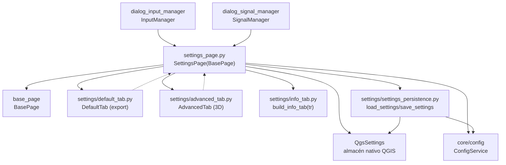

---
tags:
  - secinterp
  - code-walkthrough
  - gui
  - pages
aliases:
  - settings_page.py
  - SettingsPage
cssclass: secinterp-note
---

# `gui/ui/pages/settings_page.py`

> [!abstract] Resumen en una línea
> Página coordinadora de ajustes: contenedor con tabs Default/Advanced/Información que delega en `DefaultTab` y `AdvancedTab`, expone sus widgets por compatibilidad y persiste vía `QgsSettings` + `ConfigService`.

**Ruta**: `gui/ui/pages/settings_page.py` (124 líneas)
**Clase principal**: `SettingsPage(BasePage)`
**Capa**: GUI (coordinación de tabs de ajustes · persistencia `QgsSettings`)
**Tags**: #secinterp #gui #pages

---

## 🎯 ¿Por qué existe este archivo?

Los ajustes del plugin (qué se exporta, en qué formato, opciones 3D) viven en dos
formularios especializados más una pestaña informativa. Sin coordinador, el diálogo
tendría que conocer los tres y fusionar su lectura y persistencia.

| Problema | Solución |
|----------|----------|
| Dos formularios (export por defecto + avanzado 3D) más info en una sola página | `SettingsPage` los hospeda en un `QTabWidget` y fusiona `get_data` |
| Código antiguo accede a `page.chk_exp_topo`, `page.combo_format`, etc. | `_expose_tab_widgets()` re-expone los widgets como atributos propios |
| Los ajustes deben sobrevivir al cierre de QGIS | `load_settings` al construir + `save_settings` ante cada `changed` |

> [!important] Nota arquitectónica
> Doble persistencia: `QgsSettings` (nativo QGIS, por clave) a través de
> `settings_persistence.load/save_settings`, más el `ConfigService` del core para
> la configuración de dominio. La página es el puente entre ambos mundos.

---

## 🧬 Diagrama de relaciones



> [!tip] Cómo leer
> Flecha sólida = importa/delega; punteada = el tab emite `changed` y la página persiste.

---

## 📦 Imports — lectura arquitectónica

```python
# gui/ui/pages/settings_page.py
from __future__ import annotations

import contextlib
from typing import Any

from qgis.core import QgsSettings
from qgis.PyQt.QtCore import QCoreApplication
from qgis.PyQt.QtWidgets import QTabWidget, QVBoxLayout, QWidget

from sec_interp.core.config import ConfigService
from sec_interp.logger_config import get_logger

from .base_page import BasePage
from .settings import AdvancedTab, DefaultTab, build_info_tab
from .settings.settings_persistence import load_settings, save_settings
```

| # | Observación |
|---|-------------|
| ① | `QgsSettings` propio por página (`self.settings`): la página lee/escribe el almacén nativo sin pasar por el diálogo. |
| ② | `ConfigService` del core: los ajustes de dominio (no solo flags de export) viajan al servicio de configuración. |
| ③ | Solo contenedores Qt (`QTabWidget`, `QVBoxLayout`): checkboxes y combos viven en los tabs. |
| ④ | Import doble del sub-paquete: clases (`DefaultTab`, `AdvancedTab`, `build_info_tab`) y funciones de persistencia (`load/save_settings`). |
| ⑤ | `get_logger(__name__)` a nivel de módulo, igual que [[drillhole_page]]: coordinador con infraestructura de log preparada. |
| ⑥ | Sin `ProjectValidator`: `validate()` devuelve siempre `(True, "")`; los ajustes nunca bloquean nada. |

---

## 🏗️ Inventario de estructura

**Clase `SettingsPage(BasePage)`** — sin `layer_keys`, sin señal propia:

Construcción:

- `__init__(self, parent: QWidget | None = None) -> None` — crea `QgsSettings` + `ConfigService`
- `_setup_ui(self) -> None` — tabs + exposición + carga inicial
- `_expose_tab_widgets(self) -> None` — 14 alias por compatibilidad
- `_load_settings(self) -> None`
- `_reset_export_defaults(self) -> None`
- `_on_settings_changed(self) -> None`

Protocolo `BasePage`:

- `get_data`, `validate` (siempre ok), `connect_signals`, `disconnect_signals` (sin `dump/load/reset/is_complete`)

**Tabs hijas:**

| Atributo | Origen | Pestaña | Contenido |
|----------|--------|---------|-----------|
| `default_tab` | `DefaultTab` | Default | `chk_exp_*` (5), `combo_format`, `txt_naming`, `btn_reset_export` |
| `advanced_tab` | `AdvancedTab` | Advanced | `chk_enable_3d`, `chk_3d_traces/intervals/original/projected` |
| `info_tab` | `build_info_tab(self.tr)` | Plugin Information | solo lectura (versión, autor, enlaces) |

---

## 📖 Recorrido método por método

### `__init__` — almacenes antes que widgets

```python
def __init__(self, parent: QWidget | None = None) -> None:
    """Initialize the settings page."""
    self.settings = QgsSettings()
    self.config_service = ConfigService()
    super().__init__(QCoreApplication.translate("SettingsPage", "Plugin Settings"), parent)
```

Crea `QgsSettings()` y `ConfigService()` **antes** de `super().__init__()` porque
`_setup_ui()` (invocado por la base) ya los necesita en `_load_settings()`. Orden
relevante: invertirlo rompería la carga inicial con `AttributeError`.

### `_setup_ui` — tabs, alias y carga

```python
def _setup_ui(self) -> None:
    """Set up the tabbed settings interface."""
    super()._setup_ui()

    layout = self.group_box.layout()
    if layout is None:
        layout = QVBoxLayout(self.group_box)
        self.group_box.setLayout(layout)

    self.tab_widget = QTabWidget()
    layout.addWidget(self.tab_widget)

    self.default_tab = DefaultTab()
    self.tab_widget.addTab(self.default_tab, self.tr("Default"))

    self.advanced_tab = AdvancedTab()
    self.tab_widget.addTab(self.advanced_tab, self.tr("Advanced"))

    self.info_tab = build_info_tab(self.tr)
    self.tab_widget.addTab(self.info_tab, self.tr("Plugin Information"))

    self._expose_tab_widgets()
    self._load_settings()
```

Mismo esqueleto contenedor que [[drillhole_page]]. `build_info_tab(self.tr)` es
una factoría que recibe la función de traducción (inyección de `tr` en vez de
heredar `QWidget`). Tras exponer los alias, `_load_settings()` pinta los valores
persistidos: la página nace ya sincronizada con `QgsSettings`.

### `_expose_tab_widgets` — compatibilidad hacia atrás

```python
def _expose_tab_widgets(self) -> None:
    """Expose tab widgets as page attributes for backward compatibility."""
    self.chk_exp_topo = self.default_tab.chk_exp_topo
    self.chk_exp_geol = self.default_tab.chk_exp_geol
    self.chk_exp_struct = self.default_tab.chk_exp_struct
    self.chk_exp_drill = self.default_tab.chk_exp_drill
    self.chk_exp_interp = self.default_tab.chk_exp_interp
    self.combo_format = self.default_tab.combo_format
    self.txt_naming = self.default_tab.txt_naming
    self.btn_reset_export = self.default_tab.btn_reset_export

    self.chk_enable_3d = self.advanced_tab.chk_enable_3d
    self.chk_3d_traces = self.advanced_tab.chk_3d_traces
    # ... chk_3d_intervals, chk_3d_original, chk_3d_projected ...
```

Catorce alias que preservan el acceso plano (`page.chk_exp_topo`) del diálogo
monolítico anterior a la descomposición en tabs. Son referencias, no copias:
operan sobre los widgets reales. Riesgo conocido: si un tab reconstruye su UI,
los alias quedan colgando (ver observaciones).

### `_load_settings` / `_on_settings_changed` — persistencia reactiva

```python
def _load_settings(self) -> None:
    """Load current state from QgsSettings."""
    load_settings(self.settings, self.default_tab, self.advanced_tab)

def _on_settings_changed(self) -> None:
    """Save settings when they are changed."""
    save_settings(self.config_service, self.default_tab, self.advanced_tab)
```

Lectura al construir, escritura ante cada `changed` de los tabs: persistencia
reactiva sin botón Guardar. `load_settings` lee del almacén nativo; `save_settings`
escribe vía `ConfigService` (dominio) y/o `QgsSettings` según la clave. Nótese la
asimetría de firmas (settings+tabs vs service+tabs): cada función pide lo que usa.

### `_reset_export_defaults` — reset delegado

```python
def _reset_export_defaults(self) -> None:
    """Reset all export and 3D checkboxes to their default values."""
    self.default_tab.reset_to_defaults()
    self.advanced_tab.reset_to_defaults()
```

Delega en `reset_to_defaults()` de cada tab (no existe `reset()` de página: el
protocolo base queda en `pass`). Lo invoca `btn_reset_export` del `DefaultTab`
tras su propio cableado interno.

### `get_data` — fusión default + advanced

```python
def get_data(self) -> dict[str, Any]:
    data = self.default_tab.get_data()
    data.update(self.advanced_tab.get_data())
    return data
```

Fusiona flags de export (`exp_topo/geol/struct/drill/interp`, formato, naming)
con flags 3D (`enable_3d`, trazas, intervalos, original/proyectado).
`InputManager.get_all_values()` lo mezcla con `**(… if settings is not None)`,
tolerando diálogo sin página de ajustes.

### `validate` — siempre válido

```python
def validate(self) -> tuple[bool, str]:
    return True, ""
```

Hereda el ok de la base de forma explícita. Los ajustes son preferencias, no
requisitos: ningún flag de export puede invalidar el proyecto.

### `connect_signals` / `disconnect_signals` — puente `changed` + delegación

```python
def connect_signals(self) -> None:
    self.default_tab.changed.connect(self._on_settings_changed)
    self.advanced_tab.changed.connect(self._on_settings_changed)
    self.default_tab.connect_signals()
    self.advanced_tab.connect_signals()
# disconnect_signals invierte el orden: primero los tabs, luego los puentes
# con suppress(TypeError, RuntimeError) por línea.
```

Cada `changed` de los tabs dispara el guardado reactivo; además delega el
cableado interno de cada tab (sus checkboxes → su propio `changed`). La
desconexión invierte el orden (tabs primero, puentes después), igual que
[[drillhole_page]] con `dataChanged`.

---

## 🗂️ Señales y persistencia por tab

| Tab | Señal | Conexión interna (ejemplos) | Persistencia |
|-----|-------|-----------------------------|--------------|
| `DefaultTab` | `changed` | `chk_exp_topo.stateChanged → changed.emit`, `combo_format.currentIndexChanged`, `txt_naming.textChanged` | `load/save_settings` |
| `AdvancedTab` | `changed` | `chk_enable_3d.stateChanged → changed.emit` (+ 4 flags 3D) | `load/save_settings` |
| Info | — (solo lectura) | ninguna | ninguna (se regenera) |

---

## 🧩 Ciclo de vida en el diálogo

| Momento | Quién | Qué hace con la página |
|---------|-------|------------------------|
| Construcción | [[main_window]] / diálogo | `SettingsPage()` en el `QStackedWidget`, entrada "Settings" en [[sidebar]] |
| Carga | `_setup_ui` | `_load_settings()` pinta valores de `QgsSettings` |
| Edición | usuario | `changed` → `_on_settings_changed()` guarda al instante |
| Export | gestores | `get_data()` aporta flags de export y 3D |
| Reset | `btn_reset_export` | `_reset_export_defaults()` delega en los tabs |
| Cierre | `SignalManager` | `disconnect_signals()` (tabs + puentes) |

---

## 🔄 Flujo de datos

| Fase | Entrada | Transformación | Salida |
|------|---------|----------------|--------|
| Carga inicial | `QgsSettings` | `load_settings` | widgets con valores persistidos |
| Edición | checkbox/combo/texto | tab emite `changed` | `_on_settings_changed → save_settings` |
| Lectura | 2 tabs | `update` encadenado | flags de export + 3D |
| Agregación | dict de ajustes | `**(settings)` en `get_all_values` | parte del dict global |
| Reset | botón | `reset_to_defaults()` por tab | defecto de export y 3D |

---

## 🏛️ Patrones de diseño presentes

| Patrón | Dónde | Propósito |
|--------|-------|-----------|
| **Coordinator / Facade** | página sobre 2 tabs + info | El diálogo ve una sola página de ajustes |
| **Reactive persistence** | `changed` → `save_settings` | Sin botón Guardar; todo cambio persiste |
| **Backward-compat aliases** | `_expose_tab_widgets` | Migración gradual del diálogo monolítico |
| **Dependency injection** | `build_info_tab(self.tr)` | La pestaña info recibe `tr` sin heredar nada |

---

## 🧾 Resumen de la API

| Símbolo | Firma / Hereda | Uso típico |
|---------|----------------|------------|
| `SettingsPage` | `(BasePage)` | pestaña "Settings" del `QStackedWidget` |
| `settings` / `config_service` | `QgsSettings` / `ConfigService` | doble almacén nativo + dominio |
| `get_data` | fusión default + advanced | flags para `InputManager` |
| `validate` | siempre `(True, "")` | los ajustes nunca bloquean |
| Sin `dump/load/reset/is_complete` | delegan en tabs/`QgsSettings` | la sesión de páginas no la cubre |
| 14 alias (`chk_exp_*`, `chk_3d_*`…) | referencias a widgets de tabs | compatibilidad con código antiguo |

---

## 🛡️ Manejo de errores

- `get_all_values()` tolera `pages.settings is None`: la página de ajustes es opcional en el ensamblaje.
- Desconexiones con `suppress` por puente: reconexiones del diálogo + cierre no lanzan.
- `save_settings` ante cada `changed`: si el almacén falla, el error se produce cerca del cambio, no en un guardado diferido.
- Sin `is_complete` ni `dump`: la página no participa en puertas ni en sesiones de páginas; su estado vive en `QgsSettings`.

---

## 🧪 Tests asociados

Cobertura directa real en `tests/gui/test_settings_page.py` (`TestSettingsPage`,
con `QApplication`, `BaseTestCase` y mocks de `QgsSettings`):

- Construcción con `MockQgsSettings` y `mock_core`.
- `get_data` fusionado (claves de export + 3D).
- Persistencia `load_settings/save_settings` y reset a defecto.
- Señales `changed` → guardado reactivo.

Cobertura indirecta:

- `tests/gui/test_main_dialog_settings.py` — ajustes dentro del diálogo.
- `tests/gui/test_dialog_settings_persistence.py` — persistencia de ajustes extremo a extremo.
- `tests/gui/test_multi_session_persistence.py` — el diálogo con y sin página de ajustes.
- `tests/gui/test_signal_restoration.py` — `test_settings_reset_button_restores_defaults`.

| Aspecto a testear | Estado |
|-------------------|--------|
| Alias de `_expose_tab_widgets` | cubierto vía construcción + acceso plano |
| `build_info_tab(self.tr)` | cubierto vía pestaña info del diálogo |
| Orden `settings/service` antes de `super()` | implícito (rompería todos los tests de construcción) |
| `validate` siempre ok | trivial; cubierto indirectamente |

---

## 🌐 i18n y notas de migración

- Pestañas vía `self.tr("Default"/"Advanced"/"Plugin Information")`; título con contexto `"SettingsPage"`.
- `build_info_tab(self.tr)` inyecta traducción en una función sin `QWidget`: el texto informativo también entra al catálogo.
- Solo `QTabWidget/QVBoxLayout` + `QgsSettings` (estable): migración 4.x sin fricción.

---

## 👀 Observaciones y notas

> [!success] Fortalezas
> - Persistencia reactiva sin botón Guardar: imposible salir con ajustes a medio guardar.
> - Alias de compatibilidad bien documentados (`"for backward compatibility"`): la deuda es explícita, no accidental.
> - `build_info_tab(tr)` desacopla la pestaña informativa: testeable sin widgets ni QGIS.

> [!warning] Puntos de atención
> - Los 14 alias son referencias vivas: si un tab reconstruye sus widgets, la página apunta a widgets huérfanos sin aviso.
> - Sin `dump/load/reset`: la página es invisible para la sesión de páginas; dos mecanismos de persistencia conviven (`QgsSettings` + sesión).
> - `logger` importado sin uso en el archivo, igual que en [[drillhole_page]].
> - Asimetría `load_settings(settings, …)` / `save_settings(service, …)`: hay que leer ambas firmas para entender el doble almacén.

> [!question] Preguntas abiertas
> - ¿Implementar `dump/load/reset` delegando en tabs + `QgsSettings` para unificar la sesión de páginas?
> - ¿Eliminar los alias tras migrar los últimos consumidores (`grep chk_exp_topo` fuera de tabs)?
> - ¿Usar el `logger` (p. ej. en `_on_settings_changed`) o retirarlo?

---

## 🔗 Notas relacionadas

- [[Index]] — índice de la bóveda
- [[base_page]] — protocolo (esta página omite `dump/load/reset/is_complete`)
- [[default_tab]] / [[advanced_tab]] — los dos formularios delegados
- [[settings_persistence]] — `load_settings/save_settings` y el doble almacén
- [[gui_ui_pages_settings]] — nota del sub-paquete `settings/`
- [[main_window]] — pestaña "Settings" del `QStackedWidget`
- [[sidebar]] — entrada "Settings" (`mActionOptions.svg`)
- [[dialog_input_manager]] — fusiona `get_data()` con `**(settings)`
- [[dialog_settings_persistence]] — persistencia de ajustes a nivel de diálogo
- [[drillhole_page]] — la otra página coordinadora (mismo esqueleto)
- [[main_dialog_config]] — defecto centralizados que los tabs consumen

---

*Nota de la bóveda SecInterp Code Walkthrough v2 — v3.8.0*
