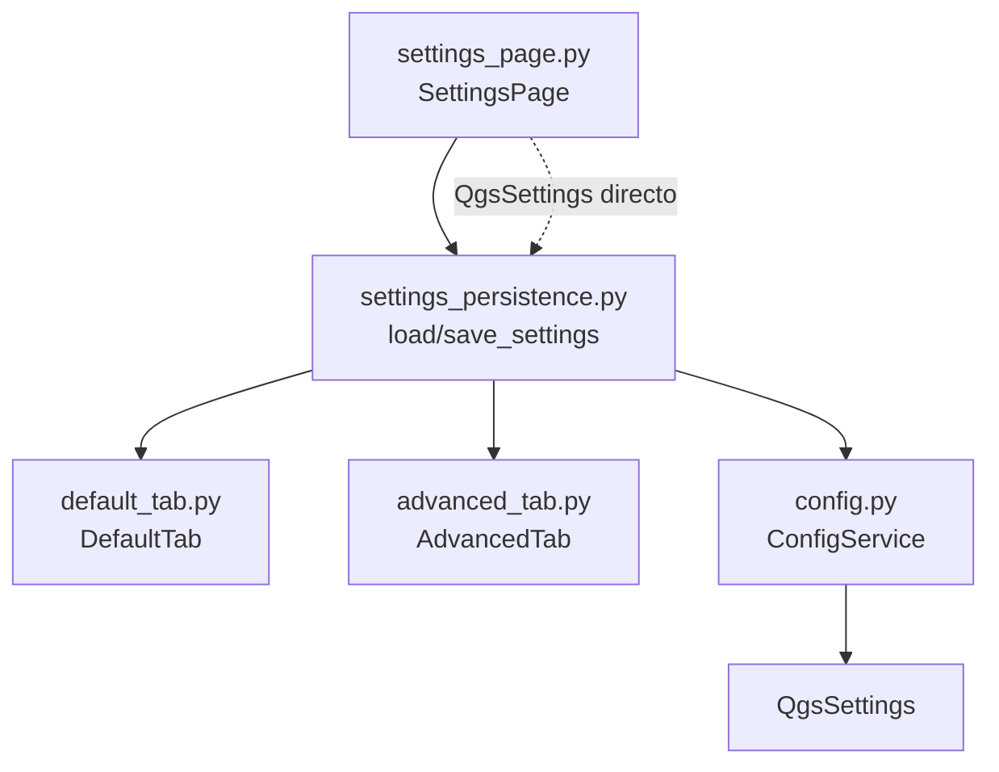

---
tags:
  - secinterp
  - code-walkthrough
  - gui
  - pages
aliases:
  - settings_persistence.py
  - load_settings
  - save_settings
cssclass: secinterp-note
---

# `gui/ui/pages/settings/settings_persistence.py`

> [!abstract] Resumen en una línea
> Fachada de persistencia de la página de ajustes: `load_settings` hidrata los tabs desde `QgsSettings` y `save_settings` los vuelca vía `ConfigService`, sin que los widgets conozcan el almacenamiento.

**Ruta**: `gui/ui/pages/settings/settings_persistence.py` (75 líneas)
**Funciones principales**: `load_settings`, `save_settings`
**Capa**: GUI (servicios de página · sin widgets propios)
**Tags**: #secinterp #gui #pages

---

## 🎯 ¿Por qué existe este archivo?

`SettingsPage` coordina tres tabs, pero el conocimiento de *qué clave va a qué
checkbox* merece un hogar propio: si cambia una clave, se toca este módulo y
no los widgets.

| Problema | Solución |
|----------|----------|
| Los tabs no deben importar `QgsSettings`/`ConfigService` | Dos funciones puras reciben store + tabs como `Any` |
| Lectura y escritura usan APIs distintas | `load` lee `QgsSettings.value()`; `save` escribe `ConfigService.set()` |
| 13 claves repartidas en dos tabs | Un solo lugar que las enumera todas |

> [!important] Nota arquitectónica
> **Fachada de persistencia** (no Adapter Extract): traduce widgets ↔ claves.
> Los tabs exponen atributos públicos (`chk_exp_topo`, `combo_format`, …) y
> este módulo los lee/escribe directamente.

---

## 🧬 Diagrama de relaciones



> [!tip] Cómo leer
> `load_settings` recibe el `QgsSettings` crudo del padre; `save_settings`
> recibe el `ConfigService`. Asimetría intencional (ver abajo).

---

## 📦 Imports — lectura arquitectónica

```python
# gui/ui/pages/settings/settings_persistence.py
from __future__ import annotations
from typing import Any
from sec_interp.logger_config import get_logger

logger = get_logger(__name__)
```

| # | Observación |
|---|-------------|
| ① | Cero imports Qt/QGIS: módulo 100 % agnóstico de widgets. |
| ② | Todo tipado como `Any` (store y tabs): duck typing deliberado para mocks. |
| ③ | `logger` declarado por convención aunque no se usa en el cuerpo. |

---

## 🏗️ Inventario de estructura

**Funciones:** 2, sin clases.

| Función | Firma | Propósito |
|---------|-------|-----------|
| `load_settings` | `(settings: Any, default_tab: Any, advanced_tab: Any) -> None` | Hidrata widgets desde `QgsSettings` |
| `save_settings` | `(config_service: Any, default_tab: Any, advanced_tab: Any) -> None` | Vuelca widgets vía `ConfigService` |

---

## 📁 Archivos del paquete

| Archivo | Líneas | Rol |
|---|---|---|
| `settings/__init__.py` | 9 | Re-exporta tabs (no este módulo) |
| `advanced_tab.py` | 106 | 5 flags 3D (ver [[advanced_tab]]) |
| `default_tab.py` | 178 | 8 claves de exportación (ver [[default_tab]]) |
| `settings_persistence.py` | 75 | Esta nota: fachada load/save |
| `../settings_page.py` | 124 | Orquestador (ver [[settings_page]]) |

---

## 📖 Recorrido función por función

### `load_settings` — hidratación

```python
def load_settings(settings: Any, default_tab: Any, advanced_tab: Any) -> None:
    enabled_3d = settings.value("SecInterp/enable_3d", True, type=bool)
    advanced_tab.chk_enable_3d.setChecked(enabled_3d)

    default_tab.chk_exp_topo.setChecked(settings.value("SecInterp/exp_topo", True, type=bool))
    default_tab.chk_exp_geol.setChecked(settings.value("SecInterp/exp_geol", True, type=bool))
    default_tab.chk_exp_struct.setChecked(settings.value("SecInterp/exp_struct", True, type=bool))
    default_tab.chk_exp_drill.setChecked(settings.value("SecInterp/exp_drill", True, type=bool))
    default_tab.chk_exp_interp.setChecked(settings.value("SecInterp/exp_interp", True, type=bool))

    default_fmt = settings.value("SecInterp/export_format", "Shapefile", type=str)
    index = default_tab.combo_format.findText(default_fmt)
    if index >= 0:
        default_tab.combo_format.setCurrentIndex(index)

    default_tab.txt_naming.setText(
        settings.value("SecInterp/export_naming", "{filename}_{profile}", type=str)
    )

    advanced_tab.chk_3d_traces.setChecked(
        settings.value("SecInterp/drill_3d_traces", True, type=bool)
    )
    ...
```

| Paso | Claves | Default |
|------|--------|---------|
| Maestro 3D | `enable_3d` | `True` |
| 5 productos | `exp_topo/geol/struct/drill/interp` | `True` |
| Formato | `export_format` | `"Shapefile"`, con guarda `findText >= 0` |
| Naming | `export_naming` | `"{filename}_{profile}"` |
| 4 flags 3D | `drill_3d_traces/intervals/original` (`True`), `drill_3d_projected` (`False`) | Ver tabla |

La guarda del combo evita seleccionar `-1` si el valor guardado ya no existe
en el modelo (p. ej. formato eliminado en una versión posterior).

### `save_settings` — volcado

```python
def save_settings(config_service: Any, default_tab: Any, advanced_tab: Any) -> None:
    config_service.set("enable_3d", advanced_tab.chk_enable_3d.isChecked())

    config_service.set("exp_topo", default_tab.chk_exp_topo.isChecked())
    ...  # exp_geol/struct/drill/interp
    config_service.set("export_format", default_tab.combo_format.currentText())
    config_service.set("export_naming", default_tab.txt_naming.text())

    config_service.set("drill_3d_traces", advanced_tab.chk_3d_traces.isChecked())
    ...  # intervals/original/projected
```

Trece llamadas `set()` con claves **sin prefijo**: `ConfigService` antepone
`SecInterp/`, hace `sync()` e invalida su caché (`_current_settings = None`).

> [!note] Asimetría load/save
> `load` habla `QgsSettings` nativo (claves con prefijo explícito); `save`
> habla `ConfigService` (prefijo implícito + `sync`). Funciona porque ambas
> convergen en `SecInterp/<clave>`, pero son dos contratos distintos que el
> lector debe conocer.

---

## 🔄 Flujo de datos

| Fase | Entrada | Transformación | Salida |
|------|---------|----------------|--------|
| Arranque | `SettingsPage._setup_ui` | `_load_settings()` → `load_settings(self.settings, ...)` | Tabs hidratados |
| Edición | `changed` de cualquier tab | `_on_settings_changed()` → `save_settings(self.config_service, ...)` | 13 `set()` + `sync()` |
| Reset | `reset_to_defaults()` | `stateChanged` ⇒ `changed` ⇒ autoguardado | Defaults persistidos |
| Modelo | `QgsSettings` | `ConfigService._load_from_qgs_settings()` | `PluginSettings` validado |
| Consumo | Exportadores | `get_data()` de cada tab | Flags de ejecución |

---

## 📐 Tabla completa de claves

| # | Clave (`SecInterp/…`) | Widget | Tipo | Default |
|---|----------------------|--------|------|---------|
| 1 | `enable_3d` | `chk_enable_3d` | bool | `True` |
| 2 | `exp_topo` | `chk_exp_topo` | bool | `True` |
| 3 | `exp_geol` | `chk_exp_geol` | bool | `True` |
| 4 | `exp_struct` | `chk_exp_struct` | bool | `True` |
| 5 | `exp_drill` | `chk_exp_drill` | bool | `True` |
| 6 | `exp_interp` | `chk_exp_interp` | bool | `True` |
| 7 | `export_format` | `combo_format` | str | `"Shapefile"` |
| 8 | `export_naming` | `txt_naming` | str | `"{filename}_{profile}"` |
| 9 | `drill_3d_traces` | `chk_3d_traces` | bool | `True` |
| 10 | `drill_3d_intervals` | `chk_3d_intervals` | bool | `True` |
| 11 | `drill_3d_original` | `chk_3d_original` | bool | `True` |
| 12 | `drill_3d_projected` | `chk_3d_projected` | bool | `False` |

---

## 🏛️ Patrones de diseño presentes

| Patrón | Dónde | Propósito |
|--------|-------|-----------|
| **Fachada** | Módulo completo | Un punto de acceso a la persistencia de settings |
| **Duck typing** | Parámetros `Any` | Acepta widgets reales o mocks sin importar Qt |
| **Separación load/save** | Dos funciones | Lectura directa vs. escritura con servicio |
| **Guarda de combo** | `findText >= 0` | Tolerancia a valores obsoletos |

---

## 🧾 Resumen de la API

| Símbolo | Firma | Uso típico |
|---------|-------|------------|
| `load_settings` | `(settings, default_tab, advanced_tab) -> None` | `SettingsPage._load_settings()` |
| `save_settings` | `(config_service, default_tab, advanced_tab) -> None` | `SettingsPage._on_settings_changed()` |

---

## 🛡️ Manejo de errores

- Sin `try/except`: confía en los defaults de `settings.value(...)`.
- `findText >= 0` protege el combo de valores desconocidos.
- Atributos accedidos directamente (sin `hasattr`): un doble parcial que
  omita un checkbox lanzaría `AttributeError` — el contrato exige tabs
  completos o `getattr`-compatibles.
- `ConfigService.set` hace `sync()` por llamada: 13 escrituras seguidas son
  seguras aunque verbosas.

---

## 🧪 Tests asociados

Cobertura directa e indirecta con mocks:

- `tests/gui/test_settings_page.py::TestSettingsPage::test_load_settings` — ejerce `load_settings` con store mockeado.
- `test_save_settings` — ejerce `save_settings` contra `ConfigService` mockeado.
- `test_get_data` — lectura fusionada tras hidratar.
- `tests/gui/test_dialog_settings_persistence.py` — persistencia del diálogo principal (capa superior).
- `tests/gui/test_main_dialog_settings.py` — parseo de booleanos guardados como texto.

---

## 🌐 i18n y notas de migración

- Este módulo no contiene cadenas visibles: nada que traducir.
- Los defaults (`"Shapefile"`, `"{filename}_{profile}"`) duplican los de los
  tabs: cambiar un default exige tocar tres archivos (tab, `get_data`, aquí).
- Sin dependencias QGIS: el módulo es copiable a cualquier rama 4.x sin cambios.

---

## 🧩 Contratos de duck typing

Al tipar todo como `Any`, el contrato real es la lista de atributos usados:

| Parámetro | Atributos exigidos |
|-----------|--------------------|
| `settings` (`load`) | `.value(key, default, type=…)` estilo `QgsSettings` |
| `config_service` (`save`) | `.set(key, value)` estilo `ConfigService` |
| `default_tab` | `chk_exp_*` (×5), `combo_format`, `txt_naming` |
| `advanced_tab` | `chk_enable_3d`, `chk_3d_traces/intervals/original/projected` |

Un mock que implemente esas superficies basta para probar ambas funciones sin
QGIS, como hace `test_settings_page.py`.

---

## 👀 Observaciones y notas

> [!success] Fortalezas
> - Centraliza las 12 claves: el inventario es auditable de un vistazo.
> - Sin imports Qt: testeable con dobles triviales.
> - Guarda del combo ante valores obsoletos.

> [!warning] Puntos de atención
> - Asimetría store (`QgsSettings` vs `ConfigService`): dos contratos que mantener.
> - Defaults triplicados (tab, `get_data`, aquí): riesgo de divergencia silenciosa.
> - Acceso directo a atributos sin `hasattr`: menos tolerante que `get_data`.

> [!question] Preguntas abiertas
> - ¿Unificar `load` a través de `ConfigService.get()` para un solo contrato?
> - ¿Extraer los defaults a una tabla compartida con los tabs?

---

## 🔗 Notas relacionadas

- [[Index]] — índice de la bóveda
- [[settings_page]] — orquestador que llama a ambas funciones
- [[gui_ui_pages_settings]] — paquete de tabs de ajustes
- [[default_tab]] — tab destino de 8 claves
- [[advanced_tab]] — tab destino de 5 claves
- [[settings_model]] — `PluginSettings`/`ExportSettings` validados
- [[config]] — `ConfigService` usado en el guardado
- [[dialog_settings_persistence]] — persistencia del diálogo principal

---

*Nota de la bóveda SecInterp Code Walkthrough v2 — v3.9.1*
