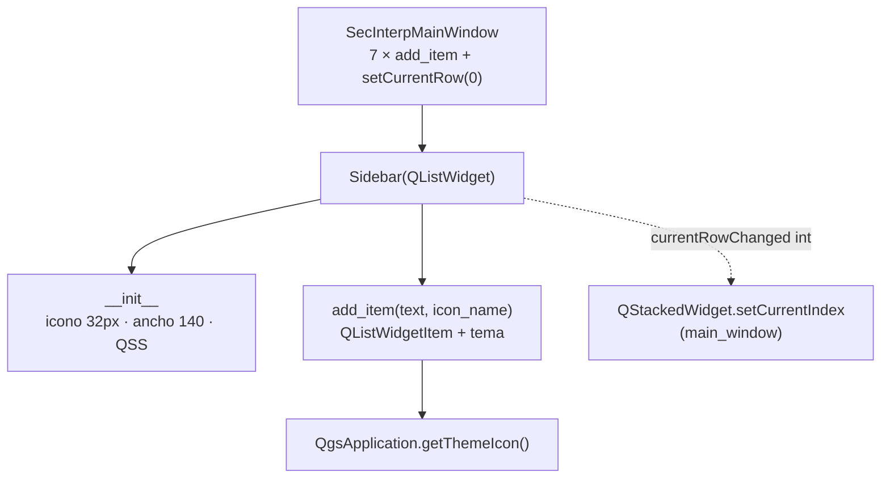

---
tags:
  - secinterp
  - code-walkthrough
  - gui
  - ui
aliases:
  - sidebar.py
  - Sidebar
cssclass: secinterp-note
---

# `gui/ui/sidebar.py`

> [!abstract] Resumen en una línea
> `Sidebar`: un `QListWidget` de 140px con estética de diálogo de opciones de QGIS que convierte filas en índices de página para el `QStackedWidget` de la ventana principal.

**Ruta**: `gui/ui/sidebar.py` (63 líneas)
**Clase principal**: `Sidebar(QListWidget)`
**Capa**: GUI (widget puro · sin `core/`, sin estado de negocio)
**Tags**: #secinterp #gui #ui

---

## 🎯 ¿Por qué existe este archivo?

La navegación entre siete páginas necesita un control visible, compacto y con iconos. Heredar de `QListWidget` en vez de componer botones da selección, teclado y `currentRowChanged` gratis:

| Problema | Solución |
|----------|----------|
| Siete páginas sin navegación visible | Lista lateral con etiqueta + icono por página |
| Aspecto ajeno al de QGIS | QSS que imita el diálogo de opciones (`#f0f0f0`, borde izquierdo azul) |
| Iconos con rutas absolutas frágiles | `QgsApplication.getThemeIcon(name)` con nombres del tema |
| Texto que se corta en 120px | Ancho fijo de 140px e iconos de 32px |

> [!important] Nota arquitectónica
> Widget **tonto y reutilizable**: no conoce páginas, índices ni el `QStackedWidget`. Solo emite `currentRowChanged(int)`; [[main_window]] decide qué significa. Esa ignorancia lo hace testeable con `pytest-qt` sin proyecto QGIS.

---

## 🧬 Diagrama de relaciones



> [!tip] Cómo leer
> Flecha sólida = define/llama; punteada = señal consumida por la ventana principal. El sidebar nunca importa la ventana.

---

## 📦 Imports — lectura arquitectónica

```python
# gui/ui/sidebar.py
from __future__ import annotations

from typing import Any

from qgis.core import QgsApplication
from qgis.PyQt.QtCore import QSize, Qt
from qgis.PyQt.QtWidgets import QListWidget, QListWidgetItem
```

| # | Observación |
|---|-------------|
| ① | Hereda el widget (`QListWidget`) en vez de envolverlo: gana modelo, selección y navegación por teclado de Qt sin código. |
| ② | `QgsApplication` solo para `getThemeIcon`: el único acoplamiento QGIS, y es al tema, no a datos del proyecto. |
| ③ | `Any` en `parent`: acepta cualquier `QWidget` o `None` sin importar clases de `qgis.gui`. |
| ④ | `QSize` y `Qt` (alineación) son constantes de presentación; ningún import de `core/` ni de páginas. |

---

## 🏗️ Inventario de estructura

**Clases:** `class Sidebar(QListWidget)` — 2 métodos.

| Método | Firma | Rol |
|---|---|---|
| `__init__` | `(parent: Any = None) -> None` | Tamaño de icono, ancho fijo y QSS |
| `add_item` | `(text: str, icon_name: str \| None = None) -> None` | Crea item con icono opcional y alineación |

---

## 📁 Dónde vive dentro de `gui/ui/`

| Vecino | Relación con este módulo |
|---|---|
| [[main_window]] | Lo instancia, lo puebla con 7 items y conecta `currentRowChanged` |
| [[preview_page]] | Página visible por defecto solo si la fila 0 la selecciona |
| [[main_dialog_utils]] | `get_theme_icon` resuelve los mismos nombres de tema desde el facade |
| [[main_dialog_config]] | `UIConstants.ICON_*` define nombres equivalentes para otros botones |

---

## 📖 Recorrido método por método

### `__init__` — tamaño y piel

```python
def __init__(self, parent: Any = None) -> None:
    super().__init__(parent)
    self.setIconSize(QSize(32, 32))
    self.setFixedWidth(140)  # Slightly wider for better text fit

    # Style to look like QGIS options dialog sidebar
    self.setStyleSheet("""
        QListWidget {
            background-color: #f0f0f0;
            border-right: 1px solid #d0d0d0;
            outline: none;
        }
        QListWidget::item {
            padding: 10px;
            border-bottom: 1px solid #e0e0e0;
            color: #404040;
        }
        QListWidget::item:selected {
            background-color: #ffffff;
            color: #000000;
            border-left: 3px solid #0078d7;
        }
        QListWidget::item:hover {
            background-color: #e8e8e8;
        }
    """)
```

| Decisión | Efecto |
|---|---|
| `setFixedWidth(140)` | Columna estable: el splitter no la deforma al redimensionar |
| Iconos de 32px | Legibles en HiDPI sin escalar el texto |
| `outline: none` | Sin rectángulo de foco punteado: aspecto limpio de panel, no de lista editable |
| `border-left: 3px solid #0078d7` en seleccionado | Marcador azul estilo QGIS; el único color de marca del plugin |
| `padding: 10px` + separadores `#e0e0e0` | Filas aireadas, tacto de menú de opciones |

> [!note] QSS inline frente a archivo `.qss`
> El estilo vive en el constructor para que el widget sea autocontenido (copiar el archivo basta). El coste: dos bloques de estilo separados (`sidebar` + splitter en `main_window`) que deben mantenerse coherentes a mano.

### `add_item` — una fila con icono del tema

```python
def add_item(self, text: str, icon_name: str | None = None) -> None:
    """Add an item to the sidebar.

    Args:
        text (str): Item label.
        icon_name (str): QGIS theme icon name (e.g. 'mIconRaster.svg').

    """
    item = QListWidgetItem(text)
    if icon_name:
        icon = QgsApplication.getThemeIcon(icon_name)
        item.setIcon(icon)

    # Center text alignment
    item.setTextAlignment(Qt.AlignmentFlag.AlignLeft | Qt.AlignmentFlag.AlignVCenter)
    self.addItem(item)
```

El icono es opcional (`None` = fila de solo texto), lo que permite reutilizar el widget en diálogos futuros sin iconos. El comentario dice "Center" pero el código alinea a la **izquierda** centrada verticalmente — el texto manda sobre el comentario. Las siete llamadas reales viven en [[main_window]] con etiquetas ya traducidas (`self.tr("DEM / Raster")`, …) e iconos `mIconRaster.svg`, `mIconLineLayer.svg`, `mIconPolygonLayer.svg`, `mIconPointLayer.svg`, `mActionDataSourceManager.svg`, `mActionEdit.svg`, `mActionOptions.svg`.

---

## 🎨 Anatomía del QSS, regla por regla

| Selector | Propiedades clave | Intención |
|---|---|---|
| `QListWidget` | `background #f0f0f0`, `border-right`, `outline: none` | Panel lateral, no lista editable |
| `::item` | `padding 10px`, `border-bottom #e0e0e0`, `color #404040` | Filas aireadas con separador sutil |
| `::item:selected` | `background #ffffff`, `border-left 3px #0078d7` | Fila activa en blanco con marca azul QGIS |
| `::item:hover` | `background #e8e8e8` | Feedback visual sin seleccionar |

## ⌨️ Lo que regala `QListWidget`

| Capacidad | Coste en este archivo | Uso en el plugin |
|---|---|---|
| Selección y `currentRow` | 0 líneas | `setCurrentRow(0)` abre en DEM |
| Navegación por teclado (↑/↓) | 0 líneas | Accesibilidad gratuita |
| Señal `currentRowChanged(int)` | 0 líneas | Navegación en [[main_window]] |
| Scroll automático | 0 líneas | Margen para páginas futuras |

Herencia bien elegida: 63 líneas compran lista, selección, teclado y scroll que con `QWidget` + botones costarían cientos.

---

## 🔄 Flujo de datos

| Fase | Entrada | Transformación | Salida |
|---|---|---|---|
| Poblado | 7 × `(texto_traducido, icono_tema)` | `QListWidgetItem` + `setIcon` + alineación | Filas en orden 0–6 |
| Selección | Clic / teclado / `setCurrentRow(0)` | Selección interna de `QListWidget` | `currentRowChanged(int)` |
| Navegación | `int` de fila | `stacked.setCurrentIndex(int)` en la ventana | Página visible |
| Estilo | QSS del constructor | Estados normal/hover/selected | Piel de opciones QGIS |

> [!warning] Contrato de orden sin red
> La fila N **debe** corresponder a la página N del `QStackedWidget`. Ni el sidebar ni la ventana lo verifican: si alguien inserta un item fuera de orden, la navegación miente en silencio. Ver observaciones.

---

## 🏛️ Patrones de diseño presentes

| Patrón | Dónde | Propósito |
|---|---|---|
| **Subclassed widget** | `Sidebar(QListWidget)` | Reutilizar modelo/selección de Qt |
| **Theme indirection** | `icon_name` como `str` | Nombres del tema, nunca rutas |
| **Dumb view** | Sin referencia al stack | El widget emite; la ventana interpreta |
| **Inline QSS skin** | `setStyleSheet` en `__init__` | Piel autocontenida estilo QGIS |

---

## 🧾 Resumen de la API

| Símbolo | Firma / Hereda | Uso típico |
|---|---|---|
| `Sidebar` | `QListWidget` | `self.sidebar = Sidebar()` |
| `__init__` | `(parent: Any = None)` | Construcción con piel incluida |
| `add_item` | `(text, icon_name=None) -> None` | `sidebar.add_item(self.tr("Geology"), "mIconPolygonLayer.svg")` |

---

## 🛡️ Manejo de errores

Sin defensas explícitas, y está bien: `addItem` nunca falla por texto válido, y `getThemeIcon` con nombre inexistente devuelve un icono nulo que Qt pinta como fila sin icono (degradación visual, no crash). El riesgo real —desorden sidebar↔stack— no es un error lanzable sino un invariante de construcción que hoy solo existe en la cabeza del programador.

---

## 🧪 Tests asociados

Sin `tests/gui/test_sidebar.py` dedicado; cobertura indirecta y honesta:

- `tests/gui/test_main_dialog_core.py` — la ventana completa (sidebar incluido) se construye vía `SecInterpDialog`.
- `tests/gui/test_main_dialog_signals_wiring.py` — el cableado `currentRowChanged → setCurrentIndex` se verifica tras el ensamblado.
- `tests/gui/test_dem_page.py` — la página de la fila 0 bajo tests de página.

Un test `pytest-qt` de diez líneas (`Sidebar()`, 7 `add_item`, `setCurrentRow(3)` → `currentRow == 3`) congelaría el contrato de orden:

```python
# tests/gui/test_sidebar.py — propuesto (no existe aún)
def test_sidebar_row_order(qtbot):
    from sec_interp.gui.ui.sidebar import Sidebar
    sb = Sidebar()
    for label in ["DEM", "Section", "Geology", "Structural", "Drillholes", "Interp", "Settings"]:
        sb.add_item(label)
    sb.setCurrentRow(3)
    assert sb.currentRow() == 3
    assert sb.count() == 7
```

El test congela tres invariantes en diez líneas:
siete filas en orden, selección programática y conteo exacto.
Si alguien inserta una página sin su item —o viceversa—,
`count() == 7` falla primero, antes de que la navegación mienta.

---

## 👀 Observaciones y notas

> [!success] Fortalezas
> - 63 líneas, cero lógica de negocio: el widget más simple de `gui/ui/`.
> - Heredar `QListWidget` regala teclado, selección y scroll sin una línea extra.
> - Iconos por tema: sigue al tema QGIS sin mantenimiento.
> - Reutilizable: `icon_name=None` lo hace apto para otros diálogos.

> [!warning] Puntos de atención
> - Contrato sidebar↔stack sin assert ni test: el invariante más frágil de la ventana.
> - Comentario "Center text alignment" desactualizado: el código alinea a la izquierda.
> - Ancho fijo 140px: etiquetas largas traducidas (p. ej. alemán) podrían truncarse; sin `elide` ni tooltip.
> - QSS duplicado a mano entre sidebar y splitter de `main_window`.

> [!question] Preguntas abiertas
> - ¿Añadir test que congele 7 items en orden con sus iconos?
> - ¿Tooltip por item con la descripción de la página para etiquetas truncadas?

---

## 🔗 Notas relacionadas

- [[Index]] — índice de la bóveda
- [[main_window]] — puebla el sidebar y conecta su señal
- [[preview_page]] — panel derecho visible junto a cada fila
- [[dem_page]] — página de la fila 0 (selección inicial)
- [[settings_page]] — página de la última fila
- [[main_dialog_utils]] — `get_theme_icon`, misma resolución de tema desde el facade
- [[main_dialog_config]] — `UIConstants.ICON_*` para otros botones del diálogo
- [[gui_ui_pages]] — índice de las páginas navegables

---

*Nota de la bóveda SecInterp Code Walkthrough v2 — v3.9.1*
