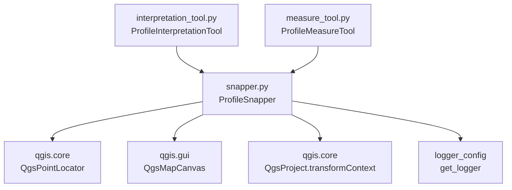

---
tags:
  - secinterp
  - code-walkthrough
  - gui
  - tools
aliases:
  - snapper.py
  - ProfileSnapper
cssclass: secinterp-note
---

# `gui/tools/snapper.py`

> [!abstract] Resumen en una línea
> Helper de snapping compartido por los map tools del perfil: convierte píxeles del ratón en `QgsPointXY` imantados al vértice o arista más cercanos (tolerancia 12 px) con caché de `QgsPointLocator` por capa.

**Ruta**: `gui/tools/snapper.py` (112 líneas)
**Clase principal**: `ProfileSnapper`
**Capa**: GUI · Tools (usa `QgsPointLocator`, `QgsProject` y el canvas; sin lógica geológica)
**Tags**: #secinterp #gui #tools

---

## 🎯 ¿Por qué existe este archivo?

Los dos tools del perfil (`ProfileInterpretationTool` y `ProfileMeasureTool`) necesitan el mismo imantado a la geometría, y duplicarlo divergiría con el tiempo.

| Problema | Solución |
|----------|----------|
| Ambos tools deben "imantar" el cursor a vértices y aristas existentes | `ProfileSnapper.snap(QPoint) -> QgsPointXY` centraliza la búsqueda del mejor candidato |
| Crear un `QgsPointLocator` por capa en cada movimiento es costoso | Caché `_locators: dict[layer_id, QgsPointLocator]` con purga de capas desaparecidas |
| Capas no vectoriales o destruidas no deben romper el dibujo | `_is_snappable()` filtra por tipo vectorial; `try/except` por capa con `continue` |
| El snapping debe degradar con gracia si nada casa | Si no hay match válido, devuelve el punto crudo del mapa |

> [!important] Nota arquitectónica
> Composición sobre herencia: los tools **contienen** un `ProfileSnapper(canvas)` en vez de heredar el snapping. El snapper no conoce polígonos ni mediciones; solo píxeles, capas y tolerancias. Es el único punto del paquete `tools/` que toca `QgsProject` (para el `transformContext` de los locators).

---

## 🧬 Diagrama de relaciones



> [!tip] Cómo leer
> Flecha sólida = importa/delega. Los dos tools son los únicos consumidores; el snapper nunca los importa de vuelta (dependencia unidireccional).

---

## 📦 Imports — lectura arquitectónica

```python
# gui/tools/snapper.py
from __future__ import annotations

from typing import Any

from qgis.core import (
    QgsMapLayer,
    QgsPointLocator,
    QgsPointXY,
    QgsProject,
    QgsVectorLayer,
)
from qgis.gui import QgsMapCanvas
from qgis.PyQt.QtCore import QPoint

from sec_interp.logger_config import get_logger
```

| # | Observación |
|---|-------------|
| ① | `QgsMapLayer` (para el chequeo de tipo) + `QgsVectorLayer` (tipado de `_get_locator`): el filtro vectorial es explícito. |
| ② | `QgsPointLocator` es el motor real: `nearestVertex` + `nearestEdge` con tolerancia en unidades de mapa. |
| ③ | `QgsProject.instance().transformContext()` — la única llamada a un singleton global en `tools/`; necesaria para construir locators con el contexto de transformación vigente. |
| ④ | `QPoint` (píxel de `event.pos()`) → `QgsPointXY` (mapa): la firma `snap()` documenta la conversión píxel→mundo. |
| ⑤ | `Any` solo para los matches del locator (`current_best`): QGIS no expone un tipo público cómodo para `QgsPointLocator.Match`. Pragmático y honesto. |
| ⑥ | Cero imports del core y de hermanos: hoja de dependencias salvo logger. |

---

## 🏗️ Inventario de estructura

**Clases (1):** `ProfileSnapper` — 6 métodos.

| Método | Firma | Rol |
|--------|-------|-----|
| `__init__` | `(canvas: QgsMapCanvas) -> None` | Guarda canvas, inicia caché vacía |
| `snap` | `(mouse_pos: QPoint) -> QgsPointXY` | Punto imantado o punto crudo |
| `_find_best_match_in_locator` | `(locator, point, tolerance, current_best: Any, current_dist: float) -> tuple[Any, float]` | Compite vértice vs. arista contra el mejor global |
| `_cleanup_locators` | `(current_ids: set[str]) -> None` | Purga locators de capas desaparecidas |
| `_is_snappable` | `(layer: QgsMapLayer) -> bool` | Solo capas vectoriales válidas |
| `_get_locator` | `(layer: QgsVectorLayer, crs, context) -> QgsPointLocator \| None` | Crea o reutiliza el locator (con `warning` si falla) |

---

## 📁 Archivos del paquete

| Archivo | Líneas | Rol |
|---|--:|---|
| `snapper.py` | 112 | Esta nota: snapping compartido |
| `interpretation_tool.py` | 269 | Consumidor: vértices de polígono |
| `measure_tool.py` | 330 | Consumidor: vértices de polilínea + preview |
| `__init__.py` | — | Marcador de paquete |

---

## 📖 Recorrido método por método

### `__init__`

```python
def __init__(self, canvas: QgsMapCanvas) -> None:
    self.canvas = canvas
    self._locators: dict[str, QgsPointLocator] = {}
```

Sin trabajo pesado en el constructor: los locators se crean perezosamente al primer `snap()` que encuentre capas vectoriales. Cada tool posee su propio snapper (y su propia caché), porque cada tool vive en un momento distinto del canvas.

### `snap`

```python
def snap(self, mouse_pos: QPoint) -> QgsPointXY:
    point = self.canvas.getCoordinateTransform().toMapCoordinates(mouse_pos)
    tolerance = (self.canvas.mapUnitsPerPixel() or 1.0) * 12

    best_match = None
    best_dist = float("inf")

    layers = self.canvas.layers()
    self._cleanup_locators({layer.id() for layer in layers if layer is not None})

    crs = self.canvas.mapSettings().destinationCrs()
    context = QgsProject.instance().transformContext()

    for layer in layers:
        if not self._is_snappable(layer):
            continue
        try:
            locator = self._get_locator(layer, crs, context)
            if locator:
                best_match, best_dist = self._find_best_match_in_locator(
                    locator, point, tolerance, best_match, best_dist
                )
        except Exception:  # nosec B112
            continue

    if best_match:
        return best_match.point()
    return point
```

Cuatro tiempos: (1) píxel → mapa; (2) tolerancia = 12 píxeles en unidades de mapa (`mapUnitsPerPixel() or 1.0` protege contra canvas sin escala); (3) purga de locators obsoletos **antes** de iterar; (4) competición por capa con red de seguridad individual: si una capa fue borrada o su locator explota, `continue` y el resto sigue imantando. Sin matches, el punto crudo garantiza que el dibujo nunca se bloquea.

> [!note] Tolerancia en píxeles, no en metros
> Multiplicar por `mapUnitsPerPixel()` hace el snapping independiente del zoom: 12 px se sienten igual cerca que lejos. El `or 1.0` evita tolerancia cero en tests con canvas mockeado.

### `_find_best_match_in_locator`

```python
v_match = locator.nearestVertex(point, tolerance)
if v_match.isValid() and v_match.distance() < best_dist:
    best_match = v_match
    best_dist = v_match.distance()

e_match = locator.nearestEdge(point, tolerance)
if e_match.isValid() and e_match.distance() < best_dist:
    best_match = e_match
    best_dist = e_match.distance()
```

Competición en dos rondas por locator: primero vértice, luego arista, cada una solo si es válida **y** mejora la mejor distancia global. El orden importa en empates: a igual distancia gana el vértice (se evalúa primero y la arista exige `<` estricto). El mejor global viaja como acumulador entre capas, así el ganador final es el más cercano de **todas** las capas vectoriales.

### `_cleanup_locators`

```python
def _cleanup_locators(self, current_ids: set[str]) -> None:
    hits_to_remove = [lid for lid in self._locators if lid not in current_ids]
    for lid in hits_to_remove:
        del self._locators[lid]
```

Purga por diferencia de conjuntos: cualquier locator cuya capa ya no esté en el canvas se descarta, liberando la referencia al locator (y con ella, a la capa). Se ejecuta en cada `snap()`, así que el coste es O(caché) por movimiento de ratón: despreciable frente a construir un locator.

### `_is_snappable`

```python
def _is_snappable(self, layer: QgsMapLayer) -> bool:
    """Check if a layer is valid for snapping."""
    return bool(layer and layer.type() == QgsMapLayer.LayerType.VectorLayer)
```

Filtro mínimo: capa no nula y de tipo vectorial. Rásters, mallas y capas inexistentes se omiten silenciosamente. Nótese que no comprueba `layer.isValid()`: una vectorial inválida pasa el filtro y su locator fallará después (cubierto por el `try/except` de `snap()` y el `warning` de `_get_locator()`).

### `_get_locator`

```python
def _get_locator(self, layer: QgsVectorLayer, crs, context) -> QgsPointLocator | None:
    if layer.id() not in self._locators:
        try:
            self._locators[layer.id()] = QgsPointLocator(layer, crs, context)
        except Exception as e:
            logger.warning(f"Failed to create locator for layer {layer.name()}: {e}")
            return None
    return self._locators[layer.id()]
```

Caché perezosa con clave `layer.id()`: el primer snap sobre una capa paga la indexación espacial, los siguientes la reutilizan. Si la construcción falla (capa destruida entre medias), `warning` con el nombre de la capa y `None`, que `snap()` salta sin ruido. `crs` y `context` van sin anotar (`QgsCoordinateReferenceSystem` y `QgsCoordinateTransformContext` serían los tipos estrictos).

## 📐 Tolerancia, zoom y CRS

La tolerancia vive en píxeles aunque el locator la exija en unidades de mapa. La conversión es una multiplicación:

```python
tolerance = (self.canvas.mapUnitsPerPixel() or 1.0) * 12
```

| Zoom (`mapUnitsPerPixel`) | Tolerancia resultante | Sensación para el usuario |
|---|---|---|
| 0.5 m/px (muy cerca) | 6 unidades de mapa | imanta dentro de 12 px |
| 2.0 m/px (medio) | 24 unidades de mapa | imanta dentro de 12 px |
| 10.0 m/px (lejos) | 120 unidades de mapa | imanta dentro de 12 px |

El radio en pantalla es constante: acercar no vuelve el snapping más "pegajoso" en píxeles, solo más preciso en metros. El `or 1.0` cubre el canvas sin escala (tests con mock, canvas recién creado): tolerancia de 12 unidades en vez de 0, que desactivaría todo match.

> [!note] Los 12 px son fijos, no configurables
> No hay setting ni parámetro: el `* 12` está cableado en `snap()`. Doce píxeles es el radio clásico de CAD/QGIS para imantar sin secuestrar el cursor.

El CRS y el contexto de transformación se resuelven en cada `snap()`:

```python
crs = self.canvas.mapSettings().destinationCrs()
context = QgsProject.instance().transformContext()
```

| Pieza | Origen | Para qué sirve |
|---|---|---|
| `crs` | CRS destino del canvas | El locator indexa la capa en este CRS |
| `context` | Singleton `QgsProject` | Datum transforms vigentes al construir el locator |

> [!warning] La caché ignora `crs` y `context`
> La clave es solo `layer.id()`: si el usuario cambia el CRS del proyecto a mitad de digitalización, el snapper reutiliza locators indexados en el CRS viejo. En la práctica el preview usa un CRS fijo, pero el riesgo existe y no hay invalidación por cambio de CRS.

### Casos borde del `snap()`

| Caso | Dónde se resuelve | Resultado |
|------|-------------------|-----------|
| Canvas sin capas | bucle vacío | punto crudo |
| Capa ráster o malla | `_is_snappable()` | omitida |
| Capa `None` en la lista | set por comprensión + filtro | omitida |
| Vectorial inválida | `_get_locator()` falla → `warning` | omitida, `None` |
| Locator que lanza en `nearest*` | `except Exception: continue` | esa capa no compite |
| Ningún match válido | `if best_match` falso | punto crudo |
| Canvas sin escala | `or 1.0` | tolerancia 12 unidades |
| Capa eliminada entre snaps | `_cleanup_locators()` | locator purgado |

## 🥊 Duelo de candidatos: ejemplo ilustrativo

Supón el cursor en `(100, 50)` con tolerancia 12 y dos capas vectoriales. El acumulador empieza en `(None, inf)`:

| Paso | Consulta | Resultado | Acumulador |
|---|---|---|---|
| 1 | `nearestVertex` capa A → vértice en `(102, 51)`, dist ≈ 2.2 | válido y `2.2 < inf` | (vértice A, 2.2) |
| 2 | `nearestEdge` capa A → arista a dist 8.0 | válido pero `8.0 < 2.2` falso | sin cambio |
| 3 | `nearestVertex` capa B → vértice a dist 1.1 | válido y `1.1 < 2.2` | (vértice B, 1.1) |
| 4 | `nearestEdge` capa B → arista a dist 1.1 | válido pero `<` estricto falla en empate | sin cambio (gana el vértice) |

`snap()` devuelve `best_match.point()`: el vértice de la capa B. Tres reglas visibles: el mejor global cruza capas, la arista solo gana si es estrictamente más cercana, y en empate manda el vértice por orden de evaluación.

## 🔁 Frecuencia de llamadas y coste

`snap()` se invoca en cada `canvasMoveEvent` (cada píxel de movimiento con puntos existentes) y en cada `canvasReleaseEvent` de ambos tools: decenas de llamadas por segundo al dibujar rápido.

| Coste por `snap()` | Magnitud | Observación |
|---|---|---|
| `toMapCoordinates()` | O(1) | transformación afín |
| `_cleanup_locators()` | O(caché) | diferencia de conjuntos |
| Lookup de locator por capa | O(1) amortizado | dict por `layer.id()` |
| `nearestVertex` + `nearestEdge` | O(log n) c/u | índice espacial del locator |
| Construcción de locator nuevo | O(n) una vez | solo la primera vez por capa |

El diseño paga la indexación una sola vez y sirve el resto desde caché: el movimiento del ratón nunca reconstruye índices salvo que aparezca una capa nueva. Por eso el snapper vive como objeto por tool y no como función suelta: la caché necesita un dueño con ciclo de vida.

El locator tampoco se entera de ediciones geométricas: mover un vértice de la capa **no** refresca el índice hasta que el locator se reconstruya. Como la caché solo se purga por `layer.id()`, la geometría editada deja snapping obsoleto hasta que la capa salga y vuelva al canvas. Es la misma clase de obsolescencia que [[layer_notification_manager]] resuelve para el caché central, aquí sin resolver.

> [!tip] Cómo perfilar el snapping
> Si el cursor va con retardo, los sospechosos en orden son: una capa enorme indexada por primera vez (pico O(n) único), decenas de capas vectoriales compitiendo (O(capas) por movimiento) y un `mapUnitsPerPixel()` anómalo que dispara la tolerancia.
> Con menos de 10 capas vectoriales y locators ya construidos, cada `snap()` cuesta microsegundos y es invisible al dibujar.

---

## 🔄 Flujo de datos

| Fase | Entrada | Transformación | Salida |
|------|---------|----------------|--------|
| Conversión | `QPoint` (píxel de `event.pos()`) | `toMapCoordinates()` | punto crudo en unidades de mapa |
| Tolerancia | `mapUnitsPerPixel()` | `× 12` | radio de búsqueda en mapa |
| Purga | `canvas.layers()` | diferencia de ids | caché sin locators huérfanos |
| Competición | locators por capa vectorial | `nearestVertex` + `nearestEdge` vs. mejor global | mejor `Match` o `None` |
| Degradación | sin match válido | — | punto crudo (el dibujo continúa) |

---

## 🏛️ Patrones de diseño presentes

| Patrón | Dónde | Propósito |
|--------|-------|-----------|
| **Composición / Helper compartido** | Tools contienen `ProfileSnapper` | Un solo snapping para dos semánticas de dibujo |
| **Cache / Lazy init** | `_locators` + `_get_locator()` | Indexar cada capa una sola vez |
| **Filtro (Guard)** | `_is_snappable()` | Excluir no-vectoriales antes del trabajo caro |
| **Bulkhead por capa** | `try/except: continue` en `snap()` | Una capa rota no hunde el snapping global |
| **Graceful degradation** | retorno del punto crudo | Dibujar siempre, imantar cuando se pueda |

---

## 🧾 Resumen de la API

| Símbolo | Firma / Hereda | Uso típico |
|---------|----------------|------------|
| `ProfileSnapper` | clase helper (sin base QGIS) | `ProfileSnapper(canvas)` una vez por tool |
| `snap` | `(mouse_pos: QPoint) -> QgsPointXY` | `self.snapper.snap(event.pos())` en `canvasReleaseEvent`/`canvasMoveEvent` |
| `_get_locator` | `(layer, crs, context) -> QgsPointLocator \| None` | Interno; testeable con `patch` de `QgsPointLocator` |
| `_is_snappable` | `(layer) -> bool` | Interno; puerta vectorial |
| `_cleanup_locators` | `(set[str]) -> None` | Interno; purga por `snap()` |

---

## 🛡️ Manejo de errores

| Situación | Comportamiento |
|-----------|----------------|
| Capa no vectorial o `None` | Omitida por `_is_snappable()`, sin log |
| `QgsPointLocator(layer, ...)` falla | `warning` con `layer.name()` y retorno `None` |
| Excepción durante `nearestVertex`/`nearestEdge` | Capturada por capa (`nosec B112`), `continue` |
| Canvas sin escala (`mapUnitsPerPixel()` falsy) | `or 1.0`: tolerancia 12 unidades de mapa |
| Sin matches en ninguna capa | Punto crudo: el tool dibuja sin imantar |

El `except Exception: continue` lleva marca `nosec B112` (try-except-continue aceptado): es intencional, no pereza. El riesgo real es el silencio: capas que fallan siempre solo dejan un `warning` en creación, no en cada uso.

---

## 🧪 Tests asociados

Sin archivo propio: se cubre dentro de los tests de sus consumidores (Mock-first, `QgsPointLocator` parcheado):

- `tests/gui/test_measure_tool.py` — `test_snapper_no_layers` (sin capas devuelve el punto intacto) más casos con locator mockeado (match válido/inválido, `_get_locator` que falla o devuelve `None`).
- `tests/gui/test_interpretation_tool.py` — `test_snapper_skips_and_continues` (ráster omitido, locator inválido que no rompe), casos de vértice/arista y de `_get_locator` con excepción o `None`.

En `tests/core/` no hay nada aplicable (usa `QgsPointLocator` y `QgsProject`). La tolerancia de 12 px y la purga de locators se ejercitan indirectamente vía canvas mockeado (`mapUnitsPerPixel() == 1.0`, `layers() == []`).

---

## 👀 Observaciones y notas

> [!success] Fortalezas
> - Una sola implementación para dos tools: el snapping no puede divergir.
> - Caché perezosa + purga por snap: rendimiento sin fugas ante capas que entran y salen.
> - Degradación total: el dibujo jamás se bloquea por falta de snapping.
> - Tolerancia en píxeles: sensación constante a cualquier zoom.

> [!warning] Puntos de atención
> - `_is_snappable()` no exige `layer.isValid()`: las inválidas pagan un intento de locator + `warning` antes de descartarse.
> - Cada tool crea su propio snapper: dos cachés de locators vivas si ambos tools coexisten (en la práctica solo uno está activo).
> - Los locators cacheados pueden quedar **obsoletos** si la geometría de una capa cambia sin cambiar su `id`: no hay invalidación por `dataChanged` (ver [[layer_notification_manager]] como modelo).
> - `crs`/`context` sin anotar dificultan la lectura de `_get_locator()`.

> [!question] Preguntas abiertas
> - ¿Conectar `layer.dataChanged` para invalidar el locator de esa capa, como el caché central invalida buckets?
> - ¿Compartir una sola instancia de `ProfileSnapper` entre ambos tools vía `ToolManager`?

---

## 🔗 Notas relacionadas

- [[Index]] — índice de la bóveda
- [[gui_tools]] — nota de familia de tools
- [[interpretation_tool]] — consumidor: vértices de polígono digitalizado
- [[measure_tool]] — consumidor: vértices de polilínea + preview de métricas
- [[dialog_tool_manager]] — posee los tools (y con ellos, sus snappers)
- [[layer_notification_manager]] — invalidación por `dataChanged`: modelo a imitar para locators obsoletos
- [[preview_layer_factory]] — construye las capas sobre las que el snapper imanta

---

*Nota de la bóveda SecInterp Code Walkthrough v2 — v3.9.1*
