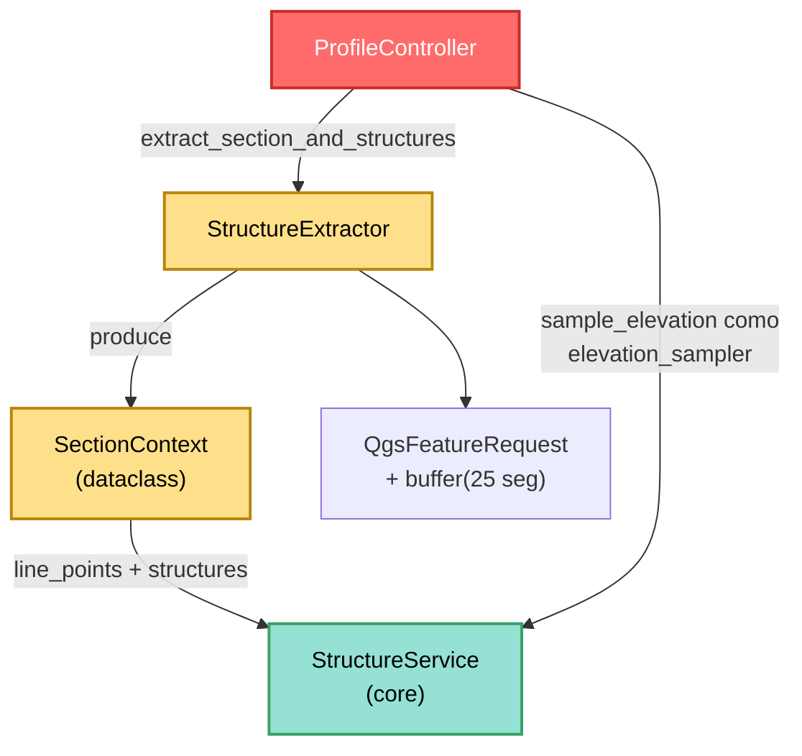

---
tags:
  - secinterp
  - code-walkthrough
  - gui
  - adapters
aliases:
  - structure_extractor.py
  - StructureExtractor
  - SectionContext
cssclass: secinterp-note
---

# `gui/adapters/structure_extractor.py`

> [!abstract] Resumen en una línea
> Adaptador **Extract** de estructuras que lee la línea de sección y la capa de mediciones, filtra por buffer, desconecta puntos y atributos a primitivos (`SectionContext`) y muestrea elevaciones DEM para que `StructureService` nunca toque QGIS.

**Ruta**: `gui/adapters/structure_extractor.py` (226 líneas)
**Clase principal**: `StructureExtractor` (+ dataclass `SectionContext`)
**Capa**: GUI · Adapter (lado Extract, depende de QGIS)
**Tags**: #secinterp #gui #adapters

---

## 🎯 ¿Por qué existe este archivo?

Proyectar una medición estructural (rumbo/buzamiento) sobre la sección exige
saber dónde cae respecto a la línea, con qué atributos y a qué cota. Esas tres
piezas viven en objetos QGIS que el core no puede importar:

| Problema | Solución |
|----------|----------|
| El core no puede leer `QgsVectorLayer` ni `QgsFeatureRequest` | `extract_section_and_structures` devuelve `SectionContext` puro |
| Solo importan las mediciones cercanas a la sección | `detach_structures` filtra por buffer + `intersects` exacto |
| Las geometrías pueden ser puntos, líneas o polígonos | `_feature_point` unifica: punto directo o centroide |
| La cota debe venir del DEM en tiempo de proyección | `sample_elevation(raster_lyr, x, y, band)` + callback al core |

> [!important] Nota arquitectónica
> **Adapter Extract** con DTO propio (`SectionContext`, no reutiliza
> `task_inputs.py`): `line_points`, `line_start`, `line_azimuth` y `structures`
> como `{"point": (x, y), "attributes": {...}}`. El `controller` además usa
> `sample_elevation` como **`elevation_sampler`** (callback `Callable`) que
> inyecta a `StructureService.project_structures` — ver [[structure_service]].

---

## 🧬 Diagrama de relaciones



> [!tip] Cómo leer
> Doble entrega a `StructureService`: el `SectionContext` (datos) y el callback
> `sample_elevation` (muestreo DEM bajo demanda). Ambos los produce este módulo.

---

## 📦 Imports — lectura arquitectónica

```python
# gui/adapters/structure_extractor.py
from __future__ import annotations

import math
from dataclasses import dataclass, field
from typing import Any

from qgis.core import (
    QgsFeature,
    QgsFeatureRequest,
    QgsGeometry,
    QgsRaster,
    QgsRasterLayer,
    QgsVectorLayer,
    QgsWkbTypes,
)
```

| # | Observación |
|---|-------------|
| ① | Siete clases `qgis.core` pero **sin** `QgsProject`, `QgsDistanceArea` ni `QgsPointXY` a nivel de módulo (`QgsPointXY` se importa en diferido dentro de `sample_elevation`). |
| ② | Sin `qgis.PyQt` y sin `self.tr()`: es el único extractor grande **sin i18n** — no hay mensajes de usuario, los fallos son `None`/`[]`/`0.0` silenciosos. |
| ③ | Sin imports del core (ni DTOs, ni excepciones, ni `scu`): el módulo más autocontenido del paquete; a cambio duplica sanitización de atributos (ver `_extract_attributes`). |
| ④ | `dataclass` + `field` para `SectionContext` (con `default_factory=list`: evita el clásico mutable-default). |
| ⑤ | `QgsWkbTypes` distingue `PointGeometry` (punto directo) del resto (centroide). |
| ⑥ | `math` de nuevo solo para el azimut (`atan2`), idéntico al de sondajes y geología. |

---

## 🏗️ Inventario de estructura

**Dataclass:** `SectionContext` — 4 campos con defaults.

| Campo | Tipo | Default | Significado |
|-------|------|---------|-------------|
| `line_points` | `list[tuple[float, float]]` | `[]` | vértices de la sección |
| `line_start` | `tuple[float, float]` | `(0.0, 0.0)` | primer vértice |
| `line_azimuth` | `float` | `0.0` | rumbo compass |
| `structures` | `list[dict[str, Any]]` | `[]` | `{"point", "attributes"}` desacopladas |

**Clase:** `class StructureExtractor` — 9 métodos (4 públicos + 5 privados).

**Métodos públicos:**
- `extract_section_and_structures(line_lyr, struct_lyr, buffer_m)` — orquestador → `SectionContext | None`.
- `extract_line(line_geom)` — `(line_points, line_start, line_azimuth)` desde una geometría (reutilizable sin capa).
- `detach_structures(struct_lyr, line_geom, buffer_m)` — buffer + desconexión → lista de dicts.
- `sample_elevation(raster_lyr, x, y, band_number=1)` — cota puntual o `0.0`.

**Métodos privados:**
- `_read_line_geometry(line_lyr)` — primera feature; `None` si falta o nula.
- `_extract_line_points(geometry)` — tuplas desde simple/multipart (primera parte).
- `_calculate_azimuth(points)` — rumbo desde los dos primeros vértices (`0.0` si < 2).
- `_feature_point(feature)` — `(x, y)` representativo (punto o centroide).
- `_extract_attributes(feature)` — dict sanitizado (`None`/`NULL` → `None`, resto a primitivos o `str`).

---

## 📁 Archivos del paquete

El extractor vive en el paquete `gui/adapters/` (fase Extract completa):

| Archivo | Líneas | Rol |
|---|--:|---|
| `__init__.py` | 7 | Docstring del paquete: contrato Extract-then-Compute |
| `drillhole_extractor.py` | 369 | `DrillholeExtractor` → `DrillholeContext` |
| `geology_extractor.py` | 235 | `GeologyExtractor` → `GeologyContext` |
| `geometry.py` | 226 | Helpers QGIS de geometría y muestreo DEM |
| `layer_resolver.py` | 113 | `LayerResolver` + `resolve_layer` (caché de capas) |
| `structure_extractor.py` | 226 | `SectionContext` + `StructureExtractor` (esta nota) |
| `validation_extractor.py` | 176 | `resolve_layer_metadata`, `build_validation_params` |
| `feature_fetcher.py` | 84 | `DataFetcher` (lecturas bulk de hijas) |
| `profile_extractor.py` | 86 | `ProfileExtractor` → `ProfileData` |

---

## 📖 Recorrido método por método

### `extract_section_and_structures` — orquestador Extract

```python
def extract_section_and_structures(self, line_lyr, struct_lyr, buffer_m):
    line_geom = self._read_line_geometry(line_lyr)
    if line_geom is None:
        return None
    line_points, line_start, line_azimuth = self.extract_line(line_geom)
    structures = self.detach_structures(struct_lyr, line_geom, buffer_m)
    return SectionContext(
        line_points=line_points,
        line_start=line_start,
        line_azimuth=line_azimuth,
        structures=structures,
    )
```

Tres pasos sin validación de campos (las mediciones se validan después en el
core, nivel 3): línea → línea descompuesta → estructuras. Sin línea válida,
`None`. La capa de estructuras puede ser `None`/inválida: `detach_structures`
devuelve `[]` sin error.

### `extract_line` — descomposición reutilizable

```python
def extract_line(self, line_geom):
    line_points = self._extract_line_points(line_geom)
    line_start = line_points[0] if line_points else (0.0, 0.0)
    line_azimuth = self._calculate_azimuth(line_points)
    return line_points, line_start, line_azimuth
```

Opera sobre una geometría ya leída (no sobre la capa): testeable con una
`QgsGeometry` mockeada y reutilizable por cualquiera que ya tenga la línea.
Defensiva ante línea vacía (`(0.0, 0.0)`, `0.0`).

### `detach_structures` — buffer y desconexión

```python
def detach_structures(self, struct_lyr, line_geom, buffer_m):
    if not struct_lyr or not struct_lyr.isValid():
        return []
    buffer_geom = line_geom.buffer(buffer_m, 25)
    request = QgsFeatureRequest().setFilterRect(buffer_geom.boundingBox())
    detached: list[dict[str, Any]] = []
    for feature in struct_lyr.getFeatures(request):
        if not feature.hasGeometry() or not feature.geometry().intersects(buffer_geom):
            continue
        point = self._feature_point(feature)
        if point is None:
            continue
        detached.append(
            {
                "point": point,
                "attributes": self._extract_attributes(feature),
            }
        )
    return detached
```

Mismo doble filtro que sondajes (bbox barato + `intersects` exacto) pero con
**25 segmentos** de buffer (más suave que los 8 de sondajes: las estructuras se
proyectan visualmente y el borde importa). Sin reproyección por CRS aquí (a
diferencia de `_prepare_feature_request` de sondajes): asume mismo CRS.

### `sample_elevation` — cota DEM bajo demanda

```python
def sample_elevation(self, raster_lyr, x, y, band_number=1):
    if not raster_lyr or not raster_lyr.isValid():
        return 0.0
    try:
        from qgis.core import QgsPointXY
        ident = raster_lyr.dataProvider().identify(
            QgsPointXY(x, y), QgsRaster.IdentifyFormat.IdentifyFormatValue
        )
        if ident.isValid():
            val = ident.results().get(band_number)
            if val is not None:
                return float(val)
    except (AttributeError, ValueError, TypeError):
        pass
    return 0.0
```

Gemela de `geometry.sample_point_elevation` (misma API `identify`, mismo
`0.0` de fallo) pero como **método inyectable**: el `controller` la pasa como
`elevation_sampler` al core (`controller.py:327`, dentro de
`_process_structures`). El import diferido de `QgsPointXY` evita cargarlo a
nivel de módulo.

### `_read_line_geometry` — primera feature

```python
def _read_line_geometry(self, line_lyr):
    line_feat = next(line_lyr.getFeatures(), None)
    if not line_feat:
        return None
    line_geom = line_feat.geometry()
    if not line_geom or line_geom.isNull():
        return None
    return line_geom
```

Idéntica en espíritu a la de sondajes, pero aquí la capa vacía también es
`None` silencioso (no `DataMissingError`): este módulo no importa excepciones
del core.

### `_extract_line_points` / `_calculate_azimuth` — vértices y rumbo

```python
def _extract_line_points(self, geometry):
    if geometry.isMultipart():
        parts = geometry.asMultiPolyline()
        polyline = parts[0] if parts else []
    else:
        polyline = geometry.asPolyline()
    return [(p.x(), p.y()) for p in polyline]

def _calculate_azimuth(self, points):
    MIN_REQUIRED_POINTS = 2
    if len(points) < MIN_REQUIRED_POINTS:
        return 0.0
    p1, p2 = points[0], points[1]
    azimuth = math.degrees(math.atan2(p2[0] - p1[0], p2[1] - p1[1]))
    if azimuth < 0:
        azimuth += 360
    return azimuth
```

Tercera copia del mismo par línea→tuplas + azimut (sondajes, geología,
estructuras): el trío comparte forma pero no código — candidato a factorizar en
`geometry.py`.

### `_feature_point` — punto representativo

```python
def _feature_point(self, feature: QgsFeature) -> tuple[float, float] | None:
    geom = feature.geometry()
    if not geom or geom.isNull():
        return None
    if geom.type() == QgsWkbTypes.GeometryType.PointGeometry:
        pt = geom.asPoint()
    else:
        centroid = geom.centroid()
        if centroid.isNull():
            return None
        pt = centroid.asPoint()
    return (pt.x(), pt.y())
```

Puntos → coordenadas directas; líneas/polígonos → centroide (una medición
dibujada como tramo corto sigue siendo proyectable). Centroide nulo → `None` y
la feature se omite.

### `_extract_attributes` — sanitización propia

```python
def _extract_attributes(self, feature: QgsFeature) -> dict[str, Any]:
    if not hasattr(feature, "fields"):
        return {}
    names = feature.fields().names()
    raw_values = feature.attributes()
    sanitized: dict[str, Any] = {}
    for name, val in zip(names, raw_values, strict=False):
        if val is None or str(val) == "NULL":
            sanitized[name] = None
        elif isinstance(val, int | float | str | bool):
            sanitized[name] = val
        else:
            sanitized[name] = str(val)
    return sanitized
```

Replica lo que `scu.extract_feature_attributes` hace para los otros extractores
(`NULL` de QGIS → `None`, primitivos intactos, resto a `str`), pero implementado
a mano aquí en vez de reutilizar `scu`. El `zip(..., strict=False)` tolera
desalineaciones campo/valor.

---

## 🔄 Flujo de datos

| Fase | Entrada | Transformación | Salida |
|------|---------|----------------|--------|
| Línea | 1ª feature | `_read_line_geometry` → `extract_line` | `line_points`, `line_start`, `line_azimuth` |
| Buffer | `line_geom` + `buffer_m` | `buffer(buffer_m, 25)` + bbox | `QgsFeatureRequest` |
| Filtro | features candidatas | `hasGeometry` + `intersects` | features cercanas |
| Punto | feature | punto o centroide | `(x, y)` o descarte |
| Atributos | feature | `_extract_attributes` | dict sanitizado |
| Contexto | todo lo anterior | dataclass | `SectionContext` puro |
| Cota ( diferido ) | `(x, y)` + DEM | `identify` vía callback | `float` al core |

---

## 🏛️ Patrones de diseño presentes

| Patrón | Dónde | Propósito |
|--------|-------|-----------|
| **Adapter (Extract)** | todo el módulo | QGIS entra, primitivos salen |
| **DTO propio** | `SectionContext` | Contrato tipado sin depender de `task_inputs` |
| **Strategy (callback)** | `sample_elevation` como `elevation_sampler` | El core muestrea sin conocer el raster |
| **Doble filtro espacial** | bbox + `intersects` | Rendimiento + precisión |

---

## 🧾 Resumen de la API

| Símbolo | Firma / Hereda | Uso típico |
|---------|----------------|------------|
| `SectionContext` | `@dataclass` (`line_points`, `line_start`, `line_azimuth`, `structures`) | DTO Extract→Compute |
| `StructureExtractor` | clase GUI sin dependencias | `StructureExtractor()` |
| `extract_section_and_structures` | `(line_lyr, struct_lyr, buffer_m) -> SectionContext \| None` | Punto de entrada |
| `extract_line` | `(line_geom) -> tuple[list, tuple, float]` | Descomposición reutilizable |
| `detach_structures` | `(struct_lyr, line_geom, buffer_m) -> list[dict]` | Desconexión filtrada |
| `sample_elevation` | `(raster_lyr, x, y, band_number=1) -> float` | Callback `elevation_sampler` |

---

## 🛡️ Manejo de errores

| Situación | Comportamiento |
|-----------|----------------|
| Línea sin features o geometría nula | `return None` (silencioso) |
| Capa de estructuras ausente/inválida | `[]` (silencioso) |
| Feature sin geometría o fuera del buffer | `continue` |
| Geometría sin punto representable | se omite |
| Raster inválido / `identify` inválido / valor `None` | `0.0` |
| Feature sin `fields` | `{}` |

> [!warning] Silencio total
> Ningún fallo levanta excepción ni escribe log: un `SectionContext` con
> `structures=[]` puede significar "sin capa", "capa vacía" o "nada en el
> buffer". La GUI no puede distinguirlos sin instrumentación adicional.

---

## 🧪 Tests asociados

Sin tests unitarios dedicados en `tests/gui/`; cobertura indirecta:

- `tests/integration/test_geology_structure_workflow.py` — flujo estructura integrado (extract + `StructureService`).
- `tests/integration/test_3d_integration_advanced.py` — estructuras en el pipeline 3D.
- `tests/core/test_structure_service.py` — consumidor core con `elevation_sampler` mockeado (un lambda, no este método).
- `tests/core/test_structural_parsing_advanced.py` — parseo de rumbo/buzamiento sobre atributos como los de aquí.
- `tests/base_test.py` — mocks QGIS para un futuro `test_structure_extractor.py`.

> [!warning] Hueco de cobertura
> `_feature_point` (punto vs centroide vs nulo), `_extract_attributes`
> (conversión `NULL`) y `detach_structures` (filtro buffer) son casos mock-first
> de manual sin test que los cubra.

---

## 🧵 Thread-safety e i18n

| Aspecto | Detalle |
|---------|---------|
| **Hilo** | Hilo principal: `getFeatures`, `buffer`, `intersects`, `identify` usan objetos vivos. Al `QgsTask` solo viajan `SectionContext` y el callback. |
| **Callback** | `sample_elevation` se ejecuta donde el core la invoque: debe llamarse desde el hilo principal o con un DEM thread-safe (ver [[structure_service]]). |
| **i18n** | Ausente por diseño: sin `qgis.PyQt`, sin `tr()`, sin mensajes. Si se añade validación con mensajes, seguir el patrón `QCoreApplication.translate("StructureExtractor", ...)` de los extractores hermanos. |

---

## 📐 `SectionContext` frente a los DTOs de `task_inputs`

| Aspecto | `SectionContext` (aquí) | `DrillholeContext` / `GeologyContext` (`task_inputs.py`) |
|---------|-------------------------|-----------------------------------------------------------|
| Definición | dataclass en el adapter GUI | dataclasses en `core/domain` |
| Dependencia | importable solo con QGIS | QGIS-agnósticas |
| `line_start` | tupla `(x, y)` | `GeologyContext` no lo lleva (usa `line_start` interno QGIS) |
| Consumidor | `StructureService.project_structures` (vía controller) | `DrillholeService` / `GeologyService` |

> [!note] ¿Por qué no está en el core?
> `SectionContext` solo contiene primitivos y *podría* vivir en `task_inputs.py`
> junto a sus hermanos. Mantenerlo aquí acopla el contrato al adapter; moverlo
> al core unificaría los DTOs Extract en un solo paquete.

---

## 👀 Observaciones y notas

> [!success] Fortalezas
> - `extract_line` separable y testeable sin capa (solo geometría).
> - `_feature_point` tolera capas no puntuales vía centroide.
> - Buffer de 25 segmentos: borde suave para proyección visual.
> - `sample_elevation` inyectable como callback (frontera limpia con el core).

> [!warning] Puntos de atención
> - Tercer duplicado de `_extract_line_points` + `_calculate_azimuth`: factorizar a `geometry.py`.
> - `_extract_attributes` duplica `scu.extract_feature_attributes` sin reutilizarlo.
> - Sin reproyección por CRS (sondajes sí la tiene): capas en distinto CRS se filtran mal en silencio.
> - Cero i18n y cero log: fallos indistinguibles entre sí.

> [!question] Preguntas abiertas
> - ¿Mover `SectionContext` a `core/domain/task_inputs.py`?
> - ¿Reutilizar `scu.extract_feature_attributes` en `_extract_attributes`?
> - ¿Añadir `target_crs` como en sondajes para capas multi-CRS?

---

## 🔗 Notas relacionadas

- [[Index]] — índice de la bóveda
- [[gui_adapters]] — nota de paquete de los adapters Extract
- [[structure_service]] — consumidor core + contrato `elevation_sampler`
- [[controller]] — `ProfileController._process_structures` (líneas ~316-327)
- [[task_inputs]] — DTOs hermanos (`DrillholeContext`, `GeologyContext`)
- [[drillhole_extractor]] — extractor hermano (doble filtro + buffer análogos)
- [[core_validation]] — validación de nivel 3 que el core aplica después
- [[measurement]] — entidad de medición estructural del dominio

---

*Nota de la bóveda SecInterp Code Walkthrough v2 — v3.8.0*
