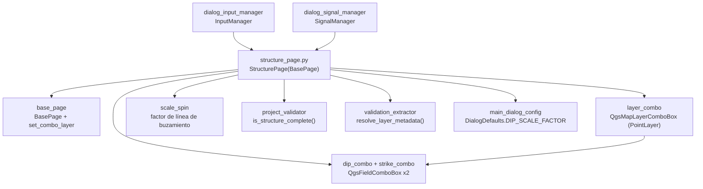

---
tags:
  - secinterp
  - code-walkthrough
  - gui
  - pages
aliases:
  - structure_page.py
  - StructurePage
cssclass: secinterp-note
---

# `gui/ui/pages/structure_page.py`

> [!abstract] Resumen en una línea
> Página de mediciones estructurales: capa de puntos con filtro moderno/clásico, combos de buzamiento y rumbo con refresco conjunto, factor de escala de línea de buzamiento y señal `dataChanged`.

**Ruta**: `gui/ui/pages/structure_page.py` (166 líneas)
**Clase principal**: `StructurePage(BasePage)`
**Capa**: GUI (presentación programática · Extract hacia `ValidationParams`)
**Tags**: #secinterp #gui #pages

---

## 🎯 ¿Por qué existe este archivo?

Las mediciones de rumbo y buzamiento se proyectan sobre la sección como líneas de
buzamiento. La página concentra la fase Extract de ese dominio: qué capa de puntos
y qué campos de dip/strike alimentan al `StructureService` del core.

| Problema | Solución |
|----------|----------|
| El usuario debe elegir capa de puntos y los dos campos angulares (dip 0–90, strike 0–360) | `layer_combo` + `dip_combo` + `strike_combo` con tooltips de rango |
| Al cambiar de capa hay que refrescar **ambos** combos de campo a la vez | `_on_layer_changed` fija la capa en los dos combos de un paso |
| El tamaño de dibujo de las líneas de buzamiento debe ser ajustable | `scale_spin` (0.1–100, defecto `DIP_SCALE_FACTOR`) |
| El diálogo debe revalidar ante cualquier cambio | Señal propia `dataChanged` desde capa y ambos campos |

> [!important] Nota arquitectónica
> Extract con callback diferido: la página entrega capa y campos, y el core recibe
> además un `elevation_sampler` inyectado por la GUI (ver `IStructureService`).
> Aquí no se muestrea nada: solo se configura el origen de las mediciones.

---

## 🧬 Diagrama de relaciones



> [!tip] Cómo leer
> Flecha sólida = importa/delega; `LC → DC` es `_on_layer_changed` (un paso, dos combos).

---

## 📦 Imports — lectura arquitectónica

```python
# gui/ui/pages/structure_page.py
from __future__ import annotations

import contextlib
from typing import Any

from qgis.core import QgsMapLayerProxyModel
from qgis.gui import QgsDoubleSpinBox, QgsFieldComboBox, QgsMapLayerComboBox
from qgis.PyQt.QtCore import QCoreApplication, pyqtSignal
from qgis.PyQt.QtWidgets import QGridLayout, QLabel

from sec_interp.core.validation.project_validator import ProjectValidator, ValidationParams
from sec_interp.gui.adapters.validation_extractor import resolve_layer_metadata
from sec_interp.gui.main_dialog_config import DialogDefaults

from .base_page import BasePage, set_combo_layer
```

| # | Observación |
|---|-------------|
| ① | `QgsMapLayerProxyModel` como fallback del filtro de puntos (trío consistente con [[geology_page]] y [[section_page]]). |
| ② | Dos `QgsFieldComboBox` (`dip_combo`, `strike_combo`): la única página simple con dos campos a refrescar. |
| ③ | `pyqtSignal` para `dataChanged`; `contextlib` + `try/except` mezclados en `disconnect_signals`. |
| ④ | `DialogDefaults.DIP_SCALE_FACTOR` (`"4"`) para el spin: sin hardcodeo del defecto en esta página. |
| ⑤ | Frontera Extract completa: validador + extractor + defecto centralizados. |

---

## 🏗️ Inventario de estructura

**Clase `StructurePage(BasePage)`:**

- Señal `dataChanged = pyqtSignal()` y `layer_keys = frozenset({"struct_layer"})`
- `__init__(self, parent: Any = None) -> None`
- `_setup_ui(self) -> None` — rejilla de 4 filas + cableado directo
- `_on_layer_changed(self, layer: Any) -> None`
- `get_data(self) -> dict[str, Any]` — `structural_layer/dip_field/strike_field/dip_scale_factor`
- `dump(self) -> dict[str, Any]` — `struct_layer/struct_dip_field/struct_strike_field/dip_scale_factor`
- `load(self, data: dict[str, Any]) -> None`
- `reset(self) -> None`
- `is_complete(self) -> bool` — vía `is_structure_complete`
- `disconnect_signals(self) -> None` (sin `connect_signals` propio)

**Widgets:**

| Widget | Tipo | Rol |
|--------|------|-----|
| `layer_combo` | `QgsMapLayerComboBox` | Capa de puntos (filtro `PointLayer`, permite vacía) |
| `dip_combo` | `QgsFieldComboBox` | Campo de buzamiento (0–90) |
| `strike_combo` | `QgsFieldComboBox` | Campo de rumbo (0–360) |
| `scale_spin` | `QgsDoubleSpinBox` 0.1–100, paso 0.5 | Factor de longitud de línea de buzamiento |
| `group_layout` | `QGridLayout` (espaciado 6) | Rejilla de 4 filas |

---

## 📖 Recorrido método por método

### `__init__` — título estructural

```python
def __init__(self, parent: Any = None) -> None:
    super().__init__(
        QCoreApplication.translate("StructurePage", "Structural Measurements"),
        parent,
    )
```

Sin `iface` ni estado propio. El contexto `"StructurePage"` agrupa título y las
cuatro etiquetas de fila.

### `_setup_ui` — cuatro filas y cableado inmediato

```python
def _setup_ui(self) -> None:
    super()._setup_ui()

    self.group_layout = QGridLayout(self.group_box)
    self.group_layout.setSpacing(6)

    # Row 0: Structural Layer
    self.group_layout.addWidget(QLabel(self.tr("Structural Layer")), 0, 0)

    self.layer_combo = QgsMapLayerComboBox()

    # Use modern flags if available (QGIS 3.32+)
    try:
        from qgis.core import Qgis  # noqa: PLC0415

        self.layer_combo.setFilters(Qgis.LayerFilters(Qgis.LayerFilter.PointLayer))
    except (ImportError, AttributeError, TypeError):
        self.layer_combo.setFilters(QgsMapLayerProxyModel.Filter.PointLayer)

    # ... allow-empty + tooltip + índice 0 ...
    # Row 1: "Dip Field" + dip_combo ("dip values (0-90)")
    # Row 2: "Strike Field" + strike_combo ("strike values (0-360)")
    # Row 3: "Dip Line Scale" + scale_spin (0.1-100, DIP_SCALE_FACTOR, paso 0.5)

    # Connections: update fields when layer changes
    self.layer_combo.layerChanged.connect(self._on_layer_changed)

    # Emit dataChanged when selections change
    self.layer_combo.layerChanged.connect(self.dataChanged.emit)
    self.dip_combo.fieldChanged.connect(self.dataChanged.emit)
    self.strike_combo.fieldChanged.connect(self.dataChanged.emit)
```

La rareza de la página: conecta sus cuatro señales **aquí**, no en
`connect_signals` (que hereda el `pass` de la base). Consecuencia: si
`SignalManager` llama a `connect_signals()` esperando cablear, no hace nada; y si
alguien re-ejecuta `_setup_ui`, las conexiones se duplican. Ver observaciones.

### `_on_layer_changed` — refresco conjunto de campos

```python
def _on_layer_changed(self, layer: Any) -> None:
    """Update both field combos when layer changes."""
    self.dip_combo.setLayer(layer)
    self.strike_combo.setLayer(layer)
```

Un slot para dos combos: garantiza que dip y strike siempre describen la misma
capa (con dos conexiones separadas a `setLayer` podrían divergir si una falla).
Recibe la capa que emite `layerChanged` como argumento, sin leer el combo.

### `get_data` — cuatro claves

```python
def get_data(self) -> dict[str, Any]:
    """Get structural configuration."""
    return {
        "structural_layer": self.layer_combo.currentLayer(),
        "dip_field": self.dip_combo.currentField(),
        "strike_field": self.strike_combo.currentField(),
        "dip_scale_factor": self.scale_spin.value(),
    }
```

Capa viva + dos campos + factor numérico. `InputManager` los mapea a
`struct_layer/struct_dip_field/struct_strike_field/dip_scale_factor` del
`ValidationParams`; el core además recibe el `elevation_sampler` desde el
orquestador (no desde esta página).

### `dump` / `load` — renombrado `structural_` → `struct_`

```python
def dump(self) -> dict[str, Any]:
    return {
        "struct_layer": self.layer_combo.currentLayer(),
        "struct_dip_field": self.dip_combo.currentField(),
        "struct_strike_field": self.strike_combo.currentField(),
        "dip_scale_factor": self.scale_spin.value(),
    }

def load(self, data: dict[str, Any]) -> None:
    struct_layer = data.get("struct_layer")
    if struct_layer is not None:
        set_combo_layer(self.layer_combo, struct_layer)
        self.dip_combo.setLayer(struct_layer)
        self.strike_combo.setLayer(struct_layer)
    dip = data.get("struct_dip_field")
    if dip:
        self.dip_combo.setField(dip)
    # ... igual para struct_strike_field ...
    dip_scale = data.get("dip_scale_factor")
    if dip_scale is not None:
        self.scale_spin.setValue(float(dip_scale))
```

Como en [[geology_page]], `load` fija la capa en silencio y propaga a **ambos**
combos en el mismo paso (sin esperar a `layerChanged`, bloqueada). Los campos
solo se aplican si son no vacíos; el factor, si no es `None`.

### `reset` — vaciar y factor a defecto

```python
def reset(self) -> None:
    self.layer_combo.setLayer(None)
    self.dip_combo.setField("")
    self.strike_combo.setField("")
    self.scale_spin.setValue(float(DialogDefaults.DIP_SCALE_FACTOR))
```

Vacía capa y ambos campos, y restaura el factor a `"4"`. `setLayer(None)` dispara
`layerChanged` → `_on_layer_changed(None)` limpia ambos combos: cascada de
limpieza bienvenida, igual que en [[dem_page]] y [[geology_page]].

### `is_complete` — capa más dos campos

```python
def is_complete(self) -> bool:
    data = self.get_data()
    params = ValidationParams(
        struct_layer=resolve_layer_metadata(data["structural_layer"]),
        struct_dip_field=data["dip_field"],
        struct_strike_field=data["strike_field"],
    )
    return ProjectValidator.is_structure_complete(params)
```

`is_structure_complete` exige capa + dip + strike antes de validar con
`StructureValidator`. La regla de [[dialog_input_manager]] lo refleja:
`is_structure_complete(p) if p.struct_layer else True` — sin capa, bloque omitido.

### `disconnect_signals` — mixto `try` + `suppress`

```python
def disconnect_signals(self) -> None:
    try:
        self.layer_combo.layerChanged.disconnect(self._on_layer_changed)
        self.layer_combo.layerChanged.disconnect(self.dataChanged.emit)
    except (TypeError, RuntimeError):
        pass
    with contextlib.suppress(TypeError, RuntimeError):
        self.dip_combo.fieldChanged.disconnect(self.dataChanged.emit)
    with contextlib.suppress(TypeError, RuntimeError):
        self.strike_combo.fieldChanged.disconnect(self.dataChanged.emit)
    with contextlib.suppress(TypeError, RuntimeError):
        self.dataChanged.disconnect()
```

Mezcla el `try/except` global (estilo [[dem_page]]) para `layerChanged` con
`suppress` por línea (estilo [[geology_page]]) para el resto, más el
`dataChanged.disconnect()` global. Revierte exactamente las cuatro conexiones de
`_setup_ui`.

---

## 🗂️ Claves de lectura frente a claves de sesión

| Origen | Capa | Campos | Factor |
|--------|------|--------|--------|
| `get_data` | `structural_layer` (viva) | `dip_field / strike_field` | `dip_scale_factor` |
| `dump` / `load` | `struct_layer` | `struct_dip_field / struct_strike_field` | `dip_scale_factor` (igual) |
| `layer_keys` | `{"struct_layer"}` | — (primitivos) | — (primitivo) |
| `InputManager` | `struct_layer` (`LayerMetadata`) | `struct_dip/strike_field` | `dip_scale_factor` |

---

## 🧩 Ciclo de vida en el diálogo

| Momento | Quién | Qué hace con la página |
|---------|-------|------------------------|
| Construcción | [[main_window]] / diálogo | `StructurePage()` en el `QStackedWidget`, entrada "Structural" en [[sidebar]] |
| Cableado | — (la página ya se auto-conectó en `_setup_ui`) | `connect_signals()` heredado no hace nada |
| Edición | usuario | capa o campos → `dataChanged` → el diálogo revalida |
| Preview | `InputManager` | bloque opcional: sin capa se omite |
| Validación total | `validate_inputs` | `struct_*/dip_scale_factor` al `StructureValidator` |
| Sesión | persistencia | `dump()` guarda `struct_*`; `load()` restaura en silencio |
| Cierre | `SignalManager` | `disconnect_signals()` mixto |

---

## 🔄 Flujo de datos

| Fase | Entrada | Transformación | Salida |
|------|---------|----------------|--------|
| Selección | proyecto QGIS | filtro de puntos + vacía permitida | `layer_combo.currentLayer()` |
| Cascada | `layerChanged` | `_on_layer_changed` + `dataChanged.emit` | dos combos frescos + aviso |
| Campos | capa activa | `fieldChanged → dataChanged.emit` (×2) | diálogo revalida |
| Factor | usuario | spin 0.1–100 | `dip_scale_factor` |
| Lectura | widgets | `get_data()` | 4 claves con capa viva |
| Completitud | capa + 2 campos | `resolve_layer_metadata` + `is_structure_complete` | `bool` (omite sin capa) |
| Persistencia | widgets | `dump()` | `struct_*/dip_scale_factor` |
| Restauración | dict + capa resuelta | `set_combo_layer` + `setLayer/setField/setValue` | widgets restaurados |

---

## 🏛️ Patrones de diseño presentes

| Patrón | Dónde | Propósito |
|--------|-------|-----------|
| **Observer (Qt signals)** | `layerChanged` → 2 slots | Refresco conjunto + aviso |
| **Compat / fallback** | filtro moderno → clásico | QGIS < 3.32 sin bifurcar |
| **Signal relay** | `dataChanged.emit` como slot (×3) | Reemisión sin métodos intermedios |
| **Extract-then-Compute** | `is_complete` + `elevation_sampler` externo | El core proyecta sin QGIS |

---

## 🧾 Resumen de la API

| Símbolo | Firma / Hereda | Uso típico |
|---------|----------------|------------|
| `StructurePage` | `(BasePage)` | pestaña "Structural" del `QStackedWidget` |
| `dataChanged` | `pyqtSignal()` | el diálogo revalida al emitir |
| `layer_keys` | `frozenset({"struct_layer"})` | namespace de persistencia |
| `get_data` | 4 claves con capa viva | lectura para `InputManager` |
| `dump` | `struct_*/dip_scale_factor` | sesión |
| `is_complete` | vía `is_structure_complete` | opcional-pero-coherente |
| `_on_layer_changed` | `(layer) -> None` | refresco conjunto de campos |

---

## 🛡️ Manejo de errores

- Sin capa: bloque opcional (regla `… if p.struct_layer else True`); con capa pero sin campos, `is_complete` es `False`.
- `load` con campos vacíos: no toca los combos; con factor `None`: conserva el actual.
- `scale_spin` acotado 0.1–100: sin factores cero/negativos que colapsen el dibujo.
- Desconexión mixta blindada: `try` global para capa + `suppress` por campo + global de `dataChanged`.

---

## 🧪 Tests asociados

No existe un `tests/gui/test_structure_page.py` dedicado; la cobertura es
indirecta:

- `tests/gui/test_dialog_input_manager.py` — `get_validation_params()` incluye `struct_layer/struct_dip_field/struct_strike_field/dip_scale_factor`; regla `structure`.
- `tests/gui/test_main_dialog_validation_manager.py` — mensaje `"Structure configuration is incomplete"`.
- `tests/gui/test_main_dialog_core.py` — construcción del diálogo con la página estructural.
- `tests/gui/test_multi_session_persistence.py` — round-trip con `struct_*` + `dip_scale_factor`.
- `tests/gui/test_signal_restoration.py` — las cuatro conexiones sobreviven a reconexiones.

| Aspecto a testear | Estado |
|-------------------|--------|
| `get_data/dump/load/reset` | sin test dedicado; cubierto vía diálogo |
| `_on_layer_changed` refresca ambos | sin test dedicado (slot de 2 líneas, fácil) |
| Cableado en `_setup_ui` (no en `connect`) | sin test que fije la asimetría como intencional |
| `is_complete` sin strike | cubierto vía `StructureValidator` en `tests/core/` |

---

## 🌐 i18n y notas de migración

- Etiquetas con `self.tr("Structural Layer"/"Dip Field"/"Strike Field"/"Dip Line Scale")`, tooltips de rango y título con contexto `"StructurePage"`.
- Los rangos `(0-90)` / `(0-360)` viajan dentro del `tr` de los tooltips: traducibles como unidad.
- Mismo filtro moderno/clásico que geología y sección: trío consistente ante QGIS 4.x.

---

## 👀 Observaciones y notas

> [!success] Fortalezas
> - `_on_layer_changed` como slot único para dos combos: dip y strike nunca divergen de capa.
> - `load` propaga a ambos combos en el mismo paso: restauración atómica sin depender de señales.
> - Defecto del spin desde `DialogDefaults` en construcción y reset: sin duplicación (contrástese con [[section_page]]).

> [!warning] Puntos de atención
> - Cableado en `_setup_ui` en vez de `connect_signals`: rompe el contrato del `SignalManager` (re-cablear no conecta; re-construir duplica).
> - `disconnect_signals` mezcla `try` global y `suppress` por línea: dos estilos en un método.
> - Sin test dedicado: el renombrado `structural_*`/`struct_*` y la asimetría de cableado solo los fijan tests de diálogo.
> - Sin `validate()` propio: capa sin campos pasa el Nivel 1 (igual que [[geology_page]]).

> [!question] Preguntas abiertas
> - ¿Mover las cuatro conexiones a `connect_signals()` para cumplir el contrato (como [[geology_page]])?
> - ¿Unificar `disconnect_signals` a `suppress` por línea en todo el método?
> - ¿Añadir `tests/gui/test_structure_page.py` (contrato de claves + `_on_layer_changed` + toggles)?

---

## 🔗 Notas relacionadas

- [[Index]] — índice de la bóveda
- [[base_page]] — protocolo y `set_combo_layer`
- [[gui_ui_pages]] — paquete de páginas
- [[main_window]] — pestaña "Structural" del `QStackedWidget`
- [[sidebar]] — entrada "Structural" (`mIconPointLayer.svg`)
- [[dialog_input_manager]] — regla `structure` y `ValidationParams`
- [[project_validator]] — `is_structure_complete` / `StructureValidator`
- [[validation_extractor]] — `resolve_layer_metadata`
- [[structure_service]] — proyección que configuran estos campos (+ `elevation_sampler`)
- [[core_interfaces]] — `IStructureService` y su callback de elevación
- [[geology_page]] — página hermana (un campo + `dataChanged`)
- [[section_page]] — aporta `buffer_dist` para estructuras vecinas

---

*Nota de la bóveda SecInterp Code Walkthrough v2 — v3.8.0*
