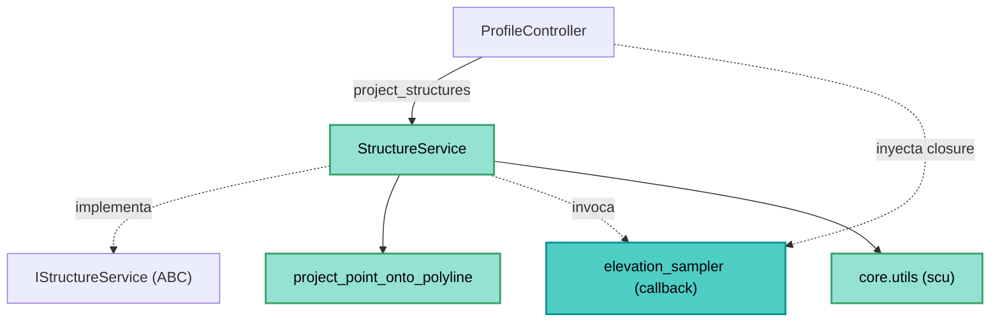

---
tags:
  - secinterp
  - code-walkthrough
  - core
  - services
aliases:
  - structure_service.py
  - StructureService
  - IStructureService
cssclass: secinterp-note
---

# `core/services/structure_service.py`

> [!abstract] Resumen en una línea
> Servicio que **proyecta mediciones estructurales** (planos/líneas) sobre el plano de la sección, calculando estación, elevación (vía callback `elevation_sampler`) y buzamiento aparente, sin importar QGIS.

**Ruta**: `core/services/structure_service.py` (187 líneas)
**Clase principal**: `StructureService(IStructureService, TranslatableMixin)`
**Capa**: Core (QGIS-agnóstico)
**Tags**: #secinterp #core #services

---

## 🎯 ¿Por qué existe este archivo?

Una medición estructural en el mapa (strike/dip) debe proyectarse sobre la sección para
mostrar su buzamiento aparente. El cálculo es matemática pura, pero el **muestreo de
elevación** requiere acceder a un raster — y el core no debe tocar QGIS:

| Problema | Solución |
|----------|----------|
| Proyectar estructuras sobre la sección | `project_point_onto_polyline` (math plana) |
| Obtener elevación sin acoplar al raster | `elevation_sampler` inyectado (callback/Strategy) |
| Calcular buzamiento aparente | `scu.calculate_apparent_dip` |
| Parsear strike/dip robustamente | `scu.parse_strike` / `scu.parse_dip` |

> [!important] Nota arquitectónica
> **QGIS-agnóstico** con **inversión de dependencias real**: el servicio llama
> `elevation_sampler(x, y)` sin saber qué hay detrás. La GUI inyecta una closure que
> accede al raster (ver [[controller]]). El contrato rico `IStructureService` fija esta
> firma.

---

## 🧬 Diagrama de relaciones



> [!tip] Cómo leer
> La flecha punteada `SS -.->|invoca| SAMPLER` es el punto clave: el core **consume** un
> callback cuyo origen es la GUI. El resto son importaciones de math pura.

---

## 📦 Imports — lectura arquitectónica

```python
# core/services/structure_service.py
from collections.abc import Callable
from typing import Any

from sec_interp.core import utils as scu
from sec_interp.core.domain import StructureData, StructureMeasurement
from sec_interp.core.interfaces.structure_interface import IStructureService
from sec_interp.core.utils.geometry_utils.measurement import project_point_onto_polyline
from sec_interp.core.utils.i18n import TranslatableMixin
from sec_interp.logger_config import get_logger
```

| # | Observación |
|---|-------------|
| ① | **Cero `qgis.*`**: solo stdlib, dominio, interfaces y utilidades puras. |
| ② | `from sec_interp.core import utils as scu` agrupa parseo (`parse_strike`, `parse_dip`) y geología (`calculate_apparent_dip`). |
| ③ | `Callable[[float, float], float]` tipa el `elevation_sampler` (contrato del callback). |
| ④ | `project_point_onto_polyline` de `geometry_utils/measurement.py` (math plana). |
| ⑤ | `TranslatableMixin` aporta `self.tr()` para el mensaje de log localizado. |

---

## 🏗️ Inventario de estructura

**Clases:** `class StructureService(IStructureService, TranslatableMixin)` — 3 métodos

**Métodos:**
- `project_structures(line_points, struct_data, elevation_sampler, line_az, dip_field, strike_field) -> StructureData`
- `_process_single_structure(data, line_points, elevation_sampler, line_az, dip_field, strike_field) -> StructureMeasurement | None`
- `_parse_structural_data(attributes, strike_field, dip_field, line_az) -> tuple[float, float, float] | None`

---

## 📖 Recorrido método por método

### `project_structures` — Orquestación

```python
def project_structures(
    self,
    line_points: list[tuple[float, float]],
    struct_data: list[dict[str, Any]],
    elevation_sampler: Callable[[float, float], float],
    line_az: float,
    dip_field: str,
    strike_field: str,
) -> StructureData:
    projected_structs = []
    for item in struct_data:
        measurement = self._process_single_structure(
            item, line_points, elevation_sampler, line_az, dip_field, strike_field,
        )
        if measurement:
            projected_structs.append(measurement)

    projected_structs.sort(key=lambda x: x.distance)
    logger.info(self.tr("Processed {0} structural measurements").format(len(projected_structs)))
    return projected_structs
```

Itera sobre estructuras desacopladas (`{"point", "attributes"}`), delega en
`_process_single_structure`, descarta las `None` (fuera de rango/parse fallido) y ordena
por distancia. Registra un resumen localizado al final.

> [!note] Firma "plana" y explícita
> El método recibe todo por parámetros (vértices, datos, callback, azimut, campos), sin
> ningún DTO-contexto: es el contrato más rico del paquete `interfaces`.

### `_process_single_structure` — Proyección de una estructura

```python
def _process_single_structure(self, data, line_points, elevation_sampler, line_az, dip_field, strike_field):
    point = data.get("point")
    if point is None:
        return None

    proj_dist, proj_pt = project_point_onto_polyline(point, line_points)
    elev = elevation_sampler(proj_pt[0], proj_pt[1])

    parsed_data = self._parse_structural_data(
        data.get("attributes", {}), strike_field, dip_field, line_az
    )
    if not parsed_data:
        return None

    strike, dip_angle, app_dip = parsed_data
    return StructureMeasurement(
        distance=round(proj_dist, 1),
        elevation=round(elev, 1),
        apparent_dip=round(app_dip, 1),
        original_dip=dip_angle,
        original_strike=strike,
        attributes=data.get("attributes", {}),
    )
```

| Paso | Detalle |
|------|---------|
| **Punto** | `data.get("point")`; si falta → `None` |
| **Estación** | `project_point_onto_polyline` → `(proj_dist, proj_pt)` |
| **Elevación** | `elevation_sampler(proj_pt[0], proj_pt[1])` (callback inyectado) |
| **Parseo** | `_parse_structural_data` → `(strike, dip_angle, app_dip)` |
| **DTO** | `StructureMeasurement` con valores `round(..., 1)` |

> [!important] El callback cruza la frontera sin violarla
> El servicio no importa el raster: solo pide `elevation_sampler(x, y)`. La GUI decide
> **cómo** muestrear (closure sobre `sample_elevation`). Inversión de dependencias.

### `_parse_structural_data` — Parseo y validación

```python
def _parse_structural_data(self, attributes, strike_field, dip_field, line_az):
    try:
        strike_raw = attributes.get(strike_field)
        dip_raw = attributes.get(dip_field)
    except (AttributeError, KeyError):
        return None

    strike = scu.parse_strike(strike_raw)
    dip_angle, _ = scu.parse_dip(dip_raw)

    if strike is None or dip_angle is None:
        return None

    MAX_STRIKE = 360
    MAX_DIP_ANGLE = 90
    if not (0 <= strike <= MAX_STRIKE) or not (0 <= dip_angle <= MAX_DIP_ANGLE):
        return None

    app_dip = scu.calculate_apparent_dip(strike, dip_angle, line_az)
    return strike, dip_angle, app_dip
```

| Detalle | Razón |
|---------|-------|
| `try/except AttributeError, KeyError` | `attributes` puede no ser un dict con esos campos |
| `parse_strike`/`parse_dip` | Aceptan cadenas cardinales ("N45E") y numéricos |
| Rango `[0,360]` / `[0,90]` | Valida strike y dip antes de calcular |
| `calculate_apparent_dip` | Buzamiento aparente según el azimut de la sección |

---

## 🔄 Flujo de datos

| Fase | Entrada | Transformación | Salida |
|------|---------|----------------|--------|
| Proyección | `point`, `line_points` | `project_point_onto_polyline` | `(proj_dist, proj_pt)` |
| Elevación | `(x, y)` | `elevation_sampler` | `float` |
| Parseo | `attributes` | `parse_strike`/`parse_dip`/`calculate_apparent_dip` | `(strike, dip, app_dip)` |
| DTO | valores | `StructureMeasurement` | medición ordenada por distancia |

---

## 🏛️ Patrones de diseño presentes

| Patrón | Dónde | Propósito |
|--------|-------|-----------|
| **Strategy (callback)** | `elevation_sampler` | Muestreo de elevación inyectado |
| **Template (contrato)** | `IStructureService` | Fija la firma rica de `project_structures` |
| **Extract-then-Compute** | `struct_data` desacoplado | El extractor produce, el servicio computa |
| **Null Object (guard)** | retornos `None` | Proyección/parseo fallido → se descarta |

---

## 🧾 Resumen de la API

| Símbolo | Firma / Hereda | Uso típico |
|---------|----------------|------------|
| `StructureService` | `IStructureService, TranslatableMixin` | Servicio estructural |
| `project_structures` | `(line_points, struct_data, elevation_sampler, line_az, dip_field, strike_field) -> StructureData` | Proyección principal |
| `_process_single_structure` | `(data, ...) -> StructureMeasurement | None` | Una estructura |
| `_parse_structural_data` | `(attributes, strike_field, dip_field, line_az) -> tuple | None` | Parseo strike/dip |

---

## 🛡️ Manejo de errores

| Situación | Comportamiento |
|-----------|----------------|
| `point` ausente | `return None` |
| `attributes` no válidos | `except (AttributeError, KeyError)` → `None` |
| Strike/dip ilegibles | `parse_*` → `None` → descartado |
| Fuera de rango (0-360 / 0-90) | `return None` |

> [!tip] Parseo "fail-soft"
> No se lanzan excepciones: cualquier estructura inválida se convierte en `None` y se
> omite. El resultado final es la lista de mediciones **válidas**, sin ruido.

---

## 🧪 Tests asociados

Mapeo a `tests/core/test_structure_service.py` (mock-first, sin QGIS):

- `test_structure_service.py` — proyección con un `elevation_sampler` **mock**.
- Se verifica el cálculo de buzamiento aparente y el descarte de estructuras inválidas.
- `tests/core/test_structural_parsing_advanced.py` — parseo de strike/dip.

---

## 👀 Observaciones y notas

> [!success] Fortalezas
> - Inversión de dependencias limpia: el core ignora el raster por completo.
> - Parseo robusto (cardinal + numérico) y validación de rangos.
> - `round(..., 1)` produce valores presentables y estables.
> - Sin estado; thread-safe para `QgsTask`.

> [!warning] Puntos de atención
> - `_process_single_structure` acumula 5 responsabilidades (proyectar, muestrear, parsear, validar, construir) → complejidad ciclomática al límite.
> - El parseo usa `MAX_STRIKE`/`MAX_DIP_ANGLE` como constantes locales en lugar de constantes de módulo.
> - `data.get("point")` asume que `point` siempre es una tupla/objeto con coordenadas.

> [!question] Preguntas abiertas
> - ¿Extraer el muestreo+parseo a un colaborador (`StructureProcessor`) para aligerar `_process_single_structure`?
> - ¿Promover `MAX_STRIKE`/`MAX_DIP_ANGLE` a constantes de módulo?

---

## 🔬 Parseo de strike y dip

`_parse_structural_data` delega en las utilidades de `core/utils/parsing.py`
(expuestas vía `scu`):

| Función | Entrada aceptada | Salida |
|---------|------------------|--------|
| `parse_strike(raw)` | numérico o cardinal ("N45E", "N 45 E") | `float` (grados) o `None` |
| `parse_dip(raw)` | numérico (grados) | `(dip, _)` o `None` |
| `calculate_apparent_dip(strike, dip, line_az)` | grados | `float` (buzamiento aparente) |

> [!tip] Cardinal vs numérico
> `parse_strike` soporta azimuts escritos como rumbo cardinal (convención geológica) o
> como grados. El `None` resultante se convierte en descarte (fail-soft).

## 🧮 El buzamiento aparente

El buzamiento aparente es el ángulo que un plano estructural muestra en el plano de la
sección. Depende de:

| Factor | Variable | Cómo entra |
|--------|----------|------------|
| Strike real | `strike` | orientación del plano en planta |
| Dip real | `dip_angle` | inclinación máxima del plano |
| Azimut de la sección | `line_az` | orientación del corte |

`calculate_apparent_dip(strike, dip_angle, line_az)` aplica la fórmula trigonométrica
estándar (proyección del vector de dip sobre la dirección de la sección). El servicio no
reimplementa la fórmula: la delega a `scu` para mantener la lógica geológica en un único
sitio.

## 🎯 Contrato del callback `elevation_sampler`

La firma `Callable[[float, float], float]` fija el contrato del muestreo:

| Aspecto | Detalle |
|---------|---------|
| **Entrada** | `(x, y)` del punto proyectado (`proj_pt`) |
| **Salida** | elevación `float` |
| **Origen** | closure de la GUI sobre `sample_elevation` |
| **Por qué** | el core no puede importar el raster (regla QGIS-agnóstico) |

> [!important] Punto de proyección vs punto original
> Se muestrea la elevación en `proj_pt` (el punto **sobre** la polilínea), no en el punto
> original del feature. Así la estación (`proj_dist`) y la elevación son coherentes.

## 📐 El DTO `StructureMeasurement`

`_process_single_structure` devuelve un `StructureMeasurement` (`core/domain/entities.py`):

| Campo | Tipo | Valor producido |
|-------|------|-----------------|
| `distance` | `float` | `round(proj_dist, 1)` — estación |
| `elevation` | `float` | `round(elev, 1)` — cota muestreada |
| `apparent_dip` | `float` | `round(app_dip, 1)` — buzamiento aparente |
| `original_dip` | `float` | `dip_angle` — dip real (sin redondear) |
| `original_strike` | `float` | `strike` — strike real |
| `attributes` | `dict` | atributos originales del feature |

> [!tip] Redondeo de presentación vs datos crudos
> `distance`/`elevation`/`apparent_dip` se redondean a 1 decimal (para el dibujo);
> `original_dip`/`original_strike` se conservan crudos (para export/consulta).

## 🔄 Ciclo de vida y composición

El servicio lo instancia el `ProfileController` (vía `SafeLoader.lazy_load`) y se invoca
desde `_process_structures`:

```python
self.structure_service = SafeLoader.lazy_load("...structure_service", "StructureService")
```

| Fase | Detalle |
|------|---------|
| **Composition root** | `controller` carga el servicio de forma lazy |
| **Preparación** | `structure_extractor.extract_section_and_structures` → `ctx` |
| **Inyección** | `elevation_sampler` closure sobre `sample_elevation` |
| **Ejecución** | `project_structures(...)` → `StructureData` |

> [!note] Sin estado entre llamadas
> La clase no guarda datos entre invocaciones; todo se pasa por parámetros. Es thread-safe
> y reutilizable en `QgsTask`.

## 🧭 Consistencia con `preview_service`

`StructureService.project_structures` se invoca desde **dos** sitios con la misma firma y
la misma inyección de callback:

| Llamador | Cómo inyecta `elevation_sampler` |
|----------|----------------------------------|
| `ProfileController._process_structures` | closure sobre `structure_extractor.sample_elevation` |
| `PreviewService._generate_structures_step` | closure sobre `extractor.sample_elevation` |

> [!tip] Doble camino, mismo contrato
> Ambos orquestadores cierran sobre `sample_elevation` del extractor. El servicio no
> distingue de dónde viene el callback: solo respeta `Callable[[float, float], float]`.

## 🔗 Notas relacionadas

- [[Index]] — índice de la bóveda
- [[controller]] — inyecta la closure `elevation_sampler` sobre `sample_elevation`
- [[preview_service]] — repite la inyección de `elevation_sampler` en el paso de estructuras
- [[core_interfaces]] — contrato `IStructureService`
- [[entities]] — `StructureMeasurement`, `StructureData`
- [[structures]] — notas del dominio estructural
- [[measurement]] — `project_point_onto_polyline`
- [[core_utils_geometry_utils]] — utilidades geométricas

---

*Nota de la bóveda SecInterp Code Walkthrough v2 — v3.8.0*
