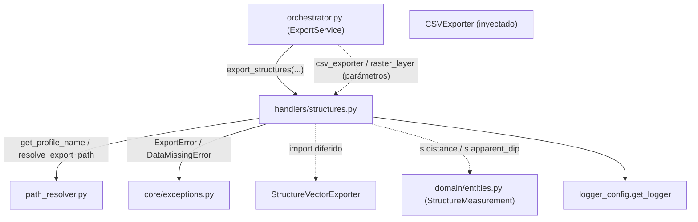

---
tags:
  - secinterp
  - code-walkthrough
  - core
  - export
  - handlers
aliases:
  - structures.py
  - export_structures
cssclass: secinterp-note
---

# `core/services/export/handlers/structures.py`

> [!abstract] Resumen en una línea
> Handler de exportación de **estructuras**: vuelca las mediciones estructurales a CSV (dist, dip aparente) y a capa vectorial, leyendo la resolución del raster para escalar el dip.

**Ruta**: `core/services/export/handlers/structures.py` (77 líneas)
**Función principal**: `export_structures`
**Capa**: Core (QGIS-agnóstico, con acceso duck-typed al raster)
**Tags**: #secinterp #core #export #handlers

---

## 🎯 ¿Por qué existe este archivo?

Las mediciones estructurales proyectadas (`StructureMeasurement`) se exportan en dos
formatos. La variante vectorial necesita dos magnitudes derivadas: un **factor de
escala del dip** (opción visual del usuario) y la **resolución del raster** (para
dimensionar los símbolos en unidades de mapa).

| Problema | Solución |
|----------|----------|
| Exportar mediciones a CSV y a vectorial | Dos bloques de exportación encadenados |
| Escalar el dip según preferencia del usuario | `options.get("dip_scale", 4)` |
| Dimensionar símbolos con la resolución del raster | `raster_layer.rasterUnitsPerPixelX()` |

> [!important] Nota arquitectónica
> QGIS-agnóstico: `raster_layer` es un objeto QGIS tipado `Any` y accedido por
> duck-typing (`isValid()`, `rasterUnitsPerPixelX()`). La resolución cae a un valor por
> defecto (`1.0`) si el raster no está disponible — degradación sin excepción.

---

## 🧬 Diagrama de relaciones



> [!tip] Cómo leer
> `csv_exporter` y `raster_layer` llegan inyectados; `s.distance`/`s.apparent_dip` son
> campos reales de `StructureMeasurement`. El exporter vectorial se importa diferido.

---

## 📦 Imports — lectura arquitectónica

```python
# core/services/export/handlers/structures.py
from __future__ import annotations

from pathlib import Path
from typing import Any

from sec_interp.core.exceptions import DataMissingError, ExportError
from sec_interp.core.services.export.path_resolver import get_profile_name, resolve_export_path
from sec_interp.logger_config import get_logger
```

```python
# import diferido (dentro de export_structures)
from sec_interp.exporters import StructureVectorExporter
```

| # | Observación |
|---|-------------|
| ① | `DataMissingError`/`ExportError` de la jerarquía propia; sin importación de `qgis.*`. |
| ② | `raster_layer` y `csv_exporter` son parámetros `Any` (no se importan aquí). |
| ③ | `StructureVectorExporter` import diferido: se carga solo si hay estructuras. |
| ④ | El `data: list[Any]` oculta `StructureData` (`list[StructureMeasurement]`). |

---

## 🏗️ Inventario de estructura

**Funciones/Métodos:**
- `export_structures(folder, data, raster_layer, crs, csv_exporter, msg, options, controller, settings, ext) -> None`

**Dependencias de dominio:**
- `StructureMeasurement` (campos `distance`, `apparent_dip`) — accedido por duck-typing.
- `StructureVectorExporter` (de `sec_interp.exporters`)

Una función pública. Diferencia clave frente a otros handlers: recibe `options` (para
`dip_scale`) y `raster_layer` (para `rasterUnitsPerPixelX`).

---

## 📖 Recorrido método por método

### `export_structures`

```python
def export_structures(
    folder: Path,
    data: list[Any] | None,
    raster_layer: Any | None,
    crs: Any,
    csv_exporter: Any,
    msg: list[str],
    options: dict[str, Any],
    controller: Any | None,
    settings: Any | None,
    ext: str,
) -> None:
    """Export structural data."""
    if not data:
        return
    from sec_interp.exporters import StructureVectorExporter

    logger.info("✓ Saving structural profile...")
```

**Guard + import diferido**: salida temprana sin estructuras; el exporter vectorial se
carga solo si hay datos.

```python
    try:
        profile_name = get_profile_name(controller)
        pattern = getattr(settings, "naming_pattern", None) if settings else None
        rows = [(s.distance, s.apparent_dip) for s in data]

        csv_path, csv_layer = resolve_export_path(
            folder, "structural_profile", profile_name, pattern, ".csv"
        )
        csv_ok = csv_exporter.export(
            csv_path,
            {"headers": ["dist", "apparent_dip"], "rows": rows},
            layer_name=csv_layer,
        )
        if csv_ok:
            msg.append(f"  - {csv_path.relative_to(folder)}")
```

**CSV**: la comprensión `[(s.distance, s.apparent_dip) for s in data]` extrae las dos
magnitudes clave de cada `StructureMeasurement`. Payload `{"headers": ["dist",
"apparent_dip"], "rows": rows}` con extensión `.csv`.

```python
        raster_res = 1.0
        if raster_layer and raster_layer.isValid():
            raster_res = raster_layer.rasterUnitsPerPixelX()

        vec_path, vec_layer = resolve_export_path(
            folder, "structural_measurements", profile_name, pattern, ext
        )
        vector_exporter = StructureVectorExporter({})
        vec_ok = vector_exporter.export(
            vec_path,
            {
                "structural_data": data,
                "crs": crs,
                "dip_scale_factor": options.get("dip_scale", 4),
                "raster_res": raster_res,
            },
            layer_name=vec_layer,
        )
        if vec_ok:
            msg.append(f"  - {vec_path.relative_to(folder)}")
        else:
            logger.warning(f"Failed to write vector structures to {vec_path}")
```

**Resolución del raster + vectorial**: `raster_res` arranca en `1.0` y solo se
sobrescribe si `raster_layer` es válido. El payload vectorial incluye
`dip_scale_factor` (de `options.get("dip_scale", 4)`) y `raster_res`.

```python
    except (OSError, ValueError, TypeError, DataMissingError) as e:
        logger.exception(f"Structure export failed: {e}")
        raise ExportError(f"Structure export failed: {e!s}") from e
    except Exception as e:
        logger.exception("Unexpected system error during structure export")
        raise ExportError(f"Critical error exporting structures: {e}") from e
```

**Normalización**: contrato de doble `except` idéntico a `drillholes.py`/`geology.py`.

---

## 🔄 Flujo de datos

| Fase | Entrada | Transformación | Salida |
|------|---------|----------------|--------|
| Guard | `data` (`None`/vacío) | early return | — |
| CSV | `list[StructureMeasurement]` | `[(s.distance, s.apparent_dip) ...]` | `structural_profile.csv` |
| Raster | `raster_layer` | `rasterUnitsPerPixelX()` (o `1.0`) | `raster_res` |
| Vector | `data`, `crs`, `dip_scale`, `raster_res` | `StructureVectorExporter.export` | capa de estructuras + `msg` |

---

## 🏛️ Patrones de diseño presentes

| Patrón | Dónde | Propósito |
|--------|-------|-----------|
| **Guard clause** | `if not data: return` | salida temprana |
| **Lazy import (deferred)** | `StructureVectorExporter` | ahorrar carga sin datos |
| **Dependency injection** | `csv_exporter`, `raster_layer` | desacoplar de exporters/raster concretos |
| **Default value (null object)** | `raster_res = 1.0` | degradación sin excepción |
| **Exception translation** | `except → ExportError` | normalizar fallos |

---

## 🧾 Resumen de la API

| Símbolo | Firma / Hereda | Uso típico |
|---------|----------------|------------|
| `export_structures` | `(folder, data, raster_layer, crs, csv_exporter, msg, options, controller, settings, ext) -> None` | Exportar estructuras CSV + vectorial |
| `rows` (interno) | `list[tuple[float, float]]` | Filas `(dist, apparent_dip)` |
| `raster_res` (interno) | `float` | Resolución X del raster o `1.0` |
| `StructureVectorExporter` | `BaseExporter` (import diferido) | Escribir mediciones como vectorial |

---

## 📐 Contrato de firma del handler

Es la firma más larga del subpaquete (10 parámetros): suma `raster_layer`, `csv_exporter`
y `options` a la silueta base:

| Parámetro | Tipo | Rol |
|-----------|------|-----|
| `folder` | `Path` | Directorio base de salida |
| `data` | `list[Any] \| None` | `StructureData` (`list[StructureMeasurement]`) |
| `raster_layer` | `Any \| None` | Raster DEM para leer `rasterUnitsPerPixelX()` |
| `crs` | `Any` | CRS de la sección |
| `csv_exporter` | `Any` | `CSVExporter` inyectado |
| `msg` | `list[str]` | Acumulador de mensajes |
| `options` | `dict[str, Any]` | Ajustes (`dip_scale`) |
| `controller` | `Any \| None` | Fuente del nombre de perfil |
| `settings` | `Any \| None` | Ajustes (`naming_pattern`) |
| `ext` | `str` | Extensión de salida |

## 🔁 Invocación desde el orquestador

```python
"exp_struct": lambda: struct_h.export_structures(
    folder, struct_data, raster_layer, line_crs, csv_exporter, msg,
    options, self.controller, export_settings, format_ext,
),
```

`raster_layer` llega del `PreviewParams.raster_layer` y `options` es el mismo dict de
flags/ajustes que usa el resto de la orquestación (aquí para leer `dip_scale`).

---

## 🛡️ Manejo de errores

| Tipo capturado | Acción | Resultado |
|----------------|--------|-----------|
| `OSError`, `ValueError`, `TypeError`, `DataMissingError` | `logger.exception` + `raise ExportError(...) from e` | error de dominio |
| `Exception` (resto) | `logger.exception` + `raise ExportError(...) from e` | error crítico |

> [!note] `raster_layer` nunca lanza
> Si el raster es `None` o inválido, `raster_res` queda en `1.0` y el export prosigue.
> El dip se escala con el factor del usuario sin depender del raster.

---

## 🧪 Tests asociados

- `tests/core/test_export_service.py::test_export_structures_error` — fallo del
  exporter → `ExportError`.
- `tests/core/test_profile_exporters.py::test_structure_exporter_success` — lógica real
  de `StructureVectorExporter`.
- `tests/core/test_profile_exporters.py::test_structure_exporter_missing_data` — sin
  datos (edge case).
- `tests/integration/test_export_service_e2e.py::test_export_structures_with_string_fields` —
  campos de atributos como strings.

---

## 👀 Observaciones y notas

> [!success] Fortalezas
> - Degradación elegante del raster (`1.0`) sin bloques `try/except`.
> - `dip_scale_factor` se desacopla vía `options` con un default sensato (`4`).
> - Contrato de errores uniforme con `ExportError`.

> [!warning] Puntos de atención
> - `data: list[Any]` oculta `StructureData`; `raster_layer: Any` oculta un raster QGIS.
> - `raster_res` como `float` mágico `1.0` es un literal sin nombre semántico.
> - La lectura de `rasterUnitsPerPixelX()` solo toma la resolución X, ignorando Y.

> [!question] Preguntas abiertas
> - ¿Tipar `data` como `StructureData` para documentar el contrato?
> - ¿Nombrar la constante `DEFAULT_RASTER_RESOLUTION = 1.0`?

---

## 🔗 Notas relacionadas

- [[Index]] — índice de la bóveda
- [[core_services_export_handlers]] — paquete `handlers/` al que pertenece
- [[orchestrator]] — delega en `export_structures` bajo el flag `exp_struct`
- [[structure_service]] — servicio que produce las `StructureMeasurement` exportadas
- [[path_resolver]] — `get_profile_name` / `resolve_export_path`
- [[compat]] — `_export_structures` wrapper de compatibilidad
- [[entities]] — `StructureMeasurement` (`.distance`, `.apparent_dip`)

---

*Nota de la bóveda SecInterp Code Walkthrough v2 — v3.8.0*
