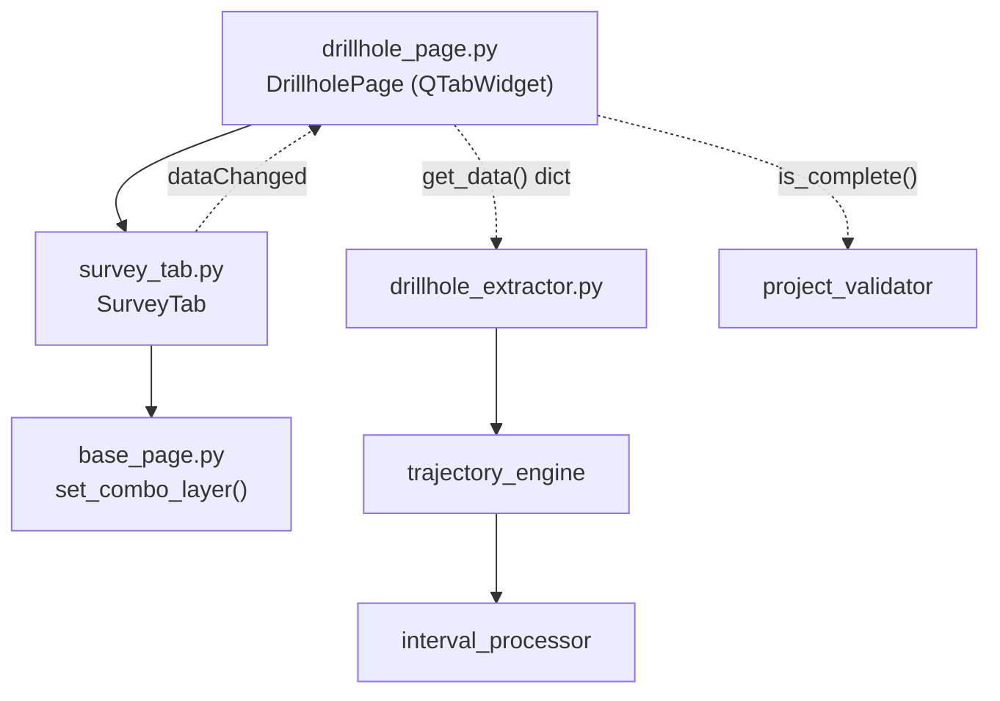

---
tags:
  - secinterp
  - code-walkthrough
  - gui
  - pages
aliases:
  - survey_tab.py
  - SurveyTab
cssclass: secinterp-note
---

# `gui/ui/pages/drillhole/survey_tab.py`

> [!abstract] Resumen en una línea
> Pestaña de configuración de desviaciones del sondaje: selector de capa tabular más mapeo de campos (ID, profundidad, azimut, inclinación), que alimenta el `DrillholeContext` del lado Extract.

**Ruta**: `gui/ui/pages/drillhole/survey_tab.py` (144 líneas)
**Clase principal**: `SurveyTab`
**Capa**: GUI (QGIS-dependiente · página secundaria / tab)
**Tags**: #secinterp #gui #pages

---

## 🎯 ¿Por qué existe este archivo?

Sin desviaciones (azimut/inclinación por profundidad) el sondaje es vertical;
con ellas, [[trajectory_engine]] reconstruye la trayectoria 3D real. Este tab
encapsula el mapeo de esos cuatro campos sobre una tabla auxiliar.

| Problema | Solución |
|----------|----------|
| El survey vive en una tabla que puede no tener geometría | Filtro `PointLayer \| NoGeometry` |
| Cuatro campos deben seguir a la capa elegida | `layerChanged` conectado a los cuatro `setLayer` |
| La página padre agrega tres formularios homogéneos | Mismo contrato que `CollarTab`/`IntervalTab` |
| `Qgis.LayerFilters` no existe en QGIS antiguos | `try/except` con fallback a `QgsMapLayerProxyModel` |

> [!important] Nota arquitectónica
> Tab de la fase **Extract**: expone nombres de campo (`survey_azim`,
> `survey_incl`); el core interpreta unidades y reconstruye la desviación sin
> que la GUI conozca el algoritmo.

---

## 🧬 Diagrama de relaciones



> [!tip] Cómo leer
> Flecha sólida = importa/delega; punteada = callback/flujo de datos hacia el padre
> o hacia el core.

---

## 📦 Imports — lectura arquitectónica

```python
# gui/ui/pages/drillhole/survey_tab.py
from __future__ import annotations
import contextlib
from typing import Any
from qgis.core import Qgis, QgsMapLayerProxyModel
from qgis.gui import QgsFieldComboBox, QgsMapLayerComboBox
from qgis.PyQt.QtCore import QCoreApplication, pyqtSignal
from qgis.PyQt.QtWidgets import QGridLayout, QLabel, QWidget
from sec_interp.gui.ui.pages.base_page import set_combo_layer
from sec_interp.logger_config import get_logger
```

| # | Observación |
|---|-------------|
| ① | Bloque de imports gemelo al de `interval_tab`: misma forma, distintos campos. |
| ② | `QgsMapLayerProxyModel` solo se usa en el `except` de compatibilidad. |
| ③ | Sin `QCheckBox`: sin modos alternativos ni widgets condicionales. |
| ④ | `QGridLayout` con contador `row` incremental. |
| ⑤ | `dataChanged` idéntica: el padre conecta los tres tabs en bucle. |

---

## 🏗️ Inventario de estructura

**Clase:** `SurveyTab(QWidget)` — 1 señal, 8 métodos.

| Miembro | Tipo | Rol |
|---------|------|-----|
| `dataChanged` | `pyqtSignal()` | Aviso al padre de que cambió algún campo |
| `s_layer` | `QgsMapLayerComboBox` | Capa/tabla de desviaciones |
| `s_id` | `QgsFieldComboBox` | Campo Hole ID (enlace con collar) |
| `s_depth` | `QgsFieldComboBox` | Profundidad de la estación |
| `s_azim` | `QgsFieldComboBox` | Azimut de la estación |
| `s_incl` | `QgsFieldComboBox` | Inclinación de la estación |

**Métodos:**

| Método | Firma | Propósito |
|--------|-------|-----------|
| `__init__` | `(parent=None) -> None` | Construye y llama `_setup_ui` |
| `tr` | `(message: str) -> str` | Traduce con contexto `"SurveyTab"` |
| `_setup_ui` | `() -> None` | Grilla de 5 filas + stretch |
| `get_data` | `() -> dict[str, Any]` | Valores vivos para validación/extract |
| `dump` | `() -> dict[str, Any]` | Estado persistible (claves `dh_survey_*`) |
| `load` | `(data: dict) -> None` | Aplica estado persistido |
| `reset` | `() -> None` | Limpia la capa |
| `connect_signals` | `() -> None` | Cablea capa y campos |
| `disconnect_signals` | `() -> None` | Descablea todo sin lanzar |

---

## 📁 Archivos del paquete

| Archivo | Líneas | Rol |
|---|---|---|
| `drillhole/__init__.py` | 9 | Re-exporta `CollarTab`, `IntervalTab`, `SurveyTab` |
| `collar_tab.py` | 180 | Formulario del collar (ver [[collar_tab]]) |
| `interval_tab.py` | 144 | Formulario de intervalos (ver [[interval_tab]]) |
| `survey_tab.py` | 144 | Esta nota: formulario de desviaciones |
| `../drillhole_page.py` | 130 | Padre con `QTabWidget` (ver [[drillhole_page]]) |

---

## 📖 Recorrido método por método

### `__init__` + `tr`

```python
def __init__(self, parent: QWidget | None = None) -> None:
    super().__init__(parent)
    self._setup_ui()

def tr(self, message: str) -> str:
    return QCoreApplication.translate("SurveyTab", message)
```

Construcción delegada y contexto de traducción propio (`"SurveyTab"`),
simétrico a los hermanos.

### `_setup_ui` — filtro dual de capa

```python
layout = QGridLayout(self)
row = 0

layout.addWidget(QLabel(self.tr("Survey Layer:")), row, 0)
self.s_layer = QgsMapLayerComboBox()
try:
    self.s_layer.setFilters(
        Qgis.LayerFilters(Qgis.LayerFilter.PointLayer | Qgis.LayerFilter.NoGeometry)
    )
except (AttributeError, TypeError):
    self.s_layer.setFilters(
        QgsMapLayerProxyModel.Filter.PointLayer | QgsMapLayerProxyModel.Filter.NoGeometry
    )
self.s_layer.setAllowEmptyLayer(True)
self.s_layer.setCurrentIndex(0)
```

| Fila | Widgets | Detalle |
|------|---------|---------|
| 0 | Etiqueta + `s_layer` | Filtro `PointLayer \| NoGeometry` con fallback |
| 1 | Etiqueta + `s_id` | Hole ID para enlazar con collar |
| 2 | Etiqueta + `s_depth` | Profundidad de la estación |
| 3 | Etiqueta + `s_azim` | Azimut |
| 4 | Etiqueta + `s_incl` | Inclinación + `setRowStretch` |

> [!note] Survey opcional por diseño
> La capa admite vacío (`setAllowEmptyLayer(True)`): sin tabla de survey el
> sondaje se trata como vertical. `DrillholePage.is_complete()` refleja esa
> opcionalidad en la validación.

### `get_data` — valores vivos

```python
def get_data(self) -> dict[str, Any]:
    return {
        "survey_layer": self.s_layer.currentLayer(),
        "survey_id": self.s_id.currentField(),
        "survey_depth": self.s_depth.currentField(),
        "survey_azim": self.s_azim.currentField(),
        "survey_incl": self.s_incl.currentField(),
    }
```

Cinco claves sin prefijo que el padre fusiona con collar e intervalos. Los
valores de azimut/inclinación quedan como nombres de campo: unidades y
conversión pertenecen al core.

### `dump` — estado persistible

```python
def dump(self) -> dict[str, Any]:
    return {
        "dh_survey_layer": self.s_layer.currentLayer(),
        "dh_survey_id": self.s_id.currentField(),
        "dh_survey_depth": self.s_depth.currentField(),
        "dh_survey_azim": self.s_azim.currentField(),
        "dh_survey_incl": self.s_incl.currentField(),
    }
```

Claves `dh_survey_*` alineadas con `DrillholeSettings` (`survey_id_field`,
`survey_depth_field`, `survey_azim_field`, `survey_incl_field`) vía
`ConfigService` (ver [[config]] y [[settings_model]]).

### `load` — aplicar estado persistido

```python
def load(self, data: dict[str, Any]) -> None:
    s_layer = data.get("dh_survey_layer")
    if s_layer is not None:
        set_combo_layer(self.s_layer, s_layer)
        for w in (self.s_id, self.s_depth, self.s_azim, self.s_incl):
            w.setLayer(s_layer)

    for key, combo in [
        ("dh_survey_id", self.s_id),
        ("dh_survey_depth", self.s_depth),
        ("dh_survey_azim", self.s_azim),
        ("dh_survey_incl", self.s_incl),
    ]:
        field = data.get(key)
        if field:
            combo.setField(field)
```

Primero capa (con señales bloqueadas), luego campos no vacíos. Si no hubo
survey guardado, el tab queda con capa vacía: estado vertical válido.

### `reset`

```python
def reset(self) -> None:
    self.s_layer.setLayer(None)
```

Vuelve al estado "sin survey" (sondaje vertical). Los combos se vacían solos
al perder la capa.

### `connect_signals`

```python
def connect_signals(self) -> None:
    self.s_layer.layerChanged.connect(self.s_id.setLayer)
    self.s_layer.layerChanged.connect(self.s_depth.setLayer)
    self.s_layer.layerChanged.connect(self.s_azim.setLayer)
    self.s_layer.layerChanged.connect(self.s_incl.setLayer)
    self.s_layer.layerChanged.connect(self.dataChanged.emit)

    self.s_id.fieldChanged.connect(self.dataChanged.emit)
    self.s_depth.fieldChanged.connect(self.dataChanged.emit)
    self.s_azim.fieldChanged.connect(self.dataChanged.emit)
    self.s_incl.fieldChanged.connect(self.dataChanged.emit)
```

Cuatro `setLayer` más reemisión de `dataChanged` por cada cambio. El padre
reenvía esa señal al diálogo para refrescar preview y validación.

### `disconnect_signals`

```python
def disconnect_signals(self) -> None:
    with contextlib.suppress(TypeError, RuntimeError):
        self.s_layer.layerChanged.disconnect(self.s_id.setLayer)
        ...  # 4 más
    with contextlib.suppress(TypeError, RuntimeError):
        self.s_id.fieldChanged.disconnect(self.dataChanged.emit)
    ...  # un bloque por combo
```

Cinco bloques `suppress`: agrupado para `layerChanged`, individuales para cada
`fieldChanged`. Desconexión idempotente exigida por la capa GUI.

---

## 🔄 Flujo de datos

| Fase | Entrada | Transformación | Salida |
|------|---------|----------------|--------|
| Setup | `parent` | `_setup_ui` con filtro dual | Widgets listos |
| Edición | Clic del usuario | `layerChanged`/`fieldChanged` | `dataChanged` al padre |
| Extract | Widgets | `get_data()` lee capa + campos | `dict` con claves `survey_*` |
| Agregación | Tres tabs | `DrillholePage.get_data()` fusiona | `dict` completo del sondaje |
| Validación | `dict` fusionado | `resolve_layer_metadata` + `ProjectValidator.is_drillhole_complete` | `bool` en `is_complete()` |
| Compute | Contexto | [[trajectory_engine]] reconstruye desviación | Trayectoria 3D real |
| Persistencia | Widgets | `dump()` con claves `dh_survey_*` | `QgsSettings` vía `ConfigService` |
| Restauración | `QgsSettings` | `load()` con `set_combo_layer` | Widgets restaurados |

---

## 🏛️ Patrones de diseño presentes

| Patrón | Dónde | Propósito |
|--------|-------|-----------|
| **Composite (tab)** | `DrillholePage` + 3 tabs | Contrato uniforme entre hermanos |
| **Observer** | `dataChanged` | Propagación tab → página → diálogo |
| **Extract** | `get_data` | Solo nombres de campo; el core interpreta |
| **Memento** | `dump` / `load` | Estado persistible y restaurable |
| **Adapter de compatibilidad** | `try/except` de filtros | Soporta QGIS con y sin `Qgis.LayerFilters` |
| **Guarded disconnect** | `contextlib.suppress` | Desconexión idempotente |

---

## 🧾 Resumen de la API

| Símbolo | Firma / Hereda | Uso típico |
|---------|----------------|------------|
| `SurveyTab` | `QWidget` | `DrillholePage.tab_widget.addTab(SurveyTab(), ...)` |
| `dataChanged` | `pyqtSignal()` | `tab.dataChanged.connect(self.dataChanged.emit)` |
| `get_data()` | `-> dict[str, Any]` | Lectura viva para validar/extraer |
| `dump()` | `-> dict[str, Any]` | Persistencia (claves `dh_survey_*`) |
| `load(data)` | `(dict) -> None` | Restaurar sesión |
| `reset()` | `-> None` | Volver a sondaje vertical |
| `connect_signals()` | `-> None` | Cablear al mostrar la página |
| `disconnect_signals()` | `-> None` | Descablear al cerrar |

---

## 🛡️ Manejo de errores

Estrategia defensiva sin excepciones de dominio:

- `load` ignora claves ausentes y campos vacíos: survey parcial ⇒ tab vacío válido.
- `set_combo_layer` bloquea señales durante la restauración de la capa.
- El `try/except (AttributeError, TypeError)` del filtro absorbe diferencias
  de API entre versiones de QGIS.
- `disconnect_signals` suprime `TypeError`/`RuntimeError`.

---

## 🧪 Tests asociados

Sin `tests/gui/test_survey_tab.py` dedicado; cobertura vía la página padre
con mocks QGIS:

- `tests/gui/test_drillhole_page.py::TestDrillholePage::test_tabs_are_composed` — el tab de survey existe.
- `test_get_data_contract` — claves `survey_*` presentes.
- `test_dump_contract` — claves `dh_survey_*` presentes.
- `test_load_reset_roundtrip` — `load` + `reset` sin lanzar.
- `test_connect_disconnect_signals` — cableado idempotente.
- `test_is_complete_returns_bool` — completitud con metadatos resueltos.

---

## 🌐 i18n y notas de migración

- Etiquetas traducidas con contexto `"SurveyTab"`: `"Survey Layer:"`,
  `"Hole ID:"`, `"Depth:"`, `"Azimuth:"`, `"Inclination:"`.
- El fallback `QgsMapLayerProxyModel.Filter` mantiene QGIS antiguos.
- Estructuralmente gemelo a `interval_tab`: cualquier mejora de compatibilidad
  debería aplicarse a ambos (candidato a helper compartido).

---

## 👀 Observaciones y notas

> [!success] Fortalezas
> - Survey opcional de verdad: capa vacía = sondaje vertical, sin casos borde.
> - Simetría total con `interval_tab`: el padre y los tests los tratan igual.
> - Sin estado condicional: el tab siempre muestra los mismos 5 widgets.

> [!warning] Puntos de atención
> - No valida unidades de azimut/inclinación ni orden de profundidades.
> - Duplicación casi literal con `interval_tab` (filtro, load, señales).
> - `reset` no documenta que equivale a "vertical".

> [!question] Preguntas abiertas
> - ¿Extraer el filtro dual + cableado a un `BaseDrillholeTab` común?
> - ¿Validación temprana de estaciones (profundidades crecientes)?

---

## 🔗 Notas relacionadas

- [[Index]] — índice de la bóveda
- [[drillhole_page]] — página padre con el `QTabWidget`
- [[gui_ui_pages_drillhole]] — paquete de tabs de sondajes
- [[collar_tab]] — tab hermano del collar
- [[interval_tab]] — tab hermano de intervalos
- [[trajectory_engine]] — reconstruye la trayectoria con el survey
- [[interval_processor]] — posiciona intervalos sobre la trayectoria
- [[drillhole_extractor]] — adapter Extract hacia `DrillholeContext`
- [[project_validator]] — `is_drillhole_complete` usado por el padre
- [[settings_model]] — `DrillholeSettings` del core

---

*Nota de la bóveda SecInterp Code Walkthrough v2 — v3.9.1*
