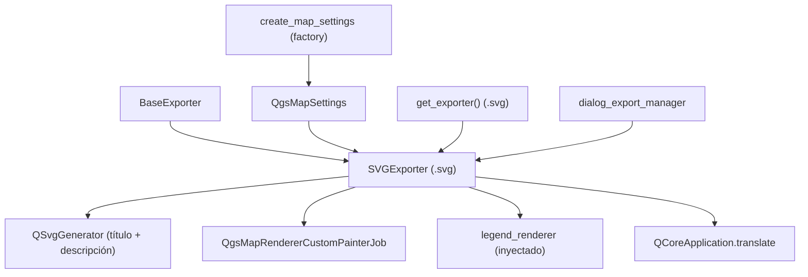

---
tags:
  - secinterp
  - code-walkthrough
  - exporters
  - graphics
aliases:
  - svg_exporter.py
  - SVGExporter
cssclass: secinterp-note
---

# `exporters/svg_exporter.py`

> [!abstract] Resumen en una línea
> Exporter de gráficos vectoriales SVG: renderiza un `QgsMapSettings` con `QgsMapRendererCustomPainterJob` sobre `QSvgGenerator` con título y descripción traducibles, más leyenda opcional.

**Ruta**: `exporters/svg_exporter.py` (85 líneas)
**Clase principal**: `SVGExporter(BaseExporter)`
**Capa**: Exporters (acoplado a `qgis.core` + `QtSvg`: dibujo escalable)
**Tags**: #secinterp #exporters #graphics

---

## 🎯 ¿Por qué existe este archivo?

El SVG es el único formato de salida **vectorial, escalable y editable**: se abre en
navegador, Inkscape o Illustrator y permite retocar el perfil para publicaciones sin
perder nitidez a ningún zoom:

| Problema | Solución |
|----------|----------|
| Figura para publicación que no se pixele | `QSvgGenerator`: vectores reales, no píxeles |
| SVG sin metadatos (título "sin nombre") | `setTitle` / `setDescription` con valores traducibles |
| Textos del SVG en idioma fijo | `QCoreApplication.translate("SVGExporter", …)` como defecto de settings |
| Leyenda separada del dibujo | `legend_renderer.draw_legend()` sobre el mismo painter |
| Painter sin cerrar ante fallos | `try/finally: painter.end()` como en `pdf_exporter` |

> [!important] Nota arquitectónica
> Tercer miembro del tríptico de render (`image`/`pdf`/`svg`). Su `data` es un
> `QgsMapSettings` cocinado aguas arriba; la particularidad es que la firma declara
> `map_settings` **sin anotar** (a diferencia de image/pdf, que exigen
> `QgsMapSettings`), un detalle de tipado a unificar.

---

## 🧬 Diagrama de relaciones



> [!tip] Cómo leer
> El generador define archivo, tamaño, viewBox y metadatos; el job pinta encima como
> en los gemelos. Es el único exporter de render que traduce sus propios metadatos.

---

## 📦 Imports — lectura arquitectónica

```python
# exporters/svg_exporter.py
from __future__ import annotations

from pathlib import Path

from qgis.core import QgsMapRendererCustomPainterJob
from qgis.PyQt.QtCore import QCoreApplication, QRectF, QSize
from qgis.PyQt.QtGui import QPainter
from qgis.PyQt.QtSvg import QSvgGenerator

from sec_interp.logger_config import get_logger

from .base_exporter import BaseExporter
```

| # | Observación |
|---|-------------|
| ① | `QtSvg.QSvgGenerator`: el dispositivo es un documento XML vectorial. |
| ② | `QCoreApplication` para `translate()`: título y descripción por defecto salen en el idioma de QGIS. |
| ③ | Importa `QgsMapRendererCustomPainterJob` pero **no** `QgsMapSettings` (la firma no lo anota): asimetría con image/pdf. |
| ④ | `QRectF`/`QSize` fijan tamaño y viewBox idénticos: 1 unidad SVG = 1 px lógico. |
| ⑤ | `get_logger`: excepciones de render registradas con `logger.exception`. |

---

## 🏗️ Inventario de estructura

**Clases:** `class SVGExporter(BaseExporter)` — 1 clase, 2 métodos.

**Métodos:**

- `get_supported_extensions() -> list[str]` — `[".svg"]`
- `export(output_path: Path, map_settings) -> bool` — dibujo completo (`map_settings` sin anotar)

**Settings consumidos:**

| Clave | Defecto | Rol |
|-------|---------|-----|
| `width` | `800` | Ancho en unidades SVG |
| `height` | `600` | Alto en unidades SVG |
| `title` | `tr("Section Interpretation Preview")` | `<title>` del SVG |
| `description` | `tr("Generated by SecInterp QGIS Plugin")` | `<desc>` del SVG |
| `show_legend` | `True` | Interruptor de leyenda |
| `legend_renderer` | `None` | Objeto con `draw_legend(painter, rect)` |

---

## 📁 Archivos del paquete

| Archivo | Líneas | Rol |
|---|--:|---|
| `__init__.py` | 81 | `get_exporter()`: `.svg` → `SVGExporter` |
| `base_exporter.py` | 137 | Contrato heredado (ver [[base_exporter]]) |
| `svg_exporter.py` | 85 | `SVGExporter` (esta nota) |
| `image_exporter.py` | 72 | Gemelo raster (píxeles fijos) |
| `pdf_exporter.py` | 79 | Gemelo documento (página + DPI) |

> [!note] SVG vs PDF: cuándo cuál
> PDF para entregar e imprimir (página fija, 300 DPI); SVG para **editar y publicar**
> (vectores retocables, zoom infinito). Ambos salen del mismo `QgsMapSettings`.

---

## 📖 Recorrido método por método

### `get_supported_extensions`

```python
def get_supported_extensions(self) -> list[str]:
    """Get supported SVG extension."""
    return [".svg"]
```

Una sola extensión. El SVG es texto XML: se puede versionar en git y difuminar, a
diferencia del PNG/JPG/PDF binarios.

### `export` — dibujo completo

```python
def export(self, output_path: Path, map_settings) -> bool:
    """Export map to SVG.

    Args:
        output_path: Output file path
        map_settings: QgsMapSettings instance configured for rendering

    Returns:
        True if export successful, False otherwise

    """
    try:
        width = self.get_setting("width", 800)
        height = self.get_setting("height", 600)
        title = self.get_setting(
            "title",
            QCoreApplication.translate("SVGExporter", "Section Interpretation Preview"),
        )
        description = self.get_setting(
            "description",
            QCoreApplication.translate("SVGExporter", "Generated by SecInterp QGIS Plugin"),
        )

        # Setup SVG generator
        generator = QSvgGenerator()
        generator.setFileName(str(output_path))
        generator.setSize(QSize(width, height))
        generator.setViewBox(QRectF(0, 0, width, height))
        generator.setTitle(title)
        generator.setDescription(description)

        # Setup painter
        painter = QPainter()
        if not painter.begin(generator):
            return False

        try:
            painter.setRenderHint(QPainter.RenderHint.Antialiasing)

            # Render map
            job = QgsMapRendererCustomPainterJob(map_settings, painter)
            job.start()
            job.waitForFinished()

            # Draw legend if available
            show_legend = self.get_setting("show_legend", True)
            legend_renderer = self.get_setting("legend_renderer")
            if legend_renderer and show_legend:
                legend_renderer.draw_legend(painter, QRectF(0, 0, width, height))

            return True

        finally:
            painter.end()

    except Exception:
        logger.exception(f"SVG export failed for {output_path}")
        return False
```

| Paso | Detalle |
|------|---------|
| Metadatos | `title`/`description` desde settings o `translate()`: el SVG declara su origen en el idioma activo |
| Generador | `setFileName` + `setSize` + `setViewBox(0, 0, w, h)`: el viewBox iguala al tamaño (sin escalado sorpresa) |
| `begin` | Si falla → `return False` **sin log** (asimetría con pdf, que sí registra) |
| Render | Job síncrono con antialiasing; las líneas salen como paths SVG editables |
| Leyenda | Misma caja `(0, 0, width, height)` que image; devuelve `True` dentro del `try` |
| Cierre | `finally: painter.end()` cierra el documento XML aunque el job falle |
| Fallo | `logger.exception` + `False` |

> [!tip] `title`/`description` configurables
> Como viajan por settings, la GUI o un script puede firmarlos (`"Perfil A-A', yacimiento X"`)
> sin tocar código: aparecen como `<title>`/`<desc>` del SVG.

> [!warning] `begin()` fallido sin log
> A diferencia de `pdf_exporter` (`logger.error("Failed to begin painting…")`), aquí el
> `return False` es silencioso. Unificar el log facilitaría el diagnóstico.

---

## 🔄 Flujo de datos

| Fase | Entrada | Transformación | Salida |
|------|---------|----------------|--------|
| Metadatos | `title`, `description` (+ `tr()` por defecto) | `QSvgGenerator` configurado | documento XML vacío |
| Geometría | `QSize` + `viewBox` | lienzo 1:1 en unidades SVG | sistema de coordenadas del dibujo |
| Render | `QgsMapSettings` + leyenda opcional | job síncrono + `draw_legend` | paths y textos SVG |
| Cierre | painter abierto | `finally: painter.end()` | `.svg` + `bool` |

---

## 🧩 SVG frente a sus gemelos

| Aspecto | `image` (PNG/JPG) | `pdf` | `svg` (este) |
|---------|-------------------|-------|--------------|
| Naturaleza | Píxeles fijos | Página fija 300 DPI | Vectores escalables |
| Editable | No | No | Sí (Inkscape/Illustrator/navegador) |
| Metadatos i18n | No | No | Sí (`title`/`desc` traducidos) |
| `map_settings` anotado | Sí | Sí | **No** (detalle a unificar) |
| `begin()` con log | n/a | Sí | No |
| `finally: painter.end()` | No | Sí | Sí |

---

## 🏛️ Patrones de diseño presentes

| Patrón | Dónde | Propósito |
|--------|-------|-----------|
| **Template Method** | `export()` sobre [[base_exporter]] | Dibujo con retorno `bool` |
| **Dependency Injection** | `map_settings` + `legend_renderer` + `title`/`description` | Contenido y firma configurables |
| **Guaranteed cleanup** | `try/finally` con `painter.end()` | XML siempre bien cerrado |
| **i18n en metadatos** | `QCoreApplication.translate` | SVG autotitulado en el idioma activo |

---

## 🧾 Resumen de la API

| Símbolo | Firma / Hereda | Uso típico |
|---------|----------------|------------|
| `SVGExporter` | `(BaseExporter)` | `SVGExporter({"title": "Perfil A-A'"})` |
| `export` | `(output_path: Path, map_settings) -> bool` | `export(path, map_settings)` |
| `get_supported_extensions` | `() -> list[str]` | `[".svg"]` |

---

## 🛡️ Manejo de errores

| Situación | Comportamiento |
|-----------|----------------|
| `painter.begin(generator)` falla | `return False` silencioso (mejora: log como en pdf) |
| Excepción en render o leyenda | `logger.exception` + `False`; el `finally` cierra igual |
| `map_settings` vacío | SVG válido pero vacío → `True` |
| Módulo `QtSvg` ausente en el entorno | `ImportError` en carga del módulo (no capturado: fallo de import, no de export) |

---

## 🧪 Tests asociados

Mock-first en `tests/exporters/test_svg_exporter.py` (generador, painter y job mockeados):

- `test_get_supported_extensions` — declara `[".svg"]`.
- `test_export_success` — job + `begin() == True` → `True`.
- `test_export_exception_handling` — fallo del job → `False`.

Integración:

- `tests/exporters/test_exporters.py` — contrato `BaseExporter`.
- `tests/integration/test_export_workflow.py` — corrida completa con SVG.
- `tests/integration/test_qgis_smoke.py` — humo con QGIS real.

---

## 👀 Observaciones y notas

> [!success] Fortalezas
> - Único formato editable y escalable: cierra el ciclo publicación sin re-exportar.
> - Metadatos traducibles y configurables: el archivo se autodescribe.
> - `finally` garantiza XML bien formado ante fallos intermedios.
> - viewBox 1:1: sin escalados sorpresa al abrir en otro visor.

> [!warning] Puntos de atención
> - `map_settings` sin anotar: rompe la simetría de tipos con image/pdf.
> - `begin()` fallido sin log: diagnóstico más pobre que en pdf.
> - Sin georreferencia ni escala gráfica garantizada: el SVG es dibujo, no plano topográfico.
> - Dependencia `QtSvg`: si el entorno QGIS no la trae, el módulo no importa.

> [!question] Preguntas abiertas
> - ¿Anotar `map_settings: QgsMapSettings` (import ya usado en image/pdf)?
> - ¿Añadir `logger.error` al `begin()` fallido por simetría con pdf?
> - ¿Exponer `title`/`description` en el diálogo de exportación de la GUI?

---

## 🔗 Notas relacionadas

- [[Index]] — índice de la bóveda
- [[base_exporter]] — contrato heredado
- [[image_exporter]] / [[pdf_exporter]] — gemelos de render
- [[exporters]] — nota de capa del paquete
- [[orchestrator]] — `get_map_settings` que cocina el `QgsMapSettings`
- [[dialog_export_manager]] — GUI que pide el SVG
- [[preview_renderer]] — vista que se congela en el dibujo
- [[dtos]] — `PreviewResult` visualizado
- [[exceptions]] — `ExportError` aguas arriba

---

*Nota de la bóveda SecInterp Code Walkthrough v2 — v3.9.1*
