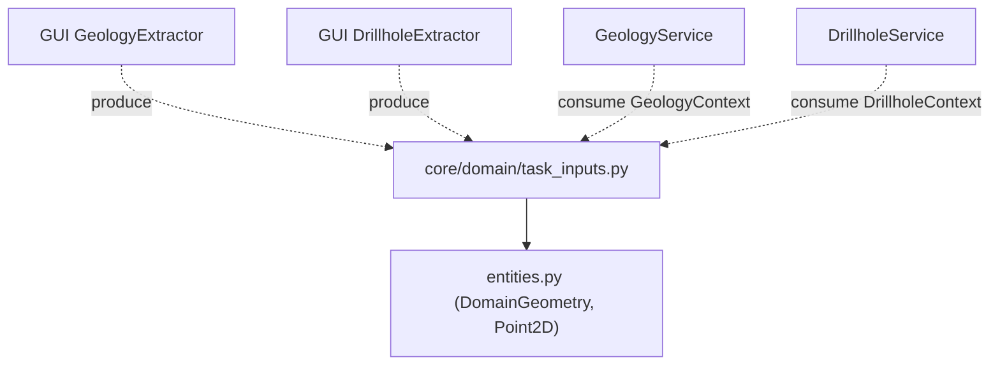
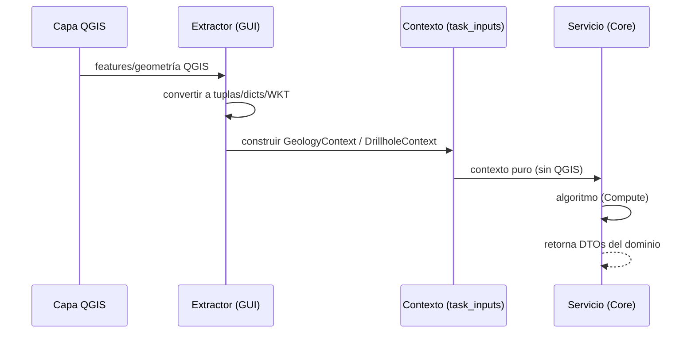

---
tags:
  - secinterp
  - code-walkthrough
  - core
  - domain
aliases:
  - task_inputs.py
  - DrillholeContext
  - GeologyContext
  - OutcropSegments
cssclass: secinterp-note
---

# `core/domain/task_inputs.py`

> [!abstract] Resumen en una línea
> Define los **DTOs de entrada desacoplados** que la GUI entrega al core para procesamiento asíncrono: `OutcropSegments`, `GeologyContext` y `DrillholeContext`, todos sin objetos QGIS vivos.

**Ruta**: `core/domain/task_inputs.py` (79 líneas)
**Clase/Función principal**: `DrillholeContext`, `GeologyContext`, `OutcropSegments`
**Capa**: Core (QGIS-agnóstico)
**Tags**: #secinterp #core #domain

---

## 🎯 ¿Por qué existe este archivo?

Los servicios geológicos (`GeologyService`, `DrillholeService`) corren en `QgsTask` (hilos
de fondo) y **no pueden tocar QGIS**. La GUI debe "extraer" de las capas todo lo que el
core necesita y empaquetarlo en DTOs puros. `task_inputs.py` define exactamente esos
paquetes:

| Problema | Solución |
|----------|----------|
| Los servicios no pueden acceder a capas QGIS | La GUI extrae y entrega contextos puros |
| Pasar decenas de parámetros sueltos | Agrupar en dataclasses semánticos |
| Geología y sondajes tienen entradas distintas | `GeologyContext` vs `DrillholeContext` |
| Un afloramiento puede cruzar la línea varias veces | `OutcropSegments.segments` (lista de tramos) |

> [!important] Nota arquitectónica — Extract-then-Compute
> Estos DTOs son la **salida de la fase Extract** (adaptadores de la GUI) y la **entrada
> de la fase Compute** (servicios del core). Son la frontera exacta por la que **no cruza
> ninguna `QgsVectorLayer`** ni `QgsGeometry`: todo llega como tuplas, dicts y primitivos.

---

## 🧬 Diagrama de relaciones



> [!tip] Cómo leer
> Sólida = importa (`task_inputs` reusa `DomainGeometry` y `Point2D` de `entities`).
> Punteada = productores (GUI extractors) y consumidores (servicios) alrededor del DTO.

---

## 📦 Imports — lectura arquitectónica

```python
# core/domain/task_inputs.py
from __future__ import annotations

from dataclasses import dataclass, field
from typing import Any

from .entities import DomainGeometry, Point2D
```

| # | Observación |
|---|-------------|
| ① | `dataclass` + `field` — los 3 DTOs son dataclasses; `pre_sampled_z` usa `default_factory`. |
| ② | `DomainGeometry` (WKT como `str`) — la geometría viaja como texto. |
| ③ | `Point2D` (`tuple[float, float]`) — puntos como tuplas, no `QgsPointXY`. |

---

## 🏗️ Inventario de estructura

**Clases (3 dataclasses):**

| Clase | Campos | Rol |
|-------|-------:|-----|
| `OutcropSegments` | 3 | Segmentos de intersección de un afloramiento |
| `GeologyContext` | 4 | Entrada desacoplada de geología |
| `DrillholeContext` | 9 | Entrada desacoplada de sondajes |

---

## 📁 Archivos del paquete

- `task_inputs.py` — nota individual de este archivo (el paquete `core/domain/` tiene su índice en [[domain]] y [[core_domain]]).

---

## 📖 Recorrido clase por clase

### `OutcropSegments` — segmentos de un afloramiento

```python
@dataclass
class OutcropSegments:
    unit_name: str
    attributes: dict[str, Any]
    segments: list[tuple[float, float, DomainGeometry]]
```

Representa **un** feature de afloramiento desacoplado. `segments` es una lista de tuplas
`(dist_start, dist_end, wkt)`: un afloramiento poligonal puede cruzar la línea de sección
en varios tramos, y cada tramo lleva su geometría WKT.

| Campo | Significado |
|-------|-------------|
| `unit_name` | nombre de la unidad geológica |
| `attributes` | atributos originales del feature |
| `segments` | tramos `(dist_start, dist_end, wkt)` |

### `GeologyContext` — entrada de geología

```python
@dataclass
class GeologyContext:
    master_profile_data: list[Point2D]
    master_grid_dists: list[tuple[float, Point2D, float]]
    outcrops: list[OutcropSegments]
    tolerance: float = 0.001
```

Producido por `GeologyExtractor` (GUI) y consumido por `GeologyService` (core). No contiene
objetos QGIS vivos:

| Campo | Significado |
|-------|-------------|
| `master_profile_data` | elevaciones topográficas muestreadas `(dist, elev)` |
| `master_grid_dists` | rejilla `(dist, (x, y), elev)` para interpolación |
| `outcrops` | afloramientos desacoplados (`OutcropSegments`) |
| `tolerance` | tolerancia de muestreo de intersección (default `0.001`) |

### `DrillholeContext` — entrada de sondajes

```python
@dataclass
class DrillholeContext:
    line_points: list[Point2D]
    section_azimuth: float
    buffer_width: float
    collar_id_field: str
    collar_z_field: str
    collar_depth_field: str
    collar_data: list[dict[str, Any]]
    survey_data: dict[Any, list[tuple[float, float, float]]]
    interval_data: dict[Any, list[tuple[float, float, str]]]
    pre_sampled_z: dict[Any, float] = field(default_factory=dict)
```

Producido por `DrillholeExtractor` (GUI) y consumido por `DrillholeService` (core). El más
rico de los tres: 9 campos que empaquetan collares, surveys e intervalos ya desacoplados.

| Campo | Significado |
|-------|-------------|
| `line_points` | vértices de la línea de sección `(x, y)` |
| `section_azimuth` | orientación de la sección en grados |
| `buffer_width` | buffer máximo de proyección horizontal |
| `collar_id_field` / `collar_z_field` / `collar_depth_field` | nombres de campos |
| `collar_data` | collares desacoplados `{"id", "point", "attributes"}` |
| `survey_data` | `hole_id -> [(depth, azim, incl)]` |
| `interval_data` | `hole_id -> [(from, to, lith)]` |
| `pre_sampled_z` | `hole_id -> elevación de collar pre-muestreada` |

> [!note] `survey_data`/`interval_data` usan `Any` como clave
> `dict[Any, ...]` permite claves de id heterogéneas (int o str, según la capa). Es un
> pequeño coste de tipado a cambio de flexibilidad con la fuente de datos.

---

## 🔄 Flujo de datos

| Fase | Entrada | Transformación | Salida |
|------|---------|----------------|--------|
| Extract (GUI) | capas QGIS | extractor → tuplas/dicts/WKT | `GeologyContext` / `DrillholeContext` |
| Compute (Core) | contexto puro | servicio → algoritmo | `GeologySegment` / `DrillholeProjection` |

---

## 🏛️ Patrones de diseño presentes

| Patrón | Dónde | Propósito |
|--------|-------|-----------|
| **DTO** | las 3 dataclasses | Transportar datos desacoplados |
| **Extract-then-Compute** | todo el módulo | Separar extracción (GUI) de cómputo (core) |
| **WKT-as-string** | `DomainGeometry` | Geometría sin objetos QGIS |
| **Composition** | `GeologyContext.outcrops` | `list[OutcropSegments]` |

---

## 🧾 Resumen de la API

| Símbolo | Firma / Hereda | Uso típico |
|---------|----------------|------------|
| `OutcropSegments` | dataclass | Tramo de afloramiento desacoplado |
| `GeologyContext` | dataclass | Entrada de `GeologyService.build_segments` |
| `DrillholeContext` | dataclass | Entrada de `DrillholeService.process_context` |

---

## 🛡️ Manejo de errores

Sin validación propia: son contenedores de datos. La validación de que los datos extraídos
son correctos ocurre **antes**, en los extractores de la GUI (y en la validación de capas).
`pre_sampled_z` usa `default_factory=dict` para evitar compartir el dict entre instancias.

---

## 🧪 Tests asociados

No hay un `test_task_inputs.py` dedicado; los DTOs se ejercitan a través de los servicios
que los consumen, con mocks de los contextos (Mock-first):

- `tests/core/test_geology_service.py` — mock de `GeologyContext` (sin QGIS).
- `tests/core/test_drillhole_service.py` — mock de `DrillholeContext`.

> [!note] Mock-first
> Al ser dataclasses puras, construir un `GeologyContext`/`DrillholeContext` en un test no
> requiere QGIS: basta con tuplas y dicts. Ver [[qa-docker]] y `tests/base_test.py`.

---

## 👀 Observaciones y notas

> [!success] Fortalezas
> - Frontera Extract-then-Compute muy limpia: nada de QGIS cruza el core.
> - Geometría como WKT (`DomainGeometry`) y puntos como tuplas.
> - `default_factory` para el campo mutable `pre_sampled_z`.

> [!warning] Puntos de atención
> - `dict[Any, ...]` en `survey_data`/`interval_data` diluye el tipado de las claves.
> - `collar_data` como `list[dict[str, Any]]` (sin schema) — los consumidores conocen las
>   claves por convención.

> [!question] Preguntas abiertas
> - ¿Tipar las claves de `survey_data`/`interval_data` como `str` (o un `TypeVar`)?
> - ¿Convertir `collar_data` en una dataclass `CollarData` con campos tipados?

---

## 🔢 Ejemplo — construcción de un contexto

Como los DTOs son dataclasses puras, construir uno en un test (o en un extractor de la GUI)
no requiere QGIS:

```python
# Geología: topografía muestreada + afloramientos desacoplados
geo_ctx = GeologyContext(
    master_profile_data=[(0.0, 100.0), (50.0, 120.0), (100.0, 90.0)],
    master_grid_dists=[
        (0.0, (500000.0, 4000000.0), 100.0),
        (50.0, (500050.0, 4000000.0), 120.0),
    ],
    outcrops=[
        OutcropSegments(
            unit_name="Cuarcita",
            attributes={"code": "QC"},
            segments=[(10.0, 20.0, "LINESTRING(10 100, 20 105)")],
        ),
    ],
    tolerance=0.001,
)

# Sondajes: collares + surveys + intervalos desacoplados
drill_ctx = DrillholeContext(
    line_points=[(500000.0, 4000000.0), (500100.0, 4000100.0)],
    section_azimuth=45.0,
    buffer_width=50.0,
    collar_id_field="hole_id",
    collar_z_field="collar_z",
    collar_depth_field="total_depth",
    collar_data=[{"id": "DH-01", "point": (500020.0, 4000020.0), "attributes": {}}],
    survey_data={"DH-01": [(0.0, 45.0, -60.0), (50.0, 45.0, -60.0)]},
    interval_data={"DH-01": [(0.0, 30.0, "granite"), (30.0, 80.0, "schist")]},
)
```

> [!tip] WKT en `segments`
> Nótese que la geometría del afloramiento viaja como **WKT** (`"LINESTRING(10 100, 20
> 105)"`), cumpliendo la regla `DomainGeometry = str`. Ver [[entities]].

---

## 📐 Extract-then-Compute en secuencia



> [!important] La frontera está en el contexto
> A la izquierda del `Contexto` todo es QGIS; a la derecha todo es core puro. `task_inputs.py`
> define exactamente el objeto que **cruza** esa frontera. Nunca cruza una `QgsVectorLayer`.

---

## 🌐 i18n y notas de migración

- **Sin cadenas de usuario**: los docstrings son la única documentación; no hay mensajes que
  traducir.
- **`Any` como clave**: `survey_data`/`interval_data` tipan las claves como `Any` para
  aceptar ids heterogéneos; migrar a `str` exigiría normalizar en los extractores.
- **Estabilidad**: añadir un campo a un contexto rompe su constructor en los extractores;
  es una frontera que conviene evolucionar con cuidado (y tests de integración).

---

## 🔗 Notas relacionadas

- [[Index]] — índice de la bóveda
- [[entities]] — `DomainGeometry` y `Point2D` (importados)
- [[domain]] — facade que re-exporta estos DTOs
- [[core_interfaces]] — `IDrillholeService` / `IGeologyService` (los contratos que los consumen)
- [[geology_service]] / [[drillhole_service]] — servicios Compute
- [[dtos]] — el otro lado: `PreviewParams`/`PreviewResult`

---

*Nota de la bóveda SecInterp Code Walkthrough v2 — v3.8.0*
