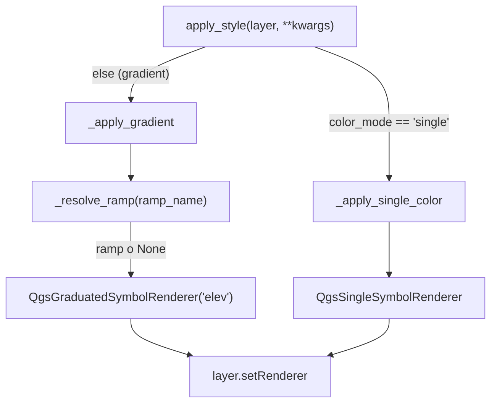

---
tags:
  - secinterp
  - code-walkthrough
  - gui
  - renderers
aliases:
  - topo_renderer.py
  - TopoRenderer
cssclass: secinterp-note
---

# `gui/renderers/topo_renderer.py`

> [!abstract] Resumen en una línea
> Renderer especializado que viste el perfil topográfico del preview con una polícromía por elevación (rampa graduada sobre el campo `elev`) o con un color único, resolviendo la rampa con fallback y sin tocar jamás geometría ni datos.

**Ruta**: `gui/renderers/topo_renderer.py` (71 líneas)
**Clase principal**: `TopoRenderer`
**Capa**: GUI (Present · Renderer QGIS)
**Tags**: #secinterp #gui #renderers

---

## 🎯 ¿Por qué existe este archivo?

El perfil topográfico necesita una simbología que exprese la **elevación**, no la
unidad geológica. `ColorManager` está pensado para unidades (colores por nombre,
ver [[gui_renderers]]), así que la topografía requiere su propio renderer. Este
módulo concentra el conocimiento de las clases de simbología de QGIS en un único
punto, de modo que ni [[preview_layer_factory]] ni [[preview_renderer]] tengan que
conocer `QgsGraduatedSymbolRenderer` o `QgsSingleSymbolRenderer`.

| Problema | Solución |
|----------|----------|
| La topografía debe colorearse por elevación, no por categoría | `_apply_gradient` gradúa el campo `elev` con `QgsGraduatedSymbolRenderer` |
| El usuario puede preferir un solo color plano | `apply_style` desvía a `_apply_single_color` cuando `color_mode == "single"` |
| La rampa elegida puede no existir en el estilo del proyecto | `_resolve_ramp` cae a `DEFAULT_RAMPS` (`Spectral`, `RdYlGn`) antes de rendirse |
| Las clases QGIS de simbología se dispersarían por la factory | El renderer encapsula la creación de renderers y símbolos |

> [!important] Nota arquitectónica
> Es la fase **Present** del patrón Extract → Compute → Present. El renderer **no**
> calcula elevaciones: las recibe ya materializadas en la capa memoria como el
> campo `elev` (`"field=elev:double"`). Aquí solo se decide *cómo se pinta* lo que
> la factory construyó. Es, por tanto, un módulo deliberadamente acoplado a QGIS:
> a diferencia de un servicio core, su contrato entero es la API de simbología.

---

## 🧬 Diagrama de relaciones

```mermaid
graph TD
    SP["SectionPage.get_data<br/>(gui/ui/pages/section_page.py)"]
    RP["RenderPipelineMixin.draw_preview<br/>(plugin/render_pipeline.py)"]
    PR["PreviewRenderer.render<br/>(gui/preview_renderer.py)"]
    LF["PreviewLayerFactory.create_topo_layer<br/>(gui/preview_layer_factory.py)"]
    TR["TopoRenderer.apply_style<br/>(gui/renderers/topo_renderer.py)"]
    GR["QgsGraduatedSymbolRenderer"]
    SSR["QgsSingleSymbolRenderer"]
    ST["QgsStyle.defaultStyle()"]

    SP --> RP
    RP --> PR
    PR --> LF
    LF -->|apply_style(color_mode, ramp_name, single_color)| TR
    TR -->|gradient| GR
    TR -->|single| SSR
    TR -->|_resolve_ramp| ST
```

> [!tip] Cómo leer
> Flecha sólida = llama/delega. La cadena de decisión baja desde la página de
> sección hasta la factory; el renderer solo recibe tres `kwargs` y elige una de
> sus dos ramas. `QgsStyle` se consulta únicamente en la rama gradiente.

---

## 📦 Imports — lectura arquitectónica

```python
# gui/renderers/topo_renderer.py
from __future__ import annotations

from qgis.core import (
    QgsClassificationFixedInterval,
    QgsGraduatedSymbolRenderer,
    QgsLineSymbol,
    QgsSingleSymbolRenderer,
    QgsStyle,
    QgsVectorLayer,
)
from qgis.PyQt.QtGui import QColor

from sec_interp.gui.renderers.base_renderer import BasePreviewRenderer
```

| # | Observación |
|---|-------------|
| ① | **Nueve imports QGIS** y ni uno del core: es un renderer de presentación, no un servicio. Su dependencia de `qgis.core` es el contrato, no un accidente. |
| ② | `QgsVectorLayer` aparece solo como anotación, pero como `from __future__ import annotations` está activo no se evalúa en runtime. |
| ③ | `QColor` viene de `qgis.PyQt.QtGui`, no de `PyQt5.QtGui` directo: sigue el estándar agnóstico de import Qt del proyecto (ver skill `qgis-migration-4x`). |
| ④ | Único import interno: `BasePreviewRenderer` (ver [[base_renderer]]), que fija el contrato `apply_style(layer, **kwargs)`. |
| ⑤ | Sin `logger`: el renderer no registra; si algo falla, la responsabilidad de loguear es del llamador (la factory). |

---

## 🏗️ Inventario de estructura

**Clases:** `class TopoRenderer(BasePreviewRenderer)` — 4 métodos, sin `__init__`.

**Constantes de módulo:**

- `DEFAULT_RAMPS = ("Spectral", "RdYlGn")` — rampas de respaldo, en orden de preferencia.
- `LINE_STYLE = {"width": "0.8", "capstyle": "round"}` — estilo de línea común a ambas ramas.

**Métodos:**

- `apply_style(layer, **kwargs) -> None` — punto de entrada; bifurca gradiente vs. color único.
- `_apply_gradient(layer, ramp_name) -> None` — renderer graduado sobre `elev`.
- `_apply_single_color(layer, single_color) -> None` — renderer de símbolo único.
- `_resolve_ramp(ramp_name) -> <ramp>` *(static)* — rampa pedida, respaldo o `None`.

**Hereda:** `apply_style` abstracto de `BasePreviewRenderer`.

---

## 📁 Archivos del paquete

| Archivo | Rol respecto a este renderer |
|---|---|
| `gui/renderers/base_renderer.py` | Define `BasePreviewRenderer.apply_style`, el contrato que aquí se implementa |
| `gui/renderers/color_manager.py` | Colores por unidad geológica; **no** lo usa la topografía (ver [[gui_renderers]]) |
| `gui/renderers/drillhole_renderer.py` | Hermano con rol `"trace"` / `"interval"` (ver [[drillhole_renderer]]) |
| `gui/preview_layer_factory.py` | Quien construye la capa y llama a `apply_style` (ver [[preview_layer_factory]]) |

Los cuatro renderers del subpaquete comparten el mismo contrato polimórfico: la
factory los trata uniformemente aunque su lógica de simbología difiera.

---

## 📖 Recorrido método por método

### `apply_style` — el bifurcador

```python
def apply_style(self, layer: QgsVectorLayer, **kwargs) -> None:
    """Apply the selected topographic profile style.

    Args:
        layer: The preview topography memory layer.
        **kwargs: Style options: ``color_mode`` (``"gradient"`` or
            ``"single"``), ``ramp_name`` and ``single_color``.

    """
    if kwargs.get("color_mode") == "single":
        self._apply_single_color(layer, kwargs.get("single_color"))
        return
    self._apply_gradient(layer, kwargs.get("ramp_name"))
```

El método no valida la capa ni el modo: es un **selector total**. Cualquier valor
distinto de `"single"` (incluido `None`) cae en gradiente, que es el modo por
defecto. `**kwargs` mantiene la firma compatible con los demás renderers y con
`BasePreviewRenderer`, que no puede conocer opciones específicas de cada dominio.

| Entrada | Rama elegida | Parámetro que pasa |
|---------|--------------|--------------------|
| `color_mode="single"` | `_apply_single_color` | `kwargs.get("single_color")` |
| `color_mode="gradient"` | `_apply_gradient` | `kwargs.get("ramp_name")` |
| Sin `color_mode` (p. ej. el test base) | `_apply_gradient` | `kwargs.get("ramp_name") → None` |

### `_apply_gradient` — polícromía por elevación

```python
def _apply_gradient(self, layer: QgsVectorLayer, ramp_name: str | None) -> None:
    """Apply graduated elevation styling, falling back to a known ramp."""
    renderer = QgsGraduatedSymbolRenderer("elev")
    renderer.setSourceSymbol(QgsLineSymbol.createSimple(LINE_STYLE))

    ramp = self._resolve_ramp(ramp_name)
    if ramp is not None:
        renderer.updateColorRamp(ramp)

    renderer.setClassificationMethod(QgsClassificationFixedInterval())
    renderer.updateClasses(layer, 8)
    layer.setRenderer(renderer)
```

Detalles que importan:

1. El campo de graduación es literal: `"elev"`. Es el contrato con la factory, que
   crea la capa con `"field=elev:double"` y asigna la elevación media de cada
   segmento (`avg_elev`).
2. El **símbolo fuente** se crea una sola vez con `LINE_STYLE`; la rampa solo
   reparte colores sobre él.
3. Si `_resolve_ramp` devolvió `None`, no se llama `updateColorRamp`: el renderer
   conserva su rampa interna por defecto en lugar de fallar.
4. `QgsClassificationFixedInterval` con `updateClasses(layer, 8)` divide el rango
   de elevaciones en **8 intervalos iguales**. No usa cuantiles ni Jenks: la
   elevación es una magnitud continua y uniforme, así que intervalos fijos son
   predecibles y baratos.
5. `layer.setRenderer(renderer)` es el único efecto sobre la capa; no se tocan
   features ni extents (eso lo hace la factory después).

### `_apply_single_color` — color plano

```python
def _apply_single_color(self, layer: QgsVectorLayer, single_color: str | None) -> None:
    """Apply a single-color line style."""
    symbol = QgsLineSymbol.createSimple(LINE_STYLE)
    color = QColor(single_color) if single_color else QColor()
    if color.isValid():
        symbol.setColor(color)
    layer.setRenderer(QgsSingleSymbolRenderer(symbol))
```

Defensa contra entradas inválidas: `QColor(...)` puede construir un color no
válido si el string no es parseable. En ese caso **se conserva** el color que
`createSimple` haya asignado al símbolo, en vez de pintar la capa de un color
inválido. Un `single_color=None` también resulta en `QColor()` (inválido) y, por
tanto, no altera el símbolo.

### `_resolve_ramp` — resolución con respaldo

```python
@staticmethod
def _resolve_ramp(ramp_name: str | None):
    """Return the requested ramp, or a default fallback, or None."""
    style = QgsStyle.defaultStyle()
    candidates = ([ramp_name] if ramp_name else []) + list(DEFAULT_RAMPS)
    for name in candidates:
        try:
            ramp = style.colorRamp(name)
        except (AttributeError, KeyError, RuntimeError, TypeError):
            ramp = None
        if ramp is not None:
            return ramp
    return None
```

| Decisión | Detalle |
|----------|---------|
| Lista de candidatos | La rampa pedida primero (si existe) y luego `Spectral`, `RdYlGn` |
| `try/except` amplio | `colorRamp` puede devolver `None` o lanzar según la versión de QGIS; ambas se normalizan a `ramp = None` |
| Primer no-`None` gana | Se detiene en la primera rampa disponible; el orden de `DEFAULT_RAMPS` es la prioridad |
| Retorno `None` total | Si ni `Spectral` ni `RdYlGn` existen, el gradiente conserva su rampa por defecto |
| `@staticmethod` | No usa `self`: es una función de consulta pura sobre `QgsStyle` |

> [!note] Rampa pedida igual a la de respaldo
> Si `ramp_name == "Spectral"` o `"RdYlGn"`, el nombre aparece dos veces en
> `candidates`. Es un intento redundante pero inofensivo: el primer acierto corta el
> bucle. No hay deduplicación porque el coste es despreciable.

---

## 🔄 Flujo de datos

| Fase | Entrada | Transformación | Salida |
|------|---------|----------------|--------|
| Selección de modo | `kwargs["color_mode"]` | `== "single"`? | rama gradiente o color único |
| Construcción del símbolo | `LINE_STYLE` | `QgsLineSymbol.createSimple` | símbolo de línea base |
| Resolución de rampa | `ramp_name` + `DEFAULT_RAMPS` | `_resolve_ramp` | `QgsColorRamp` o `None` |
| Graduación | capa con campo `elev` | `updateClasses(layer, 8)` | 8 clases con color de rampa |
| Aplicación | renderer terminado | `layer.setRenderer(renderer)` | capa lista para dibujar |
| Color único | `single_color` (hex) | `QColor` + `isValid` | capa de un solo color |



---

## 🎨 El modo de color: del Section Page al renderer

El `TopoRenderer` no decide el modo de color: **lo recibe**. La decisión nace en la
UI y viaja por tres saltos, siempre como primitivos (`str`), nunca como objetos
Qt.

```python
# gui/ui/pages/section_page.py — get_data()
return {
    ...
    "color_mode": self._color_mode(),          # "gradient" | "single"
    "ramp_name": self.ramp_button.colorRampName(),
    "single_color_hex": self.color_button.color().name(),
}
```

```python
# plugin/render_pipeline.py — draw_preview()
style = self.dlg.page_section.get_data()
...
canvas, layers = self.preview_renderer.render(
    ...
    topo_color_mode=style.get("color_mode", "gradient"),
    topo_ramp_name=style.get("ramp_name"),
    topo_single_color=style.get("single_color_hex"),
)
```

```python
# gui/preview_renderer.py → gui/preview_layer_factory.py
topo_layer = self.layer_factory.create_topo_layer(
    topo_data, vert_exag, max_points, use_adaptive,
    topo_color_mode, topo_ramp_name, topo_single_color,
)
```

```python
# gui/preview_layer_factory.py — create_topo_layer()
self.topo_renderer.apply_style(
    layer,
    color_mode=color_mode,
    ramp_name=ramp_name,
    single_color=single_color,
)
```

| Salto | Origen | Nombre | Destino |
|-------|--------|--------|---------|
| 1 | `SectionPage` | `color_mode`, `ramp_name`, `single_color_hex` | `RenderPipelineMixin.draw_preview` |
| 2 | `draw_preview` | `topo_color_mode`, `topo_ramp_name`, `topo_single_color` | `PreviewRenderer.render` |
| 3 | `PreviewRenderer` | mismos tres argumentos posicionales | `PreviewLayerFactory.create_topo_layer` |
| 4 | `create_topo_layer` | `color_mode`, `ramp_name`, `single_color` | `TopoRenderer.apply_style` |

> [!important] Contrato con la factory
> La factory es la única que llama a `apply_style`, **después** de crear las
> features y **antes** de `layer.updateExtents()`. Le entrega una capa cuyo campo
> `elev` ya está poblado; el renderer solo la viste. Invertir ese orden (estilar
> antes de añadir features) dejaría una graduación calculada sobre cero clases.

---

## 🏛️ Patrones de diseño presentes

| Patrón | Dónde | Propósito |
|--------|-------|-----------|
| **Strategy** | `apply_style` → `_apply_gradient` / `_apply_single_color` | Dos algoritmos de simbología tras una misma fachada |
| **Template Method** | `BasePreviewRenderer.apply_style` | La factory invoca el contrato sin conocer el dominio |
| **Chain of responsibility** | `_resolve_ramp` sobre `candidates` | La primera rampa disponible responde |
| **Graceful degradation** | `ramp is None` / color inválido | Nunca dejar la capa sin renderer válido |
| **Static helper** | `_resolve_ramp` | Consulta sin estado sobre `QgsStyle` |

---

## 🧾 Resumen de la API

| Símbolo | Firma / Hereda | Uso típico |
|---------|----------------|------------|
| `TopoRenderer` | `BasePreviewRenderer` (sin `__init__`) | Instanciado por `PreviewLayerFactory` |
| `apply_style` | `(layer: QgsVectorLayer, **kwargs) -> None` | Tras crear la capa de topografía |
| `_apply_gradient` | `(layer, ramp_name: str \| None) -> None` | Modo gradiente (default) |
| `_apply_single_color` | `(layer, single_color: str \| None) -> None` | Modo color único |
| `_resolve_ramp` | `(ramp_name: str \| None) -> QgsColorRamp \| None` (real sin anotación) | Resolver rampa con respaldo |
| `DEFAULT_RAMPS` | `tuple[str, str]` | `("Spectral", "RdYlGn")` |
| `LINE_STYLE` | `dict[str, str]` | `{"width": "0.8", "capstyle": "round"}` |

---

## 🛡️ Manejo de errores

| Situación | Comportamiento |
|-----------|----------------|
| `single_color` no parseable o `None` | `QColor.isValid()` es falso → se mantiene el color por defecto del símbolo |
| `ramp_name` desconocido | `_resolve_ramp` cae a `Spectral`, luego a `RdYlGn` |
| `QgsStyle.colorRamp` lanza | Se captura y se trata como `None`; continúa la cadena |
| Todas las rampas faltan | `_resolve_ramp` devuelve `None`; el gradiente usa su rampa interna |
| `color_mode` inesperado | Se interpreta como gradiente (la rama `single` es explícita) |

> [!note] Sin `try/except` en `apply_style`
> El método no protege la capa ni captura errores de `setRenderer`. No es una
> omisión: la política del proyecto es que los fallos de presentación suban al
> llamador (la factory / el pipeline), que sí puede decidir mostrarlos al usuario.

---

## 🧪 Tests asociados

`tests/gui/renderers/test_renderers.py` contiene `TestTopoRenderer`, con una capa
mockeada (`MagicMock`) y el renderer real:

- `test_apply_style` — sin kwargs: exige `setRenderer` llamado una vez (rama gradiente).
- `test_gradient_mode_uses_graduated_renderer` — parchea `QgsGraduatedSymbolRenderer`
  y `QgsSingleSymbolRenderer`; verifica que en modo gradiente solo se usa el primero.
- `test_single_mode_uses_single_symbol_renderer` — el inverso: `color_mode="single"`
  usa el símbolo único y no el graduado.
- `test_unknown_ramp_does_not_crash` — `ramp_name="NotARealRamp"` no debe lanzar y
  debe terminar con `setRenderer` llamado.

| Caso | Entrada | Esperado |
|------|---------|----------|
| Gradiente explícito | `color_mode="gradient", ramp_name="Spectral"` | `QgsGraduatedSymbolRenderer` |
| Color único | `color_mode="single", single_color="#ff0000"` | `QgsSingleSymbolRenderer` |
| Default | sin `color_mode` | rama gradiente |
| Rampa inexistente | `ramp_name="NotARealRamp"` | no lanza; usa respaldo |

> [!note] Hueco de cobertura honesto
> Los tests no verifican el número de clases (8), la clase de clasificación
> (`QgsClassificationFixedInterval`) ni que el campo sea exactamente `elev`. Serían
> aserciones baratas sobre `renderer.updateClasses` / `renderer.classAttribute()`.

---

## 👀 Observaciones y notas

> [!success] Fortalezas
> - Encapsula toda la API de simbología de QGIS del perfil topográfico en 71 líneas.
> - Fallback de rampa robusto: normaliza `None` y excepciones a un mismo camino.
> - Ambas ramas comparten `LINE_STYLE`, así que el grosor no cambia al alternar modo.
> - No muta datos: solo `layer.setRenderer`.

> [!warning] Puntos de atención
> - El campo `"elev"` y el número `8` son constantes mágicas acopladas a
>   `create_topo_layer`; un rename en la factory rompería la graduación en silencio.
> - `_resolve_ramp` no tiene anotación de retorno (el resto del módulo sí), por lo
>   que incumple el estándar de tipado estricto.
> - `_apply_gradient` no valida que la capa tenga el campo `elev`; si falta,
>   `updateClasses` podría graduar sobre un conjunto vacío.
> - El color por defecto del símbolo cuando `single_color` es inválido no es
>   explícito: depende de las tripas de `QgsLineSymbol.createSimple`.

> [!question] Preguntas abiertas
> - ¿Extraer `"elev"` y `8` a constantes (`ELEV_FIELD`, `CLASS_COUNT`) para
>   documentar el contrato con la factory?
> - ¿Aceptar una lista de rampas configurable en vez de `DEFAULT_RAMPS` fijo?
> - ¿Colorear por rango de cota real (min/max) en vez de 8 intervalos fijos?

---

## 🔗 Notas relacionadas

- [[Index]] — índice de la bóveda
- [[base_renderer]] — `BasePreviewRenderer`, el contrato `apply_style`
- [[preview_layer_factory]] — construye la capa y llama a `apply_style`
- [[preview_renderer]] — orquestador que invoca la factory
- [[render_pipeline]] — cadena `draw_preview` → `render`
- [[section_page]] — origen de `color_mode`, `ramp_name`, `single_color_hex`
- [[drillhole_renderer]] — renderer hermano del subpaquete
- [[gui_renderers]] — nota de grupo del paquete de renderers
- [[preview_state]] — estado del preview tras el render

---

*Nota de la bóveda SecInterp Code Walkthrough v2 — v3.9.1*
