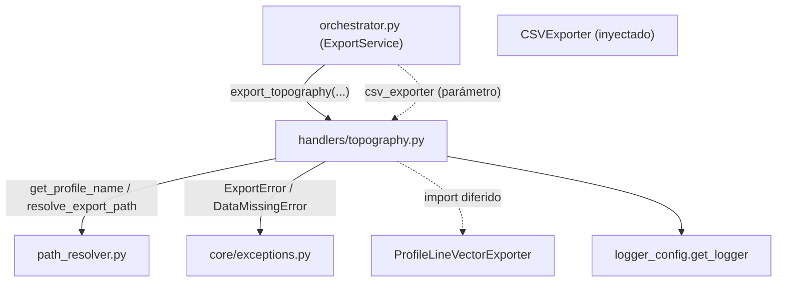

---
tags:
  - secinterp
  - code-walkthrough
  - core
  - export
  - handlers
aliases:
  - topography.py
  - export_topography
cssclass: secinterp-note
---

# `core/services/export/handlers/topography.py`

> [!abstract] Resumen en una línea
> Handler de exportación de **topografía**: vuelca el perfil topográfico a CSV (dist, elev) y a una capa vectorial de línea de perfil, como primer paso del pipeline de exportación.

**Ruta**: `core/services/export/handlers/topography.py` (63 líneas)
**Función principal**: `export_topography`
**Capa**: Core (QGIS-agnóstico)
**Tags**: #secinterp #core #export #handlers

---

## 🎯 ¿Por qué existe este archivo?

El perfil topográfico (`ProfileData`, lista de `(dist, elev)`) es el dataset base de
toda la sección: es la referencia vertical sobre la que se dibujan geología, estructuras
y sondajes. Exportarlo es, por tanto, el primer paso y el que **siempre** debe existir.

| Problema | Solución |
|----------|----------|
| Persistir el perfil topográfico en CSV y vectorial | Dos bloques de exportación encadenados |
| Es el dataset obligatorio de toda exportación | El orquestador valida su existencia antes de llamar |
| Reportar cada archivo generado | `msg.append(...)` tras cada exportación exitosa |

> [!important] Nota arquitectónica
> QGIS-agnóstico: `data` es `list[tuple]` (pares `(dist, elev)`) ya desacoplados. Es el
> **único** handler sin guard clause `if not data` — porque el orquestador ya lanza
> `DataMissingError` si `profile_data` está vacío (ver Observaciones).

---

## 🧬 Diagrama de relaciones



> [!tip] Cómo leer
> `csv_exporter` se inyecta; `ProfileLineVectorExporter` se importa diferido. El handler
> confía en que el orquestador ya validó que `data` no esté vacío.

---

## 📦 Imports — lectura arquitectónica

```python
# core/services/export/handlers/topography.py
from __future__ import annotations

from pathlib import Path
from typing import Any

from sec_interp.core.exceptions import DataMissingError, ExportError
from sec_interp.core.services.export.path_resolver import get_profile_name, resolve_export_path
from sec_interp.logger_config import get_logger
```

```python
# import diferido (dentro de export_topography)
from sec_interp.exporters import ProfileLineVectorExporter
```

| # | Observación |
|---|-------------|
| ① | `DataMissingError`/`ExportError` de la jerarquía propia; sin importación de `qgis.*`. |
| ② | `data: list[tuple]` es el tipo más "concreto" del paquete: pares `(dist, elev)`. |
| ③ | `ProfileLineVectorExporter` import diferido, tras el guard lógico del orquestador. |
| ④ | `csv_exporter` inyectado (compartido entre handlers por el orquestador). |

---

## 🏗️ Inventario de estructura

**Funciones/Métodos:**
- `export_topography(folder, data, crs, csv_exporter, msg, controller, settings, ext) -> None`

**Dependencias de dominio:**
- `ProfileData` (`list[tuple[float, float]]`) — pares distancia/elevación.
- `ProfileLineVectorExporter` (de `sec_interp.exporters`)

Una función pública. La firma es la más simple del paquete: sin `raster_layer`, sin
`options`, sin `line_layer`, sin `access_control`.

---

## 📖 Recorrido método por método

### `export_topography`

```python
def export_topography(
    folder: Path,
    data: list[tuple],
    crs: Any,
    csv_exporter: Any,
    msg: list[str],
    controller: Any | None,
    settings: Any | None,
    ext: str,
) -> None:
    """Export topographic data (CSV + vector)."""
    from sec_interp.exporters import ProfileLineVectorExporter

    logger.info("✓ Saving topographic profile...")
```

**Sin guard clause**: la primera instrucción es el import diferido (no hay `if not
data`). La garantía de que `data` no esté vacío vive en el orquestador, que lanza
`DataMissingError` antes de invocar a los handlers.

```python
    try:
        profile_name = get_profile_name(controller)
        pattern = getattr(settings, "naming_pattern", None) if settings else None

        csv_path, csv_layer = resolve_export_path(
            folder, "topo_profile", profile_name, pattern, ".csv"
        )
        csv_ok = csv_exporter.export(
            csv_path,
            {"headers": ["dist", "elev"], "rows": data},
            layer_name=csv_layer,
        )
        if csv_ok:
            msg.append(f"  - {csv_path.relative_to(folder)}")
        else:
            logger.warning(f"Failed to write CSV topography to {csv_path}")
```

**CSV**: el payload usa `data` directamente como `rows` (sin transformación, porque ya
son pares `(dist, elev)`). Headers `["dist", "elev"]`, extensión `.csv`.

```python
        vec_path, vec_layer = resolve_export_path(
            folder, "profile_line", profile_name, pattern, ext
        )
        vector_exporter = ProfileLineVectorExporter({})
        vec_ok = vector_exporter.export(
            vec_path, {"profile_data": data, "crs": crs}, layer_name=vec_layer
        )
        if vec_ok:
            msg.append(f"  - {vec_path.relative_to(folder)}")
        else:
            logger.warning(f"Failed to write vector topography to {vec_path}")
```

**Vectorial**: `base_name="profile_line"` (la línea de perfil), payload
`{"profile_data": data, "crs": crs}`.

```python
    except (OSError, ValueError, TypeError, DataMissingError) as e:
        logger.exception(f"Topography export failed: {e}")
        raise ExportError(f"Topography export failed: {e!s}") from e
    except Exception as e:
        logger.exception("Unexpected system error during topography export")
        raise ExportError(f"Critical error exporting topography: {e}") from e
```

**Normalización**: doble `except` estándar → `ExportError` con causa.

---

## 🔄 Flujo de datos

| Fase | Entrada | Transformación | Salida |
|------|---------|----------------|--------|
| CSV | `data` (pares dist/elev) | passthrough como `rows` | `topo_profile.csv` + `msg` |
| Vector | `data`, `crs` | `ProfileLineVectorExporter.export` | línea de perfil + `msg` |
| Errores | excepción cruda | `except → ExportError` | excepción de dominio |

---

## 🏛️ Patrones de diseño presentes

| Patrón | Dónde | Propósito |
|--------|-------|-----------|
| **Lazy import (deferred)** | `ProfileLineVectorExporter` | ahorrar carga sin necesidad |
| **Dependency injection** | `csv_exporter` como parámetro | compartir el exporter |
| **Facade** | función única | ocultar CSV + vectorial tras una firma |
| **Exception translation** | `except → ExportError` | normalizar fallos |

---

## 🧾 Resumen de la API

| Símbolo | Firma / Hereda | Uso típico |
|---------|----------------|------------|
| `export_topography` | `(folder, data, crs, csv_exporter, msg, controller, settings, ext) -> None` | Exportar perfil topográfico CSV + vectorial |
| `ProfileLineVectorExporter` | `BaseExporter` (import diferido) | Escribir la línea de perfil |

---

## 📐 Contrato de firma del handler

Ocho parámetros, con `csv_exporter` inyectado:

| Parámetro | Tipo | Rol |
|-----------|------|-----|
| `folder` | `Path` | Directorio base de salida |
| `data` | `list[tuple]` | `ProfileData` (pares `(dist, elev)`) desacoplado |
| `crs` | `Any` | CRS de la sección |
| `csv_exporter` | `Any` | `CSVExporter` inyectado por el orquestador |
| `msg` | `list[str]` | Acumulador de mensajes |
| `controller` | `Any \| None` | Fuente del nombre de perfil |
| `settings` | `Any \| None` | Ajustes (`naming_pattern`) |
| `ext` | `str` | Extensión de salida |

> [!note] `data` no se transforma
> A diferencia de `geology.py` (aplanado) o `structures.py` (extracción de campos), la
> topografía ya llega en la forma exacta que el CSV necesita: `rows = data` sin mapeo.

## 🔁 Invocación desde el orquestador

El orquestador agrupa topografía y ejes en un solo handler compuesto:

```python
def topo_handler(settings=export_settings, ext=format_ext) -> None:
    topo_h.export_topography(
        folder, profile_data, line_crs, csv_exporter, msg,
        self.controller, settings, ext,
    )
    axes_h.export_axes(
        folder, profile_data, line_crs, msg,
        self.controller, settings, ext,
    )

handlers = {"exp_topo": topo_handler, ...}
```

El `profile_data` proviene del parámetro directo de `export_data` (no de un DTO), y es
el mismo `ProfileData` que consume `export_axes`.

---

## 🛡️ Manejo de errores

| Tipo capturado | Acción | Resultado |
|----------------|--------|-----------|
| `OSError`, `ValueError`, `TypeError`, `DataMissingError` | `logger.exception` + `raise ExportError(...) from e` | error de dominio |
| `Exception` (resto) | `logger.exception` + `raise ExportError(...) from e` | error crítico |

> [!note] La validación de datos vacíos vive en el orquestador
> `ExportService.export_data` lanza `DataMissingError` si `profile_data` está vacío
> **antes** de delegar. Por eso este handler prescinde del `if not data: return`.

---

## 🧪 Tests asociados

- `tests/core/test_export_service.py::test_export_data_minimal` — topografía como caso
  mínimo de exportación (solo topo + ejes).
- `tests/core/test_export_service.py::test_export_topography_error` — fallo del
  exporter → `ExportError`.
- `tests/core/test_export_service.py::test_export_data_missing_profile` — el
  orquestador lanza `DataMissingError` sin perfil.
- `tests/core/test_profile_exporters.py::test_profile_line_exporter_success` — lógica
  real de `ProfileLineVectorExporter`.
- `tests/integration/test_export_service_e2e.py::test_export_topography_creates_csv` —
  exportación real de CSV.

---

## 👀 Observaciones y notas

> [!success] Fortalezas
> - Firma mínima y clara: el dataset topográfico no necesita opciones extra.
> - `data` se pasa tal cual al CSV (sin transformación), cero fricción.
> - Contrato de errores uniforme con `ExportError`.

> [!warning] Puntos de atención
> - La ausencia de guard clause acopla el handler al contrato del orquestador (frágil si
>   se llama directamente).
> - `data: list[tuple]` no especifica la forma del par (debería ser `list[tuple[float, float]]`).

> [!question] Preguntas abiertas
> - ¿Añadir `if not data: return` defensivo por si el handler se reutiliza fuera del
>   orquestador?
> - ¿Tipar `data` como `ProfileData` (alias ya definido en `entities.py`)?

---

## 🔗 Notas relacionadas

- [[Index]] — índice de la bóveda
- [[core_services_export_handlers]] — paquete `handlers/` al que pertenece
- [[orchestrator]] — delega en `export_topography` y `export_axes` bajo `exp_topo`
- [[path_resolver]] — `get_profile_name` / `resolve_export_path`
- [[compat]] — `_export_topography` wrapper de compatibilidad
- [[preview_service]] — produce el perfil topográfico (`ProfileData`) que se exporta
- [[entities]] — `ProfileData` (`list[tuple[float, float]]`)

---

*Nota de la bóveda SecInterp Code Walkthrough v2 — v3.8.0*
