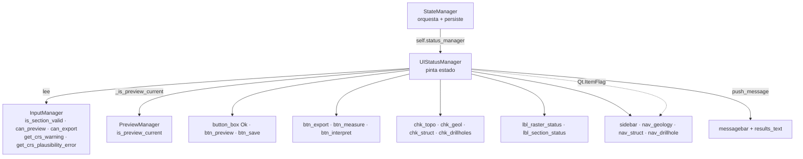
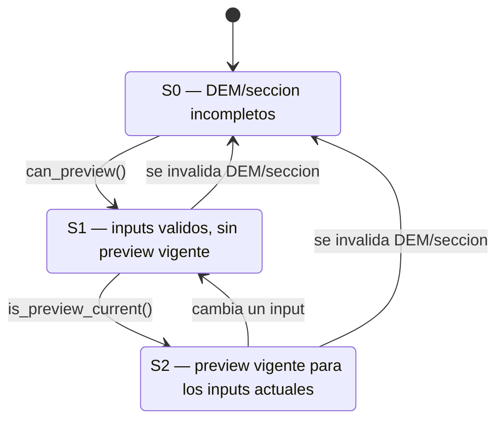

---
tags:
  - secinterp
  - code-walkthrough
  - gui
  - dialog
aliases:
  - ui_status_manager.py
  - UIStatusManager
cssclass: secinterp-note
---

# `gui/ui_status_manager.py`

> [!abstract] Resumen en una línea
> `UIStatusManager`: pinta el estado visual del diálogo (semáforos de validez, avisos de CRS, puertas de páginas, checkboxes de preview y botones S0/S1/S2) leyendo a `InputManager` y a `PreviewManager`, sin tocar jamás los widgets de entrada.

**Ruta**: gui/ui_status_manager.py (221 líneas)
**Clase principal**: `UIStatusManager(dialog)`
**Capa**: GUI (presentación · delegada por `StateManager`)
**Tags**: #secinterp #gui #dialog

---

## 🎯 ¿Por qué existe este archivo?

Los botones, los checkboxes y los semáforos deben reaccionar a cada cambio de input. Sin este módulo, esa lógica viviría en `StateManager` mezclada con persistencia, o peor, duplicada en cada página. En v3.9.0 el encargo creció: además de habilitar/deshabilitar, el manager **explica** por qué algo está bloqueado (tooltip, aviso de CRS) y **guía** al usuario por las páginas:

| Problema | Solución |
|----------|----------|
| Estado visual mezclado con guardar/cargar settings | `UIStatusManager` solo pinta; `StateManager` orquesta y persiste |
| Cada página habilitando botones por su cuenta | `update_button_state()` central con `can_preview()` / `can_export()` |
| Checkboxes de preview activos sin datos válidos | `update_preview_checkbox_states()` con puertas por sección |
| Páginas de geología/estructuras/sondajes sin inputs base | `update_page_states()` las apaga y retrocede a la página DEM |
| Usuario sin saber por qué Preview está apagado | `_preview_blocked_reason()` pinta el error exacto en el tooltip |
| Reproches repetidos de CRS en cada refresco | `_announce_crs_warnings()` deduplica por firma y avisa una vez |
| CRS mal etiquetado tratado como simple aviso | Semáforo rojo + mensaje `Critical` bloqueante |
| Iconos de tema que cambian de nombre/tamaño | Semáforos de color por stylesheet (`background-color` + `border-radius`) |

> [!important] Nota arquitectónica
> El manager **lee, no escribe, los inputs**: consulta `dialog.input_manager.is_section_valid(...)` / `can_preview()` / `can_export()` / `get_crs_warning()` / `get_crs_plausibility_error()` y solo muta presentación (colores, tooltips, `setEnabled`, flags de `QListWidgetItem`). La verdad sobre la validez vive en [[dialog_input_manager]]; aquí solo se refleja.

---

## 🧬 Diagrama de relaciones



> [!tip] Cómo leer
> Flecha sólida = delega/lee/muta; punteada = la mutación se hace por flags de Qt, no por `setEnabled` de un `QWidget`. El manager nunca importa el diálogo en runtime; todo llega por `self.dialog`.

---

## 📦 Imports — lectura arquitectónica

```python
from __future__ import annotations
from typing import TYPE_CHECKING, Any
from qgis.core import Qgis
from qgis.PyQt.QtCore import Qt
from qgis.PyQt.QtWidgets import QDialogButtonBox

if TYPE_CHECKING:
    from sec_interp.gui.main_dialog import SecInterpDialog  # type: ignore
```

| # | Observación |
|---|-------------|
| ① | `TYPE_CHECKING` para `SecInterpDialog`: el tipado ve el diálogo, el runtime no lo importa — ruptura deliberada del ciclo diálogo ↔ manager. |
| ② | `Qgis` solo para los niveles de mensaje (`MessageLevel.Critical` / `.Warning`) que usan los avisos de CRS. |
| ③ | `Qt` solo para `Qt.ItemFlag.ItemIsEnabled`: habilitar/deshabilitar ítems de `QListWidget` se hace por flags, no por `setDisabled`. |
| ④ | `QDialogButtonBox` solo para el enum `StandardButton.Ok`: localizar el botón OK del `button_box`. |
| ⑤ | Ningún import de páginas, capas ni `core/`: todo llega vía `self.dialog` (diálogo ya construido). |

---

## 🏗️ Inventario de estructura

**Módulo:** 3 constantes de estilo (`_STATUS_OK_STYLE`, `_STATUS_ERROR_STYLE`, `_STATUS_WARNING_STYLE`) — colores fijos, sin dependencia del tema ni del estilo Qt.

**Clase:** `class UIStatusManager` — 13 métodos, 2 atributos de instancia (`self.dialog`, `self._last_crs_signature` solo tras el primer anuncio).

| Método | Rol |
|---|---|
| `__init__(dialog)` | Guarda el diálogo; `_last_crs_signature` aún inexistente |
| `setup_indicators()` | Pinta el estado inicial DEM + sección (una sola vez) |
| `_apply_status(label, ok, ...)` | Pincel único: verde / ámbar / rojo + tooltip |
| `update_all()` | Refresco completo: botones + páginas + checkboxes + 2 semáforos + avisos CRS |
| `_announce_crs_warnings()` | Empuja aviso de CRS una vez por firma distinta |
| `update_page_states()` | Apaga geología/estructura/sondajes si falta DEM o sección |
| `_set_item_enabled(item, enabled)` | Habilita/deshabilita un `QListWidgetItem` por flags (static) |
| `update_preview_checkbox_states()` | Puertas por sección para los 4 checkboxes |
| `update_button_state()` | Gating S0/S1/S2 de Preview, OK y el trío Export/Measure/Interpret |
| `_preview_blocked_reason()` | Motivo legible de por qué Preview está apagado |
| `_is_preview_current()` | Preview vigente para los inputs actuales (fail-closed) |
| `update_raster_status()` | Semáforo DEM: rojo si CRS mal etiquetado, ámbar si mismatch, verde/rojo si válido |
| `update_section_status()` | Semáforo de la línea de sección |

---

## 📁 Dónde vive dentro de `gui/`

| Vecino | Relación con este módulo |
|---|---|
| [[dialog_state_manager]] | Lo compone como `self.status_manager` y delega los métodos de estado |
| [[dialog_input_manager]] | Fuente de verdad: `is_section_valid`, `can_preview`, `can_export`, `get_crs_warning`, `get_crs_plausibility_error` |
| [[dialog_preview_manager]] | `is_preview_current()` decide si el trío dependiente se habilita (S2) |
| [[dialog_message_mixin]] | `push_message()` recibe los avisos de CRS y los colorea en el área de resultados |
| [[main_dialog]] | `setup_indicators()` en `_init_managers`; `update_all()` y `load_settings()` al arrancar |
| [[dem_page]] / [[section_page]] | Dueñas de `lbl_raster_status` / `lbl_section_status`; la sección marca "Mandatory" |
| [[preview_page]] | Dueña de `btn_preview`, `btn_export`, `btn_measure`, `btn_interpret` y los `chk_*` gobernados |
| [[sidebar]] / [[main_window]] | Creadora de `nav_geology`, `nav_struct`, `nav_drillhole` y del orden de filas 0–6 |
| [[crs_plausibility]] / [[project_validator]] | En `core/`, calculan el mensaje que este manager anuncia |
| [[dialog_signal_manager]] | Dispara `update_all()` tras cada señal relevante |

---

## 📖 Recorrido método por método

### Constantes y `__init__` — estilos sin tema

```python
# Generic traffic-light styles: no dependency on theme icon names or Qt style.
_STATUS_OK_STYLE = "background-color: #2e7d32; border-radius: 8px;"
_STATUS_ERROR_STYLE = "background-color: #c62828; border-radius: 8px;"
_STATUS_WARNING_STYLE = "background-color: #f9a825; border-radius: 8px;"

def __init__(self, dialog: SecInterpDialog) -> None:
    """Initialize UI status manager."""
    self.dialog = dialog
```

A diferencia de v3.8.0, ya **no hay iconos de tema ni `setup_indicators` que resuelva pixmaps**. El color se pinta con un stylesheet sobre la etiqueta de 16×16, así el semáforo nunca depende de `mIconSuccess.svg` ni del tamaño del icono del tema activo. Es la respuesta directa a los puntos de atención de la versión anterior.

### `_apply_status` — un solo pincel para tres estados

```python
def _apply_status(self, label: Any, ok: bool, ok_tooltip: str,
                  error_tooltip: str, warning_tooltip: str = "") -> None:
    """Paint a status indicator as a colored dot."""
    label.clear()
    if not ok:
        label.setStyleSheet(_STATUS_ERROR_STYLE)
        label.setToolTip(error_tooltip)
    elif warning_tooltip:
        label.setStyleSheet(_STATUS_WARNING_STYLE)
        label.setToolTip(warning_tooltip)
    else:
        label.setStyleSheet(_STATUS_OK_STYLE)
        label.setToolTip(ok_tooltip)
```

Precedencia estricta: **rojo gana a todo** (inválido), luego **ámbar** (válido pero degradado, p. ej. CRS desparejado) y por último **verde** (válido). `label.clear()` borra cualquier pixmap heredado del tema, y la etiqueta usa `border-radius: 8px` para parecer un punto. El tooltip en verde es fijo y traducido ("Raster layer selected" / "Section line selected"); en ámbar/rojo es el mensaje real del validador, de modo que el semáforo **explica** además de señalar. Centralizar aquí la regla evita que los dos semáforos se desincronicen.

### `setup_indicators` y `update_all` — un solo punto de refresco

```python
def setup_indicators(self) -> None:
    self.update_raster_status()
    self.update_section_status()

def update_all(self) -> None:
    self.update_button_state()
    self.update_page_states()
    self.update_preview_checkbox_states()
    self.update_raster_status()
    self.update_section_status()
    self._announce_crs_warnings()
```

`setup_indicators()` es deliberadamente mínimo: solo los dos semáforos, para que al abrir el diálogo ya muestren el estado real. `update_all()` es el refresco completo y su **orden importa**: primero lo que permite actuar (botones, páginas, checkboxes), luego lo informativo (semáforos) y al final el aviso de CRS, que solo emite mensaje si la firma cambió. [[main_dialog]] llama a `setup_indicators()` dentro de `_init_managers` y a `update_all()` antes de `load_settings()`.

### `_announce_crs_warnings` — avisar una vez por firma

```python
def _announce_crs_warnings(self) -> None:
    im = self.dialog.input_manager
    plausibility = im.get_crs_plausibility_error()
    mismatch = im.get_crs_warning()
    signature = (plausibility, mismatch)
    if signature == getattr(self, "_last_crs_signature", None):
        return
    self._last_crs_signature = signature
    if plausibility:
        self.dialog.push_message(
            self.dialog.tr("Possible CRS mislabel"), plausibility,
            level=Qgis.MessageLevel.Critical, duration=10)
    elif mismatch:
        self.dialog.push_message(
            self.dialog.tr("CRS mismatch"), mismatch,
            level=Qgis.MessageLevel.Warning, duration=10)
```

`update_all()` corre con muchísimas señales; sin dedupe, cada tecleo repetiría el mismo aviso. La **firma** es la tupla `(plausibility, mismatch)`: solo cuando el texto cambia (incluido el paso a vacío) se actualiza `_last_crs_signature`. Si ambas cadenas quedan vacías, el método retorna en silencio — no se empuja ningún "todo bien". La prioridad es clara: un CRS mal etiquetado (`Critical`) tapa a un mismatch simple (`Warning`) mediante el `elif`. `getattr(..., None)` tolera que el atributo no exista todavía en el primer refresco.

### `update_page_states` y `_set_item_enabled` — gating de páginas

```python
def update_page_states(self) -> None:
    im = self.dialog.input_manager
    ready = bool(im.is_section_valid("dem") and im.is_section_valid("section"))
    for attr in ("nav_geology", "nav_struct", "nav_drillhole"):
        item = getattr(self.dialog, attr, None)
        if item is None:
            continue
        self._set_item_enabled(item, ready)
    if not ready:
        sidebar = getattr(self.dialog, "sidebar", None)
        if sidebar is not None and sidebar.currentRow() in (2, 3, 4):
            sidebar.setCurrentRow(0)

@staticmethod
def _set_item_enabled(item: Any, enabled: bool) -> None:
    flags = item.flags()
    if enabled:
        flags |= Qt.ItemFlag.ItemIsEnabled
    else:
        flags &= ~Qt.ItemFlag.ItemIsEnabled
    item.setFlags(flags)
```

DEM y sección son obligatorios; sin ambos, las páginas de geología, estructura y sondajes no tienen sentido. El `for` con `getattr` es tolerante a variantes del diálogo sin esas páginas. Si el usuario está parado en una de ellas (filas 2–4 del [[sidebar]]) cuando se invalidan los inputs, el manager lo devuelve a la fila 0 (DEM). Detalle que suele fallar: un `QListWidgetItem` **no** tiene `setDisabled` (eso es de un `QWidget`); la interactividad se controla con el flag `Qt.ItemFlag.ItemIsEnabled`, y `test_ui_gating.py` lo verifica contra un `MockQListWidgetItem` real.

### `update_preview_checkbox_states` — puertas por sección

```python
def update_preview_checkbox_states(self) -> None:
    im = self.dialog.input_manager
    has_section = im.is_section_valid("section")
    has_dem = im.is_section_valid("dem")
    pw = self.dialog.preview_widget
    pw.chk_topo.setEnabled(has_dem and has_section)
    pw.chk_geol.setEnabled(im.is_section_valid("geology") and has_section)
    pw.chk_struct.setEnabled(im.is_section_valid("structure") and has_section)
    pw.chk_drillholes.setEnabled(im.is_section_valid("drillhole") and has_section)
```

La línea de sección es el **interruptor maestro**: sin sección válida, ningún checkbox se habilita aunque su sección sí lo sea. Topografía exige además DEM válido; geología, estructuras y sondajes exigen su propia sección más la línea. `has_section`/`has_dem` se cachean en locales para no repetir consultas.

### `update_button_state` — actuar solo si se puede (S0/S1/S2)

```python
def update_button_state(self) -> None:
    im = self.dialog.input_manager
    can_preview = im.can_preview()
    preview_current = bool(can_preview) and self._is_preview_current()
    pw = self.dialog.preview_widget
    pw.btn_preview.setEnabled(can_preview)
    pw.btn_preview.setToolTip(
        self.dialog.tr("Generate preview") if can_preview else self._preview_blocked_reason())
    self.dialog.button_box.button(QDialogButtonBox.StandardButton.Ok).setEnabled(can_preview)
    pw.btn_export.setEnabled(preview_current)
    pw.btn_measure.setEnabled(preview_current)
    pw.btn_interpret.setEnabled(preview_current)
    if hasattr(self.dialog, "btn_save"):
        self.dialog.btn_save.setEnabled(im.can_export())
```

Dos verdades distintas gobiernan los botones: **¿se puede previsualizar?** (`can_preview()`) y **¿el preview es vigente para los inputs actuales?** (`_is_preview_current()`). Preview y OK siguen la primera; Export/Measure/Interpret exigen ambas. `btn_save` se protege con `hasattr` porque solo existe en variantes con guardado explícito, y su puerta es `can_export()`, más estricta aún (exige carpeta de salida). El tooltip de Preview se reescribe en cada refresco: si está apagado, siempre explica el motivo.

### `_preview_blocked_reason` y `_is_preview_current` — explicar y fallar cerrado

```python
def _preview_blocked_reason(self) -> str:
    im = self.dialog.input_manager
    return (
        im.get_section_error("section") or im.get_section_error("dem")
        or im.get_crs_plausibility_error()
        or self.dialog.tr("Complete the required inputs"))

def _is_preview_current(self) -> bool:
    pm = getattr(self.dialog, "preview_manager", None)
    is_current = getattr(pm, "is_preview_current", None)
    if not callable(is_current):
        return False
    try:
        return bool(is_current())
    except Exception:
        return False
```

La primera función es una cadena de prioridades con `or`: el primer motivo no vacío se muestra, y el CRS mal etiquetado entra antes del genérico "Complete the required inputs". La segunda es **fail-closed**: sin `preview_manager`, sin método o ante cualquier excepción devuelve `False` y el trío dependiente queda apagado. [[dialog_preview_manager]] compara el hash de los parámetros de ensamblado y la exageración vertical; cualquier cambio de input invalida el preview.

### `update_raster_status` y `update_section_status` — semáforos

```python
def update_raster_status(self) -> None:
    im = self.dialog.input_manager
    ok = im.is_section_valid("dem")
    plausibility = im.get_crs_plausibility_error()
    if plausibility:
        self._apply_status(self.dialog.page_dem.lbl_raster_status, False,
                           self.dialog.tr("Raster layer selected"), plausibility)
        return
    warning = im.get_crs_warning() if ok else ""
    self._apply_status(self.dialog.page_dem.lbl_raster_status, ok,
                       self.dialog.tr("Raster layer selected"),
                       im.get_section_error("dem"), warning_tooltip=warning)
```

El semáforo DEM es el más rico: **rojo duro** si el CRS parece mal etiquetado (gana incluso sobre un DEM válido), **ámbar** si el DEM es válido pero el CRS no coincide con las demás capas, y **verde/rojo** según `is_section_valid("dem")`. El `if plausibility: ... return` implementa explícitamente la precedencia rojo > ámbar. `update_section_status` es simétrica con `page_section.lbl_section_status` y `"Section line selected"`, sin capa CRS.

---

## 🚦 Máquina de estados S0/S1/S2

`update_button_state()` formaliza tres escenarios que antes estaban implícitos:

| Estado | Condición | Preview + OK | Export / Measure / Interpret |
|---|---|---|---|
| **S0** | `can_preview()` = `False` | Deshabilitados | Deshabilitados |
| **S1** | `can_preview()` = `True`, sin preview vigente | Habilitados | Deshabilitados |
| **S2** | `can_preview()` = `True` y `_is_preview_current()` = `True` | Habilitados | Habilitados |



> [!important] Regla de oro
> `preview_current = bool(can_preview) and self._is_preview_current()`. La conjunción garantiza que **nunca** se habilita el trío sin inputs válidos, aunque el gestor de preview devuelva un valor obsoleto. `btn_save` queda fuera de la máquina: depende solo de `can_export()`.

---

## 🛰️ Avisos de CRS: qué se anuncia y con qué severidad

| Detección | Origen en `core/` | Semáforo DEM | Mensaje | Severidad |
|---|---|---|---|---|
| CRS mal etiquetado | `ProjectValidator.crs_plausibility_error` → [[crs_plausibility]] | Rojo | "Possible CRS mislabel" | `Critical` (bloquea `can_preview`) |
| CRS desparejado entre capas | `ProjectValidator.crs_compatibility_warning` | Ámbar | "CRS mismatch" | `Warning` (no bloquea) |
| Todo coherente | — | Verde/rojo por validez | (ninguno) | — |

`crs_compatibility_warning()` usa como referencia la **primera capa configurada válida**, de modo que el DEM (si existe) lidera la comparación. `crs_plausibility_error()` recorre los metadatos de todas las capas configuradas y une los motivos con salto de línea. La heurística es conservadora: solo dispara cuando la extensión (o el píxel) contradice el CRS declarado.

> [!tip] Por qué el aviso es `Critical` y de 10 segundos
> Un CRS mal etiquetado produce perfiles silenciosamente erróneos; [[dialog_input_manager]] lo incorpora a `can_preview()`, así que bloquear es proporcional. `push_message()` deja además constancia HTML en los resultados vía [[dialog_message_mixin]].

---

## 📊 Matriz completa de puertas

| Widget | Puerta | Fuente | Severidad |
|---|---|---|---|
| `nav_geology` / `nav_struct` / `nav_drillhole` | DEM válido Y sección válida | `is_section_valid × 2` | Página apagada + fallback a DEM |
| `chk_topo` | DEM válido Y sección válida | `is_section_valid × 2` | Sin base no hay topo |
| `chk_geol` | Geología válida Y sección válida | `is_section_valid × 2` | Sin línea no se proyecta |
| `chk_struct` | Estructura válida Y sección válida | `is_section_valid × 2` | Sin línea no se proyecta |
| `chk_drillholes` | Sondajes válidos Y sección válida | `is_section_valid × 2` | Sin línea no se proyecta |
| `btn_preview` + OK | `can_preview()` | Agregada en `InputManager` | Aceptar equivale a previsualizable |
| `btn_export` / `btn_measure` / `btn_interpret` | `can_preview() ∧ is_preview_current()` | Agregada + hash vigente | S2 únicamente |
| `btn_save` | `can_export()` (si existe) | Agregada + carpeta de salida | Exportar exige destino |
| `lbl_raster_status` | `is_section_valid("dem")` + CRS | Semáforo 3 estados + tooltip | Informa, no bloquea (salvo CRS) |
| `lbl_section_status` | `is_section_valid("section")` | Semáforo + tooltip | Informa, no bloquea |

> [!tip] Dos severidades, dos widgets
> Páginas, checkboxes y botones **bloquean** (puerta dura); los semáforos **informan** (color + tooltip con el error exacto). La única excepción es el CRS mal etiquetado, que tiñe el semáforo de rojo *y* bloquea el preview.

---

## 🔄 Flujo de datos

| Fase | Entrada | Transformación | Salida |
|---|---|---|---|
| Arranque | `setup_indicators()` vía `StateManager` | 2 semáforos iniciales | Estado real sin parpadeo |
| Cambio de input | Señal de página → `update_all()` | Lectura de `InputManager` + `PreviewManager` | Botones + páginas + checkboxes + semáforos + aviso CRS |
| Preview generado | `is_preview_current()` = `True` | Transición S1 → S2 | Se habilita Export/Measure/Interpret |
| Input cambiado | Hash de preview ya no coincide | Transición S2 → S1 | Se apaga el trío, Preview sigue disponible |
| Restauración | `load_settings()` | Valores masivos → `update_all()` | UI coherente de una vez |
| CRS repetido | Misma firma `(plausibility, mismatch)` | `_announce_crs_warnings` retorna temprano | Sin mensaje duplicado |
| Fallo del preview manager | `_is_preview_current` lanza excepción | `except: return False` | Trío deshabilitado (fail-closed) |

---

## 🏛️ Patrones de diseño presentes

| Patrón | Dónde | Propósito |
|---|---|---|
| **Delegation chain** | `StateManager` → `status_manager` | Separar orquestación/persistencia de pintado |
| **State machine** | `update_button_state` (S0/S1/S2) | Derivar habilitación de dos verdades |
| **Fail-closed default** | `_is_preview_current` | Ante duda, apagar lo dependiente |
| **Memoization / dedupe** | `_last_crs_signature` | Un aviso por firma distinta |
| **Guard clause** | `getattr(..., None)` / `if item is None: continue` | Tolerar variantes y arranques parciales |
| **Feature check** | `hasattr(self.dialog, "btn_save")` | Soportar variantes del diálogo |
| **Strategy via stylesheet** | `_STATUS_*_STYLE` + `_apply_status` | Semáforos independientes del tema |

---

## 🧾 Resumen de la API

| Símbolo | Firma | Uso típico |
|---|---|---|
| `UIStatusManager` | `(dialog)` | `UIStatusManager(dialog)` en `StateManager.__init__` |
| `setup_indicators` | `() -> None` | Una vez en `_init_managers` |
| `update_all` | `() -> None` | Tras cualquier cambio de inputs o settings |
| `update_page_states` | `() -> None` | Puertas de las páginas de geología/estructura/sondajes |
| `update_preview_checkbox_states` | `() -> None` | Puertas de `chk_topo/geol/struct/drillholes` |
| `update_button_state` | `() -> None` | Gating S0/S1/S2 de Preview, OK y el trío |
| `_preview_blocked_reason` | `() -> str` | Tooltip de Preview apagado |
| `_is_preview_current` | `() -> bool` | Verdad de "preview vigente" (fail-closed) |
| `update_raster_status` / `update_section_status` | `() -> None` | Semáforos DEM y sección |
| `_announce_crs_warnings` | `() -> None` | Aviso de CRS deduplicado |

---

## 🛡️ Manejo de errores

Sin `try/except` en la mayoría del módulo: las defensas son `getattr(..., None)` en `_announce_crs_warnings` y `update_page_states`, `hasattr` en `btn_save`, y el `try/except` deliberado **y único** de `_is_preview_current` (fail-closed). Asume que `input_manager`, `preview_widget`, `page_dem` y `page_section` existen — invariante que garantiza `_init_managers` antes de cualquier `update_all`. Si una página renombra `lbl_raster_status`, falla en voz alta con `AttributeError`: preferible a un semáforo silenciosamente muerto.

---

## 🧪 Tests asociados

Ahora existe cobertura dedicada para las novedades de v3.9.0:

- `tests/gui/test_ui_gating.py` — S0/S1/S2 (`TestButtonGating`), puertas de página y fallback a DEM (`TestPageStates`), etiquetas "Mandatory" (`TestMandatoryLabels`), semáforos por stylesheet (`TestStatusIndicatorFallback`), mismatch de CRS una sola vez (`TestCrsMismatchWarning`) y CRS mal etiquetado bloqueante (`TestCrsPlausibilityBlocking`).
- `tests/core/test_crs_plausibility.py` — heurística de plausibilidad de CRS en `core/`.
- `tests/gui/test_dialog_input_manager.py` — `can_preview` con `get_crs_plausibility_error`.
- `tests/gui/test_dialog_state_manager.py` y `tests/gui/test_main_dialog_core.py` — delegación y `update_all()` al construir el diálogo.

---

## 👀 Observaciones y notas

> [!success] Fortalezas
> - Separación nítida: pinta sin poseer la verdad (vive en `InputManager` y `PreviewManager`).
> - Semáforos por stylesheet: inmunes a cambios de nombre de icono o de tema Qt.
> - La máquina S0/S1/S2 evita exports sin preview y previews imposibles por construcción.
> - El dedupe de CRS convierte una señal ruidosa en un aviso puntual y accionable.

> [!warning] Puntos de atención
> - Nombres de widgets hardcodeados (`lbl_raster_status`, `chk_topo`, filas 2–4 del sidebar): renombrar en una página rompe aquí.
> - Solo DEM y sección tienen semáforo; geología/estructuras/sondajes solo apagan su checkbox o su página, sin explicar por qué.
> - La heurística de CRS es conservadora: puede no detectar etiquetas erróneas sutiles y no sustituye una revisión humana.
> - `btn_save` tras `hasattr`: dos variantes del diálogo con superficies distintas sin documentar.

> [!question] Preguntas abiertas
> - ¿Semáforos también para geología, estructura y sondajes con sus `get_section_error`?
> - ¿Persistir los avisos de CRS ya mostrados entre sesiones para no repetirlos al reabrir?

---

## 🔗 Notas relacionadas

- [[Index]] — índice de la bóveda
- [[dialog_state_manager]] — compone este manager como `status_manager`
- [[dialog_input_manager]] — fuente de verdad de la validez y de los mensajes de CRS
- [[dialog_preview_manager]] — `is_preview_current`, verdad de S2
- [[dialog_message_mixin]] — `push_message`, destino de los avisos de CRS
- [[main_dialog]] — `_init_managers` y `update_all` al arrancar
- [[dialog_facade_mixin]] — proxies de estado hacia el diálogo
- [[dem_page]] / [[section_page]] — etiquetas de estado gobernadas; "Mandatory"
- [[preview_page]] — botones y checkboxes gobernados
- [[sidebar]] — filas 0–6 y las páginas de geología/estructura/sondajes
- [[crs_plausibility]] / [[project_validator]] — heurística y orquestación del CRS en `core/`

---

*Nota de la bóveda SecInterp Code Walkthrough v2 — v3.9.1*
