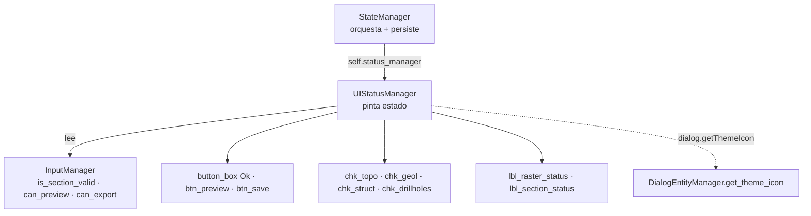

---
tags:
  - secinterp
  - code-walkthrough
  - gui
  - dialog
aliases:
  - ui_status_manager.py
  - UIStatusManager
cssclass: secinterp-note
---

# `gui/ui_status_manager.py`

> [!abstract] Resumen en una línea
> `UIStatusManager`: gestiona el estado visual del diálogo (iconos de validez por sección, habilitado de botones y checkboxes de preview) leyendo a `InputManager` sin tocar widgets de entrada.

**Ruta**: `gui/ui_status_manager.py` (85 líneas)
**Clase principal**: `UIStatusManager(dialog)`
**Capa**: GUI (presentación · delegada por `StateManager`)
**Tags**: #secinterp #gui #dialog

---

## 🎯 ¿Por qué existe este archivo?

Los botones y los semáforos de validez deben reaccionar a cada cambio de input. Sin este módulo, esa lógica viviría en `StateManager` mezclada con persistencia, o peor, en cada página:

| Problema | Solución |
|----------|----------|
| Estado visual mezclado con guardar/cargar settings | `UIStatusManager` solo pinta; `StateManager` orquesta y persiste |
| Cada página habilitando botones por su cuenta | `update_button_state()` central con `can_preview()` / `can_export()` |
| Checkboxes de preview activos sin datos válidos | `update_preview_checkbox_states()` con puertas por sección |
| Iconos de "requerido" creados en cada página | `setup_indicators()` los resuelve una vez vía `dialog.getThemeIcon` |
| Import circular diálogo ↔ manager | `TYPE_CHECKING` + referencia al diálogo ya construido |

> [!important] Nota arquitectónica
> El manager **lee, no escribe, los inputs**: consulta `dialog.input_manager.is_section_valid(...)` / `can_preview()` / `can_export()` y solo muta presentación (iconos, `setEnabled`, tooltips). La verdad sobre la validez vive en [[dialog_input_manager]]; aquí solo se refleja.

---

## 🧬 Diagrama de relaciones



> [!tip] Cómo leer
> Flecha sólida = delega/lee/muta; punteada = resolución de iconos a través del diálogo. El manager nunca importa el diálogo en tiempo de ejecución.

---

## 📦 Imports — lectura arquitectónica

```python
# gui/ui_status_manager.py
from __future__ import annotations

from typing import TYPE_CHECKING

from qgis.PyQt.QtWidgets import QDialogButtonBox

if TYPE_CHECKING:
    from sec_interp.gui.main_dialog import SecInterpDialog  # type: ignore
```

| # | Observación |
|---|-------------|
| ① | `TYPE_CHECKING` para `SecInterpDialog`: el tipado ve el diálogo, el runtime no lo importa — ruptura deliberada del ciclo diálogo ↔ manager. |
| ② | `QDialogButtonBox` solo para el enum `StandardButton.Ok`: localizar el botón OK del `button_box` sin guardar referencias. |
| ③ | Ningún import de páginas, capas o `core/`: todo llega vía `self.dialog` (diálogo ya construido). |

---

## 🏗️ Inventario de estructura

**Clases:** `class UIStatusManager` — 6 métodos, 2 atributos de iconos (`_warning_icon`, `_success_icon`, ambos `None` hasta `setup_indicators`).

| Método | Rol |
|---|---|
| `__init__(dialog)` | Guarda el diálogo; iconos a `None` |
| `setup_indicators()` | Resuelve iconos y pinta el estado inicial DEM + sección |
| `update_all()` | Refresco completo: botones + checkboxes + 2 semáforos |
| `update_preview_checkbox_states()` | Puertas por sección para los 4 checkboxes |
| `update_button_state()` | `btn_preview` + botón OK por `can_preview()`; `btn_save` por `can_export()` |
| `update_raster_status()` / `update_section_status()` | Semáforo de una etiqueta: pixmap 16px + tooltip |

---

## 📁 Dónde vive dentro de `gui/`

| Vecino | Relación con este módulo |
|---|---|
| [[dialog_state_manager]] | Lo compone como `self.status_manager` y delega los 5 métodos de estado |
| [[dialog_input_manager]] | Fuente de verdad: `is_section_valid`, `can_preview`, `can_export`, `get_section_error` |
| [[main_dialog]] | `state_manager.setup_indicators()` en `_init_managers`; `update_all()` al arrancar |
| [[main_dialog_utils]] | Iconos resueltos vía `dialog.getThemeIcon` → `DialogEntityManager` |
| [[dem_page]] / [[section_page]] | Dueñas de `lbl_raster_status` / `lbl_section_status` |
| [[preview_page]] | Dueña de `btn_preview` y los `chk_*` gobernados |

---

## 📖 Recorrido método por método

### `__init__` y `setup_indicators` — iconos perezosos

```python
def __init__(self, dialog: SecInterpDialog) -> None:
    """Initialize UI status manager."""
    self.dialog = dialog
    self._warning_icon = None
    self._success_icon = None

def setup_indicators(self) -> None:
    """Set up required field indicators with warning icons."""
    self._warning_icon = self.dialog.getThemeIcon("mMessageLogCritical.svg")
    self._success_icon = self.dialog.getThemeIcon("mIconSuccess.svg")

    # Initial update
    self.update_raster_status()
    self.update_section_status()
```

Los iconos se resuelven una vez (no en cada refresco) y por nombre de tema, así siguen al tema QGIS. `StateManager.setup_indicators()` lo invoca durante `_init_managers`, antes de `load_settings()`: al abrir, los semáforos ya muestran el estado real, no un parpadeo posterior.

### `update_all` — un solo punto de refresco

```python
def update_all(self) -> None:
    """Update all visual status components."""
    self.update_button_state()
    self.update_preview_checkbox_states()
    self.update_raster_status()
    self.update_section_status()
```

Cuatro llamadas, orden fijo: primero lo que permite actuar (botones, checkboxes) y luego lo informativo (semáforos). `StateManager.load_settings()` lo invoca tras restaurar valores, de modo que un cambio masivo de settings termina en un único refresco coherente.

### `update_preview_checkbox_states` — puertas por sección

```python
def update_preview_checkbox_states(self) -> None:
    """Enable or disable preview checkboxes based on input validity."""
    im = self.dialog.input_manager
    has_section = im.is_section_valid("section")
    has_dem = im.is_section_valid("dem")

    pw = self.dialog.preview_widget
    pw.chk_topo.setEnabled(has_dem and has_section)
    pw.chk_geol.setEnabled(im.is_section_valid("geology") and has_section)
    pw.chk_struct.setEnabled(im.is_section_valid("structure") and has_section)
    pw.chk_drillholes.setEnabled(im.is_section_valid("drillhole") and has_section)
```

La línea de sección es el **interruptor maestro**: sin sección válida, ningún checkbox se habilita aunque su sección sí lo sea. Topografía exige además DEM válido; geología, estructuras y sondajes exigen su propia sección más la línea. `has_section`/`has_dem` se cachean en locales para no repetir consultas.

### `update_button_state` — actuar solo si se puede

```python
def update_button_state(self) -> None:
    """Enable or disable buttons based on input validity."""
    im = self.dialog.input_manager
    can_preview = im.can_preview()

    self.dialog.preview_widget.btn_preview.setEnabled(can_preview)
    self.dialog.button_box.button(QDialogButtonBox.StandardButton.Ok).setEnabled(can_preview)

    if hasattr(self.dialog, "btn_save"):
        self.dialog.btn_save.setEnabled(im.can_export())
```

`btn_preview` y el OK del `button_box` comparten `can_preview()`: imposible aceptar lo que no se puede previsualizar. `btn_save` se protege con `hasattr` porque solo existe en variantes del diálogo con guardado explícito; su puerta es `can_export()`, más estricta (exige carpeta de salida).

### `update_raster_status` / `update_section_status` — semáforos

```python
def update_raster_status(self) -> None:
    """Update raster layer status icon."""
    if not self._warning_icon:
        return
    im = self.dialog.input_manager
    label = self.dialog.page_dem.lbl_raster_status
    if im.is_section_valid("dem"):
        label.setPixmap(self._success_icon.pixmap(16, 16))
        label.setToolTip(self.dialog.tr("Raster layer selected"))
    else:
        label.setPixmap(self._warning_icon.pixmap(16, 16))
        label.setToolTip(im.get_section_error("dem"))
```

Guarda temprana si los iconos aún no se resolvieron (`setup_indicators` pendiente): sin crash en arranques parciales. En éxito, tooltip fijo traducido; en fallo, el mensaje exacto de `get_section_error("dem")`, así el semáforo explica además de señalar. `update_section_status` es simétrica con `page_section.lbl_section_status` y `"Section line selected"`. El pixmap se escala a 16×16: detalle que evita semáforos gigantes con temas de iconos grandes.

---

## 📊 Matriz completa de puertas

| Widget | Puerta | Fuente | Severidad |
|---|---|---|---|
| `chk_topo` | DEM válido Y sección válida | `is_section_valid × 2` | Sin base no hay topo |
| `chk_geol` | Geología válida Y sección válida | `is_section_valid × 2` | Sin línea no se proyecta |
| `chk_struct` | Estructura válida Y sección válida | `is_section_valid × 2` | Sin línea no se proyecta |
| `chk_drillholes` | Sondajes válidos Y sección válida | `is_section_valid × 2` | Sin línea no se proyecta |
| `btn_preview` + OK | `can_preview()` | Agregada en `InputManager` | Aceptar equivale a previsualizable |
| `btn_save` | `can_export()` (si existe) | Agregada + carpeta de salida | Exportar exige destino |
| `lbl_raster_status` | `is_section_valid("dem")` | Semáforo + tooltip | Informa, no bloquea |
| `lbl_section_status` | `is_section_valid("section")` | Semáforo + tooltip | Informa, no bloquea |

> [!tip] Dos severidades, dos widgets
> Los checkboxes y botones **bloquean** (puerta dura); los semáforos **informan** (luz + tooltip con el error exacto). El usuario siempre sabe qué falta y dónde.

---

## 🔄 Flujo de datos

| Fase | Entrada | Transformación | Salida |
|---|---|---|---|
| Arranque | `setup_indicators()` vía `StateManager` | Resolución de 2 iconos + 2 semáforos | Estado inicial real |
| Cambio de input | Señal de página → `update_all()` | Lectura de `InputManager` | Botones + checkboxes + semáforos |
| Restauración | `load_settings()` | Valores masivos → `update_all()` | UI coherente de una vez |
| Fallo parcial | Iconos aún `None` | Guarda temprana `if not self._warning_icon` | Sin crash, sin pintado |

---

## 🏛️ Patrones de diseño presentes

| Patrón | Dónde | Propósito |
|---|---|---|
| **Delegation chain** | `StateManager` → `status_manager` | Separar orquestación/persistencia de pintado |
| **Read-only observer** | Todo el módulo | Reflejar validez sin poseerla |
| **Lazy icon resolution** | `setup_indicators` | Un `getThemeIcon` por icono, no por refresco |
| **Guard clause** | `if not self._warning_icon: return` | Tolerar arranque parcial |
| **Feature check** | `hasattr(self.dialog, "btn_save")` | Soportar variantes del diálogo |

---

## 🧾 Resumen de la API

| Símbolo | Firma | Uso típico |
|---|---|---|
| `UIStatusManager` | `(dialog)` | `UIStatusManager(dialog)` en `StateManager.__init__` |
| `setup_indicators` | `() -> None` | Una vez en `_init_managers` |
| `update_all` | `() -> None` | Tras cualquier cambio de inputs o settings |
| `update_preview_checkbox_states` | `() -> None` | Puertas de `chk_topo/geol/struct/drillholes` |
| `update_button_state` | `() -> None` | Puertas de `btn_preview`, OK y `btn_save` |
| `update_raster_status` / `update_section_status` | `() -> None` | Semáforos DEM y sección |

---

## 🛡️ Manejo de errores

Sin `try/except`: las defensas son la guarda de iconos (`None` → retorno) y el `hasattr` de `btn_save`. Asume que `input_manager`, `preview_widget`, `page_dem` y `page_section` existen — invariante que garantiza `_init_managers` antes de cualquier `update_all`. Si una página renombra `lbl_raster_status`, falla con `AttributeError` en voz alta: preferible a un semáforo silenciosamente muerto.

---

## 🧪 Tests asociados

Sin `tests/gui/test_ui_status_manager.py` dedicado; cobertura honesta e indirecta:

- `tests/gui/test_main_dialog_core.py` — `update_all()` corre al construir el diálogo.
- `tests/gui/test_main_dialog_settings.py` — refresco tras `load_settings()`.
- `tests/gui/test_main_dialog_validation_manager.py` — puertas `can_preview`/`can_export` bajo validación.
- `tests/gui/test_dialog_state_manager.py` — delegación `StateManager` → `status_manager`.

---

## 👀 Observaciones y notas

> [!success] Fortalezas
> - Separación nítida: pinta sin poseer la verdad (vive en `InputManager`).
> - Iconos resueltos una vez y por tema: barato y consistente.
> - La sección como interruptor maestro evita previews imposibles por construcción.
> - `TYPE_CHECKING` rompe el ciclo sin perder tipado.

> [!warning] Puntos de atención
> - Nombres de widgets hardcodeados (`lbl_raster_status`, `chk_topo`…): renombrar en una página rompe aquí.
> - Solo DEM y sección tienen semáforo; geología/estructuras/sondajes solo apagan su checkbox, sin explicar por qué.
> - `btn_save` tras `hasattr`: dos variantes del diálogo con superficies distintas sin documentar.

> [!question] Preguntas abiertas
> - ¿Semáforos también para geología, estructura y sondajes con sus `get_section_error`?
> - ¿Constantes para los nombres de icono en vez de literales `"m*.svg"`?

---

## 🔗 Notas relacionadas

- [[Index]] — índice de la bóveda
- [[dialog_state_manager]] — compone este manager como `status_manager`
- [[dialog_input_manager]] — fuente de verdad de la validez
- [[main_dialog]] — `_init_managers` y `update_all` al arrancar
- [[dialog_facade_mixin]] — `update_button_state` / `update_preview_checkbox_states` como proxies
- [[main_dialog_utils]] — `get_theme_icon`, resolución final de iconos
- [[main_dialog_config]] — glifos ✓/✗/⚠ coherentes con los semáforos
- [[dem_page]] / [[section_page]] — etiquetas de estado gobernadas
- [[preview_page]] — botones y checkboxes gobernados

---

*Nota de la bóveda SecInterp Code Walkthrough v2 — v3.8.0*
