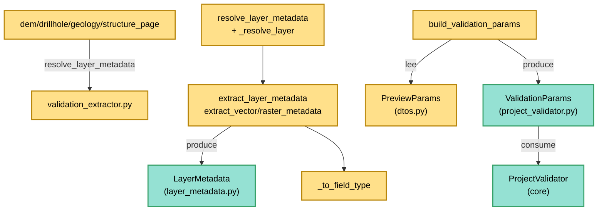

---
tags:
  - secinterp
  - code-walkthrough
  - gui
  - adapters
aliases:
  - validation_extractor.py
  - resolve_layer_metadata
  - extract_layer_metadata
  - build_validation_params
cssclass: secinterp-note
---

# `gui/adapters/validation_extractor.py`

> [!abstract] Resumen en una línea
> Adaptador **Extract** de validación (solo funciones, sin clases) que convierte referencias y capas QGIS en registros `LayerMetadata` desacoplados y construye `ValidationParams` puros para que el `ProjectValidator` del core valide sin importar QGIS.

**Ruta**: `gui/adapters/validation_extractor.py` (176 líneas)
**Función principal**: `build_validation_params(params)` (ensambla todo); `resolve_layer_metadata` (resolución + extracción)
**Capa**: GUI · Adapter (lado Extract, depende de QGIS)
**Tags**: #secinterp #gui #adapters

---

## 🎯 ¿Por qué existe este archivo?

El `ProjectValidator` del core valida vecindades de capas, bandas y campos,
pero tiene prohibido importar `qgis.core`. Alguien debe traducir "la capa del
combo" a "metadatos puros" antes de llamar al validador:

| Problema | Solución |
|----------|----------|
| El core no puede recibir `QgsVectorLayer`/`QgsRasterLayer` | `extract_*_metadata` produce `LayerMetadata` (nombre, validez, campos, CRS) |
| Los diálogos guardan referencias (ID, nombre, objeto) | `_resolve_layer` acepta las tres formas vía `QgsProject` |
| `PreviewParams` lleva 20+ referencias QGIS vivas | `build_validation_params` las convierte todas en un `ValidationParams` puro |
| Los tipos de campo son `QVariant` (Qt) | `_to_field_type` los mapea a `FieldType` del dominio |

> [!important] Nota arquitectónica
> Es el **pre-Extract de la validación**: corre antes que cualquier extractor de
> datos y decide si el pipeline llega a ejecutarse. Todo lo que cruza al
> `ProjectValidator` son `str`, `float`, `bool` y `LayerMetadata` — ni un
> `QgsMapLayer` sobrevive a `build_validation_params`.

---

## 🧬 Diagrama de relaciones



> [!tip] Cómo leer
> Dos consumidores: las páginas de settings llaman `resolve_layer_metadata`
> para validar una capa al vuelo; el pipeline completo llama
> `build_validation_params` para validar el proyecto entero antes de procesar.

---

## 📦 Imports — lectura arquitectónica

```python
# gui/adapters/validation_extractor.py
from __future__ import annotations

from typing import Any

from qgis.core import (
    QgsMapLayer,
    QgsProject,
    QgsRasterLayer,
    QgsVectorLayer,
    QgsWkbTypes,
)

from sec_interp.core.domain import FieldType
from sec_interp.core.validation.layer_metadata import (
    GEOMETRY_LINE,
    GEOMETRY_POINT,
    GEOMETRY_POLYGON,
    GEOMETRY_UNKNOWN,
    KIND_RASTER,
    KIND_UNKNOWN,
    KIND_VECTOR,
    LayerMetadata,
)
```

| # | Observación |
|---|-------------|
| ① | Cinco clases `qgis.core` con `QgsMapLayer` en runtime (a diferencia de `layer_resolver`, que lo esconde tras `TYPE_CHECKING`): aquí el `isinstance` exige la clase real. |
| ② | `QgsProject` solo se usa en `_resolve_layer` (fallback por ID/nombre). |
| ③ | Importa **ocho** símbolos de `core/validation/layer_metadata.py` (constantes `KIND_*` y `GEOMETRY_*` + `LayerMetadata`): el vocabulario de salida es 100% core. |
| ④ | `FieldType` viene de `core/domain`: el puente QVariant→dominio queda tipado. |
| ⑤ | `ValidationParams` se importa en **diferido** dentro de `build_validation_params` (evita coste/ciclo en import del módulo). |
| ⑥ | Sin `qgis.PyQt`, sin `tr()`, sin logger: funciones silenciosas que devuelven `None`/defaults ante lo irresoluble. |

---

## 🏗️ Inventario de estructura

**Constante de módulo:**
- `_GEOMETRY_MAP` — `dict[QgsWkbTypes.GeometryType, str]`: punto/línea/polígono → constantes `GEOMETRY_*` del core.

**Funciones públicas (4):**
- `resolve_layer_metadata(layer_ref)` — resuelve la referencia y extrae metadatos (`LayerMetadata | None`).
- `extract_layer_metadata(layer)` — despacha vector/raster/desconocido.
- `extract_vector_metadata(layer)` — `LayerMetadata` con conteo, tipo de geometría, campos + tipos y CRS.
- `extract_raster_metadata(layer)` — `LayerMetadata` con bandas y CRS.
- `build_validation_params(params)` — `PreviewParams` → `ValidationParams` (20 campos convertidos).

**Funciones privadas (2):**
- `_resolve_layer(layer_ref)` — objeto/ID/nombre → `QgsMapLayer | None` (sin caché).
- `_to_field_type(qvariant_type)` — `int(QVariant)` → `FieldType` (`NULL` si falla).

---

## 📁 Archivos del paquete

El adaptador vive en el paquete `gui/adapters/` (fase Extract completa):

| Archivo | Líneas | Rol |
|---|--:|---|
| `__init__.py` | 7 | Docstring del paquete: contrato Extract-then-Compute |
| `drillhole_extractor.py` | 369 | `DrillholeExtractor` → `DrillholeContext` |
| `geology_extractor.py` | 235 | `GeologyExtractor` → `GeologyContext` |
| `geometry.py` | 226 | Helpers QGIS de geometría y muestreo DEM |
| `layer_resolver.py` | 113 | `LayerResolver` + `resolve_layer` (caché de capas) |
| `structure_extractor.py` | 226 | `SectionContext` + `StructureExtractor` |
| `validation_extractor.py` | 176 | `resolve_layer_metadata`, `build_validation_params` (esta nota) |
| `feature_fetcher.py` | 84 | `DataFetcher` (lecturas bulk de hijas) |
| `profile_extractor.py` | 86 | `ProfileExtractor` → `ProfileData` |

---

## 📖 Recorrido función por función

### `resolve_layer_metadata` — resolver + extraer

```python
def resolve_layer_metadata(layer_ref: Any) -> LayerMetadata | None:
    layer = _resolve_layer(layer_ref)
    if layer is None:
        return None
    return extract_layer_metadata(layer)
```

Dos fases en dos líneas: referencia → objeto → metadatos. Referencia
irresoluble → `None` (la capa opcional ausente es un caso normal, no un error).
La usan directamente las cuatro páginas de settings (`dem_page`,
`drillhole_page`, `geology_page`, `structure_page`) para validar al vuelo.

### `extract_layer_metadata` — despacho por tipo

```python
def extract_layer_metadata(layer: QgsMapLayer) -> LayerMetadata:
    if isinstance(layer, QgsVectorLayer):
        return extract_vector_metadata(layer)
    if isinstance(layer, QgsRasterLayer):
        return extract_raster_metadata(layer)
    return LayerMetadata(name=layer.name(), is_valid=layer.isValid(), kind=KIND_UNKNOWN)
```

Tres ramas: vector, raster y "otra cosa" (p. ej. malla o plugin layer), que sale
como `KIND_UNKNOWN` con solo nombre y validez. Nunca lanza: incluso un tipo
desconocido produce un registro válido para el validador.

### `extract_vector_metadata` — metadatos vectoriales

```python
def extract_vector_metadata(layer: QgsVectorLayer) -> LayerMetadata:
    metadata = LayerMetadata(
        name=layer.name(),
        is_valid=layer.isValid(),
        kind=KIND_VECTOR,
        feature_count=layer.featureCount(),
    )
    if not layer.isValid():
        return metadata
    metadata.geometry_type = _GEOMETRY_MAP.get(
        QgsWkbTypes.geometryType(layer.wkbType()), GEOMETRY_UNKNOWN
    )
    for f in layer.fields():
        metadata.field_names.append(f.name())
        metadata.field_types[f.name()] = _to_field_type(f.type())
    crs = layer.crs()
    if crs.isValid():
        metadata.crs_authid = crs.authid()
    return metadata
```

Capa inválida → registro mínimo (temprano, sin tocar `fields()` ni `crs()` que
podrían fallar). El tipo de geometría se deriva de `wkbType()` vía
`QgsWkbTypes.geometryType()` y `_GEOMETRY_MAP`, con `GEOMETRY_UNKNOWN` por
defecto (geometría nula o sin geometría). Cada campo aporta nombre + `FieldType`.
El CRS viaja como `authid` (`"EPSG:25830"`), nunca como objeto `QgsCRS`.

### `extract_raster_metadata` — metadatos raster

```python
def extract_raster_metadata(layer: QgsRasterLayer) -> LayerMetadata:
    metadata = LayerMetadata(
        name=layer.name(),
        is_valid=layer.isValid(),
        kind=KIND_RASTER,
        band_count=layer.bandCount(),
    )
    if not layer.isValid():
        return metadata
    crs = layer.crs()
    if crs.isValid():
        metadata.crs_authid = crs.authid()
    return metadata
```

Espejo minimalista del vectorial: bandas en vez de campos (el `bandCount()` es
lo que el validador contrasta con `band_number`). Misma guarda temprana y mismo
CRS como `authid`.

### `_resolve_layer` — resolución sin caché

```python
def _resolve_layer(layer_ref: Any) -> QgsMapLayer | None:
    if isinstance(layer_ref, QgsMapLayer):
        return layer_ref
    if not layer_ref:
        return None
    if isinstance(layer_ref, str):
        project = QgsProject.instance()
        layer = project.mapLayer(layer_ref)
        if layer is not None:
            return layer
        for lyr in project.mapLayers().values():
            if lyr.name() == layer_ref:
                return lyr
    return None
```

Acepta objeto (vía `isinstance`, más estricto que el duck-typing de
`LayerResolver`), ID (`mapLayer`) y nombre (iteración manual de
`mapLayers().values()` en vez de `mapLayersByName`). Referencia falsy (`None`,
`""`) → `None` sin tocar el proyecto. No usa caché: cada llamada re-pregunta al
proyecto (ver comparativa con [[layer_resolver]]).

### `_to_field_type` — QVariant → dominio

```python
def _to_field_type(qvariant_type: Any) -> FieldType:
    try:
        return FieldType(int(qvariant_type))
    except (ValueError, TypeError):
        return FieldType.NULL
```

`f.type()` devuelve un enum `QVariant.Type` convertible a `int`; si el valor es
raro, `FieldType.NULL` en lugar de excepción. Es el único punto donde Qt cruza
hacia el dominio, y sale como enum core.

### `build_validation_params` — ensamblado completo

```python
def build_validation_params(params: Any) -> Any:
    from sec_interp.core.validation.project_validator import ValidationParams
    return ValidationParams(
        raster_layer=resolve_layer_metadata(params.raster_layer),
        band_number=params.band_num,
        line_layer=resolve_layer_metadata(params.line_layer),
        buffer_dist=float(params.buffer_dist),
        outcrop_layer=resolve_layer_metadata(params.outcrop_layer),
        outcrop_field=params.outcrop_name_field,
        struct_layer=resolve_layer_metadata(params.struct_layer),
        struct_dip_field=params.dip_field,
        struct_strike_field=params.strike_field,
        dip_scale_factor=params.dip_scale_factor,
        collar_layer=resolve_layer_metadata(params.collar_layer),
        collar_id=params.collar_id_field,
        collar_use_geom=params.collar_use_geometry,
        collar_x=params.collar_x_field,
        collar_y=params.collar_y_field,
        survey_layer=resolve_layer_metadata(params.survey_layer),
        survey_id=params.survey_id_field,
        survey_depth=params.survey_depth_field,
        survey_azim=params.survey_azim_field,
        survey_incl=params.survey_incl_field,
        interval_layer=resolve_layer_metadata(params.interval_layer),
        interval_id=params.interval_id_field,
        interval_from=params.interval_from_field,
        interval_to=params.interval_to_field,
        interval_lith=params.interval_lith_field,
    )
```

Traduce los 25 atributos de `PreviewParams` (ver [[dtos]]) renombrando al
vocabulario del validador (`raster_layer→raster_layer`, `band_num→band_number`,
`line_layer→line_layer`, `dip_field→struct_dip_field`...). Cada referencia de
capa pasa por `resolve_layer_metadata` (capas opcionales ausentes → `None`, que
`ValidationParams` acepta). `buffer_dist` se fuerza a `float`. El import
diferido de `ValidationParams` mantiene el módulo importable sin cargar el
validador.

---

## 🔄 Flujo de datos

| Fase | Entrada | Transformación | Salida |
|------|---------|----------------|--------|
| Resolución | ID / nombre / objeto / falsy | `_resolve_layer` | `QgsMapLayer` o `None` |
| Despacho | capa QGIS | `isinstance` vector/raster/otro | rama de extracción |
| Vector | `QgsVectorLayer` | conteo + `_GEOMETRY_MAP` + campos + `authid` | `LayerMetadata` |
| Raster | `QgsRasterLayer` | bandas + `authid` | `LayerMetadata` |
| Campos | `QVariant.Type` | `_to_field_type` | `FieldType` |
| Ensamblado | `PreviewParams` (25 attrs) | 7× `resolve_layer_metadata` + renombrado | `ValidationParams` puro |
| Validación | `ValidationParams` | `ProjectValidator` (core) | errores o vía libre |

---

## 🏛️ Patrones de diseño presentes

| Patrón | Dónde | Propósito |
|--------|-------|-----------|
| **Adapter (Extract)** | todo el módulo | QGIS entra, metadatos puros salen |
| **Despacho por tipo** | `extract_layer_metadata` | vector / raster / desconocido |
| **Guarda temprana** | `isValid()` en ambas extracciones | capas rotas → registro mínimo |
| **Import diferido** | `ValidationParams` en función | módulo ligero, sin ciclos |
| **Tabla de mapeo** | `_GEOMETRY_MAP`, `_to_field_type` | Qt → vocabulario core |

---

## 🧾 Resumen de la API

| Símbolo | Firma | Uso típico |
|---------|-------|------------|
| `resolve_layer_metadata` | `(layer_ref: Any) -> LayerMetadata \| None` | validación al vuelo en páginas |
| `extract_layer_metadata` | `(layer: QgsMapLayer) -> LayerMetadata` | despacho por tipo |
| `extract_vector_metadata` | `(layer: QgsVectorLayer) -> LayerMetadata` | conteo, geometría, campos, CRS |
| `extract_raster_metadata` | `(layer: QgsRasterLayer) -> LayerMetadata` | bandas y CRS |
| `build_validation_params` | `(params: Any) -> Any` (`ValidationParams`) | `PreviewParams` → validador |
| `_GEOMETRY_MAP` | `dict` punto/línea/polígono | traducción de geometría |

---

## 🛡️ Manejo de errores

| Situación | Comportamiento |
|-----------|----------------|
| Referencia irresoluble / falsy | `None` (no excepción) |
| Tipo de capa desconocido | `LayerMetadata(kind=KIND_UNKNOWN)` |
| Capa inválida | registro mínimo (sin campos ni CRS) |
| Geometría irreconocible | `GEOMETRY_UNKNOWN` |
| Tipo QVariant raro | `FieldType.NULL` |
| Nombre no-`str` no-capa | `None` (las ramas `isinstance` no casan) |

> [!tip] Nunca lanza
> Ninguna función de este módulo levanta excepciones: el fracaso se expresa como
> `None`, `KIND_UNKNOWN` o registros mínimos, y es el `ProjectValidator` quien
> decide qué es error mostrable. La validación, no la extracción, juzga.

---

## 🧪 Tests asociados

Sin tests GUI dedicados (no existe `test_validation_extractor.py`); la red de
cobertura es la más densa de los adapters porque el validador sí se testea:

- `tests/core/validation/test_service_validation.py` — validación de servicios sobre metadatos como estos.
- `tests/core/test_project_validator.py` — el consumidor directo de `ValidationParams`.
- `tests/core/test_layer_validator.py` y `test_field_validator.py` — validadores de capa y campo.
- `tests/core/test_validation.py` y `test_validation_refactor.py` — marco general.
- `tests/gui/test_main_dialog_validation_manager.py` — el manager GUI que orquesta validar.
- `tests/integration/test_geology_structure_workflow.py` — pipeline con validación previa.

> [!warning] Hueco de cobertura
> El despacho (`KIND_UNKNOWN`), el mapeo de geometrías y `build_validation_params`
> (renombrado de 25 campos) no tienen test directo: un `test_validation_extractor.py`
> mock-first con `tests/base_test.py` los cubriría sin QGIS real.

---

## 🧵 Thread-safety e i18n

| Aspecto | Detalle |
|---------|---------|
| **Hilo** | Lee `QgsProject`, `fields()`, `crs()`, `featureCount()` vivos → hilo principal, antes del `QgsTask`. `LayerMetadata` resultante es thread-safe (str/int/bool/listas). |
| **`featureCount()`** | Puede ser costoso en capas enormes (escaneo); aceptable porque corre una vez por validación, no por feature. |
| **i18n** | Nada que traducir: no genera mensajes (el `ProjectValidator` ya traduce los suyos vía `TranslatableMixin`). |

---

## 📐 Qué viaja en un `LayerMetadata`

| Campo | Origen QGIS | Ejemplo |
|-------|-------------|---------|
| `name` | `layer.name()` | `"geologia_afloramientos"` |
| `is_valid` | `layer.isValid()` | `True` |
| `kind` | despacho (`KIND_VECTOR`/`KIND_RASTER`/`KIND_UNKNOWN`) | `"vector"` |
| `feature_count` | `layer.featureCount()` (solo vector) | `1240` |
| `geometry_type` | `wkbType()` → `_GEOMETRY_MAP` | `"polygon"` |
| `field_names` / `field_types` | `layer.fields()` + `_to_field_type` | `{"HOJA": FieldType.STRING}` |
| `crs_authid` | `layer.crs().authid()` | `"EPSG:25830"` |
| `band_count` | `layer.bandCount()` (solo raster) | `1` |

> [!note] El CRS como string
> Convertir el CRS a `authid` es la misma idea que el WKT en geología: el objeto
> vivo no puede cruzar al core ni al hilo de fondo; el string sí.

---

## 👀 Observaciones y notas

> [!success] Fortalezas
> - Cobertura total del `PreviewParams`: 25 atributos traducidos sin olvidar ninguno.
> - Tres niveles de degradación (`None` → `KIND_UNKNOWN` → registro mínimo) sin excepciones.
> - CRS y geometría como strings/enums core: frontera limpia.
> - Reutilizado por las 4 páginas de settings para validación al vuelo.

> [!warning] Puntos de atención
> - `_resolve_layer` duplica `LayerResolver` sin caché: 7 resoluciones por validación completa (una por capa) repiten `mapLayer`.
> - `build_validation_params` tipa `params: Any` y retorna `Any`: sin ayuda del type-checker ante renombrados de `PreviewParams`.
> - `featureCount()` en cada validación puede doler en PostGIS/WFS grandes.
> - Sin `tr()` propio: si algún día genera mensajes, necesitará contexto i18n.

> [!question] Preguntas abiertas
> - ¿Delegar `_resolve_layer` en `LayerResolver.resolve` y heredar la caché?
> - ¿Tipar `build_validation_params(params: PreviewParams) -> ValidationParams` con import `TYPE_CHECKING`?
> - ¿Cachear `featureCount()` o pedirlo solo si el validador lo exige?

---

## 🔗 Notas relacionadas

- [[Index]] — índice de la bóveda
- [[gui_adapters]] — nota de paquete de los adapters Extract
- [[layer_resolver]] — resolución con caché (lógica paralela a `_resolve_layer`)
- [[project_validator]] — consumidor directo del `ValidationParams`
- [[layer_validator]] — validador de capa sobre `LayerMetadata`
- [[core_validation]] — marco de validación QGIS-agnóstica
- [[dtos]] — `PreviewParams` (entrada de `build_validation_params`)
- [[domain]] — `FieldType` y entidades del dominio

---

*Nota de la bóveda SecInterp Code Walkthrough v2 — v3.8.0*
