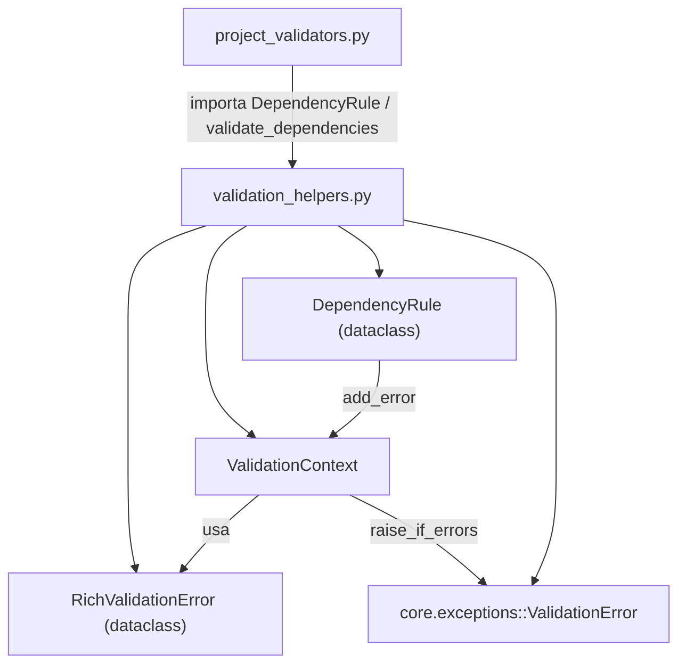

---
tags:
  - secinterp
  - code-walkthrough
  - core
  - validation
aliases:
  - validation_helpers.py
  - ValidationContext
  - RichValidationError
  - DependencyRule
  - validate_dependencies
  - validate_reasonable_ranges
cssclass: secinterp-note
---

# `core/validation/validation_helpers.py`

> [!abstract] Resumen en una línea
> Herramientas de Nivel 2 (validación de negocio): `ValidationContext` para **acumular** errores/avisos en vez de fallar rápido, `RichValidationError` como error con contexto, `DependencyRule` para reglas condicionales, y `validate_reasonable_ranges` para advertir valores extremos.

**Ruta**: `core/validation/validation_helpers.py` (195 líneas)
**Clases principales**: `RichValidationError`, `ValidationContext`, `DependencyRule`
**Capa**: Core (QGIS-agnóstico)
**Tags**: #secinterp #core #validation

---

## 🎯 ¿Por qué existe este archivo?

La validación de negocio no debe fallar con el primer error: es mejor **acumular todos**
los problemas y mostrarlos juntos. Este módulo aporta la infraestructura para ello:

| Problema | Solución |
|----------|----------|
| Mostrar todos los errores de golpe, no uno a uno | `ValidationContext` acumula en listas |
| Adjuntar contexto (campo, severidad, datos) a un error | `RichValidationError` (dataclass) |
| Modelar "si capa seleccionada ⇒ campo obligatorio" | `DependencyRule` (condition + check) |
| Avisar de valores extremos sin bloquear | `validate_reasonable_ranges` (solo warnings) |
| Convertir acumulación en una excepción única | `ValidationContext.raise_if_errors()` |

> [!important] Nota arquitectónica
> **QGIS-agnóstico.** Solo importa `ValidationError` del dominio y stdlib (`dataclasses`,
> `collections.abc`, `typing`). Es la capa que conecta los validadores `IValidator` con
> la excepción `ValidationError` final: acumula, decide severidad y dispara.

---

## 🧬 Diagrama de relaciones



> [!tip] Cómo leer
> Sólida = importa/usa. `ValidationContext` es el corazón: `DependencyRule` escribe en
> él, y `raise_if_errors()` lo convierte en `ValidationError`. `project_validators`
> consume las reglas y el rango razonable.

---

## 📦 Imports — lectura arquitectónica

```python
# core/validation/validation_helpers.py
from __future__ import annotations

from collections.abc import Callable
from dataclasses import dataclass, field
from typing import Any

from sec_interp.core.exceptions import ValidationError
```

| # | Observación |
|---|-------------|
| ① | `Callable` de `collections.abc` — para los callbacks de `DependencyRule`. |
| ② | `dataclass` + `field` — `RichValidationError` y `DependencyRule` son dataclasses. |
| ③ | `ValidationError` — única dependencia del dominio, lanzada por `raise_if_errors`. |
| ④ | `__all__` explícito al final (5 símbolos públicos) controla el API exportado. |
| ⑤ | Sin QGIS ni Qt: la validación de negocio es pura. |

---

## 🏗️ Inventario de estructura

**Clases (3):**

- `@dataclass RichValidationError` — error con severidad/contexto + `__str__`.
- `class ValidationContext` — acumulador con 5 propiedades y 3 métodos.
- `@dataclass DependencyRule` — regla condicional + `validate`.

**Funciones (5):**

- `validate_dependencies(rules, context) -> None`
- `validate_reasonable_ranges(values) -> list[str]`
- `_validate_vert_exag(value) -> list[str]`
- `_validate_buffer(value) -> list[str]`
- `_validate_dip_scale(value) -> list[str]`

**Constantes locales (umbrales):**

- `MAX_VE_THRESHOLD = 10`, `MIN_VE_THRESHOLD = 0.1`
- `MAX_BUFFER_DIST = 5000`
- `MAX_DIP_SCALE = 5`

---

## 📁 Archivos del paquete

`validation_helpers.py` es la infraestructura de acumulación del paquete:

| Archivo | Rol |
|---------|-----|
| `validation_helpers.py` | `ValidationContext`, `RichValidationError`, `DependencyRule` (este archivo) |
| `project_validator.py` | `ProjectValidator` + `ValidationParams` |
| `project_validators.py` | Validadores especializados que usan `DependencyRule` y `validate_reasonable_ranges` |
| `pipeline.py` | `ValidationPipeline` |
| `base_validator.py` | `IValidator` (ABC) |
| `field_validator.py` | Validación de campos |
| `layer_validator.py` | Validación espacial |
| `path_validator.py` | Validación de rutas |
| `validators.py` | Fábricas para dataclass |
| `layer_metadata.py` | `LayerMetadata` + constantes |

---

## 📖 Recorrido método por método

### `RichValidationError`

```python
@dataclass
class RichValidationError:
    message: str
    field_name: str | None = None
    severity: str = "error"  # error, warning, info
    context: dict[str, Any] = field(default_factory=dict)

    def __str__(self) -> str:
        prefix = f"[{self.severity.upper()}] " if self.severity != "error" else ""
        ctx_str = f" ({self.field_name})" if self.field_name else ""
        return f"{prefix}{self.message}{ctx_str}"
```

Un error "rico" con severidad y contexto. `__str__` compone: prefijo `[WARNING]` (solo
si no es `error`), mensaje y `(campo)` si existe. `context` es un dict libre con
`default_factory` para no compartir instancia entre errores.

| Campo | Rol |
|-------|-----|
| `message` | Mensaje legible |
| `field_name` | Campo asociado (clave para resaltar en la GUI) |
| `severity` | `"error"`, `"warning"` o `"info"` |
| `context` | Dict libre con detalles técnicos |

### `ValidationContext`

```python
class ValidationContext:
    def __init__(self) -> None:
        self._errors: list[RichValidationError] = []
        self._warnings: list[RichValidationError] = []

    def add_error(self, message: str, field_name: str | None = None, **kwargs) -> None:
        self._errors.append(RichValidationError(message, field_name, severity="error", context=kwargs))

    def add_warning(self, message: str, field_name: str | None = None, **kwargs) -> None:
        self._warnings.append(RichValidationError(message, field_name, severity="warning", context=kwargs))

    @property
    def has_errors(self) -> bool: ...
    @property
    def has_warnings(self) -> bool: ...
    @property
    def errors(self) -> list[RichValidationError]: ...
    @property
    def warnings(self) -> list[RichValidationError]: ...

    def merge(self, other: ValidationContext) -> None:
        self._errors.extend(other.errors)
        self._warnings.extend(other.warnings)

    def raise_if_errors(self) -> None:
        if self.has_errors:
            msg = "\n".join(str(e) for e in self._errors)
            raise ValidationError(msg, details={"errors": self._errors, "warnings": self._warnings})
```

El acumulador central. Separa **errores** (duros) de **warnings** (blandos). `merge`
permite combinar contextos. `raise_if_errors` une todos los errores con `"\n"` y lanza
**una** `ValidationError` con `details` que incluye ambos listados.

> [!tip] `**kwargs` → `context`
> `add_error(msg, "campo", extra="info")` guarda `extra="info"` en `RichValidationError.context`.
> Así cualquier dato técnico (por ejemplo `{"layer": "geology"}`) viaja junto al error.

### `DependencyRule`

```python
@dataclass
class DependencyRule:
    condition: Callable[[], bool]
    check: Callable[[], bool]
    error_message: str
    target_field: str | None = None

    def validate(self, context: ValidationContext) -> None:
        if self.condition() and not self.check():
            context.add_error(self.error_message, self.target_field)
```

Regla declarativa: **si** `condition()` es cierto y `check()` falla, se añade el error.
El par de callbacks permite expresar "si la capa está seleccionada, el campo debe estar
relleno" sin un `if` explícito en el consumidor.

| Campo | Rol |
|-------|-----|
| `condition` | Gate de la regla (p. ej. "hay capa de survey") |
| `check` | Condición que debe cumplirse (p. ej. "hay survey_id") |
| `error_message` | Mensaje si la regla falla |
| `target_field` | Campo al que asociar el error |

### `validate_dependencies`

```python
def validate_dependencies(rules: list[DependencyRule], context: ValidationContext) -> None:
    for rule in rules:
        rule.validate(context)
```

Evalúa una lista de reglas en lote sobre el mismo contexto. Es el helper que usa
`DrillholeValidator` para las reglas de survey e intervalo.

### `validate_reasonable_ranges`

```python
def validate_reasonable_ranges(values: dict[str, Any]) -> list[str]:
    warnings = []
    warnings.extend(_validate_vert_exag(values.get("vert_exag", 1.0)))
    warnings.extend(_validate_buffer(values.get("buffer", 0)))
    warnings.extend(_validate_dip_scale(values.get("dip_scale", 1.0)))
    return warnings
```

Punto de entrada para advertir valores extremos. No lanza errores; devuelve una lista de
cadenas de warning. Delegado en tres privados (`_validate_vert_exag`, `_validate_buffer`,
`_validate_dip_scale`).

### Helpers privados de rango

```python
def _validate_vert_exag(value: Any) -> list[str]:
    try:
        val = float(value)
        MAX_VE_THRESHOLD = 10
        MIN_VE_THRESHOLD = 0.1
        if val > MAX_VE_THRESHOLD:
            return [f"⚠ Vertical exaggeration ({val}) is very high. ..."]
        if val < MIN_VE_THRESHOLD:
            return [f"⚠ Vertical exaggeration ({val}) is very low. ..."]
        if val <= 0:
            return [f"❌ Vertical exaggeration ({val}) must be positive."]
    except (ValueError, TypeError):
        pass
    return []
```

Cada helper convierte a `float` (capturando `ValueError`/`TypeError`), compara contra
umbrales locales y devuelve un warning o lista vacía. `_validate_buffer` usa
`MAX_BUFFER_DIST = 5000`; `_validate_dip_scale` usa `MAX_DIP_SCALE = 5`.

| Helper | Umbral alto | Umbral bajo | Valor inválido |
|--------|-------------|-------------|----------------|
| `_validate_vert_exag` | `> 10` → "very high" | `< 0.1` → "very low" | `<= 0` → `❌ must be positive` |
| `_validate_buffer` | `> 5000` → "very large" | — | `< 0` → `❌ cannot be negative` |
| `_validate_dip_scale` | `> 5` → "very high" | — | `<= 0` → `❌ must be positive` |

> [!note] Emojis en mensajes
> Los warnings incluyen `⚠` y `❌` en el propio texto (frontera de i18n: no usan
> `TranslatableMixin`, a diferencia de `OutputValidator`).

---

## 🔄 Flujo de datos

| Fase | Entrada | Transformación | Salida |
|------|---------|----------------|--------|
| Acumulación | `context.add_error/add_warning` | append a `_errors`/`_warnings` | listas |
| Reglas | `list[DependencyRule]` | `rule.validate(context)` | errores condicionales |
| Rangos | `dict` de valores | `float()` + umbrales | `list[str]` warnings |
| Cierre | `context` | `raise_if_errors()` | `ValidationError` o nada |

---

## 🏛️ Patrones de diseño presentes

| Patrón | Dónde | Propósito |
|--------|-------|-----------|
| **Accumulator** | `ValidationContext` | Reunir errores antes de fallar |
| **Rule object** | `DependencyRule` | Encapsular condition/check/mensaje |
| **Value object** | `RichValidationError` | Error con severidad + contexto |
| **Collecting parameter** | `context` en `validate` | Pasar el acumulador por los validadores |
| **Null/empty object** | retorno `[]` | "sin warnings" como lista vacía |

---

## 🧾 Resumen de la API

| Símbolo | Firma / Hereda | Uso típico |
|---------|----------------|------------|
| `RichValidationError` | `@dataclass` | Error con severidad/contexto |
| `ValidationContext.add_error` | `(message, field_name=None, **kwargs) -> None` | Añadir error duro |
| `ValidationContext.add_warning` | `(message, field_name=None, **kwargs) -> None` | Añadir aviso |
| `ValidationContext.raise_if_errors` | `() -> None` | Lanzar `ValidationError` si hay errores |
| `DependencyRule.validate` | `(context) -> None` | Evaluar regla condicional |
| `validate_dependencies` | `(rules, context) -> None` | Evaluar reglas en lote |
| `validate_reasonable_ranges` | `(values) -> list[str]` | Warnings de valores extremos |

---

## 🛡️ Manejo de errores

La única excepción se lanza en `raise_if_errors()`:

| Situación | Comportamiento |
|-----------|----------------|
| Solo warnings | `raise_if_errors()` **no** lanza |
| Uno o más errores | lanza `ValidationError` con `"\n".join(...)` |
| `details` de la excepción | `{"errors": [...], "warnings": [...]}` |
| `float(value)` falla en rangos | `except (ValueError, TypeError): pass` → `[]` |

> [!important] Severidad separada de la excepción
> `ValidationContext` distingue error vs warning en listas separadas, pero
> `raise_if_errors` solo mira `has_errors`. Los warnings viajan en `details` de la
> excepción y la GUI puede decidir si mostrarlos como aviso.

---

## 🧪 Tests asociados

Casos mapeados a `tests/core/validation/test_validation_helpers.py` (y a
`tests/core/test_project_validator.py::test_validate_reasonable_ranges`):

- `test_add_error` — acumula error con `field_name` y `context` (`extra="info"`).
- `test_add_warning` — warning con `severity="warning"` y sin `has_errors`.
- `test_raise_if_errors` — con errores lanza `ValidationError`.
- `test_no_raise_if_only_warnings` — solo warnings no lanza.
- `test_rule_passed` / `test_rule_failed` / `test_rule_ignored` — `DependencyRule`.
- `test_valid_ranges` / `test_extreme_values` — `validate_reasonable_ranges`.
- `test_manual_ve_above_auto_clamp_still_warns` — VE manual `30.0` avisa (umbral 10) pero el clamp adaptativo se mantiene `[0.5, 20]`.

---

## 🔢 Ejemplo — acumulación y cierre

Flujo típico de un validador de dominio usando `ValidationContext` y `DependencyRule`:

```python
ctx = ValidationContext()

# Error directo
ctx.add_error("Buffer distance is required", "buffer_dist")

# Regla condicional: si hay survey, exigir survey_id
rules = [
    DependencyRule(
        condition=lambda: bool(params.survey_layer),
        check=lambda: bool(params.survey_id),
        error_message="Survey ID field is required",
        target_field="survey_id",
    ),
]
validate_dependencies(rules, ctx)

# Warning de valor extremo
for w in validate_reasonable_ranges({"vert_exag": 15.0}):
    ctx.add_warning(w)

# Cierre: lanza ValidationError con todos los errores (los warnings viajan en details)
ctx.raise_if_errors()
```

El resultado es una única `ValidationError` cuyo `message` es la unión de todos los
errores con `"\n"`, y cuyo `details` contiene `{"errors": [...], "warnings": [...]}`.
La GUI puede inspeccionar `details["errors"]` para resaltar campos concretos vía
`field_name`.

## 🧪 Relación con la jerarquía de excepciones

`raise_if_errors` es el **único** punto del paquete que conecta con `exceptions.py`:

| Componente | Excepción | Cuándo |
|------------|-----------|--------|
| `ValidationContext.raise_if_errors` | `ValidationError` | hay ≥1 error |
| `validators.py` (fábricas) | `ValidationError` | validación de dataclass falla |
| `field_validator` / `layer_validator` | (ninguna) | usan tuplas `(bool, str)` |
| `path_validator` | (ninguna) | usa tuplas `(bool, str, Path)` |

> [!important] Coherencia de capa
> Todo el framework de validación de proyecto converge en `ValidationError` (subclase de
> `SecInterpError`). Los componentes de bajo nivel evitan lanzar y delegan en el
> acumulador; solo los validadores de dataclass (`validators.py`) lanzan directamente.

---

## 👀 Observaciones y notas

> [!success] Fortalezas
> - Acumulación limpia de errores vs warnings (dos listas separadas).
> - `DependencyRule` expresa dependencias de forma declarativa y testable.
> - `raise_if_errors` concentra la excepción en un único punto.

> [!warning] Puntos de atención
> - Umbrales (`MAX_VE_THRESHOLD`, `MAX_BUFFER_DIST`, …) **hardcoded** y locales a cada helper.
> - Mensajes de warning con emojis `⚠`/`❌` y sin i18n.
> - `context` de `RichValidationError` es un `dict` sin esquema (los consumidores deben conocer las claves).

> [!question] Preguntas abiertas
> - ¿Centralizar los umbrales en constantes de módulo (o en config) para permitir ajustarlos?
> - ¿Tipar `context` con un `TypedDict` para documentar las claves esperadas?

---

## 🔗 Notas relacionadas

- [[Index]] — índice de la bóveda
- [[core_validation]] — nota de paquete del directorio `validation/`
- [[exceptions]] — `ValidationError` lanzada por `raise_if_errors`
- [[project_validators]] — consumidor de `DependencyRule` y `validate_reasonable_ranges`
- [[project_validator]] — `ValidationContext` en `validate_all`/`validate_preview_requirements`
- [[core_validation]] — paquete que incluye `base_validator.py` (`IValidator`)
- [[validators]] — fábricas de validación (estilo con excepciones)

---

*Nota de la bóveda SecInterp Code Walkthrough v2 — v3.9.1*
