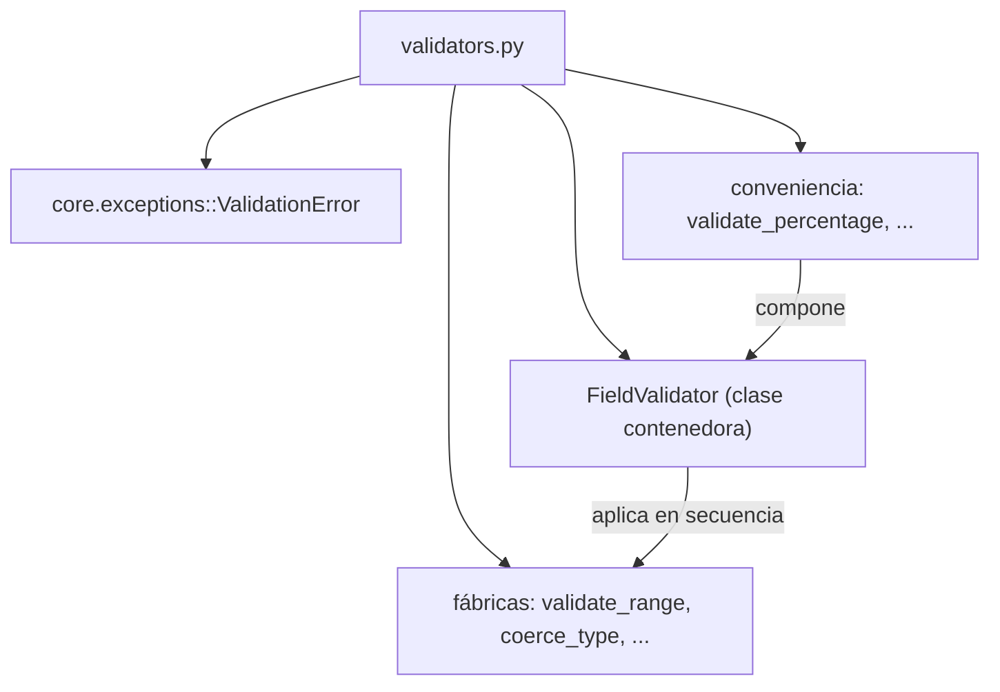

---
tags:
  - secinterp
  - code-walkthrough
  - core
  - validation
aliases:
  - validators.py
  - FieldValidator
  - validate_range
  - validate_positive
  - coerce_type
  - validate_and_clamp
  - validate_percentage
cssclass: secinterp-note
---

# `core/validation/validators.py`

> [!abstract] Resumen en una línea
> **Fábricas** de validadores reutilizables para campos de dataclass: funciones de orden superior que validan/coercionan valores y lanzan `ValidationError`, compuestas vía la clase `FieldValidator` (encadenamiento) y con helpers de conveniencia (porcentaje, probabilidad, entero positivo).

**Ruta**: `core/validation/validators.py` (252 líneas)
**Clases principales**: `FieldValidator`
**Capa**: Core (QGIS-agnóstico)
**Tags**: #secinterp #core #validation

---

## 🎯 ¿Por qué existe este archivo?

Validar y coercer campos de dataclass suele repetir el mismo patrón (`if`, `raise`).
Este módulo lo encapsula en **fábricas de validadores** componibles y sin dependencias
externas:

| Problema | Solución |
|----------|----------|
| Validar rango, positividad, no-negatividad… | fábricas `validate_range` / `validate_positive` / `validate_non_negative` |
| Coercer tipos (`"42"` → `42`) validando | `coerce_type` |
| Encadenar varios validadores en orden | `FieldValidator(*validators)` (llamable) |
| Clampear a rango sin lanzar error | `validate_and_clamp` |
| Patrones comunes (0-100, 0-1, int>0) | `validate_percentage` / `validate_probability` / `validate_positive_int` |

> [!important] Nota arquitectónica
> **QGIS-agnóstico** (solo `collections.abc`, `typing` y `ValidationError`). A
> diferencia de `field_validator.py` (que usa tuplas `(bool, str, valor)`), este módulo
> **lanza `ValidationError`**. Es el estilo orientado a dataclasses: cada validador es un
> `Callable[[T], T]` que devuelve el valor (posiblemente transformado) o lanza.

---

## 🧬 Diagrama de relaciones



> [!tip] Cómo leer
> Sólida = importa/compone. Las fábricas devuelven `Callable`; `FieldValidator` las
> aplica en cadena; las de conveniencia construyen un `FieldValidator` ya armado.

---

## 📦 Imports — lectura arquitectónica

```python
# core/validation/validators.py
from __future__ import annotations

from collections.abc import Callable
from typing import Any, TypeVar

from sec_interp.core.exceptions import ValidationError

T = TypeVar("T")
```

| # | Observación |
|---|-------------|
| ① | `Callable` de `collections.abc` — las fábricas devuelven `Callable[[float], float]`, etc. |
| ② | `TypeVar("T")` — tipo genérico nominal (aunque en la práctica se usa poco). |
| ③ | `ValidationError` — la única dependencia del dominio; cada validador la lanza. |
| ④ | Sin QGIS ni Qt: validación de dataclass pura y reusable. |

---

## 🏗️ Inventario de estructura

**Clases (1):**

- `class FieldValidator` — contenedor encadenable con `__init__` y `__call__`.

**Fábricas de validadores (6):**

- `validate_range(min_val, max_val, field_name="") -> Callable[[float], float]`
- `validate_positive(field_name="") -> Callable[[float], float]`
- `validate_non_negative(field_name="") -> Callable[[float], float]`
- `validate_non_empty(field_name="") -> Callable[[str], str]`
- `coerce_type(target_type, field_name="") -> Callable[[Any], Any]`
- `validate_and_clamp(min_val, max_val) -> Callable[[float], float]`

**Validadores compuestos de conveniencia (3):**

- `validate_percentage(field_name="") -> FieldValidator`
- `validate_probability(field_name="") -> FieldValidator`
- `validate_positive_int(field_name="") -> FieldValidator`

**Tipo genérico:** `T = TypeVar("T")`

---

## 📁 Archivos del paquete

`validators.py` es el conjunto de fábricas reutilizables del paquete `core/validation/`:

| Archivo | Rol |
|---------|-----|
| `validators.py` | Fábricas para campos de dataclass (este archivo) |
| `field_validator.py` | Validación de campos de capa (estilo tupla) |
| `layer_validator.py` | Validación espacial |
| `path_validator.py` | Validación de rutas |
| `validation_helpers.py` | `ValidationContext`, `DependencyRule` |
| `project_validator.py` | `ProjectValidator` + `ValidationParams` |
| `project_validators.py` | Validadores especializados |
| `layer_metadata.py` | `LayerMetadata` + constantes |
| `base_validator.py` | `IValidator` (ABC) |
| `pipeline.py` | `ValidationPipeline` |

---

## 📖 Recorrido método por método

### `validate_range`

```python
def validate_range(min_val: float, max_val: float, field_name: str = "") -> Callable[[float], float]:
    def validator(value: float) -> float:
        if not (min_val <= value <= max_val):
            raise ValidationError(
                f"{field_name or 'Value'} must be between {min_val} and {max_val}, got {value}"
            )
        return value
    return validator
```

Fábrica que devuelve un validador de rango **inclusivo**. La clausura captura
`min_val`/`max_val`/`field_name`. Si el valor está fuera, lanza `ValidationError`; si
no, devuelve el valor sin modificar.

### `validate_positive` / `validate_non_negative`

```python
def validate_positive(field_name: str = "") -> Callable[[float], float]:
    def validator(value: float) -> float:
        if value <= 0:
            raise ValidationError(f"{field_name or 'Value'} must be positive, got {value}")
        return value
    return validator


def validate_non_negative(field_name: str = "") -> Callable[[float], float]:
    def validator(value: float) -> float:
        if value < 0:
            raise ValidationError(f"{field_name or 'Value'} must be non-negative, got {value}")
        return value
    return validator
```

Dos matices de positividad: `validate_positive` exige `> 0` (el `0` falla);
`validate_non_negative` permite `0` (solo falla con negativos). Ambos usan el default
`field_name` → `"Value"` en el mensaje.

### `validate_non_empty`

```python
def validate_non_empty(field_name: str = "") -> Callable[[str], str]:
    def validator(value: str) -> str:
        if not value or not value.strip():
            raise ValidationError(f"{field_name or 'Field'} cannot be empty")
        return value.strip()
    return validator
```

Valida cadenas no vacías y **recorta** el valor (`return value.strip()`). A diferencia
de los numéricos, transforma la salida (normaliza espacios). Nota el default de nombre:
`"Field"` en vez de `"Value"`.

### `coerce_type`

```python
def coerce_type(target_type: type, field_name: str = "") -> Callable[[Any], Any]:
    def validator(value: Any) -> Any:
        if isinstance(value, target_type):
            return value
        try:
            return target_type(value)
        except (ValueError, TypeError) as e:
            raise ValidationError(
                f"{field_name or 'Field'} must be {target_type.__name__}, "
                f"got {type(value).__name__}: {e}"
            ) from e
    return validator
```

Coerciona el valor al tipo objetivo. Si ya es del tipo, lo devuelve; si no, intenta
`target_type(value)` y traduce `ValueError`/`TypeError` en `ValidationError` con `from e`
(encadenamiento de excepción). Es la base de los validadores compuestos.

### `validate_and_clamp`

```python
def validate_and_clamp(min_val: float, max_val: float) -> Callable[[float], float]:
    def validator(value: float) -> float:
        return max(min_val, min(max_val, float(value)))
    return validator
```

A diferencia de `validate_range`, **no lanza**: clampea al límite más cercano. Además
fuerza `float(value)`, así que acepta cadenas numéricas (`"50"` → `50.0`). Útil para
normalizar valores en vez de rechazarlos.

### `FieldValidator`

```python
class FieldValidator:
    def __init__(self, *validators: Callable[[Any], Any]) -> None:
        self.validators = validators

    def __call__(self, value: Any) -> Any:
        for validator in self.validators:
            value = validator(value)
        return value
```

Contenedor que encadena validadores. Al ser **llamable** (`__call__`), una instancia
`FieldValidator(coerce_type(float, "price"), validate_positive("price"))` se comporta
como una función: aplica cada validador en secuencia y propaga el valor transformado. El
primer validador que lance corta la cadena.

> [!tip] Composición en cadena
> ```python
> validator = FieldValidator(
>     coerce_type(float, "price"),
>     validate_positive("price"),
>     validate_range(0.0, 1000.0, "price"),
> )
> validated_value = validator("42.5")
> ```

### Validadores de conveniencia

```python
def validate_percentage(field_name: str = "") -> FieldValidator:
    return FieldValidator(coerce_type(float, field_name), validate_range(0.0, 100.0, field_name))

def validate_probability(field_name: str = "") -> FieldValidator:
    return FieldValidator(coerce_type(float, field_name), validate_range(0.0, 1.0, field_name))

def validate_positive_int(field_name: str = "") -> FieldValidator:
    return FieldValidator(coerce_type(int, field_name), validate_positive(field_name))
```

Tres `FieldValidator` pre-armados: porcentaje (`0..100`), probabilidad (`0..1`) y entero
positivo (`int` + `> 0`). Nótese que `validate_positive_int` usa `coerce_type(int)` que
**trunca** (`5.9` → `5`) antes de validar positividad.

| Helper | Coerción | Regla |
|--------|----------|-------|
| `validate_percentage` | `float` | `0.0..100.0` |
| `validate_probability` | `float` | `0.0..1.0` |
| `validate_positive_int` | `int` | `> 0` |

---

## 🔄 Flujo de datos

| Fase | Entrada | Transformación | Salida |
|------|---------|----------------|--------|
| Fábrica | parámetros (`min_val`, `field_name`…) | cierre de `validator` | `Callable` |
| Validación | valor crudo | chequeo o coerción | valor (o `ValidationError`) |
| Encadenado | valor + `FieldValidator` | aplica en secuencia | valor final |

---

## 🏛️ Patrones de diseño presentes

| Patrón | Dónde | Propósito |
|--------|-------|-----------|
| **Factory function** | todas las `validate_*` | Crear validadores parametrizados |
| **Closure** | validadores internos | Capturar configuración sin objeto |
| **Composite / Chain** | `FieldValidator` | Encadenar validadores en orden |
| **Callable object** | `__call__` | Usar instancia como función |
| **Coercer** | `coerce_type`, `validate_and_clamp` | Normalizar/transformar valor |
| **Exception chaining** | `raise ... from e` | Preservar causa en `coerce_type` |

---

## 🧾 Resumen de la API

| Símbolo | Firma / Hereda | Uso típico |
|---------|----------------|------------|
| `validate_range` | `(min_val, max_val, field_name="") -> Callable[[float], float]` | Rango inclusivo |
| `validate_positive` | `(field_name="") -> Callable[[float], float]` | Valor `> 0` |
| `validate_non_negative` | `(field_name="") -> Callable[[float], float]` | Valor `>= 0` |
| `validate_non_empty` | `(field_name="") -> Callable[[str], str]` | Cadena no vacía (y recortada) |
| `coerce_type` | `(target_type, field_name="") -> Callable[[Any], Any]` | Coerción de tipo |
| `validate_and_clamp` | `(min_val, max_val) -> Callable[[float], float]` | Clampear sin lanzar |
| `FieldValidator` | `(*validators) -> callable` | Encadenar validadores |
| `validate_percentage` | `(field_name="") -> FieldValidator` | `0..100` |
| `validate_probability` | `(field_name="") -> FieldValidator` | `0..1` |
| `validate_positive_int` | `(field_name="") -> FieldValidator` | Entero positivo |

---

## 🛡️ Manejo de errores

A diferencia del resto del paquete (que acumula en `ValidationContext`), este módulo
**lanza `ValidationError`** de inmediato:

| Situación | Comportamiento |
|-----------|----------------|
| Fuera de rango | `ValidationError("... must be between ...")` |
| `value <= 0` en `validate_positive` | `ValidationError("... must be positive ...")` |
| Cadena vacía | `ValidationError("... cannot be empty")` |
| Coerción fallida | `ValidationError("... must be {type} ...") from e` |
| Clampeo | **no lanza** (ajusta al límite) |

> [!important] Dos filosofías en el paquete
> `field_validator.py`/`layer_validator.py` usan tuplas `(bool, str, valor)`; `validators.py`
> usa excepciones. La elección depende del contexto: las tuplas son para validación de
> proyecto (acumular), las excepciones para validación de **dataclass** (fallar rápido).

---

## 🧪 Tests asociados

Casos mapeados a `tests/core/validation/test_validators.py`:

- `TestValidateRange` — dentro/fuera de rango, sin `field_name`.
- `TestValidatePositive` — positivo ok; `0` y negativo lanzan.
- `TestValidateNonNegative` — `0` ok; negativo lanza.
- `TestValidateNonEmpty` — recorte de espacios; vacío/espacios lanzan.
- `TestCoerceType` — tipo ya correcto, coerción ok, coerción fallida, a string.
- `TestValidateAndClamp` — dentro, por debajo/encima (clampea), string.
- `TestFieldValidator` — uno/múltiples validadores, orden de cadena.
- `TestConvenienceValidators` — `validate_percentage`, `validate_probability`, `validate_positive_int`.

---

## 🔢 Ejemplo — validación completa de un campo

Combinando coerción + positividad + rango en un único `FieldValidator`:

```python
price_validator = FieldValidator(
    coerce_type(float, "price"),
    validate_positive("price"),
    validate_range(0.0, 1000.0, "price"),
)

price_validator("42.5")   # -> 42.5  (str -> float -> positiva -> en rango)
price_validator("abc")    # -> ValidationError: "price must be float, got str: ..."
price_validator("-3")     # -> ValidationError: "price must be positive, got -3.0"
price_validator("2000")   # -> ValidationError: "price must be between 0.0 and 1000.0"
```

El orden importa: `coerce_type` convierte la cadena a `float` **antes** de que
`validate_positive`/`validate_range` comparen. Si se invirtiera el orden, comparar una
cadena contra un `float` fallaría con `TypeError` (o mensajes confusos).

## ⚖️ Tuplas `(bool, str)` vs excepciones

Dentro de `core/validation/` conviven dos convenciones de error. Esta tabla resume
cuándo usar cada una:

| Criterio | Tupla (`field_validator`, `layer_validator`) | Excepción (`validators.py`) |
|----------|----------------------------------------------|-----------------------------|
| Retorno | `(bool, str, valor?)` | valor o `ValidationError` |
| Fallo rápido | No (acumula si hay `context`) | Sí |
| Propósito | Validación de proyecto/Nivel 1-2 | Validación de dataclass |
| Composibilidad | Manual (concatenar `if not is_valid`) | `FieldValidator` (cadena) |
| Mensaje de éxito | `""` en segunda posición | no aplica |
| Transformación | Solo parseo (`float`/`int`) | Sí (`coerce_type`, `strip`, `clamp`) |

> [!tip] Regla práctica
> Si necesitas **mostrar todos los errores de una vez** ante el usuario, usa tuplas +
> `ValidationContext`. Si necesitas **fallar rápido al construir un objeto** (dataclass),
> usa las fábricas de `validators.py`.

## 📋 Referencia de docstrings

Cada fábrica documenta sus parámetros, retorno y excepción en estilo Google:

| Función | `Raises` documentado | Transforma salida |
|---------|---------------------|-------------------|
| `validate_range` | `ValidationError` si fuera de rango | no |
| `validate_positive` | `ValidationError` si `<= 0` | no |
| `validate_non_negative` | `ValidationError` si `< 0` | no |
| `validate_non_empty` | `ValidationError` si vacío | sí (`strip`) |
| `coerce_type` | `ValidationError` si conversión falla | sí (`target_type(value)`) |
| `validate_and_clamp` | (ninguna) | sí (clampeo) |

> [!note] `validate_and_clamp` es la excepción
> Es el único validador que **no** documenta `Raises`: clampea en vez de fallar.

---

## 👀 Observaciones y notas

> [!success] Fortalezas
> - Fábricas componibles y sin dependencias externas.
> - `FieldValidator` ofrece encadenamiento elegante vía `__call__`.
> - `coerce_type` + `validate_positive_int` cubren los patrones de dataclass más comunes.

> [!warning] Puntos de atención
> - `validate_positive_int` trunca flotantes (`5.9` → `5`), lo que puede sorprender.
> - `T = TypeVar("T")` declarado pero apenas usado (tipado laxo en `Any`).
> - Dos estilos de error conviven en el paquete (tuplas vs excepciones), sin regla explícita.

> [!question] Preguntas abiertas
> - ¿Hacer que `validate_positive_int` rechace no-enteros en vez de truncar?
> - ¿Tipar mejor las fábricas con `TypeVar`/`ParamSpec` para perder menos información?

---

## 🔗 Notas relacionadas

- [[Index]] — índice de la bóveda
- [[core_validation]] — nota de paquete del directorio `validation/`
- [[exceptions]] — `ValidationError` lanzada por cada validador
- [[field_validator]] — validadores de capa (estilo tupla, complementario)
- [[validation_helpers]] — `ValidationContext` (estilo acumulador)
- [[dtos]] — posibles consumidores para validar campos de dataclass
- [[domain]] — `FieldType` y tipos del dominio

---

*Nota de la bóveda SecInterp Code Walkthrough v2 — v3.9.1*
