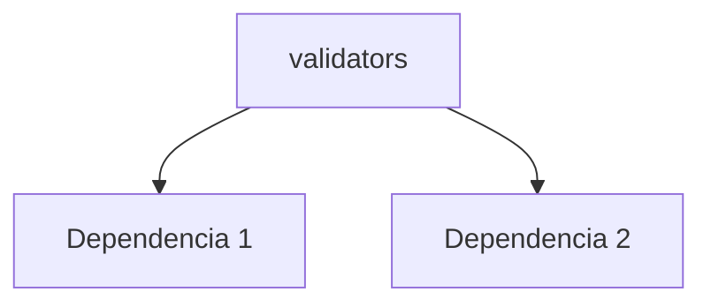

---
tags:
  - secinterp
  - code-walkthrough
  - core      # core | gui | exporters
  - validation     # services | managers | renderers | adapters | validation | etc.
aliases:
  - validators.py  # ej. path_resolver.py
  - validators     # ej. resolve_export_path
cssclass: secinterp-note
# note_lines: 700      # opcional: tope > 500 para módulos de importancia alta (máx 700)
---

# `core/validation/validators.py`

> [!abstract] Resumen en una línea
> Reusable validators for dataclass fields. — qué hace este módulo en una frase, sin tocar QGIS si es core.

**Ruta**: `core/validation/validators.py` (252 líneas)
**Clase/Función principal**: `validators`
**Capa**: core (QGIS-agnóstico / GUI · Tipo)
**Tags**: #secinterp #core #validation

---

## 🎯 ¿Por qué existe este archivo?

| Problema | Solución |
|----------|----------|
| (pendiente) | (pendiente) |
| (pendiente) | (pendiente) |

> [!important] Nota arquitectónica
> QGIS-agnóstico (p. ej. "QGIS-agnóstico", "Adapter Extract", "Factory").

---

## 🧬 Diagrama de relaciones



> [!tip] Cómo leer
> Flecha sólida = importa/delega; punteada = callback/injectado.

---

## 📦 Imports — lectura arquitectónica

```python
# validators.py
from __future__ import annotations
from collections.abc import Callable
from typing import Any, TypeVar
from sec_interp.core.exceptions import ValidationError
```

| # | Observación |
|---|-------------|
| ① | (pendiente) |
| ② | (pendiente) |

---

## 🏗️ Inventario de estructura

**Clases:** `class FieldValidator` — 2 métodos
**Constantes:** `T`
**Funciones/Métodos:**
- `validate_range(def validate_range(min_val: float, max_val: float, field_name: str='') -> Callable[[float], float]:)`
- `validate_positive(def validate_positive(field_name: str='') -> Callable[[float], float]:)`
- `validate_non_negative(def validate_non_negative(field_name: str='') -> Callable[[float], float]:)`
- `validate_non_empty(def validate_non_empty(field_name: str='') -> Callable[[str], str]:)`
- `coerce_type(def coerce_type(target_type: type, field_name: str='') -> Callable[[Any], Any]:)`
- `validate_and_clamp(def validate_and_clamp(min_val: float, max_val: float) -> Callable[[float], float]:)`
- `FieldValidator.__init__(def __init__(self, *validators: Callable[[Any], Any]) -> None:)`
- `FieldValidator.__call__(def __call__(self, value: Any) -> Any:)`
- `validate_percentage(def validate_percentage(field_name: str='') -> FieldValidator:)`
- `validate_probability(def validate_probability(field_name: str='') -> FieldValidator:)`
- `validate_positive_int(def validate_positive_int(field_name: str='') -> FieldValidator:)`

---

## 📁 Archivos del paquete

- `validators.py` — nota individual de este archivo.

---

## 📖 Recorrido método por método

### `método_1`

```python
# (enriquecer)
```

_(enriquecer leyendo el fuente)_

### `método_2`

```python
# (enriquecer)
```

_(enriquecer leyendo el fuente)_

<!-- Añade una subsección por cada método público del módulo -->

---

## 🔄 Flujo de datos

| Fase | Entrada | Transformación | Salida |
|------|---------|----------------|--------|
| - | - | - | - |
| - | - | - | - |

---

## 🏛️ Patrones de diseño presentes

| Patrón | Dónde | Propósito |
|--------|-------|-----------|
| - | - | - |

---

## 🧾 Resumen de la API

| Símbolo | Firma / Hereda | Uso típico |
|---------|----------------|------------|
| `validate_range`, `validate_positive`, `validate_non_negative`, `validate_non_empty`, `coerce_type`, `validate_and_clamp`, `validate_percentage`, `validate_probability`, `validate_positive_int` | `-` | - |

---

## 🛡️ Manejo de errores

_(pendiente)_

---

## 🧪 Tests asociados

_(pendiente)_

---

## 👀 Observaciones y notas

> [!success] Fortalezas
> - (skeleton)

> [!warning] Puntos de atención
> - (skeleton)

> [!question] Preguntas abiertas
> - (skeleton)

---

## 🔗 Notas relacionadas

- [[Index]] — índice de la bóveda
- [[Index]] — índice
- [[controller]] — orquestador

---

*Nota de la bóveda SecInterp Code Walkthrough v2 — v3.8.0*
