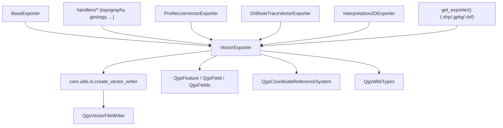

---
tags:
  - secinterp
  - code-walkthrough
  - exporters
  - vector
aliases:
  - vector_exporter.py
  - VectorExporter
cssclass: secinterp-note
---

# `exporters/vector_exporter.py`

> [!abstract] Resumen en una línea
> Exporter vectorial genérico SHP/GPKG/DXF: convierte listas de `{geometry, attributes}` en capas OGR mediante `QgsVectorFileWriter` creado por el helper `core.utils.io`, con tipos de campo inferidos del primer feature.

**Ruta**: `exporters/vector_exporter.py` (122 líneas)
**Clase principal**: `VectorExporter(BaseExporter)`
**Capa**: Exporters (acoplado a `qgis.core`: es el lado "Write" tras el Compute del core)
**Tags**: #secinterp #exporters #vector

---

## 🎯 ¿Por qué existe este archivo?

Los handlers del orquestador trabajan con datos ya calculados (DTOs del dominio,
geometrías QGIS extraídas en la GUI). Falta el último paso: **escribirlos** como capas
reales en disco con CRS, campos y tipo de geometría correctos:

| Problema | Solución |
|----------|----------|
| Escribir SHP, GPKG y DXF con una sola clase | `VectorExporter` + `format_ext` (`.shp`/`.gpkg`/`.dxf`) decidido por settings |
| Configurar `QgsVectorFileWriter` sin repetir sus 6+ parámetros | Delegación en `scu_io.create_vector_writer(...)` de `core/utils/io` |
| Campos OGR sin esquema previo | `_prepare_fields()` infiere `Int`/`Double`/`QString` del primer feature |
| `QgsFeature` mal alineados con los campos | `_write_features()` mapea por **nombre** de campo, no por posición |
| Fallos OGR que romperían la GUI | Toda excepción se registra y se devuelve `False` |

> [!important] Nota arquitectónica
> Este módulo vive **deliberadamente** fuera del core: importa `qgis.core` porque su
> trabajo es I/O geoespacial, no cálculo. El core nunca lo importa; el orquestador lo
> alcanza con imports lazy (ver [[orchestrator]]) y los handlers traducen el `False` a
> `ExportError`.

---

## 🧬 Diagrama de relaciones



> [!tip] Cómo leer
> `VectorExporter` es el **hub** vectorial: cuatro familias de exporters especializados
> heredan de él y la factoría lo elige para tres extensiones. Todo el trabajo OGR real
> pasa por `create_vector_writer` (ver [[io]]).

---

## 📦 Imports — lectura arquitectónica

```python
# exporters/vector_exporter.py
from __future__ import annotations

from pathlib import Path
from typing import Any

from qgis.core import (
    QgsCoordinateReferenceSystem,
    QgsFeature,
    QgsField,
    QgsFields,
    QgsVectorFileWriter,
    QgsWkbTypes,
)
from qgis.PyQt.QtCore import QMetaType

from sec_interp.core.utils import io as scu_io
from sec_interp.logger_config import get_logger

from .base_exporter import BaseExporter
```

| # | Observación |
|---|-------------|
| ① | Seis símbolos de `qgis.core`: este módulo **exige QGIS inicializado** (no es importable en tests puros sin mocks). |
| ② | `QMetaType` (Qt, no QGIS) para tipar campos: `Int` / `Double` / `QString`. |
| ③ | `core.utils.io as scu_io`: la creación del writer vive en el core-utils para reutilizarla (ver [[io]]). |
| ④ | `get_logger(__name__)`: errores OGR y excepciones se registran aquí, nunca se lanzan. |
| ⑤ | Hereda de `.base_exporter`: contrato `export()`, `validate_path()`, `get_setting()`. |

---

## 🏗️ Inventario de estructura

**Clases:** `class VectorExporter(BaseExporter)` — 1 clase, 4 métodos.

**Métodos:**

- `get_supported_extensions() -> list[str]` — `[".shp", ".gpkg", ".dxf"]`
- `export(output_path: Path, features_data: list[dict[str, Any]], layer_name: str | None = None) -> bool` — escritura completa
- `_write_features(writer: QgsVectorFileWriter, features_data: list[dict[str, Any]], fields: QgsFields) -> None` — bucle de escritura
- `_prepare_fields(features_data: list[dict[str, Any]]) -> QgsFields` — inferencia de esquema

**Settings consumidos (vía `get_setting` heredado):**

| Clave | Defecto | Rol |
|-------|---------|-----|
| `geometry_type` | `QgsWkbTypes.Type.LineString` | Tipo WKB de la capa de salida |
| `crs` | `QgsCoordinateReferenceSystem("EPSG:4326")` | CRS si el llamador no lo fija |
| `symbology_export` | `QgsVectorFileWriter.SymbologyExport.NoSymbology` | Exportar o no la simbología (DXF) |

---

## 📁 Archivos del paquete

| Archivo | Líneas | Rol |
|---|--:|---|
| `__init__.py` | 81 | `get_exporter()`: `.shp`/`.gpkg`/`.dxf` → `VectorExporter` |
| `base_exporter.py` | 137 | Contrato `BaseExporter` (ver [[base_exporter]]) |
| `vector_exporter.py` | 122 | `VectorExporter` — hub vectorial (esta nota) |
| `csv_exporter.py` | 58 | `CSVExporter` — gemelo tabular de cada export vectorial |
| `dxf_exporter.py` | 126 | `DXFExporter` — variante CAD con `_prepare_fields` defensivo |
| `profile_exporters.py` | — | Cuatro subclases que fijan `geometry_type`/`crs` por entidad |
| `drillhole_exporters.py` | — | Trazas e intervalos como líneas/puntos |
| `interpretation_exporters.py` | — | `Interpretation2DExporter` |

> [!note] Patrón de uso en los handlers
> Cada handler (`topography`, `geology`, `structures`, …) construye `features_data`
> desde los DTOs del dominio y llama a `export()` con el `crs` de la línea de sección
> (ver [[orchestrator]] y [[core_services_export_handlers]]).

---

## 📖 Recorrido método por método

### `get_supported_extensions`

```python
def get_supported_extensions(self) -> list[str]:
    """Get supported vector format extensions."""
    return [".shp", ".gpkg", ".dxf"]
```

Tres formatos OGR con una sola implementación. El `format_ext` (`.shp` por defecto,
`.gpkg`/`.dxf` según `settings.export.default_format`) lo decide el orquestador; esta
clase solo escribe lo que le piden. `.gpkg` admite `layer_name` (contenedor
multicapa); `.shp` lo ignora.

### `export` — escritura completa

```python
def export(
    self,
    output_path: Path,
    features_data: list[dict[str, Any]],
    layer_name: str | None = None,
) -> bool:
    if not features_data:
        return False

    try:
        geometry_type = self.get_setting("geometry_type", QgsWkbTypes.Type.LineString)
        crs = self.get_setting("crs", QgsCoordinateReferenceSystem("EPSG:4326"))
        symb_mode = self.get_setting(
            "symbology_export", QgsVectorFileWriter.SymbologyExport.NoSymbology
        )

        fields = self._prepare_fields(features_data)
        writer = scu_io.create_vector_writer(
            output_path,
            crs,
            fields,
            geometry_type,
            layer_name=layer_name,
            symbology_export=symb_mode,
        )

        if writer.hasError() != QgsVectorFileWriter.WriterError.NoError:
            logger.error(f"Failed to create writer: {writer.errorMessage()}")
            return False

        self._write_features(writer, features_data, fields)

        # Note: writer is closed when object is deleted or goes out of scope
        del writer

    except Exception:
        logger.exception(f"Vector export failed for {output_path}")
        return False
    else:
        return True
```

| Paso | Detalle |
|------|---------|
| Guardia | `features_data` vacío → `False` inmediato (el handler decide si eso es error o early-return legítimo) |
| Settings | Lee `geometry_type`, `crs` y `symbology_export` con defectos seguros |
| Esquema | `_prepare_fields()` infiere los `QgsField` del primer elemento |
| Writer | `create_vector_writer` encapsula driver OGR, encoding y `layer_name` para GPKG |
| Chequeo OGR | `hasError()` se verifica **antes** de escribir; el mensaje OGR queda en el log |
| Cierre | `del writer` fuerza el flush: sin él, el archivo puede quedar incompleto |

> [!warning] `del writer` es load-bearing
> `QgsVectorFileWriter` escribe al destruirse. Si una refactorización guarda el writer
> en un atributo o alarga su vida, el archivo puede quedar a medio escribir.

> [!tip] Esqueleto compartido con DXF
> `DXFExporter.export()` replica estos pasos uno a uno; ver [[dxf_exporter]] para la
> comparativa de `_prepare_fields` defensivo frente a este.

### `_write_features` — mapeo por nombre de campo

```python
def _write_features(
    self,
    writer: QgsVectorFileWriter,
    features_data: list[dict[str, Any]],
    fields: QgsFields,
) -> None:
    for data in features_data:
        feature = QgsFeature(fields)
        if "geometry" in data:
            feature.setGeometry(data["geometry"])
        if "attributes" in data:
            attrs = data["attributes"]
            feature.setAttributes([attrs.get(field.name()) for field in fields])
        writer.addFeature(feature)
```

Cada dict aporta `geometry` (un `QgsGeometry` ya construido por el handler) y
`attributes` (dict nombre→valor). El mapeo por **nombre** (`attrs.get(field.name())`)
tolera dicts con claves extra o en otro orden; un atributo ausente escribe `NULL`.
No hay validación de geometría nula aquí: OGR la acepta o el writer la registra.

### `_prepare_fields` — inferencia de tipos

```python
def _prepare_fields(self, features_data: list[dict[str, Any]]) -> QgsFields:
    """Create fields based on first feature's attributes."""
    fields = QgsFields()
    if features_data and "attributes" in features_data[0]:
        first_attrs = features_data[0]["attributes"]
        for key, value in first_attrs.items():
            if isinstance(value, int):
                fields.append(QgsField(key, QMetaType.Type.Int))
            elif isinstance(value, float):
                fields.append(QgsField(key, QMetaType.Type.Double))
            else:
                fields.append(QgsField(key, QMetaType.Type.QString))
    return fields
```

| Tipo Python | Tipo OGR | Nota |
|-------------|----------|------|
| `int` | `Int` | Incluye `bool` (subclase de `int`): se guarda como 0/1 |
| `float` | `Double` | Cotas, distancias, buzamientos |
| resto (`str`, `None`, …) | `QString` | `None` → campo texto con `NULL` |

> [!warning] Solo mira el primer feature
> Si el segundo feature trae una clave nueva, **se pierde** (no hay campo). Y si un
> valor es `int` en el primero pero `str` después, OGR intentará una conversión que
> puede truncar. Los handlers deben homogeneizar antes de llamar.

---

## 🔄 Flujo de datos

| Fase | Entrada | Transformación | Salida |
|------|---------|----------------|--------|
| DTOs | `PreviewResult` / listas del dominio | handlers extraen `geometry` + `attributes` | `features_data: list[dict]` |
| Esquema | primer `attributes` | inferencia `int/float/str` → `QgsField` | `QgsFields` |
| Escritura | `(writer, features_data, fields)` | un `QgsFeature` por dict, mapeo por nombre | archivo `.shp`/`.gpkg`/`.dxf` |
| Resultado | éxito/fracaso | `bool` (+ `ExportError` en el handler si `False`) | mensaje en `result_msg` |

---

## 🧩 Limitaciones por formato

| Formato | Limitación | Mitigación en el código |
|---------|------------|-------------------------|
| **Shapefile** | Nombres de campo truncados a 10 caracteres; sin tipos 64-bit ni `NULL` real en DBF | Nombres cortos definidos en los handlers; `QString` como tipo refugio |
| **Shapefile** | Una sola geometría por archivo; sin curvas | `geometry_type` fijado por entidad en `profile_exporters.py` |
| **DXF** | 2D esencialmente: la Z se aplana según el driver OGR | Las exportaciones 3D usan `drillhole_3d_exporter` / `interpretation_3d_exporter`, no este path |
| **DXF** | Ancho de campos de texto y capas limitados por el driver | `symbology_export` configurable (`NoSymbology` por defecto) |
| **GPKG** | `layer_name` requerido para multientidad | Parámetro `layer_name` propagado hasta `create_vector_writer` |

---

## 🏛️ Patrones de diseño presentes

| Patrón | Dónde | Propósito |
|--------|-------|-----------|
| **Template Method** | `export()` implementa el contrato de [[base_exporter]] | Escritura con guardias y retorno `bool` |
| **Strategy (formato)** | `format_ext` + `get_exporter()` | Misma clase, tres drivers OGR |
| **Schema inference** | `_prepare_fields()` | Derivar `QgsFields` sin esquema declarado |
| **Name-based mapping** | `_write_features()` | Desacoplar orden de claves del orden de campos |
| **Fail-soft** | `except Exception → False` | No propagar fallos OGR a la GUI |

---

## 🧾 Resumen de la API

| Símbolo | Firma / Hereda | Uso típico |
|---------|----------------|------------|
| `VectorExporter` | `(BaseExporter)` | `VectorExporter({"crs": line_crs, "geometry_type": …})` |
| `export` | `(output_path: Path, features_data: list[dict[str, Any]], layer_name: str \| None = None) -> bool` | Escritura SHP/GPKG/DXF |
| `get_supported_extensions` | `() -> list[str]` | `[".shp", ".gpkg", ".dxf"]` |
| `_write_features` | `(writer, features_data, fields) -> None` | Bucle interno de escritura |
| `_prepare_fields` | `(features_data) -> QgsFields` | Inferencia desde el primer feature |

---

## 🛡️ Manejo de errores

| Situación | Comportamiento |
|-----------|----------------|
| `features_data` vacío o `None` | `return False` sin tocar disco |
| `writer.hasError()` tras crear | `logger.error` con `errorMessage()` OGR + `return False` |
| Excepción cualquiera (CRS inválido, disco lleno, driver ausente) | `logger.exception` con traceback + `return False` |
| `False` aguas arriba | El handler lanza `ExportError("… export failed")` (ver [[compat]]) |
| Geometría nula en un item | Se escribe el feature sin geometría; OGR decide |

---

## 🧪 Tests asociados

Mock-first en `tests/exporters/test_vector_exporter.py` (`QgsVectorFileWriter` mockeado):

- `test_get_supported_extensions` — las tres extensiones declaradas.
- `test_export_success` — writer sin error + features escritos → `True`.
- `test_export_empty_data` — lista vacía → `False` sin crear writer.
- `test_export_writer_error` — `hasError() != NoError` → `False` y log del mensaje OGR.
- `test_export_exception_handling` — excepción en `create_vector_writer` → `False`.

Cobertura cruzada:

- `tests/exporters/test_exporters.py` — contrato `BaseExporter` compartido.
- `tests/integration/test_export_service_e2e.py` — escritura real SHP/GPKG (`test_export_topography_creates_shp`, geología e interpretaciones).
- `tests/integration/test_vector_drivers_integration.py` — drivers OGR disponibles en el entorno QGIS.
- `tests/integration/test_export_workflow.py` — flujo completo orquestador → handlers → writer.

---

## 👀 Observaciones y notas

> [!success] Fortalezas
> - Un solo hub para tres formatos: añadir GPKG fue cambiar `format_ext`, no duplicar clases.
> - Mapeo por nombre de campo: robusto ante dicts heterogéneos de los handlers.
> - Creación del writer delegada en `core/utils/io`: testeable y reutilizada por DXF.
> - Subclases por entidad (`profile_exporters`, `drillhole_exporters`) fijan `geometry_type` sin tocar esta clase.

> [!warning] Puntos de atención
> - Inferencia solo del primer feature: claves tardías se pierden en silencio.
> - `bool` es `int`: un flag `True` crea campo `Int`, no texto.
> - CRS por defecto `EPSG:4326` si el llamador olvida `crs`: los handlers siempre lo fijan desde `line_layer.crs()`, pero el defecto es peligroso.
> - `del writer` como mecanismo de flush es implícito y frágil ante refactors.

> [!question] Preguntas abiertas
> - ¿Unificar el esquema inferido recorriendo **todos** los features (unión de claves)?
> - ¿Exigir `crs` obligatorio en settings en lugar del defecto `EPSG:4326`?
> - ¿Cerrar el writer con context manager si `create_vector_writer` lo soporta en el futuro?

---

## 🔗 Notas relacionadas

- [[Index]] — índice de la bóveda
- [[base_exporter]] — contrato `BaseExporter` que implementa
- [[exporters]] — nota de capa del paquete
- [[io]] — `create_vector_writer`, creador real del writer OGR
- [[dxf_exporter]] — gemelo CAD con `_prepare_fields` defensivo
- [[csv_exporter]] — gemelo tabular de cada escritura vectorial
- [[profile_exporters]] / [[drillhole_exporters]] — subclases por entidad
- [[orchestrator]] — decide `format_ext` y despacha a handlers
- [[compat]] — traduce `False` a `ExportError`
- [[dialog_export_manager]] — GUI que elige formato y carpeta
- [[dtos]] — `PreviewResult`, origen de los datos exportados

---

*Nota de la bóveda SecInterp Code Walkthrough v2 — v3.9.1*
